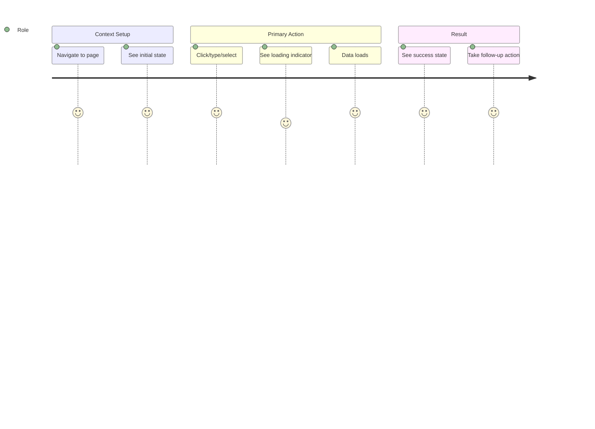

# /linear — iPix Linear Issue Lifecycle with Full Enrichment

**Purpose:** Complete Linear issue lifecycle with automatic Phase 1 enrichment (mermaid diagrams, wireframes, API wiring, user stories, design references).

**Usage:**
```
/linear IPI-NNN [IPI-MMM ...]
```

---

## What This Command Does

1. **Loads issue(s)** from Linear via `ipix-task-lifecycle`
2. **Checks for design references** in `Universal design prompt/`
3. **Adds Phase 1 enrichment** if missing:
   - Mermaid diagrams (sequence, state, component tree, journey)
   - ASCII wireframes (desktop + mobile)
   - API wiring tables (routes, auth, types)
   - User stories (3 per issue)
   - User journey (mermaid diagram)
4. **Loads relevant skills** based on issue type:
   - Frontend → `shadcn`, `ipix-wireframe`
   - Backend → `ipix-supabase`, `mastra`
   - AI/Gemini → `mastra`, `gen-test`
   - Design → references `Universal design prompt/*.html`
5. **Syncs enriched spec** back to Linear
6. **Suggests next steps** (dependencies, implementation order)

---

## Command Implementation

When invoked, execute these steps:

### Step 1: Load Issue(s)
```bash
# Read Linear issue via skill
ipix-task-lifecycle IPI-NNN
```

### Step 2: Detect Issue Type & Load Skills

**Frontend UI Issue:**
- Skills: `ipix-wireframe`, `mermaid-diagrams`, `shadcn`, `feature-design-assistant`
- Design ref: Match issue title to `Universal design prompt/*.html`

**Backend API Issue:**
- Skills: `ipix-supabase`, `mermaid-diagrams`, `gen-test`
- Auth: Always `withOperatorAuth` + `createSupabaseServerClient`

**AI/Agent Issue:**
- Skills: `mastra`, `mermaid-diagrams`, `gen-test`
- Mastra docs: Load `mcp__mastra__searchMastraDocs`

**Full-Stack Feature:**
- Skills: All of the above
- Sequence: Backend → Frontend → Integration tests

### Step 3: Check Design Reference

```bash
# Match issue title/description to design files
ls "Universal design prompt/" | grep -i "<component-name>"
```

**Common mappings:**
| Issue Topic | Design File |
|-------------|-------------|
| Brand Detail / Intelligence Panel | `Brand Detail.v2.image-first.dc.html` |
| Brand List | `Brand List.v2.image-first.dc.html` |
| Shoots List | `Shoots List.v2.image-first.dc.html` |
| Shoot Wizard | `Shoot Wizard.v2.image-first.dc.html` |
| Assets | `Assets.v2.image-first.dc.html` |
| Campaigns | `Campaigns.v2.image-first.dc.html` |
| Command Center | `Command Center.v2.image-first.dc.html` |
| Onboarding | `Onboarding.v2.zeely.dc.html` |
| Channel Preview | `Channel Preview.v2.image-first.dc.html` |
| Matching | `Matching.v2.image-first.dc.html` |
| Component Library | `Component Library.dc.html` |

### Step 4: Add Phase 1 Enrichment

#### A. Mermaid Diagrams

**Always include:**
```markdown
## Sequence Diagram
\`\`\`mermaid
sequenceDiagram
    participant U as User/Component
    participant A as API Route
    participant S as Supabase
    participant M as Mastra (if AI)
    
    U->>A: Request
    A->>S: Query
    S-->>A: Data
    A-->>U: Response
\`\`\`

## State Diagram
\`\`\`mermaid
stateDiagram-v2
    [*] --> Loading
    Loading --> Success: data loaded
    Loading --> Error: fetch failed
    Success --> Empty: no data
    Success --> Loaded: has data
\`\`\`

## Component Tree (if frontend)
\`\`\`mermaid
flowchart TD
    Parent --> Child1
    Parent --> Child2
    Child1 --> Grandchild
\`\`\`

## User Journey
\`\`\`mermaid
journey
    title <User role> <accomplishes task>
    section Context
      Start at route: 5: Role
      See intelligence panel: 5: Role
    section Action
      Click button: 5: Role
      Complete task: 5: Role
\`\`\`
```

#### B. Wireframes

**Desktop + Mobile ASCII wireframes:**
```
Desktop (1440px):
┌─────────────────────────────────────────┐
│ Header                                  │
├───────┬─────────────────────────┬───────┤
│ Nav   │ Content                 │ Panel │
│ 240px │ flex-1                  │ 320px │
└───────┴─────────────────────────┴───────┘

Mobile (375px):
┌───────────────┐
│ Header        │
├───────────────┤
│ Content       │
│               │
│ (full width)  │
└───────────────┘
```

#### C. API Wiring

**Always include this table:**
```markdown
| Route | Status | Auth | Returns | RLS |
|---|---|---|---|---|
| GET /api/... | 🔴 create | withOperatorAuth | { ... } | ✅ |
```

**Auth Pattern Template:**
```typescript
export async function GET(request: Request) {
  try {
    await withOperatorAuth(request);
  } catch (e) {
    if (e instanceof OperatorAuthError) {
      return NextResponse.json({ error: "Unauthorized" }, { status: 401 });
    }
    throw e;
  }
  
  const svc = await createSupabaseServerClient();
  // Query with RLS enforcement
}
```

#### D. User Stories

**Generate 3 user stories per issue:**
```markdown
### Story 1: <Primary user role> <main action>
**As a** <Role>  
**I want** <Goal>  
**So that** <Benefit>

**Acceptance:** <Testable outcome>

### Story 2: <Secondary user role> <edge case>
**As a** <Role>  
**I want** <Goal>  
**So that** <Benefit>

**Acceptance:** <Testable outcome>

### Story 3: <Admin/Operator role> <management task>
**As an** <Role>  
**I want** <Goal>  
**So that** <Benefit>

**Acceptance:** <Testable outcome>
```

**User Roles for iPix:**
- Brand Manager
- Creative Director
- Campaign Manager
- Operator
- Marketing Lead

#### E. Dependencies Check

**Always list:**
```markdown
## Dependencies

**Required:**
- IPI-XXX ✅ (base feature)
- Supabase table `xyz` ✅ (already exists)

**Optional (enhances):**
- IPI-YYY (related feature)

**Setup:**
- `npm install <package>` (if new dependency)
- Supabase migration (if schema change)
```

### Step 5: Sync to Linear

```bash
node scripts/linear-update-issue.mjs IPI-NNN
```

### Step 6: Run task-verifier

After enrichment, verify implementation readiness:

```bash
/task-verifier IPI-NNN
```

This runs the forensic protocol:
1. Source-of-truth check (CLAUDE.md, specs, skills)
2. Current-state verification (disk probes, Supabase MCP)
3. Dependency validation
4. Scope validation
5. Skills/MCP validation
6. Spec quality gate
7. Anti-fake-done rule

Output: spec quality score + execution readiness score + blockers.

**Gate:** Do not mark "Ready for implementation" until task-verifier returns ✅ Safe to execute.

### Step 7: Suggest Next Steps

**Output format:**
```
━━━━━━━━━━━━━━━━━━━━━━━━━━━━━━━━━━
  LINEAR ISSUE ENRICHMENT COMPLETE
━━━━━━━━━━━━━━━━━━━━━━━━━━━━━━━━━━

Issue: IPI-NNN — <Title>
Spec: docs/linear/issues/IPI-NNN-<slug>.md
Linear: https://linear.app/amo100/issue/IPI-NNN

✅ Mermaid diagrams: sequence, state, component tree, journey
✅ Wireframes: desktop + mobile
✅ API wiring: routes, auth, types
✅ User stories: 3 stories + acceptance criteria
✅ Dependencies: checked
✅ Design ref: <file>.html

━━━━━━━━━━━━━━━━━━━━━━━━━━━━━━━━━━

NEXT STEPS:

1. Review enriched spec:
   cat docs/linear/issues/IPI-NNN-<slug>.md

2. Start implementation:
   /task IPI-NNN

3. Or continue planning:
   - Add more user stories: /linear IPI-NNN --stories
   - Update diagrams: /mermaid-diagrams
   - Refine wireframe: /ipix-wireframe

━━━━━━━━━━━━━━━━━━━━━━━━━━━━━━━━━━

SUGGESTED DEPENDENCIES:

<List of related IPI issues or setup steps>

━━━━━━━━━━━━━━━━━━━━━━━━━━━━━━━━━━
```

---

## Skills Auto-Loaded

Based on issue detection:

| Pattern | Skills Loaded |
|---------|---------------|
| "Intelligence Panel" | `ipix-task-lifecycle`, `mermaid-diagrams`, `ipix-wireframe`, `shadcn` |
| "API route" / "endpoint" | `ipix-task-lifecycle`, `ipix-supabase`, `gen-test`, `mermaid-diagrams` |
| "Mastra" / "agent" / "AI" | `ipix-task-lifecycle`, `mastra`, `gen-test`, `mermaid-diagrams` |
| "Supabase" / "RLS" / "migration" | `ipix-task-lifecycle`, `ipix-supabase`, `mermaid-diagrams` |
| "component" / "UI" / "design" | `ipix-task-lifecycle`, `ipix-wireframe`, `mermaid-diagrams`, `shadcn` |
| "CopilotKit" / "chat" | `ipix-task-lifecycle`, `copilotkit`, `mastra`, `mermaid-diagrams` |
| "test" / "coverage" | `ipix-task-lifecycle`, `gen-test`, `per-task-testing` |

---

## Design File Auto-Detection

**Logic:**
1. Extract key terms from issue title (e.g., "Brand Detail", "Shoot Wizard")
2. Match to design file in `Universal design prompt/`
3. Add reference in spec:
   ```markdown
   ## Design Reference
   
   **File:** `Universal design prompt/Brand Detail.v2.image-first.dc.html`
   **Section:** Intelligence Panel
   ```
4. If multiple matches, list all:
   ```markdown
   **Related designs:**
   - Brand Detail.v2.image-first.dc.html § Intelligence Panel
   - Component Library.dc.html § AssetGrid
   ```

---

## Additional User Stories — Generation Rules

**Generate stories based on issue type:**

### UI Component Issue
1. **Primary user** using the component in normal flow
2. **Edge case** — empty state, error state, loading state
3. **Admin/Operator** managing or configuring the component

### API Route Issue
1. **Frontend** calling the API successfully
2. **Error handling** — auth failure, validation error
3. **Admin/Operator** monitoring or debugging the API

### AI/Agent Feature
1. **User** asking the AI for help and getting a response
2. **Edge case** — AI provides clarification or asks for more info
3. **Operator** reviewing AI suggestions for quality

### Full-Stack Feature
1. **End-to-end** happy path
2. **Partial failure** — backend succeeds, frontend shows stale data
3. **Admin** verifying the feature works across all user types

---

## Journey Diagrams — Generation Rules

**Structure:**


**Sentiment scores:**
- 5 = Delightful / Smooth
- 4 = Good / Expected
- 3 = Neutral / Acceptable
- 2 = Frustrating / Confusing
- 1 = Broken / Blocking

---

## Frontend/Backend Setup — Auto-Suggested

### Frontend Dependencies
```json
{
  "dependencies": {
    "@radix-ui/react-*": "latest",  // if new shadcn component
    "swr": "^2.2.0",                 // if new data fetch
    "zod": "^3.22.0"                 // if new schema validation
  }
}
```

### Backend Dependencies
```json
{
  "dependencies": {
    "@mastra/core": "latest",        // if new Mastra tool
    "@supabase/supabase-js": "^2.x"  // already included
  }
}
```

### Supabase Setup
If new table/column/RLS:
```bash
# Create migration
npm run supabase:migration create <name>

# Add to migration file:
# - CREATE TABLE / ALTER TABLE
# - CREATE POLICY (RLS)
# - CREATE INDEX (if query-heavy)

# Test locally
npm run supabase:reset

# Push to remote
npm run supabase:push
```

### Mastra Setup
If new tool/agent:
```typescript
// 1. Create tool: app/src/mastra/tools/<name>.ts
// 2. Register in: app/src/mastra/index.ts
// 3. Test: app/src/mastra/tools/<name>.test.ts
```

---

## Example Invocation

```bash
/linear IPI-284

# Output:
# Loading IPI-284 from Linear...
# ✓ Intelligence Panel: Asset Thumbnail Grid
# 
# Detecting issue type... Frontend + Backend API
# Loading skills: ipix-wireframe, mermaid-diagrams, ipix-supabase, gen-test
# 
# Design reference found: Brand Detail.v2.image-first.dc.html
# 
# Generating Phase 1 enrichment...
# ✓ Sequence diagram (API flow)
# ✓ State diagram (loading/success/error)
# ✓ Component tree (AssetsGrid hierarchy)
# ✓ User journey (Brand Manager reviews assets)
# ✓ Wireframes (desktop + mobile)
# ✓ API wiring (GET /api/brands/[id]/assets)
# ✓ User stories (3 generated)
# ✓ Dependencies checked (IPI-255, Supabase assets table)
# 
# Syncing to Linear...
# ✓ IPI-284 updated
# 
# Spec saved: docs/linear/issues/IPI-284-asset-thumbnail-grid.md
# 
# NEXT: /task IPI-284 to start implementation
```

---

## Flags (Optional)

```bash
/linear IPI-NNN --stories        # Generate 5 additional user stories
/linear IPI-NNN --diagrams       # Regenerate all mermaid diagrams
/linear IPI-NNN --wireframe      # Regenerate wireframes only
/linear IPI-NNN --sync           # Sync spec to Linear (no regeneration)
/linear IPI-NNN --dependencies   # Deep-check all dependencies
```

---

## Contract

- **Always** check `Universal design prompt/` for design reference
- **Always** generate user stories + journey diagram
- **Always** include API wiring table if backend component
- **Always** sync enriched spec back to Linear
- **Never** skip Phase 1 enrichment for new issues
- **Never** overwrite existing enrichment without `--force` flag
