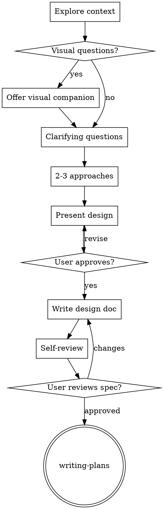

# Brainstorming Ideas Into Designs

Turn ideas into designs and specs through dialogue. Start with project context, then refine
one question at a time. Get approval before any code.

<HARD-GATE>
Do NOT invoke implementation skills, write code, scaffold, or ship until design is presented
and the user approves. Applies to every project regardless of perceived simplicity.
</HARD-GATE>

## iPix context (read first)

- Canonical tracker: `docs/plan/todo.md` · issue specs: `docs/linear/issues/IPI-*.md`
- Product SSOT: `prd.md` · `mvp.md` · `docs/prd/`
- App surface: `app/` (Next.js operator) — not legacy `src/`
- For IPI work: prefer `ipix-task-lifecycle` Phase 1 after design approval

## Checklist

Complete in order:

1. **Explore project context** — `docs/plan/todo.md`, relevant `IPI-*.md`, graphify if multi-file
2. **Offer visual companion** (optional, UI topics) — own message only; see Visual Companion
3. **Ask clarifying questions** — one at a time; purpose / constraints / success criteria
4. **Propose 2–3 approaches** — trade-offs + recommendation
5. **Present design** — sections scaled to complexity; approval after each section
6. **Write design doc** — `docs/plan/tasks/YYYY-MM-DD-<topic>-design.md`
7. **Spec self-review** — placeholders, contradictions, scope, ambiguity
8. **User reviews written spec** — wait for approval
9. **Transition** — invoke [`writing-plans`](../writing-plans/SKILL.md)

For structured Q&A on large features, optionally load
[`feature-design-assistant`](../ipix-task-lifecycle/references/feature-design-assistant.md).

## Process Flow

**Terminal state is `writing-plans` only.** Do not invoke `frontend-design`, `feature-dev`, or
implementation skills until the plan exists.

## After the Design

**Save to:** `docs/plan/tasks/YYYY-MM-DD-<topic>-design.md`

**Self-review:** TBD scan · internal consistency · single-plan scope · disambiguate requirements

**User gate:**

> "Spec written to `<path>`. Review and confirm before we write the implementation plan."

**Next:** [`writing-plans`](../writing-plans/SKILL.md) → `docs/plan/tasks/YYYY-MM-DD-<feature>.md`

## Key Principles

- One question at a time · multiple choice when possible
- YAGNI · 2–3 approaches before settling · incremental validation
- Follow existing `app/` patterns; no unrelated refactors

## Visual Companion

Optional browser mockups for layout/wireframe questions. Offer once, own message only.
Guide: [`visual-companion.md`](visual-companion.md)

Use browser for visual comparisons; terminal for requirements and tradeoffs.
