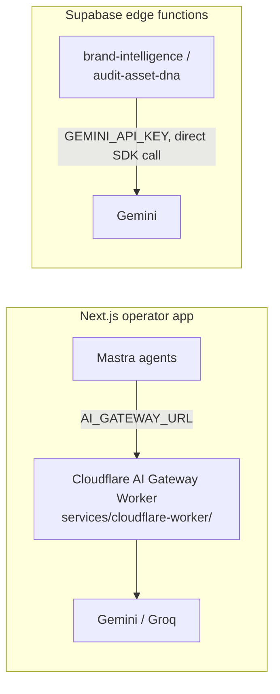

# ipix-supabase — Supabase hub

Single entry point for all Supabase work on **iPix / Lumina Studio**. Combines iPix topic files + child skills + [`references/project-rules/`](references/project-rules/).

**Load child `SKILL.md` on demand** — do not paste their bodies here.

---

## Folded topics (load on demand from `references/`)

> **Consolidation note:** the former standalone skills `edge-functions`, `supabase`,
> `supabase-cli`, and `supabase-postgres-best-practices` are now `references/` inside this hub.
> Behavior preserved; only the packaging changed.

| User intent | Reference |
|-------------|-----------|
| **Start here** — iPix project, PLT tables, remote-only, verify-rls | *(this hub)* `SKILL.md` + topic files (`postgres.md`, `realtime.md`, `storage.md`, …) |
| Deno edge functions, JWT, Gemini in functions | [`references/edge-functions/edge-functions.md`](references/edge-functions/edge-functions.md) + [`edge-functions.md`](edge-functions.md) + [`references/edge-functions/edge-functions-inventory.md`](references/edge-functions/edge-functions-inventory.md) — see **Edge Functions reference index** below |
| Generic migrations, RLS SQL, DB functions, schema, SQL style | [`references/supabase-core/supabase-core.md`](references/supabase-core/supabase-core.md) (+ `MIGRATIONS/RLS-POLICIES/FUNCTIONS/SCHEMA/SQL-STYLE.md`) + `references/project-rules/` |
| Supabase **CLI** workflows (`supabase` CLI, local/remote) | [`references/cli/cli.md`](references/cli/cli.md) |
| Query perf, indexes, connection pooling, EXPLAIN | [`references/postgres-best-practices.md`](references/postgres-best-practices.md) → detail in [`references/postgres/`](references/postgres/) (already mirrored) |

### Edge Functions reference index (`references/edge-functions/`)

| File | Topic | When to load |
|------|-------|-------------|
| [`edge-functions.md`](references/edge-functions/edge-functions.md) | Entry point — Deno.serve, CORS, JWT, DB access | Always first for edge function work |
| [`architecture.md`](references/edge-functions/architecture.md) | Serverless at edge, global distribution, cold starts | Debugging performance or runtime behaviour |
| [`cli.md`](references/edge-functions/cli.md) | `supabase functions new/serve/deploy/invoke` | Creating, serving locally, or deploying |
| [`Configuration.md`](references/edge-functions/Configuration.md) | Per-function `config.toml` — JWT toggle, import maps | Function needs non-default auth or deploy opts |
| [`dependencies.md`](references/edge-functions/dependencies.md) | npm / esm.sh / deno.land, import maps, vendoring | Adding or updating a package |
| [`development.md`](references/edge-functions/development.md) | Local dev — `functions serve`, env vars, Docker | Setting up or troubleshooting local dev |
| [`custom-routing.md`](references/edge-functions/custom-routing.md) | Multi-route functions, path/method matching | Consolidating actions into one function |
| [`secrets.md`](references/edge-functions/secrets.md) | `supabase secrets set/list`, default env vars | Adding API keys or sensitive config |
| [`testing.md`](references/edge-functions/testing.md) | `Deno.test` — HTTP, auth, DB test patterns | Writing or debugging function tests |
| [`ai-models.md`](references/edge-functions/ai-models.md) | Supabase AI API — embeddings, LLM inference | Adding AI/embedding calls inside a function |

### Routing decision tree

```
Supabase task in iPix
  ├─ Which project / table / MVP policy?         → this SKILL.md + topic files
  ├─ Edge function (Deno, CORS, Gemini)?          → references/edge-functions/edge-functions.md
  ├─ Migration, RLS policy, Postgres function?    → references/supabase-core/supabase-core.md + references/project-rules/
  ├─ Supabase CLI workflow?                       → references/cli/cli.md
  └─ Slow query, index, EXPLAIN, pool limits?     → references/postgres-best-practices.md + references/postgres/
```

---

## When NOT to use

- **Mercur catalog** (products, orders, sellers) — lives on Mercur Postgres, not Supabase
- **Auth0 / Clerk / Firebase** as primary auth — iPix uses Supabase Auth (PLT-002)
- **Raw Postgres** without Supabase client, RLS, or Edge Functions in scope

## Triggers

supabase, RLS, auth.uid, edge function, Deno.serve, verify_jwt, storage bucket, signed URL, migration, supabase-js, service role, publishable key, brands, brand_scores, ai_agent_logs, verify-rls, remote-only.

---

## Project identity

| Key | Value |
|-----|-------|
| **Project ref** | `nvdlhrodvevgwdsneplk` |
| **Dashboard** | https://supabase.com/dashboard/project/nvdlhrodvevgwdsneplk |
| **Policy** | **Remote-only for MVP** — do not run `supabase start` |
| **Commerce** | **Mercur** — never duplicate product/order tables in Supabase |

Canonical ops: [`supabase/README.md`](../../../supabase/README.md)  
Roadmap & issue index: [`docs/linear/issues/README.md`](../../../docs/linear/issues/README.md)

### MCP / CLI trust

1. Prefer **Supabase CLI `--linked`** for SQL and migration state.
2. **`npm run supabase:verify-rls`** after every RLS change (19 checks).
3. Cursor **`user-supabase` MCP** may show legacy Medellín/FashionOS objects — **ignore** unless MCP is confirmed on `nvdlhrodvevgwdsneplk`.
4. Use CLI when plugin MCP returns permission errors.

---

## iPix MVP tables (PLT-001)

| Table | Purpose |
|-------|---------|
| `brands` | Operator brand profiles (`user_id`, `ai_profile` jsonb) |
| `brand_scores` | DNA scores (`score_type`, `score`, `details`) |
| `commerce_product_links` | Supabase ↔ Mercur `medusa_product_id` |
| `ai_agent_logs` | Agent runs (`duration_ms`, tokens, model) |
| `assets` | + `brand_id`, `dna_score`, `dna_status`, `dna_pillars` |
| `profiles` | PLT-002 sync with `auth.users` |
| `shoots` | Shoot metadata (legacy, still used) |

Legacy FashionOS tables coexist on the shared project — do not extend them for iPix MVP without audit ([SEC-001 / IPI-52](https://linear.app/amo100/issue/IPI-52) · [issues README](../../../docs/linear/issues/README.md)).

Full orientation: [references/tables-overview.md](references/tables-overview.md)

---

## Repo coordinates

| What | Where |
|------|-------|
| Supabase client (canonical) | `app/src/lib/supabase/server.ts`, `session.ts` |
| Supabase client (legacy) | `src/lib/supabase.ts` — remove after [IPI-89](https://linear.app/amo100/issue/IPI-89) |
| Types | `src/types/supabase.ts` (regenerate: `npm run supabase:types`) — **⚠️ if regenerating via the Supabase MCP `generate_typescript_types` tool instead of the CLI, it silently outputs `public` schema only and drops `planner`/`graphql_public`/any other exposed schema, even though `supabase/config.toml`'s `schemas = [...]` lists all three. Confirmed on IPI-536/PR #347: it nearly deleted the entire `planner` schema's types. Always run `git diff --stat` on the types file before trusting MCP-generated output — if the diff is mostly deletions, don't commit it; hand-add just the new entry to the existing file instead.** |
| Auth UI | `app/src/app/(marketing)/login`, `app/src/app/auth/callback/route.ts` |
| Profile sync | `app/src/lib/onboarding.ts` (`createOrgAndBrand`) · legacy `src/services/profileService.ts` |
| Edge functions | `supabase/functions/<name>/index.ts` |
| Migrations | `supabase/migrations/` |
| RLS verify | `scripts/verify-rls.mjs` → `npm run supabase:verify-rls` |
| Client env | `NEXT_PUBLIC_SUPABASE_*` in `app/` only (post–IPI-89) |
| Server secrets | `SUPABASE_SERVICE_ROLE_KEY`, `GEMINI_API_KEY` (edge/Mastra only) |

---

## Daily commands

```bash
cd /home/sk/ipix
export $(grep -v '^#' .env.local | xargs)

npm run supabase:verify
npm run supabase:verify-rls
npm run supabase:migrations
npm run supabase:types
npm run supabase:push    # after new migration SQL reviewed
```

### New migrations (remote-only)

```bash
supabase migration new <name>
# edit supabase/migrations/<timestamp>_<name>.sql

# If db push blocked by orphan migration — see supabase/README.md:
supabase db query --linked --file supabase/migrations/<file>.sql
supabase migration repair --status applied <timestamp> --linked

npm run supabase:types
npm run supabase:verify-rls
```

**IPI-126 / BI-OPS-002 gate:** push `20260625000000_brand_scores_unique_update_rls.sql` → `verify-rls` (includes `brand_scores` UPDATE probe) → onboarding smoke on `/app/onboarding` → marks [IPI-46](https://linear.app/amo100/issue/IPI-46) Done. Run after IPI-46 code is on `main`; this is the **remote apply** slice of IPI-46 B3–B4. Tracker: [IPI-126](https://linear.app/amo100/issue/IPI-126) · [issues README](../../../docs/linear/issues/README.md).

**IPI-26 / IPI-BI-003 ([spec](../../../docs/linear/issues/IPI-26-IPI-BI-003.md)):** After IPI-46 + IPI-126 Done — Postgres enum `brand_intake_status` (7 states on `brands`; HITL on `brand_intake_drafts.status`); 4 new tables + indexes; `score_version`/`source` on `brand_scores`; **alter** `brand_intake_drafts` RLS; extend `verify-rls.mjs` for all 5 tables; explicit Realtime publication + `pg_publication_tables` verify. Do not duplicate IPI-126 migration.

Do **not** rewrite applied remote history. **PLT-010** (squash / local Docker) is **deferred**.

---

## Path-scoped rules — [`references/project-rules/`](references/project-rules/)

| Topic | File |
|-------|------|
| Client usage, RLS mindset, schema habits | [supabase-patterns.md](references/project-rules/supabase-patterns.md) |
| Migration file conventions | [supabase-migrations.md](references/project-rules/supabase-migrations.md) |
| RLS policy SQL patterns | [supabase-rls-policies.md](references/project-rules/supabase-rls-policies.md) |
| Postgres functions | [supabase-database-functions.md](references/project-rules/supabase-database-functions.md) |
| Edge Functions (Deno) | [supabase-edge-functions.md](references/project-rules/supabase-edge-functions.md) |
| Realtime | [supabase-realtime.md](references/project-rules/supabase-realtime.md) |
| SQL style | [supabase-sql-style.md](references/project-rules/supabase-sql-style.md) |

---

## Core principles

1. **Database is source of truth.** RLS enforces this — not frontend state.
2. **Verify, don't assume.** Run advisors + `verify-rls` before declaring done.
3. **Service-role key never reaches the browser.** Edge functions / CLI only. No `VITE_*`.
4. **Every new iPix table has RLS.** No exceptions in `public`.
5. **`(SELECT auth.uid())` not `auth.uid()`** in RLS — cached per query.

---

## Routing — read topic files on demand

| User intent | Read |
|-------------|------|
| Auth, profiles, GoTrue, session | [client-and-auth.md](client-and-auth.md) + [`references/auth/`](references/auth/) |
| Edge functions, Gemini, deploy | [edge-functions.md](edge-functions.md) + [references/edge-functions/edge-functions.md](references/edge-functions/edge-functions.md) + [references/edge-functions/edge-functions-inventory.md](references/edge-functions/edge-functions-inventory.md) |
| AI edge patterns | [references/edge-functions/ai-edge-functions.md](references/edge-functions/ai-edge-functions.md) |
| Schema / table groups | [references/tables-overview.md](references/tables-overview.md) |
| Query perf, indexes, advisors | [postgres.md](postgres.md) + [references/postgres-best-practices.md](references/postgres-best-practices.md) + [references/postgres/](references/postgres/) |
| Realtime channels | [realtime.md](realtime.md) |
| Storage buckets, signed URLs | [storage.md](storage.md) |

---

## iPix edge functions (as-built — verified live 2026-07-20)

| Function | Purpose |
|----------|---------|
| `health` | Liveness |
| `edge-test` | Authenticated Gemini smoke (replaces legacy `gemini-ping`) |
| `brand-intelligence` | URL → brand profile (Gemini + urlContext + responseSchema) |
| `start-brand-crawl` | Firecrawl v2 crawl job start (IPI-24) |
| `capture-lead` | Public lead capture from the marketing chatbot (WEB-015.2) -- writes `chatbot_conversations`/`chatbot_messages`/`lead_intake_drafts` |
| `firecrawl-webhook` | Firecrawl signed webhook → `brand_crawls` / `brand_crawl_results` |
| `audit-asset-dna` | Image DNA scoring — writes `assets.dna_score`/`dna_status`/`dna_pillars` |

**Do not** copy Medellín/mde edge functions from MCP inventory — different product.

Full per-function detail (verify_jwt, models, secrets): [references/edge-functions/edge-functions-inventory.md](references/edge-functions/edge-functions-inventory.md). After adding functions: also update `supabase/config.toml` → run [scripts/verify-edge-inventory.sh](scripts/verify-edge-inventory.sh).

### Two separate Gemini call paths -- do not conflate them

This repo has **two independent routes to Gemini**, not one:



- **Mastra agents** (the Next.js operator app) call out through the Cloudflare AI Gateway Worker -- see `app/src/lib/ai/provider-adapter.ts` (`AI_GATEWAY_URL`) and CLAUDE.md's Cloudflare section.
- **Supabase edge functions** (`brand-intelligence`, `audit-asset-dna`) call Gemini **directly** via the `GoogleGenAI` SDK + the `GEMINI_API_KEY` secret (`supabase/functions/_shared/gemini.ts`) -- they do **not** go through the Cloudflare Worker at all.

Don't assume Cloudflare AI Gateway guidance applies to edge functions, or that edge-function Gemini calls show up in Cloudflare AI Gateway logs -- they won't.

---

## Storage (PLT-011 — Cloudinary, not Supabase Storage)

**MVP decision:** Cloudinary holds bytes; Supabase holds metadata in `assets` + optional `cloudinary_assets`.

- Folder: `ipix/{user_id}/{brand_id}/{asset_id}`
- Edge: `cloudinary-sign` (signed upload params), `register-asset` (persist row)
- Secrets: `CLOUDINARY_*` edge-only — see `docs/supabase/secrets-inventory.md`
- Spec: `docs/linear/issues/IPI-30-PLT-011.md`
- **Do not** create `ipix-assets` Supabase buckets for MVP unless explicitly re-approved

Legacy FashionOS `storage` buckets and shoot-scoped RLS remain — extend with brand-owner policies via forward migration.

---

## Auth (PLT-002)

- **Operator:** `app/src/app/(operator)/app/*` — session via Supabase SSR (`app/src/lib/supabase/server.ts`, `session.ts`)
- **Login:** `app/src/app/(marketing)/login` · callback `app/src/app/auth/callback/route.ts`
- **Legacy Vite:** `/login` + `ProtectedRoute` in `src/` — retire with [IPI-89](https://linear.app/amo100/issue/IPI-89)
- Google OAuth: `signInWithOAuth({ provider: "google" })` with redirect to `/app`
- Prod redirect URLs: [IPI-125](https://linear.app/amo100/issue/IPI-125)

### Auth references — `references/auth/`

| File | When to load |
|------|-------------|
| [`architecture.md`](references/auth/architecture.md) | Debugging auth flow, JWT issuance, GoTrue internals |
| [`google.md`](references/auth/google.md) | Google OAuth setup, Google Cloud Console config, One Tap |
| [`facebook.md`](references/auth/facebook.md) | Facebook OAuth setup, App Review, email permission |
| [`sessions.md`](references/auth/sessions.md) | JWT expiry, refresh tokens, session limits, unexpected logouts |
| [`users.md`](references/auth/users.md) | User object schema, RLS with auth.uid(), app_metadata vs user_metadata |
| [`Identities.md`](references/auth/Identities.md) | Multiple identities per user, identity linking, anonymous users |
| [`nextjs.md`](references/auth/nextjs.md) | Auth setup for `app/` Next.js operator hub (PKCE, cookie auth) |

---

## Universal security checklist

- **`user_metadata` is user-editable** — never authorize from it
- **UPDATE needs SELECT** RLS policy
- **Storage upsert needs INSERT + SELECT + UPDATE** policies
- **Service role never in `app/` or `src/`**
- Extend `scripts/verify-rls.mjs` when adding tenant-scoped tables
- **`maybeSingle()`/`single()` calls MUST check `error` before checking for a missing row.** `maybeSingle()` returns `{ data: null, error: null }` on a genuine miss but `{ data: null, error: PostgrestError }` on a real DB/RLS/network failure — treating both the same way (`if (!data) notFound()`) silently converts real outages into a misleading 404. Found via 3 independent PR reviewers flagging the exact same line on IPI-536/PR #347. Always: `const { data, error } = await ...; if (error) throw error; if (!data) notFound();` — never skip the error check.
- **A bulk-access RLS policy does not automatically cover "can a user see their own row."** `assignments_select_org` (`supabase/migrations/20260709000000_planner_schema_rls.sql:468-470`) required manager+ to `SELECT` *any* `planner.assignments` row, including the caller's own — so a contributor/viewer checking their own permissions got zero rows and was treated as unassigned (P1 bug, PR #347). Any time you write an RLS policy for "managers/owners can see everyone's records," ask the separate question **"can a user see their own record too?"** at write time — if yes, add a narrow `SECURITY DEFINER` RPC hard-scoped to `auth.uid()` (never a caller-supplied user id) alongside the bulk policy, don't wait for a reviewer to find the gap. See `public.planner_get_my_assignment` (migration `20260712235000`) for the pattern.

---

## Pre-ship checklist

- [ ] Migration applied on remote (repair if orphan blocks push)
- [ ] `npm run supabase:types` if schema changed
- [ ] `npm run supabase:verify-rls` passes
- [ ] No service role or Gemini key in client bundle
- [ ] Edge function CORS + JWT documented in Linear spec

---

## Companion skills

- [`ipix-task-lifecycle`](../ipix-task-lifecycle/SKILL.md) — Linear issue steps + verifier probes
- [`gemini`](../gemini/SKILL.md) — Gemini in edge functions

## Source of truth

| Location | Role |
|----------|------|
| `.claude/skills/ipix-supabase/` | The one Supabase skill — hub + iPix topic files + `references/` (incl. folded edge-functions, supabase-core, cli, postgres-best-practices) |

---

## References (deep dives)

- [references/postgres/](references/postgres/) — query perf, indexes, RLS perf, locking
- [references/storage/rls-policies.md](references/storage/rls-policies.md)
- [references/realtime/rls-policy-cookbook.md](references/realtime/rls-policy-cookbook.md)
- [references/supabase/skill-feedback.md](references/supabase/skill-feedback.md)

---

## Exit conditions

- Routed to correct topic file(s)
- iPix project ref + remote-only policy respected
- RLS verify run after policy changes
- Inventory updated after edge function add/remove
