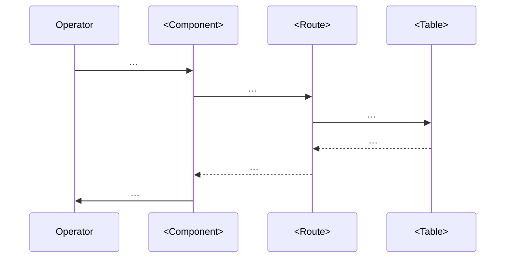

# Linear issue step sequences (iPix standard)

Use when creating or updating **any executable** issue on [linear.app/ipix](https://linear.app/ipix) (team **IPI**). Pair with **`ipix-task-lifecycle`**, **`mermaid-diagrams`**, and **[linear-prompt-engineering.md](linear-prompt-engineering.md)** (issues as agent prompts).

**Living examples:** [IPI-14](https://linear.app/ipix/issue/IPI-14) PLT-001 · [IPI-16](https://linear.app/ipix/issue/IPI-16) PLT-003 · [IPI-17](https://linear.app/ipix/issue/IPI-17) PLT-004

---

## Issues are agent prompts

Each Linear description is a prompt to Cursor/Claude. Map sections to prompt engineering:

| Section | Prompt role |
|---------|-------------|
| Problem + user story | Context + role |
| Examples / wireframe + states | Multishot |
| Acceptance criteria | Task (outcomes only) |
| Do NOT + out of scope | Constraints |
| Completion steps A–E | Chain of thought |
| `proof:` on each step | Eval / output format |

Full rules: [linear-prompt-engineering.md](linear-prompt-engineering.md)

---

## Required sections in every executable Linear description

Order matters — write them top to bottom. Every section is required; omit none.

```markdown
## SPEC-ID — <short title>

**Role:** You are implementing this as an iPix engineer. One concern per PR.

**Plain English:** <one sentence — what the operator/engineer experiences after this ships>

**Blocked by:** … · **Unblocks:** … · **Skills:** `@ipix-supabase` …

---

## The problem this solves

<What breaks or is missing today. 2–4 bullet points with concrete examples of the mistake or friction.
NOT "we need X". DO write "They pick IG Story and don't know it means 9:16 — so photos get cropped.">

**Fix:** <one sentence on the solution>

---

## User story

> As a <Operator | Engineer>, when I <action>,
> I <see / get Y>,
> so I can <outcome>.

---

## Wireframe  ← UI tasks only; omit for pure backend/tool/migration tasks

```
┌──────────────────────────────────────────┐
│  <screen name>                           │
├──────────────────────────────────────────┤
│  <lo-fi layout — labels, buttons, data>  │
│                                          │
│  [button]   [button]                     │
└──────────────────────────────────────────┘
```

**States this UI must handle:**

| State | What to show |
|---|---|
| Empty / no selection | … |
| Loading | skeleton shimmer |
| Success | … |
| Unknown / not found | amber warning badge |
| Error | red inline + retry |

---

## Examples  ← required for security, RLS, AI/Mastra, ambiguous API; optional for simple UI

Show **allowed vs denied** (or good vs bad) — 2–3 snippets. Wrap in `<example name="…">` tags when helpful.

```markdown
<example name="denied">
PATCH /api/crm/deals/:id { "stage": "won" }  → 403 or DB exception
</example>

<example name="allowed">
POST /api/crm/deals/:id/convert  → 200; brand row created; stage won
</example>
```

For pure UI tasks, the wireframe + states table counts as multishot examples.

---

## Flow diagram  ← required for any async, multi-actor, or API-crossing task



---

## Acceptance criteria

- **A — <capability>:** <testable outcome — what the user sees, not what the code does>
- **B — <edge case>:** …
- **C — <states>:** Loading shows …; error shows …; empty shows …
- **D — <live behaviour>:** …
- **E — <regression guard>:** Existing <feature> works unchanged.

**Prompt rules:** One interpretation only — no **OR** for security/auth paths. Each AC must be observable; name verify probe or test when relevant.

---

## Technical notes

**Files to touch:**
- `app/src/...` — <what to add/change, ≈N lines>
- `app/src/...` — <what to add/change>
- <No DB migrations / No new components / etc. if true — say so explicitly>

**Do NOT:** <call X directly | use Y pattern | add Z abstraction> — <one-line reason>

**Seeded / known data:** <list exact slugs, enum values, or IDs the code depends on>

---

## Out of scope

- <thing that sounds related but is NOT in this task>
- <follow-on feature that belongs in a different issue>
- <data seeding / migration that is its own task>

---

### Completion steps (check in order)

#### A. <Setup / scaffold>
- [ ] **A1** … — proof: …

#### B. <Core implementation>
- [ ] **B1** … — proof: …

#### C. <Edge cases / states>
- [ ] **C1** … — proof: …

#### D. <Tests>
- [ ] **D1** `npm run typecheck` passes
- [ ] **D2** `npm test` — <test file name> passes

#### E. Verify + ship
- [ ] **E1** `npm run build` passes
- [ ] **E2** Browser smoke — <what to click/see>
- [ ] **E3** `npm run supabase:verify-rls` (only if RLS touched)
- [ ] **E4** `tasks/plan/todo.md` row → 🟢 · Linear → Done

```

**Diagram rules** (see `mermaid-diagrams` skill):
- **sequenceDiagram** — edge functions, auth, API flows, async multi-actor
- **flowchart TD** — UI navigation, env/bootstrap, decision trees
- Gantt is optional (add when timeline/milestone tracking matters)
- Use `dateFormat YYYY-MM-DD` in gantt; `:crit` for verify sections; `:milestone` for Done

---

## Plain-language rules (iPix personas)

**The problem statement and user story are the most-skipped sections. Do not skip them.**
A task without a problem statement is just a to-do item. A task without a user story has no success condition.

**Security AC:** Never write "RLS or route" — name the **mandatory** mechanism (e.g. DB trigger + single convert route).

| Don't write | Do write |
|---|---|
| "Add RLS policies" | "**Operator** can sign in; their `profiles` row exists; they cannot read another user's brands" |
| "Deploy edge function" | "**Operator** pastes a brand URL; AI profile JSON lands in Supabase without exposing Gemini key in browser" |
| "Validate env vars" | "App fails fast at startup if Supabase URL missing — **Engineer** sees clear error, not blank screen" |
| "We need X" | "Today, doing Y causes Z mistake. Fix: surface W so the operator knows before they commit." |
| "Handle states" | List every state by name: empty · loading · success · unknown · error — each with exact UI response |

**Personas:** **Operator** (dashboard) · **Engineer** (CLI/CI) · **Shopper** (B2C — COM track only).

---

## Wireframe rules

Use ASCII wireframes (not Figma links) for any task that changes a screen layout. They render in Linear and are version-controlled.

- Show the actual screen name in the header
- Include real button labels and field names (not placeholders)
- Add a **States table** below every wireframe listing every UI state
- For multi-step flows, show each step as a separate frame
- Unknown/warning state must always be shown — never assume happy path only

Example states table (copy and fill in):

| State | What to show |
|---|---|
| No selection | Section hidden |
| Fetching | Skeleton shimmer card |
| Spec loaded | Spec card: W × H, ratio, formats, max size |
| Unknown channel | Amber "No spec on file yet" badge |
| Error | Red inline message + retry button |

---

## Standard verify block (platform code)

```markdown
#### E. Verify + ship
- [ ] **E1** `npm run build` passes
- [ ] **E2** `npm run supabase:verify` (if Supabase touched)
- [ ] **E3** `npm run supabase:verify-rls` (if auth/RLS touched)
- [ ] **E4** Browser smoke or script evidence documented in issue comment
- [ ] **E5** `tasks/plan/todo.md` row updated · Linear state set
```

---

## iPix-specific gates

| Topic | Step pattern |
|-------|----------------|
| **Migrations** | Apply via `supabase db query --linked --file` + `migration repair` — never push orphan without review |
| **Auth** | `/app` → login redirect · session refresh · logout |
| **Edge** | `GEMINI_API_KEY` in Supabase secrets only · CORS + JWT on functions |
| **Env** | Client-safe: `NEXT_PUBLIC_*` only · never `NEXT_PUBLIC_GEMINI_*` or any AI key · Vite is retired (`src/`) |
| **Mastra tools** | Tools are for AI agents — never call them directly from UI routes. Use server functions via API routes instead. |
| **Technical notes section** | Every issue must explicitly name files to touch and what NOT to do. "Do NOT call X directly — reason." |

---

## Progress tracker sync

| Artifact | Path | Update when |
|---|---|---|
| Linear issue | IPI-### checkboxes | Step completes |
| Repo tracker | `tasks/plan/todo.md` + mirror `tasks/todo.md` | Status column |
| Supabase ops | `supabase/README.md` | New workflow or migration |

**Dot legend (`tasks/plan/todo.md`):** 🟢 Done · 🟡 In progress · 🔴 Blocked · ⚫ Not started

---

## Lifecycle phase → Linear section

| Phase | Linear section |
|---|---|
| Plan | A. Scope + blocked-by + skills |
| Research | A. Spike / audit steps |
| Implement | B–C. Scaffold + code |
| Test | D–E. Scripts + browser |
| Ship | E. Done milestone · `tasks/plan/todo.md` |

---

## Prompt lint (before issue is "ready")

See [linear-prompt-engineering.md](linear-prompt-engineering.md). Minimum:

- [ ] Role or named persona in user story
- [ ] Examples (good/bad) OR wireframe + 5-state table
- [ ] No ambiguous OR in security AC
- [ ] Every A–E step has `proof:`
- [ ] `blockedBy` matches any cross-issue AC
- [ ] SSOT: `docs/linear/issues/IPI-*.md` synced to Linear
