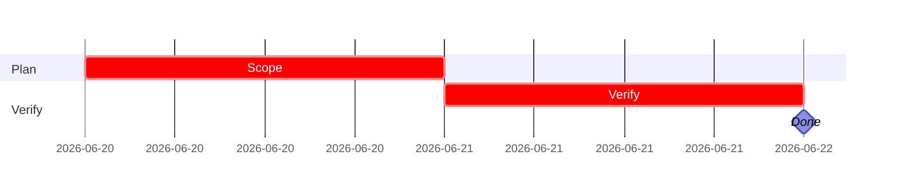

# iPix Linear workflow

Use this reference for all iPix / Lumina Studio Linear work.

## Context

- Linear workspace: `linear.app/ipix`
- Team: `IPI`
- Issue format: `IPI-###`
- Spec IDs: `PLT-###`, `AI-###`, `COM-###`, `UI-###`, `DNA-###`
- Local specs: `docs/linear/issues/IPI-<n>-<SPEC-ID>.md`
- Progress tracker: `todo.md`
- Supabase policy: remote-only for MVP; do not run local Supabase Docker.

## Read first for iPix tasks

1. `ipix-task-lifecycle` skill if available.
2. Local spec: `docs/linear/issues/IPI-*-*.md`.
3. `docs/linear/issues/` for related specs.
4. `todo.md` for current progress state.
5. Relevant project docs, PRDs, or diagrams.

## Executable Linear description

Every executable iPix issue should include:

```markdown
## SPEC-ID — short title

**In plain terms:** …

**Blocked by:** … · **Unblocks:** …

**Skills:** `ipix-task-lifecycle` · `linear` · …

---

### Flow

```mermaid
flowchart TD
  …
```

---

### Completion steps

#### A. Scope and setup
- [ ] **A1** Confirm spec and Linear issue — proof

#### B. Implement
- [ ] **B1** Code change — proof

#### C. Integrate
- [ ] **C1** Wire dependent systems — proof

#### D. Verify
- [ ] **D1** Run relevant commands — proof

#### E. Ship
- [ ] **E1** Update todo.md and Linear state — proof

---

### Gantt — IPI-NNN


```

## Spec file template

```markdown
# IPI-<n> — <SPEC-ID> <title>

**Linear:** IPI-<n>
**Track:** Platform | Commerce | UI | DNA | AI
**Blocked by:** … · **Unblocks:** …
**Skills:** ipix-task-lifecycle · linear · …
**MVP proof:** #N

## In plain terms
…

## Acceptance criteria
- [ ] **AC1** … — proof
- [ ] **AC2** … — proof

## Wiring plan
| Action | Path | Notes |
|--------|------|-------|
| Create | `src/...` | … |
| Modify | `supabase/...` | … |

## Verify
- [ ] `npm run build`
- [ ] `npm run test` if applicable
- [ ] `npm run supabase:verify-rls` if auth/RLS touched
- [ ] Browser smoke or script evidence
```

## Plain-language rules

| Do not write | Write |
|--------------|-------|
| Add RLS policies | Operator can sign in, has a profiles row, and cannot read another user's brands |
| Deploy edge function | Operator pastes a brand URL and AI profile JSON lands in Supabase without exposing Gemini key in browser |
| Validate env vars | App fails fast at startup if Supabase URL is missing and Engineer sees a clear error |

Personas:

- **Operator:** dashboard user.
- **Engineer:** CLI/CI user.
- **Shopper:** B2C commerce user, COM track only.

## Scripts

Use when syncing specs to Linear:

```bash
node scripts/linear-update-issue.mjs <id>
node scripts/linear-update-issue.mjs --all
```

Requires `LINEAR_API_KEY` in the local environment or secret manager.

## Verification gates

| Touch area | Gate |
|------------|------|
| Frontend | `npm run lint`, `npm run build`, browser smoke |
| Tests | `npm run test` or targeted test |
| Supabase schema | `npm run supabase:verify` |
| Auth/RLS | `npm run supabase:verify-rls` |
| Edge functions | `npm run supabase:verify-edge` |
| Env vars | `npm run check:env` |

## Done definition

An iPix issue is done only when:

- Local spec acceptance criteria are checked.
- Relevant verification commands passed.
- `todo.md` row is updated.
- Linear state is moved to `Done` when explicitly requested.
- Code changes are committed only if the user explicitly asked.
