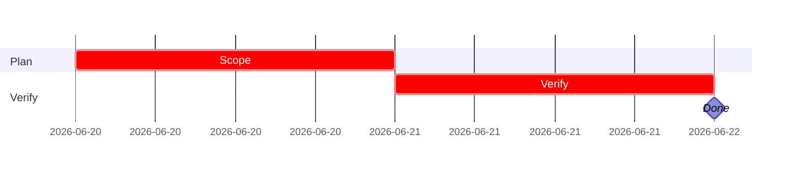

# Linear templates

Use these templates as starting points. Keep them concise and remove sections that do not apply.

## Issue template

```markdown
# Title

**Track:** platform | commerce | UI | DNA | AI
**Project:** project name
**Initiative:** initiative name
**Priority:** high | medium | low
**Estimate:** optional

## In plain terms
One or two sentences.

## Blocked by
- …

## Unblocks
- …

## Description
What needs to be done and why it matters.

## Acceptance criteria
- [ ] **AC1** Observable outcome — proof
- [ ] **AC2** Observable outcome — proof

## Implementation notes
- Relevant files/systems
- Dependencies
- Non-goals

## Verify
- [ ] Relevant command or evidence
```

## Bug issue template

```markdown
# Bug title

## What is broken
Plain-language description.

## Reproduction
1. Step
2. Step
3. Step

## Expected
What should happen.

## Actual
What happens instead.

## Environment
- App/version:
- Browser/device:
- User/role:

## Evidence
- Logs, screenshots, Linear comments, or Sentry reference

## Acceptance criteria
- [ ] Repro no longer occurs — proof
- [ ] Regression test added if practical — proof
```

## Project spec template

```markdown
# Project name

**Timeline:** start → target
**Owner:** owner
**Status:** planning | in-progress | paused | completed

## Why
Problem or opportunity.

## What
Deliverable.

## How
High-level approach.

## Success criteria
- Measurable outcome 1
- Measurable outcome 2

## Out of scope
- V1 cut
- Future work

## Issues
1. Concrete issue
2. Concrete issue
```

## Status update template

```markdown
## Status update — YYYY-MM-DD

### Completed
- …

### In progress
- …

### Blocked
- …

### Next
- …

### Decisions
- …

### Risks
- …
```

## PR template

```markdown
## Summary
- …

## Changes
- …

## Linear
Closes IPI-###

## Verification
- `npm run build`
- `npm run test`
- Relevant browser or Supabase verification

## Notes
- Breaking changes, screenshots, or follow-ups
```

## iPix Linear description template

```markdown
## SPEC-ID — short title

**In plain terms:** …

**Blocked by:** … · **Unblocks:** …

**Skills:** `ipix-task-lifecycle` · `linear` · …

### Flow
```mermaid
flowchart TD
  …
```

### Completion steps
#### A. Scope
- [ ] **A1** Confirm spec and dependencies — proof

#### B. Implement
- [ ] **B1** Complete code/schema/UI work — proof

#### C. Integrate
- [ ] **C1** Wire dependent systems — proof

#### D. Verify
- [ ] **D1** Run relevant verification commands — proof

#### E. Ship
- [ ] **E1** Update todo.md and Linear state — proof

### Gantt — IPI-NNN

```
