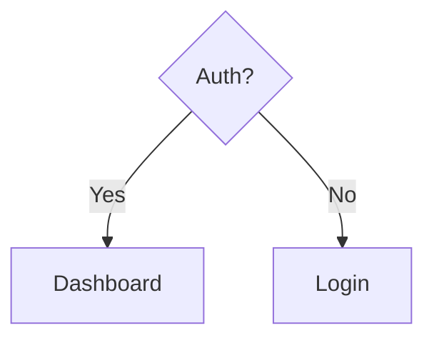
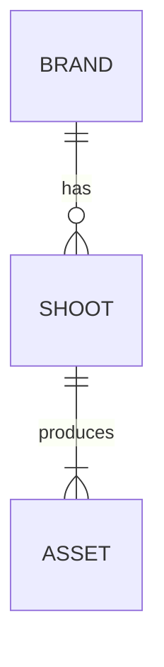

# Mermaid Diagramming

All diagrams follow: `diagramType` on line 1, then definition. Use `%%` for comments.

## Choose the right type

| Use case | Type | Reference |
|----------|------|-----------|
| Domain model, OOP, entity relationships | `classDiagram` | [class-diagrams.md](references/class-diagrams.md) |
| API flows, auth sequences, method calls | `sequenceDiagram` | [sequence-diagrams.md](references/sequence-diagrams.md) |
| User journeys, algorithms, decision trees | `flowchart TD/LR` | [flowcharts.md](references/flowcharts.md) |
| Database schema, table relationships | `erDiagram` | [erd-diagrams.md](references/erd-diagrams.md) |
| System/container/component architecture | `C4Context` / `C4Container` | [c4-diagrams.md](references/c4-diagrams.md) |
| Order lifecycle, UI states, approval flows | `stateDiagram-v2` | [state-diagrams.md](references/state-diagrams.md) |
| UX pain-point mapping with satisfaction scores | `journey` | [user-journey-diagrams.md](references/user-journey-diagrams.md) |
| Sprint/release timelines, dependencies | `gantt` | [gantt-charts.md](references/gantt-charts.md) |
| Effort vs impact, prioritization matrices | `quadrantChart` | [quadrant-charts.md](references/quadrant-charts.md) |
| Requirements traceability | `requirementDiagram` | [requirement-diagrams.md](references/requirement-diagrams.md) |
| Complex sequences with if/else, loops | `zenuml` | [zenuml-diagrams.md](references/zenuml-diagrams.md) |
| Grid-positioned system layouts | `block-beta` | [block-diagrams.md](references/block-diagrams.md) |
| Hierarchical proportional data | `treemap` | [treemap-diagrams.md](references/treemap-diagrams.md) |
| FashionOS domain conventions | any | [fashionos-domain.md](references/fashionos-domain.md) |

## Minimal examples

## Pitfalls

- `{}` in comments breaks parsing — avoid them
- Validate in [Mermaid Live](https://mermaid.live) when syntax errors are unclear
- Split complex diagrams into multiple focused views

**Full syntax, theming, and export options** → load the relevant `references/*.md` above.
