# Block Diagrams Reference

Block diagrams represent systems using positioned blocks and connectors. Unlike flowcharts, block diagrams give full control over block placement using a column-based layout. Use for system architecture overviews, hardware diagrams, and structured layouts.

## Basic Syntax

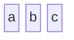

Creates three horizontally-arranged blocks.

## Column Layout

### Multi-Column Grid

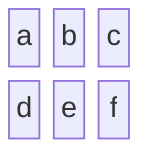

Blocks fill left-to-right, wrapping to new rows.

### Single Column (Vertical Stack)

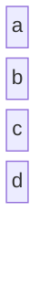

## Block Width (Column Spanning)

Blocks can span multiple columns:

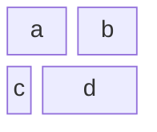

The number after `:` indicates how many columns the block spans.

## Block Labels

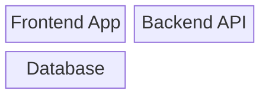

## Block Shapes

Various shapes using bracket notation:

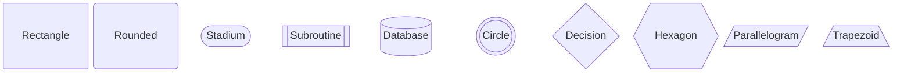

## Composite/Nested Blocks

Create blocks containing sub-blocks:

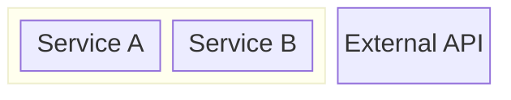

## Space Blocks

Insert empty space for layout control:

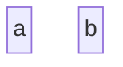

With column span:
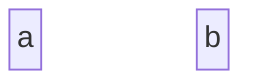

## Connecting Blocks with Edges

### Directional Arrows
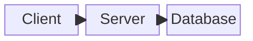

### Non-directional Lines
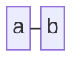

### Labeled Edges
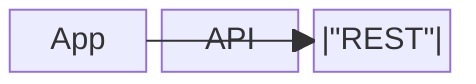

## Styling

### Individual Block Styling
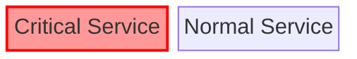

### Class-Based Styling
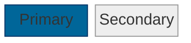

## Comprehensive Example: Three-Tier Architecture

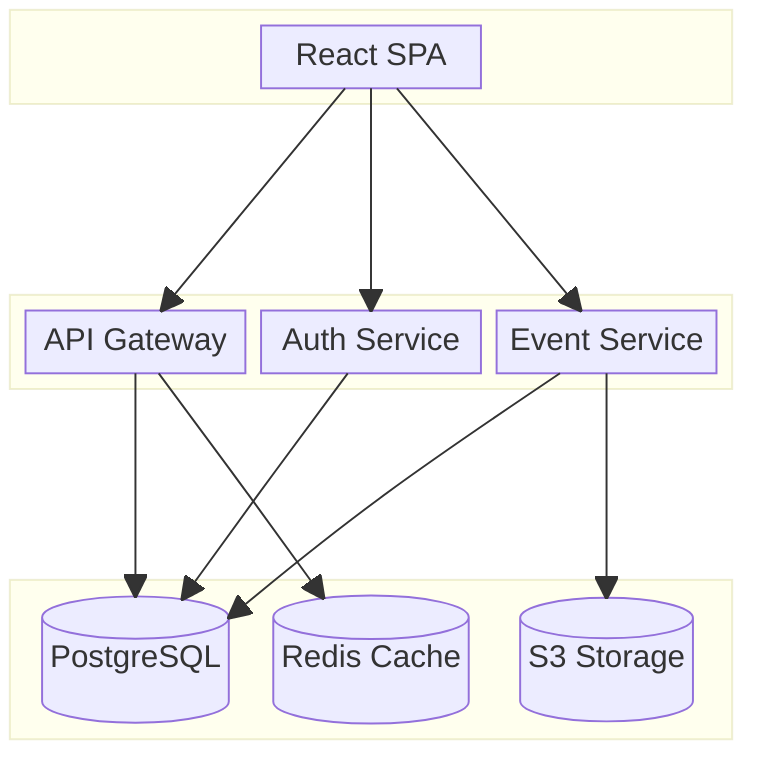

## FashionOS Example: System Layout

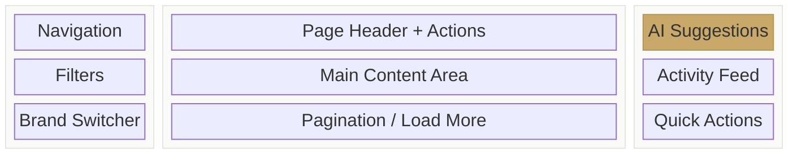

## Block vs Flowchart

| Feature | Block Diagram | Flowchart |
|---------|--------------|-----------|
| Layout | Column-grid (author-controlled) | Auto-layout (algorithm) |
| Positioning | Explicit via columns/spans | Automatic |
| Nesting | Column-based groups | Subgraphs |
| Best for | Structured layouts, system views | Process flows, decision trees |

**Choose block diagrams when:**
- You need precise control over element positioning
- Building system/architecture overviews
- Creating grid-based layouts

**Choose flowcharts when:**
- Showing process flows with decisions
- Layout can be auto-determined
- Focus is on connections, not positions

## Tips

1. **Plan your grid** - Decide column count before adding blocks
2. **Use `space`** blocks for alignment and visual separation
3. **Nest blocks** with `block:id:span ... end` for grouped sections
4. **Use shapes** to distinguish component types (cylinder for DB, circle for services)
5. **Style by class** for consistent appearance across similar components
6. **Keep edges simple** - block diagrams emphasize structure over flow

## Reference

- [Official Documentation](https://mermaid.js.org/syntax/block.html)
