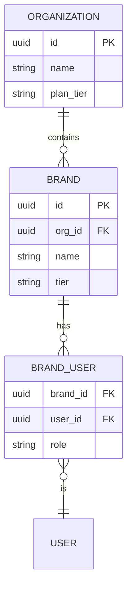
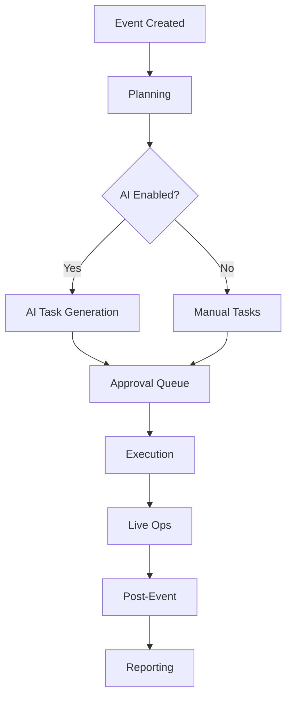
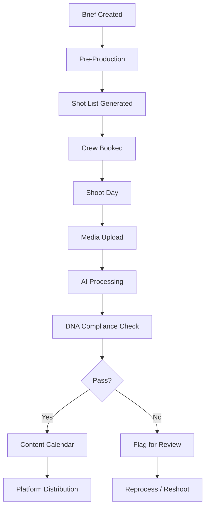
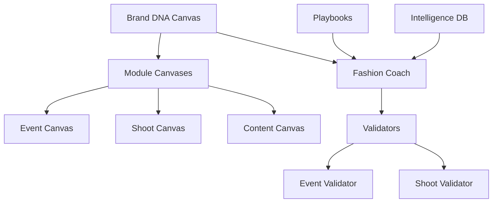
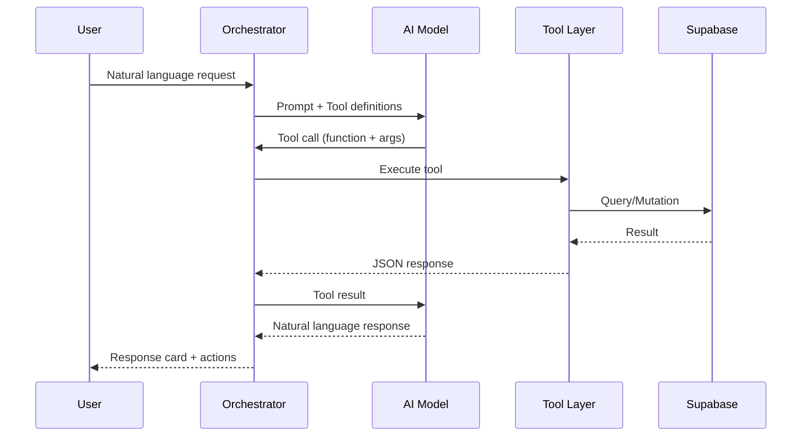
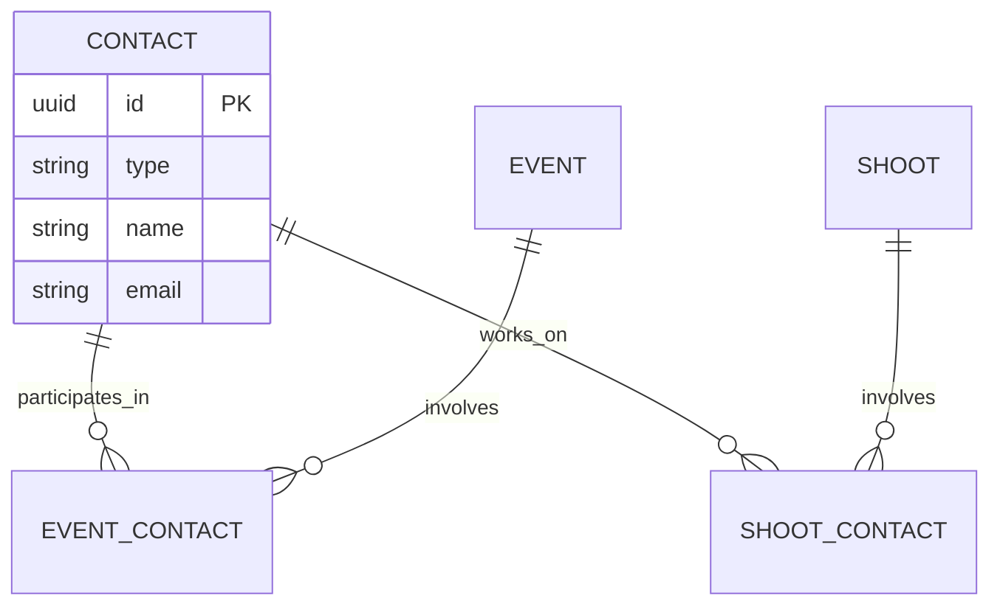
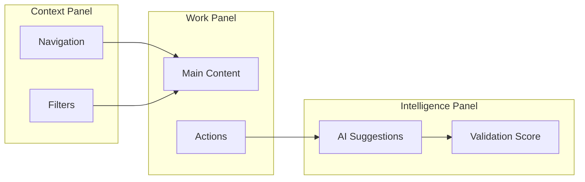

# FashionOS Domain Diagrams

Reference for creating mermaid diagrams specific to the FashionOS platform.

## Project Conventions

### File Naming
- Location: `tasks/mermaid/`
- Format: `NN-diagram-name.mmd` (zero-padded number, kebab-case)
- Index: `tasks/mermaid/00-diagram-index.md` (links diagrams to tasks)
- Progress: `tasks/mermaid/00-progress-tracker.md` (execution status)
- Roadmap: `tasks/mermaid/00-roadmap.md` (phase-based build order)

### Linking Diagrams to Tasks
Every diagram must map to a task in the task index:

```markdown
| Diagram ID               | Purpose                 | Phase    | Linked Task              |
| `01-event-planning-flow` | AI Event setup flow     | ADVANCED | [Task 30](../events/30-ai-planning-agents.md) |
```

### Phase Labels
- **MVP** - Minimum viable product features
- **ADVANCED** - Intelligence & automation
- **PRODUCTION** - Reliability, security, scale

---

## Core Domain Entities

### Multi-Tenant Hierarchy


### Event Lifecycle


Event types: `fashion_show`, `presentation`, `pop_up`, `launch`

### Shoot Lifecycle


Shoot types: `lookbook`, `campaign`, `editorial`, `ecommerce`, `video`

### Intelligence Layer


### AI Agent Architecture


### Contact Network


Contact types: `model`, `photographer`, `stylist`, `vendor`, `sponsor`

---

## Diagram Templates by Module

### Events Module Diagrams
Diagrams for event operations cover:
- **Planning flows** - AI-assisted task generation from SOPs
- **Approval chains** - Human-in-loop review before execution
- **Live ops** - Real-time runsheet and cue management
- **Critical path** - Blocker detection and recovery

### Shoots Module Diagrams
Diagrams for shoot operations cover:
- **Brief-to-delivery pipeline** - End-to-end shoot workflow
- **Media processing** - Upload → AI enhancement → compliance → distribution
- **Professional network** - Vendor/talent search and booking
- **Platform content packs** - Multi-platform asset generation

### Intelligence Module Diagrams
Diagrams for the intelligence layer cover:
- **Canvas inheritance** - Brand DNA → Module canvases hierarchy
- **Validation loops** - Score → flag → remediate → rescore
- **RAG pipeline** - Query → retrieve → generate with citations
- **Playbook execution** - Template → customize → execute → track

### Operations Module Diagrams
Diagrams for ops dashboards cover:
- **Kanban lifecycle** - Briefing → Queue → In Progress → AI Review → Human Review → Done
- **Task routing** - Intent classification → agent assignment
- **Error recovery** - Error type → appropriate fallback strategy

---

## Existing Diagram Patterns

These patterns are established in `tasks/mermaid/`:

### Decision Flow (graph TD)
Used for: agent routing, approval chains, error handling
```
graph TD
    A[Trigger] --> B{Decision?}
    B -->|Path A| C[Action]
    B -->|Path B| D[Alternative]
```

### Tool Execution (sequenceDiagram)
Used for: API flows, agent-tool interactions, user requests
```
sequenceDiagram
    participant U as User
    participant A as Agent
    participant T as Tool Layer
    participant DB as Database
```

### Kanban Pipeline (graph TD)
Used for: operations status flows, content pipelines
```
graph TD
    A[Start] --> B[Queue]
    B --> C[In Progress]
    C --> D[Review]
    D --> E{Pass?}
    E -->|Yes| F[Done]
    E -->|No| C
```

---

## Three-Panel Layout Context

FashionOS uses a 3-panel layout: **Context | Work | Intelligence**

When diagramming UI flows, represent panel interactions:


Core principle: "Humans decide. AI assists. Nothing happens silently."
