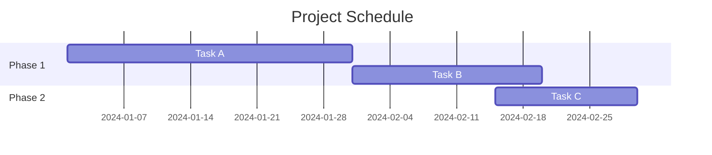
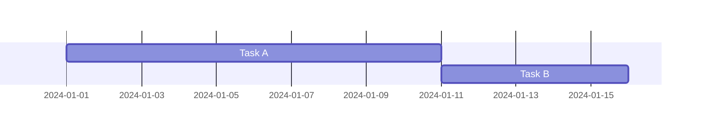
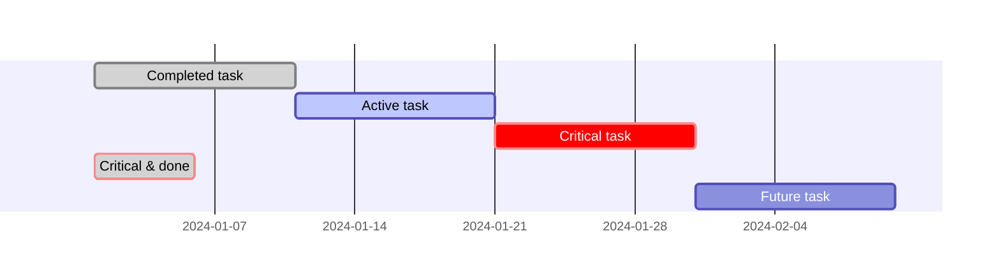
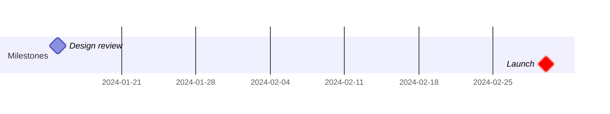
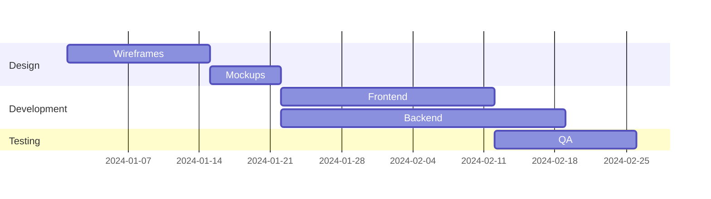
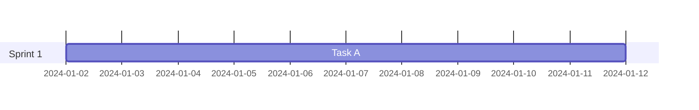
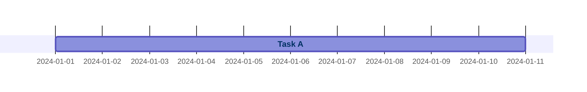
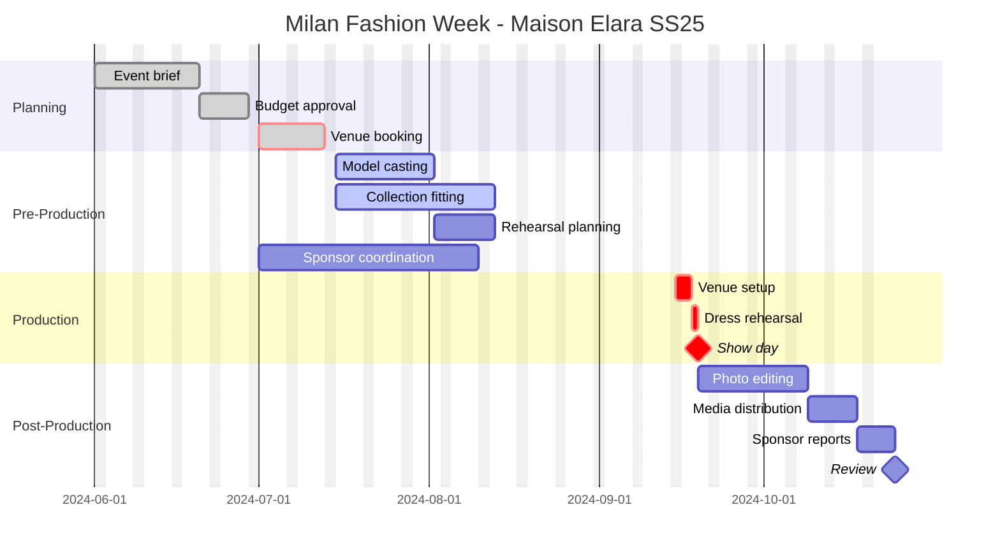

# Gantt Charts Reference

Gantt charts illustrate project schedules with task durations on a timeline. Use for project planning, sprint scheduling, release planning, and production timelines.

## Basic Syntax



## Task Definition

Tasks use colon-separated metadata with commas:

```
Task Name :<status>, <taskID>, <startDate>, <endDate or duration>
```

### Start Date Options

| Pattern | Description |
|---------|-------------|
| `2024-01-01` | Explicit date |
| `after taskID` | After another task ends |
| `after taskA taskB` | After multiple tasks (latest end) |

### End Date Options

| Pattern | Description |
|---------|-------------|
| `2024-02-01` | Explicit end date |
| `30d` | Duration in days |
| `2w` | Duration in weeks |

### Task ID

Optional identifier for referencing in dependencies:



## Task Status Tags

Combine multiple status tags before the task ID:



| Status | Effect |
|--------|--------|
| `done` | Completed (filled/dimmed) |
| `active` | Currently in progress (highlighted) |
| `crit` | Critical path (red/emphasized) |
| `milestone` | Single point marker (diamond) |

## Milestones

Zero-duration tasks rendered as diamond markers:



## Sections

Group related tasks:



## Date Formatting

### Input Format
```
dateFormat YYYY-MM-DD
```

Supported tokens: `YYYY`, `YY`, `M`, `MM`, `D`, `DD`, `H`, `HH`, `mm`, `ss`, `X` (unix timestamp)

### Axis Display Format
```
axisFormat %Y-%m-%d
```

Common patterns:
- `%Y-%m-%d` - 2024-01-15
- `%d/%m` - 15/01
- `%b %d` - Jan 15
- `%B %Y` - January 2024
- `%H:%M` - 14:30

### Tick Interval
```
tickInterval 1week
```

Pattern: `[number][unit]` where unit is `millisecond`, `second`, `minute`, `hour`, `day`, `week`, `month`

## Exclusions

Skip dates from duration calculations:



**Custom weekend days:**
```
weekend friday
```

## Vertical Markers

Highlight important dates:

```mermaid
gantt
    dateFormat YYYY-MM-DD
    section Tasks
        Task A :2024-01-01, 30d
    vert 2024-01-15
```

## Display Modes

**Compact mode** - overlaps non-dependent tasks:
```
displayMode compact
```

## Click Interactions



Requires `securityLevel: 'loose'`.

## Today Marker

Disable the today marker:
```
todayMarker off
```

## Configuration

```javascript
%%{init: {
  'gantt': {
    'barHeight': 20,
    'barGap': 4,
    'fontSize': 12,
    'sectionFontSize': 16,
    'topAxis': false,
    'displayMode': 'compact'
  }
}}%%
```

## FashionOS Example: Fashion Show Timeline



## Tips

1. **Use task IDs** for dependency chains (`after taskID`)
2. **Mark critical path** with `crit` to highlight schedule-critical tasks
3. **Exclude weekends** for realistic business-day durations
4. **Use milestones** for key decision points and deadlines
5. **Group by phase** using sections for clarity
6. **Compact mode** works well for schedules with parallel workstreams

## Reference

- [Official Documentation](https://mermaid.js.org/syntax/gantt.html)
