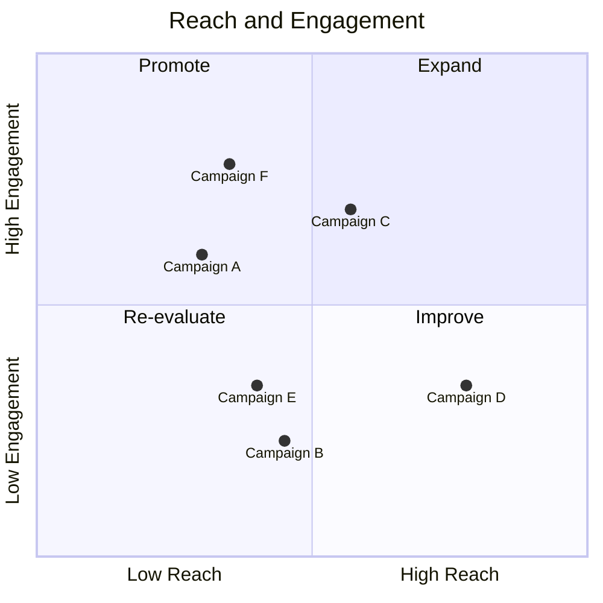
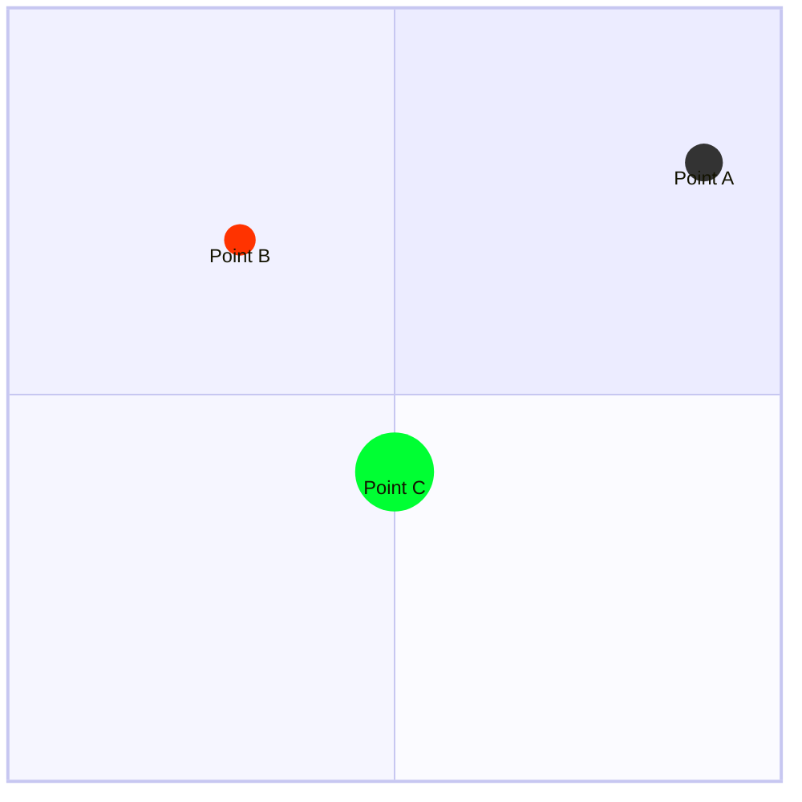
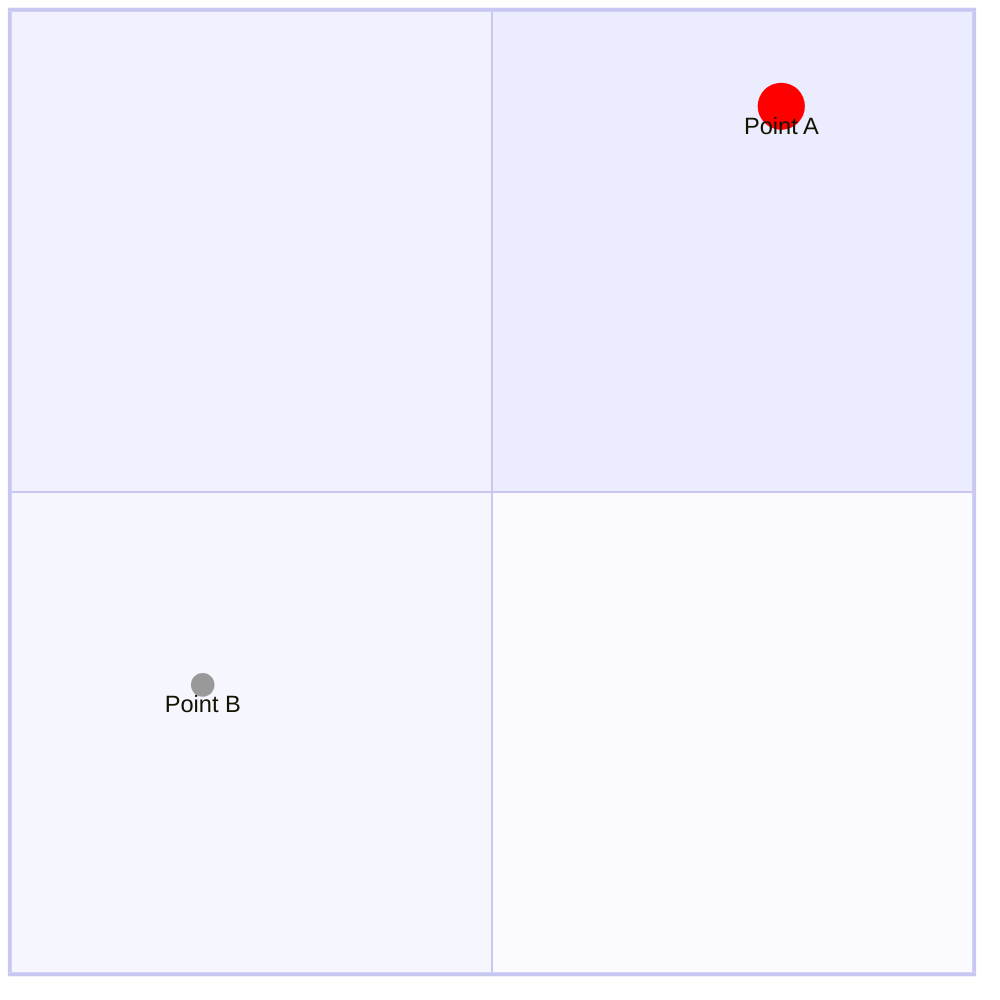
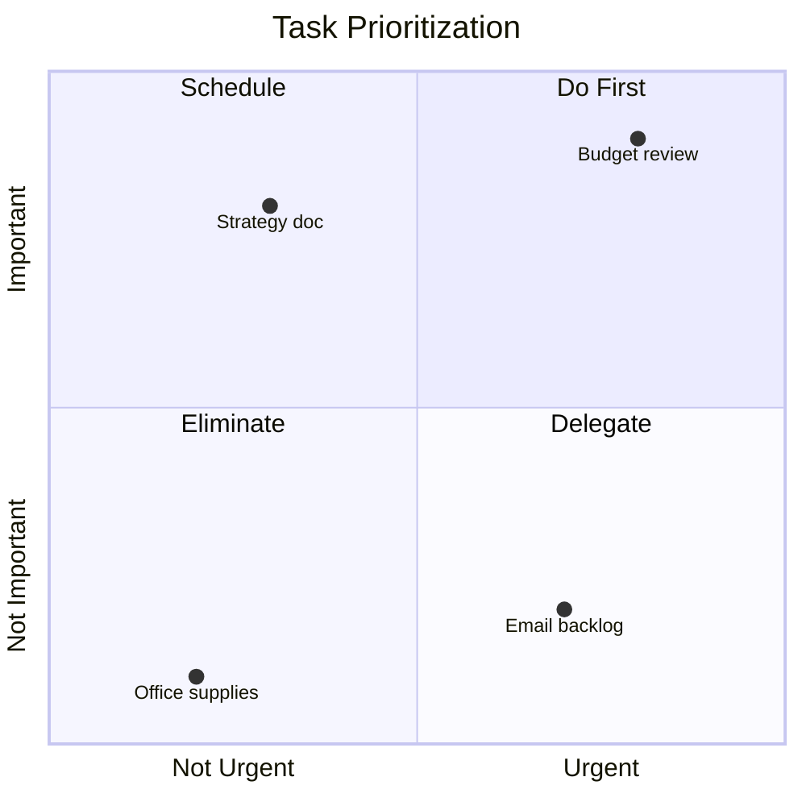
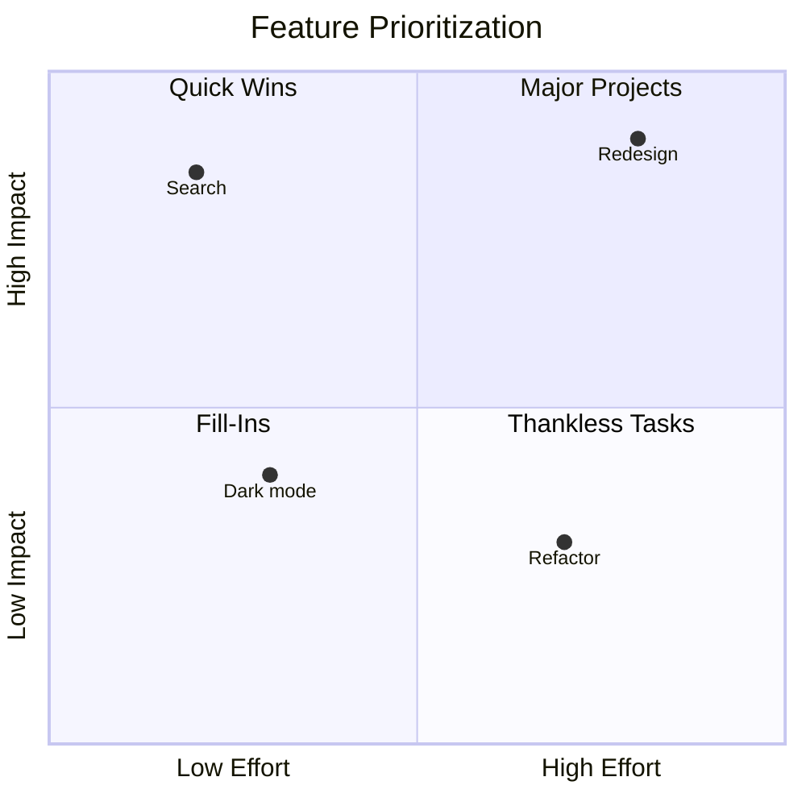
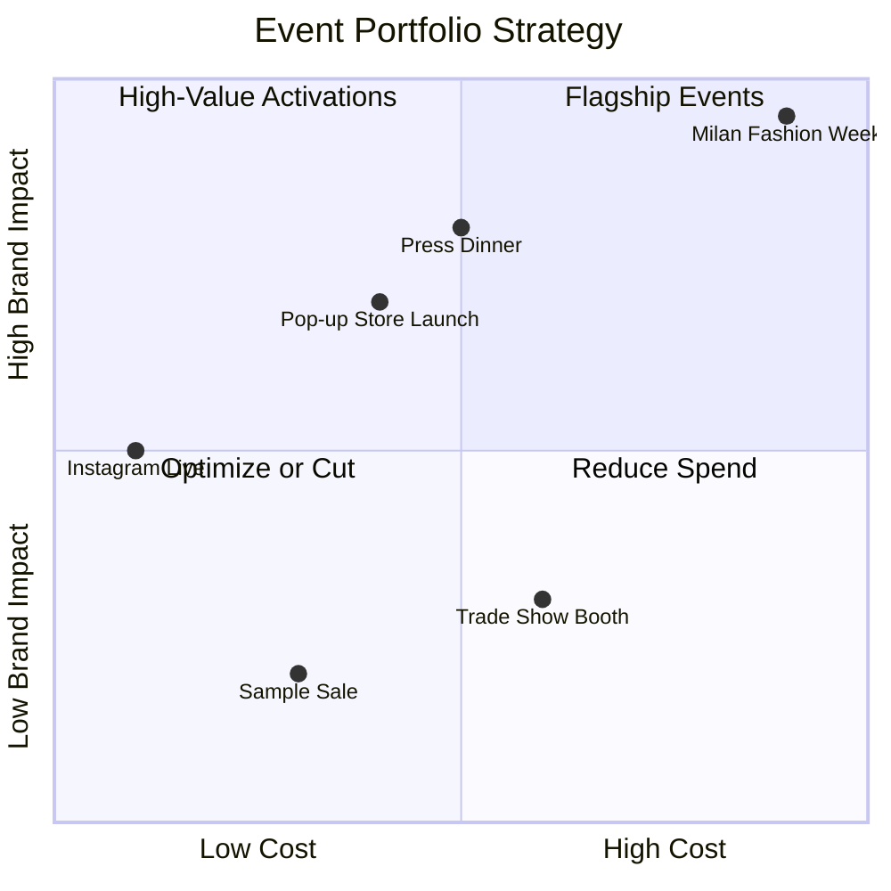

# Quadrant Charts Reference

Quadrant charts plot data points on a 2x2 grid to compare items across two dimensions. Use for prioritization matrices, competitive analysis, effort-vs-impact assessments, and strategic positioning.

## Basic Syntax



## Structure

### Title
```
quadrantChart
    title Chart Title
```

### Axis Labels
```
x-axis Low Label --> High Label
y-axis Low Label --> High Label
```

Single-direction labels (left/bottom only):
```
x-axis Low Label
y-axis Bottom Label
```

### Quadrant Labels

Quadrants are numbered starting top-right, going counter-clockwise:

```
quadrant-1 Top Right Label
quadrant-2 Top Left Label
quadrant-3 Bottom Left Label
quadrant-4 Bottom Right Label
```

### Data Points

Values range from 0 to 1:
```
Point Name: [x, y]
```

- `[0, 0]` = bottom-left corner
- `[1, 1]` = top-right corner
- `[0.5, 0.5]` = center

## Point Styling

### Direct Styling



**Available properties:**
- `color` - Fill color
- `radius` - Point size
- `stroke-width` - Border thickness
- `stroke-color` - Border color

### Class-Based Styling



## Configuration

```
%%{init: {
  'quadrantChart': {
    'chartWidth': 500,
    'chartHeight': 500,
    'titleFontSize': 20,
    'pointRadius': 5,
    'pointLabelFontSize': 12,
    'xAxisLabelFontSize': 16,
    'yAxisLabelFontSize': 16,
    'quadrantLabelFontSize': 16
  }
}}%%
```

## Theme Variables

Customize quadrant colors:

- `quadrant1Fill`, `quadrant2Fill`, `quadrant3Fill`, `quadrant4Fill` - Background colors
- `quadrantPointFill` - Default point color
- `quadrantPointTextFill` - Point label color
- `quadrantXAxisTextFill`, `quadrantYAxisTextFill` - Axis text colors
- `quadrantTitleFill` - Title color

## Common Use Cases

### Eisenhower Matrix (Urgent vs Important)


### Effort vs Impact


## FashionOS Example: Event Strategy



## Tips

1. **Normalize values** - Map your data to 0-1 range before plotting
2. **Label quadrants clearly** - Use action-oriented labels (Do, Schedule, Delegate, Eliminate)
3. **Limit data points** - 5-15 points keeps the chart readable
4. **Use styling** to highlight key items with larger radius or distinct colors
5. **Choose axes carefully** - The two dimensions should be independent and meaningful

## Reference

- [Official Documentation](https://mermaid.js.org/syntax/quadrantChart.html)
