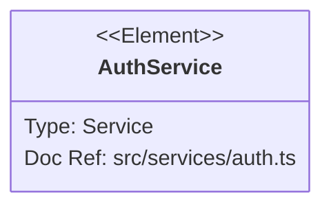
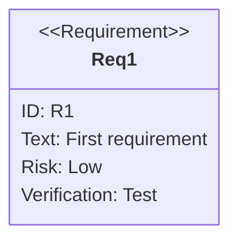

# Requirement Diagrams Reference

Requirement diagrams visualize requirements, their properties, and relationships to other requirements and system elements. Use for requirements engineering, traceability matrices, compliance tracking, and specifications documentation.

## Basic Syntax

```mermaid
requirementDiagram

    requirement User Authentication {
        id: REQ-001
        text: The system shall authenticate users via email and password
        risk: Medium
        verifymethod: Test
    }

    element Login Page {
        type: UI Component
        docref: login.tsx
    }

    Login Page - satisfies -> User Authentication
```

## Requirements

Define requirements with type, ID, text, risk, and verification method:

```
<type> <name> {
    id: <identifier>
    text: <description>
    risk: <Low | Medium | High>
    verifymethod: <Analysis | Inspection | Test | Demonstration>
}
```

### Requirement Types

| Type | Use Case |
|------|----------|
| `requirement` | Generic requirement |
| `functionalRequirement` | What the system does |
| `interfaceRequirement` | Integration/interface specs |
| `performanceRequirement` | Speed, capacity, throughput |
| `physicalRequirement` | Physical constraints |
| `designConstraint` | Design-level restrictions |

### Risk Levels

- `Low` - Minor impact if not met
- `Medium` - Moderate impact
- `High` - Critical impact

### Verification Methods

- `Analysis` - Mathematical or logical proof
- `Inspection` - Visual examination or review
- `Test` - Functional testing
- `Demonstration` - Operational demonstration

## Elements

Lightweight components representing design artifacts:

```
element <name> {
    type: <user-defined type>
    docref: <reference>
}
```

Elements connect requirements to implementation:



## Relationships

Connect requirements and elements with directional arrows:

```
{source} - <type> -> {destination}
{destination} <- <type> - {source}
```

### Relationship Types

| Type | Meaning |
|------|---------|
| `contains` | Parent contains child requirement |
| `copies` | Requirement is duplicated |
| `derives` | Requirement derived from another |
| `satisfies` | Element fulfills a requirement |
| `verifies` | Element tests/validates a requirement |
| `refines` | More specific version of a requirement |
| `traces` | General traceability link |

## Direction

Control layout orientation:



Options: `TB` (top-bottom, default), `BT`, `LR`, `RL`

## Markdown in Text

Requirement text supports markdown formatting:

```
requirement Styled Req {
    id: R1
    text: "**Must** support *real-time* updates"
    risk: High
    verifymethod: Demonstration
}
```

## Styling

### Direct Styling
```
style requirement_name fill:#color,stroke:#color
```

### Class Definitions
```
classDef critical fill:#f99,stroke:#f00,stroke-width:2px
class Req1, Req2 critical
```

### Inline Class
```
requirement Req1:::critical {
    ...
}
```

## Comprehensive Example: Fashion Event System

```mermaid
requirementDiagram

    requirement Event Management {
        id: REQ-100
        text: System shall manage fashion events end-to-end
        risk: High
        verifymethod: Demonstration
    }

    functionalRequirement Guest Management {
        id: REQ-101
        text: System shall track guest RSVPs and seating
        risk: Medium
        verifymethod: Test
    }

    functionalRequirement Schedule Management {
        id: REQ-102
        text: System shall manage event timelines and milestones
        risk: Medium
        verifymethod: Test
    }

    performanceRequirement Real-time Updates {
        id: REQ-103
        text: Dashboard shall refresh within 2 seconds
        risk: Low
        verifymethod: Test
    }

    interfaceRequirement Calendar Integration {
        id: REQ-104
        text: System shall sync with Google Calendar
        risk: Medium
        verifymethod: Demonstration
    }

    designConstraint Mobile Responsive {
        id: REQ-105
        text: All views must work on screens >= 375px
        risk: Low
        verifymethod: Inspection
    }

    element EventDashboard {
        type: React Page
        docref: src/pages/dashboard/events.tsx
    }

    element GuestList {
        type: React Component
        docref: src/components/events/GuestList.tsx
    }

    element EventService {
        type: Supabase Edge Function
        docref: supabase/functions/event-service
    }

    Event Management - contains -> Guest Management
    Event Management - contains -> Schedule Management
    Event Management - contains -> Real-time Updates
    Schedule Management - derives -> Calendar Integration

    EventDashboard - satisfies -> Event Management
    GuestList - satisfies -> Guest Management
    EventService - satisfies -> Schedule Management
    EventDashboard - satisfies -> Mobile Responsive
    EventService - verifies -> Real-time Updates
```

## Tips

1. **Use specific requirement types** - `functionalRequirement` is more informative than `requirement`
2. **Assign meaningful IDs** - Use a consistent scheme (REQ-001, PERF-001, UI-001)
3. **Link elements to requirements** - Shows traceability from spec to implementation
4. **Use `contains`** to build requirement hierarchies
5. **Use `derives`** to show requirement decomposition chains
6. **Keep text concise** - Use "shall" language for clear requirements

## Reference

- [Official Documentation](https://mermaid.js.org/syntax/requirementDiagram.html)
