# State Diagrams Reference

State diagrams describe system behavior through states and transitions. Use for lifecycle modeling, workflow states, UI states, and finite state machines.

## Basic Syntax

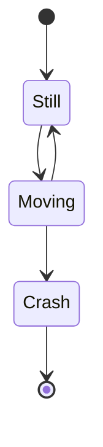

**Note:** Use `stateDiagram-v2` (preferred) over the older `stateDiagram`.

## Defining States

**ID only:**
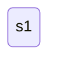

**With description (state keyword):**
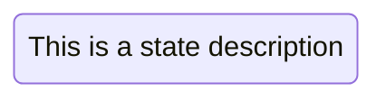

**ID with colon notation:**
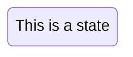

## Transitions

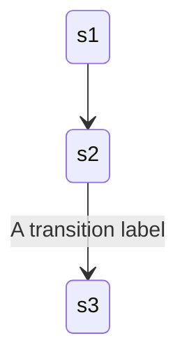

## Start and End States

Use `[*]` for entry and exit points:

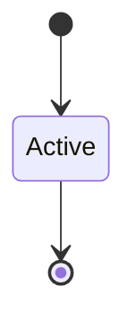

## Composite (Nested) States

Group related states using curly braces:

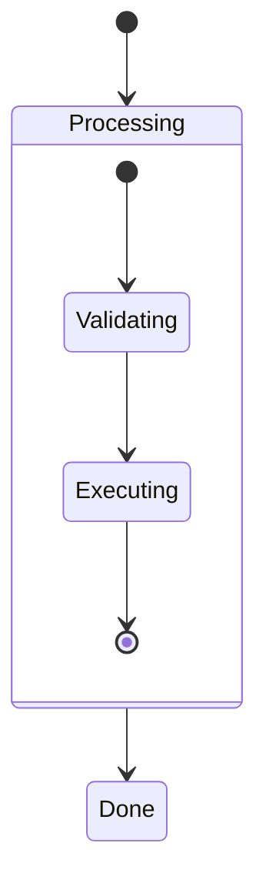

**Multiple nesting levels:**
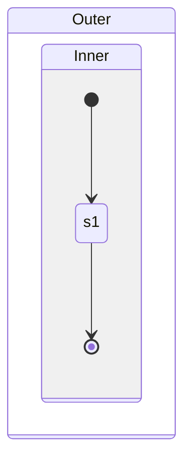

**Transitions between composite states:**
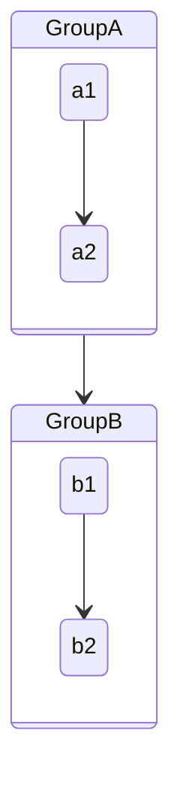

## Choice (Conditional Branching)

Use `<<choice>>` for decision points:

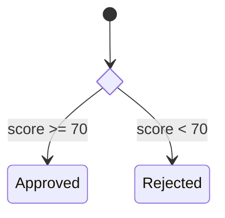

## Forks and Joins (Parallel Execution)

Use `<<fork>>` and `<<join>>` for concurrent paths:

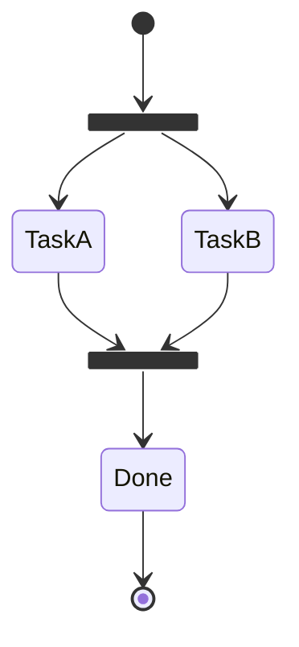

## Notes

Add annotations to states:

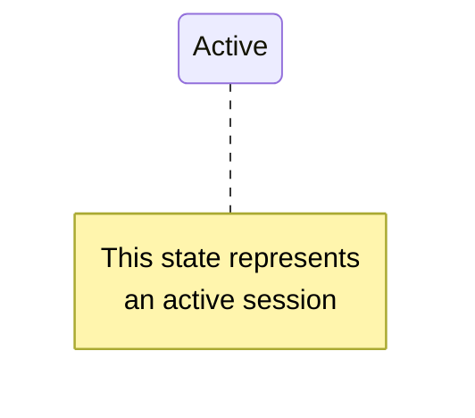

Positions: `right of`, `left of`

## Concurrency

Represent concurrent regions with `--`:

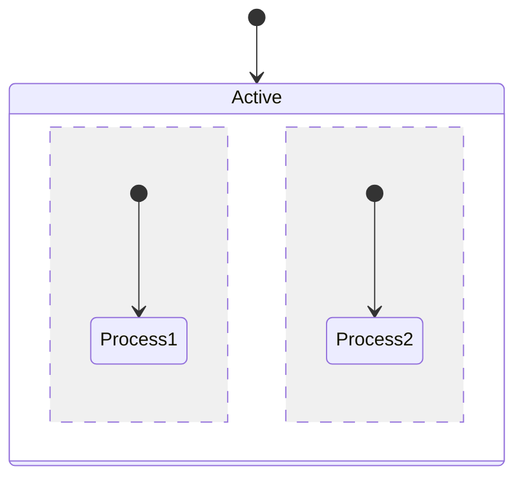

## Direction

Control layout direction:

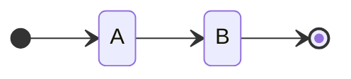

Options: `LR` (left-right), `TB` (top-bottom)

## Styling with classDef

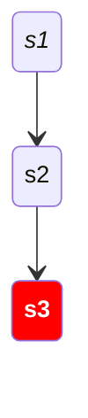

**Apply to multiple states:**
```mermaid
stateDiagram-v2
    classDef highlight fill:#ff9,stroke:#333
    class s1, s2 highlight
```

**Limitations:**
- Cannot style start/end states `[*]`
- Cannot style composite states directly

## Comprehensive Example: Order Lifecycle

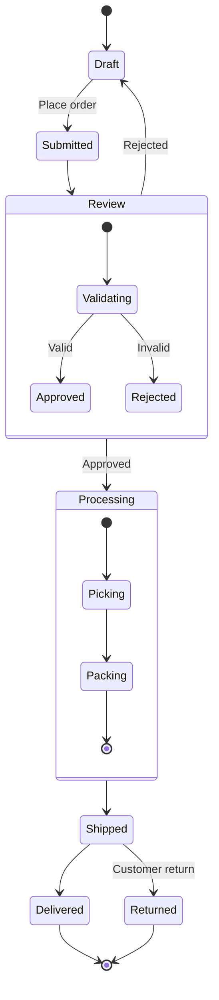

## Tips

1. **Use composite states** to group related sub-states and reduce clutter
2. **Add choice nodes** for conditional branching instead of multiple labeled transitions
3. **Use forks/joins** when modeling parallel workflows
4. **Direction LR** works well for lifecycle/pipeline diagrams
5. **Keep depth shallow** - avoid more than 2 levels of nesting

## Reference

- [Official Documentation](https://mermaid.js.org/syntax/stateDiagram.html)
