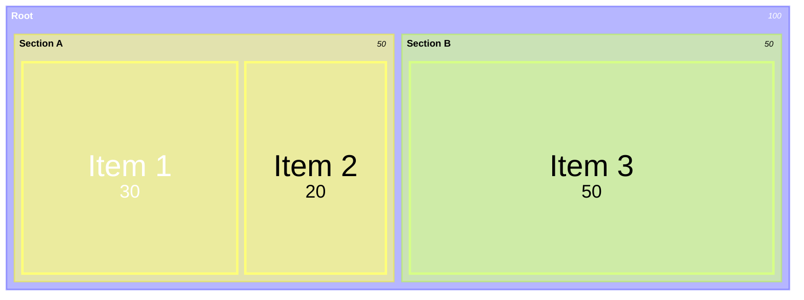
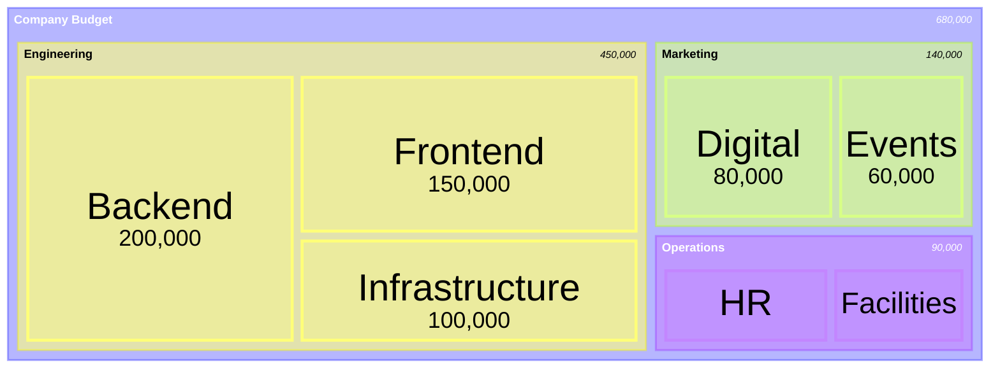
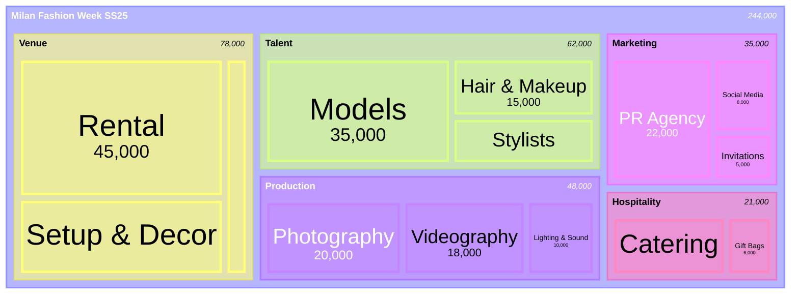

# Treemap Diagrams Reference

Treemaps display hierarchical data as nested rectangles where size is proportional to value. Use for budget breakdowns, disk usage, portfolio allocation, and any hierarchical proportional data.

**Note:** Treemaps use the `treemap-beta` keyword (experimental).

## Basic Syntax



## Node Types

### Section/Parent Nodes
Quoted text without a value:
```
"Section Name"
```

### Leaf Nodes with Values
Quoted text with colon and numeric value:
```
"Leaf Name": value
```

### Hierarchy
Established through indentation (spaces or tabs):



## Styling with classDef

Apply custom styles to individual nodes:


## Value Formatting

Configure number display using D3 format specifiers:

```mermaid
%%{init: {'treemap': {'valueFormat': '$,.0f'}}}%%
treemap-beta
    "Budget": 680000
        "Engineering": 450000
        "Marketing": 140000
        "Operations": 90000
```

### Common Format Specifiers

| Format | Output | Use Case |
|--------|--------|----------|
| `,` | 1,000 | Thousands separator |
| `$,.0f` | $1,000 | Dollar amounts |
| `$.2f` | $1000.00 | Dollar with decimals |
| `$,.2f` | $1,000.00 | Dollar, commas, decimals |
| `.1%` | 45.0% | Percentages |
| `.1f` | 1000.0 | One decimal place |

## Configuration Options

```
%%{init: {
  'treemap': {
    'padding': 10,
    'diagramPadding': 8,
    'showValues': true,
    'borderWidth': 1,
    'valueFontSize': 12,
    'labelFontSize': 14,
    'valueFormat': ','
  }
}}%%
```

| Option | Description | Default |
|--------|-------------|---------|
| `padding` | Internal node padding | 10 |
| `diagramPadding` | Outer diagram padding | 8 |
| `showValues` | Display values in nodes | true |
| `borderWidth` | Node border thickness | 1 |
| `valueFontSize` | Value text size | 12 |
| `labelFontSize` | Label text size | 14 |
| `valueFormat` | D3 number format | `,` |

## FashionOS Example: Event Budget Breakdown



## Common Use Cases

- **Budget allocation** - Show spending proportions across departments
- **Disk usage** - Visualize file/folder sizes in a filesystem
- **Revenue breakdown** - Product lines, regions, or channels
- **Team structure** - Show team sizes proportionally
- **Portfolio composition** - Asset allocation by category
- **Event costs** - Production budget breakdown by category

## Limitations

- Works best with natural hierarchies
- Small values become difficult to label at deep levels
- Not suitable for negative values
- Deep hierarchies (4+ levels) reduce clarity
- Beta feature - syntax may evolve

## Tips

1. **Use 2-3 levels** of hierarchy for best readability
2. **Style categories** with distinct colors using classDef
3. **Configure valueFormat** to match your data type (currency, percentage)
4. **Order sections** by size (largest first) for better layout
5. **Keep labels short** - long text may overflow small rectangles
6. **Aggregate small items** into an "Other" category to reduce clutter

## Reference

- [Official Documentation](https://mermaid.js.org/syntax/treemap.html)
