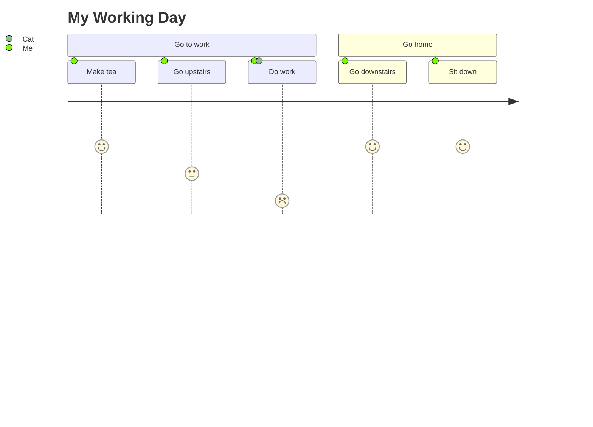
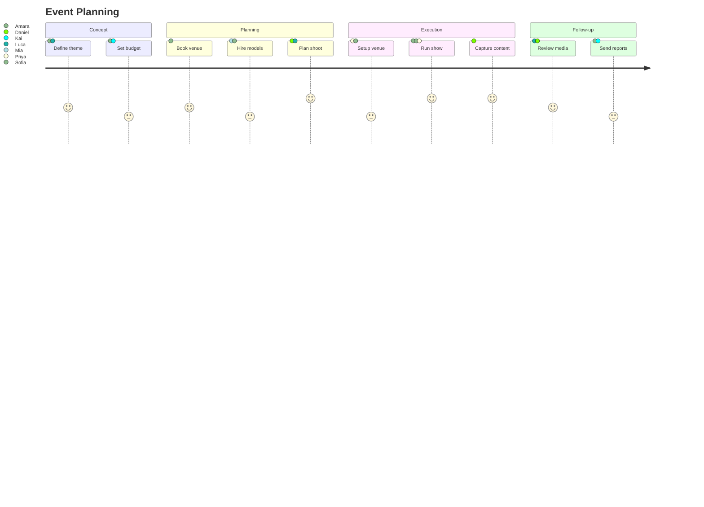
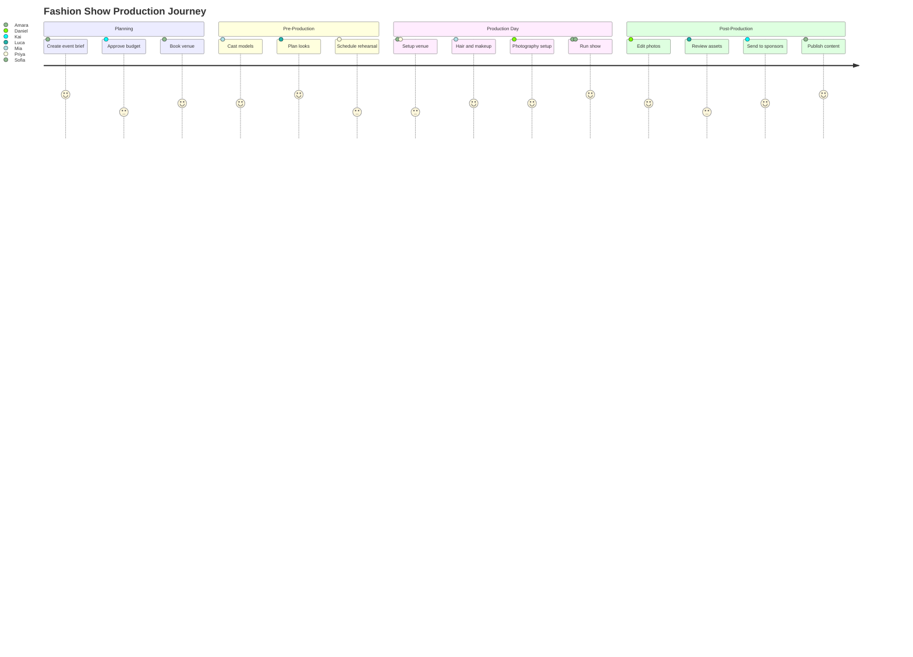

# User Journey Diagrams Reference

User journey diagrams illustrate the steps users take to complete tasks, with satisfaction scores for each step. Use for mapping user workflows, identifying pain points, and planning UX improvements.

## Basic Syntax



## Structure

### Title
```
journey
    title Journey Title
```

### Sections
Divide the journey into logical phases:
```
section Phase Name
```

### Tasks
Each task follows this format:
```
Task name: <score>: <comma separated actors>
```

- **Task name** - description of the step
- **Score** - satisfaction rating from 1 (worst) to 5 (best)
- **Actors** - comma-separated list of participants involved

## Score Meanings

| Score | Meaning | Color |
|-------|---------|-------|
| 1 | Very negative / frustrated | Red |
| 2 | Negative / difficult | Orange |
| 3 | Neutral / acceptable | Yellow |
| 4 | Positive / good | Light green |
| 5 | Very positive / delighted | Green |

## Multiple Actors

Tasks can involve multiple actors to show collaboration or handoffs:



## FashionOS Example: Fashion Show Journey



## Tips

1. **Use sections** to group related tasks into workflow phases
2. **Be honest with scores** - low scores highlight improvement opportunities
3. **Include all relevant actors** to show handoffs and collaboration points
4. **Keep task names concise** - 2-5 words per task
5. **Identify pain points** - steps with scores 1-2 are candidates for improvement
6. **Compare as-is vs to-be** - create two diagrams to show improvement plans

## Use Cases

- **UX research** - Map current user workflows and identify friction
- **Process improvement** - Visualize team workflows across phases
- **Stakeholder communication** - Show user experience across touchpoints
- **Sprint planning** - Identify which pain points to address first

## Reference

- [Official Documentation](https://mermaid.js.org/syntax/userJourney.html)
