# ZenUML Diagrams Reference

ZenUML is an alternative syntax for sequence diagrams that uses programming-language-style constructs (if/else, while, try/catch). Use when you prefer code-like syntax over standard sequence diagram notation.

## Basic Syntax

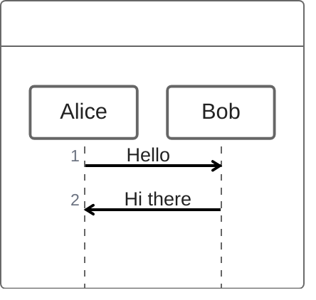

**Note:** ZenUML is an external module. It requires `@mermaid-js/mermaid-zenuml` to be registered.

## Participants

### Implicit Declaration
Participants are created when first referenced:
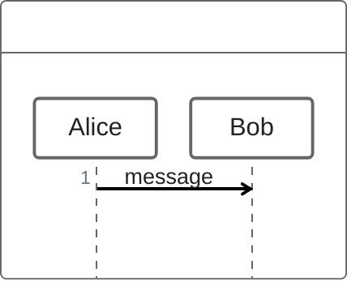

### Aliases
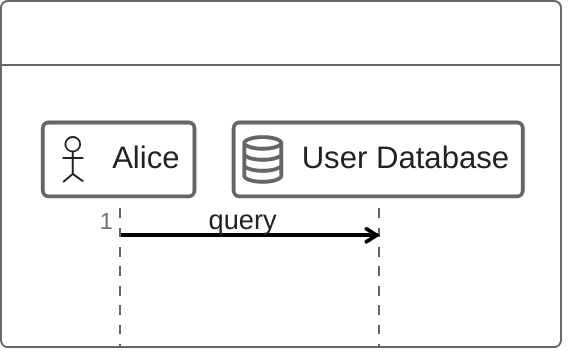

### Annotators
Special participant types:
- `@Actor` - Person/user
- `@Database` - Database
- `@Entity` - System entity
- `@Boundary` - System boundary
- `@Control` - Controller
- `@Queue` - Message queue

## Message Types

### Synchronous (Blocking)
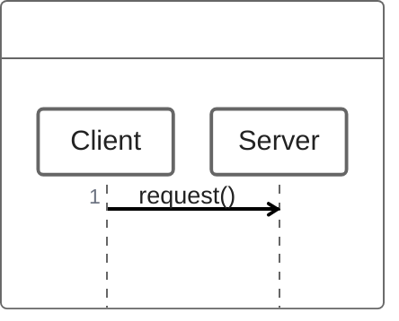

### Asynchronous (Non-blocking)
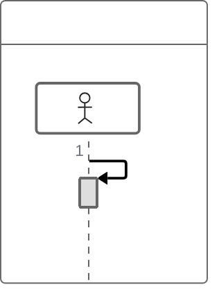

### Creation Messages
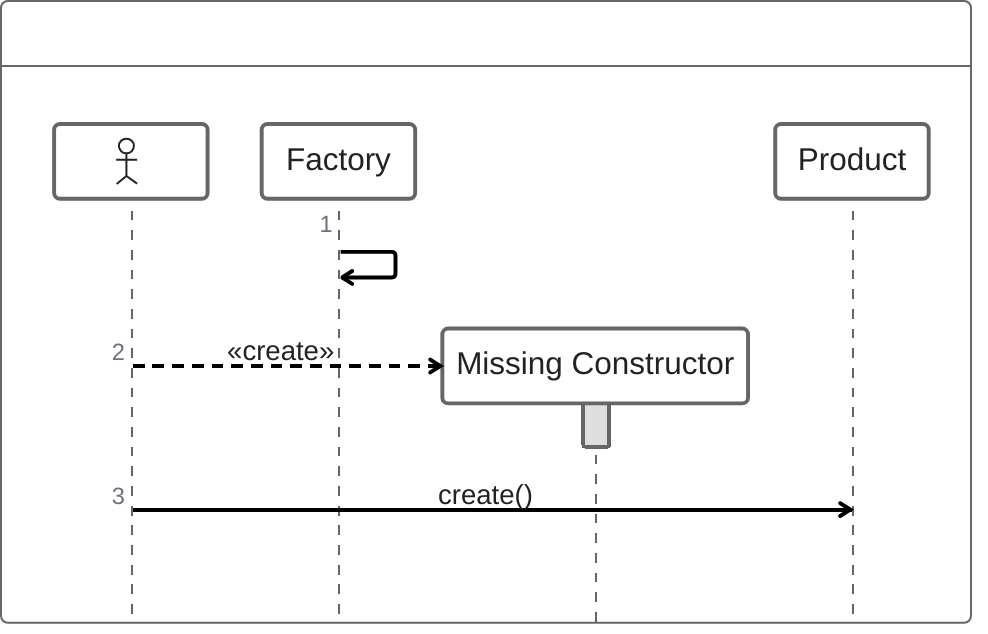

### Return Messages
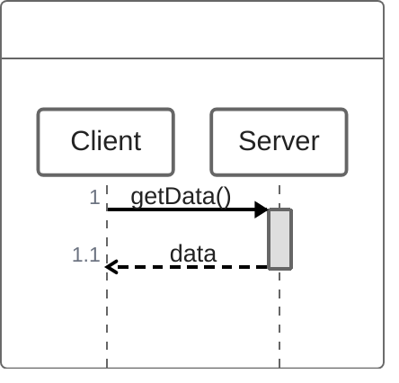

Three return patterns:
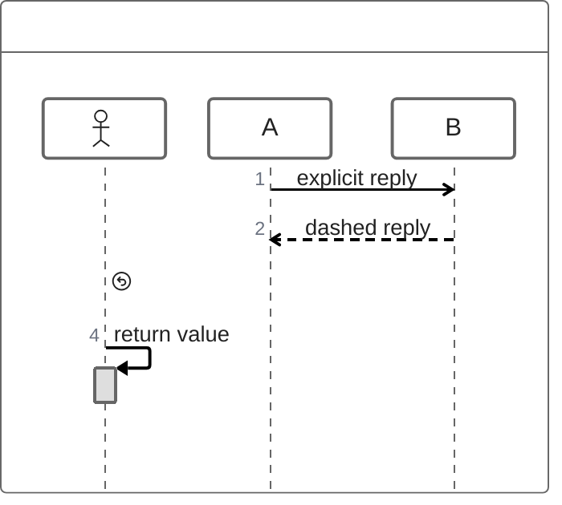

## Nesting

Sync and creation messages support nesting with braces:
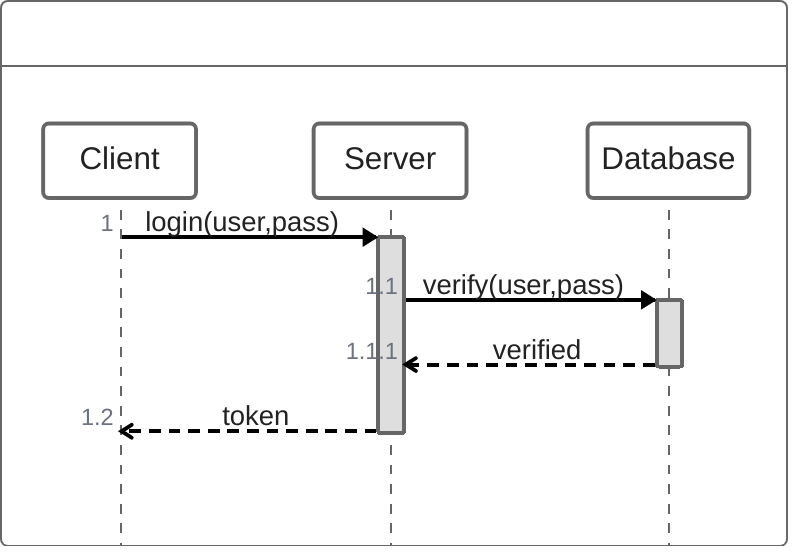

## Control Flow

### Conditionals (Alt/Else)
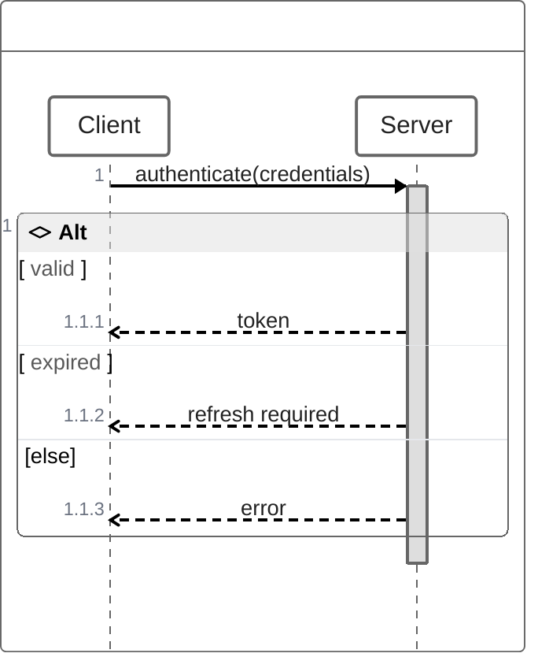

### Loops
Four loop keywords available:
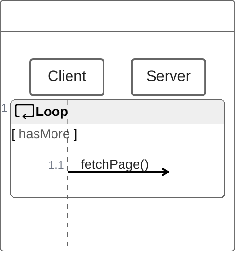

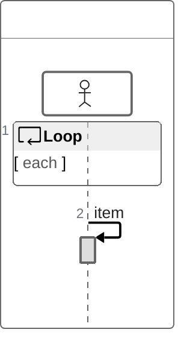

Also: `forEach`, `foreach`, `loop`

### Optional (Opt)
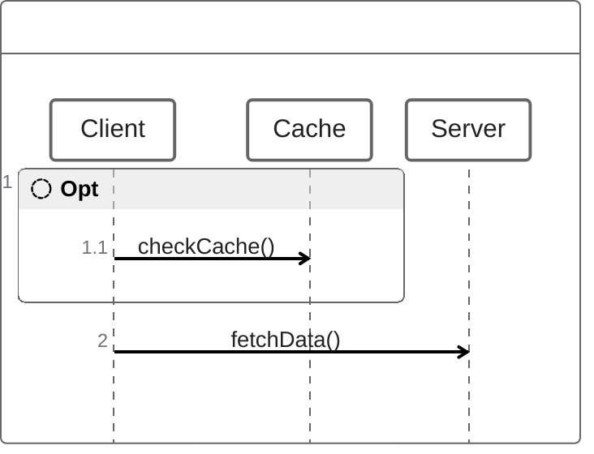

### Parallel (Par)
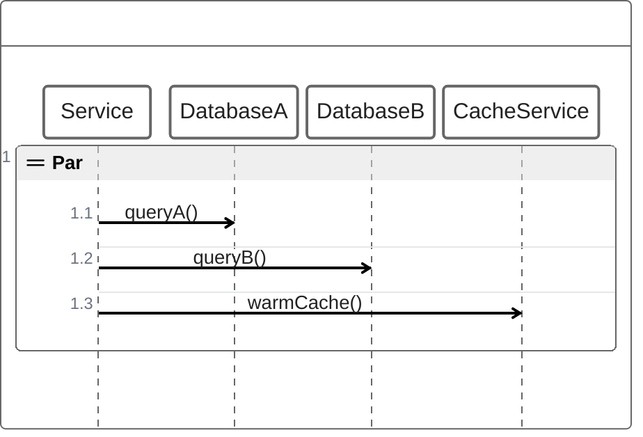

### Exception Handling
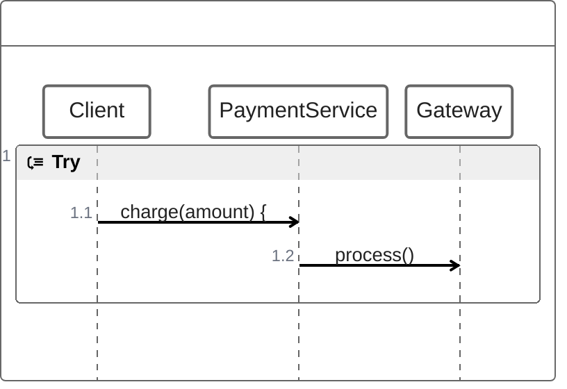

## Comments

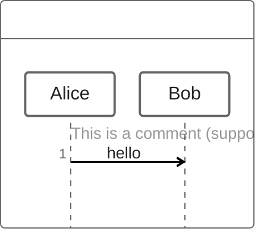

## ZenUML vs Standard Sequence Diagrams

| Feature | ZenUML | Standard |
|---------|--------|----------|
| Syntax style | Code-like (braces, if/else) | Diagram-like (alt/end, loop/end) |
| Nesting | Curly braces `{}` | Keyword blocks |
| Conditionals | `if/else if/else` | `alt/else/end` |
| Loops | `while/for/forEach` | `loop/end` |
| Error handling | `try/catch/finally` | `break` (limited) |
| Async | `=>` operator | `--)` arrow |
| Creation | `new` keyword | `create` keyword |

**Choose ZenUML when:**
- Your team thinks in code structures
- You need try/catch/finally patterns
- Complex nesting is easier to read with braces

**Choose standard when:**
- Broader tool compatibility is needed
- You want more styling/theming options
- Simpler diagrams without deep nesting

## Integration

ZenUML requires explicit registration as an external diagram:

```html
<script type="module">
  import mermaid from 'mermaid';
  import zenuml from '@mermaid-js/mermaid-zenuml';
  await mermaid.registerExternalDiagrams([zenuml]);
</script>
```

## Tips

1. **Use nesting** to show method call depth clearly
2. **Prefer `if/else`** over multiple separate diagrams for conditional flows
3. **Use `try/catch`** for error-handling flows - unique to ZenUML
4. **Use `par`** to explicitly show concurrent operations
5. **Add comments** with `//` to annotate complex flows
6. **Keep nesting shallow** - more than 3-4 levels becomes hard to read

## Reference

- [Official Documentation](https://mermaid.js.org/syntax/zenuml.html)
