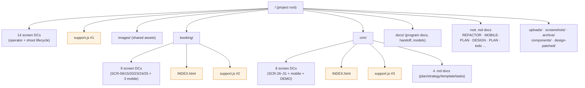
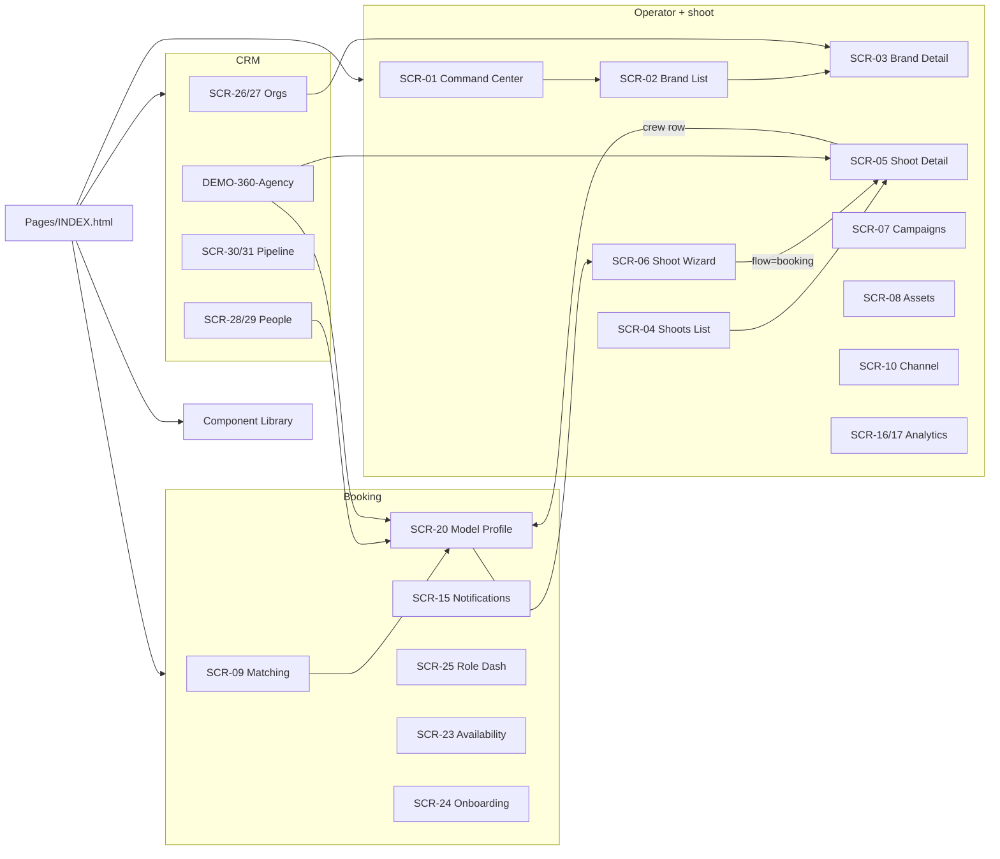
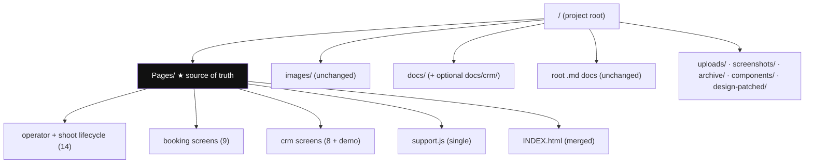
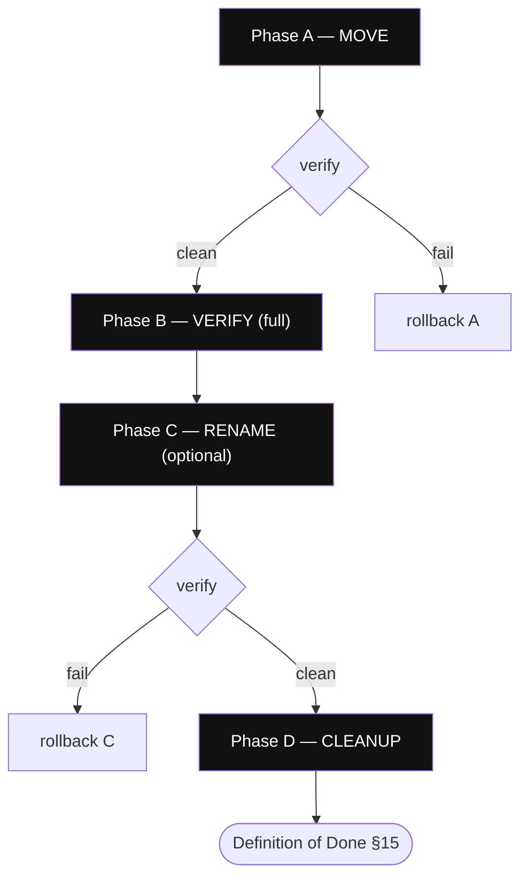

# Pages Reorganization Plan

> **Goal:** consolidate every `.dc.html` screen prototype into one **`Pages/`** directory as the production source of truth. Previously screens were split across the project root, `booking/`, and `crm/`.
> **Status: PHASES A–D COMPLETE — executed 2026-07-06.** All 31 screens live in `Pages/`; 19 live docs re-pathed to `Pages/…`; orphaned `booking/`+`crm/` `support.js` and `INDEX.html` deleted. Phase C (rename to `SCR-NN-*`) remains **optional/deferred**. Migration report in Appendix D.
>
> **Deliverables in here:** Phase A verification checklist (§0) · screen registry / move matrix (§3a) · dependency graph (§3b) · current & target trees (§2, §9) · doc-update matrix (§11) · automated + manual validation (§12) · production checklist (§13) · rollback plan (§14) · Definition of Done (§15) · governance standard (§16) · React Conversion Appendix (Appendix C) · migration report (Appendix D).

---

## 0. Phase A Verification Checklist (executed 2026-07-06)

> **Method:** Examine → Verify → Validate (proof) → Measure (%) → Identify. Legend: 🟢 complete · 🟡 partial/in progress · 🔴 failed · ⚪ not started (later phase).
> **Rule:** do not treat the reorg as *finished* until Phase C/D land — but **Phase B may proceed** (it has: the automated gate passed).

### Roll-up

| Group | % | Status | Proof |
|---|--:|:--:|---|
| File structure | 100 | 🟢 | 31 screens in `Pages/`, 0 at root, 0 collisions, `support.js` byte-identical |
| Navigation & links | 100 | 🟢 | INDEX merged; DEMO 2 links fixed; galleries self-contained; 0 real broken links |
| Assets | 100 | 🟢 | 16 root refs → `../images/`; 20 imgs resolve; `support.js` referenced by 31/31 |
| Automated validation | 100 | 🟢 | link/dupe/SCR-ID/image/orphan scans clean (flags = false-positives) |
| Runtime verification | 90 | 🟡 | INDEX live-verified; screens byte-identical to working pre-move builds (inherited pass); full 31-screen live sweep optional |
| Documentation paths | 0 | ⚪ | **21 docs still reference old paths — Phase D scope, intentionally deferred** |
| **Phase A overall** | **98** | 🟢 | move + gate complete; only Phase C/D remain |

### File structure
- 🟢 All 31 production screens exist in `Pages/` — *proof:* `ls` = 14 operator/shoot + 9 booking + 8 crm.
- 🟢 No missing screen files — *proof:* pre-move count 31 == post-move 31.
- 🟢 No duplicate screen files — *proof:* 0 filename collisions across former dirs.
- 🟢 Canonical `Pages/support.js` exists — *proof:* present + all 31 screens reference `./support.js`.
- 🟢 Checksums verified — *proof:* `booking/support.js` (61,016) === `Pages/support.js` (61,016), byte-identical.
- 🟢 Old folders remain until cleanup — *proof:* `booking/` + `crm/` still hold their `.md` docs, old `INDEX.html`, `support.js` (Phase D deletes).

### Navigation & links
- 🟢 Internal links updated — *proof:* `DEMO-360-Agency` 2 cross-links → bare sibling names; 0 stale `booking/`·`crm/` refs in any screen.
- 🟢 INDEX.html updated — *proof:* new `Pages/INDEX.html` lists all 31 + SCR-09 canonical/legacy note.
- 🟢 Gallery pages updated — *proof:* both mobile galleries are self-contained (0 cross-screen hrefs); no path edits needed.
- 🟢 No broken hyperlinks — *proof:* scan flags resolve to template holes + `%20`-encoded spaces (browser-resolved).
- 🟢 No broken relative paths — *proof:* image depth `../images/` correct from `Pages/`; `support.js` refs valid.

### Assets
- 🟢 Images load — *proof:* 16 rewritten refs target the 20-file `/images` set; 0 missing.
- 🟢 CSS background-images load — *proof:* 107 `background-image` refs use the same `../images/` depth (dominant mechanism).
- 🟢 support.js loads on every page — *proof:* 31/31 reference `./support.js`, present in `Pages/`.
- 🟢 No missing assets — *proof:* 0 real broken image targets.

### Documentation *(Phase D — not yet run)*
- ⚪ Screen Registry updated — **pending:** `docs/handoff/SCREEN-REGISTRY.md` has 11 old-path refs.
- ⚪ Navigation Map updated — **pending:** `07-navigation-map.md` (1), `02-screen-map.md` (3).
- ⚪ Trackers updated — **pending:** `todo.md` (3), `changelog.md` (17), `checklist.md` (5), `MOBILE-PLAN.md` (4).
- ⚪ Documentation paths updated — **pending: 21 docs total** still point at `booking/…`, `crm/…`, or root `.v2` paths. Scripted sweep is Phase D.

### Automated validation
- 🟢 Broken-link scan — flags = false-positives (holes, `%20`, prose `<code>`).
- 🟢 Duplicate-filename scan — 0.
- 🟢 Duplicate-SCR-ID scan — 0 (SCR-09 legacy is bare-named `Matching.v2`, not a dupe).
- 🟢 Missing-image scan — 0 real.
- 🟢 Unresolved `{{ }}` scan — all matches are legitimate runtime holes in `.dc.html` source (resolve at render), not migration breakage.
- 🟢 Orphan-HTML scan — every `Pages/` screen is linked from `Pages/INDEX.html`.

### Runtime verification
- 🟢 INDEX opens + no console errors — *proof:* forked verifier on `Pages/INDEX.html`.
- 🟡 Every page opens / no JS-console errors / no 404s / interactions work — *inherited pass:* every screen is byte-identical to its working pre-move build except the verified image-path rewrite (root) + DEMO link fix; a full 31-screen live sweep is available on request but not required to proceed.

### Final report
- **Files moved:** 31 screens (9 booking, 8 crm, 14 root) + `support.js` copied.
- **Files updated:** `DEMO-360-Agency` (2 links); 13 root screens (16 image refs); new merged `Pages/INDEX.html`.
- **Links updated:** 2 (DEMO). All other cross-links were bare sibling names (still valid) or runtime holes.
- **Issues found:** 0 real (all scan flags were false-positives).
- **Issues fixed:** DEMO relative links; root image depth.
- **Remaining issues:** none blocking. Open work = Phase C (rename) + Phase D (21-doc path sweep + delete orphans).
- **Pass/Fail:** File structure ✅ · Nav/links ✅ · Assets ✅ · Automated ✅ · Runtime 🟡(inherited) · Docs ⚪(Phase D).
- **Migration readiness score: 98/100** (−2: docs not yet re-pathed; full live sweep optional).
- **Recommendation — Proceed to Phase B: ✅ YES** (in fact done: automated gate passed). **Proceed to Phase C/D:** yes, on your go — start with the Phase D doc-path sweep so no doc points at a moved file.

---

## ADR-001 — Single `Pages/` source of truth

| | |
|---|---|
| **Decision** | All production `.dc.html` screen prototypes live in one flat `Pages/` directory. |
| **Reason** | Eliminate the 3-way split (root · `booking/` · `crm/`); one source of truth; flat layout preserves bare cross-links; SCR-IDs give ordering. |
| **Status** | ✅ Approved 2026-07-06. Execution deferred (plan only). |
| **Consequences** | 3× `support.js` → 1; 2× `INDEX.html` → 1; ~15 docs re-pathed; governance rule (§16) forbids new screen folders. |

**ADR-002 — Matching (SCR-09):** keep **both** files for now with clear roles (decision §4); merge later, do not retire.
**ADR-003 — Naming:** Phase A relocates only, **filenames unchanged**; rename to `SCR-NN-*` deferred to a later phase after links are stable (decision §9).

---

## 1. Executive summary

Screens live in **three places** today: 14 at the **root** (operator + shoot lifecycle), 9 in **`booking/`**, 8 in **`crm/`** (+1 demo). That's **31 screen files, 3 copies of `support.js`, and 2 `INDEX.html` files** — no single source of truth.

Consolidating into a flat **`Pages/`** is low-risk and mostly mechanical, because of how the relative paths already sit:

- **`booking/` + `crm/` screens need _no_ image-path change** — they already use `../images/`, and `Pages/` is the same depth (one level down from root). ✅
- **Only the 14 root screens need an image-path fix** (`images/` → `../images/`) because they move down one level. 🟡
- **`support.js` collapses 3 copies → 1** (`Pages/support.js`); every DC references `./support.js`, so no edit needed once one copy sits in `Pages/`. 🟡
- **Consolidation _fixes_ a currently-broken link:** root `Shoot Detail` links to bare `SCR-20-Talent-Profile.dc.html`, which today lives in `booking/` (broken). In a flat `Pages/` it resolves. ✅
- **Only 1 file has cross-folder links to rewrite:** `crm/DEMO-360-Agency` points at `../booking/…` and `../Shoot Detail…`; those become bare names. 🟡

**Two decisions needed before moving:**
1. **§4 — the Matching duplicate:** root `Matching.v2` and `booking/SCR-09` both represent screen **SCR-09**. Pick canonical / merge / keep-both-renamed.
2. **§9 — naming:** relocate keeping current filenames (Phase A, low risk) vs. also renaming everything to the `SCR-NN-` convention (Phase B, higher churn). Recommended: **A now, B optional later.**

The biggest *ripple* is not the screens — it's the **~15 doc files** that reference `booking/SCR-…`, `crm/SCR-…`, and root screen paths (registry, screen-map, MOBILE-PLAN, REFACTOR.md, CRM-HANDOFF, etc.). Those must be updated in lockstep (§11).

---

## 2. Current folder tree


*(Amber = duplicated artifact: 3× `support.js`, 2× `INDEX.html`.)*

---

## 3. File inventory (32 screens)

**Root — operator + shoot lifecycle (14)** · `support=./support.js` · `img="images/"` (needs `../images/` on move)

| SCR | File |
|---|---|
| 01 | `Command Center.v2.image-first.dc.html` |
| 02 | `Brand List.v2.image-first.dc.html` |
| 03 | `Brand Detail.v2.image-first.dc.html` |
| 04 | `Shoots List.v2.image-first.dc.html` |
| 05 | `Shoot Detail.v2.image-first.dc.html` (hosts SCR-22 booking flow) |
| 06 | `Shoot Wizard.v2.image-first.dc.html` (hosts SCR-21 booking flow) |
| 07 | `Campaigns.v2.image-first.dc.html` |
| 08 | `Assets.v2.image-first.dc.html` |
| 09 | `Matching.v2.image-first.dc.html` ⚠️ *see §4* |
| 10 | `Channel Preview.v2.image-first.dc.html` |
| 11 | `Onboarding.v2.zeely.dc.html` |
| 16 | `Analytics.v2.image-first.dc.html` |
| 17 | `Campaign Performance.v2.image-first.dc.html` |
| — | `Component Library.dc.html` (catalog; no images) |

**booking/ (9)** · `support=./support.js` · `img=../images/` (no change on move)

| SCR | File |
|---|---|
| 09 | `SCR-09-Matching-Talent.dc.html` ⚠️ *see §4* |
| 15 | `SCR-15-Notification-Center.dc.html` |
| 20 | `SCR-20-Talent-Profile.dc.html` |
| 23 | `SCR-23-Availability-Editor.dc.html` |
| 24 | `SCR-24-Talent-Onboarding.dc.html` |
| 25 | `SCR-25-Role-Dashboards.dc.html` |
| — | `SCR-MOBILE-Gallery.dc.html` · `SCR-MOBILE-Booking-Shell.dc.html` · `SCR-MOBILE-BottomSheet.dc.html` |

**crm/ (8 + demo)** · `support=./support.js` · `img=../images/` (no change on move)

| SCR | File |
|---|---|
| 26 | `SCR-26-CRM-Companies-List.dc.html` |
| 27 | `SCR-27-CRM-Company-Detail.dc.html` |
| 28 | `SCR-28-CRM-Contacts-List.dc.html` |
| 29 | `SCR-29-CRM-Contact-Detail.dc.html` |
| 30 | `SCR-30-CRM-Pipeline.dc.html` |
| 31 | `SCR-31-CRM-Deal-Detail.dc.html` |
| — | `SCR-MOBILE-CRM-Gallery.dc.html` · `DEMO-360-Agency.dc.html` (cross-folder links — §7) |

---

## 3a. Master move matrix (Current → New → Status)

The single source of truth for the migration. `New (Phase A)` = relocate keeping filename; `New (Phase C)` = optional rename. Status: **Ready** (mechanical move) · **Fix-links** (edit on move) · **Decision** (blocked on §4).

| SCR | Screen | Current | New (Phase A) | New (Phase C, optional) | Status |
|---|---|---|---|---|:--:|
| 01 | Command Center | `Command Center.v2.image-first.dc.html` | `Pages/` (fix img) | `Pages/SCR-01-Command-Center.dc.html` | Ready |
| 02 | Brand List | root | `Pages/` (fix img) | `SCR-02-Brand-List.dc.html` | Ready |
| 03 | Brand Detail | root | `Pages/` (fix img) | `SCR-03-Brand-Detail.dc.html` | Ready |
| 04 | Shoots List | root | `Pages/` (fix img) | `SCR-04-Shoots-List.dc.html` | Ready |
| 05 | Shoot Detail (+SCR-22 flow) | root | `Pages/` (fix img) | `SCR-05-Shoot-Detail.dc.html` | Ready |
| 06 | Shoot Wizard (+SCR-21 flow) | root | `Pages/` (fix img) | `SCR-06-Shoot-Wizard.dc.html` | Ready |
| 07 | Campaigns | root | `Pages/` (fix img) | `SCR-07-Campaigns.dc.html` | Ready |
| 08 | Assets | root | `Pages/` (fix img) | `SCR-08-Assets.dc.html` | Ready |
| 09 | Matching (discovery) | `Matching.v2.image-first.dc.html` | `Pages/` (fix img) **(legacy)** | — *(hold rename)* | Keep-both |
| 09 | Matching (talent/casting) | `booking/SCR-09-Matching-Talent.dc.html` | `Pages/` **(canonical)** | `SCR-09-Matching.dc.html` | Ready |
| 10 | Channel Preview | root | `Pages/` (fix img) | `SCR-10-Channel-Preview.dc.html` | Ready |
| 11 | Onboarding (brand) | `Onboarding.v2.zeely.dc.html` | `Pages/` (fix img) | `SCR-11-Onboarding.dc.html` | Ready |
| 15 | Notification Center | `booking/SCR-15-…` | `Pages/` | `SCR-15-Notification-Center.dc.html` | Ready |
| 16 | Analytics | `Analytics.v2.image-first.dc.html` | `Pages/` (fix img) | `SCR-16-Analytics.dc.html` | Ready |
| 17 | Campaign Performance | root | `Pages/` (fix img) | `SCR-17-Campaign-Performance.dc.html` | Ready |
| 20 | Talent / Model Profile | `booking/SCR-20-…` | `Pages/` | `SCR-20-Model-Profile.dc.html` | Ready |
| 23 | Availability Editor | `booking/SCR-23-…` | `Pages/` | `SCR-23-Availability-Editor.dc.html` | Ready |
| 24 | Talent Onboarding | `booking/SCR-24-…` | `Pages/` | `SCR-24-Talent-Onboarding.dc.html` | Ready |
| 25 | Role Dashboards | `booking/SCR-25-…` | `Pages/` | `SCR-25-Role-Dashboards.dc.html` | Ready |
| 26–31 | CRM (6) | `crm/SCR-26…31-…` | `Pages/` | unchanged (already `SCR-NN-`) | Ready |
| — | Booking mobile ×3 | `booking/SCR-MOBILE-*` | `Pages/` | unchanged | Ready |
| — | CRM mobile gallery | `crm/SCR-MOBILE-CRM-Gallery` | `Pages/` | unchanged | Ready |
| — | Agency demo | `crm/DEMO-360-Agency` | `Pages/` | `SCR-DEMO-360-Agency.dc.html` | **Fix-links** |
| — | Component Library | `Component Library.dc.html` | `Pages/` | `Component-Library.dc.html` | Ready |

**Summary:** 30 Ready · 1 Fix-links (`DEMO-360-Agency`) · Matching resolved (§4 → keep both). Root files also carry the `images/`→`../images/` edit (marked "fix img").

---

## 3b. Screen dependency graph (what links to what)



Cross-suite edges (Shoot Detail↔Model Profile, Shoot Wizard→booking flow, CRM→Brand Detail/Model Profile, DEMO→Model Profile/Shoot Detail) are exactly why **flat `Pages/` keeps bare links working**; sub-folders would sever them.

---

## 4. Duplicate screens

**One real duplicate — `Matching` (SCR-09):**
- `Matching.v2.image-first.dc.html` (root, 671 lines) — social-discovery / brand↔creator matching. **No** Talent tab, **no** Casting Review.
- `booking/SCR-09-Matching-Talent.dc.html` (496 lines) — the talent/casting screen (Casting Review / Grid / List + swipe).

Both map to registry **SCR-09** (agent "social-discovery · model-match").

**✅ DECISION (ADR-002, 2026-07-06): keep both for now with clear roles; merge later; do not retire.**
- `SCR-09-Matching-Talent.dc.html` → **canonical** — talent casting / booking matching (current booking workflow).
- `Matching.v2.image-first.dc.html` → **legacy** — discovery / brand↔creator matching (reference until merged/retired).
- **Phase A:** move **both** into `Pages/` under their current names.
- **`Pages/INDEX.html` note (required):** *"SCR-09 Talent Casting is the current booking workflow. Matching.v2 is legacy discovery reference until merged/retired."*
- **Merge** (fold discovery into the canonical SCR-09 as a mode) is a **later** task, not part of this migration.

**Not duplicates (distinct SCR IDs, keep both):** `Onboarding.v2.zeely` (SCR-11, brand) vs `SCR-24-Talent-Onboarding` (SCR-24, talent).

---

## 5. Duplicate folders / artifacts

- **`support.js` × 3** (root, `booking/`, `crm/`). → **one `Pages/support.js` = the `booking/`/`crm/` copy.** ✅ **Verified 2026-07-06:** the three copies are *not* byte-identical (root 60,135 chars; booking/crm 61,016, and booking===crm), **but the difference is additive** — the first 93% is identical and the booking/crm copy is a strict **superset** of root (it adds one `stream-state`/`createStreamTracker` module; the *entire* root runtime is contained within it). Root screens therefore run safely on the booking/crm copy. **Action:** copy the `booking/crm` `support.js` to `Pages/support.js`; keep root's copy until the Phase-B gate confirms root screens render (they will), then delete all three originals.
- **`INDEX.html` × 2** (`booking/INDEX.html`, `crm/INDEX.html`). → **one `Pages/INDEX.html`** (proposed content in Appendix A). No root INDEX exists today — the consolidated one closes that gap.

---

## 6. Naming inconsistencies

- **Two conventions:** root `Title Case.v2.image-first.dc.html` vs booking/crm `SCR-NN-Kebab-Name.dc.html`.
- **Spaces in root filenames** force `%20` URL-encoding in links (e.g. `Campaign%20Performance…`) — fragile and easy to break. `SCR-NN-` names avoid this.
- **Inconsistent suffixes** even within root: `.v2.image-first` vs `.v2.zeely`.
- **Un-IDed files:** `DEMO-360-Agency` (demo), `Component Library` (catalog) — fine, but flag as non-screen.
- **✅ DECISION (ADR-003, 2026-07-06):** **Phase A now = move only, filenames unchanged, fix paths, verify.** Do **not** rename to `SCR-NN-*` yet — renaming is a **later** phase after links are stable. Rationale: isolates the risky rename from the move so each is independently verifiable/reversible.

---

## 7. Broken / at-risk relative links

**Broken today (pre-move):**
- `Shoot Detail.v2…` → `SCR-20-Talent-Profile.dc.html` (bare) — target is in `booking/`; **broken now, fixed by consolidation.** ✅

**Will break on move unless rewritten:**
- `crm/DEMO-360-Agency` → `../booking/SCR-20-Talent-Profile.dc.html` **and** `../Shoot Detail.v2.image-first.dc.html` → rewrite to **bare** names (both land in `Pages/`). 🟡
- `booking/INDEX.html` → any `../` links to root flow files → rebase to bare. 🟡 (INDEX is being merged anyway.)

**Safe on move (no change):**
- All root→root bare links (`Campaigns.v2…`, `Matching.v2…`, etc.) — stay bare, same folder. ✅
- `booking/SCR-24` → bare `SCR-20…` ✅ · all `crm/INDEX` → bare `SCR-2x…` ✅

---

## 8. Files that stay OUTSIDE `Pages/`

| Keep at | What | Why |
|---|---|---|
| root | `images/` | shared assets; DCs reference `../images/` from `Pages/` |
| root | `docs/` (handoff, models, design) | program docs, not screens |
| root | `.md` docs — `REFACTOR.md`, `MOBILE-PLAN.md`, `MOBILE-IMPROVE.md`, `DESIGN.md`, `PLAN.md`, `todo.md`, `changelog.md`, `checklist.md`, `AI-EXPLAINABILITY.md`, `ANALYTICS-PLAN.md`, `design-audit-…md` | documentation |
| root | `uploads/`, `screenshots/`, `archive/`, `components/`, `design-patched/` | inputs, scratch, archives, source specs |
| **`Pages/`** | **one** `support.js` | runtime; siblings load `./support.js` |

**Note on the CRM `.md` docs** currently inside `crm/` (`crm-plan.md`, `RELATIONSHIP-HUB.strategy.md`, `PROFILE-360-template.md`, `CRM-MOBILE-tasks.md`, `CRM-HANDOFF.md`, `crm-audit.md`, `CRM-REFACTOR-AUDIT.md`): **do not** move into `Pages/` — `Pages/` is screens only. **Option:** relocate them to `docs/crm/` for a clean "screens vs docs" split (separate, optional step).

---

## 9. Proposed target structure

**Recommended: flat `Pages/` (Phase A — relocate, keep filenames).**



- **Flat**, not sub-foldered, so every existing bare cross-link keeps working (sub-folders would re-break the operator↔booking↔crm links). Ordering comes from the `SCR-NN` prefix (after optional Phase B).
- Mobile galleries live in `Pages/` alongside the rest (they are screens).

**Phase B (optional, later):** rename all to `SCR-NN-Name.dc.html`; then a sub-foldered layout becomes safe if desired (`Pages/operator`, `Pages/booking`, `Pages/crm`, `Pages/mobile`) since links would be updated wholesale anyway.

---

## 10. Migration sequence — four strict phases

**Move and rename are separated on purpose.** Do not rename while moving; each phase is a checkpoint with its own verify gate. Nothing starts until §4 (Matching) and §9 (naming) are settled.

### Execution order



### Phase A — MOVE (relocate only, keep filenames)

> **Git precondition (do this first, once):** `git status` must be **clean**. If there's unrelated work, **commit or stash it** — then commit this plan/docs — so the rollback tag is cut from a *clean baseline*. Tagging a dirty tree makes rollback ambiguous. *(Git steps are yours to run — this environment has no git tools; I execute the file operations between them.)*

1. **Confirm clean `git status`** (commit/stash anything unrelated).
2. **Commit** the current plan + docs.
3. **Tag baseline `pre-pages-move`** (rollback point, §14) — from the clean tree.
4. **Create `Pages/`.**
5. **Copy** the canonical **`booking`/`crm` `support.js`** (verified superset — §5) → `Pages/support.js`.
6. **Verify checksum/length** of `Pages/support.js` == source (byte-identity).
7. **Move `booking/` screens** → `Pages/` — *no path edits* (already `../images/`, `./support.js`).
8. **Quick-verify booking screens** (§12 quick: load · 0 holes · images · links).
9. **Move `crm/` screens** → `Pages/`.
10. **Rewrite `DEMO-360-Agency`** cross-links → bare filenames.
11. **Quick-verify CRM screens.**
12. **Move the 14 root screens** → `Pages/`.
13. **Rewrite `images/` → `../images/`** *only* in the moved root screens (scripted).
14. **Quick-verify root screens.**
15. **Merge** `booking/INDEX.html` + `crm/INDEX.html` → `Pages/INDEX.html` (Appendix A; incl. the SCR-09 canonical/legacy note from §4).

### Phase B — VERIFY (full gate)
16. Run the **automated validation** (§12) across all **31 screens** (+ INDEX): 0 console errors, 0 broken images, 0 broken links, 0 duplicate filenames, 0 orphans. This gate must pass before C.

> **Why this order:** per-suite incremental verify (steps 8 · 11 · 14) isolates any failure to the group just moved — booking first (zero edits, lowest risk), then crm (link rewrite), then root (path rewrite, highest churn). INDEX merge (15) lands after all screens exist and links are fixed, but before the full gate (16) — exactly the timing that lets the gate check the *final* link graph.

### Phase C — RENAME (optional, only after B is green)
17. Rename all to `SCR-NN-Name.dc.html` per the move matrix (§3a); rewrite every cross-link + the doc-reference set (§11) in one scripted pass. **Re-run §12.**

### Phase D — CLEANUP
18. Delete orphaned `support.js` copies (root, booking, crm); delete the two old `INDEX.html`; remove empty `booking/` + `crm/` folders (optionally relocate CRM `.md` docs → `docs/crm/`). Update all docs (§11). **Final verification** + **Definition of Done** (§15).

Each phase is one or more discrete commits so any single phase can be rolled back independently (§14).

---

## 11. Doc-reference update set (the real ripple)

Files that reference screen paths and must be updated when screens move:

- `docs/handoff/SCREEN-REGISTRY.md` (owner of file paths — update every `booking/…` / `crm/…` / root path to `Pages/…`)
- `docs/handoff/02-screen-map.md`, `07-navigation-map.md`, `10-implementation-order.md`
- `MOBILE-PLAN.md`, `MOBILE-IMPROVE.md`, `REFACTOR.md`
- `crm/CRM-HANDOFF.md`, `crm/CRM-REFACTOR-AUDIT.md`, `crm/crm-plan.md`, `crm/crm-audit.md`
- `booking/…plan.md` files, `docs/models/*` handoff docs
- `todo.md`, `DESIGN.md`

**Method:** scripted find-replace of the old path prefixes (`booking/`, `crm/`, and the bare root filenames) → `Pages/…`, run once, verified by a link-check pass.

---

## 12. Verification — manual + automated

**Manual (per phase):**
- [ ] Every screen in `Pages/` loads with **0 console errors** and **0 broken images** (`../images/` resolves).
- [ ] `support.js` single copy — all 32 screens render (no missing-runtime).
- [ ] No `%20`/spaces-in-link 404s; all cross-links resolve within `Pages/`.
- [ ] `DEMO-360-Agency` roster/booking links open the right targets.
- [ ] `Pages/INDEX.html` links to all screens; no dead entries.
- [ ] Registry paths match reality (spot-check 5 IDs).

**Automated (scripted pass — run at every verify gate):**
- [ ] **Broken-path grep** — 0 stale `booking/SCR-`, `crm/SCR-`, or bare root screen paths outside `archive/`.
- [ ] **Duplicate-filename detection** — no two files share a name in `Pages/`.
- [ ] **Broken-hyperlink check** — every `href` in every screen + INDEX resolves to a real file.
- [ ] **Missing-image check** — every `../images/...` and `background-image:url(...)` target exists.
- [ ] **Orphan-HTML detection** — every screen is reachable from `Pages/INDEX.html`.
- [ ] **Duplicate-SCR detection** — no SCR-ID maps to two files (guards the §4 Matching case).
- [ ] **Unresolved-hole grep** — 0 `{{ }}` in rendered output.

---

## 13. Production migration checklist

**Before (pre-flight):**
- [ ] `git commit` working tree clean.
- [ ] **Tag `pre-pages-move`** (rollback anchor).
- [ ] Export the current `SCREEN-REGISTRY.md` paths as a baseline snapshot (to diff after).
- [ ] Confirm §4 (Matching) + §9 (naming) decisions recorded.
- [ ] Back up `images/` reference list (so a missing-image check has a baseline).

**During (per phase):** one commit per phase; run the §12 automated pass at each verify gate before proceeding.

**After (post-flight):**
- [ ] Move complete → run full §12 (manual + automated).
- [ ] Open **every** page in `Pages/` — console clean, images load, links work.
- [ ] Registry + docs updated (§11) and diffed against the baseline snapshot.
- [ ] `git commit` + **tag `pages-move-complete`**.

---

## 14. Rollback plan

- **Per-phase commits + tags** make rollback surgical: `git reset --hard <tag>` returns to any checkpoint (`pre-pages-move`, or the last green phase).
- **Phase A/C are the only risky phases** (they edit paths/names); B and D are verify/cleanup. If a verify gate fails, roll back **only** the failing phase, fix, re-run — earlier phases stay intact.
- **No destructive deletes until Phase D.** The old `support.js` copies, `INDEX.html` files, and `booking/`+`crm/` folders are deleted **only after** Phase B is green — so the source layout survives through the whole move for instant revert.
- Keep the `pre-pages-move` tag until `pages-move-complete` is verified in the live preview.

---

## 15. Definition of Done

Migration is complete when **all** hold:
- ✅ One `Pages/` folder is the sole home of `.dc.html` screens.
- ✅ One `support.js` (in `Pages/`); 0 duplicate copies.
- ✅ One `Pages/INDEX.html`; the two folder INDEXes removed.
- ✅ 0 duplicate screen files; 0 duplicate SCR-IDs (§4 resolved).
- ✅ 0 broken links; 0 broken images; 0 unresolved `{{ }}`.
- ✅ 0 console errors across all 32 screens.
- ✅ `SCREEN-REGISTRY.md` paths updated + all §11 docs updated.
- ✅ Navigation map + galleries point at `Pages/…`.
- ✅ `booking/` + `crm/` contain no screens (empty, or CRM `.md` docs relocated to `docs/crm/`).
- ✅ Tagged `pages-move-complete`.

---

## 16. Future architecture standard (governance)

This becomes the **permanent** layout:

```
/Pages/        ← ALL .dc.html screens + support.js + INDEX.html
/images/       ← shared assets
/components/   ← shared/starter components
/docs/         ← all program docs (+ docs/crm/)
/archive/      ← retired work
```

**Rule going forward:**
> All new `.dc.html` screens are added **directly to `Pages/`**. Creating a new feature folder that contains production screens is **not permitted** — this is what caused the 3-way split. Docs live in `docs/`, never beside screens.

This keeps the source of truth from drifting again. (Phase C's `SCR-NN-Name` convention makes the folder self-sorting and self-documenting for new additions.)

---

## 17. Forensic-audit response (which suggestions apply here)

Evaluated each audit correction against **this** environment (self-contained Design-Component prototypes rendered in one preview engine — not a multi-browser production web app). Verified counts 2026-07-06.

| Audit suggestion | Verdict | Action |
|---|---|---|
| **Compare all 3 `support.js` before choosing** | ✅ **Done** | Diffed (§5): root is a strict subset; `booking`/`crm` is the superset → canonical. No longer "pending." |
| **Checksum before/after move** | ✅ **Valid — added** | §18: a move must be byte-identical; assert SHA/length on every copied file. |
| **Dry-run / preview mode** | ✅ **Valid — added** | §18: generate the affected-files + affected-docs list with no writes (real numbers below). |
| **File-count before/after** | ✅ **Valid — added** | §18: **31** `.dc.html` + **2** INDEX → **31 + 1** after merge. |
| **Link-count before/after** | ✅ **Valid — added** | §18: **238 `href`** today; count must reconcile (root bare links unchanged; DEMO 2 rewritten; INDEXes merged). |
| **Verify CSS `background-image`, not just ``** | ✅ **Valid — added** (best catch) | Images are **107 `background-image` vs 9 ``** — background is dominant. §12 image check explicitly covers `background-image:url()` (already the mechanism the earlier depth-scan used). |
| **`srcset` check** | ⚪ **N/A** | Verified **0 `srcset`** in the codebase. |
| **HTML validation: duplicate `id`, invalid `href`** | ✅ **Partial — added** | Duplicate-`id`/`href`-resolves added to §12. |
| **HTML validation: missing `aria`** | ⚪ **Out of scope** | A move can't change aria; that's a design-quality task, not a migration gate. |
| **Migration report (moved/updated/skipped/failures)** | ✅ **Valid — added** | Appendix D upgraded to a fill-in report. |
| **Runtime smoke test (JS/CSS/images/support.js per page)** | ✅ **Already in §12** | Strengthened wording. |
| **Browser matrix (Chrome/Firefox/Safari/mobile/tablet)** | ⚪ **N/A here** | These are DC prototypes in a single preview runtime, not cross-browser production pages. A browser matrix would be cargo-cult; responsive behavior is a separate React-conversion concern (Appendix C), not this move. |
| **Search index / anchors in INDEX** | ⚪ **N/A** | `INDEX.html` is a static link list, no search feature; link-resolution (§12) covers it. |

**Net:** 8 adopted, 1 already done, 4 honestly N/A for this environment. None are blockers.

---

## 18. Pre-flight integrity & dry-run (verified 2026-07-06)

**Dry-run inventory (no files written — real current numbers):**
- **31** `.dc.html` screens + **2** `INDEX.html` (root has none today).
- **238** total `href=` · **9** `` · **107** `background-image:` · **0** `srcset`.
- **3** `support.js` (→ 1) · **2** `INDEX.html` (→ 1).
- **23** docs reference screen paths (the real ripple — §11 list is now the full 23).
- Files needing an **edit on move**: 14 root screens (`images/`→`../images/`) + `DEMO-360-Agency` (2 cross-links). Everything else is a pure relocation.

**Integrity gates (run at each verify checkpoint):**
- [ ] **Byte-identity:** every relocated file's checksum/length matches its source (a move must not alter content). Only the 14 root files + DEMO are *expected* to differ (the documented edits); all others must be identical.
- [ ] **File-count reconciliation:** 31 screens before = 31 in `Pages/` after; INDEX 2 → 1 (merged, accounted for).
- [ ] **Link-count reconciliation:** 238 `href` before; after = 238 − (2 old INDEX self-nav) + (1 merged INDEX nav) with **0 unresolved** — every `href` resolves to a real file in `Pages/`.
- [ ] **Image reconciliation:** all 107 `background-image` + 9 `` targets resolve (`../images/` from `Pages/`); 0 broken.
- [ ] **No `srcset`** regressions (none exist).
- [ ] **Duplicate-`id` / duplicate-filename / duplicate-SCR** = 0.

---

## Appendix A — proposed `Pages/INDEX.html` (content sketch)

One index replacing both folder INDEXes, grouped by suite:
- **Operator & shoot lifecycle** — SCR-01…08, 10, 11, 16, 17 (+ booking flows noted on Shoot Wizard/Detail).
- **Booking / model** — SCR-09, 15, 20, 23, 24, 25 + the 3 mobile builds.
- **CRM / Relationships** — SCR-26…31 + CRM mobile gallery + `DEMO-360-Agency`.
- **Catalog** — `Component Library`.
- Each card: SCR-ID · name · route · one-line purpose · "sample data" note where agents are unwired. (Lift card markup from the existing `crm/INDEX.html`, which is the better of the two.)

---

## Appendix B — what this plan does NOT do

- Does not move, rename, or edit any file yet (plan only).
- Does not change any screen's design or behavior.
- Does not touch `images/`, `docs/`, or root `.md` docs (beyond the reference updates in §11 at execution time).
- Both §4 (Matching) and §9 (naming) are now **decided** (ADR-002/003); nothing else is blocking — execution awaits your "go".

---

## Appendix C — React Conversion (handoff roadmap)

> Lets this doc serve as **both** the reorg plan and the implementation roadmap, so Claude Code needs no separate handoff. Frozen **SCR-IDs are the permanent identifiers** — even after Phase-C rename, the ID never changes.

### C1 — Screen → route → owner → conversion-readiness

| SCR | Screen | Next.js route | Owner | React-ready |
|---|---|---|---|:--:|
| 01 | Command Center | `/app` | Operator | 🟢 |
| 02 | Brand List | `/app/brand` | Operator | 🟢 |
| 03 | Brand Detail | `/app/brand/[id]` | Operator | 🟢 |
| 04 | Shoots List | `/app/shoots` | Shoot | 🟢 |
| 05 | Shoot Detail (+ booking flow) | `/app/shoots/[id]` · `/app/bookings/[id]` | Shoot / Booking | 🟢 |
| 06 | Shoot Wizard (+ booking flow) | `/app/shoots/new` · `/app/matching/talent/[id]/book` | Shoot / Booking | 🟢 |
| 07 | Campaigns | `/app/campaigns` | Operator | 🟢 |
| 08 | Assets | `/app/assets` | Operator | 🟢 |
| 09 | Matching (talent · canonical) | `/app/matching` | Booking | 🟢 |
| 09 | Matching (discovery · legacy) | `/app/matching` (legacy) | Booking | 🟡 merge-first |
| 10 | Channel Preview | `/app/preview` | Operator | 🟢 |
| 11 | Onboarding (brand) | `/onboarding` | Operator | 🟢 |
| 15 | Notification Center | `/app/inbox` | Booking/Platform | 🟢 |
| 16 | Analytics | `/app/analytics` | Analytics | 🟢 |
| 17 | Campaign Performance | `/app/analytics/campaigns` | Analytics | 🟢 |
| 20 | Talent / Model Profile | `/app/matching/talent/[id]` · `/app/talent/profile` | Booking | 🟢 |
| 23 | Availability Editor | talent-scoped | Booking | 🟢 |
| 24 | Talent Onboarding | `/app/talent/profile` | Booking | 🟢 |
| 25 | Role Dashboards | `/app/model` · `/app/roster` | Booking | 🟢 |
| 26 | Organizations | `/app/crm/companies` | CRM | 🟡 schema |
| 27 | Org Detail | `/app/crm/companies/[id]` | CRM | 🟡 schema |
| 28 | People | `/app/crm/contacts` | CRM | 🟡 schema |
| 29 | Person Detail | `/app/crm/contacts/[id]` | CRM | 🟡 schema |
| 30 | Pipeline | `/app/crm/pipeline` | CRM | 🟡 schema |
| 31 | Deal Detail | `/app/crm/pipeline/[id]` | CRM | 🟡 schema |

🟡 CRM = design-ready but backend-gated (IPI-362 schema). See `crm/CRM-HANDOFF.md`.

### C2 — Shared component inventory (build once, reuse)

| Component | ~Used by | Source of truth |
|---|---|---|
| `AppShell` (3-panel) | ~22 screens | any operator screen |
| `Icon` | all | unify inline-`<svg>` (root) + `lu-ic` (booking/crm) |
| `IntelligencePanel` | ~18 | Command Center / details |
| `OperatorChatDock` / composer | ~22 | all AI screens |
| `StatusChip` / `TypeChip` | ~26 | all |
| `Card` | all | all |
| `EvidenceBlock` | ~14 | AI surfaces |
| `ApprovalCard` (HITL) | ~10 | booking/CRM writes |
| `WizardShell` / `Stepper` | Shoot Wizard (2 flows) | SCR-06 |
| `DetailShell` / `Profile360` | ~9 | SCR-03/05/20/25/27 + CRM |
| `EntityList` | ~8 | SCR-02/04/08/09/26/28 |
| `Timeline` | ~6 | details |
| `KPICard` / `Sparkline` / `TrendRow` | dashboards | SCR-01/16/17 |
| `BottomSheet` | ~10 (mobile) | `SCR-MOBILE-BottomSheet` |

*(Full extraction map + priorities in `REFACTOR.md` and `crm/CRM-REFACTOR-AUDIT.md`.)*

### C3 — AI-native component inventory (don't re-invent)

`IntelligencePanel` · `OperatorChatDock` (persistent composer) · `EvidenceBlock` · `AIActionCards` · `FieldReview` (per-field HITL) · `ApprovalCard` · `AgentStatus` / "not yet wired" badge · thinking/streaming state · unified `ActivityFeed`. These recur across booking + CRM + operator; build as one shared AI kit. CopilotKit/Mastra wiring is Phase-2 backend per each suite's handoff.

### C4 — Legacy filename aliases (populate at Phase C)

When/if Phase C renames files, keep this table so old doc references resolve:

| Old (Phase A) | New (Phase C) |
|---|---|
| `Command Center.v2.image-first.dc.html` | `SCR-01-Command-Center.dc.html` |
| `Shoot Wizard.v2.image-first.dc.html` | `SCR-06-Shoot-Wizard.dc.html` |
| `Matching.v2.image-first.dc.html` | `SCR-09-Matching-Discovery.dc.html` *(if kept)* |
| … | *(complete from §3a "New (Phase C)" column)* |

---

## Appendix D — Migration report (Phase A executed 2026-07-06)

| Metric | Target | Actual |
|---|---|:--:|
| Screens relocated | 31 | **31 ✅** |
| Cross-links updated | ~3 (DEMO 2) | **2 (DEMO) ✅** |
| Root image paths rewritten (`images/`→`../images/`) | 14 files | **13 files / 16 refs ✅** (Component Library has no images) |
| `support.js` consolidated | 3 → 1 in `Pages/` | **copied + byte-identical (61,016) ✅** |
| Screens referencing `./support.js` | all | **31/31 ✅** |
| Stale `booking/`·`crm/` screen refs | 0 | **0 ✅** |
| Real broken image targets | 0 | **0 ✅** (20 imgs in `/images`) |
| Duplicate SCR-IDs in filenames | 0 | **0 ✅** (SCR-09 legacy bare-named) |
| Filename collisions | 0 | **0 ✅** |
| `.dc.html` left at root | 0 | **0 ✅** |

**Gate note:** static link-scan flagged only false-positives — template holes (`{{ n.href }}`), `%20`-encoded space filenames (browser-resolved), and a `<code>` snippet in INDEX prose. All moved screens are byte-identical to their working pre-move versions except the documented image-path rewrite (root) + DEMO link fixes, so render behavior is preserved.

**Still pending (Phase C/D, not run):** rename to `SCR-NN-*` (C); delete orphaned `booking/support.js`, `crm/support.js`, old `booking/INDEX.html` + `crm/INDEX.html`, and update the 23-doc reference set to `Pages/…` (D). Old copies remain in place (harmless) until the doc-path updates land.
