# iPix / FashionOS — Master Sitemap

> **Single source of truth for the whole application map.** Synthesizes the Pages/ folder (31 built screens), `docs/handoff/SCREEN-REGISTRY.md` (canonical SCR-IDs — the numbering owner), the navigation/screen maps, the model-booking engineering override (D1–D9), and the CRM/Relationships reframe. **No redesign — this is a map, not a change.**
> Legend: 🟢 built & verified · 🟡 proto (fixtures, agent unwired) · ⚪ planned · ⏸ future · 🔴 backend-blocked.
> Last synced 2026-07-06 (post Pages/ migration).

---

## 1. Executive summary

iPix is an **AI-native operating system for fashion production** — not a generic CRM or a single-purpose booking tool. It spans six domains under one shell: **Operator platform** (command center, brands, campaigns, assets, analytics), **Shoot lifecycle** (list · wizard · detail), **two-sided Booking** (operator discovery + casting ↔ talent/agency offers), **CRM / Relationships hub**, **Onboarding**, and a **platform-wide AI layer** (persistent chat dock + read-only IntelligencePanel, route-scoped).

- **31 screen prototypes** are built and live in `Pages/` (one flat folder, one `support.js`). 15 are 🟢 verified; 16 are 🟡 proto (design-complete, agents/schema pending).
- **Architecture spine:** one 3-panel shell (NavRail · Workspace · IntelligencePanel) + a persistent `OperatorChatDock`, reused across ~22 screens; on mobile the panel becomes a BottomSheet and the dock a pinned composer.
- **Booking is a *flow*, not a parallel app:** SCR-21/22 are the Shoot Wizard/Detail running `flow=booking`. **CRM is a front door**, not a data silo: won deals hand off to existing Brand/Shoot screens.
- **HITL everywhere:** no AI auto-accepts, books, confirms, or publishes. Writes go through ApprovalCard / FieldReview.
- **Biggest gaps** are backend, not design: CRM (IPI-362 schema) and the `booking` agent are 🔴; a handful of catalog/collaboration screens (SCR-12/13/14/18) are ⚪ unbuilt.

---

## 2. Complete Mermaid sitemap

```mermaid
graph TD
  ROOT["iPix / FashionOS<br/>(one app shell)"]

  ROOT --> OPS["Operator platform"]
  ROOT --> SHOOT["Shoot lifecycle"]
  ROOT --> BOOK["Booking (two-sided)"]
  ROOT --> CRM["CRM / Relationships"]
  ROOT --> ONB["Onboarding"]
  ROOT --> ANALYTICS["Analytics"]

  OPS --> CC["SCR-01 Command Center /app"]
  OPS --> BL["SCR-02 Brand List /app/brand"]
  OPS --> BD["SCR-03 Brand Detail /app/brand/:id"]
  OPS --> CM["SCR-07 Campaigns /app/campaigns"]
  OPS --> AS["SCR-08 Assets /app/assets"]
  OPS --> CH["SCR-10 Channel Preview /app/preview"]
  OPS --> NC["SCR-15 Notifications /app/inbox"]

  SHOOT --> SL["SCR-04 Shoots List /app/shoots"]
  SHOOT --> SD["SCR-05 Shoot Detail /app/shoots/:id"]
  SHOOT --> SW["SCR-06 Shoot Wizard /app/shoots/new"]

  BOOK --> MATCH["SCR-09 Matching + Casting /app/matching"]
  BOOK --> TP["SCR-20 Talent/Model Profile /app/matching/talent/:id"]
  BOOK --> BW["SCR-21 Booking Wizard = SW flow=booking"]
  BOOK --> BDET["SCR-22 Booking Detail = SD flow=booking"]
  BOOK --> AV["SCR-23 Availability Editor"]
  BOOK --> TON["SCR-24 Talent Onboarding /app/talent/profile"]
  BOOK --> RD["SCR-25 Role Dashboards /app/model · /app/roster"]

  CRM --> ORG["SCR-26 Organizations /app/crm/companies"]
  CRM --> ORGD["SCR-27 Org 360° /app/crm/companies/:id"]
  CRM --> PPL["SCR-28 People /app/crm/contacts"]
  CRM --> PPLD["SCR-29 Person 360° /app/crm/contacts/:id"]
  CRM --> PIPE["SCR-30 Pipeline /app/crm/pipeline"]
  CRM --> DEAL["SCR-31 Deal Detail /app/crm/pipeline/:id"]

  ONB --> OB["SCR-11 Onboarding /onboarding"]
  ANALYTICS --> AN["SCR-16 Analytics /app/analytics"]
  ANALYTICS --> CP["SCR-17 Campaign Perf /app/analytics/campaigns"]

  %% key cross-links
  MATCH -.shortlist→book.-> BW
  TP -.request booking.-> BW
  BW -.sends offer.-> BDET
  BDET -.confirmed→crew.-> SD
  BDET -.events.-> NC
  RD -.accept/decline.-> BDET
  ORGD -.brand_id.-> BD
  DEAL -.won→convert.-> BD
  PIPE --> DEAL
  ORG --> ORGD
  PPL --> PPLD

  %% unbuilt / future
  OPS -.⚪.-> CAT["SCR-12 Catalog"]
  OPS -.⚪.-> COL["SCR-13 Collections"]
  OPS -.⚪.-> PDP["SCR-14 Asset→PDP crops"]
  OPS -.⚪.-> COLLAB["SCR-18 Collaboration/Audit"]
  ROOT -.⏸.-> EV["SCR-19 Event Mgmt"]
```



---

## 3. Screen inventory

| SCR | Screen | Route | Role / owner | Status | File (`Pages/`) |
|---|---|---|---|:--:|---|
| 01 | Command Center | `/app` | Operator · production-planner | 🟢 | `Command Center.v2.image-first.dc.html` |
| 02 | Brand List | `/app/brand` | Operator · brand-intelligence | 🟢 | `Brand List.v2.image-first.dc.html` |
| 03 | Brand Detail | `/app/brand/[id]` | Operator · brand-intelligence | 🟢 | `Brand Detail.v2.image-first.dc.html` |
| 04 | Shoots List | `/app/shoots` | Operator · production-planner | 🟢 | `Shoots List.v2.image-first.dc.html` |
| 05 | Shoot Detail (+ inline booking crew row) | `/app/shoots/[id]` | Operator · production-planner | 🟢 | `Shoot Detail.v2.image-first.dc.html` |
| 06 | Shoot Wizard | `/app/shoots/new` | Operator · production-planner | 🟢 | `Shoot Wizard.v2.image-first.dc.html` |
| 07 | Campaigns | `/app/campaigns` | Operator · creative-director | 🟢 | `Campaigns.v2.image-first.dc.html` |
| 08 | Assets | `/app/assets` | Operator · visual-identity | 🟢 | `Assets.v2.image-first.dc.html` |
| 09 | Matching + Casting Review/Grid/List | `/app/matching` | Operator/Booking · model-match | 🟢 / 🟡 Talent | `SCR-09-Matching-Talent.dc.html` (canonical) · `Matching.v2.image-first.dc.html` (legacy discovery) |
| 10 | Channel Preview | `/app/preview` | Operator · visual-identity | 🟢 | `Channel Preview.v2.image-first.dc.html` |
| 11 | Onboarding (brand) | `/onboarding` | Operator · brand-intelligence | 🟢 | `Onboarding.v2.zeely.dc.html` |
| 12 | Product Catalog | `/app/catalog` | Operator · ecommerce | ⚪ | — |
| 13 | Collections / Seasons | `/app/collections` | Operator · production-planner | ⚪ | — |
| 14 | Asset → PDP crops | `/app/assets/pdp` | Operator · visual-identity | ⚪ | — |
| 15 | Notification Center | `/app/inbox` | Platform | 🟡 | `SCR-15-Notification-Center.dc.html` |
| 16 | Analytics Overview | `/app/analytics` | Operator · analytics | 🟢 | `Analytics.v2.image-first.dc.html` |
| 17 | Campaign Performance | `/app/analytics/campaigns` | Operator · analytics | 🟢 | `Campaign Performance.v2.image-first.dc.html` |
| 18 | Collaboration / Comments / Audit | `/app/activity` | Platform | 🟢 | `Pages/SCR-18-Collaboration-Audit.dc.html` |
| 19 | Event Management | `/app/events` | Platform | ⏸ | — |
| 20 | Talent / Model Profile (`mode`) | `/app/matching/talent/[id]` · `/app/talent/profile` | Booking · model-match | 🟡 | `SCR-20-Talent-Profile.dc.html` |
| 21 | Booking Wizard (= Shoot Wizard `flow=booking`) | `/app/matching/talent/[id]/book` | Booking 🔴 | 🟡 | `Shoot Wizard.v2.image-first.dc.html` |
| 22 | Booking Detail (= Shoot Detail `flow=booking`) | `/app/bookings/[id]` | Booking 🔴 | 🟡 | `Shoot Detail.v2.image-first.dc.html` |
| 23 | Availability Editor | talent-scoped | Booking | 🟡 | `SCR-23-Availability-Editor.dc.html` |
| 24 | Talent Onboarding (URL-context) | `/app/talent/profile` | Booking 🔴 | 🟡 | `SCR-24-Talent-Onboarding.dc.html` |
| 25 | Role Dashboards (Model · Agency) | `/app/model` · `/app/roster` | Talent/Agency · booking 🔴 | 🟡 | `SCR-25-Role-Dashboards.dc.html` |
| 26 | Organizations (kind: brand/agency/vendor/sponsor) | `/app/crm/companies` | CRM · crm-assistant 🔴 | 🟡* | `SCR-26-CRM-Companies-List.dc.html` |
| 27 | Organization 360° | `/app/crm/companies/[id]` | CRM 🔴 | 🟡* | `SCR-27-CRM-Company-Detail.dc.html` |
| 28 | People (role: contact/model/photographer/crew) | `/app/crm/contacts` | CRM 🔴 | 🟡* | `SCR-28-CRM-Contacts-List.dc.html` |
| 29 | Person 360° | `/app/crm/contacts/[id]` | CRM 🔴 | 🟡* | `SCR-29-CRM-Contact-Detail.dc.html` |
| 30 | CRM Pipeline (6-stage kanban) | `/app/crm/pipeline` | CRM 🔴 | 🟡* | `SCR-30-CRM-Pipeline.dc.html` |
| 31 | CRM Deal Detail (won/lost HITL) | `/app/crm/pipeline/[id]` | CRM 🔴 | 🟡* | `SCR-31-CRM-Deal-Detail.dc.html` |

\* CRM design-complete but **backend-gated** (IPI-362 schema not built).

**Count clarity:** **31 production screens** (SCR-01…31, the table above) + **1 demo** (`DEMO-360-Agency` — template showcase, not a route) + **4 mobile reference builds** (`SCR-MOBILE-*` — prove the mobile system, not production React) + **1 reference** (`Component Library` — tokens/components, not a route). Only the 31 are production routes; the other 6 files in `Pages/` are references/demos.

### 3a. Reference & mobile builds (non-route files in `Pages/`)

| File (`Pages/…`) | Kind | Purpose |
|---|---|---|
| `SCR-MOBILE-Gallery.dc.html` | mobile preview | 28 operator/booking frames @390 |
| `SCR-MOBILE-CRM-Gallery.dc.html` | mobile preview | 6 CRM frames @390 |
| `SCR-MOBILE-Booking-Shell.dc.html` | mobile ref shell | tab bar · persistent composer · Insights sheet |
| `SCR-MOBILE-BottomSheet.dc.html` | mobile primitive | Insights / filters / expanded-chat sheet |
| `Component Library.dc.html` | design-system catalog | tokens + component primitives (promote to source of truth) |
| `DEMO-360-Agency.dc.html` | template demo | 360° profile template, Agency config |

Plus `Pages/INDEX.html` (gallery index) + `Pages/support.js` (shared runtime). **Total in `Pages/`: 32 `.dc.html` (31 routes + 6 references − the 5 already tabled) + INDEX + support.js.**

---

## 4. Route hierarchy

```
/onboarding                         SCR-11  (brand onboarding)
/app                                SCR-01  Command Center
├── /brand                          SCR-02  Brand List
│   └── /brand/[id]                 SCR-03  Brand Detail
├── /shoots                         SCR-04  Shoots List
│   ├── /shoots/new                 SCR-06  Shoot Wizard  (flow=shoot | booking → SCR-21)
│   └── /shoots/[id]                SCR-05  Shoot Detail   (flow=shoot | booking → SCR-22)
├── /campaigns                      SCR-07  Campaigns
├── /assets                         SCR-08  Assets   (⚪ /assets/pdp SCR-14)
├── /matching                       SCR-09  Matching (+ Talent tab · Casting Review)
│   └── /matching/talent/[id]       SCR-20  Talent/Model Profile
│       └── /matching/talent/[id]/book  SCR-21  Booking Wizard
├── /bookings/[id]                  SCR-22  Booking Detail
├── /talent/profile                 SCR-24  Talent Onboarding / self Model Profile
├── /model                          SCR-25  Role Dashboard (Model)
├── /roster                         SCR-25  Role Dashboard (Agency)
├── /preview                        SCR-10  Channel Preview
├── /inbox                          SCR-15  Notification Center
├── /analytics                      SCR-16  Analytics
│   └── /analytics/campaigns        SCR-17  Campaign Performance
├── /crm/companies                  SCR-26  Organizations
│   └── /crm/companies/[id]         SCR-27  Organization 360°
├── /crm/contacts                   SCR-28  People
│   └── /crm/contacts/[id]          SCR-29  Person 360°
├── /crm/pipeline                   SCR-30  Pipeline
│   └── /crm/pipeline/[id]          SCR-31  Deal Detail
├── /catalog                        SCR-12  ⚪   /collections SCR-13 ⚪
├── /activity                       SCR-18  ⚪   /events SCR-19 ⏸
```

---

## 5. Navigation map (desktop + mobile)

**Desktop — NavRail (collapsed icon rail, left):** Home (SCR-01) · Brands (02) · Shoots (04) · Matching (09) · Assets (08) · Campaigns (07) · Analytics (16) · CRM (26) · Inbox (15). CRM expands to Organizations/People/Pipeline. Talent-role users see a reduced rail centered on Role Dashboard (25) + Availability (23).

**Desktop — 3-panel:** NavRail │ Workspace (screen) │ IntelligencePanel (right, read-only). `OperatorChatDock` docked bottom of the workspace.

**Mobile — bottom tab bar (5 slots + More):** context-aware. Operator: Home · Shoots · Matching · Inbox · More. CRM context: Organizations · People · Pipeline · Inbox · More. Talent: Dashboard · Offers · Availability · Inbox · More. Top app bar (title + `+ New` + hamburger). Persistent composer pinned above the tab bar; **Insights** button opens the IntelligencePanel as a BottomSheet. (Full route→assistant map: `MOBILE-PLAN.md §22`.)

---

## 6. User journeys

**Brand onboarding:** `/onboarding` SCR-11 → (URL-context AI drafts brand DNA, HITL FieldReview) → Command Center SCR-01 → Brand Detail SCR-03.

**Campaigns:** SCR-01 → Campaigns SCR-07 → (creative-director drafts moodboard/brief, HITL) → spawn Shoot (SCR-06) → track in Campaign Performance SCR-17.

**Shoots:** Shoots List SCR-04 → Shoot Wizard SCR-06 (`flow=shoot`, 10 steps) → Shoot Detail SCR-05 (tabs: overview·crew·schedule·call-sheet·approvals·deliverables·activity) → Deliverables → Assets SCR-08.

**Model discovery:** Matching SCR-09 (Talent tab, Grid/List) → filter by fit/availability → Talent/Model Profile SCR-20 → Shortlist (drawer).

**Casting review ("card" mode, professional — not dating):** SCR-09 Casting Review → focused candidate card (fit badge, why-matched) → **swipe or buttons**: left=Skip · right=Shortlist · up=View Profile (buttons are the accessible source of truth; swipe is enhancement; keyboard shortcuts; aria-live toast) → shortlist stack → book.

**Booking:** from SCR-09 shortlist or SCR-20 → **Booking Wizard SCR-21** (= Shoot Wizard `flow=booking`: Talent · Dates/Availability · Rate/Terms · Message · Review, HITL FieldReview on AI rate) → sends offer → **Booking Detail SCR-22** (status `requested→quoted→approved→confirmed`; operator-only confirm) → on `confirmed`, upserts `shoot.shoot_crew` (inline booking accordion on Shoot Detail SCR-05 crew row) → events land in Notifications SCR-15. Talent side: Role Dashboard SCR-25 → Accept/Decline (confirm sheet) → SCR-22.

**CRM:** Organizations SCR-26 → Organization 360° SCR-27 (Overview·Contacts·Deals·Activity; `brand_id` → existing Brand Detail SCR-03) · People SCR-28 → Person 360° SCR-29 · Pipeline SCR-30 → Deal Detail SCR-31 → **won → ApprovalCard → convert to Brand** (hands off to SCR-03). Quick-Add CRM available from the dock.

**Analytics:** Command Center SCR-01 KPIs → Analytics Overview SCR-16 (deltas + sparklines) → Campaign Performance SCR-17 drill-down.

---

## 7. AI architecture

**Two surfaces, always separate:**
- **IntelligencePanel** (right / mobile BottomSheet) — **read-only** briefing: quick facts, EvidenceBlock (confidence + rationale), needs-attention, recommended actions. Never a chat.
- **OperatorChatDock** — the single conversational surface (persistent composer on mobile). Text-only (voice = Future). Route-scoped assistant, proactive greeting + chips, streamed responses.

**Assistant per route (scoped):** Command Center→Production · Brand*→Brand · Assets→Asset · Channel/Campaign→Commerce · Analytics→Analytics · Matching/Talent→Matching (`model-match`) · Booking Wizard/Detail→Booking · Shoots→Production · Inbox→Operations · CRM→`crm-assistant`. (Full map + chips: `MOBILE-PLAN.md §22.3`.)

**Agents:** `production-planner` (shoots), `brand-intelligence`, `creative-director`, `visual-identity`, `analytics-intelligence`, `social-discovery`, **`model-match`** (🟢 built — discovery/scoring/shortlist, never writes bookings), **`booking`** (🔴 spec — draft quotes/messages only), **`crm-assistant`** (🔴 spec).

**Human-in-the-Loop actions (never auto):** booking accept/confirm (operator-only), talent accept/decline (confirm sheet), deal won/lost + brand-convert (ApprovalCard), publish (Channel Preview), every AI-drafted field (FieldReview approve/edit). AI drafts and explains; humans commit.

---

## 8. CRM integration points

- **Quick-Add CRM** — from the dock / `+ New`: create Organization, Person, or Deal without leaving the current screen.
- **Organizations ↔ Brands** — SCR-27 links to existing Brand Detail SCR-03 on `brand_id` (CRM is a front door, not a copy).
- **Deals → conversion** — SCR-31 won deal → ApprovalCard → converts/links to a Brand; hands off to the operator platform.
- **People ↔ Talent** — People SCR-28 `role` (contact/model/photographer/crew); model rows relate to Talent/Model Profile SCR-20 (photographer/crew 360° = Phase 2, schema-gated).
- **Activities** — one unified `crm_activities` timeline across Org/Person/Deal (no per-entity silos).
- **All CRM 🔴 backend-gated** on IPI-362 schema (`crm_companies/contacts/deals/activities` + org-scoped RLS). Design is complete; wiring waits.

---

## 9. Modal · drawer · BottomSheet · wizard map

- **Wizards:** Shoot Wizard SCR-06 (`flow=shoot` 10 steps · `flow=booking` 5 steps = SCR-21). One reusable WizardShell/Stepper.
- **Drawers:** Shortlist (SCR-09), Notification slide-over (SCR-15), workspace switcher (mobile hamburger).
- **BottomSheets (mobile):** IntelligencePanel (Insights) on every screen; expanded chat (94vh); filter sheets; CRM stage-move action sheet (SCR-30); confirm sheets (Accept booking SCR-25, won/lost SCR-31). Primitive: `Pages/SCR-MOBILE-BottomSheet.dc.html`.
- **Modals:** Call Sheet (SCR-05), edit dialogs (SCR-05/22), image/evidence viewers. ApprovalCard is an inline HITL gate (SCR-22/31), not a modal.
- **A11y:** every overlay closes via button + Esc + backdrop, focus-trap + restore, aria-live toast.

---

## 10. Mobile sitemap

All 31 screens have phone layouts on the shared mobile system (`< 1024px` collapse): bottom tab bar (56px+safe-area) · top app bar (52px) · persistent composer · Insights BottomSheet · ≥44px targets · no voice. Reference builds in `Pages/`: **`SCR-MOBILE-Gallery`** (28 platform frames), **`SCR-MOBILE-CRM-Gallery`** (6 CRM frames incl. the kanban→**stage-accordion** reflow), **`SCR-MOBILE-Booking-Shell`** (shell proof), **`SCR-MOBILE-BottomSheet`** (primitive). The one non-trivial reflow is Pipeline kanban → vertical stage accordion (tap-deal → action-sheet move; keyboard-move is the a11y requirement). Full spec + verification matrix: `MOBILE-PLAN.md`.

---

## 11. Gap analysis

**Missing screens (⚪ planned, unbuilt):** SCR-12 Product Catalog · SCR-13 Collections/Seasons · SCR-14 Asset→PDP crops. **Future (⏸):** SCR-19 Event Management. **Phase-2 entities (todo 26, schema-gated):** Photographer / Crew / Location 360° (same template, per-entity config). **Do-not-design (todo 27):** Campaigns/Products/Events/Contracts/Sponsors-as-entity/Invoices/Payments, live relationship-graph viz, semantic cross-entity search.

**Orphan screens:** none — all 31 `Pages/` screens are linked from `Pages/INDEX.html`; galleries are self-contained by design.

**Duplicate screens:** one intentional pair — **SCR-09** `SCR-09-Matching-Talent` (canonical) + `Matching.v2` (legacy discovery), tagged, merge later (ADR-002). **Retirement rule:** `Matching.v2` retires the moment discovery is merged into canonical SCR-09 as a mode — it is a reference, not a permanent second screen. No accidental duplicates.

**Broken journeys (backend-gated, design intact):** Booking write-path (SCR-21→22→confirm) needs the `booking` agent + RPCs 🔴; all CRM journeys need IPI-362 schema 🔴; Notifications SCR-15 unread/realtime unwired. Talent/photographer link from CRM People → full 360° partially Phase-2.

**Missing navigation:** SCR-18 Activity and SCR-12/13 have registry routes but no built screen or rail entry yet; add rail slots when built. Booking `/bookings/[id]` deep-link exists but is reached via flow, not a top-level rail item (intended).

---

## 12. Prioritized roadmap

**Core MVP (finish the built spine):**
1. Wire `booking` agent + RPCs → activate SCR-21/22 write-path + status FSM.
2. Notifications SCR-15 → unread counts + booking-event feed (the destination already built).
3. Talent self-serve: SCR-24 onboarding + SCR-25 Role Dashboards + SCR-23 availability write (table/RLS 🟢, batch RPC 🔴).
4. Ship the mobile system (composer + BottomSheet primitives) across the built screens.

**Advanced:**
5. CRM go-live: IPI-362 schema + RLS → activate SCR-26–31 (all design-complete) + `crm-assistant`.
6. Casting Review production swipe (Pointer Events, reduced-motion, analytics) — buttons/keyboard already ship.
7. Build ⚪ operator screens: SCR-12 Catalog, SCR-13 Collections, SCR-14 PDP crops, SCR-18 Collaboration/Audit.

**Phase 2:**
8. CRM entity expansion (todo 26): Photographer/Crew/Location 360° via the shared template once schema lands.
9. SCR-19 Event Management.
10. Merge SCR-09 discovery into canonical Matching; retire `Matching.v2` (ADR-002).

**Explicitly out of scope (todo 27):** live relationship-graph viz, semantic cross-entity search, invoices/payments/contracts — do not design until product + schema exist.

---

## 13. Implementation matrices (handoff)

> Added for Claude Code handoff. Grounded in the registry + `docs/models/02-engineering-reference.md` (booking D1–D9). These make the sitemap implementation-ready without redesigning anything.

### 13.1 Route → data dependency

| SCR | Route | Tables | RPCs | Realtime | AI agent |
|---|---|---|---|:--:|---|
| 01 | `/app` | brands, shoots, campaigns (read) | dashboard aggregates | — | production-planner |
| 02–03 | `/app/brand[/id]` | brands, brand_dna | — | — | brand-intelligence |
| 04–06 | `/app/shoots*` | shoots, shoot_crew, schedule | shoot CRUD | — | production-planner |
| 07 | `/app/campaigns` | campaigns | — | — | creative-director |
| 08 | `/app/assets` | assets, rights | — | — | visual-identity |
| 09 | `/app/matching` | talent, shortlists, invites | `rank_talent`, `toggle_shortlist_item` | — | model-match 🟢 |
| 10 | `/app/preview` | assets, channels | publish | — | visual-identity |
| 11 | `/onboarding` | brands | URL-context draft | — | brand-intelligence |
| 15 | `/app/inbox` | notifications | mark-read | ✅ (P2) | — |
| 16–17 | `/app/analytics*` | analytics views | aggregates | — | analytics-intelligence |
| 20 | `/app/matching/talent/[id]` | talent, bookings, reviews | profile read | — | model-match |
| 21 | `…/book` | bookings, availability | `create_booking_draft`, `transition_booking` | — | booking 🔴 |
| 22 | `/app/bookings/[id]` | bookings, shoot_crew | `transition_booking` (service-role confirm) | ✅ (P2) | booking 🔴 |
| 23 | talent-scoped | availability | `set_availability_batch` 🔴 (table/RLS 🟢) | — | — |
| 24 | `/app/talent/profile` | talent | URL-context draft | — | booking 🔴 |
| 25 | `/app/model`·`/roster` | bookings, talent, roster | `list_bookings(p_role)` | ✅ (P2) | booking 🔴 |
| 26–31 | `/app/crm/*` | crm_companies, crm_contacts, crm_deals, crm_activities | CRM CRUD + `convert_deal` | — | crm-assistant 🔴 |

All 🔴 = **IPI-362 (CRM schema)** / booking-agent + RPCs not yet built. Realtime is **Phase 2** everywhere.

### 13.2 Assistant matrix

| Screen(s) | Assistant | Remembers | Allowed (draft/explain) | Forbidden (HITL) |
|---|---|---|---|---|
| 01 · 04–06 | Production | active shoot, brand | draft plans, suggest crew | commit shoot changes |
| 02–03 | Brand | active brand | DNA/health analysis | edit brand record |
| 08 · 10 | Asset/Commerce | active asset | rights checks, crop suggest | publish |
| 16–17 | Analytics | date range, campaign | explain trends | — |
| 09 · 20 | Matching (`model-match`) | shortlist, filters | rank, score, explain fit | write a booking |
| 21–22 · 25 | Booking | talent, booking, offer | draft quote/message | accept/confirm/decline |
| 15 | Operations | unread context | summarize, prioritize | — |
| 26–31 | crm-assistant | org/person/deal, filters | draft follow-ups, cross-entity Q (🟢 rows only) | won/lost, convert, edit records |

Cross-entity CRM queries return an honest "not connected yet" where the entity has no schema (Phase 2).

### 13.3 AI agent readiness

| Agent | Scope | Status |
|---|---|:--:|
| production-planner · brand-intelligence · creative-director · visual-identity · analytics-intelligence · social-discovery | operator domains | 🟢 built |
| **model-match** | discovery / scoring / shortlist (never writes bookings) | 🟢 built |
| **booking** | draft quotes & messages only (D7) | 🔴 spec |
| **crm-assistant** | CRM drafts + cross-entity Q | 🔴 spec |

### 13.4 Permissions matrix

| Screen group | Operator | Model | Agency | Admin |
|---|:--:|:--:|:--:|:--:|
| Operator platform (01–08,10,16,17) | ✅ | — | — | ✅ |
| Matching / Casting (09,20) | ✅ | — | read-own | ✅ |
| Booking wizard/detail (21,22) | ✅ confirm | — | — | ✅ |
| Talent self (23,24, 25 Model) | — | ✅ own | — | ✅ |
| Agency (25 Roster) | — | — | ✅ roster | ✅ |
| Notifications (15) | ✅ | ✅ own | ✅ own | ✅ |
| CRM (26–31) | ✅ | — | — | ✅ |

Enforced by org-scoped RLS (Phase 2, per suite). Talent/agency see only their own records.

### 13.5 Implementation priority (P0 → P2)

- **P0 (activate the built spine):** booking agent + RPCs (21/22 FSM: `requested→quoted→approved→confirmed` +declined/expired/cancelled) · Notifications feed (15) · talent self-serve (23/24/25) · mobile primitives.
- **P1 (advanced):** CRM schema IPI-362 → activate 26–31 + crm-assistant · Casting production swipe · build ⚪ SCR-12/13/14/18.
- **P2 (phase 2):** CRM entity expansion (todo 26: photographer/crew/location 360°) · realtime everywhere · SCR-19 Events · merge+retire SCR-09 legacy.
- **Not MVP (do not design — todo 27):** payments · contracts · invoices · live relationship-graph viz · semantic cross-entity search · event management · sponsors-as-entity.

---

 · `PAGES-REORG-PLAN.md` (folder/source-of-truth) · `MOBILE-PLAN.md` (mobile spec) · `docs/CLAUDE-CODE-HANDOFF.md` (implementation superset + refactor plan §12) · `crm/crm-plan.md` + `crm/CRM-HANDOFF.md` (CRM) · `docs/models/02-engineering-reference.md` (booking D1–D9).*
