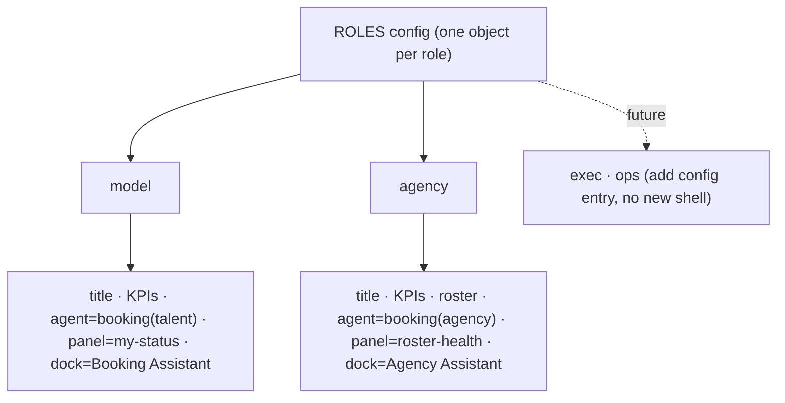
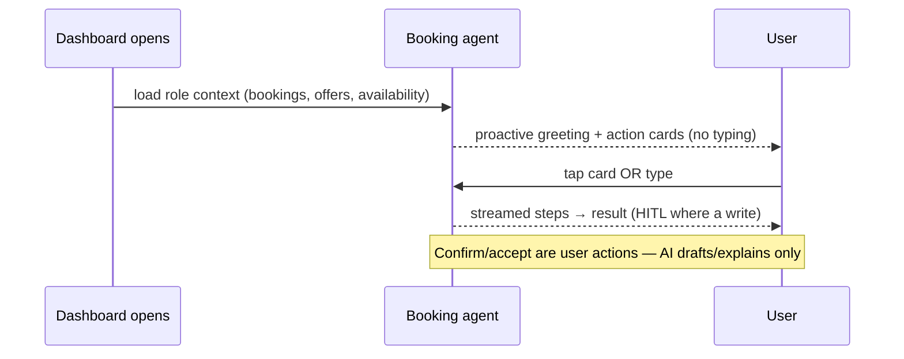
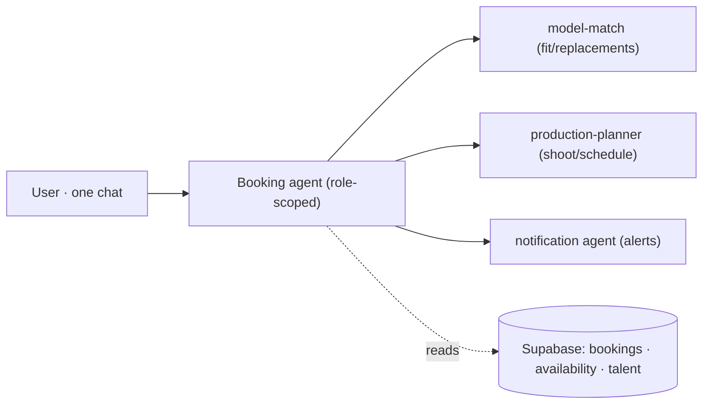

# SCR-25 Role Dashboards — AI-Native Plan

> Plan for making the Model · Agency dashboards **AI-native** using the established 3-panel shell — **no separate chatbot page**. Aligned with **Engineering Reference v1.0** (`../02-engineering-reference.md`): the **IntelligencePanel is persistent AI situational awareness** (not chat) and the **OperatorChatDock is the conversational surface** (D9). Built prototype: `screens/SCR-25-Role-Dashboards.dc.html` (currently 2-panel; this plan upgrades it to the full AI-native 3-panel).

## 1. The pattern (one layout, every role)

```
┌──────────┬─────────────────────────────┬──────────────────────────┐
│ NavRail  │ Main workspace              │ IntelligencePanel (AI)   │
│ 56px     │ (role content)              │ 340px — always visible   │
│ Dashboard│ • KPI cards                 │ • AI summary (proactive) │
│ Bookings │ • Incoming offers (HITL)    │ • What changed           │
│ Availab. │ • Bookings / Roster         │ • Needs attention        │
│ Notifs   │ • Timeline / Calendar       │ • Recommendations        │
│ Profile  │                             │ • Pending / Health       │
│          │                             │ • Agent status           │
│          ├─────────────────────────────┤ • Activity               │
│          │ OperatorChatDock (center)   │                          │
│          │ contextual, proactive       │                          │
└──────────┴─────────────────────────────┴──────────────────────────┘
```

- **Right panel = the AI brain.** The user understands what's happening **without typing**.
- **Bottom dock = the assistant.** Contextual greeting + one-click action cards; typing is optional.
- **Route-aware agent context** (§4): each screen names its agent + priorities.

## 2. Role config (extends the built `ROLES` object)



Each role entry defines: `title/subtitle`, `kpis`, `mainSections`, `agent`, `panel` (intelligence content), `dock` (greeting + action cards).

## 3. Right panel — persistent intelligence (per role)

| Block | Model | Agency |
|---|---|---|
| **AI summary** | "2 offers to review; 1 expires today" | "4 offers pending across 3 models; utilisation 68%" |
| **What changed** | Nike confirmed · On Running offer in | 2 models booked this week · 1 declined |
| **Needs attention** | On Running offer — 40h left | Mia double-booked Apr 3 |
| **Recommendations** | Review Nike offer (94% fit, within rate) | Reassign Ana → Adidas offer |
| **Health / KPIs** | Availability 12 open days · rating 4.9 | Roster utilisation 68% · revenue £22.4k |
| **Agent status** | Booking agent · idle/thinking | Booking agent · ranking 2 offers |
| **Activity** | offer received · availability edited | booking confirmed · model added |
| **Evidence** | EvidenceBlock on rate/fit | EvidenceBlock on utilisation |

Rules (engineering ref): panel is **always light**, **never chat**. **EvidenceBlock appears on exactly these surfaces** (not "all scores"): the **rate recommendation**, the **fit score**, the **utilisation score** (agency), a **booking/date conflict**, and any **AI recommendation** in the panel. Elsewhere show the value plain.

## 4. Bottom dock — contextual, proactive (don't make AI wait)



**Model dock** — *Booking Assistant*: "2 offers waiting. On Running expires in 40h." → `[Review offer] [Check availability] [Prepare acceptance] [Draft a reply]`.
**Agency dock** — *Agency Assistant*: "4 offers across your roster; Mia has a date conflict." → `[Resolve conflict] [Review a model's offers] [Prepare best offers] [Roster report]`.

> **HITL wording rule:** action cards **never** imply the AI performs the decision. Cards *prepare/review/draft*; the final **Accept/Decline is always a human tap** in the offer row. No "Accept Nike" card.

**Conversation memory:** dock keeps current role + selected booking/model, so "accept the Nike one" needs no re-prompt.

## 5. Multi-agent (one chat, agents behind)



> **Notification agent** is **not a built agent.** It is a **future helper service** (fan-out on `notifications`, engineering ref §2.5); the **Booking agent owns the booking workflow** — do not introduce a duplicate agent. Until built, alerts come from the DB trigger, surfaced by the Booking agent.

## 5b. Booking status lifecycle (single source — used by every section)

```
requested  (operator sends request)
    ↓
approved   (talent/agency ACCEPTS — SCR-25 offer HITL)
    ↓
confirmed  (OPERATOR confirms — Booking Detail; never AI)
```

Branches: `declined` (talent) · `expired` (72h) · `cancelled` (operator) — terminal. SCR-25's Accept → `approved` (not confirmed); the operator confirms later in Booking Detail. Every panel/dock/offer reference uses **exactly** this lifecycle (matches engineering ref §5.1).

## 6. Wireframes

### Model dashboard (AI-native)
```
┌────┬───────────────────────────────────────┬───────────────────────┐
│Nav │ @runwithkara · Micro    ◍ 2 invites    │ ✦ Booking Assistant   │
│ ▓  │ [Upcoming 3][Earn £4.8k][★4.9][Avail]  │ 2 offers expire today │
│    │ ── Incoming offers (HITL) ──           │ ─────────────         │
│    │ Nike SS26 · Mar12–14 · £1.2k  [✓][✗]   │ Needs attention:      │
│    │ On Running · Apr3–4 · £950    [✓][✗]   │  On Running · 40h     │
│    │ ── Upcoming bookings ──                │ Recommend: Accept Nike│
│    │ Nike ● Confirmed  £3,600               │ (94% fit · in rate)   │
│    │ [ dock: "2 offers waiting…" +cards ]   │ Agent · idle · Activity│
└────┴───────────────────────────────────────┴───────────────────────┘
```

### Agency dashboard
```
┌────┬───────────────────────────────────────┬───────────────────────┐
│Nav │ Aperture Talent · 12 models  ◍ 4 offers│ ✦ Agency Assistant    │
│    │ [Models 12][Pipe 4·2][Util 68%][£22.4k]│ Mia double-booked Apr3│
│    │ ── Incoming offers (HITL) ──           │ Recommend: reassign   │
│    │ Nike→any · On Running→any  [✓][✗]      │ Ana → Adidas offer    │
│    │ ── Roster ── (3:4 grid, status dots)   │ Utilisation ▓▓▓░ 68%  │
│    │ [ dock: "4 offers; 1 conflict" +cards ]│ Agent · ranking · …   │
└────┴───────────────────────────────────────┴───────────────────────┘
```

## 7. Features & content

- **Proactive greeting** on load (no empty "Ask anything").
- **AI action cards** in the dock — one tap runs a flow (review / accept / resolve / report).
- **Incoming offers HITL** — Accept/Decline (talent) → Booking Detail `status=approved`; the operator confirms.
- **IntelligencePanel** blocks per §3; EvidenceBlock only on the surfaces listed there (rate · fit · utilisation · conflict · AI recommendation).
- **Agent status** indicator (idle · thinking · streaming) — never a bare spinner.
- **Conversation memory** — current role + selection persisted for the dock.
- No contracts/payment UI (D8).

## 7b. Responsive behavior

| Breakpoint | Layout |
|---|---|
| **Desktop** (>1024px) | full 3-panel (nav · workspace · IntelligencePanel) + floating dock |
| **Tablet** (768–1024px) | right panel **collapsible** (toggle); workspace widens when hidden |
| **Mobile** (<768px) | IntelligencePanel → **BottomSheet** (sheet button); chat dock **collapses** to a launcher; **Incoming offers stay the top priority** in the workspace |

All sheets respect `env(safe-area-inset-bottom)` (reuse the existing sheet pattern).

## 8. Frontend steps

1. Add the **IntelligencePanel** (right column) to SCR-25 → 3-panel grid `56px · 1fr · 340px`; move to a `role`-config `panel` block.
2. Add the **OperatorChatDock** (center bottom) with proactive greeting + `actionCards` from role config.
3. Wire **route-aware context**: dock/panel read the role's agent + current selection.
4. **AI action cards** → each triggers a state flow (streamed steps), HITL on any write.
5. **Agent status** indicator + **Activity** feed in the panel.
6. Reuse `EvidenceBlock` for rate/fit/utilisation.
7. Responsive: ≤1024px right panel → BottomSheet; dock → collapsible.

## 9. Backend steps (per engineering ref — 🔴 until built)

> **The UI must work with fixtures, no backend.** Phase 1 is fully static; Phase 2 wires services.
>
> **Phase 1 (no backend):** fixtures/mock data · static 3-panel UI · `ROLES` config · IntelligencePanel content · proactive dock + action cards · offers HITL (local state).
> **Phase 2 (services):** CopilotKit dock → Mastra booking agent → Gemini reasoning → `list_bookings`/`transition_booking` RPCs → Supabase Realtime.

```
Dashboard load → list_bookings(p_role) + availability + offers
              → booking agent (role-scoped, Mastra) summarizes → IntelligencePanel
Action card → Mastra tool (draft only) → HITL → transition_booking (RPC)
Realtime → Supabase subscribe(bookings, notifications) → panel + dock live
```

| Step | Owns | Status |
|---|---|:--:|
| `list_bookings(p_role=talent/agency)` | Supabase RPC | 🔴 |
| Booking agent role-scoped summary | Mastra + Gemini | 🔴 |
| Action-card tools (draft-only) | Mastra | 🔴 |
| `transition_booking` (accept/decline) | RPC | 🔴 |
| Realtime bookings/notifications | Supabase | 🔴 (Phase 2) |
| CopilotKit dock wiring | frontend | 🔴 |

## 9b. MVP vs Future

| MVP (Phase 1 — shippable UI) | Future (Phase 2 — services) |
|---|---|
| 3-panel dashboard (both roles) | CopilotKit dock wiring |
| IntelligencePanel (fixtures) | Mastra booking workflows |
| OperatorChatDock + action cards | Gemini reasoning |
| one `ROLES` config | Supabase Realtime (bookings/notifs) |
| Incoming offers HITL (local state) | `list_bookings` / `transition_booking` RPCs |
| empty/error states | multi-agent orchestration |

## 9c. Empty & error states (reuse design-system EmptyState)

| State | Copy / behavior |
|---|---|
| **No offers** | "No incoming offers." — keep the section header; calm placeholder, no CTA needed |
| **No bookings** (model) | faded sample booking row + "Your bookings will appear here" |
| **Empty roster** (agency) | "Add your first model" + black CTA |
| **No notifications** | "You're all caught up" (matches SCR-15) |
| **Offline / error** | quiet banner + Retry; never present stale AI output as live (engineering ref §5 error map) |
| **AI panel loading** | skeleton blocks (not a spinner); agent status = thinking |

## 10. Implementation order

| Pri | Feature | Status |
|---|---|:--:|
| 🟢 | 3-panel shell (shared) | ✅ (other screens) |
| 🟢 | IntelligencePanel on SCR-25 | ✅ built (fixtures) |
| 🟢 | Proactive OperatorChatDock + action cards | ✅ built (HITL-safe cards) |
| 🟢 | Route-aware AI context | 🟡 config-driven (per role) |
| 🟢 | Agent status / activity | ✅ panel activity + idle dot |
| 🟡 | CopilotKit integration | after UI |
| 🟡 | Mastra workflows · Gemini | after CopilotKit |
| 🟡 | Supabase realtime | after backend |
| ⚪ | Multi-agent orchestration | final |

## 11. Acceptance criteria
- SCR-25 becomes full 3-panel (nav · workspace · IntelligencePanel) for both roles.
- Panel is proactive (understandable without typing); every score → EvidenceBlock; never chat.
- Dock greets contextually per role with tappable action cards; typing optional; memory of selection.
- Accept/Decline stays HITL; AI never confirms.
- One `ROLES` config drives title/KPIs/panel/dock/agent — extensible to exec/ops with no new shell.
- Console clean; data-driven images via div-background.

---

# Claude Code Handoff (documentation-only — no prototype/code changes)

## 12. Implementation dependencies (build order)

```
1. Shared 3-panel shell ──► 2. ROLES config ──► 3. IntelligencePanel ──► 4. OperatorChatDock   (Phase 1: UI + fixtures)
                                                                              │
5. CopilotKit ──► 6. Mastra workflows ──► 7. Gemini ──► 8. Supabase ──► 9. Realtime            (Phase 2: backend)
```

- **Phase 1 (UI + fixtures):** 1–4. Fully shippable with mock data; no services.
- **Phase 2 (backend integration):** 5–9. Each depends on the prior; Realtime last.

## 13. Data-ownership by layer

| Layer | Owner | Responsibility | Reads | Writes | Approval boundary |
|---|---|---|---|---|---|
| **UI** (DC/React) | Design→Code | render 3-panel, offers, cards | role fixtures / RPC results | local UI state only | shows HITL controls; no direct DB write |
| **CopilotKit** | Code | dock runtime, route→agent | UI context (role, selection) | draft messages only | never commits; relays HITL |
| **Mastra** | Code | booking agent + tools | Supabase (user JWT) | **draft** bookings/quotes | draft-only; commit needs user |
| **Supabase** | Code | tables, RPCs, RLS | — | `transition_booking` (accept/decline), `confirm_booking` (operator) | RLS: talent writes own accept/decline; confirm = operator/service-role |
| **Realtime** | Code | live push | `bookings`, `notifications` | — | read-only stream |

## 14. AI loading states (no generic spinners)

| State | UI |
|---|---|
| **idle** | agent dot calm; panel shows last summary |
| **loading** | skeleton blocks + copy: "Analyzing bookings…" / "Checking availability…" |
| **streaming** | live step lines (green check done · pulsing active · faint pending) + "Preparing recommendations…" / "Reviewing offers…" |
| **completed** | result lands in panel/dock; brief settle |
| **error** | quiet banner + Retry; never present stale output as live |

## 15. Session context (OperatorChatDock remembers)

current role · selected model · selected booking · selected offer · current filters · current route · recent conversation context.

> **Phase 1: this is UI state only** (in-memory), not persisted agent memory. Real conversation memory arrives in Phase 2 (CopilotKit/Mastra). Don't imply persistence until then.

## 16. Route → assistant context

| Route | Active assistant | Primary responsibilities | Default proactive greeting |
|---|---|---|---|
| `/app/model` | Booking Assistant | offers, availability, earnings | "2 offers to review; On Running expires in 40h." |
| `/app/roster` (agency) | Agency Assistant | roster, pipeline, conflicts | "4 offers across your roster; Mia has a date conflict." |
| `/app/bookings` | Booking Assistant | booking lifecycle, status | "1 booking awaits the operator's confirm." |
| `/app/inbox` | Operations Assistant | alerts, unread, actions | "3 unread — 1 booking confirmed, 2 new matches." |

Assistants are **route-scoped views of the Booking agent** (+ helpers), not separate chat components (D9).

## 17. "Prepare acceptance" — exact behavior

Opens the booking review: **scroll/highlight the offer, open its review state, focus required fields.** It **NEVER** accepts, approves, or confirms automatically. **Accept/Decline always require an explicit user tap** in the offer row (HITL). See EV-3.

## 18. Phase-2 placeholders (fixtures until built)

**Phase 2 only:** CopilotKit · Mastra · Gemini · Supabase RPCs · Realtime · streaming · agent orchestration. **Phase 1 uses fixtures only** — the greeting, summaries, and action-card results are mock data and must be visibly non-live (no claim of real reasoning).

## 19. Engineering consistency check

| Checked against | Result |
|---|---|
| Engineering Reference v1.0 | ✅ IntelligencePanel=brain (never chat), OperatorChatDock=only chat (D9) |
| Booking lifecycle §5.1 | ✅ `requested→approved→confirmed` (+declined/expired/cancelled); Accept→approved only |
| HITL rules | ✅ AI drafts/explains; accept (talent) + confirm (operator) are human; no auto-actions |
| Shared 3-panel shell | ✅ reused; no new shell |
| Reusable components | ✅ NavRail · IntelligencePanel · OperatorChatDock · EvidenceBlock · EmptyState · cards |
| Existing booking workflow | ✅ SCR-25 Accept → Booking Detail `status=approved`; operator confirms there |
| Notification flow | ✅ alerts → SCR-15; notification agent = future helper, Booking agent owns workflow |

No duplicated architecture introduced.

## 20. Engineering validation required (replaces "open questions")

| ID | Item | Action for Claude Code |
|---|---|---|
| **EV-1** | `list_bookings(p_role)` shape | Verify the final RPC contract; **do not assume fields**. Panel/dock summaries must bind to the real return shape. |
| **EV-2** | Proactive greeting trigger | Phase 1 = fixture string; Phase 2 = Mastra summary generated **after** dashboard load. Wire to the real agent, not a hardcoded line. |
| **EV-3** | "Prepare acceptance" behavior | Confirm: scroll/highlight + open review state; **never execute acceptance**. Default assumption above. |
| **EV-4** | Notification payloads | Verify real `notifications` payload/kinds; **do not invent realtime schemas**. |
| **EV-5** | Supabase tables · RPCs · RLS · TS types | Verify all against the live repo before implementation (`supabase:types` is known-stale, ref §2.11). |

## 21. Final report

**Changes made:** action-card wording → HITL-safe (§4 + rule); added booking lifecycle §5b; notification agent → future helper (§5); mobile §7b; EvidenceBlock surfaces pinned (§3/§7); backend phases + MVP/Future (§9/§9b); empty/error states (§9c); and this handoff block (§12–§20: dependencies, data ownership, AI loading states, session context, route→assistant, prepare-acceptance, Phase-2 placeholders, consistency check, EV-1…EV-5).

**Documentation updated:** `booking/SCR-25-AI-Native-Dashboards.plan.md` only. No prototype or code changed.

**Remaining engineering validations:** EV-1…EV-5 (§20).

**Implementation readiness (design/plan): ~95%** — build order, phases, ownership, states, and HITL all specified; only the 5 EV items block Phase 2.
**Production readiness: ~80%** — Phase 1 UI is fully specifiable now; Phase 2 gated on real RPCs/agent/realtime (🔴 per engineering ref).
