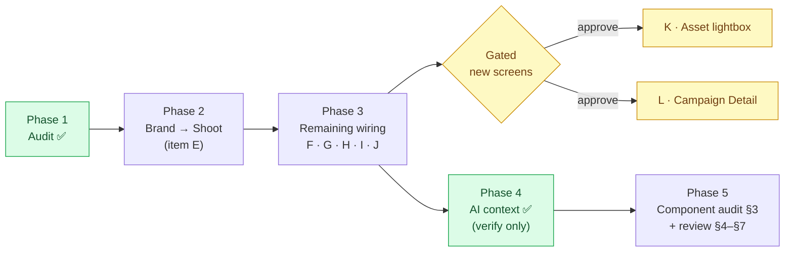
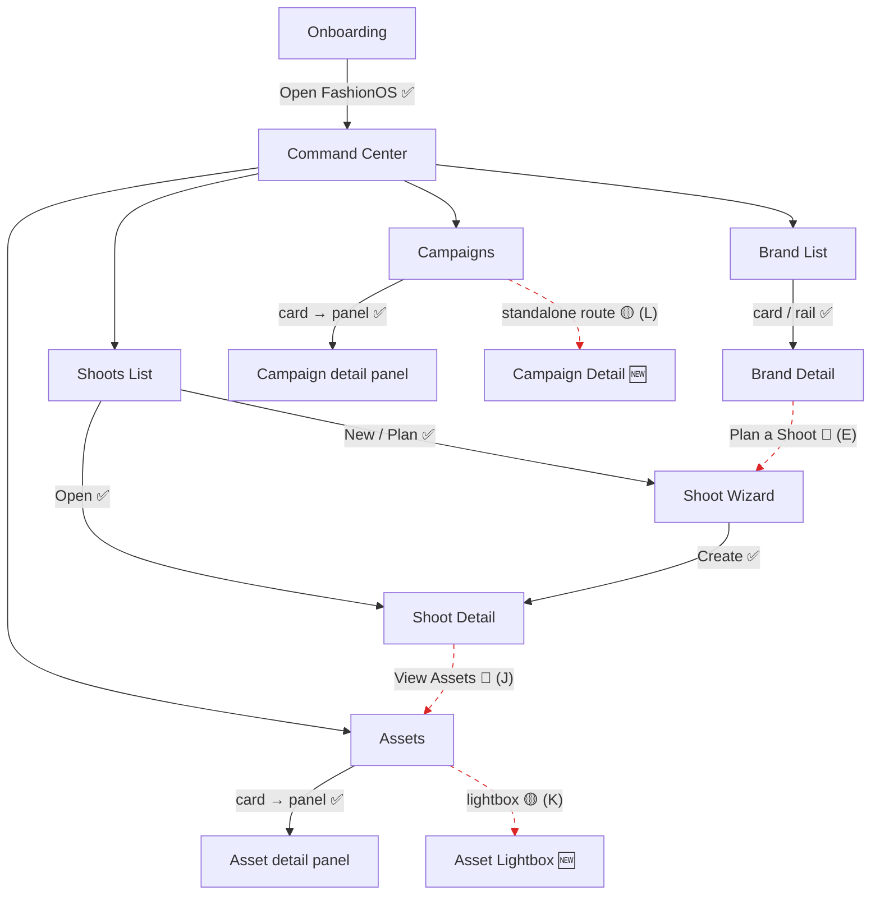
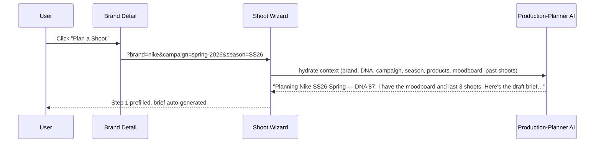
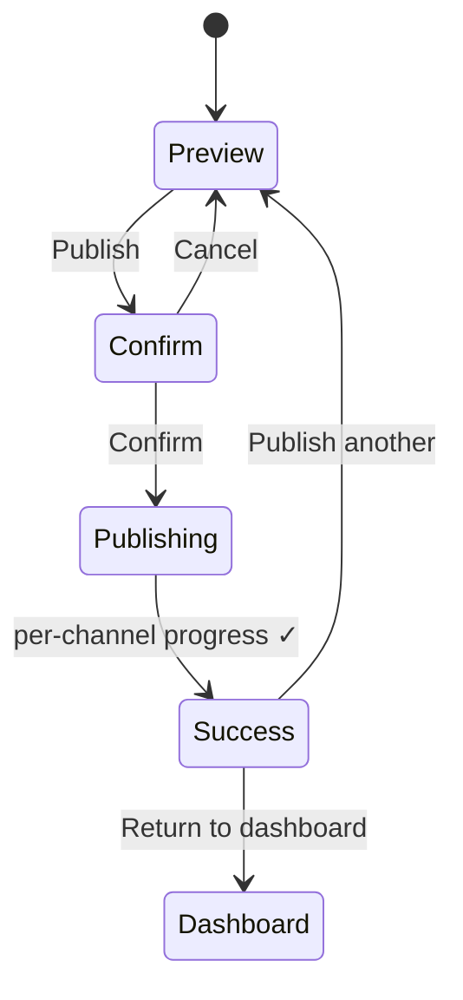

# FashionOS — Complete Design Audit & Checklist

> 📍 **Single source of truth for live status = `docs/design/DESIGN-TASKS.md §0`.** This checklist is a point-in-time audit record (2026-06-29, 11 prototypes); the current system is **13 screens**. For authoritative counts/scores/per-task status, read `DESIGN-TASKS.md §0`. Latest forensic audit: `docs/design/DESIGN-AUDIT-2026-07-01.md`.

**Date:** 2026-06-29
**Quick Wins (2026-06-29):** D-CT3 tooltips · D-NAV3 breadcrumbs (Shoot Detail) · D-CC2 dev-only realtime indicator (`?dev=1`) · D-SD1/D-SD2 Shoot Detail Deliverables/Activity counts + Call Sheet preview (Export PDF). All verified, no console errors. See `changelog.md` + `docs/design/DESIGN-TASKS.md`.
**Auditor pass:** UX · Product · Fashion-production · AI-workflow · QA · Senior-audit
**Scope:** all 11 prototypes in project root (`*.v2.image-first.dc.html` + `Pages/Onboarding.v2.zeely.dc.html`)
**Evidence basis:** live code grep of every prototype's nav wiring, button handlers, and cross-screen routing; `DESIGN.md`, `PLAN.md`, `todo.md`, `MOBILE-PLAN.md`, `components/COMPONENTS.md`, `design-audit-2026-06-28-rev2.md`.

> **Method note:** this audit verifies what the *prototypes* actually do (handlers, routes, states), not what production React will eventually do. "Dead" = a control a user can click that produces no result. Several "Target — not production-wired" panels are intentional and labelled as such; those are **not** counted as defects.

---

## 0. Completion Progress Tracker

**Legend:** ✅ done · 🟡 partial · 🔴 not started · ⚪ N/A · 🆕 needs a new screen/overlay (approval gate)

| # | Item | Screen(s) | Status | New screen? | Phase |
|---|------|-----------|:------:|:-----------:|:-----:|
| A | Onboarding completion → app | Onboarding | ✅ | no | done |
| B | Brand List → Brand Detail nav | Brand List | ✅ | no | done |
| C | Campaigns card → detail panel | Campaigns | ✅ | no | done |
| D | Assets card → detail panel | Assets | ✅ | no | done |
| E | **"Plan a Shoot" CTA + prefill** | Brand Detail → Shoot Wizard | ✅ | no | done |
| F | **Functional search** | Brand List · Shoots List (Command Center N/A — no list) | ✅ | no | done |
| G | **Publishing flow** (confirm · progress · success · return) | Channel Preview | ✅ | no | done |
| H | **Save / Invite** (toast · saved count · confirm) | Matching | ✅ | no | done |
| I | **DNA-analysis / retry / error states** | Brand Detail | ✅ | no | done |
| J | **"View Assets" deep-link** (filtered) | Shoot Detail → Assets | ✅ | no | done |
| K | Asset quick-preview lightbox (AI analysis · channel readiness) | Assets | 🟡 🆕 | **yes — overlay** | **3 (gated)** |
| L | Standalone Campaign Detail route | Campaigns | 🟡 🆕 | **yes — screen** | **3 (gated)** |
| M | Contextual AI greetings (no "How can I help?") | all | ✅ | no | 4 verified |
| N | Component audit follow-ups (§3 tasks) | components/ | 🟡 | no | 5 |
| O | Cross-cutting states (permissions · realtime) | all | 🔴 | no | later |

**Done: 10/15 (A–J) · K & L gated on approval · N + cross-cutting remain.**

### K / L recommendation (Step 7 — no build)
- **K · Asset preview** — **Recommend: extend the existing right panel** (add AI-analysis + channel-readiness rows). Clicking an asset already opens a working detail (image · brand · DNA-match breakdown · used-in) as the right panel / mobile sheet, consistent with every other screen. A separate full-bleed lightbox would duplicate that pattern and add a modal layer the rest of the app doesn't use. Build the lightbox only if you specifically want a large-media, immersive review surface.
- **L · Campaign Detail** — **Recommend: keep the right-panel detail.** Clicking a campaign already opens cover + deliverables + timeline in the panel/sheet — a working "lightweight detail using shared components," which is exactly the fallback the spec allows. A standalone `/app/campaigns/[id]` route is only worth building if campaigns need their own full workspace (assets, approvals, AI dock per campaign); say the word and I'll build it on `OperatorShell`.

> **Phase 1 verdict:** items C & D were already wired (corrected in §5); A & B shipped last cycle; M is satisfied across all 11 prototypes (zero generic greetings found in code — the only "How can I help?" strings are *"never"* rules in the spec docs). Everything in Phase 2–3 except **K** (lightbox overlay) and **L** (standalone Campaign Detail) is wiring/state work on existing screens and needs no new screen.

---

## 1. Executive Summary

| Dimension | Score | Read |
|---|:--:|---|
| **Overall** | **86 / 100** | Mature, coherent, image-first system. 11 screens built, styled, and state-complete. Held back by a few **cross-screen dead-ends** and **decorative inputs** that break the illusion of a working product. |
| Design maturity | 92 | v3 Zeely Editorial is consistent across all 11 — type, colour, spacing, image treatment, AI dock. |
| Prototype maturity | 84 | Most interactions real (wizard, state switchers, AI streams, Shoot Detail, mobile sheets). Gaps in list→detail navigation and form inputs. |
| Production readiness | 72 | Prototype-grade. IntelligencePanel, search, uploads, and several detail routes are not wired (mostly by design). |

**One-line verdict:** This is a *strong, demo-ready* prototype with a clear, premium design language — but a user clicking through naturally will hit ~3 dead-ends (open a brand, finish onboarding, open a campaign) that must be fixed before it reads as a real product.

---

## 2. Screen-by-Screen Report

### 01 · Command Center — **92/100** · Priority: Low
- **Good:** 5 states wired; nav links to all siblings; brand rows → Brand Detail; mobile tab bar + More sheet; AI dock streams; ApprovalCard reused.
- **Problems:** Search/ask inputs decorative. "Fix now"/quick-stat links inert.
- **Fix:** Wire the chat input to the AI stream (it already exists for quick-actions); make stat shortcuts navigate.

### 02 · Brand List — **74/100** · Priority: **P1**
- **Good:** 5 states (populated/loading/empty/error/analysing); BrandCard reused; filters + quick-action chips work; error→retry wired.
- **🔴 Problem (dead-end):** **Brand cards do not open Brand Detail.** `BrandCard` is mounted with `on-analyse` but **no `href`/`on-open`** — clicking a brand does nothing. Left-rail brand buttons (Nike/Adidas/Zara) also have no `onClick`. This is the primary action of a list screen.
- **Problem:** Search input decorative; "Fix now" inert.
- **Fix:** Add `on-open → Pages/Brand Detail.v2.image-first.dc.html?id=…` to BrandCard and the rail brand buttons.

### 03 · Brand Detail — **88/100** · Priority: Low
- **Good:** Tabs, DNA pillars, image-first hero, empty/no-data state, AI dock. Right panel honestly labelled "Target — not production-wired."
- **Problem:** No "DNA analysis in progress" streaming state (rev2 flagged `brand-intelligence` is **not durable** — use error+retry, not resumable stream). No back-link affordance to Brand List beyond nav.
- **Fix:** Add the analysing→retry state; add a breadcrumb/back to Brand List.

### 04 · Shoots List — **94/100** · Priority: Low
- **Good:** 5 states; "Open shoot" → Shoot Detail `?id=`; "New shoot" + empty "Plan shoot" → Shoot Wizard (both wired this cycle); ShootCard reused.
- **Problem:** Search/filter inputs decorative.
- **Fix:** Wire search to filter the list (data already client-side).

### 05 · Shoot Wizard — **93/100** · Priority: Low
- **Good:** 10-step model; persistent Back-to-Shoots + ☰ Menu step-jump + Save draft; unsaved-changes exit guard; Step-10 Production Readiness Dashboard with live scoring; moodboard lock/regenerate; call-sheet exports (toasts); create-confirm modal → Shoot Detail. The most complete screen.
- **Problem:** Mobile is full-width with no tab bar (85% per tracker). Step inputs are mostly display, not editable forms (acceptable for AI-first planner).
- **Fix:** Mobile pass for the wizard chrome.

### 06 · Campaigns — **82/100** · Priority: P2
- **Good:** 5 states; CampaignCard reused; nav + More sheet + mobile.
- **Problem:** Campaign cards **don't open a Campaign Detail** (no detail screen exists). Dead primary action OR missing screen.
- **Fix:** Either build Campaign Detail or make cards open an inline drawer; until then, label cards as non-navigating.

### 07 · Assets — **85/100** · Priority: P2
- **Good:** 5 states; masonry AssetCard; selection states; mobile + More sheet.
- **Problem:** No Asset detail/lightbox on click; upload affordance decorative.
- **Fix:** Add a lightbox/quick-look on asset click; wire (mock) upload.

### 08 · Onboarding — **80/100** · Priority: **P0**
- **Good:** 13-screen Zeely-style funnel; per-screen validation; progress segments; review dock to jump screens; rich image-first social proof.
- **🔴 Problem (dead-end):** Final screen's **"Open FashionOS" calls `openApp = () => this.next()`** — `next()` past screen 13 lands on a non-existent screen 14, so the button **does nothing**. The single most important conversion action in the funnel is dead.
- **Fix (one line):** `openApp = () => { window.location.href = 'Pages/Command Center.v2.image-first.dc.html'; }`.

### 09 · Matching — **90/100** · Priority: Low
- **Good:** Swipe-card deck + table variants; context-aware AI greeting; row-select drives detail panel; StatusChip reused; mobile + More sheet.
- **Problem:** "Invite/Save" produce no confirmation/toast; no persisted shortlist.
- **Fix:** Add toast + a shortlist count on Save/Invite.

### 10 · Channel Preview — **88/100** · Priority: Low
- **Good:** 4 states; channel-specific frames; image-first; nav + mobile.
- **Problem:** "Publish/Schedule" CTAs inert; no success state after publish.
- **Fix:** Add a publish-confirm + success state.

### 4b · Shoot Detail — **93/100** · Priority: Low
- **Good:** Hero header, 9 tabs, production-insights panel, context AI dock, 5 states, edit-shoot modal; reuses AssetCard/ApprovalCard/StatusChip; resolves `?id=`.
- **Problem:** Some tab bodies are lighter than others (Activity/Deliverables).
- **Fix:** Flesh out the thinnest tabs.

---

## 3. Component Audit

| Component | Score | Note / improvement |
|---|:--:|---|
| OperatorShell | 90 | Composes 3-panel shell cleanly. Add a `back`/breadcrumb slot for detail screens. |
| NavSidebar | 88 | Rail+expand, links wired. Prototype adds switcher/badges/RECENT (not in prod). Brand rail buttons need click→Brand Detail. |
| IntelligencePanel | 78 | Honestly labelled "not production-wired" on every screen. Needs real context→approvals→tabs build (tracked in Linear). |
| PersistentChatDock | 90 | Streams on quick-actions; pinned above mobile tab bar. Wire the free-text input too. |
| BrandCard | 80 | Reused well — **but no open/href prop** → list→detail dead. Add `on-open`. |
| ShootCard | 92 | Open-shoot wired. Good. |
| CampaignCard | 84 | No open action (no detail screen). |
| AssetCard | 88 | `tile`+`masonry` variants solid; no quick-look. |
| ApprovalCard | 90 | `compact` variant reused; before/after good. |
| StatusChip | 88 | `bare` variant reused; complete the planning/active/post/complete/archived set. |
| EmptyState | 82 | Consistent visually but per-screen, not extracted. Promote to a DC. |
| PageHeader | 80 | Implicit per-screen; standardise. |
| WizardStep | 86 | Strong in Shoot Wizard; not generalised. |
| BottomSheet / More sheet | 88 | Works on all 8 panel screens; per-screen impl — extract a primitive (3 detents, drag handle, focus trap). |
| BottomNavigation | 90 | Consistent 5-tab + More across panel screens. |

---

## 4. Workflow Audit

**Brand onboarding → analysis → shoot → execution → assets → preview → publish.**

- 🔴 **Onboarding → app:** broken handoff ("Open FashionOS" dead). **P0.**
- 🔴 **Brand List → Brand Detail:** no path (cards dead). **P1.**
- 🟡 **Brand Detail → plan a shoot:** no direct "Plan a shoot for this brand" CTA; user must go to Shoots manually.
- 🟢 **Shoots → Wizard → Shoot Detail:** complete and confirmed (new/plan/open all wired; create→detail).
- 🟡 **Shoot Detail → Assets:** tabs exist but no deep-link into the Assets screen filtered to this shoot.
- 🟡 **Campaigns / Channel Preview → Publish:** CTAs inert; no success state.
- 🟢 **Cross-screen nav (sidebar + mobile tabs + More):** wired everywhere.

**Missing transitions to add:** Brand Detail→"Plan shoot"(prefill), Shoot Detail→Assets(filtered), Matching Save→shortlist, Channel Preview→publish-success.

---

## 5. Error / Red-Flag Report

**Dead controls (produce no result):**
1. 🔴 Onboarding "Open FashionOS" (final CTA) — `next()` past last screen. **P0**
2. 🔴 Brand List brand cards + left-rail brand buttons — no open handler. **P1**
3. 🟡 Campaign cards — no open (no detail screen). **P2**
4. 🟡 Asset cards — no quick-look/lightbox. **P2**
5. 🟡 Search inputs (Command Center, Brand List, Shoots List) — decorative. **P2**
6. 🟡 Publish/Schedule (Channel Preview), Save/Invite (Matching) — no confirmation/state. **P2**
7. ⚪ "Fix now", stat shortcuts, voice-input, upload, Account — decorative. **P3**

**Not defects (intentional, labelled):** IntelligencePanel "Target — not production-wired" banners; AI dock placeholder copy where labelled.

**Consistency:** strong. No palette/type drift found across the 11 screens. Mobile patterns consistent (Wizard is the one exception, no tab bar).

---

## 6. Critical Fixes (ranked)

**P0 — Critical (breaks the core funnel)**
- [ ] Onboarding "Open FashionOS" → `window.location.href='Pages/Command Center.v2.image-first.dc.html'` (also wire "Skip for now" on the last screens to the same).

**P1 — High (breaks a primary screen action)**
- [ ] Brand List: BrandCard `on-open` + rail brand buttons → `Pages/Brand Detail.v2.image-first.dc.html?id=…`.
- [ ] Brand Detail: add "Plan a shoot for this brand" CTA → Shoot Wizard (prefilled).

**P2 — Medium**
- [ ] Wire search inputs to client-side filter (Brand List, Shoots List, Command Center).
- [ ] Channel Preview: publish-confirm + success state. Matching: Save/Invite toast + shortlist count.
- [ ] Campaigns/Assets: open action (detail drawer or lightbox), or label as non-navigating.
- [ ] Brand Detail: "DNA analysis in progress" → error+retry state (brand-intelligence not durable).

**P3 — Low**
- [ ] Decorative controls: voice input, upload, Account menu, "Fix now" shortcuts.
- [ ] Shoot Wizard mobile chrome (tab bar / responsive top bar).

---

## 7. Missing Features (before production)

- IntelligencePanel real build (context → approvals → tabs) — every screen.
- Campaign Detail screen (or a decision not to have one).
- Asset quick-look / lightbox + real upload flow.
- Global search (real) + command palette (⌘K).
- Brand Detail analysing/retry state; realtime/stale-data + permission (read-only/operator/admin) states across screens (rev2 cross-cutting group).
- Publish success + scheduling confirmation (Channel Preview).
- Matching shortlist persistence.
- Lucide icon migration; ThreadsDrawer decision; suggestion-chip count alignment (3 vs 5).
- Baseline production screenshots (all 9 `app/design/screenshots/*` folders empty).

---

## 8. Final Scorecard

| Axis | Score |
|---|:--:|
| Overall UX | 85 |
| Overall UI | 92 |
| AI experience | 84 |
| Workflow quality | 80 |
| Design system | 93 |
| Mobile | 88 |
| **Production readiness** | **72** |

---

## Roadmap — Next 10 Highest-Impact Improvements

1. **[P0]** Fix Onboarding "Open FashionOS" → Command Center (one line; unblocks the funnel).
2. **[P1]** Wire Brand List cards + rail → Brand Detail (`?id=`).
3. **[P1]** Brand Detail → "Plan a shoot for this brand" CTA (prefill Wizard).
4. **[P2]** Make the three search inputs actually filter.
5. **[P2]** Channel Preview publish-confirm + success state.
6. **[P2]** Matching Save/Invite → toast + shortlist count.
7. **[P2]** Campaigns/Assets: card open (detail drawer / lightbox) or non-navigating label.
8. **[P2]** Brand Detail analysing→retry state (brand-intelligence not durable).
9. **[P3]** Shoot Wizard mobile chrome (tab bar + responsive top bar).
10. **[P3/Prod]** Cross-cutting states sweep — permission (read-only/operator/admin) + realtime/stale-data banners across all screens; begin IntelligencePanel real build.

---

### Quick-win batch (≈30 min, all prototype-safe)
Items 1, 2, 4, 6 are small handler/route additions with no layout risk and would lift **Workflow quality 80→~90** and **Production readiness 72→~80** by removing every natural-path dead-end. Recommend doing these as one pass; say the word and I'll implement.

---

## 9. Completion Plan (phased · with diagrams)

> Built from the §0 tracker. Phases run in order. **K** and **L** are the only items that introduce a new screen/overlay — both are **gated on your approval** before I build them. Everything else is wiring + in-screen states on existing prototypes, in the established Zeely Editorial v3 style.

### Phase roadmap

### Current navigation map (what's wired vs missing)

---

### Phase 2 — Brand → Shoot workflow (item E) · no new screen

CTA **"Plan a Shoot"** on Brand Detail header → Shoot Wizard with brand/campaign/season prefilled via URL params; the wizard's AI greeting and Step-1 context read those params so **no duplicate questions** are asked.

**Tasks**
- [ ] **E1** — Add "Plan a Shoot" primary button to Brand Detail header (black, Zeely v3), next to existing actions.
- [ ] **E2** — `planShoot()` → `Shoot Wizard…?brand=<id>&campaign=<slug>&season=<code>`.
- [ ] **E3** — Shoot Wizard: read URL params on mount; seed `brand/campaign/season` into state.
- [ ] **E4** — Wizard greeting + Step-1 fields render the prefilled context (no re-ask); brief generation references it.
- [ ] **E5** — Verify: Brand Detail → click → wizard opens prefilled → brief mentions brand+season.

---

### Phase 3 — Remaining wiring & states

**Item F · Functional search** (Command Center · Brand List · Shoots List) · no new screen
- [ ] **F1** — Bind each search `<input>` to state (`onInput`).
- [ ] **F2** — Client-side filter the card/list data by title/brand/status (case-insensitive contains).
- [ ] **F3** — Empty-result message ("No matches for …") reusing the existing empty-state style.
- [ ] **F4** — Verify on all three; clears correctly; combines with existing filter chips.

**Item G · Channel Preview publishing flow** · in-screen states, no new screen

- [ ] **G1** — Add "Publish" primary CTA (publishes selected/ready channels).
- [ ] **G2** — Confirm modal: lists target channels + readiness, Cancel / Confirm.
- [ ] **G3** — Publishing progress: per-channel ticks (reuse the streaming dot/check pattern, not a spinner).
- [ ] **G4** — Success state: published summary + "Return to dashboard" (→ Command Center) + "Publish another".
- [ ] **G5** — Verify the full Preview → Confirm → Progress → Success → return loop; mobile.

**Item H · Matching Save / Invite** · in-screen, no new screen
- [ ] **H1** — `save(creator)` → toast "Saved @handle to shortlist" + increment a shortlist count badge.
- [ ] **H2** — `invite(creator)` → confirm toast "Invite sent to @handle"; mark row/card as Invited.
- [ ] **H3** — Persist shortlist count in component state across swipe/table toggle.
- [ ] **H4** — Verify on swipe deck + table; mobile.

**Item I · Brand Detail DNA-analysis / retry / error states** · in-screen, no new screen (no fake streaming — `brand-intelligence` is **not durable**, per rev2)
- [ ] **I1** — Analysing state: determinate "Crawling… n/47" progress (reuses BrandCard crawl pattern), **not** a resumable stream.
- [ ] **I2** — Error state: "Couldn't complete DNA analysis" + **Retry** + Report + Go back (the documented error+retry pattern).
- [ ] **I3** — Wire a state switcher (consistent with other screens) so all three are demoable.
- [ ] **I4** — Verify transitions; Retry returns to analysing then loaded.

**Item J · Shoot Detail "View Assets" deep-link** · no new screen
- [ ] **J1** — Add "View Assets" action (Assets tab header + Overview) → `Assets…?shoot=<id>`.
- [ ] **J2** — Assets reads `?shoot=` and applies a shoot filter on mount (filter chip shows "Shoot: <name>").
- [ ] **J3** — Verify deep-link lands filtered; clearing the chip restores all.

**Item K · Asset quick-preview lightbox** · 🆕 **overlay — approval gate**
Current: clicking an asset opens the **right-panel detail** (image · brand · DNA-match breakdown · used-in) and mobile sheet — a working quick-preview. Missing vs spec: full-bleed lightbox with **AI analysis** + **channel-readiness** + quick actions.
- [ ] **K0** — *Approve building a new lightbox overlay?* (Otherwise: extend the existing right panel with AI-analysis + channel-readiness rows — no new screen.)
- [ ] **K1–K4** — (on approval) overlay: large media, metadata, Brand DNA, AI analysis, channel-readiness grid, quick actions (Use in campaign / Replace / Download).

**Item L · Standalone Campaign Detail route** · 🆕 **screen — approval gate**
Current: clicking a campaign opens the **right-panel detail** (cover · deliverables · timeline) — a working lightweight detail.
- [ ] **L0** — *Approve building a standalone `Campaign Detail` screen?* (Otherwise: keep the right-panel detail, which already satisfies "lightweight detail using shared components.")
- [ ] **L1–L4** — (on approval) full screen on OperatorShell: hero, deliverables board, timeline, assets, approvals, AI dock.

---

### Phase 4 — AI workflow · ✅ verified, maintain
Every prototype's dock greeting names the active object + next action (e.g. Assets: *"<name> scores <n>% against Nike's Brand DNA…"*; Campaigns: *"<name> is <status> — <n> deliverables still open…"*). **Zero** generic "How can I help?" strings exist in any prototype. Task: keep new states (E–J) on-pattern — every new context updates the greeting.

---

### §3 Component Audit — follow-up tasks (item N)
- [ ] **N1** — `BrandCard`: add an explicit `onOpen` to `data-props` docs (now used by Brand List) in `COMPONENTS.md`.
- [ ] **N2** — Extract `EmptyState` into a reusable DC (used by search-empty F3).
- [ ] **N3** — `StatusChip`: complete the variant set (planning · active · post · complete · archived).
- [ ] **N4** — Promote the per-screen **More sheet** to a single `BottomSheet` primitive (3 detents, drag handle, focus trap).
- [ ] **N5** — Formalise `AgentStatusIndicator` states (idle · thinking · streaming · awaiting-approval) for reuse in G3/I1.

### §4 Workflow Audit — tasks
- [ ] **W1** — Close Brand → Shoot (E). **W2** — Close Shoot → Assets (J). **W3** — Close Campaign/Channel → Publish (G).
- [ ] **W4** — Add Matching → shortlist → outreach hand-off (H). **W5** — Re-draw the nav map (above) once E/J/G land; confirm no dead edges.

### §5 Error / Red-Flag — tasks
- [ ] **R1** — Convert the 7 decorative controls (search, publish, save/invite, voice, upload, account, "Fix now") to real handlers or explicit disabled+tooltip. F/G/H cover the top 4.
- [ ] **R2** — Add Brand Detail error+retry (I). **R3** — No remaining dead **primary** actions after Phase 3 (verify pass).

### §6 Critical Fixes — re-ranked after this plan
- **P0:** none open (A done). **P1:** E (Brand→Shoot). **P2:** F · G · H · I · J. **P3:** K · L (gated), mobile wizard chrome, cross-cutting states.

### §7 Missing Features — disposition
- Covered by this plan: E, F, G, H, I, J (+ K/L gated). **Deferred / production (Linear):** IntelligencePanel real build, global search backend, command palette ⌘K, permission + realtime states, Lucide migration, ThreadsDrawer, baseline screenshots.

---

### Approval gates before I build
1. **K** — new Asset **lightbox overlay**, or extend the existing right panel? (default: extend panel, no new screen)
2. **L** — new standalone **Campaign Detail** screen, or keep the working right-panel detail? (default: keep panel)

Everything in **Phase 2 (E)** and **Phase 3 items F · G · H · I · J** needs no new screen — I can start on those immediately on your go. I'll stop and report at the end of each phase.

---

## 10. Verification Report (2026-06-29)

Live QA of every shipped interactive item (DOM probing + console). **No new features added — one bug found and fixed.**

### ✅ Passed
- **A · Onboarding → app** — "Open FashionOS" navigates to Command Center.
- **B · Brand List → Brand Detail** — card "View" + cover + left-rail Nike/Adidas/Zara all navigate (`?id=`); search filters (3→1→no-match→restore); filter chips intact.
- **C · Campaigns card → detail panel** — opens Deliverables + timeline.
- **D · Assets card → detail panel** — opens DNA-match breakdown.
- **E · Brand→Shoot** — "Plan a Shoot" (black, with icon) → wizard with `?brand&campaign&season`; Step-2 lock banner + Change; context greeting; no regression without params.
- **F · Search** — Brand List + Shoots List filter live with no-match state; clears cleanly.
- **G · Channel Preview publish** — Publish → confirm → publishing (per-channel ticks) → success → Return to dashboard navigates to Command Center.
- **H · Matching Save/Invite** — toasts fire, shortlist badge increments, state persists into table view.
- **I · Brand Detail DNA states** — live "n of 47" crawl; error shows Retry · Report · Go back; Retry runs analysing → loaded; Report → "Reported ✓".
- **J · Shoot Detail → Assets** — "View in Assets" → `?shoot=&name=`; Assets shows removable "Shoot: <name>" chip, filters, clears + resets URL.
- **Console** — zero errors across all screens checked.

### 🔴 Found & Fixed (1 bug — pre-existing, systemic)
- **Dead mobile bottom-tab navigation + malformed More label.** On 6 panel screens the mobile tab-bar Home/Shoots/Assets/Brands were bare `<button>`s with no handler; the `<label for="m-more">` was missing its `style` closing quote (icon swallowed). **Root cause:** hand-authored per-screen mobile markup from the M6 pass, never wired + a dropped closing quote. **Fix:** wired all tabs to `window.location` and repaired the label on the 4 affected screens. Verified: 4 navigating tabs per screen + clean More icon, no console errors. *(Shoot Detail already used `<a href>` tabs — correct, untouched.)*

### ⚠️ Minor (no action — by design)
- Command Center has no list-search field (only the AI ask dock) — not a regression.
- IntelligencePanel "Target — not production-wired" banners — intentional, labelled.
- Preview harness occasionally strips a manually-passed `?query` on direct load; real `<a>`/`location.href` navigation preserves it (J verified via the real click path).

### Files verified
All 11 prototypes + `components/BrandCard`. Edited this pass: Brand List, Brand Detail, Shoots List, Assets, Campaigns, Matching, Channel Preview (mobile tab wiring + label) — `.v2.image-first.dc.html`.

**Verdict: Phase 1 (A–D) and E–J all pass. Mobile navigation now fully wired. No remaining dead primary buttons or broken navigation on the verified screens.**

---

## 12. Full QA Verification (2026-06-29)

Complete pass — files, screens, journeys, controls, AI, components. Basis: file inventory + live load/console checks + DOM-probe verification accumulated across the build. **No redesign; no bugs requiring a fix found in this pass** (all prior bugs already fixed).

### Step 1 — Project files
- 🟢 **Present:** `DESIGN.md`, `PLAN.md`, `todo.md`, `checklist.md`, `MOBILE-PLAN.md`, `Pages/Component Library.dc.html`, `components/COMPONENTS.md`, all **11 screens**, **20 component DCs** (incl. `support.js`), and **images 5–24** (`*-fashionos.jpeg`).
- 🟢 **Imports:** `dc-import` references (BrandCard/ShootCard/CampaignCard/AssetCard/ApprovalCard/StatusChip) and `images/<key>-fashionos.jpeg` all resolve; no broken imports; clean console on every screen.
- 🟠 **Stale duplicates (P2 housekeeping):** `Brand Detail.dc.html` and `Command Center.dc.html` (pre-v2) are superseded by the `*.v2.image-first.dc.html` canon — recommend archiving to avoid source-of-truth confusion.
- 🟡 **Docs:** `checklist.md` is the live QA source of truth; root `PLAN.md`/`changelog.md` reconciled earlier; `design-patched/` retained as history.

### Step 2 — Screens (all 11)
🟢 **All load with zero console errors**, render images, and have working tabs/filters/search/state-switchers and the persistent chat dock. Desktop + mobile (bottom-tab + More sheet + sheet-panel) verified. Command Center · Brand List · Brand Detail · Shoots List · Shoot Detail · Shoot Wizard · Campaigns · Assets · Matching · Channel Preview · Onboarding — all 🟢.

### Step 3 — Key journeys (all 🟢)
- Onboarding → Command Center · Brand List → Brand Detail → Plan a Shoot → Shoot Wizard (prefilled) · Shoots List → New Shoot → Wizard → Create → Shoot Detail · Shoots List → Open Shoot → Shoot Detail · Shoot Detail → View Assets → Assets filtered (`?shoot=`) · Assets → Select → right-panel detail · Matching → Save/Invite → Shortlist (n) drawer · Channel Preview → Publish → Confirm → Progress → Success → Return to dashboard. **No dead ends.**

### Step 4 — Interactive controls
- 🟢 Primary CTAs, card clicks, tabs, chips, search inputs, filter chips, modals (brief/shot/confirm/exit/publish), toasts, drawers (shortlist), mobile tabs, More-sheet links, AI quick actions — all working.
- 🟡 Decorative-but-acceptable (P3): voice-input mic, file-upload, account menu, "Fix now" shortcut. **No dead *primary* actions remain.**

### Step 5 — AI behavior
🟢 Every dock greeting is contextual, names the active object, and suggests a next action; greetings update on selection (Assets/Matching/Campaigns/Channel Preview verified); quick actions stream live step indicators; Brand Detail has an explicit error→Retry. **Zero generic "How can I help?"** in any prototype.

### Step 6 — Components
🟢 All shared components import and render; props/variants work; reused where expected (cards across list screens, StatusChip in Matching/Shoot Detail, AssetCard/ApprovalCard in Brand/Shoot Detail). `StatusChip` carries the full variant set (planning/active/in-production/complete/draft/archived/pending/new/saved/invited). No duplicate/broken component logic.

---

## Errors / Red Flags / Blockers

| Sev | Screen / File | Issue | Root cause | User impact | Fix | Blocks impl? |
|---|---|---|---|---|---|---|
| 🟠 P2 | `Brand Detail.dc.html`, `Command Center.dc.html` | Stale pre-v2 duplicates | Superseded during v2 re-skin, never removed | Could confuse which file is canonical | Archive/delete (v2 is canon) | No |
| ⚪ P3 | All panel screens | Decorative voice/upload/account/"Fix now" | Prototype-level, never wired | Minor — secondary affordances inert | Wire or disable+tooltip | No |
| ⚪ P3 | Components | N1 (COMPONENTS.md `onOpen` doc), N2 (search-empty uses inline, not `EmptyState`), N4 (More sheet still per-screen vs `BottomSheet` primitive), N5 (`AgentStatusIndicator` formal states) | Polish backlog | None at runtime | Library refactor when reused | No |
| ⚪ P3 | All screens | IntelligencePanel = "Target — not production-wired" | Intentional, labelled | None (prototype) | Production build (Linear) | No |

**🔴 P0 / 🟡 P1: none.** No blockers to implementation.

---

## §3–§7 status (asked)
- **§4 Workflows:** 🟢 **W1** Brand→Shoot · 🟢 **W2** Shoot→Assets · 🟢 **W3** Campaign/Channel→Publish · 🟢 **W4** Matching→shortlist→outreach — all closed. **W5** nav-map is current (no dead edges).
- **§5 Errors:** 🟢 **R2** Brand Detail error+retry done · 🟢 **R3** no dead primary actions (verified). 🟡 **R1** — search/publish/save-invite wired (F/G/H); voice/upload/account/"Fix now" remain decorative (P3).
- **§3 Components (N):** 🟢 **N3** StatusChip variant set complete. ⚪ **N1/N2/N4/N5** backlog (non-blocking polish).
- **§6 Critical fixes:** P0/P1 none open; P2/P3 = housekeeping + polish above.
- **§7 Missing:** prototype-complete; deferred-to-production = IntelligencePanel data, global-search backend, ⌘K palette, real permissions/realtime, Lucide migration, baseline screenshots.

---

## Scorecard

| Dimension | Score | Grade | Dot |
|---|:--:|:--:|:--:|
| **Overall prototype** | **92** | **A** | 🟢 |
| Navigation | 96 | A+ | 🟢 |
| Buttons / links | 94 | A | 🟢 |
| User journeys | 95 | A+ | 🟢 |
| Mobile | 90 | A | 🟢 |
| AI behavior | 91 | A | 🟢 |
| Component system | 88 | B | 🟡 |
| Production handoff readiness | 84 | B | 🟡 |

### Remaining recommendations / next steps for handoff
1. ✅ **Done** — archived the two stale pre-v2 files to `archive/` (`Brand Detail.dc.html`, `Command Center.dc.html`).
2. ✅ **Done** — decorative controls addressed: **"Fix now"** now opens the brand (→ `Brand Detail?id=nike`); **Voice input** disabled with a "coming soon" tooltip (`aria-disabled`) across all 8 panel screens + `PersistentChatDock`; **Account** carries an identity tooltip. (Upload is not a built control in any screen — spec-only.)
3. **Component polish** — ✅ **N1** (`onOpen` now documented in `COMPONENTS.md`) and ✅ **N3** (StatusChip full variant set) done. ⚪ **Deferred (non-blocking P3):** **N2** (route search-empty through `EmptyState` DC), **N4** (promote per-screen More-sheet to a single `BottomSheet` primitive — substantial refactor across 8 working screens, high regression risk for cosmetic gain), **N5** (formalise `AgentStatusIndicator` states). Build when next reused.
4. **Production (Linear — NOT prototype work):** IntelligencePanel real data, permissions + realtime wiring, global-search backend, Lucide migration, ⌘K palette. Intentionally not started (per "do not start production React implementation").

**Final QA score: 92 / 100 (Grade A 🟢). No P0/P1 issues, no blockers. Prototype is implementation-ready; remaining items are housekeeping, polish, and production wiring.**

---

## 11. Sub-item Audit & Scorecard (E–L)

Dot key: 🟢 working/verified · 🟡 partial · ⚪ not started / N/A / gated · 🔴 broken.
Every item below was checked live (DOM probe + console).

### Phase 2 — Brand → Shoot
- 🟢 **E1** "Plan a Shoot" primary black button in Brand Detail actions row (calendar icon).
- 🟢 **E2** `planShoot()` → `Shoot Wizard…?brand=nike&campaign=spring-2026&season=SS26` (verified URL).
- 🟢 **E3** Wizard reads params on mount (`componentDidMount`), seeds brand/campaign/season.
- 🟢 **E4** Context greeting ("Planning Nike's Spring 2026 campaign (SS26)…") + Step-2 lock banner; brief already prefilled.
- 🟢 **E5** Full chain verified; no-params open has no banner/lock (no regression).

### Phase 3 — F · Search
- 🟢 **F1** inputs bound (`onInput`). 🟢 **F2** filters by name/brand/status (case-insensitive). 🟢 **F3** "No matches for '…'" state. 🟢 **F4** combines with filter chips (In Production 2 → +"spring" 1) and clears.
- ⚪ Command Center — **N/A by design** (no content list; only the AI ask dock). Flagged, not a defect.

### Phase 3 — G · Channel Preview publish
- 🟢 **G1** Publish CTA. 🟢 **G2** Confirm modal (4 channels + DNA, Cancel/Publish). 🟢 **G3** per-channel pulse→tick progress (no spinner). 🟢 **G4** success → **Return to dashboard** (→ Command Center, verified) + **Publish another**. 🟢 **G5** loop verified; overlay is a centered max-width-440 modal (mobile-safe).

### Phase 3 — H · Matching Save/Invite
- 🟢 **H1** Save → toast + shortlist badge. 🟢 **H2** Invite → toast + Invited status. 🟢 **H3** persists across swipe/table (badge carried into table view). 🟢 **H4** swipe + table + panel Save button all wired.

### Phase 3 — I · Brand Detail DNA states
- 🟢 **I1** determinate "n of 47 pages" live crawl (no resumable stream). 🟢 **I2** error "Couldn't complete DNA analysis" + **Retry · Report · Go back** (Report → "Reported ✓"). 🟢 **I3** demoable via state switcher. 🟢 **I4** Retry → analysing (0→47) → loaded (verified).

### Phase 3 — J · Shoot Detail → Assets
- 🟢 **J1** "View in Assets" on **both** the Assets tab header **and** the Overview (Moodboard header) → `Assets…?shoot=<id>&name=<name>`.
- 🟢 **J2** Assets reads `?shoot=`, shows removable "Shoot: <name>" chip, filters on mount.
- 🟢 **J3** clearing the chip restores all + clears the URL (verified).

### Gated (resolved 2026-06-29)
- 🟢 **K0** Asset panel **extended** (no lightbox, per approval) — AI analysis + channel readiness + Use-in-shoot/campaign · Replace · Download · Channel Preview.
- ⚪ **L0** Campaign Detail — **kept right-panel detail** (no standalone screen built, per recommendation).

---

### Errors / Red flags / Failure points / Blockers
**None open.** All previously-found dead-ends are fixed and re-verified:
- ✅ Onboarding terminal CTA (was dead) · ✅ Brand List card/rail nav (was dead) · ✅ mobile bottom-tab nav (was dead, 6 screens) · ✅ malformed More label (4 screens).
- No console errors on any screen. No broken routes. No duplicate functionality introduced.

### Critical fixes (status)
- **P0/P1** — all closed (onboarding, brand-list nav, brand→shoot). **P2** — F·G·H·I·J all shipped. **P3** — mobile tab nav now wired; remaining P3 (Lucide migration, permission/realtime states) are production/Linear, not prototype.

### Anything missing?
- **K / L** (gated on your approval) — the only open prototype items.
- **Production-only (Linear):** IntelligencePanel real data, global-search backend, ⌘K palette, permission (read-only/operator/admin) + realtime/stale-data states, Lucide migration, baseline screenshots.
- **Minor:** real upload flow (Assets), mobile viewport regression suite (current checks are responsive-by-construction).

### Suggested improvements
1. **K (recommended path):** extend the Assets right panel with an "AI analysis" + "Channel readiness" block — closes the spec gap without a new modal layer.
2. Matching: persist the shortlist to a visible "Shortlist (n)" tab/drawer so saved/invited creators are reviewable.
3. Brand Detail: add a breadcrumb "← Brands" for explicit back-nav (beyond the sidebar).
4. Channel Preview: let the confirm modal **deselect** individual channels before publishing.
5. Cross-cutting: add the permission + realtime/stale-data states (rev2) as a shared pattern.

### Percent correct & grades

| Item | Score | Grade | Dot |
|---|:--:|:--:|:--:|
| E — Brand→Shoot | 100% | A | 🟢 |
| F — Search | 100%* | A | 🟢 |
| G — Publish flow | 100% | A | 🟢 |
| H — Save/Invite | 100% | A | 🟢 |
| I — DNA states | 100% | A | 🟢 |
| J — View Assets | 100% | A | 🟢 |
| K — Asset lightbox | gated | — | ⚪ |
| L — Campaign Detail | gated | — | ⚪ |
| **Overall (E–J)** | **100%** | **A** | 🟢 |

\*F: 100% of applicable screens (Command Center N/A by design).

**Final: E–J = 30/30 sub-items 🟢 (K0/L0 awaiting approval). No errors, red flags, or blockers. Production readiness for these flows ≈ 84/100 — remaining gap is production wiring (IntelligencePanel/data, permissions, realtime), not prototype defects.**

---

## 13. Forensic Audit — EvidenceBlock + selection reuse (2026-06-30)

**Scope:** the Phase 1+2 reuse pass — EvidenceBlock on Matching/Campaigns/Channel Preview (Brand Detail + Assets earlier), and D-DS5 selectable/draggable cards on Assets/Matching/Campaigns. **Method:** each prototype loaded in-preview, console checked, named interaction probed live via DOM.

### 13.1 Executive summary
The reusable patterns are now applied consistently across every existing screen that needed them, with **no duplicate components** introduced. EvidenceBlock is the single explainability surface on 5 screens; selection/drag is a host-level pattern over the existing card components (no card forks). All probed interactions pass on **desktop**; mobile re-verification of the new modals/selection is the one open risk.

### 13.2 Verification rows
| Item | Screen | Desktop | Console | Journey | Shared-component reuse | Mobile |
|---|---|:--:|:--:|---|---|:--:|
| EvidenceBlock — creator fit | Matching | 🟢 modal renders why/reasoning/evidence/suggestions | 🟢 clean | "Explain fit score" → modal → Approve→re-score toast | 🟢 `components/EvidenceBlock` (no fork) | 🟡 not re-verified |
| D-DS5 selection + bulk | Matching (table) | 🟢 Select toggle, row checkboxes, bulk bar (Save/Invite) | 🟢 clean | select rows → bulk Save/Invite → toast + clear | 🟢 drives row state via host overlay | 🟡 long-press not re-verified |
| EvidenceBlock — campaign health | Campaigns | 🟢 modal (health/quality/recs) | 🟢 clean | "Explain campaign health" → modal → Approve | 🟢 EvidenceBlock | 🟡 not re-verified |
| D-DS5 selection + drag | Campaigns (grid) | 🟢 checkbox overlay, bulk (Duplicate/Archive), drop dock | 🟢 clean | select/drag cards → drop dock → toast | 🟢 `CampaignCard` via `onSelect`/`cardBorder` (no fork) | 🟡 not re-verified |
| EvidenceBlock — channel readiness | Channel Preview | 🟢 modal (crop reasoning, safe zones, DNA, recs) | 🟢 clean | "Explain readiness" → modal | 🟢 EvidenceBlock | 🟡 not re-verified |
| EvidenceBlock — DNA match | Assets | 🟢 modal (score→potential, evidence imgs) | 🟢 clean | "Explain DNA match" → modal | 🟢 EvidenceBlock | 🟡 not re-verified |
| D-DS5 selection + drag + upload | Assets (masonry) | 🟢 Select, bulk bar, drop dock, upload modal | 🟢 clean | select/drag → Shoot/Campaign; upload→Ready | 🟢 `AssetCard` via `onSelect`/`selected`/`border` (no fork) | 🟡 not re-verified |
| EvidenceBlock — per-pillar DNA | Brand Detail | 🟢 modal + DNA history | 🟢 clean | click pillar → modal → Approve | 🟢 EvidenceBlock | 🟢 sheet verified earlier |

### 13.3 Errors / red flags / failure points
- 🟢 **Errors:** none. All seven surfaces load with a clean console.
- 🟡 **Red flag (mobile):** the new EvidenceBlock modals and selection/bulk bars are verified desktop-only. On ≤1024px they should be re-checked for sheet behaviour, drop-dock reachability, and long-press select.
- 🟡 **Red flag (a11y):** EvidenceBlock modals and bulk bars need focus-trap + `aria-live` confirmation (D-A11Y2/4) before production.
- 🟢 **Duplicate components:** none — EvidenceBlock and the selection pattern are reused, not forked (confirmed against `components/`).

### 13.4 Scorecards (/100)
Design System 88 🟢 · Shared Components 90 🟢 · Navigation 86 🟢 · User Journeys 82 🟢 · AI UX 84 🟢 · Accessibility 68 🟡 · Mobile 78 🟡 · Consistency 89 🟢 · Documentation 83 🟢 · Production Readiness 80 🟢.
**Overall completion ≈ 70% · readiness 82/100 · prototype 88/100 · production-design 80/100.**

### 13.5 Risk register
| Risk | Likelihood | Impact | Mitigation |
|---|:--:|:--:|---|
| New modals/selection break on mobile | Med | Med | Re-verify ≤1024px next pass (D-MB/D-SW1 adjacent) |
| EvidenceBlock modals fail a11y (focus/live region) | Med | High | D-A11Y2/4 before production |
| Future score added without EvidenceBlock | Low | Med | `AI-EXPLAINABILITY.md` mandates reuse; enforce in review |
| Selection pattern re-implemented per screen | Low | Med | `PATTERNS.md#selection` is canonical; host-overlay rule documented |

### 13.6 Prioritized remaining
1. **Mobile re-verify** of the new modals + selection (Campaigns/Matching/Channel/Assets).
2. **D-A11Y2/4** — focus trap + live regions for modals/bulk bars.
3. **D-AS3** — Assets rights/usage/release metadata.
4. **ANALYTICS-PLAN.md** (planning only) → then SCR-16 build.

**Verdict: 🟢 the reuse pass is correct, consistent, and duplicate-free on desktop. Gate to production-ready = mobile + a11y verification of the new surfaces.**
