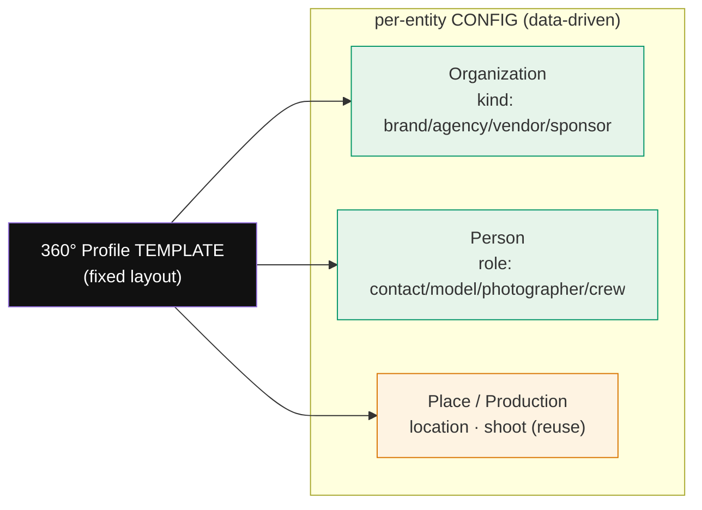

# 360° Profile — One Shared Template

> **Design pattern doc (no code).** The single reusable profile layout that every entity in the Relationship Hub renders through. Generalizes the two 360° screens that already exist — **SCR-27 Organization Detail** and **SCR-20 Model Profile** — into one parameterized pattern. Companion to `RELATIONSHIP-HUB.strategy.md` (the reframe) and `crm-plan.md` (the MVP plan).
>
> **Rule:** design this **once**, configure per entity. Never fork a bespoke detail screen per entity type. A new entity = a new config object, not a new layout.

---

## 1. Why one template

The hub proposal lists five "360°" views (Brand, Model, Photographer, Location, Agency), each with 10–15 tabs. Built naively that's five screens to design and maintain. But they are **the same screen**: iPix's AI-native 3-panel shell with a header, a tab strip, a unified activity timeline, and an IntelligencePanel. SCR-20 (Model Profile) and SCR-27 (Organization Detail) already prove it — they differ only in *which tabs* and *which facts*. So the template is fixed; only a **config** varies.



---

## 2. The fixed layout

Identical structure for every entity — only the *contents* of the marked slots change.

```
┌ NavRail ┬──────────────── 360° WORKSPACE ─────────────────┬──── IntelligencePanel ────┐
│  (hub)  │  ‹ back to [list]      breadcrumb                │  ▸ AI summary (1–2 lines) │
│         │  ┌───────────────────────────────────────────┐  │  ▸ next-best-action       │
│         │  │ [avatar/logo]  Name   [KIND/ROLE chip]  ＋ │  │  ── EvidenceBlock ──      │
│         │  │ key-facts row  ·  entity-specific stats    │  │     summary + confidence  │
│         │  └───────────────────────────────────────────┘  │  ▸ relationship links     │
│         │  [ TAB STRIP — entity-specific, data-driven ]    │     (linked entities)     │
│         │  ┌───────────────────────────────────────────┐  │  ▸ actions (Open / Log)   │
│         │  │  active tab body                           │  │                           │
│         │  │  · overview tabs → facts + linked cards    │  │  (empty/loading/error     │
│         │  │  · list tabs     → rows that LINK OUT       │  │   states mirror body)     │
│         │  │  · activity tab  → unified timeline         │  │                           │
│         │  └───────────────────────────────────────────┘  │                           │
├─────────┴─────────────────────────────────────────────────┴───────────────────────────┤
│  Persistent chat dock — crm-assistant, context = THIS entity  · not yet wired           │
└─────────────────────────────────────────────────────────────────────────────────────────┘
```

**Fixed slots (never change):** NavRail · breadcrumb · header band (avatar + name + type chip + primary action) · tab strip · tab body · unified activity timeline · IntelligencePanel (summary → EvidenceBlock → relationships → actions) · persistent chat dock.

**Variable slots (config-driven):** the avatar shape, the **type chip** (kind vs role), the **key-facts row**, the **tab set**, and which tabs **link out** vs render inline.

---

## 3. The config contract

Each entity supplies one object. This is the *only* thing that differs between a Brand profile and a Photographer profile.

```
EntityConfig = {
  entity:      'organization' | 'person' | 'location' | 'shoot',
  typeField:   'kind' | 'role',              // which dimension the chip shows
  typeValue:   'brand' | 'model' | ...,       // the specific chip
  avatar:      'logo-square' | 'round-photo', // orgs = square, people = round
  keyFacts:    [ {label, value} , … ],        // 2–4 stat tiles under the name
  tabs:        [ TabConfig , … ],             // ordered; only shown if data exists
  aiContext:   'brand:acme' | 'model:kara',   // seeds the chat + IntelligencePanel
  primaryCta:  {label, kind:'neutral'|'approval'}
}

TabConfig = {
  id, label,
  mode:  'facts' | 'linked-list' | 'timeline',
  linksTo?: 'SCR-03' | 'SCR-20' | 'shoot' | … ,  // for linked-list tabs — a LINK, not an embed
  gated?: 'schema' ,                              // grey + "not connected yet" if no table
}
```

**Two hard rules baked into the contract:**
1. **`linked-list` tabs link out — never embed.** A Brand's "Shoots" tab is a list of rows that navigate to the existing Shoot Detail; it does not re-implement Shoot Detail. This is what keeps the hub a *front door*, not a parallel app.
2. **`gated:'schema'` tabs render greyed** with an honest "not connected yet" note when the backing table doesn't exist. No fiction on absent schema.

---

## 4. Per-entity tab configs

> ✅ data exists · ♻️ links to an existing screen · 🟠 CRM fixture table · 🔴 gated (no schema → greyed)

### Organization — Brand (`kind=brand`)  ·  reference: extend Brand Detail SCR-03
`Overview` ✅ · `Contacts` 🟠 · `Deals` 🟠 · `Campaigns` ♻️🔴 · `Shoots` ♻️✅ · `Models` ♻️✅ · `Assets` ♻️✅ · `Contracts` 🔴 · `Activity` ✅ · `AI Insights` ✅

### Organization — Agency (`kind=agency`)  ·  MVP-lite, no new table
`Overview` ✅ · `Roster` (models repped) ♻️✅ · `Bookings` ♻️✅ · `Deals` 🟠 · `Revenue` 🔴 · `Activity` ✅ · `AI` ✅

### Organization — Vendor / Sponsor (`kind=vendor|sponsor`)  ·  Phase 2 framing
`Overview` ✅ · `Deals` 🟠 · `Shoots supplied` ♻️🔴 · `Contracts` 🔴 · `Activity` ✅

### Person — Model (`role=model`)  ·  **already built = SCR-20; reuse verbatim**
`Portfolio` ✅ · `Measurements` ✅ · `Bookings` ♻️✅ · `Brands worked with` ♻️✅ · `Availability` ✅ · `Reviews` ✅ · `Activity` ✅ · `AI` ✅

### Person — Contact (`role=contact`)  ·  built = SCR-29
`Overview` (multi email/phone) ✅ · `Deals` 🟠 · `Activity` ✅

### Person — Photographer / Crew (`role=photographer|crew`)  ·  Phase 2 (gated)
`Shoots` ♻️✅ · `Brands` ♻️✅ · `Availability` 🔴 · `Rates` 🔴 · `Reviews` 🔴 · `Portfolio` 🔴 — most tabs greyed until a `crew`/`people` table lands.

### Place — Location (`entity=location`)  ·  Phase 2 (gated)
`Availability` 🔴 · `Past shoots` ♻️✅ · `Pricing` 🔴 · `Permits` 🔴 · `Images` 🔴

**Observation:** every entity's tab set is a subset of the same vocabulary — Overview · linked-lists (Shoots/Bookings/Brands/Deals/Roster) · Availability · Reviews · Activity · AI. Ten tab archetypes cover all entities. Build the ten; compose per config.

---

## 5. Shared states (mirror the built screens)

The template inherits the exact state archetypes already shipped in the CRM screens and the mobile gallery — no new state design:

- **Loading** — header skeleton + tab-body shimmer (as SCR-26).
- **Empty tab** — "No [deals] yet" + primary CTA.
- **Gated tab** — greyed panel + "Photographer data isn't connected yet (Phase 2)".
- **Error** — "Couldn't load [entity]" + Retry; filters/tab preserved.
- **No selection** (list side) — portfolio summary + needs-attention.

IntelligencePanel mirrors the body state (skeleton while loading, quiet while errored).

---

## 6. IntelligencePanel & chat — per entity

- **Summary + EvidenceBlock** — one AI line + a confidence chip (`high/mid/low` → green/amber/red **with text**, never color alone). Source-tagged "via crm-assistant · sample".
- **Relationship links** — the entity's typed connections (Brand→Shoots→Models→Agency) as **tappable rows**, not a node-graph. This *is* the "relationship graph" for MVP — surfaced as links in the panel + timeline.
- **Chat context** — `aiContext` seeds a proactive greeting scoped to the entity ("Kara has 1 booking in flight and is available Mar 12–14 — draft an offer?"). HITL always: the assistant drafts, the human commits. Dock tagged **"not yet wired"** until the agent + RPCs exist.

---

## 7. Mobile

Template collapses to the platform mobile pattern (see `MOBILE-PLAN.md` §21–22): NavRail → bottom tab bar; IntelligencePanel → **Insights** bottom sheet; tab strip → horizontal-scroll; persistent composer pinned above the tab bar. No new mobile design — the profile is one more screen in the gallery pattern.

---

## 8. Accessibility & responsive

- Tab strip = real tablist (arrow-key nav, `aria-selected`); tabs never gesture-only.
- Type chips carry **text**, not color alone.
- Linked-list rows are `<a>`-semantics with visible focus + chevron.
- Breakpoints: 3-panel ≥1200 · 2-pane (panel→sheet) 768–1199 · 1-col <768.

---

## 9. What this buys — and the guardrail

**Buys:** the entire "18-entity hub" vision renders through **one template + ten tab archetypes + a config per entity**. Brand/Model/Contact/Deal are live today; Agency/Vendor/Sponsor are free (kind/role variants of built screens); Photographer/Crew/Location are a config away once their tables exist.

**Guardrail:** a tab may only render `mode:'facts'`/`'linked-list'`/`'timeline'` over **data that exists**. `gated:'schema'` is the honest default for everything in §4 marked 🔴. The template makes the full vision *visible* (greyed tabs = roadmap in the UI) without designing fiction — exactly the discipline `RELATIONSHIP-HUB.strategy.md §8` and the Supabase reference demand.

---

## 10. Build order for Claude Code (template-first)

1. **Profile shell** — the fixed layout (§2) with slot props.
2. **Ten tab archetypes** (§4 vocabulary): Overview · linked-list · Availability · Reviews · Timeline · AI + the gated/empty/loading/error states.
3. **Config registry** — one `EntityConfig` per entity (§3–4). SCR-20 and SCR-27 become the first two configs (proving the generalization holds).
4. **Wire live tabs only** (✅/🟠); ship the rest `gated`. Expand as schema lands (Phase 2 = add configs, not screens).
