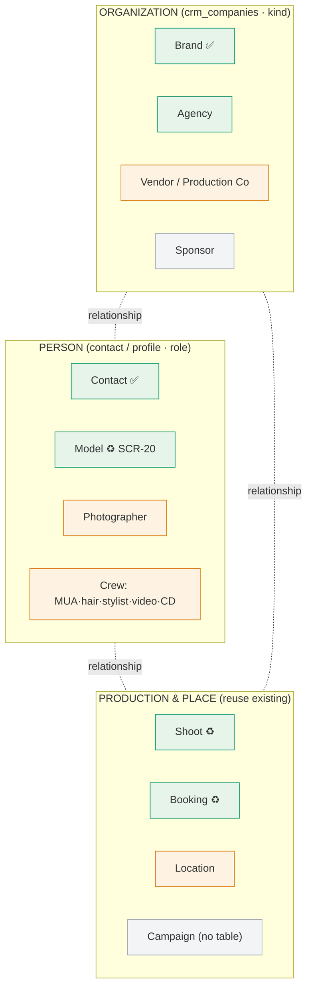

# CRM → AI-Native Relationship Hub — Strategy & Reframe

> **Strategy doc — decision required before more CRM building.** Reconciles the "Industry Relationship Hub" proposal against (a) the verified CRM reference discipline (`uploads/06-crm-supabase-design-reference.md`) and (b) what already exists in iPix. **No code.** Ends with a scope decision (§9).
>
> **TL;DR:** The reframe is *right* — iPix is an operating system for fashion production, not a generic CRM. But the shippable version is **mostly a connective + navigation layer over screens that already exist** (Model Profile, Shoot Detail, Bookings, Brands), **not** 18 new 360° screens. Most of the proposed entities have **no database table**, so they are Future-by-schema, not buildable now. Adopt the *framing* immediately; build the *reuse*; defer the rest behind schema.

---

## 1. The verdict: adopt the framing, not the full build

**Adopt (now, free — it's a renaming + connective reframe):**
- Reposition "CRM" as **Relationships** — the relationship layer of the production OS.
- Treat every important person/company/place/production as a **first-class entity with a 360° profile**, all on the **same AI-native 3-panel shell** (OperatorShell · IntelligencePanel · PersistentChatDock) — the pattern iPix already uses everywhere.
- One **shared 360° profile template** (header → tab strip → unified activity timeline → IntelligencePanel), not N bespoke designs.

**Do NOT adopt (yet — it's the exact scope trap the reference forbids):**
- 18 first-class entities each with 12–15 tabs, built now. **14 of the 18 have no table.**
- A live relationship-graph visualization (reference §7: "no schema — do not design").
- Cross-entity semantic search over data that doesn't exist yet.

**Guiding principle (endorsed, with a reality clause):**
> Every important person, company, place, asset, and production in iPix is a first-class entity with a 360° profile, connected through a shared relationship graph, all using the same AI-native 3-panel interface — **rendered by reusing the screens that already exist, and expanded only as the schema for each entity lands.**

---

## 2. Entity reality check (the part that decides everything)

> The proposal lists 18 entities. Design value depends entirely on whether the data exists. ✅ table exists · 🟠 proposed CRM table (fixtures) · 🔴 no table (Future) · ♻️ **already has a built screen**.

| Entity | Table status | Existing screen? | Disposition |
|---|:--:|---|:--:|
| **Brands** | ✅ `brands` (87 rows) | ♻️ Brand Detail (SCR-03) | **MVP** — 360° = extend existing Brand Detail |
| **Contacts** | 🟠 `crm_contacts` | ♻️ SCR-28/29 built | **MVP** — keep |
| **Deals / Pipeline** | 🟠 `crm_deals` | ♻️ SCR-30/31 built | **MVP** — keep |
| **Companies** (generic) | 🟠 `crm_companies` | ♻️ SCR-26/27 built | **MVP** — becomes the *non-brand* org type (agencies, vendors, production cos, sponsors all rows here with a `kind`) |
| **Models / Talent** | ✅ profiles/bookings exist | ♻️ **Model Profile SCR-20 built** | **MVP** — 360° already exists; link, don't rebuild |
| **Shoots** | ✅ shoots exist | ♻️ **Shoot Detail built** | **MVP** — reuse; add a Relationships sidebar |
| **Bookings** | ✅ exists | ♻️ Booking flow built | **MVP** — reuse |
| **Agencies** | 🔴 none (→ `crm_companies` kind) | — | **MVP-lite** — model as a Company `kind=agency`, no new table |
| **Photographers** | 🔴 none | — | **Phase 2** — needs a `crew`/`people` table; fixtures-only until then |
| **Makeup / Hair / Stylists / Wardrobe (crew)** | 🔴 none | partial (Shoot crew rows) | **Phase 2** — one `crew` entity with a `role`, not 5 entities |
| **Locations** | 🔴 none | — | **Phase 2** — needs `locations` table |
| **Videographers / Creative Directors** | 🔴 none | — | **Phase 2** — crew roles, not separate entities |
| **Production Companies / Vendors** | 🔴 none (→ Company kind) | — | **Phase 2** — Company `kind=vendor` |
| **Campaigns** | 🔴 **no table** | partial | **Future** — reference already flags this |
| **Products** | 🔴 none | ⚪ SCR-12 planned | **Future** |
| **Events** | 🔴 none | ⚪ SCR-19 Future | **Future** |
| **Contracts / Sponsors / Invoices / Payments** | 🔴 none | — | **Future** — legal/finance, no schema |

**What this table proves:** of 18 proposed entities, **~7 are buildable now** (and 4 of those already have screens). The rest are Future-by-schema. The honest MVP is **not 18 entities — it's ~4 org/people types + reuse of Model/Shoot/Booking**, unified by one profile pattern and one nav.

---

## 3. The unifying model: 3 entity families, not 18

Collapse the 18 into **3 families + a role dimension** — this is what keeps it from becoming an unmaintainable sprawl:



- **Organization** = one `crm_companies` table with a `kind` (brand / agency / vendor / sponsor). No new table per org type.
- **Person** = contact or platform profile with a `role` (contact / model / photographer / crew…). No new table per crew type.
- **Production & Place** = **reuse existing** Shoot/Booking screens; Location is the one genuinely-new Phase-2 table.
- **Relationships** = the `crm_activities` timeline + typed links (deal↔shoot, booking↔model, company↔brand) already in the plan. The "graph" is these links surfaced — not a new viz engine.

**This is the single most important architectural call:** `kind`/`role` columns, not entity explosion. It makes the "18 entities" shippable as ~3 screens' worth of variants.

---

## 4. The 360° profile — one reusable pattern

Every "360°" the proposal lists (Brand, Model, Photographer, Location, Agency) is the **same layout** the platform already uses — the AI-native 3-panel with a tab strip and a unified timeline. Design it **once**, parameterize per entity:

```
┌ Nav ┬───────────── 360° workspace ──────────────┬── IntelligencePanel ──┐
│     │  ‹ [Entity name]   [kind/role chip]  ＋    │  AI summary           │
│     │  key facts row (entity-specific)           │  next-best-action     │
│     │  [ tab strip — entity-specific tabs ]      │  ── EvidenceBlock ──  │
│     │  ── unified activity timeline ──────────   │  relationship links   │
├─────┴──────────────────────────────────────────┴───────────────────────┤
│  crm-assistant · context = this entity                                   │
└──────────────────────────────────────────────────────────────────────────┘
```

Tabs are **data-driven per entity** (and only shown when the data exists):
- **Brand** → Overview · Campaigns ♻️ · Shoots ♻️ · Models ♻️ · Contracts🔴 · Assets ♻️ · Timeline · AI. *(links out to existing screens; no reimplementation)*
- **Model** → **already built (SCR-20)** — Portfolio · Bookings · Brands worked with · Availability · Reviews · AI. Reuse verbatim.
- **Photographer** (Phase 2) → Shoots · Brands · Availability · Rates · Reviews · Portfolio. Same template, `role=photographer`.
- **Location** (Phase 2) → Availability · Past shoots · Pricing · Images. Same template.
- **Agency** (MVP-lite) → Roster · Bookings · Revenue · Timeline. Same template, `kind=agency`.

**One template, N configs.** Not five bespoke screens. The tabs that link to existing screens (Campaigns/Shoots/Models/Assets) are **links, not embeds** — preserving "front door, not parallel app."

---

## 5. Navigation reframe (free, do now)

```
Relationships                 ← was "CRM"
├─ Brands        ♻️ existing Brand List, re-homed
├─ Talent        ♻️ existing Matching/Model screens
├─ Agencies      (Company kind=agency)  · MVP-lite
├─ Contacts      ♻️ SCR-28
├─ Pipeline      ♻️ SCR-30
├─ Photographers · Crew · Locations   → Phase 2 (greyed until schema)
└─ Campaigns · Partners               → Future
```

The nav communicates the full vision while only lighting up what's real. Greyed "coming soon" items are honest and set the roadmap in the UI itself.

---

## 6. Where AI gets more powerful (and what's real)

The cross-entity queries the proposal lists are the real payoff — but each depends on data:

| Query | Needs | Status |
|---|---|:--:|
| "Show open deals / at-risk deals" | `crm_deals` | 🟠 fixtures now |
| "Which brands have we never pitched?" | `brands` + `crm_deals` | 🟠 buildable at MVP |
| "Which models worked with Adidas twice?" | bookings + brands | ✅ **real data exists** |
| "Find everyone involved in Shoot #482" | shoot crew links | ✅ partial (crew rows) |
| "Show photographers Nike used last year" | photographers table | 🔴 Phase 2 |
| "Find available photographers next week" | photographer availability | 🔴 Phase 2 |
| "Recommend a location for this campaign" | locations + campaigns | 🔴 Future |
| "Which model matches this moodboard?" | model-match (exists!) | ✅ **already shipping** (SCR-09) |

**Design the chat to accept all of them**, but wire only the ✅/🟠 rows; the 🔴 rows return an honest "photographer data isn't connected yet." The AI framing costs nothing to design and showcases the vision.

---

## 7. How the existing 6 CRM screens survive the reframe

Nothing built is thrown away — the hub is a **superset**:
- **SCR-26/27 Companies** → become the **Organization** screens with a `kind` filter (Brand rows link to the richer Brand Detail; Agency/Vendor/Sponsor live here).
- **SCR-28/29 Contacts** → the generic **Person** case; Model/Photographer are `role` specializations of the same pattern.
- **SCR-30/31 Pipeline/Deal** → unchanged — deals are the commercial layer across all org types, won/lost HITL intact.
- **SCR-20 Model Profile** → **is already a 360° profile** — it becomes the reference implementation of the template.

So the reframe = rename nav + add `kind`/`role` + one shared profile template + reuse. The 6 screens are ~80% of the MVP hub already.

---

## 8. Honest risk assessment

| Risk | Severity | Note |
|---|:--:|---|
| **Entity explosion** (18 tables/screens) | 🔴 high | Mitigated by §3 — 3 families + kind/role, not 18 |
| **Designing on absent schema** | 🔴 high | 14/18 entities have no table; building 360° screens for them = fiction. Fixtures clearly labeled, Phase-2 gated |
| **Becoming the parallel app** | 🟠 med | The hub *links* to Model/Shoot/Brand/Campaign; it must never re-embed them. 360° tabs are links |
| **Scope vs. the verified reference** | 🟠 med | Reference deliberately scoped 6 screens. This expands the *framing* but holds the *build* to schema reality — consistent, not contradictory |
| **Relationship-graph viz** | 🟠 med | Reference forbids designing it now. Represent relationships as **linked lists in the timeline/panel**, not a node-graph, until schema + need are proven |

---

## 9. Recommendation & scope decision

**Recommended path — "Reframe now, build the reuse, defer the rest":**

**Do immediately (low cost, high signal):**
1. Rename CRM → **Relationships** in nav + INDEX; add the greyed future entities so the vision is visible.
2. Add `kind` (org) and `role` (person) to the existing Company/Contact designs — unlocks Agencies/Vendors/Sponsors with **zero new tables**.
3. Write the **one shared 360° profile template** (generalize SCR-27 + SCR-20 into a documented pattern).
4. Design the **cross-entity AI query set** into the chat spec (wire only what has data).

**Phase 2 (when/if schema lands):** Photographers, Crew (one `role`d entity), Locations — each is the same template with a config.

**Future (no schema — do not design):** Campaigns, Products, Events, Contracts, Sponsors-as-entity, Invoices, Payments, live relationship-graph viz, semantic cross-entity search.

**What I need from you — pick one:**
- **(A) Adopt the reframe as strategy** — I update the nav/INDEX naming + add `kind`/`role` to the existing 6 screens + write the shared 360° template doc. **No new entity screens.** *(Recommended — highest value, respects schema reality.)*
- **(B) Also prototype ONE new Phase-2 360°** on fixtures (e.g. Photographer or Location) to prove the template stretches — clearly labeled "fixture, no table yet."
- **(C) Hold** — keep the disciplined 6-screen CRM as-is; revisit the hub when more entity tables exist.

> My vote: **(A)**. It captures the entire strategic upside (iPix as a production OS, not a generic CRM) at near-zero risk, because it's a framing + reuse change over screens that already exist — and it leaves a clean, honest roadmap for B/C later. Building 18 entity profiles now would be designing fiction on top of tables that don't exist, which is the one thing the reference is most emphatic about avoiding.
