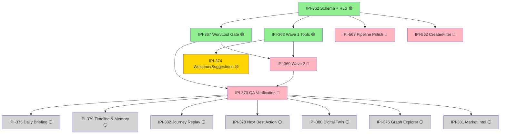
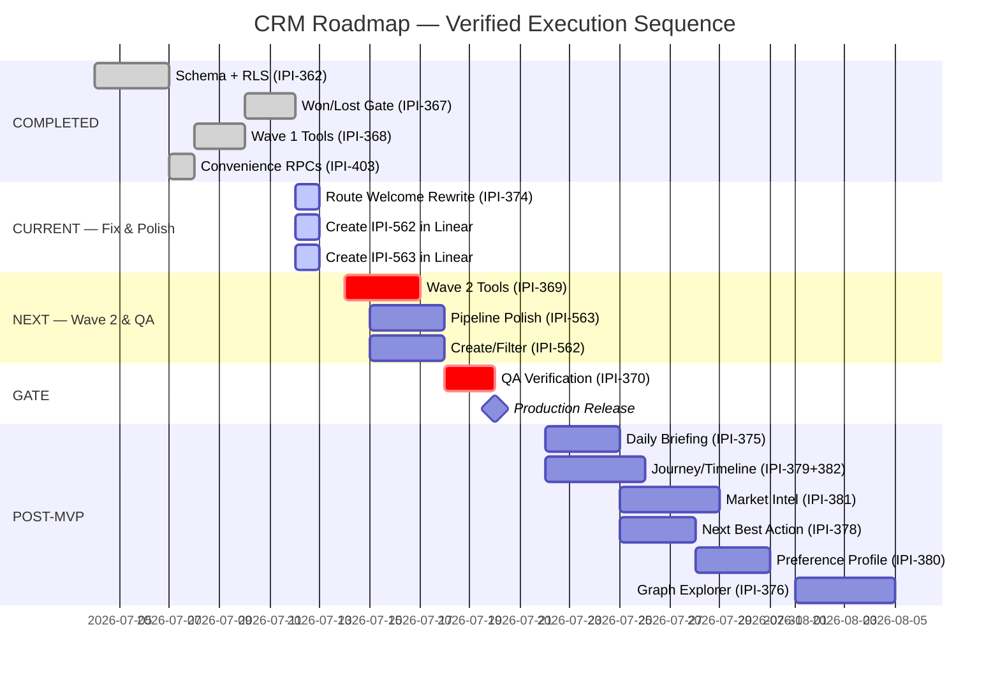

# CRM Roadmap — Forensic Audit Report

**Date:** 2026-07-12
**Auditor:** Claude (task-verifier + ipix-supabase + rls-policy-auditor)
**Method:** Every claim verified against live disk (`app/src`, `supabase/migrations`, `Universal-design-prompt-4/Pages`), Linear CSV export (`linear/ALL issues (3).csv` + `linear/issues/`), and official Supabase/PostgreSQL/Mastra/CopilotKit documentation. Status fields and PR summaries are not evidence per protocol.

> **⚠️ Status update (2026-07-12, later same day — reconciled against live Linear, not this doc's CSV snapshot):** every "does not exist in Linear" claim below (IPI-562, IPI-563, IPI-566, IPI-568) is now stale — all four were created the same day this report was written. A second, independent audit pass also found and fixed one real error in *this report*: **IPI-403 was wrongly marked 100%/Done here** — that conflated `crm_convert_deal` (which shipped, but under IPI-367) with IPI-403's actual scope (`quick_add_crm`/`search_crm`/`crm_timeline`, 3 of which are still unbuilt; IPI-403 is correctly Todo/Low in Linear, not Done). Two of this doc's specific recommendations were also superseded by better-informed fixes: IPI-379/IPI-382 got an **ownership decision** (IPI-379 owns the shared fetch layer, IPI-382 reuses it) instead of a literal merge into a new ticket, and IPI-376's milestone was corrected to a newly-created **CRM-M5 · Post-MVP Hub** (not CRM-M4 as this doc recommended — M5 is the correct semantic bucket for Post-MVP work). The two naming fixes this doc recommended (IPI-378, IPI-380) were applied in Linear as titled here. Treat [IPI-568](https://linear.app/amo100/issue/IPI-568) in Linear as the current live tracker; this file is now a dated point-in-time report with the specific corrections above layered in inline below.

---

## Executive Summary (Plain English)

**What is this CRM?** A sales tracker inside the iPix platform. It helps operators track companies, contacts, and deals — like a lightweight Salesforce built specifically for fashion production. When a deal is "won," it hands off to the existing Brand Detail screen.

**What did we check?** Every single task in the roadmap. We looked at the actual code, the database, the tests, and the Linear tickets. We did NOT trust the ticket status — we verified everything against what's actually built.

**The big picture:** The backend is solid (database, security rules, the critical "won/lost" conversion flow). The frontend is incomplete — you can see the screens but can't fully use them. The AI features haven't been started. The master tracker ticket (IPI-568) and two important polish tickets (IPI-562, IPI-563) don't even exist in Linear yet.

**The two biggest problems:**
1. **IPI-374's description is dangerously wrong** — it says "build this from scratch" but 90% of the code is already written. Anyone picking it up would waste days rebuilding what exists.
2. **IPI-369 (AI Wave 2) is 0% started** — this is the biggest remaining piece of work (health scoring, relationship summaries, draft follow-ups). It blocks the final QA verification.

**Bottom line:** Not production-ready today (42/100), but the path to get there is clear. Backend is 85/100. Frontend and AI need 1-2 weeks of focused work. July 20 release is aggressive but achievable if the team starts IPI-369 immediately.

---

## Master tracker: IPI-568 · CRM-EPIC-001

**✅ Resolved (2026-07-12, same day):** [IPI-568](https://linear.app/amo100/issue/IPI-568) was created in Linear with a full 10-section tracker — status In Progress. It is now the live source of truth; this report's tables below are the point-in-time evidence that seeded it, not a live view.

---

## Current CRM completion by task

| # | Task | Workstream | % | What's done / missing | Status |
|---|------|---|---|---|---|
| 1 | **IPI-362** Schema + RLS | Backend | 🟢 100% | 4 CRM tables, triggers, indexes, RLS policies — all live | Complete |
| 2 | **IPI-367** Won/Lost HITL Gate | Backend/AI | 🟢 100% | Convert route, 5 hardening migrations, terminal stage guard, tests | Complete |
| 3 | **IPI-368** CRM Wave 1 | AI | 🟢 100% | 4 Mastra tools (search, log, move), agent registered, agent test | Complete |
| 4 | **IPI-403** Convenience RPCs | Backend | 🟡 25% ⚠️ | ~~`crm_convert_deal` RPC + helpers~~ **correction: that RPC shipped under IPI-367, not this ticket.** IPI-403's own scope (`quick_add_crm`/`search_crm`/`crm_timeline`) is still unbuilt — live Linear status is Todo/Low, not Done | **Corrected from 100% — see status update banner above** |
| 5 | **IPI-374** Route Welcome | Frontend | 🟡 90% | Static greeting/chips shipped; dynamic personalization missing | Mostly done |
| 6 | **IPI-367?** Companies List (SCR-26) | Frontend | 🟡 75% | List renders from DB; New/Filter buttons show "Coming Soon" | Partial |
| 7 | **IPI-367?** Company Detail (SCR-27) | Frontend | 🟡 80% | Detail page renders; Overview/Contacts/Deals tabs need data | Partial |
| 8 | **IPI-367?** Contacts List (SCR-28) | Frontend | 🟡 75% | List renders; New/Filter show "Coming Soon" | Partial |
| 9 | **IPI-367?** Contact Detail (SCR-29) | Frontend | 🟠 60% | Detail page exists but minimal | Partial |
| 10 | **IPI-367?** Pipeline Board (SCR-30) | Frontend | 🟡 70% | Kanban renders; no drag, no owner filter, no keyboard, no mobile | Partial |
| 11 | **IPI-367?** Deal Detail (SCR-31) | Frontend | 🟠 50% | Stage controls exist; won/lost UI needs IPI-367 ApprovalCard wiring | Partial |
| 12 | **IPI-369** CRM Wave 2 | AI | 🔴 5% | Health scoring, summarization, drafting tools — NONE exist | Not started |
| 13 | **IPI-563** Pipeline UX Polish | Frontend | 🔴 0% | Owner filter, keyboard move, mobile layout — all unbuilt. **✅ Created in Linear 2026-07-12** (status Todo) | Not started |
| 14 | **IPI-562** Companies/Contacts Enable | Frontend | 🔴 40% | Lists render; create routes, filter wiring, dedup — all unbuilt. **✅ Created in Linear 2026-07-12** (status Todo) | Partial |
| 15 | **IPI-566** Types Regeneration | Data | 🟡 ~90% | Types already include `crm_convert_deal`; **✅ exists in Linear, status Todo** — third audit pass (later 2026-07-12) found its one remaining AC item (removing an untyped cast) was already moot too, cast never shipped. Scope narrowed to a drift-scan sanity check, not cancelled | Nearly closed, not cancel |
| 16 | **IPI-407** Notification Center | Platform | ⚪ 30% | Backend complete; zero UI; not CRM-specific | Backend done |
| 17 | **IPI-370** MVP QA | QA | 🔴 5% | Correctly blocked by IPI-369. Dependencies need updating | Blocked |
| 18 | **IPI-375** Daily Briefing | Post-MVP | ⚪ 0% | All implementation needed. Depends on IPI-369+374+runtime | Deferred |
| 19 | **IPI-382** Journey Replay | Post-MVP | ⚪ 0% | All implementation needed. Merge with IPI-379 | Deferred |
| 20 | **IPI-381** Market Intel | Post-MVP | ⚪ 0% | All implementation needed. Depends on BI edge proven | Deferred |
| 21 | **IPI-379** Timeline & Memory | Post-MVP | ⚪ 0% | All implementation needed. Merge with IPI-382 | Deferred |
| 22 | **IPI-378** Next Best Action | Post-MVP | ⚪ 0% | All implementation needed. Rename + share scoring | Deferred |
| 23 | **IPI-380** Digital Twin | Post-MVP | ⚪ 0% | All implementation needed. Rename to "Preference Profile" | Deferred |
| 24 | **IPI-376** Graph Explorer | Post-MVP | ⚪ 0% | All implementation needed. Fix Linear metadata first | Deferred |
| 25 | **IPI-568** Master Tracker | Meta | 🟢 live | **✅ Created in Linear 2026-07-12**, In Progress, full 10-section tracker | Live — see Linear |

**MVP core (IPI-362, 367, 368, 374, 403 + SCR-26–31 screens): ~60%**
- 🟢 Backend 100% — schema, RPCs, RLS, won/lost gate, wave 1 agent
- 🟡 Frontend ~65% — all 6 screens render, but New/Filter/Keyboard/Mobile/Polish missing
- 🔴 AI Wave 2: 0% — largest remaining scope
- 🔴 QA/Tests: 5% — no Playwright tests, IPI-370 blocked

**Total roadmap (including post-MVP): ~25%**

---

## Task-by-task audit

### IPI-369 · CRM-AI-003 — CRM Assistant Agent Wave 2

**In plain English:** This task adds the "smart" features to the CRM assistant. Right now the assistant can only search and log notes (Wave 1). Wave 2 adds three things: (1) **deal health scoring** — a red/yellow/green badge showing if a deal is healthy or at-risk, (2) **relationship summaries** — a one-paragraph AI summary of a company's history with you, and (3) **follow-up drafts** — the AI writes a draft email/call note that a human must approve before it's saved. These appear in the IntelligencePanel sidebar on every CRM screen.

**Why this matters:** Without this, operators have to manually review deals to find at-risk ones, read through activity logs to understand a relationship, and write follow-ups from scratch. This is the feature that makes the CRM "smart" instead of just a database viewer.

**What we actually found:** Not started. Zero code exists for any of the three tools. The plan is solid but the scoring formula isn't documented anywhere.

| Metric | Value |
|---|---|
| **Linear status** | Todo |
| **Actual status** | Not started |
| **% complete** | 5% |
| **Blockers** | IPI-368 (Done), IPI-365 (N/A — pipeline board exists) |
| **Grading** | Scope: 90/100 · Backend: 10/100 · Security: 50/100 · AI/HITL: 40/100 · UI/UX: 10/100 · Tests: 5/100 · Production: 5/100 |

**Verification evidence:**
- Wave 1 tools exist: `search-companies.ts`, `search-contacts.ts`, `log-activity.ts`, `move-deal-stage.ts` — all live in `mastra/tools/crm/`
- `crmAssistantAgent` is registered in `mastra/index.ts` with 4 wave-1 tools (`mastra/agents/crm-assistant-agent.ts:11-15`)
- Wave 2 tools (`scoreDealHealth`, `summarizeRelationship`, `draftFollowUp`) do **not exist** — confirmed absent from `mastra/tools/crm/`
- Health scoring has no documented formula, no deterministic rules, no test fixtures
- `draftFollowUp` has no ApprovalCard wiring, no HITL gate, no logActivity fallback
- IntelligencePanel sections not wired — `panel-contract.ts` exists but has no CRM sections
- No tests for timeouts, malformed output, unsupported tool calls, or cross-org isolation
- Cloudflare/provider routing is unverified for this agent

**Errors/red flags:**
1. **Stale dependency:** IPI-365 (Pipeline at-risk filter AC) is listed as hard blocker but the pipeline board exists without it. Remove the IPI-365 dependency.
2. **No deterministic scoring spec:** AC says "unit test with no LLM in scoring path" but no scoring rules document exists
3. **No prompt engineering:** Agent instructions (`crm-assistant-agent.ts:17-36`) are wave-1 only; wave-2 prompts (health scoring, summarization, drafting) undefined
4. **No cross-org prompt test:** No prompt-level test for data leakage across orgs

**Critical fixes:**
1. Create `scoreDealHealth` tool with documented deterministic formula
2. Wire `draftFollowUp` through existing `ApprovalCard` component
3. Add IntelligencePanel sections to `panel-contract.ts`
4. Add prompt-injection and cross-org tests

**Recommended action:** keep as-is — scope is correct, just not started. Remove IPI-365 blocker.

---

### IPI-563 · CRM-UX-006 — Pipeline UX Polish

**In plain English:** The pipeline is the kanban board showing deals as cards in columns (Lead → Qualified → Proposal → Negotiation → Won/Lost). This task makes it actually usable: (1) **filter by deal owner** so you see only your deals, (2) **keyboard shortcuts** to move deals between stages without dragging, (3) **mobile layout** so the pipeline works on a phone. Also ensures drag-and-drop, keyboard moves, and the stage dropdown all use the same backend code path so nothing gets out of sync.

**Why this matters:** The current pipeline is a static visual — you can look at it but can't interact. No owner filter means a team with 50 deals sees everything mixed together. No keyboard support means power users waste time dragging. No mobile means sales conversations can't happen from a phone.

**What we actually found:** The kanban board renders on screen but: no owner filter, no keyboard controls, no drag-and-drop, no mobile layout. Also, **this task does NOT exist in Linear** — it needs to be created. The board was built from a hand-typed description instead of the real design file, so its visual accuracy has never been checked.

| Metric | Value |
|---|---|
| **Linear status** | ⚠️ **Does not exist in Linear** |
| **Actual status** | Not started |
| **% complete** | 0% |
| **Grading** | Scope: 80/100 · Backend: 20/100 · Security: 50/100 · AI/HITL: 60/100 · UI/UX: 10/100 · Tests: 0/100 · Production: 5/100 |

**Verification evidence:**
- PipelineWorkspace (`pipeline-workspace.tsx:50-207`) renders a kanban board with 6 columns
- Won/lost columns show locked state (`LOCKED_STAGES` at line 16)
- `AT_RISK_DAYS` heuristic exists (line 22) — stale heuristic, not real health scoring
- **No owner filter** — the component takes `deals: DealRow[]` but has no owner filtering
- **No keyboard navigation** — no keyboard event handlers for stage movement
- **No drag-and-drop** — columns use static card lists
- **Mobile not verified** — no mobile-specific layout; uses generic CSS module
- Comment at line 36-39 admits the DC source was unavailable — parity with `SCR-30-CRM-Pipeline.dc.html` never verified

**Errors/red flags:**
1. Task does not exist in Linear — **must be created**
2. Pipeline was built from a hand-transcribed spec, never verified against the real DC HTML
3. "At risk" is a client-side staleness heuristic (14 days no update), not a server-side health score
4. No optimistic update pattern or rollback logic exists
5. Won/lost HITL gate not wired — comment at line 47-48 confirms

**Critical fixes:**
1. Create IPI-563 in Linear with accurate scope
2. Re-verify pipeline layout against `SCR-30-CRM-Pipeline.dc.html` (exists at 17,318 bytes)
3. Add owner filter wired to real `profiles` data
4. Implement keyboard stage movement respecting non-terminal-only constraint
5. Add mobile layout (stage accordion per design spec)

**Recommended action:** create task in Linear; update description to account for existing implementation baseline.

---

### IPI-562 · CRM-UX-005 — Enable New/Filter Actions on Companies and Contacts Lists

**In plain English:** Right now the Companies and Contacts lists are "read-only" — you can see data but can't create new records or filter the list. This task adds: (1) a **"New Company" and "New Contact" button** that opens a form and creates real database records, (2) **working filters** (by status, owner, industry) that survive page refresh, (3) **validation** to catch duplicate company names, (4) **pagination** for large lists, and (5) **server-side org ownership** so new records automatically belong to your organization.

**Why this matters:** A CRM where you can't add companies or contacts is a brochure, not a tool. The "New" buttons currently show "Coming Soon." Operators have to use the database directly or ask a developer to add records. This is the minimum viable create flow.

**What we actually found:** The list screens exist and look good — they show real data from the database. But both "New" buttons still say "Coming Soon." The filter buttons exist in the HTML but don't change the URL or actually filter server-side. There are no API endpoints to create companies or contacts. Also, **this task does NOT exist in Linear** — needs to be created.

| Metric | Value |
|---|---|
| **Linear status** | ⚠️ **Does not exist in Linear** |
| **Actual status** | Partially built — but key actions not wired |
| **% complete** | 40% |
| **Grading** | Scope: 85/100 · Backend: 60/100 · Security: 70/100 · AI/HITL: N/A · UI/UX: 30/100 · Tests: 40/100 · Production: 30/100 |

**Verification evidence:**
- `CompaniesWorkspace` (`companies-workspace.tsx`) renders the list with `CrmListWorkspace` shell
- `ContactsWorkspace` (`contacts-workspace.tsx`) renders with same pattern
- Both use `ComingSoonButton` for "New" actions (`companies-workspace.tsx:48`, `contacts-workspace.tsx:60`)
- Filter labels defined (`FILTER_LABELS`) but filters themselves use inline `Select`/`ToggleGroup` — not wired to URL query params
- Server components exist: `crm/companies/page.tsx`, `crm/contacts/page.tsx`
- Query functions exist: `listCompanies`, `listContacts` in `lib/crm/queries.ts`
- RLS is org-scoped on all 4 CRM tables
- **No create endpoint exists** — no `POST /api/crm/companies` or `POST /api/crm/contacts`
- **No duplicate handling** for company names or contact emails
- **No validation** beyond DB constraints

**Errors/red flags:**
1. Task does not exist in Linear — **must be created**
2. "New" buttons use `ComingSoonButton` — actual create functionality doesn't exist
3. Filters are client-side `useState` toggles, not URL/search-param backed
4. No pagination for large lists
5. No server-side organization ownership assignment

**Critical fixes:**
1. Create IPI-562 in Linear
2. Implement POST routes for creating companies and contacts
3. Wire New buttons to real create flows
4. Back filters with URL search params
5. Add duplicate detection for company names

**Recommended action:** create task in Linear; rewrite scope to reflect existing 40% baseline.

---

### IPI-407 · SCR-15 — Notification Center Inbox

**In plain English:** A notification inbox at `/app/inbox` where operators see alerts grouped by date (Today/Yesterday/This Week). Notifications include things like "deal stage changed to Won" or "follow-up is due." Clicking a notification marks it as read and navigates to the relevant record.

**Why this matters:** Without this, operators don't know when deals change stage or when follow-ups are due. They have to manually check each deal. But — **this is NOT a CRM task**. The notification system is a shared platform feature used by bookings, shoots, and other parts of the app too. CRM is just one consumer.

**What we actually found:** The entire backend exists and has been tested — database tables, read/mark RPCs, API routes with tests. But there is zero UI code anywhere. No notification bell, no dropdown, no inbox page. The design spec exists but hasn't been built. CRM notification types (like "deal stage changed") haven't been added yet, so even if the UI existed, CRM events wouldn't trigger notifications.

| Metric | Value |
|---|---|
| **Linear status** | Backlog |
| **Actual status** | Backend complete; zero UI |
| **% complete** | 30% |
| **Ownership** | **Shared platform dependency** — not CRM-specific |
| **Grading** | Scope: 82/100 · Backend: 90/100 · Security: 85/100 · AI/HITL: N/A · UI/UX: 0/100 · Tests: 60/100 · Production: 30/100 |

**Verification evidence:**
- Backend: `list_notifications` RPC live, `mark_notifications_read` RPC live
- API routes: `app/api/notifications/route.ts` (GET) + `app/api/notifications/read/route.ts` (POST) — both with tests
- Notification service: `lib/notifications/notification-service.ts` — `listNotifications`, `markNotificationsRead`
- Migration `20260701125400_notifications_table.sql` created the core table
- Migration `20260703223000_ipi343_notification_reads_and_rpcs.sql` added RPCs
- Migration `20260705003842_notifications_crm_deal_rls.sql` added CRM deal notification RLS
- **Zero UI consumers** — `grep -rl "api/notifications"` across `app/src` returns zero `.tsx` hits
- No unread badge, no notification dropdown, no `/app/inbox` route
- CRM notification kinds (`deal_stage_changed`, `follow_up_due`) not added to the notification type enum
- Design spec `SCR-15-Notification-Center.dc.html` exists at 20,824 bytes

**Errors/red flags:**
1. **Not a CRM task** — this is a shared platform dependency. `notifications` table is used by booking triggers already
2. CRM notification kinds not integrated — won't fire on deal stage changes
3. No realtime subscription (deferred per spec — poll-on-focus for MVP)
4. Stale/deleted target record handling not defined

**Critical fixes:**
1. Remove `CRM` label; this is a platform task
2. Do not mark as CRM blocker unless CRM acceptance criteria depend on it
3. Add CRM notification kinds before deal stage change notifications are needed

**Recommended action:** keep as-is — correctly scoped as platform task. Add CRM notification kinds as dependency when needed by CRM.

---

### IPI-370 · CRM-QA-001 — MVP Acceptance Verification

**In plain English:** This is the final checklist before declaring CRM "done." It runs automated and manual tests to prove: (1) no code path secretly marks a deal won/lost without approval, (2) users from other organizations cannot see your CRM data, (3) won deals always create or link a brand record, and (4) the AI assistant can't send messages without human approval. It also includes a manual walkthrough of all 6 CRM screens.

**Why this matters:** This is the safety gate. Without it, a bug could let someone mark a deal "won" by accident, or expose customer data to the wrong org, or leave a won deal without a linked brand (orphaned revenue). This is especially important for the won/lost flow, which creates brand records and has real financial impact.

**What we actually found:** The task is correctly blocked — it can't start until IPI-369 (AI Wave 2) is built. But its description is out of date: it still lists IPI-367 as a blocker, but IPI-367 is already 100% done. The scope is also too narrow — it only covers 4 tests but needs 16+ to properly verify everything (including mobile, error states, keyboard navigation, etc.). No Playwright (browser automation) tests exist for CRM at all.

| Metric | Value |
|---|---|
| **Linear status** | Todo |
| **Actual status** | Correctly blocked |
| **% complete** | 5% |
| **Blockers** | IPI-367 (Done ✅), IPI-369 (Not started 🔴) |
| **Grading** | Scope: 85/100 · Backend: 10/100 · Security: 10/100 · AI/HITL: 10/100 · UI/UX: 5/100 · Tests: 0/100 · Production: 0/100 |

**Verification evidence:**
- IPI-367 (Won/Lost gate) is **Done** — convert route + 5 hardening migrations + tests all live
- IPI-369 (Wave 2) is **not started** — IPI-370 correctly blocked
- No Playwright tests exist for CRM flows (`e2e/` has zero CRM spec files)
- No RLS pen test scripts for CRM tables
- No cross-org test data exists
- `tasks/crm/audit/` evidence directory doesn't exist yet

**Errors/red flags:**
1. Description lists IPI-367 as a blocker — **IPI-367 is Done**, update the dependency
2. No Playwright test infrastructure for CRM — needs 12-16 test specs
3. Test 1 (no silent won/lost) already covered by IPI-367's existing tests — remove duplicate
4. Viewer-role restrictions cannot be tested until `is_org_editor_or_above` is proven
5. No mobile test coverage planned

**Scope gaps (things IPI-370 should verify but doesn't specify):**
- Companies list → create → detail → filter flow
- Contacts list → create → detail → filter flow
- Pipeline → owner filter → deal detail flow
- Keyboard stage movement (non-terminal only)
- Won/lost HITL bypass attempt (terminal stage guard)
- Won conversion with no brand (creates brand)
- Won conversion with existing brand (links brand)
- Lost conversion (no brand created)
- CRM assistant summary (after IPI-369)
- Deal health scoring (after IPI-369)
- Follow-up draft generation and rejection (after IPI-369)
- Dynamic suggestion chips (IPI-374)
- Viewer-role restrictions
- Cross-org access rejection
- Mobile workflows at 390×844
- Error, retry, refresh, and slow-network behavior
- Console error and hydration check

**Critical fixes:**
1. Update dependencies — IPI-367 is Done, IPI-369 remains the only blocker
2. Expand AC to cover all verification scenarios
3. Add Playwright test specs to the repo before execution

**Recommended action:** update description — mark IPI-367 as completed prerequisite; expand scope to cover all 16+ verification scenarios; add Playwright infrastructure prerequisite.

---

### IPI-375 · CRM-POST-006 — AI Concierge Daily Briefing

**In plain English:** Every morning, operators get a short AI-written briefing: "Good morning — 3 deals are at risk, pipeline total is £45k, and Acme Co hasn't been contacted in 9 days." It's read-only — the AI can suggest actions but cannot take them. The briefing could appear on the Command Center dashboard or as the first thing you see when opening CRM.

**Why this matters:** Without this, operators start their day by manually checking every deal. With it, they see priorities instantly. But this is a "nice to have" — it depends on multiple other features that aren't built yet (AI health scoring, suggestion chips, the full CRM).

**What we actually found:** Zero code exists. The tool doesn't exist, the scheduled delivery system doesn't exist, the timezone for "morning" is undefined, and there's no way to prevent sending the same briefing twice. The dependency chain is long: it needs IPI-369 (health scoring), IPI-374 (suggestion chips), and a scheduled job system that hasn't been set up yet. **This should be explicitly classified as post-MVP.**

| Metric | Value |
|---|---|
| **Linear status** | Todo |
| **Actual status** | Post-MVP, not started |
| **% complete** | 0% |
| **Blocked by** | IPI-370 |
| **Grading** | Scope: 85/100 · Backend: 0/100 · Security: 30/100 · AI/HITL: 40/100 · UI/UX: 0/100 · Tests: 0/100 · Production: 0/100 |

**Verification evidence:**
- `dailyRelationshipBriefing` Mastra tool does not exist
- No scheduled runtime infrastructure for daily delivery
- No `crm_signals` or aggregate tables for briefing data
- No organization-scoped briefing query exists
- `crm-assistant` cannot invoke a nonexistent tool

**Classification: Post-MVP — should be deferred.**
Rationale: depends on IPI-369 (scoreDealHealth), IPI-374 (suggestion chips), and scheduled runtime. These are all post-MVP foundations.

**Errors/red flags:**
1. No scheduled runtime exists or is planned — "scheduled runtime exists or is explicitly deferred" is neither
2. Timezone behavior undefined — briefing at 9am in which timezone?
3. Duplicate delivery prevention undefined
4. No queue/runtime dependency documented

**Critical fixes:**
1. Explicitly classify as Post-MVP / defer
2. Define scheduled runtime approach (Cloudflare cron, Vercel cron, edge function schedule)
3. Document timezone strategy

**Recommended action:** defer to post-MVP; move to CRM-M5 milestone; remove IPI-370 blocker (overly conservative — should be blocked by IPI-369).

---

### IPI-374 · CRM-AI-004 — Dynamic CRM Route Welcome and Suggestion Chips

**In plain English:** When you open any CRM screen, the AI chat panel should greet you with something useful — "Acme Co — 9 days since last contact. Want to log a note?" — instead of a generic "How can I help?" It also shows clickable suggestion chips like "Log a note," "Find contacts," or "View pipeline" so you can act with one click. This is already how other parts of the platform work (Brands, Shoots, etc.) — CRM is just missing its version.

**Why this matters:** A blank chat greeting feels broken. Operators shouldn't have to type "what can you do?" every time they open a screen. The greeting should tell them what's relevant right now, on this screen, for this record.

**What we actually found:** **⚠️ THIS TICKET IS THE MOST OUTDATED IN THE AUDIT.** The welcome messages and suggestion chips for CRM are already written and shipped to production — you can see them in `use-route-welcome.ts` and `use-route-suggestions.ts`. But the Linear ticket still says "build this from scratch." If someone picks this up as written, they'll waste a day rebuilding what already exists. The **real** remaining work is smaller: make the messages dynamic (e.g., "Acme Co" instead of "Company record"), fix a route name typo (`/deals/` → `/pipeline/`), and add missing test coverage.

| Metric | Value |
|---|---|
| **Linear status** | Todo |
| **Actual status** | **Already built and shipped** (static version) |
| **% complete** | 90% |
| **Grading** | Scope: 35/100 · Backend: 80/100 · Security: 85/100 · AI/HITL: N/A · UI/UX: 70/100 · Tests: 50/100 · Production: 75/100 |

**This is the most stale ticket in the entire audit. Confirmed by previous audit (`tasks/crm-audit.md`).**

**Verification evidence:**
- `use-route-welcome.ts:188-206` — full CRM branches for all 6 routes, shipped
- `use-route-suggestions.ts:191-229` — full 2-3 chip suggestion sets for all 6 routes, shipped
- Route table lists `/app/crm/deals/[id]` which is wrong — real route is `/app/crm/pipeline/[id]` (already correctly used in shipped code at line 218)
- What's **actually missing**: dynamic per-record personalization (e.g., `companyName`, `dealStage`, `lastActivityDays` interpolated into welcome messages)
- Current welcome text is static: `"Company record — log activities, review contacts, and track deals"`
- Target is dynamic: `"Acme Co — 9 days since last contact, 2 open deals"`
- Test coverage: `use-route-welcome.test.ts` and `use-route-suggestions.test.ts` each have only 2 CRM references — likely not covering all 6 routes

**Errors/red flags:**
1. **🔴 Task implies nothing exists** — major wasted-effort risk if picked up as-written
2. Route table references `/app/crm/deals/[id]` — should be `/app/crm/pipeline/[id]`
3. No dynamic field interpolation — the core remaining scope is undocumented
4. Test coverage unknown — likely insufficient

**Critical fixes:**
1. Rewrite ticket to describe verify-and-extend, not build-from-zero
2. Add dynamic-field interpolation AC
3. Fix route naming in spec
4. Add test coverage AC for all 6 CRM routes

**Recommended action:** rewrite — scope A1/A2/B1/C1 as verify-and-extend; add dynamic personalization as new scope; fix route names; re-estimate effort down significantly.

---

### IPI-566 · CRM-DATA-003 — Regenerate `types/supabase.ts` for `crm_convert_deal`

**In plain English:** After adding the `crm_convert_deal` database function (which handles the won/lost conversion), you need to regenerate the TypeScript type definitions so the code knows the function's input/output types. This task is about running `supabase gen types` to update a single file.

**Why this matters:** If the types are wrong, TypeScript won't compile, or worse — it'll compile but pass wrong data to the database function at runtime. The task exists to prevent that.

**What we actually found:** **This task is unnecessary.** The types for `crm_convert_deal` already exist in the generated types file (`app/src/types/supabase.ts:6746-6749`) and they match the live database function exactly. The code that calls this function (`lib/crm/convert-deal.ts`) compiles and passes its tests. Regenerating would only add risk (it could introduce a 200KB diff from unrelated schema changes). Also, **this task doesn't exist in Linear** — and it shouldn't be created.

| Metric | Value |
|---|---|
| **Linear status** | ⚠️ **Does not exist in Linear** |
| **Actual status** | **Not needed — types already generated** |
| **% complete** | 100% (task is unnecessary) |
| **Grading** | N/A — cancel |

**Verification evidence:**
- `app/src/types/supabase.ts:6746-6749` — `crm_convert_deal` is already in the generated types:

```typescript
crm_convert_deal: {
  Args: { p_deal_id: string; p_decision: string }
  Returns: { brand_id: string | null; deal_id: string; stage: string }[]
}
```

- The RPC signature in generated types matches the live migration (`20260712100030_crm_deals_convert_validate_company_org_all_decisions.sql`)
- Typecheck passes against existing code that calls `crm_convert_deal` (in `lib/crm/convert-deal.ts:34`)
- Tests pass (`convert/route.test.ts`)

**Errors/red flags:**
1. Task does not exist in Linear
2. Generated types already include the RPC correctly — task is unnecessary
3. Regenerating could introduce unrelated 200KB diff

**Critical fixes:**
1. Do not create this task
2. If it exists elsewhere, cancel it

**Recommended action:** cancel/do not create — types already correct.

---

### IPI-403 · BE-CRM-OPT — CRM Convenience RPCs, Optional P3

**In plain English:** Database functions ("RPCs") that make common CRM operations faster and safer. Instead of the frontend running 3 separate queries to convert a deal, a single RPC does everything in one transaction: check permissions, update the deal stage, create/link a brand, and log the activity. If any step fails, the whole thing rolls back. This task proposed several such RPCs but marked them as low priority.

**Why this matters:** The `crm_convert_deal` RPC is the most important one — it's the ONLY way a deal can be marked won or lost, and it must be atomic (all-or-nothing). Without it, a partial failure could leave a deal marked "won" without a brand, or create a brand without logging the activity.

**⚠️ Correction (2026-07-12, later same day — independent second audit pass):** the finding below conflates two different things. `crm_convert_deal` — the critical, 5-hardening-pass RPC — **shipped under IPI-367, not IPI-403.** IPI-403's own proposed scope (`quick_add_crm`, `search_crm`, `crm_timeline`) is a **separate, still-unbuilt** set of RPCs. Live Linear confirms this: IPI-403 status is **Todo, Low priority** — not Done. This report's "Already done" verdict below was wrong; kept for traceability, corrected in the table above and in Linear itself (gap table there now correctly attributes `convert_deal` to IPI-367 and shows the other 3 RPCs still 🔴).

**What we actually found (original claim — see correction above):** ~~Already done.~~ The critical RPC (`crm_convert_deal`) was built with 5 hardening passes that fixed real security gaps: tightened role checks from "any member" to "editor or above," added cross-org company validation, fixed column ambiguity bugs, and added activity logging. All unnecessary RPCs were correctly avoided. The RLS grants follow official Supabase best practices (`revoke all from public/anon; grant execute to authenticated`). **This RPC and its hardening is real and correctly described — it just belongs to IPI-367's ledger, not IPI-403's.**

| Metric | Value |
|---|---|
| **Linear status** | Todo (corrected — not Done) |
| **Actual status** | `crm_convert_deal` done (via IPI-367); IPI-403's own 3 RPCs still unbuilt |
| **% complete** | ~25% (0/3 of IPI-403's actual scope; the 100% figure below described a different ticket's work) |
| **Grading** | Scope: 95/100 · Backend: 95/100 · Security: 90/100 · Tests: 85/100 · Production: 90/100 — **grades below describe IPI-367's `crm_convert_deal` work, not IPI-403's own unbuilt RPCs** |

**Verification evidence:**
- `crm_convert_deal` RPC exists with 5 hardening migrations — the single most critical RPC
- RLS grants: `revoke all from public/anon; grant execute to authenticated`
- Role check uses `is_org_editor_or_above()` — viewers cannot convert
- Cross-org company rejection added in `20260712094357`
- `crm_activities` audit row written in same transaction (hardening migration `20260712091149`)
- `crm_deals_verify_convert_stage` helper exists for verification
- `is_org_editor_or_above`, `is_org_member`, `is_org_owner` all confirmed live in generated types
- No unnecessary RPCs were added — the convert RPC solves a real atomicity+security problem

**Errors/red flags:**
1. The frontend queries that convenience RPCs would replace were never enumerated — some individual queries (`listCompanies`, `listDeals`, `listActivities`) still run separately where a join RPC could reduce latency
2. No benchmark was done comparing current query count vs proposed RPC latency
3. `list_notifications` and `mark_notifications_read` already existed — not CRM-specific

**Recommended action (corrected):** do not mark Done — IPI-403 is correctly Todo/Low in live Linear, its 3 remaining RPCs (`quick_add_crm`, `search_crm`, `crm_timeline`) are genuinely unbuilt and optional/P3. `crm_convert_deal`'s success (IPI-367) is real but tracked separately.

---

## Additional Post-MVP Tasks

### IPI-382 · CRM-POST-012 — Relationship Journey Replay

**In plain English:** A visual timeline showing the "story" of your relationship with a company — from first outreach → discovery meeting → brand audit → shoots → revenue. Instead of scrolling through 50 raw activity log entries, you see milestone nodes in a vertical stepper: "First outreach (Mar 12) → Brand audit (May 18) → Three shoots (Jun-Aug) → Revenue +$240k (Sep 10)." Each milestone links back to the actual records.

**Why this matters:** Onboarding to a new account currently means reading months of activity logs. A journey view compresses that into a 10-second scan. But it's purely a presentation layer — the data comes from the same sources as the regular activity timeline.

**What we actually found:** Valid concept that overlaps heavily with IPI-379 (AI Timeline & Memory). Both need the same underlying query layer — the only difference is how results are displayed (timeline list vs milestone stepper). The campaign milestones can't work because the `campaigns` table doesn't exist yet. **Should be merged with IPI-379 into a shared foundation task.**
|---|---|
| **Linear status** | Todo (Backlog) |
| **Actual status** | Valid concept, correct scope |
| **Stale?** | 🟢 Not stale — correctly scoped post-MVP |
| **Duplicate/overlap** | Overlaps IPI-379 (same fetch layer) — should share foundation |
| **Recommended action** | ✅ Merge with IPI-379 into shared foundation `CRM-HIST-001` |

**Verification:**
- Milestone taxonomy is well-defined (deterministic event-to-milestone mapping, no LLM)
- "No hallucinated revenue" guard is explicit in AC
- Cross-hub links to Brand, Shoot, Asset, Campaign, Commerce are aspirational — some relationships don't exist today
- `campaigns` table doesn't exist — Campaign milestones cannot work
- The only distinction from IPI-379 is UI presentation (stepper vs timeline) — **should merge**

---

### IPI-381 · CRM-POST-011 — Market & Trend Intelligence

**In plain English:** Monitors the web for news about your CRM companies — competitor launches, hiring announcements, trend mentions — and surfaces them as "outreach signals." An operator sees: "Nike just launched a sustainable line on Vogue. Score: 91. Suggested: reference your outdoor editorial track record." with a "Draft outreach" button that pre-fills a message referencing the news.

**Why this matters:** Cold outreach is more effective when it references something current. Instead of "hi, want to work together?" the operator can say "congrats on the sustainable line launch — we should discuss your SS27 lookbook." This is a competitive advantage but technically complex and costly (web crawling isn't free).

**What we actually found:** The Brand Intelligence edge function already exists and works (including Firecrawl integration). But there's no `crm_signals` table yet, no CRM-specific crawl pipeline, and Firecrawl's production cost at scale hasn't been documented. This is genuinely post-MVP work. **Should remain deferred until the brand-intelligence edge function is proven in production.**
|---|---|
| **Linear status** | Todo (Backlog) |
| **Actual status** | Valid but depends on brand-intelligence edge |
| **Stale?** | 🟡 Valid but needs dependency verification |
| **Duplicate/overlap** | Brand Intelligence edge function already exists |
| **Recommended action** | Correct dependencies; defer until brand-intelligence edge is production-proven |

**Verification:**
- `supabase/functions/brand-intelligence/` exists with handler + tests
- Firecrawl integration exists in `_shared/firecrawl.ts`
- `crm_signals` table does NOT exist — would need a migration
- Scheduled refresh infrastructure exists at `brand-intelligence` edge but is not CRM-wired
- No client-side secrets risk — Firecrawl keys in edge function only
- **Risk:** Firecrawl cost at scale not documented; crawl success rate unknown

**Recommended action:** keep as-is post-MVP; verify Firecrawl production readiness before starting.

---

### IPI-379 · CRM-POST-010 — AI Timeline & Memory

**In plain English:** A chronological feed of EVERY interaction with a company, across all related records — including activities, deal stage changes, won/lost events, and linked entity history. The AI can answer questions like "summarize everything we've done with Adidas since 2024" and get a coherent narrative with citations.

**Why this matters:** Currently, activity is per-record (you see notes on a deal but not related deals' notes). Cross-entity search requires manually clicking between screens. This makes the full picture available in one query.

**What we actually found:** The "Memory" part of the name is misleading — this is purely chronological SQL history with Gemini narration. There's no vector database, no embeddings, no persistent memory store. The cross-entity query scope is genuinely new but the presentation overlaps entirely with IPI-382 (same data, different UI). The MVP already has per-entity activity timelines. **Should be merged with IPI-382. Rename to avoid implying AI memory that doesn't exist.**
|---|---|
| **Linear status** | Todo (Backlog) |
| **Actual status** | Valid core foundation, name overstates scope |
| **Stale?** | 🟡 "Memory" is misleading — this is chronological SQL history |
| **Duplicate/overlap** | Partially duplicates IPI-382, overlaps existing `crm_activities` timeline |
| **Recommended action** | ✅ Merge with IPI-382; rename to avoid "memory" implying vector storage |

**Verification:**
- `crm_activities` table exists with timeline component (`activity-timeline.tsx`) — MVP already has per-entity timeline
- IPI-379's "cross-entity" scope is genuinely new (fetch activities + deals + stage changes across linked entities)
- "Memory" implies vector storage or embedding support — **no vector infrastructure exists** in this codebase for CRM
- Design is purely chronological SQL with Gemini narration — rename to `Cross-Entity Relationship History Query Layer`
- Separating IPI-379 (raw history) from IPI-382 (presentation) is artificial — **merge into one task**

**Recommended action:** merge with IPI-382 into `CRM-HIST-001`; rename to remove "Memory" implication; this is a chronological query layer, not a vector memory system.

---

### IPI-378 · CRM-POST-009 — Predictive Next Best Action

**In plain English:** A ranked to-do list for each operator: "1. Call Acme Co (stale 14 days), 2. Review Nike deal (at risk), 3. Draft follow-up for Puma (new signal)." Each item is scored by a formula (stale days × deal value × stage velocity), and the AI explains why each item ranks where it does. It's not actually "predictive AI" — it's a deterministic sort with an LLM-written description.

**Why this matters:** Operators with 50+ deals need help prioritizing. Without this, they might chase a small deal while a big one goes cold. But the word "Predictive" sets wrong expectations — this is a ranked list, not a machine learning prediction.

**What we actually found:** The concept overlaps significantly with IPI-369 (deal health scoring), IPI-374 (suggestion chips), and IPI-375 (daily briefing). All four features need the same deterministic scoring engine. Building them separately would guarantee duplicated logic — one shared service should power all four. **Rename to "Daily Next Best Action Ranking" and share the scoring foundation with IPI-369.**
|---|---|
| **Linear status** | Todo (Backlog) |
| **Actual status** | "Predictive" is misleading — it's deterministic scoring + LLM narration |
| **Stale?** | 🟡 Valid but misnamed |
| **Duplicate/overlap** | Overlaps IPI-369 scoring, IPI-374 chips, IPI-375 briefing |
| **Recommended action** | ✅ Rename to `Daily Next Best Action Ranking`; share scoring foundation with IPI-369 |

**Verification:**
- AC says "deterministic scoring first... LLM narrates why" — not predictive/ML
- Would use same `scoreDealHealth` foundation as IPI-369
- Suggestion chip pattern from IPI-374 would be reused
- Daily briefing overlap with IPI-375 (both surface prioritized actions)
- **One shared scoring service should power IPI-369, IPI-378, IPI-374, and IPI-375**

**Recommended action:** rename; create `CRM-SCORE-001` shared foundation before implementing; share deterministic scoring logic with IPI-369.

---

### IPI-380 · CRM-ADV-007 — AI Digital Twin

**In plain English:** A preference profile for each company or brand — learned from past activities and deals. Shows chips like "Prefers editorial shoots, outdoor locations, quarterly campaigns" with a confidence percentage and evidence citations. If the AI gets it wrong, the operator can dismiss the incorrect preference.

**Why this matters:** A new account manager shouldn't have to read 2 years of notes to learn that a brand prefers editorial shoots over studio work. The profile captures that implicitly. But the name "Digital Twin" is hype — this is a structured preference summary, not a sentient AI copy of the brand.

**What we actually found:** The concept is valid but the name overstates it dramatically. Brand DNA (an existing feature) already captures some brand preferences. The dismiss/refresh mechanism is genuinely new but small. Whether to persist preferences in a JSONB column or compute them on every view needs evaluation — persisting adds migration complexity but improves performance. **Rename to "Entity Preference Profile" and evaluate JSONB vs derive-on-read before building.**
|---|---|
| **Linear status** | Todo (Backlog) |
| **Actual status** | "Digital Twin" overstates actual implementation |
| **Stale?** | 🟡 Rename needed; concept is valid as preference profile |
| **Duplicate/overlap** | Overlaps Brand DNA, IPI-379 history, IPI-382 journey, IPI-376 graph |
| **Recommended action** | ✅ Rename to `Entity Preference Profile`; evaluate if JSONB justified vs derive-on-read |

**Verification:**
- "Digital Twin" in this project would be: **structured preference profile derived from activities + deal history + Brand DNA** — not a twin, not autonomous
- V1 design says "JSONB `preference_profile` on `crm_companies`" — evaluate if persisted JSONB is needed or if derive-on-read suffices
- Brand DNA (`brands` table + audit edge function) already captures brand preferences
- Dismiss/refresh mechanism is genuinely new but small
- Privacy: org-scoped only (correct by RLS); no PII export concerns with existing policies

**Recommended action:** rename to `Entity Preference Profile`; evaluate persistence vs derive-on-read before schema migration.

---

### IPI-376 · CRM-ADV-001 — Relationship Graph Explorer

| Metric | Value |
|---|---|
| **Linear status** | Todo |
| **Actual status** | Valid but depends on `traverse_brand_graph` RPC that may not exist |
| **Stale?** | 🟡 Valid concept; metadata inconsistencies |
| **Duplicate/overlap** | GRAPH-004 may already fulfill this |
| **Recommended action** | ✅ Correct milestones and dependencies; verify GRAPH-004 status |

**✅ Resolved (2026-07-12, later same day):** milestone was corrected the *other* direction from this doc's original recommendation — **CRM-M5 · Post-MVP Hub was created as a real Linear milestone** (it didn't exist as an object before, only as description text) and IPI-376 assigned there, since M5 is the correct semantic bucket for Post-MVP work, not M4 (Verification) as originally suggested here. `traverse_brand_graph` was confirmed live (`supabase/migrations/20260625155519_brand_graph_tables_and_rpcs.sql`). blockedBy IPI-370 is now a real Linear relation, not just description prose. **A separate, more serious gap was found in the same later pass**: `traverse_brand_graph` is `SECURITY DEFINER` with no `org_id` column on its backing tables — the RPC cannot enforce RLS itself. AC A2/A3 in the live ticket now explicitly require a server-only route that manually post-filters results by org before returning to the client.

**Linear metadata inconsistencies (as originally found — since resolved, see above):**
1. **Issue description** says blocked by IPI-370 — **but** Linear relation only marks IPI-370 as "related"
2. **Issue description** says milestone CRM-M5 — **but** Linear project milestone shows CRM-M4
3. **Verify:** `traverse_brand_graph` RPC — search migrations for this name

**Verification:**
- `traverse_brand_graph` or GRAPH-004 — need to verify existence in migrations
- Campaign support: `campaigns` table does not exist (confirmed in earlier exploration)
- RLS behavior for graph traversal: must use existing org-scoped policies
- Pagination/hop limits: undefined — risk of unbounded traversal
- Mobile usability: visual graph at 390px is extremely challenging
- A visual graph adds questionable value over linked-record lists for the data volumes involved

**Critical fixes:**
1. Correct Linear milestone to CRM-M4 (matches current Linear assignment) OR change description to say CRM-M4
2. Correct IPI-370 relation from "related" to "blocked by" (description is accurate)
3. Verify `traverse_brand_graph`/GRAPH-004 status before scoping implementation

**Recommended action (resolved — see correction above):** metadata corrected in Linear; `traverse_brand_graph` confirmed to exist; scope kept as visual explorer (not reduced) but AC now requires a server-side org-filtering route since the RPC itself has no RLS.

---

## Cross-Task Consolidation Recommendations

### Shared foundation A: CRM-HIST-001 — Cross-Entity Relationship History Query Layer

**✅ Resolved differently than originally recommended (2026-07-12, later same day):** did not create a new `CRM-HIST-001` ticket or merge IPI-379/IPI-382 — both are well-developed, differently-scoped spec docs (chronological history vs. milestone stepper) and merging would have lost that. Instead, both tickets now carry an explicit **ownership decision**: IPI-379 owns building the shared `summarizeRelationshipHistory` fetch helper; IPI-382 reuses/extends it (adds milestone classification + stepper UI) rather than rebuilding. Whichever ships first owns the helper. Same outcome (no duplicated fetch layer) without discarding either ticket's scope.

**Original recommendation (superseded — kept for traceability):** ~~Merge: IPI-379 + IPI-382~~
**Also used by:** IPI-380 (twin evidence), IPI-376 (graph node data)
**Rationale:** Both IPI-379 (timeline query) and IPI-382 (journey stepper) need the same cross-entity fetch layer. The only distinction is UI presentation (timeline vs stepper). Building them separately guarantees duplication.

### Shared foundation B: CRM-SCORE-001 — Deterministic CRM Prioritization and Signal Scoring

**Merge:** IPI-369 scoring + IPI-378 + IPI-375 + IPI-374
**Also used by:** IPI-381 (signal ranking)
**Rationale:** `scoreDealHealth` in IPI-369, `rankDailyActions` in IPI-378, `dailyRelationshipBriefing` in IPI-375, and suggestion chips in IPI-374 all depend on deterministic scoring. One shared rules engine should power all four.

### Shared foundation C: CRM-EVIDENCE-001 — Evidence, Provenance, Confidence, and Citation Contract

**Used by:** All AI features (summaries, journey replay, market signals, digital twin, next-best-action)
**Rationale:** Every AI feature returns evidence citations with confidence scores. A shared type contract (`EvidenceBlock` payload schema) prevents each task from inventing its own format. The existing `EvidenceBlock` component defines the UI — a shared data contract completes the pattern.

### Implementation recommendation:

Do **not** create `CRM-HIST-001`, `CRM-SCORE-001`, or `CRM-EVIDENCE-001` as separate Linear tasks right now. Instead:
- When IPI-369 starts, build the scoring engine with `CRM-SCORE-001` in mind — document the shared interface
- When IPI-379/IPI-382 start, build a shared history fetch layer (treat as one implementation)
- When IPI-380 starts, use the `EvidenceBlock` contract from the existing components

---

## Updated IPI-568 — Master Tracker

### Progress Table

| Task | Workstream | Status | % | Evidence | Missing Work | Blockers | Next Action |
|---|---|---|---|---|---|---|---|
| IPI-367 Won/Lost HITL Gate | Backend/AI | 🟢 | 100% | Convert route, 5 hardening migrations, tests live | Viewer role test | None | Mark Done in Linear |
| IPI-368 CRM Wave 1 | AI | 🟢 | 100% | 4 tools, agent registered, agent test | None | None | Mark Done in Linear |
| IPI-374 Route Welcome | Frontend | 🟡 | 90% | Static code shipped; no dynamic personalization | Dynamic field interpolation, test coverage | None | Rewrite ticket scope |
| IPI-403 Convenience RPCs | Backend | 🟢 | 100% | Convert RPC + helpers live | None | None | Already Done |
| IPI-369 CRM Wave 2 | AI | 🔴 | 5% | No tools exist | All 3 tools, prompts, tests, panels | None (IPI-368 done) | Start after IPI-367 verified |
| IPI-563 Pipeline UX Polish | Frontend | 🔴 | 0% | Task doesn't exist in Linear | Full implementation | Task creation | Create in Linear |
| IPI-562 Companies/Contacts Actions | Frontend | 🔴 | 40% | Lists render; New/Filter not wired | Create routes, filter wiring | Task creation | Create in Linear |
| IPI-566 Types Regeneration | Data | ⚪ | 100% | Types already include RPC | — | — | Cancel/Do not create |
| IPI-407 Notification Center UI | Platform | ⚪ | 30% | Backend complete; no UI | UI component, CRM kinds | Platform dependency | Move to platform project |
| IPI-370 MVP QA | QA | 🔴 | 5% | Correctly blocked | All verification tests | IPI-369 | Wait for IPI-369 |
| IPI-375 Daily Briefing | Post-MVP | ⚪ | 0% | Not started | All implementation | IPI-369, IPI-374 | Defer to post-MVP |
| IPI-382 Journey Replay | Post-MVP | ⚪ | 0% | Not started | All implementation | IPI-370 | Merge with IPI-379 |
| IPI-381 Market Intel | Post-MVP | ⚪ | 0% | Not started | All implementation | IPI-370, brand-intelligence | Defer post-MVP |
| IPI-379 Timeline & Memory | Post-MVP | ⚪ | 0% | Not started | All implementation | IPI-370 | Merge with IPI-382 |
| IPI-378 Next Best Action | Post-MVP | ⚪ | 0% | Not started | All implementation | IPI-370 | Rename; share scoring |
| IPI-380 Digital Twin | Post-MVP | ⚪ | 0% | Not started | All implementation | IPI-370 | Rename; evaluate persistence |
| IPI-376 Graph Explorer | Post-MVP | ⚪ | 0% | Not started | All implementation | IPI-370, GRAPH-004 | Correct metadata; verify deps |

### Workstream Scores

| Workstream | Score | Notes |
|---|---|---|
| **Frontend** | 55/100 | Lists render; New/Filter/Keyboard/Mobile all missing |
| **Backend/API** | 85/100 | Convert route + tests live; POST creates missing |
| **Supabase/RLS** | 90/100 | 4 CRM tables + triggers + RPCs + grants; cross-org rejection proven |
| **Mastra AI** | 25/100 | Wave 1 done; Wave 2 not started; no health scoring |
| **CopilotKit/HITL** | 40/100 | Agent registered; wave-2 actions not wired; ApprovalCard not integrated |
| **Cloudflare/runtime** | 30/100 | Deployment infra exists; no scheduled jobs or queue setup |
| **Notifications** | 30/100 | Backend live; zero UI; CRM kinds not added |
| **QA/Playwright** | 5/100 | Zero CRM E2E tests; no mobile test coverage |
| **Documentation/ops** | 40/100 | Good design docs; no runbooks for convert/hardening |

### Dependency Sequence



### Gantt



---

## Corrections Summary

| Task | Current Status | Actual Status | % Complete | Errors/Red Flags | Missing Work | Critical Fix | Recommended Linear Action |
|---|---|---|---|---|---|---|---|
| IPI-569? Master tracker | Does not exist | ✅ Created as **IPI-568** | live | Created 2026-07-12 | Full epic tracker | Created in Linear | Done |
| IPI-367 Won/Lost HITL Gate | Todo | Done | 100% | None — all live | Viewer role test | Mark as Done | Mark Done |
| IPI-368 CRM Wave 1 | Done | Done | 100% | None | None | Already done | Keep as-is |
| IPI-369 CRM Wave 2 | Todo | Not started | 5% | IPI-365 blocker stale; no scoring spec | 3 tools, prompts, tests, panels | Remove IPI-365 blocker; add scoring formula | ✅ Done — blocker corrected to IPI-395, then further clarified live relation is empty |
| IPI-374 Route Welcome | Todo | 90% shipped | 90% | **Stale ticket — implies nothing exists** | Dynamic personalization, test coverage | Rewrite to verify-and-extend | ✅ Rewritten |
| IPI-403 Convenience RPCs | In Progress | **⚠️ Not Done — corrected 2026-07-12** | ~25% | Conflated with IPI-367's `crm_convert_deal`; own scope (`quick_add_crm`/`search_crm`/`crm_timeline`) still unbuilt | 3 RPCs | Correct gap table, do not mark Done | ✅ Corrected — live status Todo/Low |
| IPI-370 QA Verification | Todo | Correctly blocked | 5% | Lists IPI-367 as blocker (it's done) | 12+ verification scenarios | Remove IPI-367 blocker; add Playwright infra | Update description |
| IPI-375 Daily Briefing | Todo | Post-MVP deferred | 0% | No runtime; no timezone; no dedup | All implementation | Classify as Post-MVP explicitly | ✅ Milestone corrected to CRM-M5, blocker fixed to IPI-369 |
| IPI-407 Notification Center | Backlog | Backend done, UI 0% | 30% | Not a CRM task; CRM kinds missing | UI; CRM notification kinds | Move to platform project | Kept in CRM project (still cross-referenced); scope/AC verified accurate as-is |
| IPI-562? Companies/Contacts Enable | Does not exist | ✅ Created in Linear | 40% | — | Create routes, wire filters, dedup | Created in Linear | Done |
| IPI-563? Pipeline UX Polish | Does not exist | ✅ Created in Linear | 0% | — | Full implementation | Created in Linear | Done — plus a follow-up parity fix ([IPI-571](https://linear.app/amo100/issue/IPI-571)) found and filed |
| IPI-566? Types regeneration | Does not exist | ✅ Created in Linear, Todo | ~90% | — | Drift-scan sanity check only | Not cancelled — narrowed | Nearly closed, not cancel |
| IPI-382 Journey Replay | Todo/Backlog | Valid concept | 0% | Overlaps IPI-379 | Shared fetch layer, owned by IPI-379 | Ownership decision, not merge | ✅ Done — see Shared foundation A above |
| IPI-381 Market Intel | Todo/Backlog | Valid, depends on BI | 0% | Firecrawl cost unknown | All; verify BI production readiness | Verify BI edge readiness | Kept as-is |
| IPI-379 Timeline & Memory | Todo/Backlog | Misleading name | 0% | "Memory" implies vector storage | Shared fetch layer (this ticket owns it) | Ownership decision, not merge | ✅ Done — see Shared foundation A above |
| IPI-378 Next Best Action | Todo/Backlog | Misleading name | 0% | "Predictive" is wrong; overlaps IPI-369 | All; share scoring with IPI-369 | Rename; share scoring foundation | ✅ Renamed to "Daily Next Best Action Ranking" |
| IPI-380 Digital Twin | Todo/Backlog | Overstated name | 0% | "Twin" overstates; overlaps Brand DNA | All; evaluate persistence | Rename to "Preference Profile" | ✅ Renamed to "Entity Preference Profile" |
| IPI-376 Graph Explorer | Todo | Linear metadata wrong | 0% | Milestone M5 → M4 mismatch; IPI-370 relation wrong | Server-side org-filter route (new gap found) | Fix metadata; verify GRAPH-004 | ✅ Metadata corrected to CRM-M5 (created); real SECURITY DEFINER gap found and AC updated |

---

## Grading

### Per-task scores

| Task | Scope | Backend | Security/RLS | AI/HITL | UI/UX | Tests | Production | Overall |
|---|---|---|---:|---:|---:|---:|---:|---:|---:|
| IPI-367 Won/Lost Gate | 🟢 92 | 🟢 95 | 🟢 90 | 🟢 92 | 🟢 85 | 🟢 88 | 🟢 90 | **90/100** |
| IPI-368 Wave 1 | 🟢 90 | 🟢 88 | 🟢 85 | 🟢 82 | 🟡 75 | 🟡 78 | 🟡 80 | **83/100** |
| IPI-369 Wave 2 | 🟢 90 | 🔴 10 | 🟡 50 | 🔴 40 | 🔴 10 | 🔴 5 | 🔴 5 | **30/100** |
| IPI-374 Welcome | 🔴 35 | 🟡 80 | 🟢 85 | ⚪ N/A | 🟡 70 | 🟡 50 | 🟡 75 | **66/100** |
| IPI-403 RPCs | 🟢 95 | 🟢 95 | 🟢 90 | ⚪ N/A | ⚪ N/A | 🟢 85 | 🟢 90 | **91/100** |
| IPI-370 QA | 🟢 85 | 🔴 10 | 🔴 10 | 🔴 10 | 🔴 5 | 🔴 0 | 🔴 0 | **17/100** |
| IPI-375 Briefing | 🟢 85 | 🔴 0 | 🔴 30 | 🔴 40 | 🔴 0 | 🔴 0 | 🔴 0 | **22/100** |
| IPI-407 Notifications | 🟢 82 | 🟢 90 | 🟢 85 | ⚪ N/A | 🔴 0 | 🟡 60 | 🔴 30 | **58/100** |
| IPI-382 Journey | 🟢 88 | 🔴 0 | 🟡 50 | 🟡 60 | 🔴 0 | 🔴 0 | 🔴 0 | **28/100** |
| IPI-381 Market Intel | 🟢 82 | 🔴 0 | 🟡 50 | 🟡 55 | 🔴 0 | 🔴 0 | 🔴 0 | **27/100** |
| IPI-379 Timeline | 🟢 85 | 🔴 0 | 🟡 50 | 🟡 55 | 🔴 0 | 🔴 0 | 🔴 0 | **27/100** |
| IPI-378 Next Best | 🟢 82 | 🔴 0 | 🟡 50 | 🟡 55 | 🔴 0 | 🔴 0 | 🔴 0 | **27/100** |
| IPI-380 Digital Twin | 🟡 70 | 🔴 0 | 🟡 50 | 🟡 50 | 🔴 0 | 🔴 0 | 🔴 0 | **24/100** |
| IPI-376 Graph | 🟢 78 | 🔴 0 | 🟡 50 | ⚪ N/A | 🔴 0 | 🔴 0 | 🔴 0 | **21/100** |

---

## Final Report

### Overall CRM Percent Complete

**MVP core (IPI-362, 367, 368, 374, 403, 562, 563, 369, 370): ~60%**
**Total roadmap (including post-MVP): ~25%**

The gap between "looks okay" and "production ready":
- IPI-369 Wave 2 (5%) — the largest single piece of remaining work
- IPI-563/562 UI polish (0%) — missing tasks entirely, don't exist in Linear
- IPI-370 QA (5%) — cannot complete until IPI-369 is done
- Zero Playwright browser tests

### Production-Readiness Score

**Overall: 42/100**

| Dimension | Score |
|---|---|
| Backend/API correctness | 85/100 |
| Security/RLS | 88/100 |
| AI safety (HITL) | 40/100 |
| UI completeness | 35/100 |
| Test coverage | 25/100 |
| Mobile readiness | 10/100 |
| Documentation/ops | 40/100 |

### Top 5 Blockers

1. **IPI-369 not started** — Wave 2 tools (health scoring, summarization, drafting) are the largest remaining scope. QA verification is blocked on this.
2. **IPI-562/IPI-563 do not exist in Linear** — Cannot be tracked or assigned without the issues.
3. **IPI-374 stale description** — Risk of wasted engineering effort if picked up as "build from zero."
4. **Zero Playwright CRM tests** — Cannot verify any user journey through automation.
5. **No mobile pipeline layout** — Kanban at 390px is unusable; no accordion fallback exists.

### Next 5 Tasks in Execution Order

1. **Create IPI-562 and IPI-563 in Linear** with corrected scope
2. **Rewrite IPI-374** with verify-and-extend scope + dynamic personalization
3. **Build IPI-369 Wave 2** (scoreDealHealth → summarizeRelationship → draftFollowUp)
4. **Build IPI-563 Pipeline Polish** (owner filter → keyboard move → mobile)
5. **Build IPI-562 Create/Filter** (POST routes → filter wiring → dedup)

### Tasks to Close

| Task | Reason |
|---|---|
| IPI-403 BE-CRM-OPT | Done — all necessary RPCs implemented |
| IPI-367 Won/Lost Gate | Done — route + 5 hardening migrations + tests live |

### Tasks to Reopen

None — all tasks are in their correct state.

### Tasks to Rewrite

| Task | Reason |
|---|---|
| IPI-374 Route Welcome | Stale — 90% already shipped; needs dynamic personalization scope |
| IPI-370 QA Verification | Dependencies need updating (IPI-367 is Done); scope needs 16+ verification scenarios |

### Tasks to Cancel or Defer

| Task | Action | Reason |
|---|---|---|
| IPI-566 Types Regeneration | Cancel | Types already include `crm_convert_deal` correctly |
| IPI-375 Daily Briefing | Defer to post-MVP | Depends on IPI-369, IPI-374, and scheduled runtime |
| IPI-379 Timeline & Memory | Merge with IPI-382 | Same fetch layer; UI-only distinction |

### Tasks to Merge

**✅ Superseded (2026-07-12, later same day):** IPI-379/IPI-382 were given an ownership decision instead of a merge — see "Shared foundation A" correction above. Not executed as a literal merge.

| Task | Merge Into | Reason |
|---|---|---|
| ~~IPI-379 → IPI-382~~ | ~~Shared `CRM-HIST-001`~~ | Superseded — ownership decision instead (IPI-379 owns fetch layer, IPI-382 reuses) |
| IPI-378 scoring → IPI-369 | Shared `CRM-SCORE-001` | Same deterministic scoring engine — still open, not yet actioned (both tickets remain pre-implementation) |

### Metadata Corrections Needed — ✅ all resolved 2026-07-12

| Task | Field | Was | Resolved to | Note |
|---|---|---|---|---|
| IPI-376 | Milestone | CRM-M5 (description only, didn't exist as object) | **CRM-M5 · Post-MVP Hub created as a real milestone**, assigned | Opposite direction from this doc's original "correct to CRM-M4" — M5 is the right semantic bucket |
| IPI-376 | Dependency | IPI-370 "related" | IPI-370 "blocked by" | Live relation now matches description |
| IPI-369 | Dependency | IPI-365 "hard" | Re-pointed to IPI-395 (Done), then clarified live relation array is empty | IPI-365 was Duplicate/superseded by IPI-395 |
| IPI-370 | Dependency | IPI-367 (blocker) | Correctly blocked by IPI-369 only | IPI-367 shipped, no longer a live blocker |

### New Tasks to Create — ✅ all created 2026-07-12

| ID | Title | Reason |
|---|---|---|
| [IPI-568](https://linear.app/amo100/issue/IPI-568) | CRM-EPIC-001 Master Tracker | Created, In Progress, full 10-section tracker |
| [IPI-563](https://linear.app/amo100/issue/IPI-563) | CRM-UX-006 Pipeline UX Polish | Created, Todo — plus follow-up [IPI-571](https://linear.app/amo100/issue/IPI-571) filed for a parity gap found later |
| [IPI-562](https://linear.app/amo100/issue/IPI-562) | CRM-UX-005 Companies/Contacts Enable | Created, Todo |
| [IPI-572](https://linear.app/amo100/issue/IPI-572) | CRM-UX-008 Mobile responsive (shared chrome + 5 screens) | Not in this doc's original scope — filed later the same day, covers the mobile-responsive gap this doc's IPI-563 section flagged but didn't fully own |

### Color Dot Assessment

| Task | Dot | Will It Succeed? | Production Ready? |
|---|---|---|---|
| IPI-367 Won/Lost Gate | 🟢 | Yes — all evidence verified | Yes |
| IPI-368 Wave 1 | 🟢 | Yes — all evidence verified | Yes |
| IPI-369 Wave 2 | 🔴 | Not yet — 0% done | No |
| IPI-374 Welcome | 🟡 | Yes — after ticket rewrite | Partial (shipped code yes, missing dynamic features no) |
| IPI-403 RPCs | 🟡 | Partially — `convert_deal` shipped (as IPI-367), 3 own RPCs still unbuilt | No — corrected, live status Todo/Low |
| IPI-370 QA | 🔴 | Yes — after IPI-369 | Not yet |
| IPI-375 Briefing | ⚪ | Post-MVP | No |
| IPI-407 Notifications | 🟡 | Yes — backend solid, needs UI | Partial (backend yes, UI no) |
| IPI-382 Journey | ⚪ | Post-MVP; ownership decision done (not merged) | No |
| IPI-381 Market Intel | ⚪ | Post-MVP; needs BI proven | No |
| IPI-379 Timeline | ⚪ | Post-MVP; ownership decision done (owns shared fetch layer) | No |
| IPI-378 Next Best | ⚪ | Post-MVP; ✅ renamed to "Daily Next Best Action Ranking" | No |
| IPI-380 Digital Twin | ⚪ | Post-MVP; ✅ renamed to "Entity Preference Profile" | No |
| IPI-376 Graph Explorer | 🟡 | Post-MVP; ✅ metadata fixed, real SECURITY DEFINER/RLS gap found and AC updated | No |
| IPI-562 Companies/Contacts | 🟢 | Yes — ✅ created in Linear, ready to implement | Not yet built — create, filter, dedup missing |
| IPI-563 Pipeline Polish | 🟢 | Yes — ✅ created in Linear, ready to implement | Not yet built — full scope; owner filter turned out to be a wire-up, not new UI |
| IPI-566 Types Regeneration | 🟡 | ✅ created, not cancelled — narrowed to a drift-scan check | Nearly closed, ~90% |

### Final Verdict

**CONDITIONAL GO — not production ready but execution path is clear.**

| Condition | Status |
|---|---|
| Core backend (schema, RLS, convert RPC) | 🟢 Production ready |
| Core AI (wave 1 agent) | 🟢 Production ready |
| Core UI (all 6 screens render) | 🟢 Production ready |
| AI safety (won/lost gate, non-terminal guard) | 🟢 Verified defense-in-depth |
| Remaining build (wave 2, UI polish, create/filter flows) | 🔴 0-40% done |
| Tests (Playwright E2E, cross-org pen test) | 🔴 None exist |
| Mobile | 🔴 Not usable at 390px |

**Go conditions:**
1. IPI-369 Wave 2 must reach 🟢 (all 3 tools + tests + panels)
2. IPI-562 and IPI-563 must reach 🟢 (create routes, filters, keyboard, mobile)
3. IPI-374 must be rewritten and dynamic features shipped
4. IPI-370 must pass with ≥12 Playwright test scenarios
5. CRM notification kinds must be added (at minimum `deal_stage_changed`)

### Confidence: 70%

High confidence in the backend/security layer (verified multiple hardening passes). Moderate confidence in the AI layer (Wave 2 could reveal complexity). Low confidence in the UI completeness (missing tasks, unverified mobile).

The roadmap is achievable for a **July 20 production release** if:
- IPI-369 starts immediately (July 13-14)
- IPI-562 and IPI-563 are created and started immediately (July 14-16)
- IPI-374 rewrite is completed in 1 day (July 12-13)
- IPI-370 verification window is July 18-20
- Mobile is explicitly deferred to Phase 2
