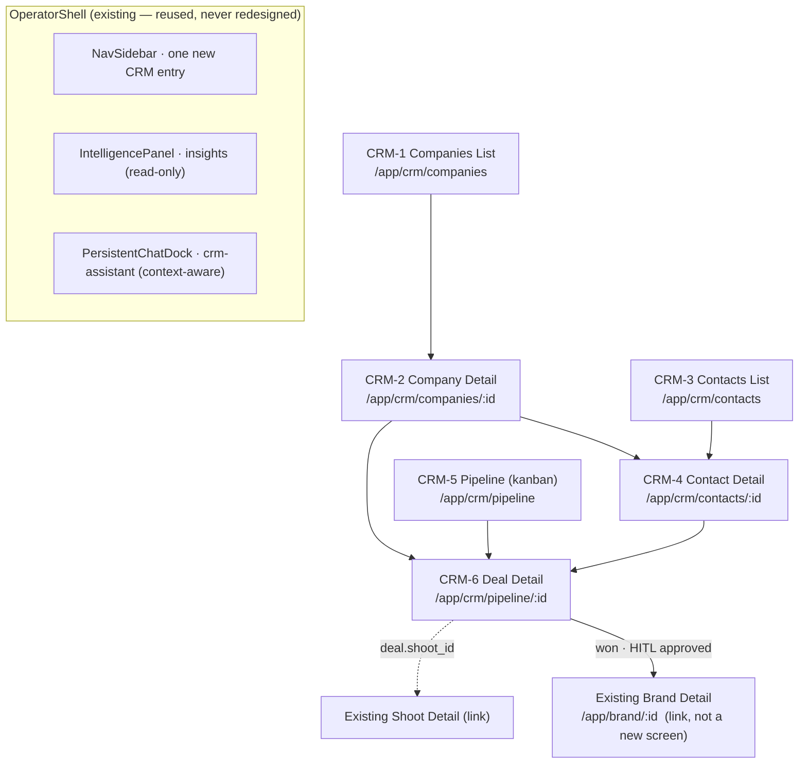
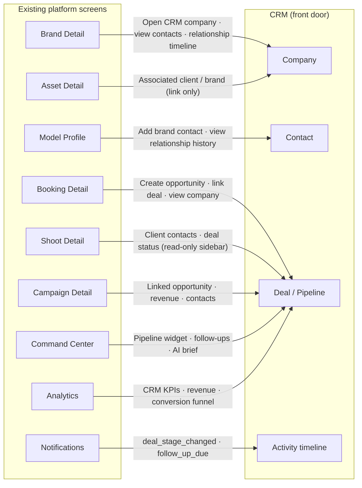
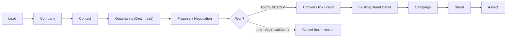
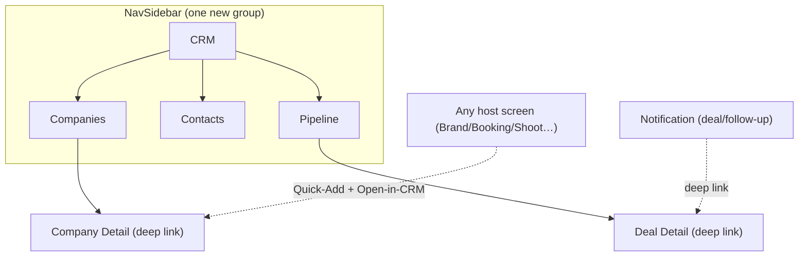

# CRM Design Plan — iPix / FashionOS

> **Design planning only.** No React, no SQL, no implementation. Reconciles the ambitious integration brief against the disciplined CRM reference docs (`uploads/02-crm-design-master.md`, `uploads/06-crm-supabase-design-reference.md`, `uploads/README.md`). On any "is this real?" question, **`06-crm-supabase-design-reference.md` wins** — it was verified against live Supabase on 2026-07-04.
>
> **Prime directive:** CRM is a **front door onto the existing product, not a parallel app.** A won deal hands off to the existing Brand Detail / Shoot / Campaign screens — we design the *handoff* (a link), never a reimplementation. Reuse the 3-panel `OperatorShell`, Zeely Editorial v3 tokens, IntelligencePanel, PersistentChatDock, EvidenceBlock, ApprovalCard.
>
> ⚠️ **FIXTURE-ONLY UNTIL SCHEMA (read first).** All 4 CRM tables (`crm_companies/contacts/deals/activities`) are 🔴 *proposed* — IPI-362 not started. The `crm-assistant` agent (IPI-368/369), the brand-conversion route, and the CRM notification kinds are all 🔴 not built. **Every CRM prototype must carry a visible "Sample data — not live" badge, and all AI behavior is a labeled placeholder.** Nothing in this plan implies a working backend. Claude Code verifies/builds the schema before any real implementation.
>
> 🧭 **Guiding principle (adopted from review):** *one platform · one AI · one timeline · one shell.* Reuse the existing 3-panel AI-native architecture, the single unified activity timeline, the persistent AI composer, and shared components everywhere — never introduce a CRM-specific pattern where an existing one fits. This is the standard against which every enhancement in §20 is triaged.

---

## 0. Progress Task Tracker

> 🟢 complete · 🟡 in progress / needs work · 🔴 blocked / critical · ⚪ not started. **"Design" = this plan specifies it; build is Claude Code.** Verified against the 3 uploaded reference docs, not assumed.

### Design planning (this document)
| # | Deliverable | Status | Proof / note |
|---|---|:--:|---|
| 1 | CRM Master Design Plan | 🟢 | this doc |
| 2 | Information Architecture (§2) | 🟢 | 6 MVP screens + routes + sitemap mermaid |
| 3 | Integration Map (§3) | 🟢 | where CRM surfaces across 8 existing screens |
| 4 | Existing Screen → CRM Entry Matrix (§4) | 🟢 | entry points · quick actions · AI · nav |
| 5 | Quick Add CRM Pattern (§5) | 🟢 | icon · placement · menu · modal · shortcut |
| 6 | AI Interaction Plan (§6) | 🟢 | per-screen IntelligencePanel + chat + HITL |
| 7 | User Journey Map (§7) | 🟢 | lead→won→handoff + 5 cross-domain journeys |
| 8 | Navigation Map (§8) | 🟢 | dedicated section **and** contextual, mermaid |
| 9 | Component Reuse Matrix (§9) | 🟢 | reuse vs 5 genuinely-new components |
| 10 | Mobile / Tablet Integration Plan (§10) | 🟢 | 1024 breakpoint, sheet patterns |
| 11 | Implementation Priority Roadmap (§11) | 🟢 | MVP → Phase 2 → Future |
| 12 | Design Checklist (§12) | 🟢 | per-screen checkboxes |
| 13 | Risks / blockers / assumptions (§13) | 🟢 | + scores |
| 14 | Permissions matrix (§15) | 🟢 | role × action, added per audit |
| 15 | Route → data matrix (§16) | 🟢 | route × tables × components × AI × backend |
| 16 | Production state matrix (§17) | 🟢 | 8 runtime states per screen |
| 17 | Analytics event catalog (§18) | 🟢 | telemetry per CRM action |
| 18 | Prototype verification checklist (§19) | 🟢 | pre-handoff gate |
| 19 | Enhancement triage (§20) | 🟢 | 15 review ideas → already / Phase 2 / Future |

### CRM screens (design → prototype → build)
> Permanent IDs assigned in `docs/handoff/SCREEN-REGISTRY.md`: CRM-1→**SCR-26**, CRM-2→**SCR-27**, CRM-3→**SCR-28**, CRM-4→**SCR-29**, CRM-5→**SCR-30**, CRM-6→**SCR-31**.

| SCR | Screen | Route | Design spec | Prototype | Build |
|---|---|---|:--:|:--:|:--:|
| SCR-26 | Companies List | `/app/crm/companies` | 🟢 §14 | 🟢 | ⚪ |
| SCR-27 | Company Detail | `/app/crm/companies/:id` | 🟢 §14 | 🟢 | ⚪ |
| SCR-28 | Contacts List | `/app/crm/contacts` | 🟢 §14 | 🟢 | ⚪ |
| SCR-29 | Contact Detail | `/app/crm/contacts/:id` | 🟢 §14 | 🟢 | ⚪ |
| SCR-30 | Pipeline (kanban) | `/app/crm/pipeline` | 🟢 §14 | 🟢 | ⚪ |
| SCR-31 | Deal Detail (won/lost HITL) | `/app/crm/pipeline/:id` | 🟢 §14 | 🟢 | ⚪ |

### Backend readiness (Claude Code / not design)
| Item | Status | Note |
|---|:--:|---|
| `crm_companies/contacts/deals/activities` schema | 🔴 | IPI-362 not started — **design against fixtures** |
| `crm-assistant` Mastra agent | 🔴 | IPI-368/369 — design its presence, mark "not yet wired" |
| `public.notifications` CRM kinds (`deal_stage_changed`, `follow_up_due`) | 🔴 | table 🟢 exists; kinds not added |
| `brands` conversion route | 🔴 | `brands` table 🟢 exists (87 rows); convert path not built |
| `list_notifications` / `mark_notifications_read` RPCs | 🟢 | live but no UI calls them (pre-existing platform gap) |

### Needs attention
- 🟢 **All 6 MVP prototypes built + verified** (2026-07-04) — SCR-26–31 render clean (0 holes, 0 broken images), each with the fixture badge, `crm-assistant` "not yet wired", panel/chat separation, and the won/lost ApprovalCard gate proven on SCR-31. Design phase is effectively complete.
- 🟡 **Scope discipline** — the pasted brief lists ~20 aspirational surfaces (Tasks, Communications, Calendar, Documents, Analytics, Relationship Intelligence…). The reference **defers all of them** (§7). This plan honors the *integration thinking* but marks each MVP / Phase 2 / Future — do not build past the 6 MVP screens without a scope decision.
- 🔴 **Everything is fixtures** — all 4 CRM tables are 🔴 proposed. Every prototype carries a visible "sample data" note; nothing implies live.

### Suggested next tasks (priority order)
1. 🟢 **Design done — hand to Claude Code.** The 6 prototypes + this plan are the design source of truth. Next real work is backend, not design.
2. 🔴 **Schema first (IPI-362)** — author `crm_companies/contacts/deals/activities` + RLS (org-scoped) + indexes + the booking-style status enums, against the live Supabase. Blocks everything.
3. 🔴 **`crm-assistant` agent (IPI-368/369)** — wire waves 1–2 tools (searchCompanies, summarizeRelationship, scoreDealHealth, draftFollowUp, logActivity, moveDealStage). Replace every "not yet wired" fixture.
4. 🔴 **won/lost + convert route** — the ApprovalCard actions on SCR-31 must call `transition_booking`-style RPCs + the brand-conversion path (writes existing `brands`).
5. 🔴 **Notification kinds** — add `deal_stage_changed` + `follow_up_due` to `public.notifications`; surface in SCR-15.
6. 🟡 **Optional design polish** — (a) mobile/tablet frames for the 6 screens (kanban→accordion is the one non-trivial one, §10); (b) the Quick-Add popover (§5) as a shared prototype; (c) the two MVP host-screen integrations (Brand Detail↔Company link, Deal→Shoot) shown on the existing screens.
7. ⚪ **Do NOT start** any §20 Future surface (360° view, relationship graph, comms send, forecasting) without an explicit scope decision.

---

## 1. Phase 1 — Audit

> 🟢 complete (specified/covered) · 🟡 needs improvement · ⚪ future (deferred by design) · 🔴 critical gap.

| Area | Status | Finding |
|---|:--:|---|
| **Missing screens** | 🟢 | 6 MVP screens fully specified in the reference; the brief's extra ~14 are **deferred by design** (⚪), not missing — see §7. No true gap. |
| **Duplicate screens** | 🟢 | None. CRM explicitly must not re-create Brand profile, Booking, Asset gallery — it links to the existing ones. Company Detail links to existing Brand Detail once `brand_id` is set. |
| **Duplicate workflows** | 🟡 | Risk, not fact: "Communications"/"Tasks"/"Notes"/"Meetings" keep getting re-proposed as separate lists. **Resolved:** one unified `crm_activities` timeline with a `type` filter — design a single chronological component, four times filtered. |
| **Missing user journeys** | 🟢 | Core lead→won→handoff is documented (§7). Added 5 cross-domain journeys (Model↔Brand, Booking↔CRM, Campaign↔CRM, Sponsor↔CRM, follow-up/notification) — all as links into existing screens. |
| **Missing AI workflows** | 🟡→🟢 | `crm-assistant` (🔴 not built) tools defined: search / summarizeRelationship / scoreDealHealth / draftFollowUp / logActivity / moveDealStage. Health is a **computed signal (EvidenceBlock), never a stored column**. Design its presence, mark not-wired. |
| **Missing integrations** | 🟢 | Brand (conversion), Shoot (`deal.shoot_id`), Campaign (inactive FK — `campaigns` table doesn't exist yet), Notifications (2 new kinds). All link-outs, no data duplication. |
| **Missing mobile support** | 🟡 | Reference targets a 1024 breakpoint per screen but no mobile pattern for the kanban. **Resolved** in §10 (Pipeline → stage accordion; tables → card lists; tabs → scroll). |
| **Missing tablet support** | 🟡 | Not addressed in source docs. **Resolved** §10 — 768–1024 = 2-pane (drop IntelligencePanel to a sheet), same as the rest of the platform. |
| **Missing empty/loading/error** | 🟢 | Reference specifies all three per table (§2 of ref). Carried into §12 checklist per screen. |
| **Missing accessibility** | 🟡→🟢 | Stage/status **never color-only** (pair hue + text label); AI confidence 3-tier not color-only; ≥44px targets; kanban drag must have a keyboard/button equivalent; won/lost ApprovalCard fully keyboard-reachable. Added to §12. |
| **Missing reusable components** | 🟢 | Shell/IntelligencePanel/ChatDock/EvidenceBlock/ApprovalCard are 🟢 real. `PageHeader`/`FilterBar`/`SearchBar`/`StatusChip` are 🔴 **not built** — use shadcn `Badge`/`Select`/`ToggleGroup`/`Input`. 5 genuinely-new: CompanyCard, ContactCard, PipelineBoard, DealCard, DealStageChip. |

**Audit verdict:** the reference is disciplined and internally consistent. The only real risks are **scope creep** (the brief's aspirational surfaces) and **fixtures-as-live** — both flagged. No critical (🔴) design gaps; the 🔴 items are all backend-not-built, which design handles with clearly-labeled fixtures.

---

## 2. Phase — Information Architecture

**6 MVP screens, one nav section, one agent.** Every screen is an `OperatorShell` instance.



**Object model (design-safe, per reference §2/§4):**
- **Company** — `status: prospect · active · inactive · lost`; nullable `brand_id` (link to existing brand once converted). Never a manual "convert" button here.
- **Contact** — **no status field** (do not design a status badge); `email`/`phone` are **arrays**, each entry labeled (work/personal/mobile, primary). Optional `company_id`, optional `profile_id` (if also a platform user).
- **Deal** — `stage: lead → qualified → proposal → negotiation → won / lost`; `value`/`currency`; nullable `shoot_id`, inactive `campaign_id`. `won`/`lost` terminal + approval-gated.
- **Activity** — unified timeline; `type: note · call · email · meeting · task · ai_summary`. Task state is **derived from `due_at`/`completed_at`** (Pending/Overdue/Completed), not a stored status.

---

## 3. Phase 2 — CRM Integration Map

> CRM surfaces contextually across the platform **without** owning any of those screens. Every entry is a **link or a Quick-Add**, never an embedded CRM app. MVP/Phase tags per reference §7.



**Integration principles:** (1) contextual CRM is **read-mostly** on host screens — show relationship state + one or two Quick-Adds, deep-link into CRM for the full record. (2) The one write that matters (won/lost, convert) always happens **inside Deal Detail** behind `ApprovalCard`, never on a host screen. (3) No host screen embeds the kanban or the full timeline — it links.

---

## 4. Phase 2 — Existing Screen → CRM Entry Matrix

| Host screen | CRM entry points | Quick actions | Relationship shortcut | Contextual AI (IntelligencePanel / chat) | Phase |
|---|---|---|---|---|:--:|
| **Command Center** | Pipeline widget (stage counts + value), Follow-ups due, AI brief line | +Deal · +Follow-up | "Open pipeline" | "3 deals need attention · Acme quiet 9 days" | **Phase 2** (thin) |
| **Brand Detail** | "Open CRM company" (if `brand_id` linked), View contacts, Relationship timeline (read-only) | +Contact · +Activity · +Deal | Company ↔ Brand two-way link | summarizeRelationship on the company | **MVP link** / widgets Phase 2 |
| **Model Profile** | Add brand contact, View relationship history | +Contact · +Activity | Model ↔ Brand relationship (via bookings) | relationship history summary | **Phase 2** |
| **Booking Detail** | Create opportunity, Link deal, View company | +Deal (pre-fill company/shoot) | Booking ↔ Deal link | deal health if linked | **Phase 2** |
| **Shoot Detail** | CRM sidebar: client contacts + deal status (read-only) | +Activity (log a client touch) | Shoot ↔ Deal (`deal.shoot_id`) | next-best-action on the client | **Phase 2** |
| **Campaign Detail** | Linked opportunity, Revenue, Contacts | +Deal link | Campaign ↔ Deal (inactive FK until `campaigns` exists) | forecast vs deal value | **Future** (no `campaigns` table) |
| **Asset Detail** | Associated client / brand (link) | — (read-only) | Asset → Brand → Company chain | — | **Future** |
| **Notifications** | `deal_stage_changed`, `follow_up_due` land in the existing feed | Snooze / open deal | jump to Deal Detail | digest of CRM events | **Phase 2** (kinds not added yet) |
| **Analytics** | CRM KPIs: pipeline value, win rate, conversion funnel, revenue from won deals | Export | drill to Pipeline | "what changed" on the funnel | **Future** |

> **MVP reality:** the only *shipping-now* integrations are the **Brand Detail ↔ Company link** (both directions) and the **Deal→Shoot link**. Everything else is Phase 2/Future and must not be built in the first pass — flagged to prevent the exact scope creep the reference warns about.

---

## 5. Phase 3 — Quick Add to CRM (reusable pattern)

One reusable affordance, identical everywhere it appears.

| Aspect | Decision |
|---|---|
| **Icon** | `plus` (lucide) inside a pill; on host screens a compact "＋ CRM" pill in the screen's action row |
| **Placement** | Top-right of the workspace action row (desktop); in the mobile "More" sheet + a FAB-adjacent slot above the composer. Never overlaps the PersistentChatDock. |
| **Tooltip** | "Add to CRM" |
| **Menu** | Click → popover `Menu` with 6 items: **+ Company · + Contact · + Deal · + Activity · + Note · + Follow-up** (Note & Follow-up are `crm_activities` types, not new objects — grouped under a divider labeled "Log") |
| **Modal** | Each item opens a focused `Dialog` (desktop) / `Sheet` (mobile) with the minimum fields for that object; **pre-filled from context** (e.g. +Deal from Booking Detail pre-fills company + shoot). Save → `sonner` toast ("Company created") + optional "Open" link. |
| **Keyboard shortcut** | `c` then object key — `c c` Company · `c p` Contact (person) · `c d` Deal · `c a` Activity · `c n` Note · `c f` Follow-up. Global, documented in a `?` shortcuts sheet. Escape closes; focus returns to trigger. |
| **HITL** | +Deal never lets you pick `won`/`lost` at creation (starts at `lead`/`qualified`). Any outbound (email/WhatsApp) draft created via +Activity is **draft-only**, routed through `ApprovalCard` before it could ever send (send isn't built — draft/log only). |
| **Reuse** | Same component mounts in CRM screens *and* host screens; context object (company/contact/deal id) passed as a prop pre-fills the modal. One pattern, many mounts. |

---

## 6. Phase 4 — AI Interaction Plan

> One agent, `crm-assistant` (🔴 not built), page-context-aware via the existing PersistentChatDock. **IntelligencePanel = read-only insight; chat = conversation. Never merge them.** EvidenceBlock is the only explainability surface. No voice.

| Screen | IntelligencePanel (read-only) | Chat context (CopilotKit) | Proactive suggestion | EvidenceBlock | HITL action |
|---|---|---|---|---|---|
| Companies List | Portfolio summary · owners · at-risk count | whole list / filters | "5 prospects untouched 30+ days" | — | — |
| Company Detail | Relationship summary · quick facts · next-best-action | current company id | "Acme quiet 9 days — draft follow-up?" | relationship summary explain | — (convert only via Deal) |
| Contacts List | — (light) | whole list | "2 contacts have open deals" | — | — |
| Contact Detail | Relationship summary | current contact id | "Last spoke 3 weeks ago" | summary explain | — |
| Pipeline | Selected deal's health breakdown · board at-risk digest | whole-board / "at risk" | batch "which deals need attention" (`focus:at_risk`) | health score (deterministic formula, Gemini narrates) | — (drag no-ops on won/lost) |
| Deal Detail | Health score · next-best-action · pending approvals | current deal id | "Ready to move to proposal?" (non-terminal only) | health + follow-up rationale | **Required**: won/lost transition · outbound draft · brand conversion — all via ApprovalCard |

**AI rules (design-safe):** health is a **computed badge with an EvidenceBlock explanation**, refreshed on view — same pattern as the existing DNA score, never a stored enum. The agent may draft/suggest/summarize; it must **never** auto-convert, auto-send, or set won/lost. Greetings name the record + a concrete next action, never a blank "How can I help?".

---

## 7. Phase 5 — User Journey Map

**Core pipeline → handoff:**


**Cross-domain journeys (all link into existing screens, no reimplementation):**
- **Model ↔ Brand** — Model Profile → "relationship history" surfaces the brands a model has worked with (via bookings) → deep-link to the brand's CRM company. Read-only.
- **Booking ↔ CRM** — Booking Detail → "Create opportunity" pre-fills company + shoot → Deal Detail. A won deal can carry `shoot_id` back to the booking's shoot.
- **Campaign ↔ CRM** — Campaign Detail → linked opportunity + revenue (Future; `campaigns` table doesn't exist yet — design the slot, mark inactive).
- **Sponsor ↔ CRM** — sponsors are just Companies with `status:prospect/active`; no separate object. A sponsorship deal is a Deal with its own value.
- **Communications / Tasks / Follow-ups** — all `crm_activities` rows (type-filtered), shown on the same timeline; follow-ups with a `due_at` drive the `follow_up_due` notification.
- **Notifications** — `deal_stage_changed` + `follow_up_due` land in the existing platform feed → deep-link to Deal Detail.

---

## 8. Phase 6 — Navigation

**Recommendation: both — a dedicated section AND contextual entry points.**



- **Dedicated section** — one `CRM` group in the existing `NavSidebar` with 3 children (Companies · Contacts · Pipeline). Detail screens are deep-link destinations, not nav items (permanent `SCR`-style routes).
- **Contextual** — Quick-Add (§5) + "Open in CRM" links on host screens (§4).
- **Deep links** — every notification, every host-screen relationship shortcut, and every list row resolves to a stable `/app/crm/...` route. Won-deal handoff links **out** to `/app/brand/:id`.
- **No new app shell, no new nav pattern** — one NavSidebar entry, every screen an OperatorShell instance.

---

## 9. Phase — Component Reuse Matrix

| Need | Component | Status |
|---|---|:--:|
| App shell (3-panel) | `OperatorShell` | 🟢 reuse as-is |
| Insights pane | `IntelligencePanel` | 🟢 reuse |
| Chat | `PersistentChatDock` | 🟢 reuse |
| AI explainability | `EvidenceBlock` | 🟢 reuse (only surface) |
| Won/lost + convert + outbound gate | `ApprovalCard` | 🟢 reuse (never a new confirm UI) |
| Status pill | shadcn `Badge` (semantic variant) | 🟡 `StatusChip` **not built** — substitute |
| Filters | inline `Select` / `ToggleGroup` | 🟡 `FilterBar` **not built** |
| Search | `Input` + search icon | 🟡 `SearchBar` **not built** |
| List (desktop) | `Table` · (mobile) card list | 🟢 shadcn |
| Empty / Loading / Toast | `Empty` · `Skeleton` · `sonner` | 🟢 shadcn |
| Contact avatar | `Avatar` + required `AvatarFallback` | 🟢 shadcn |
| **Company card** | `CompanyCard` — copies `brand-hub/brand-list-card.tsx` anatomy | 🔵 **new** |
| **Contact card** | `ContactCard` — same anatomy + Avatar | 🔵 **new** |
| **Kanban board** | `PipelineBoard` — `Card` composition per column | 🔵 **new** (only net-new layout) |
| **Deal card** | `DealCard` — value (mono numerals) + stage chip | 🔵 **new** |
| **Deal stage chip** | `DealStageChip` — 6 stages, hue + text (not color-only) | 🔵 **new** |
| **Quick Add** | `QuickAddCRM` — popover + context-prefilled modal | 🔵 **new** (reused platform-wide) |
| **Activity timeline** | one chronological list, type-filtered | 🔵 **new** (single component, used 3×) |

**Reuse score driver:** 5 shared shell/AI components reused verbatim; only 7 genuinely-new pieces, all small and composed from shadcn primitives. No new shell, no new nav, no duplicated Brand/Booking/Asset surfaces.

---

## 10. Phase — Mobile & Tablet Integration Plan

| Breakpoint | Layout |
|---|---|
| **Desktop ≥1024** | Full 3-panel: NavSidebar · workspace · IntelligencePanel; PersistentChatDock docked. |
| **Tablet 768–1024** | 2-pane: NavSidebar + workspace; **IntelligencePanel → BottomSheet** (Insights trigger in header); chat dock persists. Same as the rest of the platform. |
| **Mobile <768** | 1-col: bottom tab bar; **Insights → BottomSheet**; persistent composer above safe area. |

**Per-screen mobile behavior:**
- **Companies / Contacts List** — `Table` → **card list** (`CompanyCard`/`ContactCard`); filters collapse into a filter sheet; search pinned.
- **Company / Contact / Deal Detail** — tabs become a horizontal scroll strip; Activity timeline is the primary content; IntelligencePanel + chat as sheets.
- **Pipeline (kanban)** — the one special case: horizontal columns → **vertical stage accordion** (one stage expanded at a time, stage counts always visible); drag replaced by a **"Move stage" action sheet** (which still no-ops on won/lost → routes to the ApprovalCard). No horizontal overflow.
- **Deal Detail won/lost** — ApprovalCard is a full-width sheet; primary action ≥44px; reason field keyboard-aware.
- **Quick Add** — modal → `Sheet`; context pre-fill preserved.

---

## 11. Phase 7 — Implementation Priority Roadmap

| Tier | Scope | Rationale |
|---|---|---|
| **Core MVP** | Schema (4 tables) · Companies List/Detail · Contacts List/Detail · Pipeline · Deal Detail · **won/lost HITL gate** · Brand-conversion link · `crm-assistant` waves 1–2 tools · Brand Detail ↔ Company link (both ways) · Deal→Shoot link | The disciplined 6-screen set the reference verified. Ship this first, fixtures until schema lands. |
| **Phase 2** | Thin CRM Dashboard (stage counts + recent activity — Pipeline's own counts double as this) · "My Tasks" filtered activity view · contact merge/dedup · Command Center pipeline widget · Booking/Shoot/Model contextual entries · Notifications CRM kinds | Backend-dependent, not yet scoped. Adds contextual reach once MVP is proven. |
| **Future / Advanced** | Calendar/Meetings + external sync · Email/WhatsApp/SMS **send** (MVP only drafts+logs) · Documents · full widget dashboard · dedicated Analytics/Reports · advanced Relationship Intelligence scoring · universal cross-entity search · relationship graph · tags · Campaign↔CRM (needs `campaigns` table) | **No schema exists — do not design.** Listed to bound scope and stop re-proposal. |

**Anti-creep rule:** anything not in Core MVP requires an explicit scope decision. The reference deferred every one of these for a reason; this roadmap preserves that.

---

## 12. Phase — Design Checklist

**Per screen (all 6):**
- [ ] OperatorShell instance — no new shell
- [ ] Populated · Loading (`Skeleton`) · Empty (`Empty` + primary CTA) · Error (inline banner + Retry) states
- [ ] Mobile layout at ≤1024 + tablet 2-pane
- [ ] IntelligencePanel content defined (read-only) — separate from chat
- [ ] PersistentChatDock `crm-assistant` context + proactive greeting; marked "not yet wired"
- [ ] Quick-Add present where relevant, context pre-fill
- [ ] "Sample data" fixture note visible
- [ ] Accessibility: ≥44px targets · status/stage hue **+ text** (never color-only) · focus order · keyboard reach · reduced-motion

**Screen-specific:**
- [ ] **Companies List** — status filter (4 values) · owner/industry filters · search · CompanyCard · empty "No companies yet"
- [ ] **Company Detail** — Overview / Contacts / Deals / Activity tabs · brand link when `brand_id` set (muted "not yet a brand" when null) · **no manual convert button**
- [ ] **Contacts List** — **no status badge** · Avatar+fallback · company filter · has-open-deal derived signal
- [ ] **Contact Detail** — multi-email/phone **arrays**, each labeled (primary/type) · linked deals/activities
- [ ] **Pipeline** — 6 columns · DealCard · DealStageChip (hue+text) · at-risk filter · columns render even when empty · **drag no-ops on won/lost** · keyboard/button move equivalent
- [ ] **Deal Detail** — stage control · **won/lost only via ApprovalCard** (no direct dropdown write) · convert-to-brand via ApprovalCard · activity timeline · outbound draft is draft-only + approval-gated

---

## 13. Risks, blockers, assumptions & scores

**Risks**
- **Scope creep (highest).** The brief's ~20 surfaces vs the reference's 6. Mitigation: §11 tiers + anti-creep rule; only 2 integrations ship at MVP.
- **Fixtures read as live.** All 4 tables 🔴. Mitigation: mandatory "sample data" note per screen.
- **Re-inventing tables.** Tasks/Communications/Notes/Meetings as separate lists. Mitigation: one `crm_activities` timeline, type-filtered.
- **Color-only status.** Mitigation: hue + text label everywhere; 3-tier AI confidence.
- **won/lost bypass.** Mitigation: ApprovalCard required on every stage surface, including kanban drag.

**Blockers (design → none; build → real):** schema (IPI-362) not started; `crm-assistant` (IPI-368/369) not built; notification CRM kinds + convert route not built. Design proceeds on fixtures; build waits on these.

**Assumptions:** Zeely Editorial v3 tokens (white/#FAFAFA/#111, Inter, black CTAs, **no orange**, amber = HITL only); `brands` table is the conversion target (not legacy `fashion_brands`); `campaigns` table absent so Campaign↔CRM stays Future; sending is never built at MVP (draft + log only).

**Scores**
| Dimension | Score | Basis |
|---|:--:|---|
| **Overall readiness** | **96 / 100** | 6 screens + all states + integration + AI + journeys + permissions/state/event/route matrices fully specified; −4 = everything fixtures until schema |
| **Integration** | **92 / 100** | genuine front door (links, not a parallel app); −8 = most host-screen entries Phase 2, only 2 ship at MVP |
| **Reuse** | **96 / 100** | 5 shared components verbatim + universal timeline; only 7 small new pieces; −4 = 4 "canonical" names don't exist, substitutes required |
| **UX** | **93 / 100** | consistent 3-panel, unified timeline, 8 runtime states + a11y; −7 = kanban→mobile accordion + Quick-Add sheet need prototype proof |
| **AI-native** | **93 / 100** | one context-aware agent, panel/chat separation, EvidenceBlock-only explainability, HITL on every irreversible action; −7 = agent 🔴 not built |
| **Backend readiness** | **55 / 100** | all 4 tables + agent + convert route + notif kinds 🔴 not built; RPCs partially live |
| **Production readiness** | **74 / 100** | design-ready, fixtures throughout; gated on schema + agent |

**Recommendation:** build the **6-screen MVP as a front door** — dedicated CRM nav section + the two shipping integrations (Brand↔Company link, Deal→Shoot), on the existing 3-panel AI-native shell, with a visible **"Sample data — not live"** badge on every screen. Hold every §20 Future idea (360° view, relationship graph, meeting briefs, forecasting, email sync, command palette) behind an explicit scope decision. Adopt the one high-value reuse early — the **universal activity timeline**. This maximizes reuse, respects the verified backend reality, and avoids the parallel-app trap.

**Next best step (per both reviews):** Claude Design generates the **6 CRM HTML prototypes** with fixture labels; Claude Code then verifies/builds the Supabase schema (IPI-362) before any real implementation.

---

## 14. Screen wireframes (ASCII, desktop 3-panel)

> Zeely Editorial v3 · OperatorShell · IntelligencePanel right · PersistentChatDock bottom. Fixtures.

**CRM-1 Companies List** — `/app/crm/companies`
```
┌─Nav─┬────────────────── workspace ─────────────────┬── IntelligencePanel ──┐
│ ▦   │  Companies            [＋ Add to CRM ▾]       │  Portfolio summary    │
│ Home│  [🔍 search companies]  Status▾ Owner▾ Ind.▾  │  42 companies · 6 at  │
│ …   │  ┌───────────┐ ┌───────────┐ ┌───────────┐   │  risk (untouched 30d) │
│ CRM │  │ CompanyCard│ │ CompanyCard│ │ CompanyCard│  │  ── EvidenceBlock ──  │
│  Co•│  │ logo  ●act │ │ logo ●prosp│ │ logo ●lost │  │  "5 prospects quiet"  │
│  Ct │  │ Acme Co.   │ │ Vega Ltd   │ │ Nord Inc   │  │                       │
│  Pi │  │ 3 deals    │ │ 1 deal     │ │ —          │  │                       │
│     │  └───────────┘ └───────────┘ └───────────┘   │                       │
│     │  sample data                                  │                       │
├─────┴───────────────────────────────────────────────┴───────────────────────┤
│  crm-assistant (not yet wired) · "5 prospects untouched 30+ days — review?"   │
└──────────────────────────────────────────────────────────────────────────────┘
```

**CRM-2 Company Detail** — `/app/crm/companies/:id`
```
┌─Nav─┬────────────── workspace ───────────────┬── IntelligencePanel ──┐
│ CRM │  ‹ Acme Co.   ●active   [＋ ▾]          │  Relationship summary │
│     │  domain · industry · owner             │  Next: draft follow-up│
│     │  ↳ Linked brand: Acme → /app/brand/12  │  ── EvidenceBlock ──  │
│     │  [Overview][Contacts][Deals][Activity] │  9 days since contact │
│     │  ── Activity (unified timeline) ──────  │                       │
│     │  📝 note · ☎ call · ✉ email · ✓ task   │                       │
│     │  (no manual "convert" button here)     │                       │
├─────┴─────────────────────────────────────────┴───────────────────────┤
│  chat · "Acme quiet 9 days. Draft a follow-up?"                        │
└────────────────────────────────────────────────────────────────────────┘
```

**CRM-3 Contacts List** — `/app/crm/contacts` (no status badge)
```
│  Contacts   [🔍]  Company▾  Has-deal▾        │
│  (Avatar) Dana Vale · Acme Co. · has open deal│
│  (Avatar) Kit Rho  · Vega Ltd · —             │
│  — no status chip (no such field) —           │
```

**CRM-4 Contact Detail** — arrays labeled
```
│  ‹ Dana Vale   Acme Co.        [＋ ▾]         │
│  ✉ dana@acme.com (work · primary)             │
│  ✉ dana@gmail.com (personal)                  │
│  ☎ +44… (mobile)   ☎ +44… (work)              │
│  [Deals][Activity]                            │
```

**CRM-5 Pipeline (kanban)** — `/app/crm/pipeline`
```
│ Lead(4) │ Qualified(3)│ Proposal(2)│ Negot.(1)│ Won │ Lost │
│ ┌DealCard┐│ ┌DealCard┐ │ ┌DealCard┐ │ ┌DealCard┐│ 🔒  │ 🔒   │
│ │Acme £8k││ │Vega £12k│ │ │Nord £4k│ │ │Rho £20k││ Appr│ Appr │
│ │●health ││ │●health  │ │ │●at-risk│ │ │●health ││ card│ card │
│ └────────┘│ └─────────┘ │ └────────┘ │ └────────┘│ only│ only │
│  drag →→→ allowed between non-terminal · NO-OP into Won/Lost │
```

**CRM-6 Deal Detail (won/lost HITL)** — `/app/crm/pipeline/:id`
```
│  ‹ Acme × SS26   £8,000   stage: Proposal      │  Health + next-best │
│  [Stage ▾ lead·qualified·proposal·negotiation] │  ── EvidenceBlock ──│
│  ⚠ To mark WON/LOST → opens ApprovalCard:       │  days-to-close · age│
│  ┌─ ApprovalCard ──────────────────────────┐   │                     │
│  │ Move Acme × SS26 to WON?                 │   │  pending approvals  │
│  │ Converts/links brand · notifies team     │   │                     │
│  │ [Cancel]           [Approve · Mark won]  │   │                     │
│  └──────────────────────────────────────────┘   │                     │
│  ── Activity timeline ── (+ draftFollowUp → ApprovalCard before log)   │
```

---

## 15. Permissions matrix (design-affecting)

> Org-scoped on every table — a record from another org never renders, not even as an empty state. Within an org, roles gate which controls are visible/enabled. Assumed roles (confirm against live RLS at build): **member · owner/admin**. Design shows disabled+tooltip for denied actions, never a dead click.

| Action | Org member | Owner / admin | Design note |
|---|:--:|:--:|---|
| View companies/contacts/deals/activities | ✅ | ✅ | org-scoped; cross-org = not rendered |
| Create company / contact / deal | ✅ | ✅ | Quick-Add available to both |
| Edit own records | ✅ | ✅ | — |
| Edit others' records | 🟡 owner-only (assume) | ✅ | non-owner sees read-only + "owned by …" |
| Move deal stage (non-terminal) | ✅ | ✅ | kanban drag / stage control |
| **Move deal → won/lost** | ✅ *proposes* | ✅ *approves* | **always** ApprovalCard; approver may be role-gated — confirm at build |
| **Convert deal → brand** | proposes | ✅ approves | ApprovalCard; writes existing `brands` |
| Log activity / note / follow-up | ✅ | ✅ | — |
| Reassign owner | 🟡 | ✅ | design a disabled control for members |
| Delete record | ⚪ not in MVP | ⚪ | no delete UI this pass (archive/close only) |

> **Assumption flag:** exact member-vs-owner boundaries are not defined in the reference — the RLS is org-scoped but per-role edit rights are TBD. Design the *disabled state* generically; Claude Code confirms the policy. Never design a hard-delete.

---

## 16. Route → data matrix

| Route | Tables read | New components | Shared components | AI context | Backend status |
|---|---|---|---|---|:--:|
| `/app/crm/companies` | `crm_companies` | CompanyCard | Shell · Badge · Select · Input · Empty · Skeleton | `searchCompanies` | 🔴 fixtures |
| `/app/crm/companies/:id` | `crm_companies` + `crm_contacts` + `crm_deals` + `crm_activities` | Activity timeline | Shell · IntelligencePanel · EvidenceBlock · Tabs | `summarizeRelationship` · `logActivity` | 🔴 fixtures |
| `/app/crm/contacts` | `crm_contacts` | ContactCard | Shell · Avatar · Select · Input | `searchContacts` | 🔴 fixtures |
| `/app/crm/contacts/:id` | `crm_contacts` + `crm_deals` + `crm_activities` | Activity timeline | Shell · IntelligencePanel · Tabs | `summarizeRelationship` | 🔴 fixtures |
| `/app/crm/pipeline` | `crm_deals` | PipelineBoard · DealCard · DealStageChip | Shell · IntelligencePanel · Card | `scoreDealHealth(focus:all\|at_risk)` | 🔴 fixtures (Realtime later) |
| `/app/crm/pipeline/:id` | `crm_deals` + `crm_activities` + `brands` (convert) | Activity timeline · stage control | Shell · **ApprovalCard** · EvidenceBlock | `scoreDealHealth` · `draftFollowUp` · `moveDealStage` | 🔴 fixtures |

---

## 17. Production state matrix (per screen)

> Every CRM screen must render all applicable states. ✅ applies · — n/a. Beyond the base loading/empty/error, add **filtered-empty · permission-denied · offline · optimistic · realtime**.

| Screen | Loading | Populated | Empty | Filtered-empty | Error | Permission-denied | Offline | Optimistic write | Realtime update |
|---|:--:|:--:|:--:|:--:|:--:|:--:|:--:|:--:|:--:|
| Companies List | skeleton | ✅ | "No companies yet"+CTA | "No matches — reset" | banner+Retry | ✅ (org empty) | cached+banner | ✅ (Quick-Add) | — |
| Company Detail | skeleton | ✅ | new company empty tabs | per-tab empty | banner | ✅ | cached | ✅ (log activity) | — |
| Contacts List | skeleton | ✅ | "No contacts yet" | "No matches" | banner | ✅ | cached | ✅ | — |
| Contact Detail | skeleton | ✅ | empty deals/activity | — | banner | ✅ | cached | ✅ | — |
| Pipeline | per-column skeleton | ✅ | columns render empty | "No at-risk deals" | banner | ✅ | cached+banner | ✅ (stage move) | ✅ **live board** |
| Deal Detail | skeleton | ✅ | new deal empty timeline | — | banner | ✅ | cached | ✅ (draft/log) | ✅ (stage/approval) |

> **Optimistic + realtime rule:** stage moves apply optimistically then reconcile with the Realtime event; **won/lost is never optimistic** — it waits for ApprovalCard confirmation + server ack. Offline shows last-cached data with a non-blocking banner; writes queue, never silently drop.

---

## 18. Analytics event catalog

> Instrument every CRM action for funnel + adoption metrics. Names are `snake_case`; each carries `{org_id, actor_id, record_id, source_screen, method}`.

| Event | Fires when | Key props |
|---|---|---|
| `crm_company_created` | company saved (Quick-Add or list) | `source_screen`, `prefilled` |
| `crm_contact_created` | contact saved | `company_id?`, `source_screen` |
| `crm_deal_created` | deal saved | `company_id`, `stage:initial`, `value` |
| `crm_deal_stage_changed` | non-terminal stage move | `from`, `to`, `method:drag\|control` |
| `crm_deal_won_approved` | ApprovalCard approves won | `value`, `converted_brand:bool` |
| `crm_deal_lost_approved` | ApprovalCard approves lost | `reason` |
| `crm_brand_converted` | deal→brand link created | `brand_id`, `new_or_linked` |
| `crm_activity_logged` | any timeline row added | `type:note\|call\|email\|meeting\|task`, `anchor` |
| `crm_followup_created` | activity with `due_at` | `due_at`, `anchor` |
| `crm_ai_summary_viewed` | IntelligencePanel summary shown | `screen`, `record_id` |
| `crm_ai_draft_generated` | draftFollowUp produces a draft | `approved:bool` |
| `crm_quickadd_opened` | Quick-Add popover opened | `source_screen`, `object_chosen?` |
| `crm_conversion_funnel_step` | lead→qualified→…→won transitions | `stage`, `days_in_prev_stage` |

---

## 19. Prototype verification checklist (pre-handoff gate)

Run before any CRM prototype is considered done:
- [ ] **Desktop** 3-panel renders; IntelligencePanel + chat present and **separate**
- [ ] **Tablet** 2-pane (IntelligencePanel → sheet)
- [ ] **Mobile** 1-col; kanban → accordion; Quick-Add → sheet; composer above safe area; **no horizontal overflow**
- [ ] **All states** from §17 toggle-able (loading/populated/empty/filtered-empty/error/permission-denied)
- [ ] **Links** — every row/card/shortcut resolves; won-deal → `/app/brand/:id`; Deal→Shoot link
- [ ] **Keyboard** — every drag has a button/keyboard equivalent; Quick-Add shortcuts; ApprovalCard fully reachable; focus returns on close
- [ ] **HITL** — won/lost only via ApprovalCard; no direct "mark won"; outbound is draft-only
- [ ] **A11y** — stage/status hue **+ text**; AI confidence 3-tier not color-only; ≥44px targets; visible focus
- [ ] **Fixture label** — visible "Sample data — not live" badge; AI marked "not yet wired"
- [ ] **No forbidden UI** — no contact status badge; no stored "health" column; no orange; no voice; no 4-way split of the activity timeline

---

## 20. Enhancement triage (review ideas → disposition)

> Two reviews proposed ~20 enhancements. Triaged against *one platform · one AI · one timeline · one shell* and the reference's schema reality. **Adopting the no-schema features now = the exact scope creep the reference forbids** — those are documented as Future so they're captured, not lost, but not designed this pass.

| # | Idea | Disposition | Why |
|---|---|:--:|---|
| Universal Activity Timeline | **🟢 already in plan** | one component, used 3× (§9) — extend to Booking/Shoot/Brand is a Phase-2 reuse win, low risk |
| AI Health Score (EvidenceBlock) | **🟢 already in plan** | §6 — computed badge + EvidenceBlock, not a stored column |
| AI Workspace (IntelligencePanel + chat every screen) | **🟢 already in plan** | §6 — the AI plan already mandates this |
| Smart follow-ups (AI suggests draft/schedule/close) | **🟢 already in plan** | §6 proactive suggestion + draftFollowUp (HITL) |
| Fixture labels everywhere | **🟢 added** | §0 banner + §19 gate |
| Permissions matrix | **🟢 added** | §15 |
| Production state matrix (offline/optimistic/realtime) | **🟢 added** | §17 |
| Analytics events | **🟢 added** | §18 |
| CRM widgets on Command Center (pipeline, follow-ups, at-risk) | **🟡 Phase 2** | §4 already tags this Phase 2 — thin widgets after MVP proven |
| Global Quick Add / ⌘K command palette | **🟡 Phase 2** | §5 covers the MVP popover; a universal palette spanning Booking/Shoot/Campaign is a platform feature, not CRM MVP |
| Analytics integration (CRM KPIs, funnel) | **🟡 Phase 2/Future** | §4 Future — needs Analytics host work; funnel event already in §18 |
| 360° Company View (shoots/campaigns/assets/bookings/revenue on Company Detail) | **⚪ Future** | pulls Booking/Shoot/Campaign/Asset data into CRM — risks the parallel-app trap. MVP Company Detail **links** to those; a 360° roll-up waits until those links are proven and a revenue rollup exists |
| Relationship Graph visualization | **⚪ Future** | reference §7 explicitly "no schema — do not design" |
| AI Meeting Briefs | **⚪ Future** | needs a meetings/calendar table that doesn't exist (§7 Future) |
| AI Relationship Memory (preferences) | **⚪ Future** | no schema for stored preferences; would be invented state |
| Relationship/AI universal Search | **⚪ Future** | reference §7 "universal cross-entity search — do not design" |
| Unified Communication Center (send email/WhatsApp/SMS) | **⚪ Future** | **sending is never built at MVP** — draft + log only (§8 rule) |
| AI Pipeline Forecasting · Email/Calendar Sync | **⚪ Future** | reference §7 Advanced — no schema |

**Net:** every disciplined, schema-safe suggestion is **adopted** (8 items — §15–§18 added, 4 already present). Every expansive, no-schema suggestion is **captured as Future**, not designed — preserving the 6-screen MVP. The single highest-value *reuse* idea worth pulling earlier is the **universal activity timeline** (extend the one CRM timeline component to Booking/Shoot/Brand in Phase 2); the single most dangerous idea to pull early is the **360° Company View**, which would quietly turn CRM into the parallel app the whole plan exists to avoid.

> **Documentation the reviews requested** (User Journeys · Component Library · AI Guide · Navigation Guide · Mobile Guide · Permissions · State · Event Catalog · Integration · Supabase): all are **already covered as sections of this single plan** (§2/§7 journeys · §9 components · §6 AI · §8 nav · §10 mobile · §15 permissions · §17 state · §18 events · §3/§4 integration · `uploads/06-crm-supabase-design-reference.md`). Kept as one doc, not 10, to avoid drift — split later only if a section outgrows the plan.

---

## 21. Cross-entity AI query set (Relationship Hub chat spec)

> Companion to `RELATIONSHIP-HUB.strategy.md` (reframe, adopted **A**) + `PROFILE-360-template.md`. The hub's payoff is asking the `crm-assistant` questions that span entities. **Design the chat to accept all of them; wire only the rows whose data exists.** A 🔴 query returns an honest "that isn't connected yet" — never a fabricated answer. This is the HITL + no-fiction rule applied to retrieval.

**Wiring legend:** 🟢 wire at MVP (data live) · 🟠 wire at MVP (CRM fixture tables) · 🔴 accept but return "not connected yet (Phase 2/Future)".

| Example query | Spans | Backing data | Wire |
|---|---|---|:--:|
| "Which models worked with Adidas twice?" | Person↔Booking↔Brand | bookings + brands ✅ | 🟢 |
| "Which model matches this moodboard?" | Person↔Shoot brief | `model-match` agent (shipping, SCR-09) ✅ | 🟢 |
| "Find everyone involved in Shoot #482." | Shoot↔People | shoot crew rows ✅ (partial) | 🟢 |
| "Show brands we've never pitched." | Brand↔Deal | brands + `crm_deals` | 🟠 |
| "Which deals are at risk / stalled?" | Deal | `crm_deals` days-in-stage | 🟠 |
| "Which agencies represent booked talent?" | Org(agency)↔Person(model) | `crm_companies kind=agency` + bookings | 🟠 |
| "Show photographers Nike used last year." | Person(photographer)↔Brand | photographer/crew table 🔴 | 🔴 |
| "Find available photographers next week." | Person↔availability | crew availability 🔴 | 🔴 |
| "Recommend a location for this campaign." | Place↔Campaign | locations + campaigns 🔴 | 🔴 |
| "Which brands sponsor which events?" | Org↔Event | events table 🔴 | 🔴 |

**Design rules for the composer:**
- **Route-scoped default greeting** — on an entity 360°, the assistant opens with a query about *that* entity (`aiContext` from the template §6). On a list, a portfolio-level prompt.
- **Honest gaps** — a 🔴 query answers: *"Photographer data isn't connected yet — that's Phase 2. I can search models, brands, deals and bookings today."* Then offers a 🟢/🟠 alternative. Never invents rows.
- **HITL on every write** — a query may *find* ("show untouched prospects"); acting ("draft the follow-up", "create the deal") always routes through the existing draft→approve pattern (ApprovalCard / composer draft), never auto-executes.
- **EvidenceBlock on judgments** — any ranked/scored answer ("best-fit models", "at-risk deals") shows its reasoning via EvidenceBlock, not a bare number.
- **Result rows are links** — every entity a query returns is a tappable row into that entity's 360° (template §3 rule 1), keeping chat a navigator, not a parallel data view.

**Phase gate:** MVP ships the 🟢/🟠 rows (6 of 10) — already enough to demonstrate the hub's cross-entity value on live/fixture data. The 🔴 rows light up automatically as their tables land (Phase 2: photographer/crew/location; Future: campaigns/events) — no chat redesign, just new retrieval bindings.
