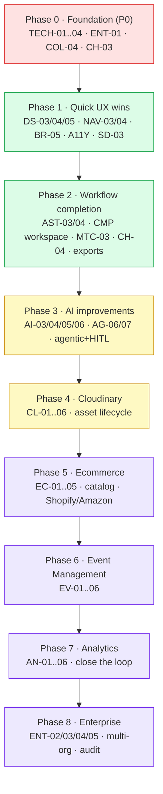
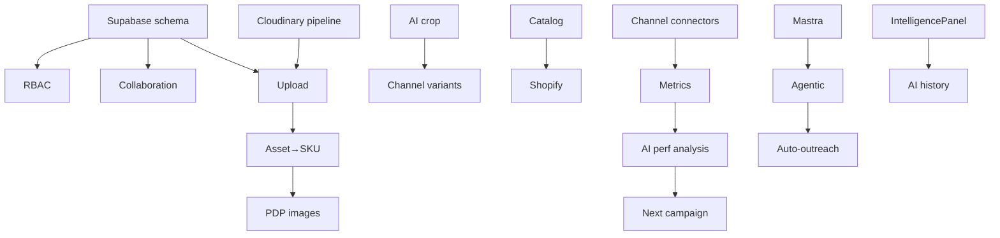

# FashionOS / iPix — Implementation Tasks & Roadmap

> Converts every approved improvement (`docs/design/improve.md` + reviewer additions) into actionable tasks. **Planning only — no prototype screens modified.**
> **This is the ENGINEERING master** (Supabase/RLS/OAuth/Edge Fns/Cloudinary/Mastra/CopilotKit/integrations). **Design-only docs** live in `docs/design/` — see `docs/design/README.md` (DESIGN-TOKENS · AI-UX · ANIMATIONS · ACCESSIBILITY) and `docs/handoff/` (screen/component/journey/state maps). Keep design and engineering separated.
> Companion: `docs/handoff/` (implementation spec), `checklist.md` (QA), `DESIGN.md`/`tokens.css`/`COMPONENTS.md` (design system). Reuse shared components — do not duplicate.

---

## 0. Progress Tracker — Summary

**Status:** ✅ done · 🟡 partial · 🔴 not started · ⚪ future. **Effort:** S(≤1d) · M(2–4d) · L(1–2w) · XL(>2w).

| Area | Tasks | ✅ | 🟡 | 🔴/⚪ | Lead priority | Belongs to |
|---|:--:|:--:|:--:|:--:|:--:|---|
| Design System (DS) | 6 | 2 | 2 | 2 | P1 | Design + Code |
| Navigation (NAV) | 4 | 3 | 1 | 0 | P2 | Design |
| AI Experience (AI) | 8 | 2 | 2 | 4 | P0–P2 | Code + Mastra |
| Brand Management (BR) | 5 | 2 | 1 | 2 | P1 | Code + Gemini |
| Shoot Planning (SH) | 5 | 3 | 1 | 1 | P1 | Design + Code |
| Shoot Detail (SD) | 5 | 2 | 1 | 2 | P2 | Code |
| Assets (AST) | 6 | 2 | 1 | 3 | P1 | Code + Cloudinary |
| Campaigns (CMP) | 5 | 1 | 1 | 3 | P2 | Code |
| Matching (MTC) | 4 | 2 | 0 | 2 | P2 | Code + Mastra |
| Channel Preview (CH) | 5 | 2 | 1 | 2 | P1 | Code + Integrations |
| Ecommerce / Catalog (EC) | 7 | 0 | 0 | 7 | P1–P3 | Backend + Integrations |
| Cloudinary (CL) | 6 | 0 | 1 | 5 | P1 | Cloudinary |
| Event Management (EV) | 6 | 0 | 0 | 6 | P3/⚪ | Backend |
| Analytics (AN) | 6 | 0 | 0 | 6 | P1–P2 | Backend + Gemini |
| Collaboration (COL) | 6 | 1 | 0 | 5 | P0–P1 | Supabase |
| Enterprise / RBAC (ENT) | 5 | 1 | 0 | 4 | P0 | Supabase + Backend |
| Dashboards (DSH) | 6 | 1 | 0 | 5 | P2 | Code |
| AI Agents (AG) | 7 | 3 | 2 | 2 | P1 | Mastra |
| Technical Architecture (TECH) | 6 | 0 | 1 | 5 | P0 | Code + Backend |
| Mobile (MOB) | 4 | 3 | 1 | 0 | P2 | Design |
| Accessibility (A11Y) | 4 | 0 | 1 | 3 | P1 | Design + Code |
| **Total** | **116** | **33** | **20** | **63** | — | — |

**Snapshot:** ~28% done (prototype interaction layer), ~17% partial, ~55% remaining (mostly production/backend/integration). **Prototype-design readiness: 92/100. Production readiness: 64/100.**

---

## 1. Audit Verification (improve.md recommendations → status)

| improve.md rec | Valid? | Status | Belongs | Note |
|---|:--:|:--:|:--:|---|
| RBAC + multi-user | ✅ | 🔴 | Prod | realtime/permission is a prototype stub only → ENT/COL |
| Connectors + scheduling | ✅ | 🔴 | Prod | Channel Preview publish is mocked → CH/EC |
| Build IntelligencePanel | ✅ | 🔴 | Prod | "not production-wired" everywhere → TECH/AI |
| Agentic AI + HITL | ✅ | 🔴 | Prod | AI advisory today → AI/AG |
| Exports (PDF/CSV/zip) | ✅ | 🔴 | Prod | call sheet/brief/assets → SD/AST |
| Notifications + Today + digest | ✅ | 🔴 | Prod | → COL/DSH/AI |
| Real upload + bulk + auto-tag | ✅ | 🟡 | Prod | toasts exist; no real upload → AST/CL |
| Campaign workspace | ✅ | 🔴 | Both | right-panel only → CMP |
| Matching outreach tracking | ✅ | 🟡 | Prod | shortlist done; tracking missing → MTC |
| DNA explainability + trend | ✅ | 🔴 | Both | → BR |
| Sort + saved views + search | ✅ | 🔴 | Both | search done on 2 screens → NAV/DS |
| Wizard mobile chrome | ✅ | 🟡 | Design | weakest mobile → MOB |
| Commerce assets→SKU | ✅ | ⚪ | Prod | → EC |
| On-set capture + perf loop | ✅ | ⚪ | Prod | → AN/EV |
| A11y hardening | ✅ | 🟡 | Both | tooltips added; full pass needed → A11Y |

**Reviewer additions accepted (valid, were under-covered):** Fashion lifecycle/Product catalog (EC), Ecommerce depth (EC), Event management (EV), Cloudinary domain (CL), per-Agent specs (AG), Technical architecture (TECH), Collaboration depth (COL), Dashboards (DSH), Analytics closed-loop (AN). **No invalid recommendations.** Duplicates removed: "global search" folded into NAV; "performance loop" split across AN + AI.

---

## 2. Priority Categorization

- **P0 — Critical / launch blockers:** ENT (RBAC), COL (multi-user core), TECH (IntelligencePanel + data layer), CH/EC connectors (publish must be real), AI-realtime trust.
- **P1 — High:** Cloudinary upload/transform (CL), Assets bulk + catalog hooks (AST/EC), Analytics loop start (AN), Brand DNA explainability (BR), A11y pass, Agent specs (AG), Dashboards core (DSH).
- **P2 — Medium:** Campaign workspace (CMP), Matching outreach (MTC), Shoot Detail exports (SD), saved views/search (NAV/DS), Wizard mobile (MOB).
- **P3 / Future:** Event management (EV), enterprise (SSO/audit/white-label), commerce advanced (variants/inventory/wholesale), agentic auto-pilot, NL ops.

---

## 3. Tasks by Feature Area

> Each task: **ID · Title · Purpose · User story · Current → Desired · Deps · Effort · Priority · Status.** Compact tables; expanded examples where useful.

### Design System (DS)
| ID | Title | Current → Desired | Deps | Eff | Pri | St |
|---|---|---|---|:--:|:--:|:--:|
| DS-01 | Tokens → Tailwind/CSS vars | `tokens.css` inline → token system | Design System | M | P1 | 🔴 |
| DS-02 | StatusChip variant set | full set present | — | — | — | ✅ |
| DS-03 | EmptyState reuse (N2) | inline search-empty → `EmptyState` DC | Design System | S | P2 | 🟡 |
| DS-04 | BottomSheet primitive (N4) | per-screen sheets → 1 primitive (3 detents, drag, focus trap) | Design System | M | P2 | 🟡 |
| DS-05 | Selectable + draggable card variants | cards static → bulk-select + drag-to-target | Design System | M | P1 | 🔴 |
| DS-06 | Card/chip docs (N1) | onOpen documented | — | — | — | ✅ |

### Navigation (NAV)
| NAV-01 | Mobile tab nav wired | dead → wired | — | — | — | ✅ |
| NAV-02 | Cross-screen + deep links | wired (`?id/?shoot/?brand`) | — | — | — | ✅ |
| NAV-03 | Breadcrumbs everywhere | Brand Detail only → all detail screens | Design | S | P2 | 🟡 |
| NAV-04 | Global cross-object search + saved views | per-screen search → command-palette + saved filters | Code, Supabase | L | P2 | 🔴 |

### AI Experience (AI) — see also AI Agents (AG)
| AI-01 | Contextual greetings | done (no generic) | — | — | — | ✅ |
| AI-02 | Streaming quick actions | done | — | — | — | ✅ |
| AI-03 | Agentic "do it" actions + HITL | advisory → act (auto-fix/plan/generate) gated by confidence | Mastra, CopilotKit | L | P1 | 🔴 |
| AI-04 | Per-object AI history/threads | none → traceable decisions | Supabase, CopilotKit | M | P1 | 🔴 |
| AI-05 | Confidence-gated automation | shown not used → auto-approve>X%, queue rest | Mastra | M | P2 | 🔴 |
| AI-06 | Evidence drill-down | light → every score → source | Mastra, RAG | M | P1 | 🟡 |
| AI-07 | Proactive AI daily digest | none → "what changed / needs you / I can do" | Mastra, Edge Fn | M | P2 | 🔴 |
| AI-08 | NL search & ops | none → "schedule Spring TikTok cuts Tuesday" | Mastra, MCP | XL | P3 | ⚪ |

### Brand Management (BR)
| BR-01 | Brand list + DNA | done | — | — | — | ✅ |
| BR-02 | Plan-a-Shoot handoff | done | — | — | — | ✅ |
| BR-03 | DNA per-pillar explainability | score → score+why+fix+evidence | Gemini, RAG | M | P1 | 🔴 |
| BR-04 | DNA history/trend | snapshot → trend over time | Supabase | M | P2 | 🔴 |
| BR-05 | Brand list sort + bulk + portfolio health | none → sort/bulk/health header | Code | M | P1 | 🟡 |

### Shoot Planning (SH — Wizard)
| SH-01 | 10-step AI planner | done | — | — | — | ✅ |
| SH-02 | Production Readiness scoring | done (live) | — | — | — | ✅ |
| SH-03 | Prefill + lock from params | done | — | — | — | ✅ |
| SH-04 | One-click "make production-ready" | partial (Fix all) → full auto-fix | Mastra, Gemini | M | P2 | 🟡 |
| SH-05 | Shoot templates + vendor/crew roster | none → reusable templates + booking | Supabase | L | P2 | 🔴 |

### Shoot Detail (SD)
| SD-01 | 9-tab workspace | done | — | — | — | ✅ |
| SD-02 | View-in-Assets deep link | done | — | — | — | ✅ |
| SD-03 | Call-sheet PDF export | toast → real PDF | Edge Fn | M | P2 | 🟡 |
| SD-04 | Capture checklist drives progress | static → live from uploads | Supabase, Cloudinary | M | P2 | 🔴 |
| SD-05 | Crew notifications/comms | none → notify on assign/changes | COL, Edge Fn | M | P2 | 🔴 |

### Assets (AST)
| AST-01 | Library + DNA-match + channel readiness panel | done | — | — | — | ✅ |
| AST-02 | Asset actions (use/replace/download/preview) | done (toasts) | — | — | — | ✅ |
| AST-03 | Real upload flow + progress + auto-DNA | spec-only → Cloudinary upload + post-DNA | Cloudinary, Mastra | L | P1 | 🔴 |
| AST-04 | Bulk select / tag / approve | none → multi-select bar | DS-05 | M | P1 | 🔴 |
| AST-05 | Rights/releases + usage metadata | none → license + usage tracking | Supabase | M | P2 | 🔴 |
| AST-06 | Asset → SKU / channel-ready crops | none → link assets to products + spec crops | EC, Cloudinary | L | P1 | 🟡 |

### Campaigns (CMP)
| CMP-01 | Card → right-panel detail | done | — | — | — | ✅ |
| CMP-02 | Standalone campaign workspace | panel only → full page (OperatorShell) | Code | L | P2 | 🔴 |
| CMP-03 | Budget / ROI | none → spend + return | Supabase, AN | M | P2 | 🟡 |
| CMP-04 | Content/post calendar | none → schedule per channel | CH, Supabase | L | P2 | 🔴 |
| CMP-05 | Matching → campaign outreach link | none → shortlist feeds campaign | MTC | M | P2 | 🔴 |

### Matching (MTC)
| MTC-01 | Swipe + table + shortlist drawer | done | — | — | — | ✅ |
| MTC-02 | Save/Invite + persistence | done | — | — | — | ✅ |
| MTC-03 | Outreach tracking (sent→opened→replied→booked) | none → pipeline | Supabase, Edge Fn | M | P2 | 🔴 |
| MTC-04 | AI auto-draft + send outreach | none → agentic DMs (HITL) | Mastra, AI-03 | L | P3 | 🔴 |

### Channel Preview (CH)
| CH-01 | Phone frames + readiness | done | — | — | — | ✅ |
| CH-02 | Publish confirm + select channels | done (mock) | — | — | — | ✅ |
| CH-03 | Real channel connectors (Meta/TikTok) | mock → OAuth + publish API | Integrations, Backend | XL | P0 | 🔴 |
| CH-04 | Scheduling + queue | none → date/time + queue | Supabase, Edge Fn | L | P1 | 🟡 |
| CH-05 | Per-channel caption/crop variants | single → variants + AI crop | Cloudinary, Mastra | M | P2 | 🔴 |

### Ecommerce / Product Catalog / Fashion Lifecycle (EC)
| EC-01 | Product catalog (products/SKUs/variants) | none → catalog model + UI | Backend, Supabase | XL | P1 | 🔴 |
| EC-02 | Collections + seasons | none → season planning | Backend | L | P2 | 🔴 |
| EC-03 | Asset → PDP image generation (spec crops) | none → PDP-ready sets | Cloudinary, AST-06 | L | P1 | 🔴 |
| EC-04 | Shopify sync (catalog + listings + A+) | none → 2-way sync | Integrations | XL | P1 | 🔴 |
| EC-05 | Amazon sync (listings + image specs) | none → catalog + A+ content | Integrations | XL | P2 | 🔴 |
| EC-06 | Inventory + pricing + merchandising | none → stock/price/merch | Backend | XL | P3 | ⚪ |
| EC-07 | Wholesale / linesheets | none → B2B linesheets | Backend | L | P3 | ⚪ |

### Cloudinary (CL)
| CL-01 | Upload + responsive delivery | prototype `` → Cloudinary pipeline | Cloudinary | M | P1 | 🟡 |
| CL-02 | AI cropping / smart transforms per channel | none → auto crop to channel specs | Cloudinary | M | P1 | 🔴 |
| CL-03 | Video (transcode, thumbnails, clips) | image-only → video assets | Cloudinary | L | P2 | 🔴 |
| CL-04 | Moderation + metadata + tagging | none → auto-moderate + tag (feeds DNA) | Cloudinary, Mastra | M | P1 | 🔴 |
| CL-05 | Versioning + asset lifecycle | none → versions + archive | Cloudinary, Supabase | M | P2 | 🔴 |
| CL-06 | Cloudinary review inside Assets panel (TASK-201) | none → tags/transforms/crops/versions in panel | CL-01..05, AST | M | P1 | 🔴 |

### Event Management (EV) — P3/Future
| EV-01 | Runway shows + schedule | none → show planning | Backend | L | P3 | ⚪ |
| EV-02 | Venue + seating + accreditation | none | Backend | L | P3 | ⚪ |
| EV-03 | Backstage / call order | none | Backend | M | P3 | ⚪ |
| EV-04 | Sponsors + media | none | Backend | M | P3 | ⚪ |
| EV-05 | Live production / streaming | none | Integrations | XL | ⚪ | ⚪ |
| EV-06 | Guest / RSVP | none | Backend | M | P3 | ⚪ |

### Analytics & Reporting (AN) — closes the AI loop
| AN-01 | Publish → metrics collection | ends at publish → ingest performance | CH-03, Backend | L | P1 | 🔴 |
| AN-02 | Performance dashboards | none → per-asset/campaign/channel | DSH, Supabase | L | P1 | 🔴 |
| AN-03 | AI analyzes performance → suggests | none → insight + recs | Mastra, Gemini | L | P2 | 🔴 |
| AN-04 | Generate next campaign from results | none → close loop | AI-03, CMP | L | P3 | ⚪ |
| AN-05 | DNA/shoot/asset KPIs + exports | none → CSV/PDF reports | Edge Fn | M | P2 | 🔴 |
| AN-06 | Attribution (asset → sale) | none → ROI per asset | EC, Backend | XL | P3 | ⚪ |

### Collaboration (COL)
| COL-01 | Realtime status pattern | prototype dots present | — | S | — | 🟡 |
| COL-02 | Comments + @mentions | none → threaded on objects | Supabase | L | P1 | 🔴 |
| COL-03 | Assignments + tasks | none → assign + due | Supabase | M | P1 | 🔴 |
| COL-04 | Notification center | toasts → inbox + push/email | Edge Fn | L | P0 | 🔴 |
| COL-05 | Activity timeline + audit history | Activity tab stub → full audit | Supabase | M | P1 | 🔴 |
| COL-06 | Version history | none → object versions | Supabase | M | P2 | 🔴 |

### Enterprise / Security / RBAC (ENT)
| ENT-01 | RBAC (viewer/operator/admin) + RLS | prototype stub → real roles + RLS | Supabase | L | P0 | 🟡 |
| ENT-02 | Multi-tenant / multi-org (agencies) | single-tenant → org switching | Backend, Supabase | XL | P1 | 🔴 |
| ENT-03 | SSO / SCIM | none | Backend | L | P3 | ⚪ |
| ENT-04 | Audit log + compliance | none → immutable log | Supabase | M | P1 | 🔴 |
| ENT-05 | White-label (agency) | none → theming per org | Design System | L | P3 | ⚪ |

### Dashboards (DSH) — role-specific
| DSH-01 | Command Center "Today" + AI digest | portfolio pulse → agenda + digest | AI-07 | M | P2 | 🟡 |
| DSH-02 | Executive dashboard (KPIs) | none → exec view | AN | L | P2 | 🔴 |
| DSH-03 | Production/ops dashboard | none → shoots/crew/budget | Code | M | P2 | 🔴 |
| DSH-04 | Marketing dashboard | none → campaigns/channels/perf | AN | M | P2 | 🔴 |
| DSH-05 | Ecommerce dashboard | none → catalog/inventory/sales | EC | L | P3 | 🔴 |
| DSH-06 | Designer/photographer dashboards | none → role views | Code | M | P3 | 🔴 |

### AI Agents (AG) — per-agent spec
| AG-01 | Brand Intelligence | exists (non-durable) | Mastra | — | — | ✅ |
| AG-02 | Production Planner | exists (durable) | Mastra | — | — | ✅ |
| AG-03 | Creative Director | exists (durable) | Mastra | — | — | ✅ |
| AG-04 | Matching/Social Discovery agent | exists (confirm routing) | Mastra | S | P1 | 🟡 |
| AG-05 | Visual Identity / Publishing agent | exists (confirm routing) | Mastra | S | P1 | 🟡 |
| AG-06 | Asset Intelligence agent (tagging/DNA/dedupe) | none → new agent | Mastra, Cloudinary | L | P1 | 🔴 |
| AG-07 | Ecommerce Assistant (catalog/listings) | none → new agent | Mastra, EC | L | P2 | 🔴 |

> **Per-agent spec template** (define for each AG-xx): purpose · inputs · outputs · tools · durability · approvals (HITL) · confidence/evidence · failure mode.

### Technical Architecture (TECH)
| TECH-01 | IntelligencePanel real build | stub → context→scores→approvals→tabs | Code, Supabase, CopilotKit | L | P0 | 🔴 |
| TECH-02 | Supabase schema + RLS | none → tables + policies | Supabase | L | P0 | 🔴 |
| TECH-03 | CopilotKit v2 runtime + per-route suggestions | prototype docks → real | CopilotKit | M | P0 | 🟡 |
| TECH-04 | Mastra agents + durable.ts config | partial → all routes + durability | Mastra | L | P0 | 🔴 |
| TECH-05 | Edge Functions (exports, notifications, ingest) | none → serverless jobs | Edge Fn | M | P1 | 🔴 |
| TECH-06 | RAG + vector search (evidence/NL search) | none → embeddings + retrieval | Vector DB, Gemini | L | P2 | 🔴 |

### Mobile (MOB) & Accessibility (A11Y)
| MOB-01 | Tab bar + More sheet + chat dock | done | — | — | — | ✅ |
| MOB-02 | Panel-as-sheet | done | — | — | — | ✅ |
| MOB-03 | Mobile images/states | done | — | — | — | ✅ |
| MOB-04 | Shoot Wizard mobile chrome | full-width → responsive shell + tab | Design | M | P2 | 🟡 |
| A11Y-01 | Labels + focus order audit | partial → full pass | Design | M | P1 | 🟡 |
| A11Y-02 | Live regions for streaming | partial → all docks | Code | S | P1 | 🔴 |
| A11Y-03 | Contrast + ≥44px + reduced-motion | partial → verified all | Design | M | P1 | 🔴 |
| A11Y-04 | Keyboard nav for drawers/modals/sheets | partial → trap + esc everywhere | Code | M | P1 | 🔴 |

---

## 4. Dependency Checklist (per task type)

| Capability | Used by |
|---|---|
| **Claude Design** | DS-*, NAV-03, MOB-04, A11Y-01/03 (specs) |
| **Claude Code / React** | nearly all UI tasks |
| **CopilotKit v2** | AI-03/04, TECH-03 |
| **Mastra** | AI-03/05/07, AG-*, TECH-04 |
| **Gemini** | BR-03, AN-03, AI-06, TECH-06 |
| **Supabase** | TECH-02, ENT-*, COL-*, EC-01/02, AN-* |
| **Cloudinary** | CL-*, AST-03/06, CH-05, EC-03 |
| **MCP** | AI-08, NL ops |
| **Playwright** | all (acceptance/regression tests) |
| **Edge Functions** | SD-03, COL-04, AN-01/05, AI-07 |
| **Backend / Integrations** | CH-03, EC-04/05, ENT-02, EV-* |
| **Vector / RAG** | TECH-06, AI-06/08 |

---

## 5. Implementation Phases

> **Phase 0 (foundation) is prerequisite** — TECH + RBAC + notifications + real connectors gate everything. The reviewer's 8-phase sequence is preserved (1 quick wins → 8 enterprise) on top of it.

## 6. Dependency graph (critical path)

---

## 7. User-Journey Dead-End Check (post-tasks)
| Journey | Dead end today? | Task to close |
|---|:--:|---|
| Onboarding → app | No (fixed) | — (add team invite: COL-03) |
| Brand → Detail | No | enrich: BR-03/04 |
| Brand → Shoot | No | — |
| Shoot plan → create → detail | No | — |
| Shoot → Assets | No | — |
| Assets → use/preview | No | upload: AST-03 |
| Campaigns | shallow (panel only) | CMP-02/04 |
| Matching → outreach | partial | MTC-03 |
| Channel Preview → publish | mock only | CH-03/04 |
| Publish → **performance** | **missing (loop open)** | AN-01..04 (critical) |

**Only true open loop:** Publish → metrics → AI → next campaign (Analytics). All UI dead-ends are closed.

---

## 8. Design Consistency Check
- ✅ All new screens build on **OperatorShell** + Zeely Editorial v3 tokens; **no new colours/fonts**.
- ✅ Reuse shared components (cards/StatusChip/ApprovalCard/EmptyState/BottomSheet); new variants (selectable/draggable) extend, not duplicate (DS-05).
- ✅ New surfaces (catalog, dashboards, analytics) follow card + hairline + image-first patterns; numbers in mono.
- ⚠️ Watch: dashboards/analytics introduce charts — define a **charting style** consistent with the token system before building (add to DESIGN.md).
- ⚠️ Event management is a large new domain — keep it modular; reuse shell + cards.

---

## 9. Final Report

- **Improvements reviewed:** all of `improve.md` (15 core) + 12 reviewer additions = 27 themes → **116 tasks**.
- **Already completed:** 33 (✅) — the prototype interaction layer (nav, search, wizard, assets panel, matching shortlist, channel select, breadcrumb, realtime-states pattern, agents that exist).
- **Remaining tasks:** 83 (20 partial + 63 not-started/future) — overwhelmingly production/backend/integration.
- **Duplicate tasks removed:** "global search" (→NAV-04), "performance loop" (→AN+AI), "permissions" merged ENT+COL.
- **Missing features discovered (reviewer, now planned):** Product catalog/lifecycle (EC), Cloudinary domain (CL), Event management (EV), Analytics loop (AN), per-agent specs (AG), Technical architecture (TECH), Collaboration depth (COL), role dashboards (DSH).
- **Risks:** scope explosion (ecommerce + events are products in themselves — consider phasing or partnering); AI agentic actions need strong HITL/audit to be safe; multi-tenant retrofit is costly if delayed; charting style undefined.
- **Blockers:** Phase 0 (Supabase schema, RBAC, real connectors, IntelligencePanel) blocks most of Phases 2–8.
- **Recommended order:** Phase 0 foundation → 1 quick wins → 2 workflow → 3 AI → 4 Cloudinary → 5 Ecommerce → 7 Analytics (pull earlier if revenue-driven) → 6 Events → 8 Enterprise.
- **Estimated effort (rough):** Phase 0 ~6–8 wks · P1 ~3–4 · P2 ~6–8 · P3 ~6–8 · P4 ~4 · P5 ~10–12 · P6 ~8 · P7 ~6 · P8 ~8. **Total ~14–18 months** for the full vision; **MVP (Phase 0–2) ~4–5 months.**

### Overall readiness
| Layer | Score /100 |
|---|---:|
| Prototype / design | 92 |
| Interaction completeness | 90 |
| Technical architecture | 58 |
| Integrations | 40 |
| Enterprise/collaboration | 45 |
| Analytics/loop | 25 |
| **Overall production readiness** | **64** |

**Bottom line:** the design + interaction layer is **A-grade (92)** and spec-complete; production readiness is **64/100**, gated by Phase 0 foundation (data, RBAC, connectors, IntelligencePanel) and the newly-planned domains (Cloudinary, ecommerce/catalog, analytics, collaboration). This plan sequences all 116 tasks from prototype to production with no UI dead-ends except the (now-planned) analytics loop.
