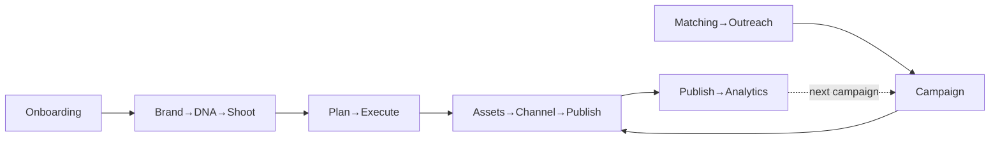

# Workflow Design Checklists

> Per-workflow design checklists (D-WF1–7). Complements per-screen specs (`../handoff/02-screen-map.md`) and journeys (`../handoff/04-user-journeys.md`). A workflow is "designed" when each step has states, AI, and a next action with no dead ends.

**Per-workflow checklist (apply to each):**
- [ ] Entry point(s) clear · [ ] each step has populated/loading/empty/error states · [ ] AI greeting names the step's object + next action · [ ] HITL where AI writes · [ ] no dead ends (always a next action) · [ ] confirmation on high-impact steps · [ ] mobile path · [ ] exit/back + unsaved-changes guard.

## D-WF1 · Onboarding → Activation
Signup → funnel (build/URL/goals) → analysis → DNA payoff → **Open FashionOS** → Command Center. *Design adds:* fast-track (URL→DNA→app), team-invite step. States: validation per screen, analysis progress, DNA ready.

## D-WF2 · Brand → DNA → Shoot
Brand List → Brand Detail (DNA + explainability) → **Plan a Shoot** (context carried) → Wizard. *Design adds:* per-pillar fix suggestions, product/sample picker. No re-entry of brand/campaign/season.

## D-WF3 · Shoot Planning → Execution
Shoots List → Wizard (10 steps, AI-prefilled) → Review (readiness scoring) → Confirm → Shoot Detail → run (9 tabs) → capture checklist → assets. *Design adds:* templates, call-sheet export, crew notifications, capture→progress.

## D-WF4 · Assets → Channel → Publish
Assets (select → AI analysis + channel readiness) → **Channel Preview** → publish (select channels → progress → success) → **Return to dashboard**. *Design adds:* upload flow, per-channel crop/caption variants, scheduling/queue.

## D-WF5 · Creator Matching → Outreach
Matching (swipe/table) → Save/Invite → **Shortlist** drawer → send invites → outreach tracking (sent→opened→replied→booked) → link to Campaign. *Design adds:* conversation/timeline, follow-ups.

## D-WF6 · Campaign Lifecycle
Campaign workspace (Overview · Calendar · Budget · Deliverables · Publishing) ← assets + matching feed in; → channel publishing; → performance. *Design split:* D-CM1a–e.

## D-WF7 · Publish → Analytics (close the loop)
Publish → collect metrics → AI analyzes performance → suggest improvements → generate next campaign. *Currently the only open loop* — design the analytics surface (gated on chart standards D-DS6/9) so the AI feedback loop closes.

## Workflow map

