# FashionOS / iPix — Product UX Review & Improvement Audit

> Pre-launch product review by Product Design · UX · Creative Direction · AI PM · Fashion-production · Workflow lenses. **Audit only — no screens modified.** Source: the canonical `*.v2.image-first.dc.html` prototypes + `DESIGN.md`, `PLAN.md`, `todo.md`, `checklist.md`, `MOBILE-PLAN.md`, `COMPONENTS.md`, Component Library.
> Companion: implementation detail in `docs/handoff/`; QA status in `checklist.md`.

---

## 1. Executive Summary

FashionOS is a **mature, coherent, AI-native operator workspace** with a distinctive, premium visual language (Zeely Editorial v3) and a genuinely image-first, AI-first posture that most "AI tools" only claim. Across this audit cycle every natural-path dead-end was closed, mobile navigation was repaired, and the deepest workflow (Shoot Wizard → Production Readiness) became truly interactive.

**What's strong:** visual consistency, the brand-DNA → shoot → assets → channel spine, contextual AI greetings everywhere, and HITL framing. **What holds it back from launch:** the product is still **single-operator and single-tenant in feel** — it lacks the *collaboration, integrations, and data-out* layers a real fashion team needs (e-commerce/social connectors, multi-user roles beyond a read-only stub, exports, notifications). The AI is contextual but **mostly advisory** — the next leap is letting it *act* (agentic automation) with HITL guardrails.

**Overall: 88/100 (A−).** Production-ready as a **design and interaction spec**; needs the integration + collaboration + agentic layers before it's a launchable product.

**Top 5 moves before launch:** (1) real RBAC + multi-user, (2) e-commerce/social channel integrations (Shopify/Meta/TikTok/Amazon), (3) agentic AI actions with HITL, (4) notifications + activity/audit, (5) exports (PDF call sheets, CSV, asset bundles).

---

## 2. Screen-by-Screen Review

Scoring per section, 0–100. Sections: **Purp**ose · **Hier**archy (info+visual) · **Nav** · **AI** · **Flow** (workflow) · **Content** · **States** (empty/error) · **Mob**ile · **A11y** · **Prod**uction readiness.

### 1. Command Center — overall **90**
| Purp | Hier | Nav | AI | Flow | Content | States | Mob | A11y | Prod |
|--:|--:|--:|--:|--:|--:|--:|--:|--:|--:|
| 95 | 90 | 95 | 88 | 88 | 88 | 92 | 90 | 82 | 80 |
- **First impression:** calm, oriented; the realtime status strip + approvals read as "command." **Strong.**
- **Improve:** the SIMULATE control for realtime is a demo affordance — hide behind a debug flag in prod. Home should surface a **"today" agenda** (shoots this week, approvals due, assets pending) not just portfolio pulse. Quick stats could deep-link.

### 2. Brand List — overall **88**
| 90 | 88 | 92 | 86 | 86 | 86 | 90 | 90 | 82 | 80 |
- Search + filters + per-card analysing are solid. **Improve:** add **sort** (DNA score, last active), bulk actions (analyse all, tag), and a portfolio-health summary header. Empty state is good; add a **sample/seed brand** for first-run.

### 3. Brand Detail — overall **88**
| 92 | 90 | 90 | 88 | 86 | 86 | 92 | 86 | 80 | 78 |
- DNA pillars + analysing/error/retry are best-in-class for the non-durable agent constraint. **Improve:** make pillar rows **explainable** (click → why this score + evidence + fix suggestions). Add **DNA history/trend** (is the brand improving?). The right IntelligencePanel is a target stub — highest-value production build.

### 4. Shoots List — overall **89**
| 90 | 88 | 92 | 86 | 88 | 86 | 90 | 92 | 82 | 80 |
- Open/New/search/filter all work. **Improve:** add **calendar/timeline view** (shoots are date-driven), status-grouped lanes (Draft → In Production → Complete), and a budget/cost roll-up.

### 5. Shoot Detail — overall **90**
| 94 | 90 | 90 | 88 | 90 | 86 | 88 | 88 | 80 | 80 |
- 9 tabs + insights + View-in-Assets is genuinely usable by a production manager. **Improve:** Activity/Deliverables tabs are thinner than others; add **call-sheet export (PDF)**, crew **notifications**, and a **shot-by-shot capture checklist** that drives the progress ring live.

### 6. Shoot Wizard — overall **91**
| 95 | 90 | 88 | 92 | 92 | 88 | 86 | 78 | 80 | 80 |
- The AI-first planner + Production Readiness dashboard is the product's showcase. Live scoring, moodboard lock/regen, exports-as-toast, confirm + exit guard. **Improve:** **mobile chrome** (full-width, no tab bar — weakest mobile screen, 78). Let the AI **auto-fix** more (one-click "make production-ready"). Brief/shot fields are display-led — allow richer inline edit.

### 7. Campaigns — overall **84**
| 86 | 84 | 86 | 84 | 82 | 84 | 86 | 88 | 80 | 76 |
- Card → right-panel detail works. **Improve:** thin vs the other screens — no standalone campaign workspace, no **budget/ROI**, no **channel/post calendar**, no link to Matching outreach. This is the biggest depth gap.

### 8. Assets — overall **89**
| 92 | 90 | 88 | 90 | 88 | 86 | 90 | 90 | 80 | 80 |
- Right panel now carries AI analysis + channel readiness + real actions — excellent. **Improve:** real **upload** flow (currently spec-only), **bulk** select/tag/approve, and EXIF/usage-rights metadata (licensing matters in fashion).

### 9. Matching — overall **88**
| 90 | 88 | 88 | 90 | 88 | 86 | 88 | 88 | 80 | 76 |
- Swipe + table + shortlist drawer (Remove/Send invites) is a complete loop. **Improve:** **outreach tracking** (sent → opened → replied → booked), audience-overlap math made transparent, and brand-safety flags surfaced as evidence.

### 10. Channel Preview — overall **87**
| 90 | 88 | 86 | 86 | 88 | 84 | 88 | 86 | 78 | 74 |
- Native phone frames + per-channel publish select is convincing. **Improve:** publish is **mocked** — needs real connectors + **scheduling** (date/time, queue) and post-publish **performance** loop. Add per-channel caption variants.

### 11. Onboarding — overall **86**
| 90 | 86 | 84 | 84 | 88 | 88 | 84 | 90 | 78 | 76 |
- Strong Zeely-style funnel with social proof + DNA payoff. **Improve:** 13 screens is long — allow **fast-track** (URL → DNA → app in 3 steps). Make the analysis screen feel earned (show real crawl artifacts). Add **team invite** at the end.

**Lowest sub-scores across the board:** Accessibility (78–82) and Production readiness (74–80) — the two consistent gaps. Mobile dips only on Wizard (78).

---

## 3. Feature Review

| Feature | Useful? | Missing | Obvious? | Simplify? | AI can improve | Better workflow |
|---|---|---|---|---|---|---|
| Brand DNA | ✅ core | history/trend, per-pillar fix | ✅ | — | auto-fix suggestions w/ evidence | DNA → auto shoot brief |
| Shoot Wizard | ✅ | richer inline edit, mobile | mostly | one-click make-ready | agentic auto-fill + auto-fix | template shoots |
| Assets | ✅ | upload, bulk, rights | ✅ | — | auto-tag, auto-DNA, dedupe | drag to campaign/shoot |
| Campaigns | 🟡 thin | workspace, budget, calendar | 🟡 | — | content-plan generation | Matching → campaign brief |
| Matching | ✅ | outreach tracking | ✅ | — | auto-draft outreach DMs | shortlist → campaign |
| Channel Preview | ✅ | real publish, scheduling | ✅ | — | per-channel caption/crop variants | preview → schedule queue |
| HITL approvals | ✅ | bulk approve, audit log | ✅ | — | confidence-gated auto-approve | inbox of approvals |
| Realtime/permissions | 🟡 prototype | real RBAC, presence | 🟡 | — | — | presence + comments |

---

## 4. Workflow Review (friction · gaps · automation)

| Workflow | Unnecessary | Missing | Bottleneck/Friction | Dead end | Automation opportunity |
|---|---|---|---|---|---|
| Onboarding | 13 steps (long) | team invite, fast-track | analysis wait | — (fixed) | auto-DNA from URL only |
| Brand analysis | — | trend, per-pillar fix | non-durable retry | — (fixed) | scheduled re-analysis |
| Brand → Shoot | — | product/sample picker | — | — (fixed) | full auto-brief from DNA |
| Shoot planning | — | templates, vendor book | manual crew assign | — | auto-crew from roster |
| Shoot review | — | capture checklist, export | thin Activity tab | — | auto-progress from uploads |
| Assets | — | upload, bulk, rights | no bulk ops | — (fixed) | auto-tag + auto-DNA on upload |
| Campaigns | — | workspace, budget, calendar | shallow detail | card → panel only | content-plan + post calendar |
| Matching | — | outreach tracking | manual invites | — (fixed) | auto-draft + send outreach |
| Channel Preview | — | scheduling, connectors | mocked publish | — (fixed) | auto-crop variants + queue |
| Publishing | — | performance loop | no real channels | — | optimize-by-result |

**Cross-cutting friction:** no **notifications**, no **search across objects**, no **exports**, no **comments/@mentions** — these compound across every workflow.

---

## 5. Component Review

| Component | Reusable | Too complex | Missing variants/states | Consistent | Scalable | Recommendation |
|---|:--:|:--:|---|:--:|:--:|---|
| OperatorShell | ✅ | no | back/breadcrumb slot | ✅ | ✅ | add breadcrumb + presence slot |
| NavSidebar | ✅ | no | unread badges | ✅ | ✅ | wire badges to real counts |
| IntelligencePanel | 🟡 | no | real context/approvals | ✅ | 🟡 | **build for real** (top priority) |
| PersistentChatDock | ✅ | no | agentic action surface | ✅ | ✅ | add "do it" actions + history |
| BottomNavigation | ✅ | no | badges | ✅ | ✅ | add unread dots |
| BottomSheet | 🟡 | per-screen | single primitive (N4) | 🟡 | 🟡 | extract one primitive (3 detents) |
| BrandCard/ShootCard/CampaignCard/AssetCard | ✅ | no | bulk-select, drag | ✅ | ✅ | add selectable + draggable variants |
| ApprovalCard | ✅ | no | bulk, audit | ✅ | ✅ | add compact inbox variant |
| StatusChip | ✅ | no | complete ✅ | ✅ | ✅ | done (full set) |
| AgentStatusIndicator | ✅ | no | formal states (N5) | 🟡 | ✅ | formalise idle/thinking/streaming/awaiting |
| EmptyState | ✅ | no | reuse for search-empty (N2) | 🟡 | ✅ | route inline empties through it |
| SkeletonLoader/FilterBar/SearchBar/PageHeader/WizardStep | ✅ | no | — | ✅ | ✅ | fine |

**System verdict:** consistent and reusable; the gaps are **selection/drag affordances** (for bulk + cross-object moves), **badges/presence** (collaboration), and finishing the **IntelligencePanel** + **BottomSheet** primitive.

---

## 6. AI Review

**Strong:** every dock greeting is contextual and names the active object (zero "How can I help?"); quick actions stream live steps; HITL has confidence + evidence + before/after; Brand Detail has honest error/retry; the Wizard's live Production Readiness scoring is a standout.

**Gaps / opportunities:**
- **Advisory, not agentic.** AI suggests but rarely *acts*. Add **"do it" actions** (with HITL): auto-fix DNA, auto-assign crew, auto-generate content pack, auto-draft outreach, auto-crop for channels.
- **No memory/threads.** Add per-object **AI history** so decisions are traceable (ties to audit log).
- **Confidence is shown but not *used*.** Add **confidence-gated automation** (auto-approve > X%, queue the rest).
- **Evidence is light.** Make every score/claim **drill-downable** to source (which pages/images/posts).
- **No proactive AI.** A daily **"AI digest"** (what changed, what needs you, what I can do) on Command Center.
- **Cross-object reasoning.** "These 6 creators + this campaign + these 12 assets = a ready content plan" — connect Matching ↔ Campaigns ↔ Assets.

**Additional AI features to add:** agentic content-pack generation, auto-retouch/upscale flags, brand-safety screening with evidence, performance-driven re-optimization (publish → learn → suggest), and natural-language search ("show Nike assets below 70% used in Q1").

---

## 7. Content Review

| Area | Issue | Suggestion |
|---|---|---|
| Headings | Good, consistent | keep; add object names ("Nike — Brand DNA") |
| Buttons | Mostly clear | "Use in shoot/campaign" → confirm target ("Add to…") |
| Helper text | Sparse | add 1-line "what this does" under AI scores |
| AI messages | Strong, contextual | keep; tighten to ≤2 sentences; always end with a CTA |
| Onboarding copy | Persuasive | trim to fast-track; "Results may vary" is good honesty |
| Tooltips | New (voice/account) | extend to all icon-only buttons |
| Empty states | Good | always pair with the primary next action (already mostly) |
| Error states | Good (Retry/Report/Go back) | add a one-line cause when known |

**Principle:** every AI message = *object + finding + next action*, ≤2 sentences. Every empty state = *what's here + how to fill it*. Every score = *value + why + how to improve*.

---

## 8. Fashion Workflow Review (real-world fit)

| Role / channel | Supported today | Gap |
|---|---|---|
| **Brand / marketing** | ✅ DNA, campaigns, channel preview | budget/ROI, content calendar |
| **Production manager** | ✅ Shoot Detail (9 tabs), wizard | call-sheet export, vendor booking, comms |
| **Photographer / videographer** | 🟡 shot list, capture | on-set capture app, tethered upload, frame review |
| **Stylist** | 🟡 moodboard, shot list | wardrobe/sample tracking, pull sheets |
| **Model / talent** | 🟡 Matching | talent profiles, availability, releases/rights |
| **Agency** | 🟡 | multi-brand/client switching, white-label, approvals across orgs |
| **Retailer / ecommerce** | 🔴 | product catalog, PDP-ready crops, asset → SKU |
| **Amazon / Shopify** | 🔴 | catalog sync, listing image specs, A+ content |
| **Meta / TikTok** | 🟡 preview only | real publish, scheduling, ads, performance |

**Verdict:** strong on **brand + production**, thin on **commerce + talent-ops + multi-org**. To serve real fashion teams it needs **product/catalog awareness** (assets → SKUs → channels), **rights/releases**, and **real channel + commerce connectors**.

---

## 9. Missing Features

### Quick Wins (small, high impact)
- Sort + bulk actions on list screens (brands/shoots/assets).
- Export: call sheet PDF, asset CSV/zip, brief PDF.
- Notifications/toasts → a **notification center** (approvals due, shoot today).
- Per-pillar DNA explanation (click a score → why + fix).
- Command Center "Today" agenda + AI daily digest.
- Tooltips on all icon-only buttons; one-line cause on errors.

### Medium Improvements (productivity)
- Real **upload** flow (Assets/Onboarding) with progress + auto-DNA.
- **Campaign workspace** (budget, content calendar, posts, link to Matching).
- **Outreach tracking** in Matching (sent→opened→replied→booked).
- **Scheduling** in Channel Preview (queue + date/time) + real connectors.
- **RBAC + multi-user** (presence, comments/@mentions, audit log).
- Global cross-object **search** + saved views.
- Shoot **templates** + vendor/crew roster booking.

### Advanced Ideas (future AI / automation)
- **Agentic actions** with HITL: auto-fix DNA, auto-plan shoot, auto-generate content pack, auto-draft + send outreach, auto-crop per channel.
- **Confidence-gated automation** (auto-approve high-confidence, queue rest).
- **Performance loop**: publish → measure → AI re-optimizes crops/captions/creators.
- **Commerce sync**: assets → SKUs → Shopify/Amazon listings with spec-correct crops.
- **On-set capture app** (tethered, live frame review, auto-progress).
- **Natural-language search & ops** ("schedule the Spring TikTok cuts for next Tuesday").
- **Brand-safety + rights screening** with evidence trails.

---

## 10. Prioritized Recommendations

Priority · Impact · Effort · User value · Business value.

| # | Recommendation | Pri | Impact | Effort | User | Biz |
|---|---|:--:|:--:|:--:|:--:|:--:|
| 1 | Real RBAC + multi-user (presence, comments, audit) | 🔴 | High | High | High | High |
| 2 | E-commerce/social connectors + scheduling (Shopify/Meta/TikTok/Amazon) | 🔴 | High | High | High | High |
| 3 | Build IntelligencePanel for real (context→scores→approvals→tabs) | 🔴 | High | Med | High | High |
| 4 | Agentic AI "do it" actions with HITL | 🟡 | High | High | High | High |
| 5 | Exports (call sheet PDF, asset CSV/zip, brief PDF) | 🟡 | Med | Low | High | Med |
| 6 | Notification center + Command Center "Today" + AI digest | 🟡 | Med | Med | High | Med |
| 7 | Real upload + bulk ops + auto-tag/DNA (Assets) | 🟡 | Med | Med | High | Med |
| 8 | Campaign workspace (budget, calendar, posts) | 🟡 | Med | Med | High | High |
| 9 | Matching outreach tracking | 🟢 | Med | Med | Med | High |
| 10 | Per-pillar DNA explainability + trend | 🟢 | Med | Low | High | Med |
| 11 | Sort + saved views + global search | 🟢 | Med | Med | High | Med |
| 12 | Shoot Wizard mobile chrome | 🟢 | Low | Low | Med | Low |
| 13 | Commerce: assets → SKUs → listings | ⚪ | High | High | High | High |
| 14 | On-set capture app + performance loop | ⚪ | High | High | High | High |
| 15 | Accessibility hardening pass (all screens) | 🟡 | Med | Med | High | Med |

---

## 11. Final Scorecard

| Category | Score /100 |
|---|---:|
| UX | 88 |
| UI | 93 |
| Navigation | 95 |
| User Journeys | 92 |
| AI Experience | 87 |
| Components | 88 |
| Content | 86 |
| Mobile | 88 |
| Accessibility | 80 |
| Production Readiness | 82 |
| **Overall** | **88** |

**Read:** world-class **UI/navigation**; strong **journeys/components**; the deltas are **Accessibility (80)**, **Production readiness (82)**, **Content (86)**, **AI (87 — advisory not agentic)**. None are visual-design problems; they're **depth, integration, collaboration, and a11y** gaps.

---

## 12. Roadmap

```mermaid
flowchart LR
  subgraph Now["Now · launch-blocking"]
    A[RBAC + multi-user]:::r
    B[Connectors + scheduling]:::r
    C[IntelligencePanel real]:::r
  end
  subgraph Next["Next · productivity"]
    D[Agentic AI + HITL]:::y
    E[Exports + notifications]:::y
    F[Upload/bulk + Campaign workspace]:::y
    G[A11y hardening]:::y
  end
  subgraph Later["Later · differentiation"]
    H[Commerce sync assets→SKU]:::w
    I[Performance loop]:::w
    J[On-set capture app]:::w
    K[NL search & ops]:::w
  end
  Now --> Next --> Later
  classDef r fill:#fee2e2,stroke:#dc2626;
  classDef y fill:#fef9c3,stroke:#ca8a04;
  classDef w fill:#ede9fe,stroke:#7c3aed;
```

- **Now (pre-launch):** the three 🔴 — without RBAC, connectors, and a real IntelligencePanel it's a demo, not a product.
- **Next (post-launch v1.1):** agentic AI, exports, notifications, upload/bulk, campaign depth, a11y.
- **Later (differentiation):** commerce sync, performance-driven optimization, on-set capture, natural-language ops — these make it category-defining for fashion.

**Bottom line:** the design and interaction layer is **A-grade and launch-ready as a spec**; the product layer needs **collaboration + integrations + agentic AI** to be a real, sellable fashion-production platform.
