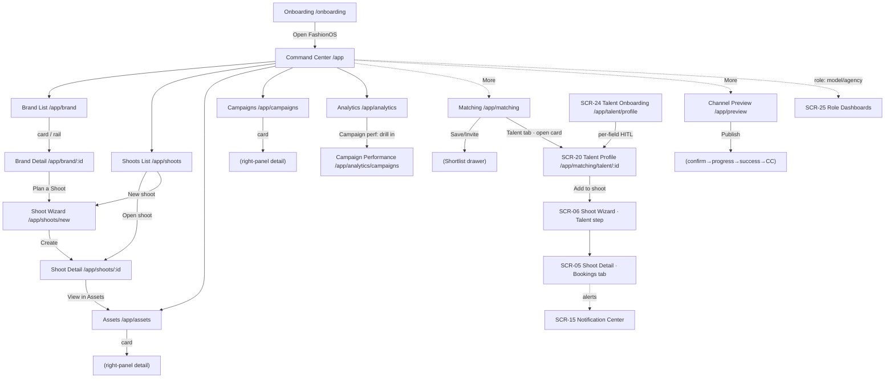

# 02 — Screen Map

> Every screen with route, agent, entries/exits, components, states, priority. Components → [03](03-component-map.md). Journeys → [04](04-user-journeys.md). Routes → [07](07-navigation-map.md).

## Navigation diagram

## Agent routing (`route-agent-map.ts`; DEFAULT = production-planner)
`/app`→production-planner · `/app/brand[/id]`→brand-intelligence · `/app/shoots[/*]`→production-planner · `/app/campaigns`→creative-director · `/app/assets`→creative-director (visual-identity in spec) · `/app/matching`→social-discovery · `/app/preview`→visual-identity · `/onboarding`→brand-intelligence. (`visual-identity` + `social-discovery` are registered in Mastra but routing varies — confirm in `route-agent-map.ts`.)

---

## 1. Command Center — `/app`
- **Purpose:** operator home; portfolio pulse, approvals, quick actions, system status.
- **User:** operator/admin. **Agent:** production-planner (durable).
- **Entry:** Onboarding finish; any nav "Home". **Exit:** nav to Brand List/Shoots/Assets/Campaigns; brand row → Brand Detail.
- **Related:** all. **Components:** OperatorShell, NavSidebar, IntelligencePanel, PersistentChatDock, ApprovalCard, BrandCard rows, BottomNavigation, BottomSheet.
- **States:** populated · loading · empty · error · approval-pending · **realtime status** (live/reconnecting/stale/blocked w/ Refresh/Request-access).
- **Mobile:** tab bar + More sheet + chat dock. **Priority:** P1 (first screen).

## 2. Brand List — `/app/brand`
- **Purpose:** brand portfolio grid + DNA scores. **Agent:** brand-intelligence (NOT durable).
- **Entry:** nav "Brands"; CC. **Exit:** card/rail/"Fix now" → Brand Detail (`?id=`); New brand.
- **Components:** OperatorShell, BrandCard (has-data/no-data/analysing), SearchBar, FilterBar, IntelligencePanel, ChatDock, EmptyState, SkeletonLoader.
- **States:** populated · loading · empty · error · analysing (per-card crawl). Functional search (name/brand/status) + "No matches".
- **Mobile:** tabs + sheet. **Priority:** P1.

## 3. Brand Detail — `/app/brand/[id]`
- **Purpose:** one brand's DNA, assets, approvals; launch a shoot. **Agent:** brand-intelligence (NOT durable → error+retry, no resumable stream).
- **Entry:** Brand List/CC (`?id=`). **Exit:** breadcrumb → Brand List; **Plan a Shoot** → Shoot Wizard (`?brand&campaign&season`); Assets/approvals.
- **Components:** OperatorShell, AssetCard (tile), ApprovalCard, StatusChip, DNA pillars, **EvidenceBlock** (per-pillar → modal), ChatDock.
- **States:** populated(loaded) · loading · **analysing** (determinate "n/47") · **error** (Retry · Report · Go back) · no-data (run analysis) · approval.
- **Mobile:** tabs + sheet. **Priority:** P1.

## 4. Shoots List — `/app/shoots`
- **Purpose:** all shoots grid. **Agent:** production-planner.
- **Entry:** nav "Shoots"; CC. **Exit:** Open shoot → Shoot Detail (`?id=`); **New shoot** → Shoot Wizard.
- **Components:** OperatorShell, ShootCard, SearchBar, FilterBar, IntelligencePanel, ChatDock.
- **States:** populated · selected · loading · empty · error. Search (name/brand/status) + filter chips combine.
- **Priority:** P1.

## 5. Shoot Detail — `/app/shoots/[id]`
- **Purpose:** single-shoot production workspace. **Agent:** production-planner.
- **Entry:** Shoots List Open; Wizard Create (redirect). **Exit:** breadcrumb; **View in Assets** → Assets (`?shoot=&name=`); Edit shoot.
- **Components:** OperatorShell, **9 tabs** (Overview · Shot List · Assets · Team · Schedule · Budget · Approvals · Deliverables · Activity), AssetCard (tile+masonry), ApprovalCard (compact), StatusChip (bare), insights panel, ChatDock.
- **States:** populated · loading · empty · error · approval; resolves `?id=` (s1–s8). Edit-shoot modal.
- **Priority:** P2.

## 6. Shoot Wizard — `/app/shoots/new`
- **Purpose:** AI-first 10-step Production Planner (not a form). **Agent:** production-planner.
- **Entry:** Shoots New; Brand Detail Plan-a-Shoot (`?brand&campaign&season` → hydrate + lock Step 2). **Exit:** Create → Shoot Detail; Back-to-Shoots (exit guard if dirty).
- **Steps:** Welcome · Basics · Brief · Moodboard · Shot list · Production · Budget · Timeline · Call sheet · **Review (Production Readiness Dashboard)**.
- **Components:** WizardStep shell, PersistentChatDock inline, modals (brief/shot/confirm/exit), toasts.
- **States:** per-step; live scoring on Review; persistent menu + Save draft + unsaved-exit guard.
- **Priority:** P2.

## 7. Campaigns — `/app/campaigns`
- **Purpose:** campaigns grid + deliverables. **Agent:** creative-director (durable).
- **Entry:** nav/More. **Exit:** card → right-panel detail (cover · deliverables · timeline); mobile sheet.
- **Components:** OperatorShell, CampaignCard (**D-DS5 selectable + draggable**), SearchBar, FilterBar, IntelligencePanel, **EvidenceBlock** (“Explain campaign health” → modal), bulk-action bar + drop dock (Duplicate/Archive), ChatDock, toast.
- **States:** populated · selected · loading · empty · error. **Priority:** P2.

## 8. Assets — `/app/assets`
- **Purpose:** asset library, DNA-match, channel readiness. **Agent:** creative-director (visual-identity in spec).
- **Entry:** nav/More; Shoot Detail (`?shoot=&name=` → filter chip). **Exit:** card → right-panel detail (preview · DNA-match · **AI analysis** · **channel readiness** · used-in · quick actions: Use in shoot/campaign · Replace · Download · **Channel Preview**).
- **Components:** OperatorShell, AssetCard (masonry+tile, **D-DS5 selectable + draggable**), FilterBar (type/DNA/search), view toggle (grid/table), Select toggle + bulk-action bar + drop dock (Shoot/Campaign), upload modal, **EvidenceBlock** (“Explain DNA match” → modal), IntelligencePanel, ChatDock, toast.
- **States:** populated · selected · loading · empty · error; `?shoot=` filter. **Priority:** P2.

## 9. Matching — `/app/matching`
- **Purpose:** creator/audience discovery. **Agent:** social-discovery.
- **Entry:** nav/More. **Exit:** Save/Invite → toast + **Shortlist (n) drawer** (Remove · Send invites).
- **Components:** OperatorShell, swipe-card deck + data table, StatusChip (bare), IntelligencePanel, ChatDock, drawer, toast.
- **States:** swipe · table · loading · empty · error. **Components:** swipe deck + data table (**D-DS5 row selection + bulk bar** in table), creator detail panel, **EvidenceBlock** (“Explain fit score” → modal), shortlist drawer, ChatDock, toast. **Priority:** P3.

## 10. Channel Preview — `/app/preview`
- **Purpose:** render an asset across channels; publish. **Agent:** visual-identity.
- **Entry:** nav/More; Assets "Channel Preview". **Exit:** **Publish** → confirm (per-channel select) → publishing (per-channel ticks) → success → **Return to dashboard** (Command Center).
- **Components:** OperatorShell, phone frames (FB/IG feed/IG story/TikTok), safe-zone toggle, image/video toggle, channel-readiness checks, **EvidenceBlock** (“Explain readiness” → modal), publish modal, ChatDock.
- **States:** frames · loading · empty (pick asset) · error · **publish: confirm/publishing/success**. **Priority:** P3.

## 11. Onboarding — `/onboarding`
- **Purpose:** 13-screen Zeely funnel → Brand DNA → app. **Agent:** brand-intelligence.
- **Entry:** signup. **Exit:** "Open FashionOS" → Command Center.
- **Components:** standalone (no OperatorShell); progress segments, review dock, social-proof tiles, DNA payoff.
- **States:** per-screen validation; analysis progress (screen 12) → DNA ready (13). **Priority:** P1 (entry funnel).

## 12. Analytics Overview — `/app/analytics`
- **Purpose:** portfolio performance — KPIs, DNA trend, approval rate, campaign/asset comparisons, AI insights. **Agent:** analytics-intelligence.
- **Entry:** nav "Analytics". **Exit:** Campaign performance card → **Campaign Performance** drill-down; Empty → Campaigns.
- **Components:** OperatorShell, FilterBar (date range), 6 **KPI cards** (D-DS11) + **charts** (trend/ring/bars per `PATTERNS.md#charts`), **EvidenceBlock** (every metric/insight → modal), IntelligencePanel, ChatDock, toast.
- **States:** populated · loading · empty · error. **Priority:** P2 (built).

## 13. Campaign Performance — `/app/analytics/campaigns`
- **Purpose:** per-campaign drill-down — bar-to-detail ranking → KPIs, engagement trend, top assets, AI insights. **Agent:** analytics-intelligence.
- **Entry:** Analytics "Campaign performance" card (row → `?c=<id>` preselect). **Exit:** breadcrumb → Analytics; Empty → Campaigns.
- **Components:** OperatorShell, campaign ranking bars (selectable), 6 per-campaign **KPI cards** (CPE inverted colour), trend + top-assets charts, **EvidenceBlock** (per campaign + per metric, incl. launch-readiness), IntelligencePanel, ChatDock, toast.
- **States:** populated · loading · empty · error. **Priority:** P2 (built).

---

## Model Booking (folded into the Shoot lifecycle — 2026-07-03; see `docs/models/00-model-booking-plan.md` §0.0)

> ⛔ **OVERRIDDEN 2026-07-03 by `docs/models/02-engineering-reference.md` (D1–D9).** The fold-in below is superseded: **SCR-21 Booking Wizard** (`/app/matching/talent/:id/book`) + **SCR-22 Booking Detail** (`/app/bookings/:id`) are **real standalone screens**; there are **two agents** (`model-match` built + `booking` spec); **Contracts are deferred**; Shoot integration = `shoot_crew` upsert on confirm + inline crew-row accordion only; status FSM = `requested→quoted→approved→confirmed`. See registry override + plan §0.-1. The entries in this section are retained for history.

> **REVISED:** booking is **not** separate screens. It extends the built **Shoot Wizard (SCR-06)** + **Shoot Detail (SCR-05)**. Standalone ~~SCR-21 Booking Wizard~~, ~~SCR-22 Booking Detail~~, ~~SCR-23 Availability~~ are **REMOVED — folded** (see below). Talent discovery stays in **SCR-09 Matching** (Talent 4th tab + Shortlist). Talent Profile (SCR-20) + Talent Onboarding (SCR-24) stay separate. Booking alerts route to **SCR-15 Notification Center**. Driven by **`production-planner`** (booking agent dropped); **`model-match`** remains for discovery. AI-filled booking fields use **`FieldReview`** (per-field HITL); offers use **ApprovalCard**.

## SCR-06 (extended). Shoot Wizard — `/app/shoots/new`
- **Add 4 steps** into the existing 10 (Welcome·Basics·Brief·Moodboard·Shot list·Production·Budget·Timeline·Call sheet·Review): **Talent** (cast from Matching shortlist / Talent Profile) · **Availability** (reconcile talent dates vs shoot) · **Booking** (rate + offer, AI-drafted → **FieldReview** HITL) · **Contracts** (MVP agreement summary + e-sign stub).
- **Proposed order:** Welcome · Basics · Brief · Moodboard · Shot list · **Talent** · **Availability** · Production · Budget · **Booking** · Timeline · Call sheet · **Contracts** · Review.
- **Tasks:** D-MB1–4. **Priority:** P1 (Talent/Availability/Booking), P2 (Contracts).

## SCR-05 (extended). Shoot Detail — `/app/shoots/[id]`
- ✅ **Booking Detail (SCR-22) is built as this screen's `booking` flow** — `?flow=booking&talent=<id>` → talent hero + status stepper (requested→quoted→approved→confirmed) + rate/quote + EvidenceBlock + **operator-only** actions + expiry + Talent/Activity tabs. File: `Pages/Shoot Detail.v2.image-first.dc.html`. Reuses shell/hero/tabs/chat/panel; shoot flow unchanged.
- **Add 3 tabs** to the existing 8 (Overview·Shot List·Team·Schedule·Budget·Approvals·Deliverables·Activity): **Talent** (booked models + status) · **Bookings** (offers/confirmations, **ApprovalCard**-gated) · **Contracts** (agreement status).
- **Reuse as-is:** Approvals · Deliverables · Activity · Schedule · Team & crew · Call Sheet (booked talent auto-populates Call Sheet + Schedule).
- **Booking status model:** `draft → offered → confirmed → completed` (shared with the Wizard Booking step). **Tasks:** D-MB5–7. **Priority:** P1 (Talent/Bookings), P2 (Contracts).

## SCR-20. Talent Profile — `/app/matching/talent/[id]` (built)
- **Purpose:** bookable model profile — portfolio, details, availability, reviews. **Agent:** model-match (🔴 not built).
- **Entry:** Matching Talent tab card. **Exit:** **Add to shoot** → Shoot Wizard **Talent** step (talent pre-loaded); Add to shortlist → drawer. *(CTA changed from standalone "Book this talent" — task D-MB9.)*
- **Owns availability** (Availability tab) — replaces the removed standalone Availability editor.
- **File:** `Pages/SCR-20-Talent-Profile.dc.html`. **Priority:** P1.

## SCR-09 (extended). Matching — `/app/matching`
- **Talent** = 4th tab (Creator · Asset · Product · **Talent**); reuses the existing swipe deck + data table + **Shortlist drawer**. **Shortlist → "Send to shoot"** deep-links the Wizard Talent step. **Task:** D-MB8. **Priority:** P1.

## SCR-24. Talent Onboarding — `/app/talent/profile` (built)
- Standalone talent-side profile creation; URL analyse + **FieldReview** per AI-drafted field; **Finish locked until 0 unreviewed.** **Agent:** `booking` (URL-Context tool). **File:** `Pages/SCR-24-Talent-Onboarding.dc.html`. **Priority:** P1.

## SCR-25. Role Dashboards (Model · Agency) — `/app/model` · `/app/agency`
- Talent-side booking view: upcoming shoots, offers (Accept/Decline HITL), earnings (mono), availability link. Reuse KPI patterns. **Task:** D-MB11. **Priority:** P3.

## SCR-15. Notification Center — `/app/inbox`
- Booking alert types added: invite · offer · confirmation · new-match · review. Each row links to the source Shoot Detail / Talent Profile. **Task:** D-MB10. **Priority:** P2.

## ❌ Removed (folded) — do not build
- ~~SCR-21 Booking Wizard~~ → Shoot Wizard **Talent · Availability · Booking · Contracts** steps.
- ~~SCR-22 Booking Detail~~ → Shoot Detail **Talent · Bookings · Contracts** tabs.
- ~~SCR-23 Availability Editor~~ → Talent Profile **Availability tab** + Wizard **Availability** step.
