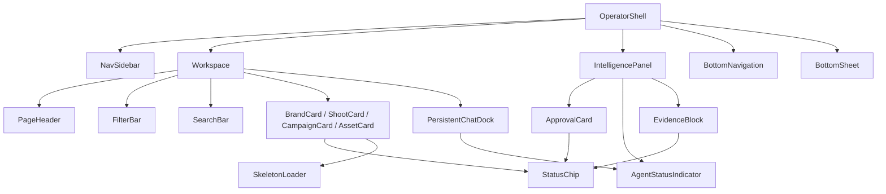

# 03 — Component Map

> The 20 shared components in `components/` (incl. **EvidenceBlock**). Reference: `components/COMPONENTS.md`. Screens → [02](02-screen-map.md).

**Canonical reuse (do not fork):** **EvidenceBlock** is the one AI-explainability surface (reused on 7 screens — Brand Detail, Assets, Matching, Campaigns, Channel Preview, Analytics Overview, Campaign Performance — see row below + `AI-EXPLAINABILITY.md`). **Selectable/draggable cards** (D-DS5) are driven through each card's `onSelect`/`selected`/`border` props plus a host-owned checkbox overlay + bulk bar + drop dock (`PATTERNS.md#selection`) — the card components are NOT duplicated.

**Reuse rule:** build a component once and reuse via `dc-import` (prototype) / a React component (production). Cards drive selection → IntelligencePanel. All visuals are inline-styled from `tokens.css` values. React target = a typed function component with the listed props.

## Composite / shell
| Component | Purpose | Key props | Variants/States | Used on | React target | Depends on |
|---|---|---|---|---|---|---|
| **OperatorShell** | 3-panel layout (nav · workspace · intelligence) | `nav`, `children`, `panel` | desktop 3-col / mobile (tabs+sheet) | all operator screens | `<OperatorShell>` layout | NavSidebar, IntelligencePanel, BottomNavigation, BottomSheet |
| **NavSidebar** | left rail ↔ expanded; brand switcher, nav links, account | `items`, `brands`, `expanded` | collapsed(3.5rem)/expanded(14rem); active item | all | `<NavSidebar>` | StatusChip (badges) |
| **IntelligencePanel** | right context→scores→approvals→tabs (always white) | `context`, `scores`, `approvals`, `tabs` | summary / selected / loading / error | all | `<IntelligencePanel>` | ApprovalCard, StatusChip, AgentStatusIndicator |
| **PersistentChatDock** | base-of-workspace AI dock | `agent`, `greeting`, `chips`, `placeholder` | idle / thinking(stream) | all (wizards inline) | `<ChatDock>` (CopilotKit) | AgentStatusIndicator |
| **PageHeader** | title + breadcrumb + actions | `title`, `breadcrumb`, `actions` | list / detail | list/detail screens | `<PageHeader>` | — |
| **WizardStep** | wizard step shell (progress, footer) | `step`, `total`, `title` | per-step | Shoot Wizard | `<WizardStep>` | — |

## Mobile nav
| Component | Purpose | Props | States | Used | React | Deps |
|---|---|---|---|---|---|---|
| **BottomNavigation** | 5-tab bar (Home·Shoots·Assets·Brands·More) | `items`, `active` | active/inactive | all panel screens (mobile) | `<BottomNav>` | — |
| **BottomSheet** | bottom-sheet primitive (More sheet, panel-as-sheet) | `open`, `onClose`, `children` | open/closed (detents) | all panel screens (mobile) | `<BottomSheet>` (3 detents, drag handle, focus trap) | — |

## Cards (image-first, 1px hairline, StatusChip on image corner)
| Component | Purpose | Props | Variants/States | Used | React | Deps |
|---|---|---|---|---|---|---|
| **BrandCard** | a brand | `name`, `site`, `coverKey`, `status`, `score`, `pillar`, `onAnalyse`, **`onOpen`** | has-data / no-data(crawl CTA) / analysing(progress); hover/loading/selected | Brand List, Command Center | `<BrandCard>` | StatusChip, SkeletonLoader |
| **ShootCard** | a shoot | `name`, `brand`, `date`, `status`, `dna`, `cover`, `looks`, `onOpen` | default/selected/loading | Shoots List | `<ShootCard>` | StatusChip |
| **CampaignCard** | a campaign | `title`, `dates`, `coverUrl`, `statusLabel`, `pct`, `onSelect`, `selected`/`cardBorder` (D-DS5) | default/selected; multi-select + drag (host overlay) | Campaigns | `<CampaignCard>` | StatusChip |
| **AssetCard** | an asset | `imgUrl`/`coverUrl`, `match`, `type`, `height`, `variant`(tile/masonry), `showFooter`, `onSelect`, `selected`, `border` (D-DS5) | tile / masonry; default/selected; multi-select + drag (host overlay) | Assets, Brand Detail, Shoot Detail | `<AssetCard>` | StatusChip |
| **ApprovalCard** | a HITL approval — **de-forked (IPI-304, 2026-07-18)** from 4 independent implementations into a shared shell + primitives; see footnote below | shell: `className`; `ApprovalHeader`: `title`, `subtitle?`, `right?`; `ApprovalEvidence`: `fields[{label,value}]`; `ApprovalComparison`: `rows[{label,value,delta?}]`; `ApprovalActions`: `state`(`idle`\|`approving`\|`rejecting`), `onApprove`, `onReject` | pending / approving / rejecting / already-processed (Brand); plain data-table (Budget/Deliverable/ShotList — no approval state) | Command Center (`BrandApprovalCard`, full shell+actions); Shoot Wizard HITL gates (`Budget`/`Deliverable`/`ShotListApprovalCard`, shell+header only) | `<ApprovalCardShell>` + `<ApprovalHeader>`/`<ApprovalEvidence>`/`<ApprovalComparison>`/`<ApprovalActions>` (`app/src/components/approval-card/`) | none (style-free structural primitives — StatusChip/AgentStatusIndicator from the design source are not wired in yet; v1 scope per IPI-304 is Brand-only actions) |
| **EvidenceBlock** | the canonical AI-explainability surface (score→potential, confidence, why, AI reasoning, evidence imgs+bullets, suggestions+gain, before/after, Approve/Improve/Regenerate) — empty sections auto-hide | `title`, `score`, `potential`, `confidence`, `why`, `reasoning`, `evidence[]`, `evidenceImgs[]`, `suggestions[{text,gain}]`, `beforeImg`, `afterImg`, `onApprove`, `onImprove`, `onRegenerate` | ready / partial (sections hide) | Brand Detail, Assets, Matching, Campaigns, Channel Preview | `<EvidenceBlock>` | StatusChip (confidence) |

**ApprovalCard de-fork (IPI-304, 2026-07-18):** the 4 production forks
(`app/src/components/brand-hub/approval-card.tsx`,
`shoot/hitl/{Budget,Deliverable,ShotList}ApprovalCard.tsx`) that this
component-map's "canonical reuse" rule flagged as a rule violation are now
thin domain wrappers over a shared shell + primitives in
`app/src/components/approval-card/` — shell + thin-adapter pattern, same as
`crm-detail-shell.tsx`. `ApprovalActions` (Approve/Reject) is wired for
`BrandApprovalCard` only in v1: the 3 shoot HITL cards have no approve/reject
UI today, so no action UI was invented for them (they render the shell +
header around their own controlled tables). Prop names above are the actual
shipped names, reconciled from the design source's `title`/`confidence`/
`evidence`/`before`/`after`/`variant` where a real mapping existed —
`ApprovalEvidence`'s `fields[]` covers `confidence`/`evidence` (as a generic
label/value grid, since Brand Hub's evidence is a tagline/category/score
fact-grid, not the design source's single evidence string) and
`ApprovalComparison`'s `rows[]` covers `before`/`after` (as a generic
label/value/delta list, since Brand Hub compares draft-vs-live *scores*, not
simple before/after text).

## Atoms / feedback / inputs
| Component | Purpose | Props | Variants | Used | React | Deps |
|---|---|---|---|---|---|---|
| **StatusChip** | status pill | `status`, `bare`, `onImage` | planning·active·in-production·complete·draft·archived·pending·new·saved·invited | everywhere | `<StatusChip>` | — |
| **AgentStatusIndicator** | AI state dot/stream | `state` | idle·thinking·streaming·awaiting-approval (formalise — N5) | docks, approvals | `<AgentStatus>` | — |
| **EmptyState** | empty placeholder | `icon`, `title`, `body`, `action` | default | all screens (empty); search-empty inline (N2: route through this) | `<EmptyState>` | — |
| **SkeletonLoader** | shimmer skeleton | `shape`, `count` | card/row/text | all (loading) | `<Skeleton>` | — |
| **FilterBar** | filter chip row | `filters`, `active`, `onSet` | — | Brand List, Shoots, Campaigns, Assets, Matching | `<FilterBar>` | — |
| **SearchBar** | subtle-grey search field | `placeholder`, `value`, `onInput` | default/focus | list screens | `<SearchBar>` | — |

## Component hierarchy

**Selection/drag (D-DS5)** is a host-level pattern layered over `AssetCard`/`CampaignCard` (and the Matching table rows): checkbox overlay + sticky bulk bar + drop dock live in the screen, not in the card. See `PATTERNS.md#selection`.

## Dependency matrix (D-DS17)
> Depends-on = children it renders. Used-by = how many of the 20 components render it (blast radius of a change). **Tier** = build/refactor order: a component must be stable before anything above it. Change a Tier-0 atom → re-verify every screen; change a Tier-3 shell → local.

| Component | Tier | Depends on | Used by (count) | Blast radius |
|---|:--:|---|---|:--:|
| **StatusChip** | 0 | — | BrandCard, ShootCard, CampaignCard, AssetCard, ApprovalCard, EvidenceBlock, NavSidebar, IntelligencePanel (8) | 🔴 highest — every card/panel |
| **AgentStatusIndicator** | 0 | — | IntelligencePanel, ApprovalCard, PersistentChatDock (3) | 🟠 all AI surfaces |
| **SkeletonLoader** | 0 | — | BrandCard + every screen loading state | 🟠 all loading |
| **EmptyState** | 0 | — | every screen (empty) | 🟠 all empty |
| **SearchBar / FilterBar** | 0 | — | list screens (5) | 🟡 list screens |
| **BrandCard** | 1 | StatusChip, SkeletonLoader | Brand List, Command Center (2) | 🟡 |
| **ShootCard / CampaignCard** | 1 | StatusChip | Shoots List / Campaigns (1 each) | 🟢 local |
| **AssetCard** | 1 | StatusChip | Assets, Brand Detail, Shoot Detail (3) | 🟡 |
| **ApprovalCard** | 1 | StatusChip, AgentStatusIndicator | Command Center, Brand Detail, Shoot Detail (3) | 🟡 |
| **EvidenceBlock** | 1 | StatusChip | Brand Detail, Assets, Matching, Campaigns, Channel Preview, Analytics, Campaign Perf (7) | 🔴 canonical AI surface |
| **PageHeader / WizardStep** | 1 | — | list/detail · Shoot Wizard | 🟢 local |
| **NavSidebar** | 2 | StatusChip | OperatorShell (all) | 🟠 via shell |
| **IntelligencePanel** | 2 | ApprovalCard, StatusChip, AgentStatusIndicator | OperatorShell (all) | 🔴 via shell |
| **PersistentChatDock** | 2 | AgentStatusIndicator | all (wizards inline) | 🟠 |
| **BottomNavigation / BottomSheet** | 2 | — | OperatorShell (mobile) | 🟠 all mobile |
| **OperatorShell** | 3 | NavSidebar, IntelligencePanel, BottomNavigation, BottomSheet | every operator screen | 🔴 top of tree — but changes stay in the shell |

**Build/refactor order:** Tier 0 (atoms) → Tier 1 (cards + EvidenceBlock) → Tier 2 (nav/panel/dock/mobile) → Tier 3 (OperatorShell). **Never** edit a Tier-0 atom without re-verifying the 🔴/🟠 dependents. **EvidenceBlock** and **IntelligencePanel** are the two highest-value shared surfaces — treat their props as a frozen contract (extend, don't fork).

**Bespoke (intentionally not generic):** Matching swipe deck + data table, Brand Detail image-diff HITL card + dotless tinted chips, the realtime status strip (Command Center), the publish modal (Channel Preview), the shortlist drawer (Matching). Document as screen-local in production.
