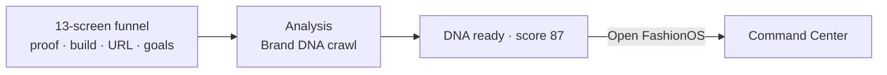
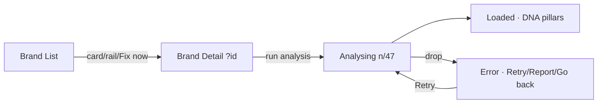
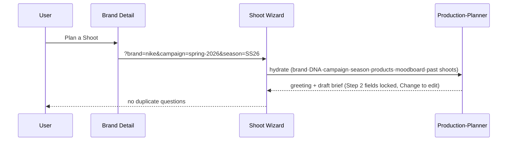
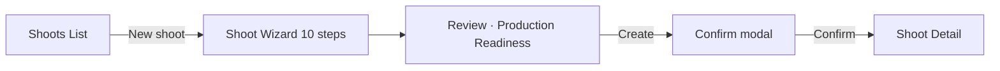
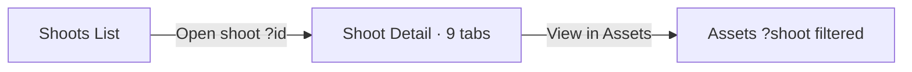
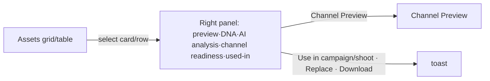
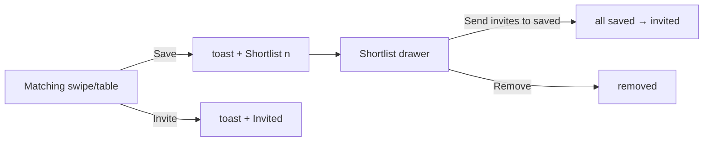
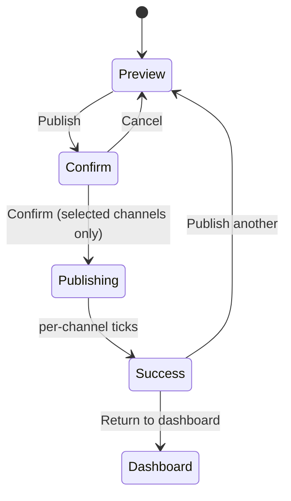

# 04 — User Journeys

> Eight end-to-end flows, all verified working in the prototypes. Screens → [02](02-screen-map.md). Navigation → [07](07-navigation-map.md).

## J1 — Onboarding → Command Center

Funnel collects build type, brand URL, channels, goals → analysis (progress) → DNA payoff → enters the app. Skip-for-now allowed on optional screens.

## J2 — Brand analysis (Brand List → Brand Detail)

`brand-intelligence` is NOT durable → use determinate crawl + error/retry, never a resumable stream.

## J3 — Brand → Shoot (context carryover)

## J4 — Shoot planning → create (Shoots List → Wizard → Shoot Detail)

Wizard steps are AI-prefilled; Review scores react to user actions (props/savings/shot edits raise section + composite scores). Exit guard on unsaved changes.

## J5 — Shoot review (Shoots List → Open → Shoot Detail)

## J6 — Assets review

## J7 — Matching → shortlist → outreach

State persists across swipe/table toggle.

## J8 — Channel Preview → publish

Confirm modal lets the user select/deselect channels; title + button update ("Publish 2 channels"); progress + success run only for selected.

## Journey cross-reference
| Journey | Screens | Agents | Key components |
|---|---|---|---|
| J1 | Onboarding→CC | brand-intelligence→production-planner | progress, DNA payoff |
| J2 | BL→BD | brand-intelligence | BrandCard, DNA pillars |
| J3 | BD→SW | brand-intelligence→production-planner | WizardStep, lock banner |
| J4 | SL→SW→SD | production-planner | WizardStep, confirm modal |
| J5 | SL→SD→AS | production-planner | tabs, AssetCard |
| J6 | AS | creative-director | AssetCard, right panel |
| J7 | MA | social-discovery | swipe/table, drawer |
| J8 | CP→CC | visual-identity→production-planner | phone frames, publish modal |
