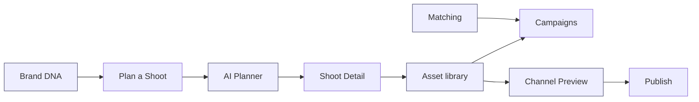

# 05 — Feature Map

> Every feature: user value, business value, AI involvement, backend, build order. Screens → [02](02-screen-map.md). React → [09](09-react-implementation-map.md).

| Feature | Screen | User value | Business value | AI involvement | Backend needed | Order |
|---|---|---|---|---|---|---|
| **Operator shell + nav** | all | Consistent navigation, fast context switch | Retention, learnability | — | Auth, role | 1 |
| **Brand DNA analysis** | Brand List, Brand Detail, Onboarding | Auto brand identity (palette/voice/imagery + score) | Core differentiator | brand-intelligence crawl + Gemini scoring | Crawl service, Supabase `brands`, `dna_scores` | 2 |
| **Brand portfolio + search** | Brand List | Find/manage brands fast | Multi-brand ops | greeting/suggestions | `brands` | 2 |
| **Plan-a-Shoot handoff** | Brand Detail→Wizard | No re-entry; brand context carried | Faster shoot setup | production-planner prefill | `shoots`, `campaigns` | 4 |
| **AI Shoot Planner (10 steps)** | Shoot Wizard | AI drafts brief/shot-list/crew/budget/timeline | Production speed | production-planner (durable) + Gemini | `shoots`, `shot_list`, `crew`, `budget`, `schedule` | 4 |
| **Production Readiness scoring** | Wizard Review | Know what's left before committing | Fewer failed shoots | scoring + recommendations | scoring service | 4 |
| **Shoot Detail workspace** | Shoot Detail | One place for a shoot's 9 facets | Execution control | production-planner | `shoots/*` joins | 5 |
| **Asset library + DNA match** | Assets | Curate on-brand assets, channel readiness | Quality control | creative-director + DNA match | `assets`, Cloudinary, `dna_match` | 6 |
| **Asset actions** (use/replace/download/preview) | Assets | Move assets into work | Throughput | suggestions | `assets`, `campaigns`, `shoots` | 6 |
| **Campaigns + deliverables** | Campaigns | Track campaign progress/timeline | Delivery on time | creative-director | `campaigns`, `deliverables` | 7 |
| **Creator matching + shortlist** | Matching | Find on-brand creators; build outreach list | Influencer ROI | social-discovery scoring | `creators`, `shortlists`, `invites` | 8 |
| **Channel preview + publish** | Channel Preview | See native crops; publish multi-channel | Distribution | visual-identity crop/DNA check | Channel APIs, `publishes` | 9 |
| **Onboarding funnel** | Onboarding | Fast first value (DNA in ~90s) | Activation/conversion | brand-intelligence | crawl, `brands` | 3 |
| **Global AI dock** | all | Context help + next action everywhere | Engagement | all agents (CopilotKit + Mastra) | CopilotKit runtime | cross-cutting |
| **HITL approvals** | CC, Brand Detail, Shoot Detail | Trust: review AI before it acts | Safety/compliance | confidence + evidence | `approvals` | cross-cutting |
| **Realtime / permission states** | CC (pattern) | Trust: never act on stale data; role gating | Reliability, governance | — | Realtime channel, RBAC | cross-cutting |

## Feature → journey → AI map

**MVP cut (P1–P2):** shell, brand DNA, brand list/detail, onboarding, shoots, wizard, shoot detail, assets. **Phase 2 (P2–P3):** campaigns, matching, channel preview, full HITL + realtime/permissions.
