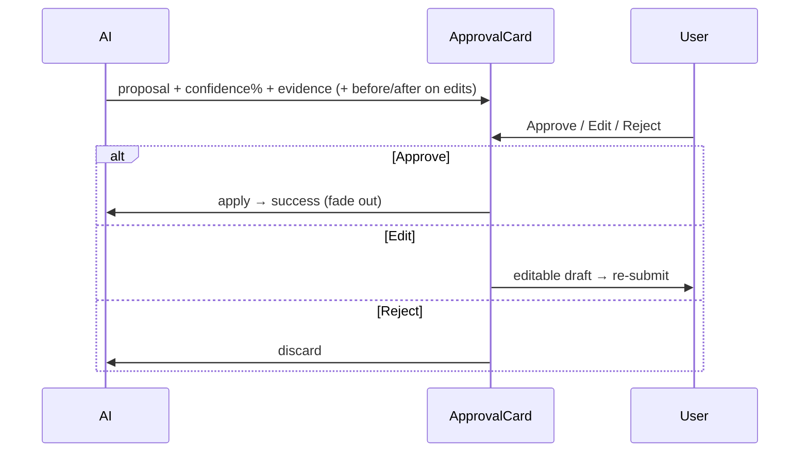

# 06 — AI Workflows

> Docks, greetings, quick actions, HITL, confidence/evidence, retry. Agents → [02](02-screen-map.md). Features → [05](05-feature-map.md).

## Agents (Mastra registry · `route-agent-map.ts`)
| Agent | Screens | Durable? | Role |
|---|---|:--:|---|
| **production-planner** (default) | Command Center, Shoots, Shoot Wizard, Shoot Detail | ✅ | Shoot planning, scoring, scheduling |
| **creative-director** | Campaigns, Assets | ✅ | Asset/campaign quality, DNA match |
| **brand-intelligence** | Brand List, Brand Detail, Onboarding | ❌ | Brand DNA crawl + scoring (error+retry, no resumable stream) |
| **visual-identity** | Channel Preview | (confirm) | Crop/safe-zone/DNA-per-channel |
| **social-discovery** | Matching | (confirm) | Creator/audience scoring + safety |

## Dock rules (every operator screen)
- **Greeting** names the active object + next action — **never "How can I help?"** Examples: *"Sofia Marlowe is a 90% fit for Nike — Instagram, 1.2M followers. One of your strongest matches."* / *"Planning Nike's Spring 2026 campaign (SS26). I've drafted a production brief for review."*
- **Updates on selection change** (Assets/Matching/Campaigns/Channel Preview greetings re-render with the selected object).
- **Quick actions:** 3–5 context chips that **stream** (or trigger a visible state). Streaming = live steps: green check (done) · pulsing dot (active) · faint dot (pending) — **never a spinner**.

## Quick-action greeting matrix
| Screen | Greeting names | Quick actions |
|---|---|---|
| Command Center | portfolio + pending approvals | Plan a shoot · Review approvals · Improve a brand |
| Brand List | brand count + weakest brand | Improve visuals · Plan a shoot · Review assets |
| Brand Detail | brand + DNA + opportunities | Improve Visual score · Plan a shoot · Review assets |
| Shoots List | shoot counts | Plan a shoot · Find blockers · Summarize |
| Shoot Wizard | step context | per step (Improve brief · Generate shots · …; Review: Fix all issues · Assign resources · Export plan) |
| Assets | selected asset + DNA match | Review low matches · Suggest replacements · Bulk tag |
| Matching | match count + top creator | Find 90%+ fits · More TikTok · Flag risks |
| Channel Preview | platform + crop/DNA | Check safe zones · Suggest crops · Export all |

## HITL approval flow

- **Confidence** shown on every AI write (e.g. "92%"). **Evidence** = source/why. **Before/After** required on edits/drafts (image-diff in Brand Detail).
- Buttons: Approve = **black** primary · Edit = outline · Reject = ghost.

## Explainability surface — EvidenceBlock (canonical, do not fork)
Every AI **score** is explainable through one shared component, `components/EvidenceBlock.dc.html` (spec: `AI-EXPLAINABILITY.md`). An “Explain…” affordance opens it in a modal/panel: **score→potential · confidence badge · why · AI reasoning · evidence (imgs+bullets) · suggestions (+gain) · before/after · Approve→re-score**. Empty sections auto-hide. Reused on:

| Screen | Score explained | Trigger |
|---|---|---|
| Brand Detail | per-pillar DNA | click a DNA pillar |
| Assets | asset DNA match | “Explain DNA match” in detail panel |
| Matching | creator fit % | “Explain fit score” in creator panel |
| Campaigns | campaign health | “Explain campaign health” in selected-campaign panel |
| Channel Preview | channel readiness | “Explain readiness” in channel detail |

**Rule:** never build a second explainability component; route every new score through EvidenceBlock. Approve must produce a re-score + toast (HITL).

## Retry / error behavior
```mermaid
stateDiagram-v2
  [*] --> Loaded
  Loaded --> Analysing: run
  Analysing --> Loaded: complete (determinate n/47)
  Analysing --> Error: stream drop
  Error --> Analysing: Retry
  Error --> [*]: Go back
  note right of Error: brand-intelligence NOT durable —\nstandard error+retry, no resumable stream.\nActions: Retry · Report · Go back
```
- Durable agents (production-planner, creative-director) may show resumable progress; non-durable (brand-intelligence) must not — use determinate progress + explicit Retry.
- Every error state offers concrete actions (Retry · Report · Go back); never a dead end. Stale/realtime drops surface a quiet banner (Command Center pattern) and never present dropped output as live.

## Production AI wiring (target)
CopilotKit runtime hosts the dock; Mastra agents back each route (durability per table above); Gemini for generation/scoring. Greetings + suggestions are registered per route (`useConfigureSuggestions`); keep them context-aware and object-named.
