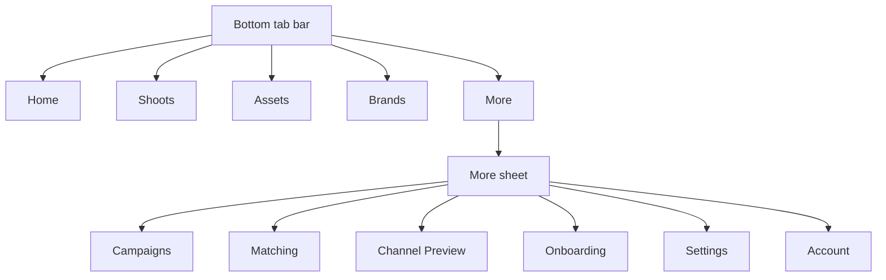

# 07 — Navigation Map

> Routes, links, deep links, mobile nav, More sheet, dock. Screens → [02](02-screen-map.md). Journeys → [04](04-user-journeys.md).

## Route table
| Route | Screen | Deep-link params | Agent |
|---|---|---|---|
| `/onboarding` | Onboarding | — | brand-intelligence |
| `/app` | Command Center | — | production-planner |
| `/app/brand` | Brand List | — | brand-intelligence |
| `/app/brand/[id]` | Brand Detail | `id` (nike/adidas/zara) | brand-intelligence |
| `/app/shoots` | Shoots List | — | production-planner |
| `/app/shoots/[id]` | Shoot Detail | `id` (s1–s8) | production-planner |
| `/app/shoots/new` | Shoot Wizard | `brand`, `campaign`, `season` | production-planner |
| `/app/campaigns` | Campaigns | — | creative-director |
| `/app/assets` | Assets | `shoot`, `name` | creative-director |
| `/app/matching` | Matching (+ **Talent** tab) | `tab=talent` | social-discovery · **model-match** |
| `/app/matching/talent/[id]` | Talent Profile | `id` | model-match |
| `/app/talent/profile` | Talent Onboarding (URL-context) | `id` | **booking** (URL-Context tool) |
| `/app/shoots/new` | Shoot Wizard (**`?flow=booking&talent=<id>` = Booking Wizard**) | `flow`, `talent`, `brand`, `campaign`, `season` | production-planner (shoot) · booking (booking flow) |
| `/app/shoots/[id]` | Shoot Detail (**`?flow=booking&talent=<id>` = Booking Detail**) | `flow`, `talent`, `status`, `tab`, `id` | production-planner (shoot) · booking (booking flow) |
| `/app/preview` | Channel Preview | — | visual-identity |

> **Booking entry points** (one reusable wizard, `Pages/Shoot Wizard.v2.image-first.dc.html`):
> - **SCR-20 Talent Profile → "Request booking"** → `?flow=booking&talent=runwithkara`.
> - **SCR-09 Matching Shortlist → "Send to shoot"** → `?flow=booking&talent=<first shortlisted id>`.
> Both open the wizard's **booking flow** (5 steps); the default (no `flow`) is the unchanged 10-step **shoot flow**. No separate Booking Wizard file.

> **Prototype filenames** map 1:1 to routes (e.g. `Pages/Brand Detail.v2.image-first.dc.html?id=nike` → `/app/brand/nike`). Deep-link params are read on mount; in React use the router (`useSearchParams`/route segments).

## Desktop navigation
```mermaid
graph LR
  subgraph NavSidebar
    H[Home] & B[Brands] & S[Shoots] & A[Assets] & C[Campaigns]
  end
  H --> CC[/app]
  B --> BL[/app/brand]
  S --> SL[/app/shoots]
  A --> AS[/app/assets]
  C --> CA[/app/campaigns]
  BL --> BD[/app/brand/:id]
  SL --> SD[/app/shoots/:id]
  SL --> SW[/app/shoots/new]
  BD --> SW
  SD --> AS
  CC --> BD
```
- NavSidebar links (Home/Brands/Shoots/Assets/Campaigns) wired on every screen via a shared `NAVHREF` map. Brand rail rows → Brand Detail. Account button = identity (tooltip; production: account menu).

## Mobile navigation

- **BottomNavigation:** 5 tabs (Home·Shoots·Assets·Brands·More); all wired to routes. (Fixed in QA — were previously dead.)
- **More sheet:** secondary destinations; current page highlighted; rows link to real routes.
- **IntelligencePanel → bottom sheet** via a trigger pill; **PersistentChatDock** pinned above the tab bar.

## Buttons / links / deep links (key interactive nav)
| Action | From | To |
|---|---|---|
| Open FashionOS | Onboarding (13) | `/app` |
| Brand card / rail / Fix now | Brand List / CC | `/app/brand/:id` |
| Breadcrumb "Brands" | Brand Detail | `/app/brand` |
| Plan a Shoot | Brand Detail | `/app/shoots/new?brand&campaign&season` |
| New shoot / Plan shoot | Shoots List | `/app/shoots/new` |
| Open shoot | Shoots List | `/app/shoots/:id` |
| Create (confirm) | Shoot Wizard | `/app/shoots/:id` |
| View in Assets | Shoot Detail | `/app/assets?shoot=:id&name=` |
| Channel Preview | Assets panel | `/app/preview` |
| Return to dashboard | Channel Preview (success) | `/app` |
| More-sheet rows | any panel screen (mobile) | respective routes |

**No dead primary actions remain** (verified in `checklist.md` §12). Decorative: account (tooltip). **Voice input removed** — text-only composer; voice parked as Future Phase (`MOBILE-PLAN.md §22.1`).

## Chat dock behavior
Persistent **text-only AI composer** at the workspace base on every operator screen (inline in wizards); pinned above the mobile tab bar; **route-aware assistant** (placeholder + proactive chips switch per route/role — full map in `MOBILE-PLAN.md §22.3`); **Insights kept separate** (header button → read-only sheet). Never blocks navigation; HITL always (no auto-accept/book/confirm/publish). No mic — voice is Future Phase.
