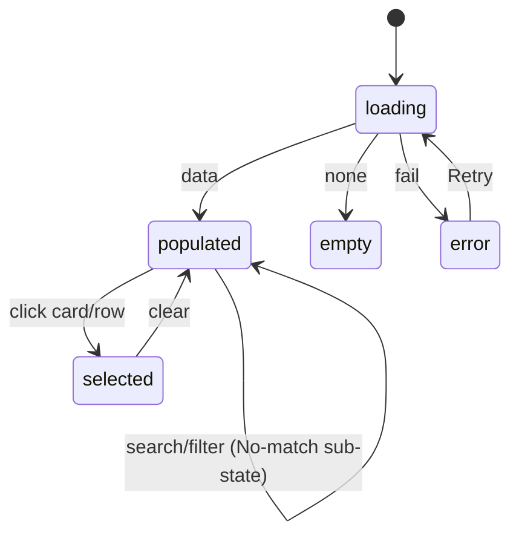
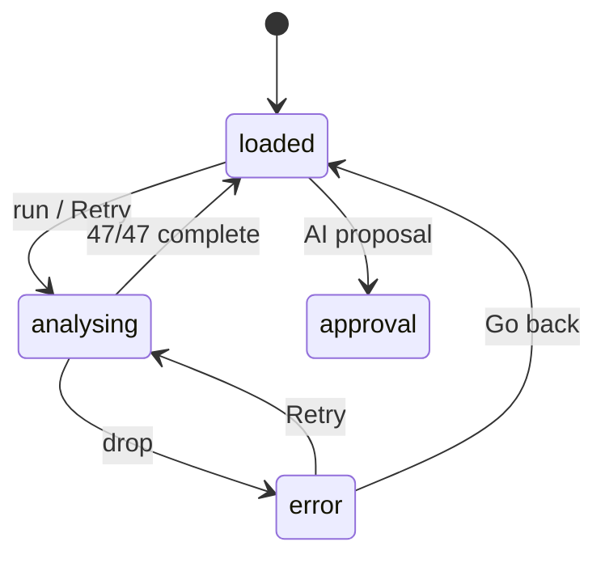
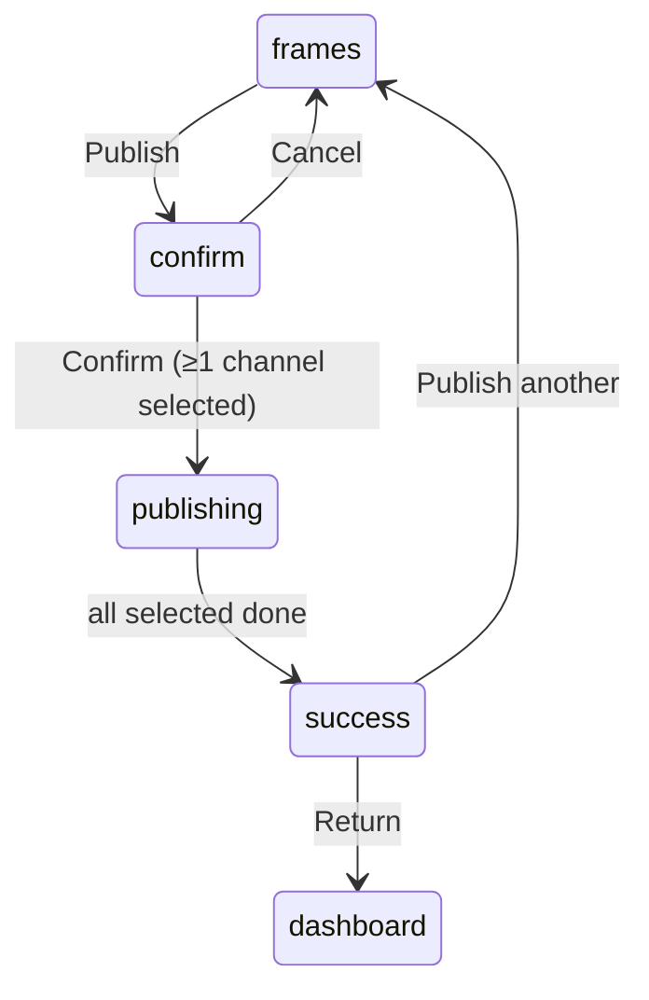
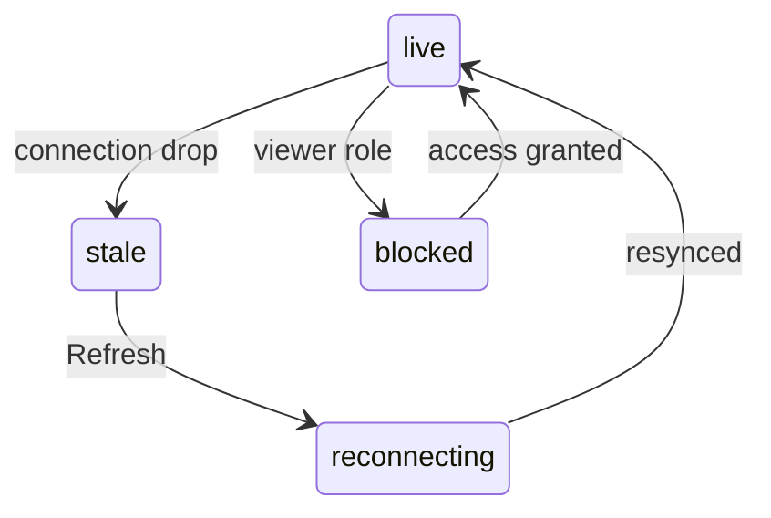

# 08 — State Map

> Every screen's states + how users move between them. Screens → [02](02-screen-map.md). AI/retry → [06](06-ai-workflows.md).

## State vocabulary
🟢 **populated** · ⏳ **loading** (skeleton, never spinner) · ⚪ **empty** · 🔴 **error** (Retry/Report/Go back) · 🟡 **approval-pending** · 🔵 **analysing** (determinate) · 🚀 **publishing** · ✅ **success**. Plus **realtime**: live / reconnecting / stale / blocked (read-only).

## Per-screen state matrix
| Screen | populated | loading | empty | error | approval | analysing | publishing | success | extra |
|---|:--:|:--:|:--:|:--:|:--:|:--:|:--:|:--:|---|
| Command Center | ✅ | ✅ | ✅ | ✅ | ✅ | — | — | — | realtime strip (live/reconnecting/stale/blocked) |
| Brand List | ✅ | ✅ | ✅ | ✅ | — | ✅ per-card | — | — | search no-match |
| Brand Detail | ✅(loaded) | ✅ | ✅(no-data) | ✅ | ✅ | ✅ (n/47) | — | — | error: Retry/Report/Go back |
| Shoots List | ✅ | ✅ | ✅ | ✅ | — | — | — | — | selected; search+filter |
| Shoot Detail | ✅ | ✅ | ✅ | ✅ | ✅ | — | — | — | 9 tabs; edit modal |
| Shoot Wizard | per-step | — | — | — | ✅(Review) | — | — | ✅(Create) | live scoring; exit guard |
| Campaigns | ✅ | ✅ | ✅ | ✅ | — | — | — | — | selected → panel |
| Assets | ✅ | ✅ | ✅ | ✅ | — | — | — | — | selected → panel; shoot filter |
| Matching | ✅(swipe/table) | ✅ | ✅ | ✅ | — | — | — | — | shortlist drawer |
| Channel Preview | ✅(frames) | ✅ | ✅(pick asset) | ✅ | — | — | ✅ | ✅ | publish: confirm/publishing/success |
| Onboarding | per-screen | — | — | — | — | ✅(screen 12) | — | ✅(screen 13) | per-step validation |

## Transitions — list screens

## Transitions — Brand Detail (analysing/error)

## Transitions — Channel Preview publish

## Realtime / permission (Command Center pattern — apply project-wide)

- **live** 🟢 synced · **reconnecting** 🟡 · **stale** ⚪ (show banner + Refresh; never present as live) · **blocked** 🔴 (read-only; hide/disable write actions + "Request access").

## Rules
- Loading uses **SkeletonLoader matching the populated layout** — never a spinner for content.
- Empty states offer the primary next action (Add brand / Plan shoot / Upload / Pick asset).
- Error states always offer Retry (+ Report/Go back); permissions gate write actions with a why-disabled hint.
