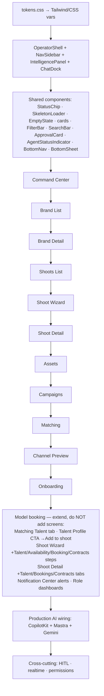

# 10 — Implementation Order

> Recommended build sequence. Map → [09](09-react-implementation-map.md). Checklists → [11](11-screen-checklists.md).

## Phased plan
**Phase 0 — Foundation**
1. Port `tokens.css` → design tokens (CSS vars / Tailwind theme). Lucide icons.
2. `OperatorShell` (nav · workspace · intelligence) + mobile tab bar + sheet + auth/role gate.
3. Shared components (build once, reuse): StatusChip, SkeletonLoader, EmptyState, BrandCard, ShootCard, CampaignCard, AssetCard, ApprovalCard, AgentStatusIndicator, FilterBar, SearchBar, PageHeader, WizardStep, BottomNavigation, BottomSheet, PersistentChatDock.

**Phase 1 — MVP screens (P1)**
4. Command Center → 5. Brand List → 6. Brand Detail → 7. Onboarding (activation funnel).

**Phase 2 — Production core (P2)**
8. Shoots List → 9. Shoot Wizard → 10. Shoot Detail → 11. Assets.

**Phase 3 — Growth (P2–P3)**
12. Campaigns → 13. Matching → 14. Channel Preview.

**Phase 4 — AI + cross-cutting**
15. Wire CopilotKit docks + Mastra agents + Gemini per route (durability per [06](06-ai-workflows.md)).
16. HITL approvals (confidence/evidence/before-after), realtime/stale banners, permission gating.

## Rationale
- Shell + shared components first — every screen depends on them; lifts later velocity.
- Brand DNA chain (List → Detail → Onboarding) delivers the core differentiator + activation early.
- Shoots chain next (the deepest workflow). Assets feeds Campaigns/Channel Preview.
- AI wiring last so UI states are stable to attach streams to; HITL + realtime are cross-cutting overlays.

## Dependency notes
- Brand Detail depends on Brand List nav + brand-intelligence (non-durable → error/retry).
- Shoot Wizard depends on Brand Detail (Plan-a-Shoot params) and writes shoot tables consumed by Shoot Detail.
- Assets `?shoot=` deep-link depends on Shoot Detail. Channel Preview consumes Assets.
- Matching shortlist feeds Campaigns outreach (future).
