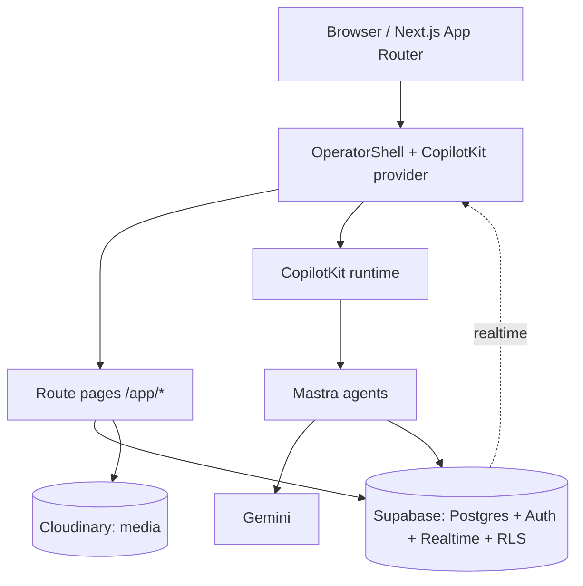

# 12 — Production Handoff (Developer Kickoff)

> Read **second** (after [handoff.md](handoff.md)). The single source of truth for implementing FashionOS / iPix.

## How to read the design files
1. **Prototypes are the spec.** The canonical `*.v2.image-first.dc.html` files render the exact UI, states, and interactions. Open them; the markup is inline-styled from `tokens.css` values — copy literal values into your token system.
2. **A `.dc.html` is one screen** = a `<x-dc>` template (markup) + a `Component extends DCLogic` class (state/handlers in `renderVals()`). Treat the class as the component's state machine; port it to React state/hooks.
3. **Ignore the DC runtime** (`support.js`, `<sc-if>`, `<sc-for>`, `dc-import`) — they map to React `{cond && …}`, `.map()`, and child components.
4. Pre-v2 files live in `archive/` — **do not use them**.

## Files to read first (in order)
`handoff.md` → `01-overview` → `02-screen-map` → `03-component-map` → `10-implementation-order` → then per-screen: `09-react-implementation-map` + `11-screen-checklists`. Companion: `DESIGN.md`, `tokens.css`, `components/COMPONENTS.md`, `MOBILE-PLAN.md`.

## Implementation order
Foundation (tokens → OperatorShell → shared components) → MVP (Command Center · Brand List · Brand Detail · Onboarding) → Core (Shoots · Wizard · Shoot Detail · Assets) → Growth (Campaigns · Matching · Channel Preview) → AI + cross-cutting. Full graph in [10](10-implementation-order.md).

## Shared component reuse (mandatory)
Build the 20 components in [03](03-component-map.md) **once**. Cards drive selection → IntelligencePanel. Never re-implement a card/chip/skeleton per screen. Bespoke screen-local pieces (swipe deck, publish modal, shortlist drawer, realtime strip) are explicitly noted — keep them local.

## Design tokens
Port `tokens.css`: colours (white/grey/black; `--color-action:#111`; amber for HITL only), Inter + mono numerals, radii (~20px card/image, ~10px control), 1px hairlines, `--nav-width-collapsed:3.5rem` / `--nav-width-expanded:14rem`, shadows only for overlays. **Zero hardcoded hex in components** — tokens only.

## Responsive behavior
Breakpoint **`max-width:1024px`**: NavSidebar → BottomNavigation + More sheet; IntelligencePanel → bottom sheet (trigger pill); chat dock pinned above tab bar; wizards/onboarding full-screen. Mobile nav + sheets are first-class (see `MOBILE-PLAN.md`), not a reactive shrink.

## AI wiring
CopilotKit dock per route; Mastra agent per route (`route-agent-map.ts`); durability per [06](06-ai-workflows.md) (`production-planner`+`creative-director` durable; `brand-intelligence` NOT — error+retry). Greetings name the active object + next action; quick actions stream live steps. HITL shows confidence + evidence + before/after; Approve=black, Edit=outline, Reject=ghost.

## Testing requirements
Per screen: renders all states; no console errors; nav + deep links resolve; key interactions (search/filter, card→panel, modals, drawers, publish, save/invite, wizard create); mobile tab + sheet; a11y (labels, ≥44px, focus, live regions). Cross-cutting: realtime stale banner, permission gating, retry paths.

## Common pitfalls
- Don't present **non-durable** agent output as resumable — use determinate progress + Retry (Brand Detail).
- Don't put detail content in the right column — IntelligencePanel only; detail lives in the workspace.
- Don't use a spinner for content — skeletons that match the populated layout.
- Don't leave dead primary actions; deep-link params (`?id`, `?shoot`, `?brand&campaign&season`) must be read on mount.
- Don't drift colour/type — tokens only; no orange chrome, no beige, Inter + mono numerals.
- Mobile tabs and the More sheet must actually navigate (a prior prototype bug — now fixed; keep it wired).

## Do / Don't
**Do:** reuse components; name the active object in AI greetings; image-first at correct ratios; hairlines over shadows; honour the 8 states; gate writes by role.
**Don't:** redesign the prototypes; invent new colours; add gradients/emoji; block navigation with the dock; skip empty/error/loading states.

## Pre-implementation decisions to confirm
Supabase schema + RLS; Mastra tool signatures + `durable.ts`; Cloudinary presets; channel-publish integrations; CopilotKit suggestion registration; exact agent routing for `visual-identity` / `social-discovery` (verify `route-agent-map.ts`). None block UI; all needed for data.

## Production architecture (target)

