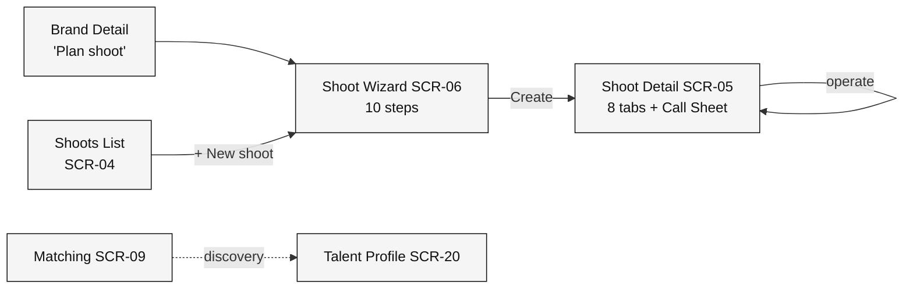
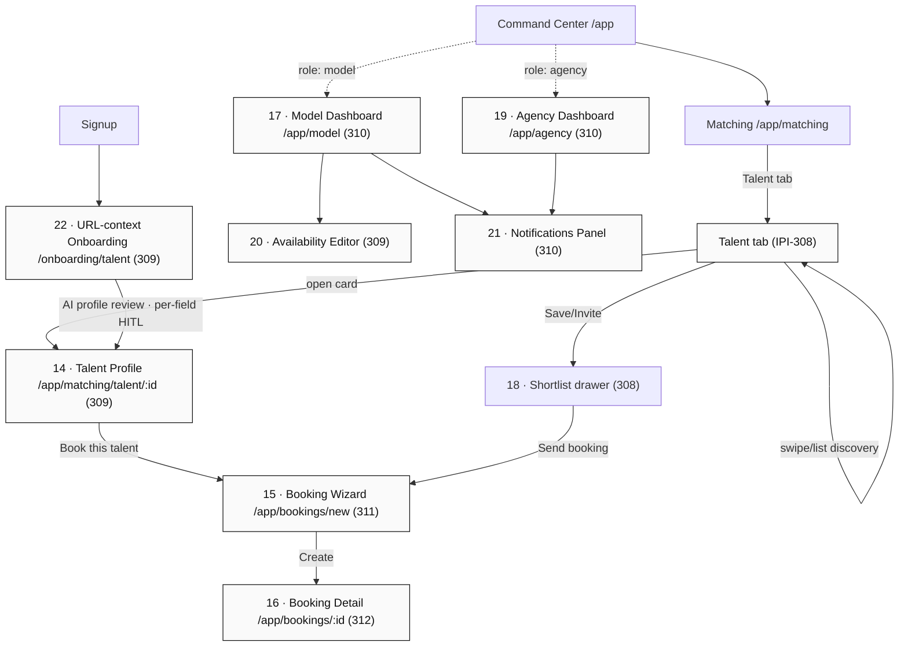
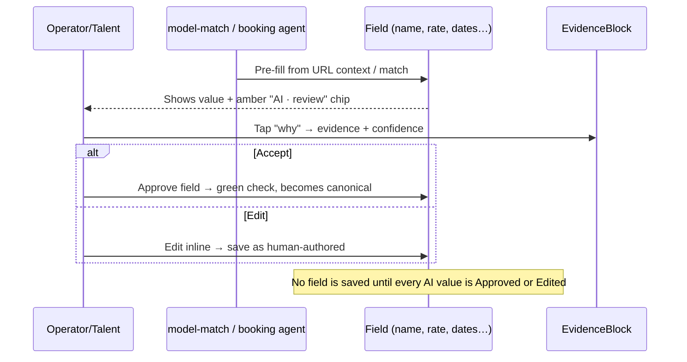

# Model Booking — Design Plan & Progress Tracker

> **Reviewer output.** Verifies the `11-*` Model-Booking Claude Design prompts against the *actual* iPix / FashionOS design setup in this repo, then lays out the build plan, screen map, agent/HITL flows, and wireframes.
>
> Scope: **IPI-308** (Matching Talent tab) · **IPI-309** (Talent Profile + URL-context onboarding) · **IPI-310** (Dashboards + Notifications) · **IPI-311** (Booking Wizard) · **IPI-312** (Booking Detail) · panels (Shortlist, Notifications, Availability).
> Visual system: **v3 "Zeely Editorial"** — pure white/grey/black, Inter, black primary CTAs, image-first editorial photography.
>
> Ground truth used for this review: `design-patched/00-README.md`, `components/COMPONENTS.md`, `design-patched/tokens.css`, `docs/handoff/02-screen-map.md`, `design-patched/prompts/*`.
>
> **Aligned with Engineering Reference v1.0** (`02-engineering-reference.md`). On any conflict, that file + §0.-1 below win over §0.0/§1–§12.

---

## ✅ Progress Task Tracker (verified 2026-07-03)

Legend: 🟢 complete · 🟡 in progress · 🔴 failed/blocked · ⚪ not started
Method per row: **Examine** (what exists) → **Verify** (correct?) → **Validate** (proof) → **Measure** (%) → **Identify** (gaps). Backend rows report the status asserted in `02-engineering-reference.md` §2 (design cannot run the repo — those are 🔎 *reported*, not independently code-verified).

### A. Design prototypes (this project — independently verified)

| Item | % | Status | Proof / gap |
|---|--:|:--:|---|
| SCR-20 Talent Profile DC | 100 | 🟢 | `screens/SCR-20-Talent-Profile.dc.html` — loads clean, 10/10 imgs, 11 tabs, 0 unresolved holes, 4 tabs + fit panel work |
| SCR-24 Talent Onboarding DC | 100 | 🟢 | `screens/SCR-24-Talent-Onboarding.dc.html` — 4 steps, streaming scan, FieldReview approve→green + Why→EvidenceBlock, Finish-locked gate; console clean |
| `FieldReview` per-field HITL pattern | 100 | 🟢 | proven inside SCR-24; ready to reuse |
| SCR-09 Matching **Talent tab** DC | 100 | 🟢 | `screens/SCR-09-Matching-Talent.dc.html` — 4-tab shell, filter bar, image-first talent cards + fit badges, select→fit panel + EvidenceBlock, save→Shortlist drawer + "Send to shoot", model-match dock; 7/7 imgs, console clean |
| SCR-09 **Casting Review Mode** | 100 | 🟢 | `screens/SCR-09-Matching-Talent.dc.html` — Casting/Grid/List switch; focused card (3:4 photo·fit·name·agency·location·availability·rate tier·≤3 tags·one-line rationale·Why-this-fit→EvidenceBlock); **always-visible Skip/Shortlist/View Profile** + ←→↑ keys + aria-live toast + 5s Undo; empty-filters/empty-stack states; **no dating copy** (verified). Plan: `SCR-09-Casting-Review.plan.md`; mobile frame in gallery. DOM-verified: skip advances stack, 0 holes |
| SCR-21 Booking Wizard | 100 | 🟢 | **built as the `booking` flow of `Pages/Shoot Wizard.v2.image-first.dc.html`** (reuses shell/rail/header/footer/nav/state/validation/mobile); 5 booking steps + FieldReview HITL + EvidenceBlock + send-gate + `requested`/72h. Shoot flow unchanged; both verified |
| SCR-22 Booking Detail DC | 100 | 🟢 | **`booking` flow of `Pages/Shoot Detail.v2.image-first.dc.html`**, driven by a shared **`FLOWCFG`** object (tabs/title/chat per flow; extensible). Tabs: Overview · Talent · Availability · Approvals · Activity — reuse Schedule/Budget/Approvals/Activity/Call-Sheet patterns. Status stepper + rate + EvidenceBlock + **operator-only** confirm. Shoot flow unchanged; both verified |
| SCR-23 Availability Editor DC | 100 | 🟢 | `screens/SCR-23-Availability-Editor.dc.html` — built: month grid, 4 states (available/blocked/tentative/booked), tap-toggle, save gate, empty/loading/error states; console clean |
| SCR-25 Model / Agency Dashboards DC | 100 | 🟢 | `screens/SCR-25-Role-Dashboards.dc.html` — **full AI-native 3-panel** (nav · workspace · **IntelligencePanel**) + proactive **OperatorChatDock** (HITL-safe action cards), shared `ROLES` config (model · agency), incoming offers Accept/Decline → Booking Detail `status=approved`, model bookings + agency roster. EvidenceBlock on rate/fit/utilisation. Console clean; `role` tweak |
| SCR-15 Notification Center | 100 | 🟢 | `screens/SCR-15-Notification-Center.dc.html` — bell + unread badge, slide-over panel (SCR-09 drawer pattern), Today/Earlier groups, All/Unread/Bookings filters, read-state + mark-all-read, typed icons; every booking event row deep-links to Booking Detail (`?flow=booking&talent=&status=`). Console clean |

### B. Documentation & alignment (this project — verified)

| Item | % | Status | Proof / gap |
|---|--:|:--:|---|
| `02-engineering-reference.md` (v1.0, authority) | 100 | 🟢 | D1–D9 + §1 summary tables + route/Supabase/impl matrices |
| `00-model-booking-plan.md` (this file) | 100 | 🟢 | §0.-1 override + this tracker; aligned v1.0 |
| `01-…-engineering-handoff.md` | 90 | 🟡 | correct but **superseded on key facts** (banner at top); keep as sketch |
| `SCREEN-REGISTRY.md` reconciled | 100 | 🟢 | SCR-21/22 reinstated, `booking` agent restored, contracts deferred |
| `02-screen-map.md` / `07-navigation-map.md` / `DESIGN-TASKS.md` | 95 | 🟡 | override banners added; §0.0-era fold text left as history |

### C. Backend (🔎 reported by `02-engineering-reference.md` §2 — not code-verified here)

| Item | % | Status | Source |
|---|--:|:--:|---|
| Talent schema · Availability · Bookings · Status history | 100 | 🟢 | §2.2 (migrations shipped) |
| Notifications (trigger insert) · RLS (68/68) · Auth (PKCE) | 100 | 🟢 | §2.5 / §2.10 / §2.9 |
| `model-match` agent + 3 tools | 100 | 🟢 | §2.4 registered |
| `booking` agent | 0 | 🔴 | §2.4 not registered (designed, D7) |
| Booking CRUD/transition/list RPCs · `/api/bookings/**` | 0 | 🔴 | §2.3 / §2.7 spec-only |
| `bookings.version` · `notification_reads` · list/mark-read RPCs | 0 | 🔴 | §2.2 / §2.5 planned |
| Contracts · Payments · pgvector | 0 | ⚪ | §2.8 deferred |

### Overall

| Track | Complete |
|---|--:|
| Design prototypes | **~40%** (3 of ~7 screens) |
| Documentation | **~97%** |
| Backend (reported) | **~55%** (data+auth+discovery done; booking write-path pending) |

### 🔜 Suggested next steps (in order)

1. **Build SCR-09 Matching Talent tab DC** (D-MB8) — discovery entry; `search_talent` + shortlist RPCs are 🟢, so it's fully backable today. **← recommended next.**
2. **Build SCR-21 Booking Wizard DC** (`11c`) — reuse the proven `FieldReview` HITL; drive the real FSM `requested→quoted→approved→confirmed`; **confirm is operator-only** (never AI).
3. **Build SCR-22 Booking Detail DC** — status timeline (`booking_status_history`), invalid-transition handling, `stale_booking` refresh copy.
4. **Rewire SCR-20 CTA** → open the Booking Wizard route (`/app/matching/talent/:id/book`); relabel its onboarding sibling to the `booking` URL-Context agent.
5. **SCR-15 Notification Center** + **SCR-25 dashboards** once `list_*` RPCs land.
6. **Fix doc cross-refs** — `02-reference` links to `../engineering/*` files that don't exist yet (create stubs or repoint).

**Do not start booking UI *implementation* (React) until PR-5 merges** (eng sign-off); DC prototypes may proceed now using the §2 status flags.

---

## 0.-1 ⛔ ENGINEERING OVERRIDE (2026-07-03) — D1–D9 approved · supersedes §0.0

> **Highest authority in this folder is now `02-engineering-reference.md` (D1–D9 approved).** It reflects the *shipped* backend + approved decisions and **overrides** the §0.0 "fold everything into Shoot / drop the booking agent / one custom status enum" reconciliation wherever they conflict. §0.0 and §1–§12 below are retained for history; on any engineering fact, **02-reference wins.** Changes forced by the override:

| Prior plan claim (now corrected) | Engineering reality (02-reference) |
|---|---|
| One canonical status enum `draft→invited→offered→accepted→confirmed→checked_in→completed` | **Real FSM:** `requested → quoted → approved → confirmed` (+ `declined` · `expired` · `cancelled`). Status writes are **RPC-only** (`create_booking_request`, `transition_booking`); **confirm is `service_role`/API only**. (D2, §5.1) |
| "Drop the `booking` agent — fold into `production-planner`" | **D7: keep a SEPARATE `booking` agent** (draft quotes/messages only, never confirms) + `model-match` (discovery). `production-planner` owns shoots, not bookings. |
| "Fold Booking Wizard/Detail entirely into Shoot Wizard steps / Detail tabs" | **Standalone routes are real:** Booking Wizard `/app/matching/talent/:id/book`, Booking Detail `/app/bookings/:id` (prompt `11c`). Shoot integration is narrower: a **confirmed** booking upserts `shoot.shoot_crew`, and Shoot Detail gets an **inline booking accordion on the crew row** — *not* full Talent/Bookings tabs. |
| "Add a Contracts step + Contracts tab (MVP)" | **D8: Contracts DEFERRED** — no `booking_contracts` table, **no contract/payment UI** in any MVP prototype. |
| AI fit/chat lives in `IntelligencePanel` | **D9: agent chat = `OperatorChatDock`** (center bottom). `IntelligencePanel` is **brand briefing only**, never chat. |
| Availability states `available/held/booked/unavailable` | **Real states:** manual **`available`/`blocked`** (talent-set, explicit Save) + trigger-derived **`tentative`/`booked`** (read-only; `booked` deep-links to Booking Detail). Delete of trigger rows is RLS-denied. |
| model-match / booking "not built" | **`model-match` is 🟢 BUILT** (agent + 3 tools + `/app/matching` route map); `booking` agent 🔴 spec. |

**Additional locked facts (design must honor):** optimistic locking via `bookings.version` → `stale_booking` (409) refresh copy (D1); `requested` bookings **expire in 72h** (shown as timeline + notification, not a button); **cancel requires a reason** (backend-enforced); notifications are **per-user read via `notification_reads`** (D3) — do not assume a shared read flag; every fit score routes through **EvidenceBlock**. Full error-code → UI map in `02-engineering-reference.md` §9; pre-flight list in its §10.

**Net on screens/registry:** SCR-21 Booking Wizard + SCR-22 Booking Detail are **reinstated as real screens** (they were removed by §0.0); SCR-23 Availability = the talent-set editor (`available/blocked`). Booking is **not** blocked on Shoot Wizard step changes. `model-match` + `booking` are the two booking agents. Contracts = ⚪ deferred everywhere.

**Build gate:** design HTML may proceed using the §2 status flags; **do not start booking UI *implementation* until PR-5 is merged** (`../engineering/implementation-plan.md`).

---

## 0.0 ⭐ REVISION (2026-07-03) — Fold booking into the existing Shoot lifecycle

> 🕰 **HISTORICAL — SUPERSEDED by §0.-1 + `02-engineering-reference.md` (D1–D9).** The fold-in described here (drop the booking agent, no standalone Booking Wizard/Detail, add Contracts) was overridden: booking uses a **separate `booking` agent**, standalone routes are real (built as `flow=booking` of Shoot Wizard/Detail), and Contracts are deferred. Retained for history only — **do not implement from this section.**

> **This revision supersedes the standalone-screen approach below.** After auditing the three built Shoot screens, booking is **not** a separate product surface — it is a phase of the existing Shoot lifecycle. We **extend** Shoot Wizard + Shoot Detail instead of building parallel Booking screens. Sections §0.2–§7 remain for history; where they conflict with this section, **this section wins**.

### Existing Shoot workflow map (audited, built & verified)



- **Shoot Wizard.v2** (`Pages/Shoot Wizard.v2.image-first.dc.html`) — 10 steps: Welcome · Basics · Brief · Moodboard · Shot list · Production · Budget · Timeline · **Call sheet** · Review. AI Production Planner, shared state, ApprovalCards.
- **Shoot Detail.v2** (`Pages/Shoot Detail.v2.image-first.dc.html`) — 8 tabs: Overview · Shot List · **Team & crew** · **Schedule** · Budget · **Approvals** · **Deliverables** · **Activity** + a **Call Sheet** modal. Uses `components/ApprovalCard`.

### What already exists (reuse — do NOT rebuild)

| Pattern | Lives in | Booking reuse |
|---|---|---|
| Multi-step wizard shell + shared AI state + ApprovalCards | Shoot Wizard | Booking steps live here |
| Tabbed operations workspace | Shoot Detail | Booking tabs live here |
| **Call Sheet** (modal + export) | Shoot Detail / Wizard step 9 | Talent appears on the call sheet |
| **Schedule** (shoot-day timeline) | Shoot Detail tab | Talent call times |
| **Team & crew** | Shoot Detail tab | Talent = a crew role |
| **Approvals** (ApprovalCard) | Shoot Detail tab | Booking offer sign-off |
| **Deliverables** | Shoot Detail tab | Talent deliverables |
| **Activity** | Shoot Detail tab | Booking events log |
| **Notification Center (SCR-15)** | planned | Booking alerts route here — no new notif screen |
| **FieldReview** (per-field HITL) | SCR-24 (built) | AI-filled booking fields (rate, dates) |

### What should be EXTENDED

1. **Shoot Wizard (SCR-06)** — add 4 steps into the existing 10: **Talent** (casting from Matching shortlist / Talent Profile) · **Availability** (confirm talent dates vs shoot dates) · **Booking** (rate + offer, AI-drafted → FieldReview HITL) · **Contracts** (MVP: simple agreement summary + e-sign stub). Proposed order: Welcome · Basics · Brief · Moodboard · Shot list · **Talent** · **Availability** · Production · Budget · **Booking** · Timeline · Call sheet · **Contracts** · Review (14 steps).
2. **Shoot Detail (SCR-05)** — add 3 tabs to the existing 8: **Talent** (booked models, status) · **Bookings** (offers/confirmations, ApprovalCard-gated) · **Contracts** (agreement status). Reuse Approvals/Deliverables/Activity/Schedule/Team/Call Sheet as-is.
3. **Matching (SCR-09)** — unchanged from prior decision: keep as discovery with **Talent** as the 4th tab + Shortlist drawer.
4. **Talent Profile (SCR-20, built)** — keep separate. Change its primary CTA from "Book this talent" (→ standalone wizard) to **"Add to shoot"** → routes into the Shoot Wizard **Talent** step (or attaches to an in-progress shoot). Availability tab stays here (replaces the standalone Availability editor).

### What should be REMOVED (duplicate plans)

| Removed screen | Was | Folds into |
|---|---|---|
| ~~SCR-21 Booking Wizard~~ | standalone wizard | Shoot Wizard **Talent · Availability · Booking · Contracts** steps |
| ~~SCR-22 Booking Detail~~ | standalone detail | Shoot Detail **Talent · Bookings · Contracts** tabs |
| ~~SCR-23 Availability Editor~~ | standalone editor | Talent Profile **Availability tab** (built) + Wizard Availability step |

Nothing built is discarded — SCR-21/22/23 were plan-only. SCR-20 (Talent Profile) and SCR-24 (Onboarding) stay.

### Agent simplification — ❌ RETRACTED (contradicts D7)

> **This section is wrong and is retired.** Per `02-engineering-reference.md` D7, a **separate `booking` agent** is the approved target (designed, not yet built); `model-match` handles discovery. `production-planner` owns shoots, **not** bookings. Ignore the struck text below.

~~The separate booking agent is dropped — booking is driven by production-planner.~~ **Corrected: two agents — `model-match` (built) + `booking` (designed, D7).**

### Updated screen architecture

| ID | Screen | Change | Status |
|---|---|---|:--:|
| SCR-04 | Shoots List | unchanged | 🟢 |
| SCR-06 | Shoot Wizard | **+4 booking steps** | 🟢→extend |
| SCR-05 | Shoot Detail | **+3 booking tabs** | 🟢→extend |
| SCR-09 | Matching | +Talent tab (prior decision) | 🟢→extend |
| SCR-20 | Talent Profile | keep; CTA → "Add to shoot"; owns availability | 🟡 built |
| SCR-24 | Talent Onboarding | keep (per-field HITL) | 🟡 built |
| SCR-15 | Notification Center | booking alerts route here | ⚪ |
| SCR-25 | Role Dashboards (Model/Agency) | keep (talent-side booking view) | ⚪ |
| ~~SCR-21/22/23~~ | ~~Booking Wizard/Detail/Availability~~ | **REMOVED — folded** | ❌ |

### Updated task list (net of removals)

| Task | Screen | Type | Priority |
|---|---|:--:|:--:|
| D-MB1 | Shoot Wizard: add **Talent** step (casting from shortlist) | extend | P1 |
| D-MB2 | Shoot Wizard: add **Availability** step (dates reconcile) | extend | P1 |
| D-MB3 | Shoot Wizard: add **Booking** step (rate/offer → FieldReview HITL) | extend | P1 |
| D-MB4 | Shoot Wizard: add **Contracts** step (agreement summary, MVP) | extend | P2 |
| D-MB5 | Shoot Detail: add **Talent** tab | extend | P1 |
| D-MB6 | Shoot Detail: add **Bookings** tab (ApprovalCard-gated) | extend | P1 |
| D-MB7 | Shoot Detail: add **Contracts** tab | extend | P2 |
| D-MB8 | Matching: add **Talent** 4th tab + Shortlist reuse | extend | P1 |
| D-MB9 | Talent Profile: CTA → "Add to shoot"; retire standalone booking route | edit | P1 |
| D-MB10 | Notification Center: booking alert types | extend | P2 |
| D-MB11 | Role Dashboards: talent-side booking view | new | P3 |
| ~~D-NS13/14/15~~ | ~~Booking Wizard / Detail / Availability~~ | **removed** | — |

### Updated implementation order

1. **D-MB8** Matching Talent tab (discovery entry) — reuses existing swipe deck.
2. **D-MB9** Talent Profile CTA rewire → "Add to shoot" (small edit to built SCR-20).
3. **D-MB1 + D-MB2** Shoot Wizard Talent + Availability steps (casting into the shoot).
4. **D-MB3** Shoot Wizard Booking step — reuses the **FieldReview** HITL from SCR-24.
5. **D-MB5 + D-MB6** Shoot Detail Talent + Bookings tabs (operations hub).
6. **D-MB4 + D-MB7** Contracts step + tab (MVP agreement).
7. **D-MB10** Notification Center booking alerts.
8. **D-MB11** Role Dashboards talent-side view.

### Missing tasks only (not yet anywhere)

- **Talent-on-Call-Sheet** binding — booked talent must auto-populate the existing Call Sheet + Schedule (glue, not a new screen).
- **Shortlist → Shoot Wizard handoff** — "Send to shoot" from the Matching Shortlist drawer must deep-link into the Wizard Talent step with the shortlist pre-loaded.
- **Booking status model** — one canonical enum `draft → invited → offered → accepted → confirmed → checked_in → completed` (+ `declined`/`cancelled`), defined in `01-model-booking-engineering-handoff.md` §12.1; used by the Wizard Booking step, Detail Bookings tab, and dashboards.

### Engineering handoff (for Claude Code)

The implementation blueprint the external audit asked for — agent + Mastra workflow map, CopilotKit interaction map, Supabase ownership, booking↔shoot state machine, notification lifecycle, dashboard integration, AI-workflow ownership, API-contract checklist, and React implementation order — is in **`01-model-booking-engineering-handoff.md`**. It **extends** the repo's existing runtime contracts (`../handoff/14-ai-runtime-contract.md`, `../handoff/06-ai-workflows.md`) with booking rows rather than inventing a parallel stack. Key decisions locked there: one new agent (**`model-match`**, non-durable) with booking owned by **`production-planner`** (durable `draft-shoot` lineage); Booking step uses **`FieldReview`** + confirm, all other commits use **ApprovalCard**; new tables `talent · talent_availability · bookings · contracts · notifications`.

---

## 0. Verdict at a glance

| Area | Status | Note |
|---|:--:|---|
| Overall structure of the prompt set | 🟢 Sound | Read order, per-prompt states, Reality-Check convention all match house style. |
| Alignment with v3 Zeely Editorial | 🟢 Correct | White/grey/black, Inter, black CTAs, image-first — no drift. |
| Component reuse plan | 🟡 Mostly right | Reuses shell + EvidenceBlock + HITL correctly; a few new components under-specified (see §3). |
| **Shell naming** | 🔴 **Fix** | Prompts say **`OperatorPanel`**. Verified import reality: the production *file* is `operator-panel.tsx`, but the **components** are **`OperatorShell`** (grid) + **`IntelligencePanel`** (right slot, today a bare `CopilotSidebar` → full build is IPI-242). Prompts must reference the components, not the filename. |
| Talent vs existing Matching tabs | 🟢 **Decided** | Talent is a **4th tab** inside `/app/matching` (Creator · Asset · Product · **Talent**) — **not** a rename of Creator. Reuses the existing bespoke swipe deck + data table + Shortlist drawer. See §1.1. |
| Agents `model-match` / `booking` | 🟢 Correct | Neither is in the registry (`00-README.md` lists 6). Prompts correctly mark them 🔴 not-built — design the surface, don't import. |
| Screen-map coverage | 🔴 Gap | New screens are **not** in `docs/handoff/02-screen-map.md` (tops out at 13). They are screens **14–22** — map must be extended (see §4). |
| Per-**field** HITL | 🟡 New pattern | Prompts require per-field review on AI-filled profiles. Existing `ApprovalCard` gates per-**write**. Needs a per-field review variant (see §5). |
| Linear IDs | 🟡 Minor | Scope header lists 308/309/311/310 but the dependency table also cites **IPI-312** (Booking Detail). Add 312 to the scope line. |

**Bottom line:** the prompt set is buildable and on-brand. Fix the `OperatorPanel`→`OperatorShell/IntelligencePanel` naming, adopt the Talent = 4th-tab decision, and extend the screen-map before generating. Everything else is polish.

---

## 0.1 Response to external audit (81/100)

The audit is accepted. All five critical fixes are now applied in this doc; the one alleged internal contradiction is resolved below.

| Audit item | Resolution |
|---|---|
| "Report says `OperatorPanel` doesn't exist but later lists it as built" | **Not a contradiction — a filename/component conflict.** The *file* `operator-panel.tsx` exists; the *component* `OperatorPanel` does not. The components are `OperatorShell` + `IntelligencePanel`. Prompts must name the components. (§0 row 4, §1.1) |
| Talent tab reality unclear | **Decided: 4th tab**, not a Creator rename (§1.1). |
| Screen map missing 14–22 | Extended in §4; the canonical `docs/handoff/02-screen-map.md` is updated in the same pass. |
| Per-field HITL is new | Component spec added (§5.1). |
| Availability editor under-specified | MVP states pinned (§5.2). |
| `model-match` / `booking` not built | Marked **design dependencies**, not blockers (§3, §4). |
| Missing: acceptance criteria per screen | Added (§7.1). |
| Missing: mobile drawer behavior | Added (§5.3). |

**Grade after fixes:** the four 🔴 items (shell reality, Talent decision, screen map, HITL spec) are closed → source-of-truth ready.

---

## 0.2 Screen-numbering reconciliation (vs `DESIGN-TASKS.md`)

⚠ The repo has **three disagreeing numbering schemes**. This doc adopts the canonical **`SCR-xx`** IDs from `DESIGN-TASKS.md` cross-reference and maps every model-booking screen onto them. The ordinals **14–22** used in §4 and in `02-screen-map.md` are that file's **sequential position only** — never read "14" as "SCR-14".

| Model-booking screen | Screen-map ordinal | Canonical ID | Relationship to existing plan |
|---|:--:|:--:|---|
| Matching Talent tab | (in 9) | **SCR-09** (extend) | 4th tab on existing Matching; Feature-Matrix already binds creator-matching to SCR-09. |
| Talent Profile | 14 | **SCR-20** (new) | genuinely new. |
| Booking Wizard | 15 | **SCR-21** (new) | genuinely new. |
| Booking Detail | 16 | **SCR-22** (new) | genuinely new. |
| Model Dashboard | 17 | **SCR-25** (fold) | = **Role dashboards** (D-NS6b). Model view = one role. |
| Shortlist | 18 | **SCR-09** (extend) | existing Matching drawer. |
| Agency Dashboard | 19 | **SCR-25** (fold) | = **Role dashboards** (agency role). |
| Availability Editor | 20 | **SCR-23** (new) | genuinely new. |
| Notifications | 21 | **SCR-15** (fold) | = already-reserved **Notification center** (D-NS4). Do **not** build a second notifications screen. |
| Talent Onboarding | 22 | **SCR-24** (new) | new; or fold into SCR-11 Onboarding as a talent branch (decision needed). |

**Two overlaps to honor, not duplicate:** model-booking **Notifications = SCR-15** (D-NS4) and **Model/Agency dashboards = SCR-25 Role dashboards** (D-NS6b). Build these as the *role/talent variants* of those planned screens. Canonical IDs are owned by **`docs/handoff/SCREEN-REGISTRY.md`** — this table follows it.

**Pre-existing `DESIGN-TASKS.md` contradictions — now resolved in `SCREEN-REGISTRY.md` (2026-07-02):**
1. **SCR-16/17 double-assigned** — resolved: Analytics = **SCR-16**, Campaign Performance = **SCR-17** (both built); Role dashboards → **SCR-25**.
2. **`D-NS6` used twice** — resolved: Campaign-perf keeps **D-NS6**, Role dashboards → **D-NS6b**.
3. Model-booking new-screen tasks → **D-NS12–D-NS16**; Notifications folds into **D-NS4**.

> The registry is canonical. Remaining propagation (fix the `DESIGN-TASKS.md` cross-ref line + `02-screen-map.md` ordinals) is listed in `SCREEN-REGISTRY.md` — say the word and I'll apply it.

---

## 1. Prompt-by-prompt review

Read order (as given) vs file number, plus correctness findings.

| # | Read | File | Screen(s) | Linear | Verdict | Findings / required fixes |
|:--:|:--:|---|---|:--:|:--:|---|
| 1 | 1 | `11-model-booking.md` | Master overview | — | 🟡 | Rename shell to `OperatorShell`/`IntelligencePanel`. Add `IPI-312` to scope line. Add explicit Talent-tab decision. |
| 2 | 2 | `11a-…-matching-talent.md` | Matching Talent tab + discovery | 308 | 🟡 | Reconcile with existing Creator/Asset/Product tabs. Reuse the **existing bespoke swipe deck + data table** (documented as intentionally bespoke in `COMPONENTS.md`) — do not rebuild. Fit score → **EvidenceBlock**, not a bespoke popover. |
| 3 | 3 | `11b-…-profile.md` | Talent Profile Detail | 309 | 🟢 | Portfolio = image-first (editorial, 3:4). Detail lives in **center workspace**, never the right panel (shell rule). Availability + reviews as tabs. |

### 1.1 Talent-tab decision (locked)

**Talent is the 4th tab in `/app/matching`** — `Creator · Asset · Product · Talent`. Rationale:
- Creator = social-audience discovery (existing, agent `social-discovery`). Talent = bookable models/faces (new, agent `model-match`). Different data, different downstream action (booking vs invite), so **not** a Creator rename.
- Tab reuses the existing bespoke **swipe-card deck + data table** and the **Shortlist (n) drawer** already on the screen — no new discovery pattern.
- Fit score explained only via **EvidenceBlock** ("Explain fit score" already exists on this screen).
- The tab keeps the screen's existing agent binding for Creator/Asset/Product; **Talent-tab active → agent context switches to `model-match`** (design-only until built).
| 4 | 4 | `11c-…-wizard-detail.md` | Booking Wizard + Booking Detail | 311 / 312 | 🟢 | Wizard reuses **`WizardStep`** shell + inline chat dock (same as Shoot Wizard). Every AI-filled step field → per-field HITL. Split into two `data-screen-label`s. |
| 5 | 5 | `11g-…-shortlist-notifications-availability.md` | Shortlist · Notifications · Availability | 308/310/309 | 🟡 | Shortlist must **extend the existing Matching Shortlist drawer**, not a new pattern. Availability editor = new calendar component (🔴). |
| 6 | 6 | `11d-model-dashboard.md` | Independent Model Dashboard | 310 | 🟢 | Standalone role view. Confirm whether it uses `OperatorShell` or a lighter model shell — prompt should state it. |
| 7 | 7 | `11e-agency-dashboard.md` | Agency Dashboard | 310 | 🟢 | Multi-model roster. Reuse KPI/Chart **patterns** (locked, not components) per `PATTERNS.md`. |
| 8 | 8 | `11f-…-onboarding.md` | URL-context profile creation + AI review | 309 | 🟡 | Per-field HITL is the core pattern here — needs the review variant (§5). Reuse Onboarding/`WizardStep` funnel shape. |

### Cross-cutting correctness notes
- **Shell:** every "3-panel shell" reference = `OperatorShell` (grid `auto · minmax(0,1fr) · auto`) hosting `NavSidebar` + workspace(+`PersistentChatDock`) + `IntelligencePanel`. Fix the `OperatorPanel` label everywhere.
- **No new nav item:** correct — Talent lives inside `/app/matching`. Model/Agency dashboards are role-scoped routes, not new operator-nav entries.
- **AI explainability:** correct and important — **`EvidenceBlock` is the only** explainability surface (it's 🟢 frozen, used on 7 screens). No bespoke fit-score popovers.
- **Tokens:** DNA thresholds exist as both `--color-dna-{high,mid,low}` and aliases `--dna-bar-{high,mid,low}`; HITL amber = `--approval-border`; nav active = `--nav-item-active`. All referenced tokens resolve — no invented names in the index.
- **Mobile:** `max-width: 1024px` breakpoint matches every existing prompt; right panel → `BottomSheet`, nav → `BottomNavigation`.

---

## 2. Existing design setup — what's reusable

From `components/COMPONENTS.md` (lifecycle labels are the contract).

**Reuse as-is (🟢 Stable):** `OperatorShell` · `NavSidebar` · `IntelligencePanel` · `PageHeader` · `ApprovalCard` · `EvidenceBlock` (frozen) · `StatusChip` · `SkeletonLoader` · `EmptyState` · `SearchBar` · `FilterBar` · `WizardStep` · `BottomNavigation` · `BottomSheet`.

**Reuse with care (🟡):** `PersistentChatDock` + `AgentStatusIndicator` (Experimental — props may firm up). KPI/Chart are **locked patterns, not components** — compose inline per `PATTERNS.md#charts/#kpi`.

**Reuse existing bespoke behavior (don't rebuild):** Matching's **swipe-card deck + data table** are documented as intentionally bespoke — the Talent tab should extend them, not fork a new deck.

---

## 3. New components to build (Reality Check)

🔴 = not in React or DC library · 🟡 = adapt an existing component.

| Component | Kind | Basis | Notes |
|---|:--:|---|---|
| `TalentCard` | 🟡 | fork of `AssetCard`/`BrandCard` image-first card | 3:4 editorial portrait, fit-% badge, tier + platform meta. Selection via `onSelect/selected/border` (D-DS5). |
| `TalentProfile` layout | 🔴 | new center-workspace composition | Portfolio grid · details · availability · reviews as tabs. No new atoms — composed from cards + `StatusChip` + `EvidenceBlock`. |
| `BookingWizard` | 🟡 | `WizardStep` shell + inline `PersistentChatDock` | Steps: Brief · Dates · Talent · Rate · Review. Per-field HITL on AI-filled fields. |
| `BookingDetail` | 🔴 | tabbed workspace (like Shoot Detail) | Overview · Schedule · Deliverables · Activity. No payments/contracts in MVP. |
| `AvailabilityEditor` | 🔴 | new calendar/grid | Month grid, available/held/booked states, drag-select. |
| `NotificationsPanel` | 🔴 | list in `BottomSheet`/right-panel style | Grouped by type; each row links to source screen. |
| `ModelDashboard` | 🔴 | role dashboard | Bookings · earnings (mono) · availability · notifications. |
| `AgencyDashboard` | 🔴 | role dashboard | Roster grid · pipeline · KPI patterns. |
| `model-match` agent surface | 🔴 dep | chat dock + EvidenceBlock | **Design dependency, not a blocker.** Design the surface; mark "agent not built" (registry has 6, this isn't one). |
| `booking` agent surface | 🔴 dep | chat dock + ApprovalCard | **Design dependency, not a blocker.** Same treatment. |
| `FieldReview` (per-field HITL) | 🔴 | new wrapper → EvidenceBlock | Chip + save-gate only; full spec in §5.1. |

---

## 4. Extended screen map

New screens are **14–22**, extending `docs/handoff/02-screen-map.md`.



| # | Screen | Route | Agent | Priority | Prompt |
|:--:|---|---|---|:--:|---|
| 14 | Talent Profile | `/app/matching/talent/:id` | `model-match` 🔴 | P1 | 11b |
| 15 | Booking Wizard | `/app/bookings/new` | `booking` 🔴 | P1 | 11c |
| 16 | Booking Detail | `/app/bookings/:id` | `booking` 🔴 | P2 | 11c |
| 17 | Model Dashboard | `/app/model` | `production-planner` | P2 | 11d |
| 18 | Shortlist | (Matching drawer) | `model-match` 🔴 | P2 | 11g |
| 19 | Agency Dashboard | `/app/agency` | `production-planner` | P3 | 11e |
| 20 | Availability Editor | (Model/panel) | — | P3 | 11g |
| 21 | Notifications Panel | (panel) | — | P3 | 11g |
| 22 | URL-context Onboarding | `/onboarding/talent` | `brand-intelligence` | P1 | 11f |

---

## 5. Agent + HITL flow (per-field review)

The new requirement is **per-field** human review on AI-filled profiles/bookings — stricter than the existing per-write `ApprovalCard`.



**Design rules for this pattern**
- Each AI-filled field carries an amber **"AI · review"** chip (`--approval-border`) until acted on — never silently saved.
- "Why" opens **`EvidenceBlock`** (confidence + evidence), never a bespoke popover.
- A sticky footer counts remaining fields: `4 of 9 fields reviewed` (mono) with **Save** disabled until 0 remain.
- Approve → green hairline + check; Edit → field becomes plain (human-authored).

### 5.1 Per-field HITL — component spec

**`FieldReview`** (🔴 new) — wraps any AI-filled field.

| Prop | Type | Notes |
|---|---|---|
| `value` | string | AI-drafted or human-edited value |
| `state` | `'ai' \| 'approved' \| 'edited'` | drives chip + border |
| `confidence` | number | passed to EvidenceBlock |
| `evidence` | Evidence[] | opens EvidenceBlock on "why" |
| `onApprove` / `onEdit` | fn | approve = accept as-is; edit = inline, marks human-authored |

- **Visual:** `ai` → amber left hairline (`--approval-border`) + "AI · review" chip; `approved` → green hairline + check; `edited` → no chip, plain field.
- **Container rule:** parent form is **save-locked** until `ai` count = 0. Sticky footer: `n of m fields reviewed` (mono).
- **Not a new explainability surface** — "why" always opens the frozen `EvidenceBlock`. `FieldReview` only owns the chip + gate.
- **Relation to `ApprovalCard`:** ApprovalCard gates a *write* (one AI action). `FieldReview` gates a *field* inside a draft. Bookings/onboarding use `FieldReview`; agent writes still use `ApprovalCard`.

### 5.2 Availability editor — MVP states (pinned)

Only these four cell states ship in MVP — no time-of-day, no recurring rules:

| State | Glyph | Meaning | Editable |
|---|:--:|---|:--:|
| available | ◍ | open to book | ✓ drag-set |
| held | ◐ | tentative / pending offer | ✓ |
| booked | ● | confirmed booking | ✗ (read-only, links to Booking Detail) |
| unavailable | · | blocked | ✓ drag-set |

Month grid only. Drag to set a range. One **Save availability** action (no autosave in MVP). Out of scope: hourly slots, timezone handling, Google Calendar sync.

### 5.3 Mobile drawer behavior (≤1024px)

| Surface | Desktop | Mobile ≤1024 |
|---|---|---|
| Shortlist | right-anchored drawer | `BottomSheet`, drag-handle, snap 40%/90%, badge count on a FAB |
| Notifications | right panel / drawer | `BottomSheet`, grouped list, swipe-to-dismiss row |
| IntelligencePanel | 320–340px right column | hidden → `BottomSheet` via sheet button |
| Availability | inline grid | full-width grid, sticky Save bar above `BottomNavigation` |

All sheets dismiss on backdrop tap + respect `env(safe-area-inset-bottom)`, matching the existing `Brand List.v2` sheet pattern.

---

## 6. Wireframes

Low-fi, structure only. All at desktop 3-panel unless noted; mobile collapses right panel → `BottomSheet`, nav → `BottomNavigation`.

### 14 · Talent Profile — `/app/matching/talent/:id`
```
┌────┬──────────────────────────────────────────────┬─────────────┐
│ Nav│ Matching › Talent › @runwithkara   [Book ▸]   │ Intelligence│
│ ▓  │ ┌──────────┐  @runwithkara      Fit 94% ▓▓▓░ │  Fit 94     │
│ ·  │ │ portrait │  Micro · 42K IG · Running        │  ─────────  │
│ ·  │ │  3:4     │  ◍ Available  ★ 4.9 (23)         │  Brand tone │
│ ·  │ └──────────┘  [Add to shortlist] [Message]    │  Visual 97  │
│    │ ── Portfolio | Details | Availability | Reviews│  Audience   │
│    │ �#####  �#####  ▐####   ← editorial grid 3:4    │  ─────────  │
│    │ ▐####   ▐####  ▐####                            │ Why match ✦│
│    │ ─────────────────────────────────────────────  │ [Add brief] │
│    │ [ chat dock: "@runwithkara scores 94%… book?" ]│ [Full prof] │
└────┴──────────────────────────────────────────────┴─────────────┘
```

### 15 · Booking Wizard — `/app/bookings/new`
```
┌──────────────────────────────────────────────────────────────────┐
│  New Booking · @runwithkara            Step 2 / 5 ▓▓░░░           │
│  Brief · [Dates] · Talent · Rate · Review                         │
│ ┌────────────────────────────────────────────────────────────┐   │
│ │ Shoot dates       [ Mar 12–14 ]        AI·review ◍ (why)    │   │
│ │ Location          [ Studio 9, LDN ]    AI·review ◍ (why)    │   │
│ │ Day rate          [ £1,200 ]           ✓ approved          │   │
│ └────────────────────────────────────────────────────────────┘   │
│  3 of 5 fields reviewed · mono          [ Back ]  [ Continue → ] │
│ [ inline chat dock: booking agent — NOT BUILT (design only) ]     │
└──────────────────────────────────────────────────────────────────┘
```

### 16 · Booking Detail — `/app/bookings/:id`
```
┌────┬──────────────────────────────────────────────┬─────────────┐
│ Nav│ Bookings › Nike SS26 · @runwithkara  ●Confirmed│ Intelligence│
│    │ Overview | Schedule | Deliverables | Activity  │ Booking     │
│    │ ┌ Talent ─┐ ┌ Dates ──┐ ┌ Rate ──┐ ┌ Status ┐ │ status card │
│    │ │ portrait│ │ Mar12–14│ │ £1,200 │ │Confirmed│ │ approvals   │
│    │ └─────────┘ └─────────┘ └────────┘ └────────┘  │ activity    │
│    │ ── Shot list / deliverables checklist ─────────│             │
│    │ [ chat dock ]                                  │             │
└────┴──────────────────────────────────────────────┴─────────────┘
```

### 17 · Model Dashboard — `/app/model`
```
┌────┬────────────────────────────────────────────────────────────┐
│ Nav│ Your bookings                          ◍ 2 pending invites  │
│    │ ┌ Upcoming ─┐ ┌ Earnings ─┐ ┌ Availability ┐ ┌ Rating ─┐    │
│    │ │  3 shoots │ │  £4,800   │ │  Edit ▸       │ │ ★ 4.9   │    │
│    │ └───────────┘ └───────────┘ └──────────────┘ └─────────┘    │
│    │ ── Invites (HITL) ──                                        │
│    │ [ Nike SS26 · Mar 12–14 · £1,200 ]  [Accept] [Decline]     │
│    │ ── Notifications feed ──                                    │
└────┴────────────────────────────────────────────────────────────┘
```

### 18 · Shortlist (extends existing Matching drawer)
```
                                   ┌── Shortlist (3) ──────────┐
                                   │ ◍ @runwithkara   94%  ✕   │
                                   │ ◍ @daily_athlete 91%  ✕   │
                                   │ ◍ @nikestylegram 88%  ✕   │
                                   │ ───────────────────────── │
                                   │ [ Send booking invites ]  │
                                   └───────────────────────────┘
```

### 19 · Agency Dashboard — `/app/agency`
```
┌────┬────────────────────────────────────────────────────────────┐
│ Nav│ Roster · 12 models          Pipeline: 4 offers · 2 booked   │
│    │ KPI: Bookings ▲ · Utilisation 68% · Revenue £22.4k (mono)   │
│    │ ┌portrait┐┌portrait┐┌portrait┐┌portrait┐  ← roster grid 3:4 │
│    │ │ Kara ◍ ││ Mia ●  ││ Ana ◐  ││ +add   │                   │
│    │ └────────┘└────────┘└────────┘└────────┘                   │
│    │ ── Offers awaiting response (HITL) ──                       │
└────┴────────────────────────────────────────────────────────────┘
```

### 20 · Availability Editor
```
┌ Availability · March ────────────────────────────┐
│  M   T   W   T   F   S   S                        │
│  ·   ·   ●   ●   ◐   ·   ·    ● booked            │
│  ·   ◍   ◍   ◍   ·   ·   ·    ◐ held              │
│  ◍   ◍   ◍   ◍   ◍   ·   ·    ◍ available         │
│  drag to set range        [ Save availability ]   │
└───────────────────────────────────────────────────┘
```

### 21 · Notifications Panel
```
┌ Notifications ───────────────────────────┐
│ Today                                     │
│  ◍ Booking invite · Nike SS26     ▸       │
│  ✦ 3 new talent matches · Adidas  ▸       │
│ Earlier                                   │
│  ✓ Booking confirmed · Zara       ▸       │
│  ★ New review · @runwithkara      ▸       │
└───────────────────────────────────────────┘
```

### 22 · URL-context Onboarding — `/onboarding/talent`

> 🕰 **HISTORICAL route** — the live route is **`/app/talent/profile`** under the **`booking`** (URL-Context) agent, not `/onboarding/talent` / `brand-intelligence`. See `SCREEN-REGISTRY.md` (SCR-24).
```
┌──────────────────────────────────────────────────────────────────┐
│  Build your profile               Step 3 / 4 ▓▓▓░                 │
│  Paste your Instagram / portfolio URL:                            │
│  [ instagram.com/runwithkara            ]  [ Analyse ✦ ]          │
│  ── AI drafted your profile · review each field ──               │
│  Name      [ Kara N. ]            AI·review ◍ (why)               │
│  Niche     [ Running · Athlete ]  AI·review ◍ (why)               │
│  Tier      [ Micro · 42K ]        ✓ approved                      │
│  2 of 6 fields reviewed        [ Back ]  [ Finish → disabled ]    │
└──────────────────────────────────────────────────────────────────┘
```

---

## 7. States matrix (per screen)

Every prompt must ship these as toggle-able views (house convention).

| Screen | populated | loading | empty | error | mobile ≤1024 | special |
|---|:--:|:--:|:--:|:--:|:--:|---|
| Talent tab (11a) | ✓ | ✓ | ✓ | ✓ | ✓ | matching-in-progress · HITL shortlist |
| Talent Profile (11b) | ✓ | ✓ | ✓ | ✓ | ✓ | availability sub-states |
| Booking Wizard (11c) | ✓ | ✓ | — | ✓ | ✓ | per-field HITL · unsaved-exit guard |
| Booking Detail (11c) | ✓ | ✓ | ✓ | ✓ | ✓ | status: draft/confirmed/complete |
| Model Dashboard (11d) | ✓ | ✓ | ✓ | ✓ | ✓ | invite HITL |
| Agency Dashboard (11e) | ✓ | ✓ | ✓ | ✓ | ✓ | roster empty |
| Shortlist (11g) | ✓ | — | ✓ | — | ✓ | send-invites confirm |
| Availability (11g) | ✓ | ✓ | ✓ | ✓ | ✓ | — |
| Notifications (11g) | ✓ | ✓ | ✓ | — | ✓ | grouped/read |
| Onboarding (11f) | ✓ | ✓ (analysing) | — | ✓ | ✓ | per-field HITL |

### 7.1 Acceptance criteria (per screen)

Each prototype passes when:

| Screen | Must demonstrate |
|---|---|
| Talent tab (11a) | 4th tab active; swipe + table both work; Save adds to Shortlist drawer; fit score opens EvidenceBlock; agent greeting names `model-match` context. |
| Talent Profile (11b) | Portfolio grid renders 3:4; Book → Wizard with talent pre-filled; availability tab shows the 4 states; detail is in center, never right panel. |
| Booking Wizard (11c) | 5 steps; every AI field carries a FieldReview chip; **Continue disabled** until all fields reviewed; unsaved-exit guard fires. |
| Booking Detail (11c) | 4 tabs; status chip reflects draft/confirmed/complete; activity log present; no payments/contracts UI. |
| Model Dashboard (11d) | Invite HITL Accept/Decline; earnings in mono; availability edit link works. |
| Agency Dashboard (11e) | Roster grid 3:4; KPI patterns (not components); offers-awaiting HITL list. |
| Shortlist (11g) | Extends existing drawer; Send-invites confirm step; mobile = BottomSheet. |
| Availability (11g) | 4 states only; drag-range; single Save; booked cells read-only. |
| Notifications (11g) | Grouped Today/Earlier; each row links to source; read/unread. |
| Onboarding (11f) | URL analyse → drafts fields; per-field FieldReview; Finish locked until 0 unreviewed. |

---

## 8. Progress tracker

Legend: ⬜ not started · 🟨 in progress · 🟩 done · 🟥 blocked.

### Prompts (fix before generating)
| Prompt | Reviewed | Fixes applied | Generated | State toggles | Mobile |
|---|:--:|:--:|:--:|:--:|:--:|
| 11 master | 🟩 | ⬜ (shell rename, +312, Talent decision) | — | — | — |
| 11a matching-talent | 🟩 | ⬜ (tab reconcile, reuse deck) | ⬜ | ⬜ | ⬜ |
| 11b profile | 🟩 | ⬜ | ⬜ | ⬜ | ⬜ |
| 11c wizard+detail | 🟩 | ⬜ (per-field HITL) | ⬜ | ⬜ | ⬜ |
| 11g shortlist/notif/avail | 🟩 | ⬜ (extend drawer) | ⬜ | ⬜ | ⬜ |
| 11d model dashboard | 🟩 | ⬜ (state shell used) | ⬜ | ⬜ | ⬜ |
| 11e agency dashboard | 🟩 | ⬜ | ⬜ | ⬜ | ⬜ |
| 11f onboarding | 🟩 | ⬜ (per-field HITL) | ⬜ | ⬜ | ⬜ |

### New components
| Component | Spec'd | Built | Verified | Lifecycle |
|---|:--:|:--:|:--:|:--:|
| TalentCard | 🟨 | ⬜ | ⬜ | 🟡 exp |
| SCR-20 Talent Profile DC | 100 | 🟢 | `screens/SCR-20-Talent-Profile.dc.html` — **AI-native 3-panel + `mode` (operator·model)**; 8 sections (Portfolio·Details·Measurements·Availability·Booking history·Reviews·Documents·Activity); IntelligencePanel: AI summary·booking health·availability risk·fit EvidenceBlock·recommended brands; proactive dock (mode-aware HITL cards); dock pinned; div-bg images; console clean |
| BookingWizard | 🟨 | ⬜ | ⬜ | 🟡 exp |
| BookingDetail | 🟨 | ⬜ | ⬜ | 🟡 exp |
| AvailabilityEditor | 🟨 | ⬜ | ⬜ | 🔴 new |
| NotificationsPanel | 🟨 | ⬜ | ⬜ | 🔴 new |
| ModelDashboard | 🟨 | ⬜ | ⬜ | 🔴 new |
| AgencyDashboard | 🟨 | ⬜ | ⬜ | 🔴 new |
| Per-field HITL review chip | 🟩 | 🟩 (SCR-24 `FieldReview` inline) | ⬜ | 🔴 new |

### Docs to update
| Doc | Change | Status |
|---|---|:--:|
| `docs/handoff/02-screen-map.md` | Add screens 14–22 + nav edges | 🟩 done |
| `design-patched/00-README.md` | Register `model-match` + `booking` agents (mark 🔴) | ⬜ |
| `components/COMPONENTS.md` | Add new components to index + lifecycle | ⬜ |
| `docs/handoff/07-navigation-map.md` | Talent/booking/dashboard routes | ⬜ |

---

## 9. Recommended build order

1. **Fix the 11-master prompt** (shell names, +IPI-312, Talent-tab decision) — unblocks all others.
2. **11a Talent tab** (P1, reuses existing Matching deck) → proves the tab reconciliation.
3. **11b Talent Profile** (P1) → the image-first payoff screen.
4. **11f URL-context Onboarding** (P1) → establishes the per-field HITL pattern the wizard reuses.
5. **11c Booking Wizard + Detail** (P1/P2) → reuses WizardStep + per-field HITL.
6. **11d Model Dashboard** (P2) → role view + invite HITL.
7. **11g Shortlist / Notifications / Availability** (P2/P3) → panels.
8. **11e Agency Dashboard** (P3) → roster + KPI patterns.

Do steps 1–4 first; they lock the two novel patterns (Talent-tab reconciliation, per-field HITL) that every later screen depends on.

---

## MVP guardrails (from the index — confirmed correct)
- No payments, contracts, WhatsApp, Google Calendar sync, or advanced AI.
- `EvidenceBlock` is the only AI-explainability surface.
- Every AI-filled field needs per-field human review before save.
- No new top-level nav — Talent lives inside `/app/matching`.
- `model-match` and `booking` agents are 🔴 not built — design surfaces, mark clearly.
