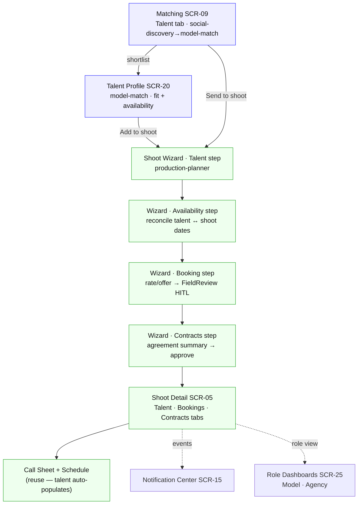
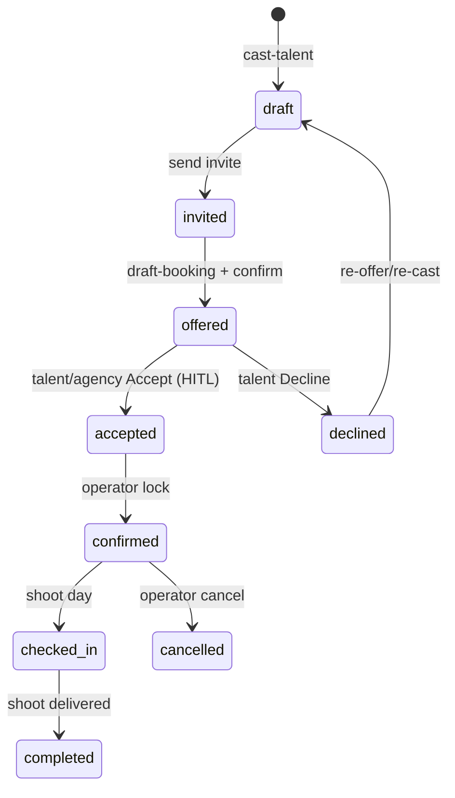
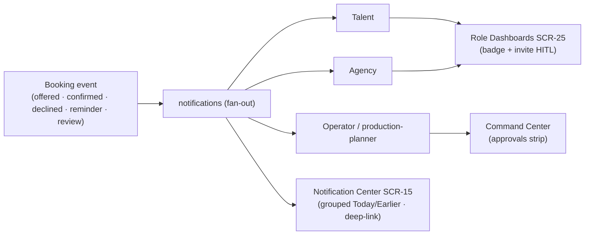

# Model Booking — Engineering Handoff (for Claude Code)

> 🕰 **ARCHIVED / SUPERSEDED ON KEY FACTS (2026-07-03).** Authoritative sources are now `02-engineering-reference.md` (D1–D9) + `00-model-booking-plan.md` §0.-1. This doc's fold-in framing (one agent, no standalone booking screens) is **overridden** — see the banner already inside. Kept as a first-pass sketch; **do not implement from it.**
>
> Companion to `00-model-booking-plan.md` (design) — the **implementation blueprint** for the booking work that folds into the Shoot lifecycle (see §0.0 there). **Extends**, does not replace, the existing runtime contracts: `../handoff/14-ai-runtime-contract.md` (AI runtime, CopilotKit, Mastra, approval SM, Supabase ownership) and `../handoff/06-ai-workflows.md` (agents, docks, HITL). Where a matrix already exists there, this doc only adds the **booking rows**.
>
> Grounding rule (same as doc 14): columns are correct and grounded in the known agent map + built prototypes; exact Supabase tables/RLS, Mastra tool signatures, and CopilotKit tool registration are **_TBD_ against the live repo** (`route-agent-map.ts`, `mastra/`, Supabase schema). Do not treat _TBD_ as final.
>
> **No new screens** — booking extends SCR-05 Shoot Detail + SCR-06 Shoot Wizard. **No new agent beyond `model-match`** — booking is owned by `production-planner`.

> ⛔ **SUPERSEDED ON KEY FACTS (2026-07-03) by `02-engineering-reference.md` (D1–D9 approved).** This doc's speculative model conflicts with the shipped backend; **02-reference wins.** Corrections: (1) **status enum** is `requested → quoted → approved → confirmed` (+declined/expired/cancelled), RPC-only writes, service-role confirm — **not** the `draft→invited→…` sketch below; (2) there **is** a separate **`booking`** agent (D7), not "folded into production-planner"; (3) **Booking Wizard/Detail are standalone routes** (`/app/matching/talent/:id/book`, `/app/bookings/:id`), with Shoot integration limited to a `shoot_crew` upsert on confirm + inline crew-row accordion; (4) **Contracts are deferred** (D8) — remove from MVP; (5) **agent chat = `OperatorChatDock`** (D9). Treat the sections below as a first-pass sketch; use `02-engineering-reference.md` for anything you build against.

---

## 1. End-to-end booking flow (screens + agents)



Blue = `model-match` (discovery/ranking). Green = `production-planner` (booking lifecycle). One handoff point: shortlist/profile → Wizard Talent step.

---

## 2. AI Runtime Matrix — booking rows (extends doc 14 §1)

| Screen / step | Agent | Workflow (Mastra) | HITL? | Reads → Writes (Supabase) | UI update |
|---|---|---|:--:|---|---|
| Matching · Talent tab | model-match | `rank-talent` | approve invite | `talent,shortlists,invites` → `shortlists,invites` | Save/Invite toast; Shortlist drawer |
| Talent Profile | model-match | `explain-fit` (read) | n/a | `talent,talent_availability,reviews` → — | fit EvidenceBlock; availability tab |
| Wizard · Talent step | production-planner | `cast-talent` | approve add | `shortlists,talent` → `bookings(draft)` | talent cards added to shoot |
| Wizard · Availability step | production-planner | `reconcile-availability` (read) | n/a | `talent_availability,shoots` → `bookings.hold` | conflict/hold indicators |
| Wizard · Booking step | production-planner | `draft-booking` | **FieldReview per field** + confirm | `talent,shoots,budget` → `bookings` | per-field HITL → offer |
| Wizard · Contracts step | production-planner | `draft-contract` | approve | `bookings` → `contracts` | agreement summary → sign stub |
| Detail · Bookings tab | production-planner | `update-booking` | ApprovalCard (offer→confirm) | `bookings,approvals,activity` → same | ApprovalCard resolves; status chip |
| Detail · Talent tab | production-planner | (read) | n/a | `bookings,talent` → — | booked-talent list + status |
| Detail · Contracts tab | production-planner | (read/sign) | confirm sign | `contracts` → `contracts` | status: draft→signed |
| Role Dashboards | production-planner (role-scoped) | (read) | Accept/Decline (talent) | `bookings,talent_availability,contracts` → `bookings` | invite HITL; earnings |

**Durability:** booking workflows ride the **durable `draft-shoot`** lineage (production-planner) — resumable stream. `rank-talent`/`explain-fit` are **non-durable** (model-match, like social-discovery) → error + retry, no resumable stream.

---

## 3. Mastra workflow map — booking (extends doc 14 §3)

| Workflow | Agent | Input | Output (draft) | Approval | Commit target |
|---|---|---|---|:--:|---|
| `rank-talent` | model-match | shoot brief + talent pool | ranked fit list + evidence | approve invite | `shortlists,invites` |
| `explain-fit` | model-match | talent + brand DNA | fit % + pillar evidence | n/a (read) | — (EvidenceBlock) |
| `cast-talent` | production-planner | shortlist + shoot | talent attached to shoot | approve add | `bookings(status=draft)` |
| `reconcile-availability` | production-planner | talent availability + shoot dates | conflicts + suggested holds | n/a (read) | `bookings.hold` |
| `draft-booking` | production-planner | talent + dates + budget | rate · dates · deliverables (AI-drafted) | **FieldReview** per field + confirm | `bookings(status=offered)` |
| `draft-contract` | production-planner | confirmed booking | agreement summary + terms | approve | `contracts` |
| `update-booking` | production-planner | booking + action | status transition draft | ApprovalCard | `bookings` |

New agent registration: **`model-match`** → Matching Talent tab + Talent Profile (non-durable). Add to `route-agent-map.ts`. `booking` agent is **not** created — folded into `production-planner`.

---

## 4. CopilotKit interaction map — booking screens (extends doc 14 §2)

| Screen / step | Agent | Readable state | Writable (draft-only) | Interrupt | Approval | Tools (_TBD_ vs `mastra/`) |
|---|---|---|---|:--:|:--:|---|
| Matching · Talent | model-match | talent list, shortlist, brief | shortlist/invite draft | ✅ | ✅ | `rank-talent`, `add-to-shortlist` |
| Talent Profile | model-match | talent, fit, availability | — (read) | ✅ | — | `explain-fit`, `add-to-shoot` |
| Wizard · Talent | production-planner | shortlist, shoot brief | talent-on-shoot draft | ✅ | ✅ add | `cast-talent` |
| Wizard · Availability | production-planner | talent availability, shoot dates | hold draft | ✅ | — | `reconcile-availability` |
| Wizard · Booking | production-planner | talent, dates, budget | booking draft (rate/dates) | ✅ | ✅ **FieldReview+confirm** | `draft-booking` |
| Wizard · Contracts | production-planner | booking | contract draft | ✅ | ✅ | `draft-contract` |
| Detail · Bookings | production-planner | bookings | status-transition draft | ✅ | ✅ | `update-booking` |

**Global rule (unchanged, doc 14 §2):** agent may **draft**, never **commit** without HITL. The Booking step uses **`FieldReview`** (per-field gate, built in SCR-24) *plus* a final confirm; all other commits use **ApprovalCard**.

---

## 5. Supabase ownership — booking objects (extends doc 14 §6)

| Object | System of record | Agent may write | User may write | Notes |
|---|---|:--:|:--:|---|
| Talent (canonical) | `talent` | ❌ (read) | ✅ (talent/agency owner) | model-match never edits canonical talent |
| Talent availability | `talent_availability` | ✅ hold draft | ✅ (talent) | 4 states: available·held·booked·unavailable |
| Shortlist / Invite | `shortlists,invites` | ✅ Draft | ✅ send | already in doc 14; talent variant here |
| Booking | `bookings` | ✅ Draft/Offer | ✅ confirm | `status` enum per §12.1 (`draft→invited→offered→accepted→confirmed→checked_in→completed` +declined/cancelled) |
| Contract | `contracts` | ✅ Draft | ✅ sign | MVP: summary + e-sign stub, no legal engine |
| Notification | `notifications` | ✅ create | ✅ read/dismiss | fan-out to talent/agency/operator |
| Review | `reviews` | ❌ | ✅ (post-shoot) | powers Talent Profile rating |

**RLS (per doc 14 §4):** agents write **Draft/Review only**; `confirmed`/`signed` require an approving user id. Talent may write **only their own** availability + accept/decline their own bookings.

---

## 6. Booking status ↔ shoot lifecycle state machine

Every booking references the shoot lifecycle; its own sub-status maps onto the AI approval SM (doc 14 §4).

> Canonical enum defined in **§12.1** — this diagram uses it.



**Shoot lifecycle (canonical — reference everywhere):**
`draft → planning → casting → booking → confirmed → call_sheet → shoot_live → editing → delivered → archived`

Booking sub-status → shoot phase: `draft/invited`=casting · `offered/accepted`=booking · `confirmed/checked_in`=confirmed → feeds `call_sheet`. Booking sub-status → approval SM (doc 14 §4): see §12.1 table.

---

## 7. Notification lifecycle (booking events → SCR-15)



Realtime via Supabase subscription on `notifications`. Each row deep-links to its source (Shoot Detail Bookings tab / Talent Profile). **No new notification screen** — SCR-15 owns rendering.

---

## 8. Dashboard integration (what each surface updates from)

| Surface | Updates from | HITL |
|---|---|:--:|
| Command Center (operator) | `bookings`(offered/pending), `shoots`, `approvals` | approve offer |
| Shoot Detail · Bookings tab | `bookings`, `activity` | offer→confirm ApprovalCard |
| Model Dashboard (SCR-25) | `bookings`(mine), `talent_availability`, `contracts`, `reviews` | Accept/Decline invite |
| Agency Dashboard (SCR-25) | `bookings`(roster), pipeline(offered/confirmed), utilisation | offers-awaiting |
| Notification Center (SCR-15) | `notifications` | dismiss |

---

## 9. AI workflow ownership (agent → owns)

| Agent | Owns | Durable? |
|---|---|:--:|
| **production-planner** | shoot, casting, booking, availability-reconcile, contract, call sheet, schedule | ✅ |
| **model-match** (new) | talent ranking, fit score/evidence, recommendations | ❌ |
| brand-intelligence | brand brief + DNA (shoot input) | ❌ |
| creative-director | moodboard, asset/DNA match | ✅ |
| visual-identity | channel readiness | (confirm) |

One new agent (`model-match`); everything booking-write is `production-planner`.

---

## 10. API contract checklist (per booking capability)

Each capability must trace the full loop before it's "done":

`API route → Mastra workflow → Agent → Supabase (RLS) → UI state → EvidenceBlock/FieldReview → Approval → commit`

- [ ] **BK-1** `rank-talent` — API + tool schema; writes `shortlists`; UI = Shortlist drawer; approval = invite.
- [ ] **BK-2** `explain-fit` — read-only; UI = EvidenceBlock ("Explain fit score"); no commit.
- [ ] **BK-3** `cast-talent` — shortlist→`bookings(draft)`; UI = Wizard Talent step; approval = add.
- [ ] **BK-4** `reconcile-availability` — read `talent_availability`; UI = Availability step conflicts/holds.
- [ ] **BK-5** `draft-booking` — `bookings(offered)`; UI = Booking step; approval = **FieldReview per field + confirm**.
- [ ] **BK-6** `draft-contract` — `contracts`; UI = Contracts step/tab; approval = sign.
- [ ] **BK-7** `update-booking` — status transitions; UI = Detail Bookings tab; approval = ApprovalCard.
- [ ] **BK-8** `notifications` fan-out + realtime; UI = SCR-15 + dashboard badges.
- [ ] **BK-9** Register `model-match` in `route-agent-map.ts`; confirm non-durable + retry.
- [ ] **BK-10** RLS: talent writes own availability + own accept/decline only; `confirmed`/`signed` need approver id.

---

## 11. Frontend / React implementation order (Claude Code)

Extends `../handoff/10-implementation-order.md` — booking is a phase, not a new app.

1. **Routes/params** — `/app/matching?tab=talent`, `/app/matching/talent/[id]`, `/onboarding/talent`, `/app/shoots/[id]?tab=bookings`, Wizard step params.
2. **Reuse shell** — no new layout; SCR-05/06 already on OperatorShell.
3. **Shared components** — port `FieldReview` (from SCR-24) + reuse `ApprovalCard`, `EvidenceBlock`, `StatusChip`, Call Sheet, Schedule.
4. **Wizard steps** — Talent → Availability → Booking (FieldReview) → Contracts, into existing step state.
5. **Detail tabs** — Talent · Bookings (ApprovalCard) · Contracts, into existing tab state.
6. **Matching Talent tab + Shortlist "Send to shoot"** deep-link.
7. **Talent Profile CTA** → "Add to shoot" (D-MB9).
8. **Dashboards (SCR-25)** — role-scoped booking views.
9. **Agents** — register `model-match`; wire booking workflows to `production-planner`.
10. **Realtime** — Supabase subscriptions (`bookings`, `notifications`).
11. **Testing** — status-machine transitions, FieldReview gate, RLS (talent scope), notification fan-out.

---

## 12. Build-readiness corrections

> Reconciles the handoff for code build. These override earlier drafts where they conflict.

### 12.1 Canonical booking status enum (single source of truth)

> ⛔ **CORRECTED per `02-engineering-reference.md` §5.1 (D1–D9).** The real shipped FSM is:

```
requested → quoted → approved → confirmed
   ↘ declined   ↘ declined      ↘ cancelled
   ↘ expired    ↘ cancelled
   ↘ cancelled  ↘ requested (reschedule reset)
```

- Terminal: `declined`, `expired`, `cancelled`. `confirmed` cannot revert.
- **Writes are RPC-only:** `create_booking_request` (→`requested`), `transition_booking` (all others). **`confirmed` is set only by `confirm_booking` (service_role) via `POST /api/bookings/[id]/approve`.** AI never confirms.
- `requested` bookings **expire in 72h** (hourly cron). Optimistic lock: `bookings.version` → `stale_booking` (409).
- Side effects per transition (notification · availability hold · shoot crew) and the full invalid-transition + error-code tables are in `02-engineering-reference.md` §5.1/§5.5/§9.

*(The earlier `draft→invited→offered→accepted→confirmed→checked_in→completed` sketch is retired — it was never the shipped model.)*

### 12.2 route-agent-map entries (exact)

Add to `route-agent-map.ts`:

| Route | Agent | Durable? |
|---|---|:--:|
| `/app/matching` (`?tab=talent`) | `model-match` (Talent tab) · `social-discovery` (other tabs) | ❌ |
| `/app/matching/talent/[id]` | `model-match` | ❌ |
| `/onboarding/talent` | `brand-intelligence` | ❌ |
| `/app/shoots/new` (Talent/Availability/Booking/Contracts steps) | `production-planner` | ✅ |
| `/app/shoots/[id]` (`?tab=bookings`) | `production-planner` | ✅ |
| `/app/model` · `/app/agency` | `production-planner` (role-scoped) | ✅ |

### 12.3 BK → D-MB → Linear (IPI) mapping

| BK | Capability | Design task | Linear |
|---|---|---|---|
| BK-1 | `rank-talent` | D-MB8 | IPI-308 |
| BK-2 | `explain-fit` | D-MB9 (SCR-20) | IPI-309 |
| BK-3 | `cast-talent` | D-MB1 | IPI-311 |
| BK-4 | `reconcile-availability` | D-MB2 | IPI-309 |
| BK-5 | `draft-booking` | D-MB3 | IPI-311 |
| BK-6 | `draft-contract` | D-MB4 / D-MB7 | IPI-311 |
| BK-7 | `update-booking` | D-MB5 / D-MB6 | IPI-312 |
| BK-8 | `notifications` fan-out | D-MB10 | IPI-310 |
| BK-9 | register `model-match` | D-MB8 (dep) | IPI-308 |
| BK-10 | RLS / talent scope | D-MB1–7 (dep) | IPI-311 |

### 12.4 MVP vs later split

| Scope | Includes |
|---|---|
| **MVP** | Talent tab discovery (BK-1/2/9) · cast + availability + booking (BK-3/4/5) · Detail Talent/Bookings tabs (BK-7) · status enum §12.1 · **poll/refresh** notifications (BK-8 without realtime) |
| **Phase 2** | Contracts step/tab + e-sign stub (BK-6) · Role Dashboards (D-MB11) · **Supabase realtime** subscriptions (`bookings`, `notifications`) |
| **Phase 3+** | Payments · agency multi-seat · calendar sync · advanced availability rules |

> **Realtime moved out of MVP** (§7/§11 note): ship poll-on-focus refresh first; realtime is a Phase-2 enhancement, not a build blocker.

### 12.5 Supabase schema TODO (code-build blockers)

Not design blockers — required before the React build:

- [ ] **DB-1** `talent` (canonical; owner = talent/agency) + `talent_availability` (4-state, per-day).
- [ ] **DB-2** `bookings` with `status` enum §12.1, `shoot_id`, `talent_id`, `rate`, `dates`, `created_by`, `confidence`, `evidence`.
- [ ] **DB-3** `contracts` (booking_id, summary, terms, signed_at) — MVP stub.
- [ ] **DB-4** `notifications` (recipient, type, source_ref, read_at) + fan-out.
- [ ] **DB-5** RLS: talent writes **own** availability + own accept/decline; `confirmed`/`checked_in`/`signed` require operator/approver id; agents write Draft/Review only.
- [ ] **DB-6** Reuse existing `shortlists,invites,reviews`; confirm columns cover talent variant.

---

## Cross-references
- Design rationale + screen changes: `00-model-booking-plan.md` §0.0
- Canonical screen IDs: `../handoff/SCREEN-REGISTRY.md`
- Existing AI runtime/CopilotKit/Mastra/Supabase contract: `../handoff/14-ai-runtime-contract.md`
- Agents, docks, HITL, EvidenceBlock: `../handoff/06-ai-workflows.md`
- Tasks D-MB1–11: `../design/DESIGN-TASKS.md`
