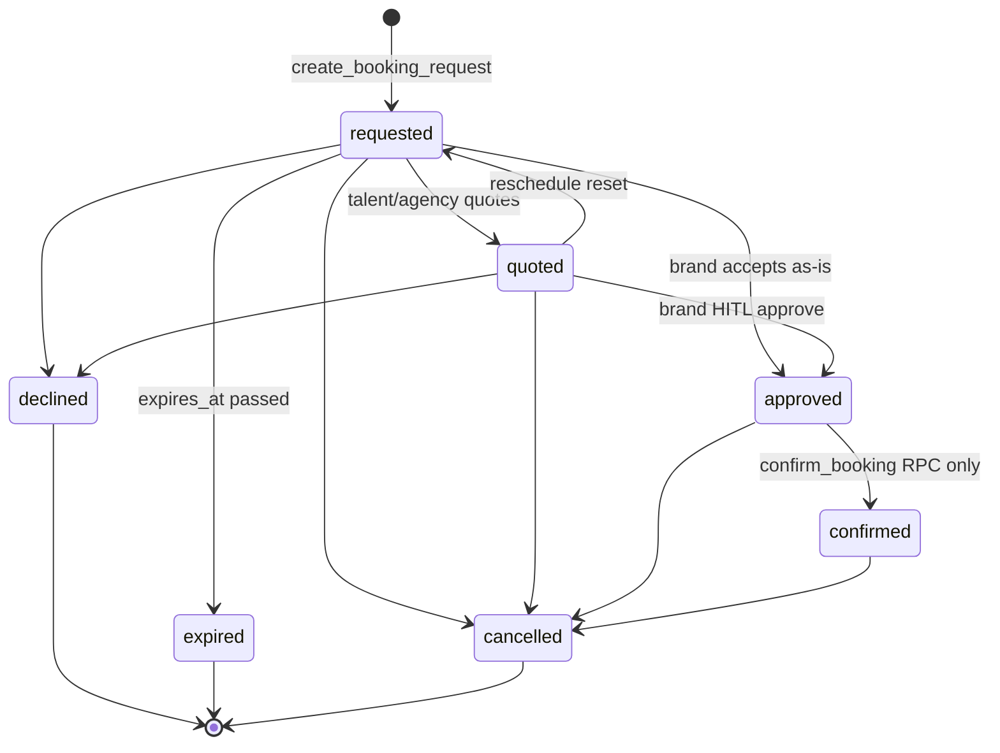
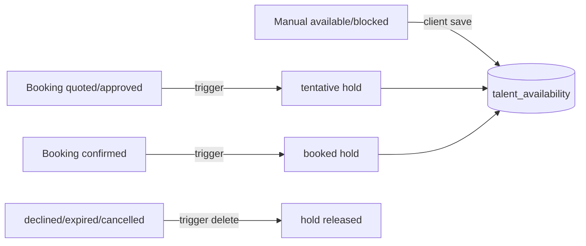
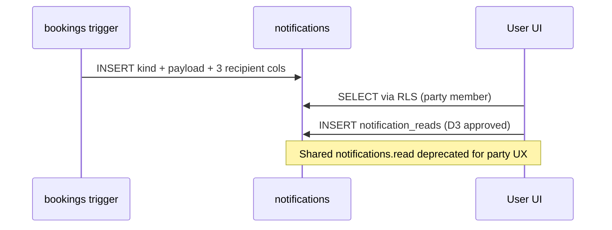

# Model Booking — Design Engineering Reference

**Status:** Reference gate — **D1–D9 approved 2026-07-03**
**Updated:** 2026-07-03
**Audience:** Claude Design sessions (`11-model-booking.md` + `11a`–`11g`)
**Engineering specs:** `../engineering/` — do not load for HTML prototypes unless debugging a backend fact

| This document **is** | This document **is not** |
|----------------------|--------------------------|
| Engineering reality for design prompts | An implementation plan — see `../engineering/implementation-plan.md` |
| Business rules + lifecycle + AI boundaries | API/RPC contracts — see `../engineering/api-contracts.md` |
| Design dependencies per prompt file | SQL migrations or test scripts |

**Do not modify** design prompt files (`11a`–`11g`). When design prompts conflict with this document, **this document wins** for engineering facts.

> **Authority note (added on save):** this reference supersedes the earlier "fold everything into the Shoot lifecycle / drop the booking agent / one canonical status enum" reconciliation in `00-model-booking-plan.md` §0.0 and `01-model-booking-engineering-handoff.md`. Where they conflict, **D1–D9 + §2 status flags below win.** The affected plan docs have been reconciled to this reference (see `00-model-booking-plan.md` §0.-1).

---

## 1. MVP architecture summary (read this first)

**Engineering Reference v1.0 · updated 2026-07-03.** Dependent docs must state "Aligned with Engineering Reference v1.0".

### Document authority (highest wins on conflict)
1. **`02-engineering-reference.md`** (this file) — engineering facts
2. `00-model-booking-plan.md` — design plan
3. `01-model-booking-engineering-handoff.md` — first-pass handoff sketch
4. Design screens (`11a`–`11g`, DC prototypes)
5. Implementation (React/RPC)

### What exists today vs later

```
MVP ARCHITECTURE (today)
AI
├─ model-match ....... 🟢 BUILT  (search · rank · explain fit · shortlist) — never writes bookings
└─ booking .......... 🔴 DESIGNED, NOT BUILT (D7) — draft quotes/messages only, never confirms
   production-planner  🟢 owns shoots (not bookings)
Database
├─ Talent ........... 🟢   ├─ Availability ... 🟢
├─ Bookings ......... 🟢   └─ Notifications .. 🟢 (insert only)
DEFERRED / NOT BUILT
├─ booking agent registration · booking CRUD RPCs · /api/bookings/**
├─ bookings.version · notification_reads · list/mark-read RPCs
└─ Contracts · Payments · pgvector search
```

> **Booking-agent decision is settled:** a **separate `booking` agent** is the approved target (D7). It is **not yet built** (registry has `model-match` only). Any earlier note about "folding booking into `production-planner` / dropping the booking agent" is **retired** — do not follow it.

### Route ownership

| Route | Owner agent | Workflow |
|---|---|---|
| `/app/matching` (`?tab=talent`) | `model-match` 🟢 | search/rank/explain talent |
| `/app/matching/talent/:id` | `model-match` 🟢 | profile + fit |
| `/app/matching/talent/:id/book` | `booking` 🔴 | draft booking request |
| `/app/bookings/:id` | `booking` 🔴 | booking lifecycle (draft only) |
| `/app/model` · `/app/roster` | `booking` 🔴 (role-scoped) | talent/agency views |
| `/app/shoots/:id` | `production-planner` 🟢 | shoot execution + crew |

### Supabase status

| Feature | Status |
|---|:--:|
| Talent · Availability · Bookings · Status history | 🟢 built |
| Notifications (insert/trigger) | 🟢 built |
| `notification_reads` (per-user read) · booking CRUD/list RPCs · `bookings.version` | 🔴 planned |
| Contracts · Payments · pgvector | ⚪ deferred |

### Build-order dependency (do not invert)

```
Database → RPCs → API routes → React UI
Talent → Availability → Booking → Approval(confirm) → Shoot Crew → Call Sheet
```

### Implementation matrix

| Layer | Design | Backend | Frontend | Status |
|---|:--:|:--:|:--:|:--:|
| Matching / Talent tab | ✅ | 🟢 | 🟡 | in progress |
| Talent Profile | ✅ | 🟡 | 🔴 | planned |
| Booking Wizard | ✅ | 🔴 | ⚪ | planned |
| Booking Detail | ✅ | 🟡 | ⚪ | planned |
| Shoot integration (crew) | ✅ | 🟢 | 🟡 | partial |
| Notifications | ✅ | 🟡 | 🔴 | partial |
| Contracts | — | ⚪ | ⚪ | deferred |

---

## 2. Engineering reality

Legend: 🟢 shipped · 🟡 partial / planned · 🔴 not built · ⚪ deferred / N/A

### 2.1 Summary matrix

| Layer | Status | Notes |
|-------|--------|-------|
| **Database** | 🟡 | Core tables shipped (Talent, Availability, Bookings, Status history, Notifications); **missing:** `bookings.version`, `notification_reads`, `booking_contracts` |
| **RPCs** | 🟡 | Discovery + confirm + expiry live; booking CRUD/transition/list RPCs spec-only |
| **AI agents** | 🟡 | `model-match` 🟢 (3 tools); `booking` 🔴; URL-Context tools 🔴 |
| **Notifications** | 🟡 | Trigger inserts work; per-user read model 🔴; list/mark-read RPCs 🔴 |
| **Availability** | 🟢 | Trigger-derived holds + RLS tamper guards; client manual `available`/`blocked` only |
| **Booking workflow** | 🟡 | Schema + confirm path 🟢; wizard/detail API + transition RPCs 🔴 |
| **Contracts** | ⚪ | Post-MVP (`BOOK-204`) — no table |
| **Authentication** | 🟢 | Supabase PKCE; `withOperatorAuth` on API routes; RPCs require `auth.uid()` |
| **RLS** | 🟢 | 68/68 verify-rls green; `talent` schema isolated like `shoot` |

### 2.2 Database

| Item | Status |
|------|--------|
| `talent.talent_profiles` | 🟢 |
| `talent.agency_talent` | 🟢 |
| `talent.talent_availability` | 🟢 |
| `talent.bookings` | 🟢 |
| `talent.booking_status_history` | 🟢 |
| `talent.talent_profile_sources` | 🟢 |
| `talent.talent_shortlists` / `talent_shortlist_items` | 🟢 |
| `public.notifications` | 🟢 |
| GIST EXCLUDE on `confirmed` bookings | 🟢 |
| `bookings.version` (optimistic lock) | 🔴 planned |
| `notification_reads` junction | 🔴 planned |
| `talent.booking_contracts` | ⚪ deferred |

### 2.3 RPCs

| RPC | Status |
|-----|--------|
| `search_talent` | 🟢 |
| `get_or_create_shortlist` | 🟢 |
| `toggle_shortlist_item` | 🟢 |
| `confirm_booking` | 🟢 (`service_role` only) |
| `expire_stale_bookings` | 🟢 (pg_cron hourly) |
| `talent.compute_rate_tier` | 🟢 internal |
| `create_booking_request` | 🔴 spec |
| `transition_booking` | 🔴 spec |
| `get_booking` | 🔴 spec |
| `list_bookings` | 🔴 spec |
| `list_notifications` | 🔴 spec |
| `mark_notifications_read` | 🔴 spec |

### 2.4 AI agents

| Agent / tool | Status |
|--------------|--------|
| `model-match` agent | 🟢 registered in `app/src/mastra/index.ts` |
| `searchTalentByFilters` | 🟢 |
| `computeTalentMatchScore` | 🟢 |
| `manageShortlist` | 🟢 |
| `booking` agent | 🔴 not registered |
| `checkTalentAvailability` | 🔴 spec |
| `draftBookingQuote` | 🔴 spec |
| `createBookingDraft` | 🔴 spec |
| URL-Context profile extraction tool | 🔴 spec (pattern exists in brand onboarding) |
| pgvector / embedding search | ⚪ post-MVP (`BOOK-201`, IPI2-123) |

### 2.5 Notifications

| Item | Status |
|------|--------|
| Trigger fan-out on booking lifecycle | 🟢 |
| In-app `channel = in-app` only | 🟢 |
| Shared `read` flag (all parties) | 🟡 **gap** — design must not assume per-user read until D3 |
| Idempotency keys on insert | 🔴 planned |
| Email / push delivery queue | ⚪ post-MVP |
| Bell icon + slide-over panel | 🔴 UI not built (IPI-310) |

### 2.6 Availability

| Item | Status |
|------|--------|
| Trigger upsert `tentative`/`booked` from booking status | 🟢 |
| Client insert/update `available`/`blocked` only (`booking_id IS NULL`) | 🟢 |
| Client delete blocked when `booking_id` set | 🟢 |
| `search_talent.is_available` heuristic | 🟢 |
| Availability editor API (batch save RPC) | 🔴 direct table writes via RLS today |

### 2.7 Booking workflow

| Item | Status |
|------|--------|
| Status trigger → history + availability + notification | 🟢 |
| `confirm_booking` → `shoot.shoot_crew` attach | 🟢 |
| `/api/bookings/**` routes | 🔴 |
| Booking Wizard route `/app/matching/talent/:id/book` | 🔴 |
| Booking Detail route `/app/bookings/:id` | 🔴 |
| Inline booking on Shoot Detail crew row | 🔴 |
| Optimistic locking on concurrent edits | 🔴 |

### 2.8 Contracts

| Item | Status |
|------|--------|
| Legal/compliance sign-off | ⚪ not started |
| `booking_contracts` table | ⚪ deferred |
| Payment / escrow states | ⚪ out of MVP scope |

### 2.9 Authentication

| Item | Status |
|------|--------|
| Operator login (Supabase PKCE) | 🟢 |
| `withOperatorAuth` on privileged API routes | 🟢 pattern (`/api/shoots/commit`) |
| Brand org context (`/api/org/current`) | 🟢 used by Talent tab |
| Role-scoped nav (`model` / `agency`) | 🔴 `NavSidebar` has no `role` prop |
| Agency-managed talent (no independent login) | 🟢 schema supports `agency_org_id` without `profile_id` |
| Mastra tools use user JWT via `requestToken` | 🟢 required for RPC `auth.uid()` |

### 2.10 RLS

| Item | Status |
|------|--------|
| Party model: brand org · talent `profile_id` · agency org | 🟢 |
| `is_org_member` / profile ownership checks | 🟢 |
| Clients cannot set `bookings.status = confirmed` | 🟢 |
| Clients cannot insert notifications | 🟢 |
| `talent.*` not exposed via PostgREST — RPC bridge only | 🟢 |
| `verify-rls` CI gate | 🟢 68/68 |

### 2.11 Design-prompt corrections (common stale assumptions)

Several design prompts still say "not built" for items that **are** live. Design sessions must use this table:

| Design prompt claim | Engineering reality |
|---------------------|---------------------|
| "`model-match` not built" | 🟢 **Built** — agent + 3 tools + `/app/matching` route map |
| "`/app/matching` placeholder only" | 🟡 **Partial** — tab shell + Talent tab + shortlist drawer exist; profile/booking routes 🔴 |
| "CopilotKit in `IntelligencePanel`" | 🟡 **Wrong placement** — agent chat is **`OperatorChatDock`** (center bottom); `IntelligencePanel` is brand briefing (IPI-243), not chat |
| "Notifications inserted by API (MODEL-023a)" | 🟢 **Obsolete** — DB trigger owns booking lifecycle notifications |
| "`search_talent` in client types" | 🔴 **`supabase:types` stale** — RPC works at runtime; types not regenerated |

---

## 3. Business rules & design constraints

Design screens must respect these rules. Each item includes the **design implication** for prototypes.

### 3.1 Optimistic locking (approved — D1)

- Bookings **must** ship with a `version` integer incremented on each successful write before `/api/bookings/**` routes go live.
- UI sending quote/counter/reschedule must pass `expected_version`; mismatch → **`stale_booking`** (409).
- **Design implication:** Show "This booking was updated elsewhere — refresh" on conflict; never silently overwrite.

### 3.2 Booking conflicts (double-book)

- Only **`confirmed`** bookings participate in the GIST EXCLUDE constraint (same talent + overlapping dates).
- Two overlapping **`approved`** bookings can coexist; only one **`confirm_booking`** succeeds.
- **Design implication:** On approve/confirm failure (409), show *"Talent already confirmed for overlapping dates"* — not a generic error. Optional warning before confirm if another approved booking exists (future UX).

### 3.3 Stale updates

- Direct client UPDATE on `bookings` is allowed by RLS for parties but **does not enforce FSM** — production path will be `transition_booking` RPC.
- Date-only changes while `requested` fire `reschedule_requested` notification without a status history row (by design).
- **Design implication:** Date tweaks while `requested`/`quoted` show a **`reschedule` history row** (D5 approved) plus `reschedule_requested` notification.

### 3.4 Approval workflow (human-in-the-loop)

| Action | Who | Path |
|--------|-----|------|
| Send booking request | Brand | `create_booking_request` → `requested` |
| Quote / counter | Talent or agency | `transition_booking` → `quoted` |
| Approve quote | Brand | `transition_booking` → `approved` |
| **Confirm booking** | Brand (operator gate) | **`POST /api/bookings/[id]/approve`** → `confirm_booking` RPC (`service_role`) |
| Decline / cancel | Either party | `transition_booking` + required `cancellation_reason` on cancel |

- **AI never confirms.** `booking` agent may draft quotes/messages only.
- **Design implication:** No "AI confirmed your booking" copy; confirm button is explicit brand action after `approved`.

### 3.5 Availability locking

| Status | Who writes | UI behavior |
|--------|------------|-------------|
| `available` / `blocked` | Talent/agency manual | Availability Editor — explicit Save |
| `tentative` | DB trigger from booking | Read-only amber on calendar |
| `booked` | DB trigger from `confirmed` | Read-only; click → Booking Detail |

- Manual toggle **never** sets `tentative` or `booked`.
- Delete of trigger-owned rows is **denied by RLS**.
- **Design implication:** Calendar legend must distinguish manual blocked vs booking-held states.

### 3.6 Notification timing

- Notifications insert **synchronously in the same transaction** as booking status trigger — no delay queue for in-app.
- `expires_at` default **72 hours** on new `requested` bookings; hourly cron sets `expired`.
- **Design implication:** "Expires {date}" on `requested` detail is real; expiry is not a button — it appears as timeline + notification.

### 3.7 AI approval boundaries

| Allowed | Forbidden |
|---------|-----------|
| Fit score + `EvidenceBlock` rationale (`computeTalentMatchScore`) | Auto-shortlist without user action |
| Draft rate range suggestion | Auto-send booking request |
| Draft counter-quote text for human review | Set `status = confirmed` |
| URL-Context field extraction with per-field confidence | Persist profile fields without HITL approve |

### 3.8 Schema access pattern

- Browser and Mastra tools call **`public.*` RPCs** — not direct `talent.*` PostgREST.
- **`confirm_booking`** is **`service_role` only** — never callable from browser Supabase client.

### 3.9 Shoot integration

- Confirmed booking upserts **`shoot.shoot_crew`** with `talent_profile_id` + `confirmed = true`.
- Booking may link `shoot_id` at creation or later; identity columns (`brand_org_id`, `talent_profile_id`, `shoot_id`) are **immutable** after insert.
- **Design implication:** Shoot Detail crew row appears only after **`confirmed`**, not `approved`.

---

## 5. Lifecycles

### 5.1 Booking lifecycle



**Invalid transitions (must show error in UI, not offered as buttons):**

| From | Invalid targets | User message |
|------|-----------------|--------------|
| `declined` | any | Terminal — send new request |
| `expired` | any except new booking | Terminal — send new request |
| `cancelled` | any | Terminal |
| `confirmed` | `requested`, `quoted`, `approved` | Cannot revert confirmation |
| any | `confirmed` via direct update | Must use Approve API |

**Retry scenarios:**

| Scenario | Behavior |
|----------|----------|
| Double-click Send request | Idempotent if client dedupes; else duplicate `requested` rows possible until `create_booking_request` adds idempotency — **design: disable button after submit** |
| Double-click Approve (confirm) | `confirm_booking` returns `already_confirmed: true` — safe |
| Parallel confirm two overlapping approved | One wins; other gets 409 overlap |
| Approve while other party cancels | First commit wins; second gets `invalid_transition` or stale row |
| Expiry during active quote session | Cron moves to `expired`; user's submit fails with terminal state message |

### 5.2 Availability lifecycle



- Overlapping manual `available` rows allowed; search uses NOT EXISTS blocked/tentative/booked heuristic.
- **`booked`** row deep-links to Booking Detail — not editable in Availability Editor.

### 5.3 Notification lifecycle



**Event kinds (MVP):** `booking_requested`, `reschedule_requested`, `booking_quoted`, `booking_approved`, `booking_confirmed`, `booking_declined`, `booking_expired`, `booking_cancelled` · future: `profile_incomplete`, `portfolio_needs_update`, `shoot_reminder`.

### 5.4 Audit / history

| Event | Source | Visible in timeline |
|-------|--------|---------------------|
| Status change | Trigger | Yes — `status_change` |
| System expiry | Trigger | Yes — `system_expired` |
| User message | Client INSERT | Yes — `message` |
| Date-only reschedule while `requested`/`quoted` | Trigger | **`reschedule` event** (D5 approved) + notification |

Append-only — no UPDATE/DELETE on `booking_status_history`.

### 5.5 Status → side effects (design-visible)

| Transition | Notification | Availability hold | Shoot crew |
|------------|--------------|-------------------|------------|
| → `requested` | `booking_requested` | none | none |
| → `quoted` | `booking_quoted` | `tentative` | none |
| → `approved` | `booking_approved` | `tentative` | none |
| → `confirmed` | `booking_confirmed` | `booked` | upsert crew |
| → `declined` / `expired` / `cancelled` | matching kind | release hold | none |

---

## 6. Architecture (component roles)

### 6.1 Component roles

| Piece | Responsibility | Model Booking usage |
|-------|----------------|---------------------|
| **Mastra** | Agent registry, tools, server-side Gemini calls | `model-match` 🟢 · `booking` 🔴 |
| **CopilotKit v2** | Runtime at `/api/copilotkit`; `CopilotChat` in shell | Route-resolved agent via `resolveAgentId` |
| **Gemini** | Structured output, URL Context (future) | Fit scores, profile extraction, rate suggestions |
| **URL Context** | Gemini tool fetching external profile URLs | Profile creation (`11f`) — **not wired for talent yet** |
| **pgvector** | Embedding similarity | ⚪ post-MVP — MVP is filter RPC only |
| **EvidenceBlock** | Canonical AI explainability UI | Fit score + why — **must** use tool output |
| **IntelligencePanel** | Brand intelligence briefing (right column) | **Not agent chat** — static/summary data |
| **OperatorChatDock** | Agent chat (center bottom) | **Actual CopilotKit surface** on shell screens |

### 6.2 Agent registry (must stay in sync)

| Registry key | Route prefix | Tools | Writes bookings? |
|--------------|--------------|-------|------------------|
| `model-match` | `/app/matching` | search, score, shortlist | **Never** |
| `booking` | `/app/matching/talent/*/book`, `/app/bookings/*`, `/app/model`, `/app/roster` | availability check, draft quote, create draft | **Draft only** — confirm is API |
| `production-planner` | `/app/shoots` | shoot tools | N/A |

CopilotKit `useAgent({ agentId })` must match Mastra `id` and `app/src/mastra/index.ts` registry key.

### 6.3 Auth token flow for tools

Mastra tools calling RPCs use **`requestToken` AsyncLocalStorage** + user-scoped Supabase client — same pattern as `brand-intelligence-tools.ts`. Service-role client **cannot** call `search_talent` (no `auth.uid()`).

### 6.4 Shoot workflow parallel

Shoot commit uses **`POST /api/shoots/commit`** → `withOperatorAuth` → `commit_shoot_draft` via service role. Booking confirm mirrors this: **`POST /api/bookings/[id]/approve`** → operator gate → `confirm_booking`.

---

## 7. Design dependencies

Per design prompt file — backend only.

### 7.1 Matching Tab Shell + Talent Tab (`11a`)

| Dependency | Status |
|------------|--------|
| `search_talent`, shortlist RPCs | 🟢 |
| `talent_profiles_public` view | 🟢 |
| `model-match` agent + tools | 🟢 |
| `/app/matching` page + `TalentTab` | 🟢 partial |
| Creator/Asset/Product tabs disabled | 🟢 shell only |
| Fit score in UI | 🟢 client-side `computeMatchScore` + `EvidenceBlock` |
| **Blocked for full parity** | Profile route 🔴 · booking route 🔴 |

### 7.2 Talent Profile Detail (`11b`)

| Dependency | Status |
|------------|--------|
| Route `/app/matching/talent/:id` | 🔴 |
| Public profile read RPC or view | 🟡 view exists; dedicated `get_talent_profile` RPC 🔴 |
| Read-only availability calendar | 🟡 needs profile-scoped availability query |
| `EvidenceBlock` on fit surfaces | 🟢 component exists |
| Request booking CTA | 🔴 depends on wizard route |

### 7.3 Booking Wizard + Detail (`11c`)

| Dependency | Status |
|------------|--------|
| `create_booking_request` RPC | 🔴 |
| `transition_booking` RPC | 🔴 |
| `get_booking` / list RPCs | 🔴 |
| `/api/bookings/**` | 🔴 |
| `confirm_booking` + approve API | 🟢 RPC · 🔴 route |
| `booking` agent | 🔴 |
| `booking_status_history` timeline | 🟢 table · 🔴 UI |
| Shoot crew inline accordion | 🔴 UI · 🟢 schema |
| Optimistic `version` | 🔴 |

### 7.4 Model Dashboard (`11d`)

| Dependency | Status |
|------------|--------|
| Route `/app/model` | 🔴 |
| `NavSidebar` role=`model` | 🔴 |
| `list_bookings(p_role=talent)` | 🔴 |
| `booking` agent on route map | 🔴 |
| Profile completeness query | 🔴 |

### 7.5 Agency Dashboard (`11e`)

| Dependency | Status |
|------------|--------|
| Route `/app/roster` | 🔴 |
| `NavSidebar` role=`agency` | 🔴 |
| `agency_talent` roster query | 🟡 table · 🔴 RPC |
| `list_bookings(p_role=agency)` | 🔴 |
| `booking` agent | 🔴 |

### 7.6 URL-Context Profile + Review (`11f`)

| Dependency | Status |
|------------|--------|
| Route `/app/talent/profile` | 🔴 |
| `talent_profiles` + `talent_profile_sources` | 🟢 |
| URL Context extraction tool on `model-match` | 🔴 |
| Brand onboarding pattern (`generateObject` + confidence) | 🟢 reference |
| HITL persist RPC | 🔴 |

### 7.7 Shortlist + Notifications + Availability (`11g`)

| Dependency | Status |
|------------|--------|
| Shortlist drawer | 🟢 partial in `TalentTab` |
| Bell icon + notifications panel | 🔴 |
| `list_notifications` / mark read | 🔴 |
| Per-user read (D3) | 🔴 |
| Availability editor save | 🟡 RLS direct writes · batch RPC 🔴 |
| `expire_stale_bookings` cron | 🟢 migration · 🟡 ops verify |

---

## 8. Final Decision Log (D1–D9)

**Approved:** 2026-07-03 · **Authority:** engineering handoff + product alignment on this session.
**Rejected options** are listed for audit trail only — do not re-litigate without a new decision row.

| ID | Decision | **Approved choice** | Rejected | Blocks until built |
|----|----------|---------------------|----------|-------------------|
| **D1** | Optimistic locking | ✅ **`bookings.version int NOT NULL DEFAULT 1`** — increment in every `transition_booking` / `create_booking_request` success; API requires `expected_version` on PATCH | `updated_at`-only compare | gate step 4 |
| **D2** | FSM enforcement | ✅ **RPC-only status writes** — `transition_booking` + `create_booking_request`; direct client UPDATE on `status` revoked or trigger-guarded | Trigger CHECK on column | gate step 2 |
| **D3** | Notification read model | ✅ **`public.notification_reads(user_id, notification_id, read_at)`** junction; `list_notifications` filters on junction; keep `notifications.read` deprecated | Shared `read`; 3 rows/event | gate step 5 |
| **D4** | EXCLUDE on `approved` | ✅ **No** — EXCLUDE remains **`confirmed` only**; overlap blocked at confirm | Stricter partial EXCLUDE | — (design only) |
| **D5** | Reschedule history | ✅ **`event_type = 'reschedule'`** rows when dates change without status change | Silent date-only updates | gate step 2 (trigger update) |
| **D6** | `approved_by` semantics | ✅ **Brand operator** sets `approved_by = auth.uid()` on **`quoted → approved`** only | Talent-initiated approve | gate step 2 |
| **D7** | Booking agent key | ✅ **Separate `booking` agent** + route-map entries for wizard/detail/dashboards | Extend `model-match` | Post-gate PR-6 |
| **D8** | Contracts in MVP | ✅ **Defer** — no `booking_contracts` table; no contract UI in design | Stub table | — (design only) |
| **D9** | Agent chat placement | ✅ **Prototype and ship chat on `OperatorChatDock`** (center); `IntelligencePanel` stays briefing-only | CopilotSidebar in right panel | Design prompts only |

**Implementation order after approval:** `../engineering/implementation-plan.md` gate steps 1–6.

---

## 9. User-visible error states

Map design copy and error UI to these codes. Full API envelope: `../engineering/api-contracts.md`.

### RPC / SQL errors

| Code / message | HTTP | When | UI treatment |
|----------------|------|------|--------------|
| `authentication required` | 401 | No session | Redirect login |
| `not a member of this organization` | 403 | Wrong org | Inline banner |
| `invalid date range` | 400 | Wizard dates | Field validation |
| `Booking % not found` | 404 | Stale link | Empty/error page |
| `not in approved state` | 409 | Confirm too early | Explain current status |
| SQLSTATE `23P01` (EXCLUDE) | 409 | Overlap confirm | Conflict message + refresh |
| `invalid_transition` | 409 | Wrong button for state | Disable action + explain |
| `stale_booking` | 409 | Version mismatch | Refresh prompt |
| `cancellation_reason_required` | 400 | Cancel modal empty | Block submit |
| `already_confirmed: true` | 200 | Idempotent confirm | Show confirmed state |

### API route errors (planned)

| Route | Error | Status |
|-------|-------|--------|
| `POST /api/bookings` | validation failed | 400 |
| `POST /api/bookings` | not brand member | 403 |
| `PATCH /api/bookings/[id]` | stale_booking | 409 |
| `POST /api/bookings/[id]/approve` | overlap | 409 |
| `GET /api/bookings/[id]` | not party | 403 |

---

## 10. Design session checklist

Before generating HTML prototypes:

- [ ] Agent chat on shell screens targets **OperatorChatDock**, not IntelligencePanel
- [ ] Confirm action is brand-only after `approved` — never AI
- [ ] Cancel requires reason text — backend enforced
- [ ] Calendar tentative/booked states are read-only
- [ ] Notification bell uses per-user read via `notification_reads` (D3)
- [ ] No contract or payment UI elements
- [ ] Fit scores require EvidenceBlock rationale
- [ ] Expired/declined are terminal — "send new request" only
- [ ] `model-match` and Talent tab RPC path are 🟢

---

**Related docs:** `00-model-booking-plan.md` · `01-model-booking-engineering-handoff.md` · `SCREEN-REGISTRY.md` (`../handoff/`) · `11-model-booking.md`

**Sign-off:** D1–D9 approved 2026-07-03. Design HTML may proceed using status flags in §2. **Do not start booking UI implementation until PR-5 is merged** — see `../engineering/implementation-plan.md`.
