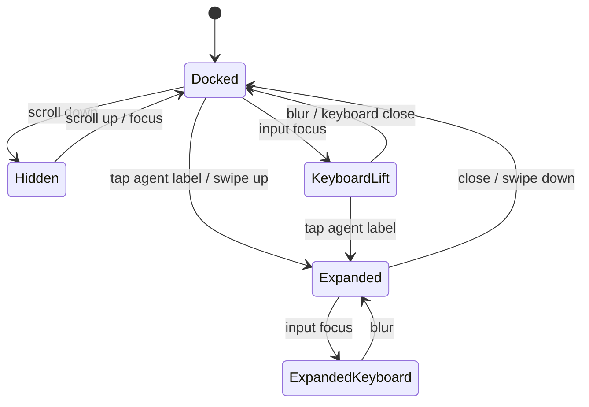
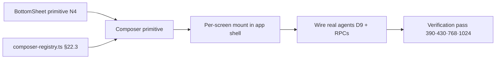

# Composer Primitive — Engineering Handoff Spec

> **What this is:** the single reusable AI chat surface mounted on every mobile screen (all 36, `MOBILE-PLAN.md §22.5`). Build this **first** — it lights up every screen at once. One component, route-scoped behavior; the agent behind it changes, the UI does not.
>
> **Owner:** Claude Code (React). **Source of truth for behavior:** `MOBILE-PLAN.md §21.1`, `§22.2–22.4`. **Reference render:** `Pages/SCR-MOBILE-Booking-Shell.dc.html` (proves the collapsed composer at 390). **Do not** re-derive copy/chips — pull them from the route registry (§4 below).
>
> **Scope:** the composer only. The **Insights** bottom sheet is a *separate* primitive (`BottomSheet`, §22.2 · N4) — this spec references it but does not build it. Chat ≠ Insights (`§21.4`).

---

## 0. Progress / build tracker

| Item | State | Proof / note |
|---|:--:|---|
| Behavior spec (this doc) | 🟢 done | §21.1 + §22.2 reconciled here |
| Reference render (collapsed, 390) | 🟢 done | `SCR-MOBILE-Booking-Shell.dc.html`, 0 unresolved holes |
| Route→assistant registry (data) | 🟢 **built** | [`handoff/composer-registry.ts`](handoff/composer-registry.ts) — all 36 routes + role-forks + chips, `resolve(route, role)` |
| **Composer primitive (React)** | ⚪ **not started** | this handoff — build first |
| Keyboard-aware + collapse-on-scroll | ⚪ not started | §5 state machine; needs the primitive |
| Expanded 94vh chat sheet | ⚪ not started | §6 |
| BottomSheet primitive (N4) | 🟢 **reference built** | [`screens/SCR-MOBILE-BottomSheet.dc.html`](screens/SCR-MOBILE-BottomSheet.dc.html) — peek/half/full snap, drag, backdrop, 3 uses |
| Wire real agents (streaming) | 🔴 Phase 2 | §D9 agents + RPCs; fixtures until then |
| Verification pass @390·430·768·1024 | ⚪ not started | §9 acceptance |

**Legend:** 🟢 done · 🟡 in progress · ⚪ not started · 🔴 blocked (backend).

---

## 1. Anatomy

```
┌──────────────────────────────────────────────┐
│  workspace (scrolls; reserves padding-bottom) │
│                                                │
├──────────────────────────────────────────────┤ ← chips row (28px, horiz-scroll, HITL-safe)
│  [Review offers] [Explain fit] [Prepare …]     │
├──────────────────────────────────────────────┤ ← composer bar (48px)
│  ⊕   Ask Booking Assistant…              ▸    │
├──────────────────────────────────────────────┤ ← bottom tab bar (56px + safe-area)
│  ▢ Home   ▢ Shoots   ▢ Talent   ▢ Assets     │
└──────────────────────────────────────────────┘
```

- **⊕ action menu** — attachments / future actions (voice slots here later, §22.1 — *not now*).
- **Placeholder** — route-scoped (`Ask {Assistant}…`), from the registry.
- **▸ send** — enabled only when input non-empty; write verbs stay explicit.
- **Chips row** — proactive, HITL-safe verbs only; horizontally scrollable; hidden when input focused+typing (optional, §5).
- **Insights** — NOT in the composer. It's the header button → separate `BottomSheet`. Composer never shows intelligence cards.

---

## 2. Component API

```ts
type AssistantId =
  | 'production' | 'operations' | 'strategy' | 'brand'
  | 'matching' | 'booking' | 'agency' | 'asset'
  | 'commerce' | 'analytics' | 'help';

interface ComposerContext {
  route: string;              // current pathname, drives registry lookup
  role?: 'operator' | 'model' | 'agency';
  brandId?: string; shootId?: string; bookingId?: string;
  assetId?: string; talentHandle?: string;
  filters?: Record<string, unknown>;
  workflowStep?: string;      // wizard step, if any
}

interface ComposerPrimitiveProps {
  context: ComposerContext;          // memory the agent reads (§22.2)
  variant?: 'docked' | 'inline';     // 'inline' for full-screen wizards (§22.2 exception)
  onSend: (text: string, ctx: ComposerContext) => void;
  onChip: (chip: ChipSpec, ctx: ComposerContext) => void;
  stream?: AsyncIterable<string>;    // Phase 2; undefined → fixtures
  disabled?: boolean;
}
```

- **Route → assistant/placeholder/chips is resolved internally** from the registry (§4) using `context.route` + `context.role`. Callers pass context, not copy.
- `variant='inline'` renders above a sticky wizard footer, **no tab-bar offset, no expand-to-94vh** (§22.2 wizard exception).
- `stream` absent ⇒ render fixture summaries (dev/design parity with the reference DC).

---

## 3. Where it mounts

| Surface | variant | Tab bar | Expand |
|---|---|:--:|:--:|
| All standard screens (§22.5) | `docked` | yes (offset for it) | yes → 94vh |
| Shoot Wizard · Booking Wizard · Onboarding | `inline` | no | no |
| Settings | `docked` | yes | yes (Help Assistant, no proactive intel) |

Mount once in the mobile app shell, above the tab bar; it reads route from context and re-scopes on navigation — **do not** mount per-screen instances.

---

## 4. Route → assistant registry (data, not logic)

Ship a declarative map mirroring `MOBILE-PLAN.md §22.3` so placeholder/chips/agent switch on route/role with no per-screen code:

```ts
// composer-registry.ts — 1:1 with MOBILE-PLAN §22.3 / §22.4. Keep in sync.
export const ASSISTANTS: Record<AssistantId, { label: string }> = {
  production: { label: 'Production Assistant' },
  operations: { label: 'Operations Assistant' },
  strategy:   { label: 'Strategy Assistant' },
  brand:      { label: 'Brand Assistant' },
  matching:   { label: 'Matching Assistant' },
  booking:    { label: 'Booking Assistant' },
  agency:     { label: 'Agency Assistant' },
  asset:      { label: 'Asset Assistant' },
  commerce:   { label: 'Commerce Assistant' },
  analytics:  { label: 'Analytics Assistant' },
  help:       { label: 'Help Assistant' },
};

// resolve(route, role) → { assistant, placeholder, chips[], insights:boolean }
// Full route table = §22.3. Chip families = §22.4.
```

**Role-forked routes** (resolve by `context.role`):
- Model Profile `/app/talent/[id]` → operator ⇒ Matching (`Ask about @handle…`); model-self ⇒ Booking (`Ask Booking Assistant…`).
- Role Dashboards `/app/dashboard` → model ⇒ Booking; agency ⇒ Agency.

**HITL chip rule (§22.4):** chips may only carry *review · explain · draft · prepare · summarize · compare · filter · find*. **Never** *Accept · Decline · Confirm · Send · Publish · Book*. A chip that yields a write (e.g. "Prepare booking") returns a **draft/preview the user confirms** — never an auto-apply.

---

## 5. State machine (collapsed ⇄ expanded ⇄ keyboard)



- **Docked** — pinned above tab bar; `bottom = tabbar(56) + safe-area`.
- **Hidden** (collapse-on-scroll-down) — composer translates down out of view; chips hide; reappears on scroll-up or focus. Never hide in `inline` variant.
- **KeyboardLift** — on focus, lift above `env(keyboard-inset-height)`; keep composer fully visible; workspace shrinks, does not scroll under keyboard.
- **Expanded** — 94vh chat sheet: assistant-name header, message history, same chips, composer pinned above keyboard; **tab bar hidden**. Close → restore Docked and prior scroll position.

**Layout reservation (§22.2):** workspace `padding-bottom = chips(28) + composer(48) + tabbar(56) + safe-area`. Composer **must never cover content**.

---

## 6. Expanded sheet (94vh)

- Header: assistant name + close (▾). Body: streamed message history (fixtures until Phase 2). Footer: chips row + composer above keyboard.
- Uses the shared `BottomSheet` primitive (N4) for the sheet chrome; composer is embedded, not re-implemented.
- Distinct from the **Insights** sheet (read-only IntelligencePanel) — different trigger (header Insights button), different content, never merged.

---

## 7. HITL & safety (platform-wide, §22.2/22.4)

- Text-only; proactive greeting; suggestion chips; streamed responses.
- **No auto-accept / auto-book / auto-confirm / auto-publish** — write verbs are explicit user taps; chip-drafts require confirmation.
- Context memory persists across the session: page · brand · shoot · booking · selected asset · active filters · workflow step.
- Voice parked as **Future Phase** — do not add a mic button; when it returns it slots into `⊕`, not a persistent control.

---

## 8. Dependencies / build order



1. `BottomSheet` (N4) + `composer-registry.ts` (§4). 2. Composer primitive (this doc). 3. Mount in shell. 4. Phase 2 agents/streaming. 5. Verification.

---

## 9. Acceptance criteria (verification pass)

Add as rows to `13-react-mobile-verification.md`, checked at **390 · 430 · 768 · 1024**:

- [ ] Composer visible on every non-wizard screen; **never overlaps** the tab bar or content.
- [ ] Placeholder + chips **switch correctly** on route/role change (spot-check Model Profile operator vs model, Role Dashboards model vs agency).
- [ ] Focus lifts composer above the keyboard; content does not hide under it.
- [ ] Scroll-down hides composer; scroll-up / focus restores it (docked variant only).
- [ ] Expand → 94vh sheet; tab bar hidden; close restores scroll position.
- [ ] `inline` variant on all 3 wizards: no tab-bar offset, no expand, sits above sticky footer.
- [ ] No chip carries a write verb; "Prepare"-type chips produce a confirm-required draft.
- [ ] Insights button opens the **separate** sheet — composer shows no intelligence cards.
- [ ] Settings shows Help Assistant, no proactive intel.

**Definition of done:** all boxes checked at all 4 widths; registry 1:1 with `MOBILE-PLAN §22.3`; zero console errors; matches the reference render at 390.
