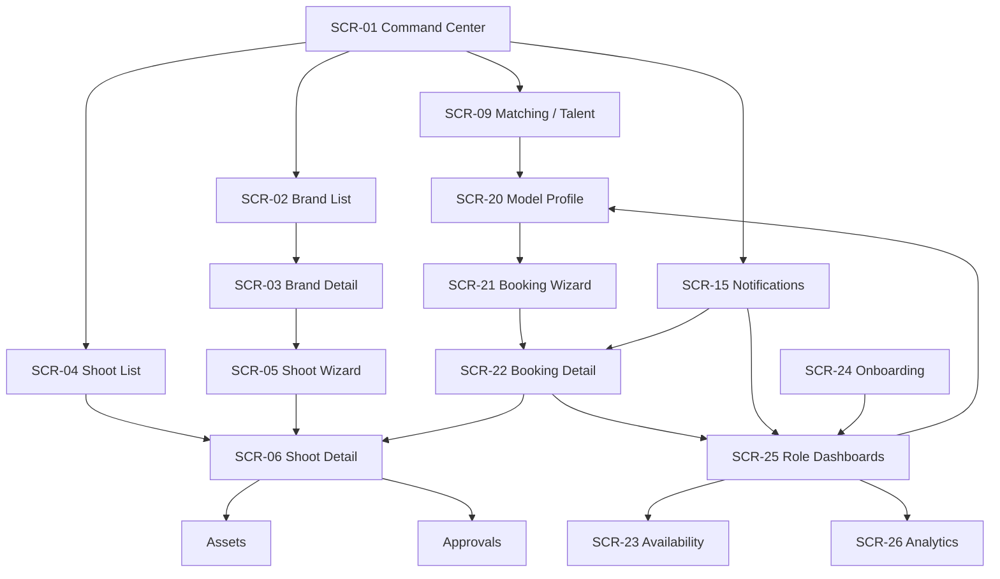

# Implementation Matrices — iPix / FashionOS Mobile

> **Purpose:** the implementation-oriented layer the design plan was missing — dependency matrices, state ownership, feature inventory, AI context, and an ID scheme. This is **Claude Code's checklist**. Design-only: no API/SQL/RPC/React/schema here (those live in engineering docs).
>
> **Source of truth:** screens = `docs/handoff/SCREEN-REGISTRY.md`; assistants/chips = `MOBILE-PLAN.md §22.3–22.4`; components = `components/COMPONENTS.md`; composer = `docs/models/COMPOSER-PRIMITIVE.spec.md`.
>
> **Legend:** ✅ exists/built · ▣ designed (build = Code) · 🟡 planned · 🔴 missing · — n/a.

---

## 0. Tracker — Phase-1 Final Design docs

| Doc | State | Note |
|---|:--:|---|
| §1 Component Dependency Matrix | 🟢 done | build checklist for shared primitives |
| §2 Screen Dependency Matrix | 🟢 done | exposes required routes |
| §3 Feature Inventory | 🟢 done | completeness check |
| §4 Navigation Flow Diagram | 🟢 done | one master mermaid |
| §5 Shared State Matrix | 🟢 done | owner · updated-by · used-by |
| §6 AI Context Matrix | 🟢 done | per-assistant context / outputs / never |
| §7 Design Token / Component Usage | 🟢 done | per-screen consistency |
| §8 ID scheme | 🟢 done | SCR / COMP / AI / ROUTE ids |
| Supabase mapping | 🔴 Phase 2 | engineering doc, not here (reviewer §7) |

This brings design documentation to **~99%**. Remaining is backend verification (Phase 2) + the Code build.

---

## 1. Component Dependency Matrix ⭐

> Which shared components each screen consumes. **Build the "Entire platform" rows first** — they unblock everything.

| Component | ID | Used by | Build |
|---|---|---|:--:|
| BottomTabBar | COMP-TABS | All standard screens (not wizards) | ▣ |
| AIComposer | COMP-AI-COMPOSER | **All screens** (route-scoped) | ▣ ← build first |
| BottomSheet | COMP-SHEET | **Entire platform** (Insights, filters, expanded chat, pickers) | ✅ ref built |
| StatusChip | COMP-STATUS | Entire platform (booking/shoot/asset states) | ✅ |
| IntelligencePanel | COMP-INTEL | Dashboard, Brand, Shoot, Booking, Profile, Analytics | ✅ (desktop) / ▣ (mobile sheet) |
| EvidenceBlock | COMP-EVIDENCE | Booking, Profile, Brand, Matching, Analytics | ✅ |
| FieldReview | COMP-FIELD | Onboarding, Model Profile edit, any AI-drafted field | ✅ |
| KPIGrid | COMP-KPI | Role Dashboards, Analytics | ✅ |
| Timeline | COMP-TIMELINE | Shoot Detail, Booking Detail, Notification Center | ✅ |
| Calendar | COMP-CAL | Availability Editor, Model Profile | ✅ |
| Portfolio grid | COMP-PORT | Model Profile | ✅ |
| OperatorShell (3-pane) | COMP-SHELL | All operator screens (collapses on mobile) | ✅ |

**Order:** COMP-SHEET + COMP-AI-COMPOSER + COMP-TABS (primitives) → screen wiring. See `COMPOSER-PRIMITIVE.spec.md §8`.

---

## 2. Screen Dependency Matrix ⭐

> Inbound/outbound routes. Confirms no orphans, exposes missing destinations.

| Screen | ID | Depends on / links to |
|---|---|---|
| Command Center | SCR-01 | Brand List, Shoot List, Matching, Notifications |
| Brand List | SCR-02 | Brand Detail |
| Brand Detail | SCR-03 | Brand List, Brand DNA/Health/Intel, Shoot Wizard |
| Shoot List | SCR-04 | Shoot Detail, Shoot Wizard |
| Shoot Wizard | SCR-05 | Shoot Detail (on finish) |
| Shoot Detail | SCR-06 | Call Sheet, Schedule, Assets, Approvals, **Booking Detail** (crew link) |
| Matching / Talent tab | SCR-09 | Model Profile |
| Notification Center | SCR-15 | Booking Detail, Shoot Detail, Role Dashboards (deep links) |
| Model Profile | SCR-20 | Matching, **Booking Wizard** (`?talent=`), Availability |
| Booking Wizard | SCR-21 | Model Profile (entry), Booking Detail (on finish) |
| Booking Detail | SCR-22 | Booking Wizard, Notifications, Role Dashboards, Shoot Detail |
| Availability Editor | SCR-23 | Model Profile, Role Dashboards |
| Onboarding | SCR-24 | Role Dashboards (on finish) |
| Role Dashboards | SCR-25 | Booking Detail, Availability, Notifications, Model Profile |
| Analytics Dashboard | SCR-26 | Reports, KPIs, Performance, Revenue, Utilization |

**No orphans:** every screen has ≥1 inbound edge (confirmed `07-navigation-map.md`). **No missing routes** in the booking loop (confirmed `AUDIT-ipix.md §12.1`).

---

## 3. Feature Inventory ⭐

| Feature | ID | Primary screen(s) |
|---|---|---|
| Persistent AI chat | FEAT-CHAT | All |
| AI summary / intelligence | FEAT-INTEL | All (via IntelligencePanel) |
| Per-field HITL review | FEAT-HITL | Onboarding, Model Profile |
| Availability calendar | FEAT-AVAIL | Availability, Model Profile |
| Booking timeline / FSM | FEAT-BOOK-FSM | Booking Detail |
| Portfolio | FEAT-PORT | Model Profile |
| Notifications + unread | FEAT-NOTIF | Notification Center, tab badge |
| Evidence / confidence | FEAT-EVIDENCE | Booking, Profile, Brand, Analytics |
| KPI grids | FEAT-KPI | Role Dashboards, Analytics |
| Matching / shortlist | FEAT-MATCH | Matching, Talent tab |
| Two-sided offers (accept/decline) | FEAT-OFFERS | Role Dashboards (model) |
| Roster management | FEAT-ROSTER | Role Dashboards (agency) |

Each maps to ≥1 built or designed screen — **no orphan features**.

---

## 4. Navigation Flow Diagram ⭐

**Two-sided loop:** operator (Matching → Profile → Wizard → Detail) meets talent (Onboarding → Role Dashboards → offer accept/decline → Availability). Both sides reach Booking Detail; Notifications deep-links into both.

---

## 5. Shared State Matrix ⭐

> The single biggest engineering aid — who owns each piece of cross-screen state.

| State | ID | Owner | Updated by | Used by |
|---|---|---|---|---|
| Current brand | ST-BRAND | Brand Detail | Brand nav, Command Center | Brand*, Shoot Wizard, composer context |
| Current shoot | ST-SHOOT | Shoot Detail | Shoot Wizard, Shoot List | Shoot sub-screens, Booking Detail, composer |
| Current booking | ST-BOOKING | Booking Detail | Booking Wizard, Notifications, Role Dashboards | Booking Detail, Notifications, composer |
| Current model / talent | ST-TALENT | Model Profile | Matching, Booking Wizard (`?talent=`) | Profile, Wizard, Booking Detail, composer |
| Active filters | ST-FILTERS | each list screen | filter sheet | Matching, lists, composer context |
| Current assistant | ST-ASSISTANT | Composer registry | route/role change | Composer, Insights |
| Current conversation | ST-CONVO | Composer | user messages, streamed replies | Composer (docked + expanded) |
| Selected assets | ST-ASSETS | Assets | multi-select | Assets, Deliverables, Channel Preview |
| Selected notifications | ST-NOTIF-SEL | Notification Center | bulk select | Notification Center |
| Unread count | ST-UNREAD | (Phase 2 backend) | realtime | Tab badge, Notification Center |

**Composer reads** ST-BRAND · ST-SHOOT · ST-BOOKING · ST-TALENT · ST-FILTERS · workflow step (see `COMPOSER-PRIMITIVE.spec.md §2`).

---

## 6. AI Context Matrix ⭐

> What each assistant receives, produces, and must never do (HITL). Mirrors `MOBILE-PLAN §22.3–22.4`.

| Assistant | ID | Context in | Outputs | Never |
|---|---|---|---|---|
| Production | AI-PROD | shoot, schedule, crew, deliverables | call sheets, summaries, delay explanations, drafts | auto-schedule / auto-approve |
| Operations | AI-OPS | notifications, messages, account | summaries, priority triage, drafts | auto-send / auto-resolve |
| Strategy | AI-STRAT | brief, brand, goals | recommendations, briefs | auto-commit |
| Brand | AI-BRAND | brand, DNA, health, intel | DNA explanations, comparisons, brief drafts | auto-edit brand |
| Matching | AI-MATCH | brand, talent pool, filters | fit explanations, shortlists, rankings | auto-book |
| Booking | AI-BOOK | booking, talent, calendar, rate, conflicts, messages | recommendations, summaries, outreach drafts, booking prep | **accept / decline / confirm / book** |
| Agency | AI-AGENCY | roster, offers, conflicts, utilization | roster reports, conflict resolution drafts, offer reviews | auto-accept on behalf of talent |
| Asset | AI-ASSET | asset, rights, usage | similar assets, rights checks, caption drafts | auto-publish |
| Commerce | AI-COMMERCE | campaign, channel, preview | channel/caption drafts, previews | auto-publish |
| Analytics | AI-ANALYTICS | metrics, periods | metric explanations, comparisons, report drafts | (read-only) |
| Help | AI-HELP | docs/support | how-to answers | any write |

**Platform HITL:** every write verb (Accept · Decline · Confirm · Send · Publish · Book) stays an explicit user tap; assistants produce **drafts/previews the user confirms**.

---

## 7. Design Token / Component Usage ⭐

> Per-screen consistency check — which shared components each screen must use (not reinvent).

| Screen | Uses |
|---|---|
| Role Dashboards | Card · StatusChip · KPIGrid · EvidenceBlock · Timeline · Composer · IntelligencePanel · BottomSheet |
| Model Profile | Card · StatusChip · Portfolio · Calendar · EvidenceBlock · FieldReview · Composer · IntelligencePanel |
| Booking Detail | Card · StatusChip · Timeline · EvidenceBlock · Composer · IntelligencePanel · BottomSheet |
| Booking Wizard | Card · StatusChip · FieldReview · EvidenceBlock · Composer (inline) |
| Availability | Calendar · StatusChip · Composer · BottomSheet |
| Notification Center | Card · StatusChip · Timeline · Composer · BottomSheet |
| Onboarding | FieldReview · EvidenceBlock · StatusChip · Composer (inline) |
| Analytics | KPIGrid · EvidenceBlock · Card · Composer · IntelligencePanel |

All screens additionally consume **COMP-TABS + COMP-AI-COMPOSER** (except wizards → composer inline, no tab bar). Tokens: v3 "Zeely Editorial" (`design-patched/tokens.css`) — no per-screen custom colors.

---

## 8. ID scheme ⭐

> Stable handles for cross-referencing across design + engineering docs.

- **Screens:** `SCR-01` … `SCR-26` (registry `SCREEN-REGISTRY.md`).
- **Components:** `COMP-{NAME}` — COMP-AI-COMPOSER, COMP-SHEET, COMP-TABS, COMP-INTEL, COMP-EVIDENCE, COMP-FIELD, COMP-KPI, COMP-TIMELINE, COMP-CAL, COMP-STATUS, COMP-PORT, COMP-SHELL.
- **Assistants:** `AI-{NAME}` — AI-PROD, AI-OPS, AI-STRAT, AI-BRAND, AI-MATCH, AI-BOOK, AI-AGENCY, AI-ASSET, AI-COMMERCE, AI-ANALYTICS, AI-HELP.
- **Features:** `FEAT-{NAME}` (§3). **State:** `ST-{NAME}` (§5). **Routes:** pathname is the id (`/app/dashboard`, `/app/talent/[id]`).

---

## 9. Next steps (reviewer's 3 phases)

1. **Phase 1 — Final Design (this doc)** ✅ — 7 matrices + IDs complete → design docs ~99%.
2. **Phase 2 — Backend verification (Cursor):** mark every ST-/AI-context dependency ✅ exists / 🟡 planned / 🔴 missing against real tables/RPCs/realtime/storage/RLS. **Not in this doc** (engineering-owned).
3. **Phase 3 — Claude Code:** build COMP-SHEET + COMP-AI-COMPOSER + COMP-TABS → responsive shell → wire verified backend → CopilotKit/Mastra/Gemini/Realtime → verification at 390·430·768·1024.
