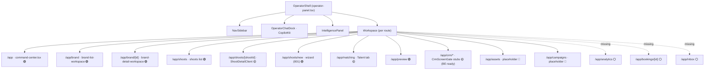
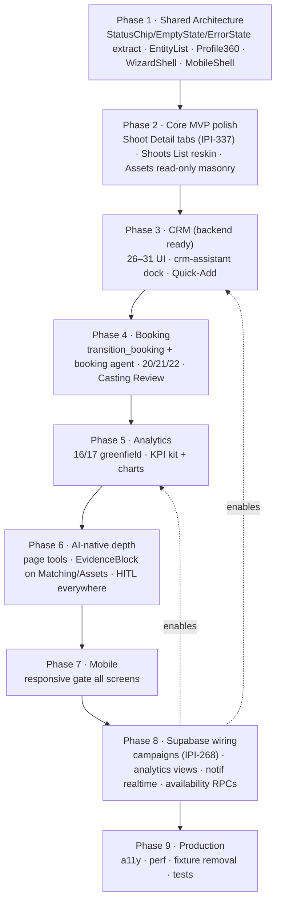
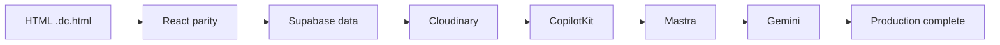
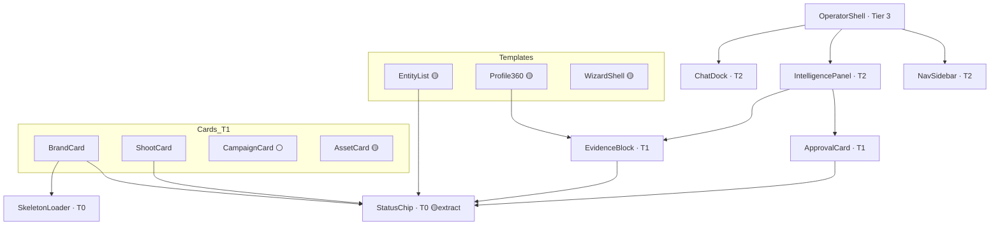
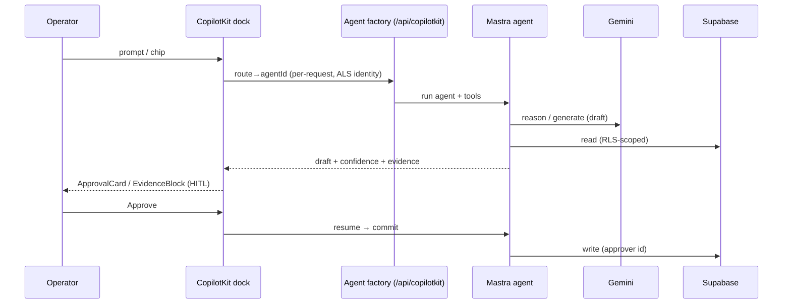
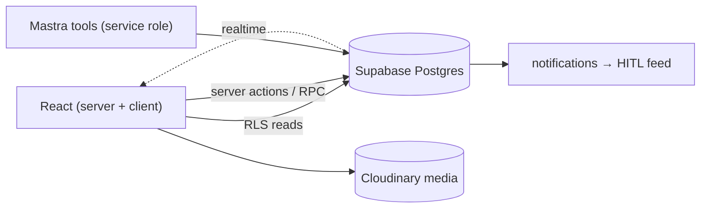

# iPix / FashionOS Implementation Audit & Roadmap

> **Design source:** `Universal-design-prompt-new/` (31 SCR screens, verified this session).
> **Implementation audited:** `/home/sk/ipix/app` (Next.js 16 · React 19 · CopilotKit 1.61 · Mastra 1.41 · Supabase) — routes, components, AI wiring, and migrations verified on disk, not assumed.
> **Method:** documentation-only. No code or design files changed. Legend: 🟢 complete · 🟡 partial · ⚪ missing/planned · 🔴 blocked.
> **Date:** 2026-07-06.

## 1. Executive Summary

The **design package is production-grade and ~95% internally consistent**; the **React app is a strong operator-core spine (~8 real screens) with the AI/data platform already wired**, but ~two-thirds of the 31 screens are stubs or missing UI.

The headline finding re-orders the roadmap: **CRM and Booking are no longer backend-blocked.** The app repo already ships `crm_companies/contacts/deals/activities` migrations, a `crm-assistant` Mastra agent with `search-companies / search-contacts / move-deal-stage / log-activity` tools, a `bookings` table, and `create_booking_request`. What's missing is the **React UI** — all 6 CRM screens are `CrmScreenGate` stubs and booking has zero operator UI. So CRM/booking are **frontend-gated**, high-ROI builds (backend + AI done), not blocked work.

- **Platform is real:** 3-panel `OperatorShell`, `IntelligencePanel`, CopilotKit dock, 8 Mastra agents, Gemini/Groq provider, `tokens.css`, 11+ migrated tables, and two genuine HITL workflows (Shoot Wizard, Brand Intelligence).
- **Biggest gaps are frontend:** Assets, Campaigns (schema-gated on IPI-268), all CRM screens, all Booking/Talent screens, Analytics ×2, Notifications, Collaboration.
- **Mobile is unbuilt:** no `BottomNavigation` / `BottomSheet` / `MobileShell` components.

## 2. Overall Readiness Score

| Dimension | Score | Dot |
|---|:--:|:--:|
| Design package (spec) | 95 | 🟢 |
| Shared architecture (shell/AI/data) | 82 | 🟢 |
| Operator-core screens (SCR-01–11) | 72 | 🟡 |
| CRM screens (26–31) | 25 | 🔴 (backend ready, UI stub) |
| Booking/Talent (20–25) | 12 | 🔴 |
| Analytics (16–17) | 3 | ⚪ |
| Notifications / Collaboration (15, 18) | 3 | ⚪ |
| Mobile (all) | 10 | 🔴 |
| AI-native wiring (CopilotKit/Mastra/Gemini) | 68 | 🟡 |
| **Overall implementation readiness** | **~38 / 100** | 🟡 |

Design ≈ done; implementation ≈ one-third. Operator-core is the built third; CRM/booking/analytics/mobile are the remaining two-thirds.

## 3. Screen Implementation Matrix

| SCR | Screen | Design route | React file | Status | % | Priority |
|---|---|---|---|:--:|:--:|:--:|
| 01 | Command Center | `/app` | `(operator)/app/page.tsx` (90) | 🟢 REAL | 90 | P0 |
| 02 | Brand List | `/app/brand` | `brand/page.tsx` (91) | 🟢 REAL | 95 | P0 |
| 03 | Brand Detail | `/app/brand/[id]` | `brand/[id]/page.tsx` (96) | 🟢 REAL | 95 | P0 |
| 04 | Shoots List | `/app/shoots` | `shoots/page.tsx` (42) | 🟢 REAL | 85 | P1 |
| 05 | Shoot Detail | `/app/shoots/[id]` | `shoots/[shootId]/page.tsx`→`ShootDetailClient` (209) | 🟡 PARTIAL | 40 | P1 |
| 06 | Shoot Wizard | `/app/shoots/new` | `shoots/new/page.tsx` (801) | 🟢 REAL | 80 | P1 |
| 07 | Campaigns | `/app/campaigns` | `campaigns/page.tsx` (11, `SectionPlaceholder`) | 🔴 STUB | 5 | P2 (schema IPI-268) |
| 08 | Assets | `/app/assets` | `assets/page.tsx` (16, `SectionPlaceholder`) | 🔴 STUB | 5 | P2 |
| 09 | Matching | `/app/matching` | `matching/page.tsx` (20) | 🟡 PARTIAL | 60 | P2 |
| 10 | Channel Preview | `/app/preview` | `preview/page.tsx` (31) | 🟢 REAL | 90 | P1 |
| 11 | Onboarding | `/onboarding` | `app/onboarding/page.tsx` (264) | 🟢 REAL | 90 | P0 |
| 15 | Notifications | `/app/inbox` | — | ⚪ MISSING | 0 | P2 |
| 16 | Analytics | `/app/analytics` | — | ⚪ MISSING | 0 | P3 |
| 17 | Campaign Perf | `/app/analytics/campaigns` | — | ⚪ MISSING | 0 | P3 |
| 18 | Collaboration | `/app/activity` | — | ⚪ MISSING | 0 | P3 |
| 20 | Talent Profile | `/app/matching/talent/[id]` | — | ⚪ MISSING | 0 | P2 |
| 21 | Booking Wizard | `/app/matching/talent/[id]/book` | — (greenfield) | 🔴 MISSING | 5 | P2 |
| 22 | Booking Detail | `/app/bookings/[id]` | — | 🔴 MISSING | 5 | P2 |
| 23 | Availability | talent-scoped | — | ⚪ MISSING | 0 | P3 |
| 24 | Talent Onboarding | `/app/talent/profile` | — | ⚪ MISSING | 0 | P3 |
| 25 | Role Dashboards | `/app/model` · `/app/roster` | — | ⚪ MISSING | 0 | P3 |
| 26 | CRM Companies | `/app/crm/companies` | `crm/companies/page.tsx` (7, `CrmScreenGate`) | 🟡 STUB (BE ready) | 20 | **P1** |
| 27 | CRM Company Detail | `/app/crm/companies/[id]` | `…/[id]/page.tsx` (30, gate) | 🟡 STUB (BE ready) | 20 | **P1** |
| 28 | CRM Contacts | `/app/crm/contacts` | `crm/contacts/page.tsx` (7, gate) | 🟡 STUB (BE ready) | 20 | **P1** |
| 29 | CRM Contact Detail | `/app/crm/contacts/[id]` | `…/[id]/page.tsx` (30, gate) | 🟡 STUB (BE ready) | 20 | **P1** |
| 30 | CRM Pipeline | `/app/crm/pipeline` | `crm/pipeline/page.tsx` (7, gate) | 🟡 STUB (BE ready) | 20 | **P1** |
| 31 | CRM Deal Detail | `/app/crm/pipeline/[id]` | `…/[id]/page.tsx` (30, gate) | 🟡 STUB (BE ready) | 20 | **P1** |

**Counts:** REAL 8 · PARTIAL 3 (05, 09, +CRM-collectively) · STUB 8 (07, 08, 6×CRM) · MISSING 9. SCR-12/13/14 have no design prototype (⚪ planned); SCR-19 ⏸ future.

## 4. Screen-by-Screen Audit (gaps by dimension)

Per-screen missing UI/UX/AI/data/backend/mobile/a11y — the highest-signal rows:

- **05 Shoot Detail** 🟡 — page delegates to `ShootDetailClient`; **missing UI:** 6 of 9 tabs (Shot List/Assets/Schedule/Budget/Deliverables/Activity) are placeholders (IPI-337). **Data:** per-tab RPC/view undefined. **Mobile:** tab strip reflow. **AI:** approvals section wired.
- **09 Matching** 🟡 — Talent tab live; **missing UI:** Creator/Asset/Product tabs are disabled shells; Casting Review swipe deck + Shortlist drawer partial. **AI:** `model-match` agent exists, page-tool wiring partial.
- **07 Campaigns / 08 Assets** 🔴 — `SectionPlaceholder`. **Backend:** Campaigns gated on IPI-268 schema; Assets needs `GET /api/assets` + `AssetCard`. **AI:** `creative-director`/`visual-identity` mapped but no page tools.
- **26–31 CRM** 🟡 — all `CrmScreenGate`. **Backend + AI READY** (tables, RLS, `crm-assistant` + tools). **Missing:** the entire UI — list rows (`EntityList` + `StatusChip`), `Profile360` detail tabs, pipeline kanban + `move-deal-stage` UI, deal won/lost `ApprovalCard` gate, Quick-Add.
- **21/22 Booking** 🔴 — no route. **Backend partial:** `bookings` table + `create_booking_request`; **missing** `transition_booking` RPC + a `booking` Mastra agent + the FSM UI (`requested→quoted→approved→confirmed`).
- **16/17 Analytics, 15 Notifications, 18 Collaboration, 20/23/24/25 Talent** ⚪ — greenfield routes; notifications/bookings tables exist, screens do not.

## 5. Missing Implementation

**Missing pages (routes with no React):** 15 Inbox · 16 Analytics · 17 Campaign Perf · 18 Activity · 20 Talent Profile · 21 Booking Wizard · 22 Booking Detail · 23 Availability · 24 Talent Onboarding · 25 Role Dashboards.
**Stub pages (route exists, no UI):** 07 Campaigns · 08 Assets · 26–31 CRM (×6).
**Missing shared components:** `BottomNavigation`, `BottomSheet`, `MobileShell`, `AgentStatusIndicator`, `CampaignCard`; and generic `StatusChip`/`EmptyState`/`ErrorState`/`SearchBar`/`FilterBar`/`PageHeader`/`AssetCard` exist only **inline** (not extracted).
**No route drift found** — existing routes match the registry (shoot detail uses `[shootId]`; `/app/crm` redirects to `/companies`). No duplicate/stale screens.

## 6. Refactor Plan

| Target | Issue | Action |
|---|---|---|
| `shoots/new/page.tsx` (801 ln) | one giant multi-step file | extract `WizardShell` + step configs (design REFACTOR A1) |
| Inline `StatusChip`/`EmptyState`/`ErrorState` | duplicated per workspace | extract to `components/ui/*` (Tier-0 atoms) — reused by CRM build |
| `brand-list-workspace` / `shoots` list markup | repeated list pattern | generalize to `EntityList<T>` before CRM lists (design REFACTOR A4) |
| `brand-detail-workspace` / `shoot-detail-client` | repeated tabbed detail | generalize `Profile360`/`DetailShell` before CRM detail (A5) |
| Icons | mostly `lucide-react` ✓ | already unified — no action |

**Config-driven candidates:** CRM Company/Contact detail → `Profile360` configs; CRM/Brand/Shoots lists → `EntityList` configs; Shoot/Booking wizard → one `WizardShell`.

## 7. Shared Component Plan

| Component | In app? | Path / note | Plan |
|---|:--:|---|---|
| OperatorShell / NavSidebar | 🟢 | `operator-panel/*` | reuse |
| IntelligencePanel | 🟢 | `intelligence-panel/*` | reuse |
| OperatorChatDock (CopilotKit) | 🟢 | `operator-panel/operator-chat-dock.tsx` | reuse |
| EvidenceBlock · ApprovalCard | 🟢 | `evidence-block/*`, `brand-hub/approval-card.tsx` | reuse (frozen contract) |
| BrandCard · ShootCard · SkeletonLoader | 🟢 | `brand-hub/*`, `shoot/ShootCard.tsx`, `ui/skeleton.tsx` | reuse |
| StatusChip | 🟡 | tokens only, inline | **extract** (P0 — CRM needs it) |
| EmptyState · ErrorState · SearchBar · FilterBar · PageHeader · AssetCard | 🟡 | inline per screen | **extract** as reused (P1) |
| EntityList · Profile360 · DetailShell · WizardShell | 🟡 | exist as bespoke per-feature | **generalize** to templates (P1) |
| CampaignCard | ⚪ | — | build with Campaigns |
| BottomNavigation · BottomSheet · MobileShell · AgentStatusIndicator | ⚪ | — | build in mobile phase |

## 8. Route + Component Mapping

## 9. Backend Dependency Matrix

| Screen(s) | Tables (migrated?) | RPCs | AI agent | Backend status |
|---|---|---|---|:--:|
| 01–03 Brand/CC | `brands`, `brand_scores` ✅ | scoring/crawl ✅ | brand-intelligence ✅ | 🟢 |
| 04–06 Shoots | `shoots` ✅ | `get_shoot_detail`, shoot draft ✅ | production-planner ✅ | 🟢 |
| 08 Assets | `assets`, `asset_variants`, `cloudinary_assets` ✅ | `GET /api/assets` ⚪ | visual-identity ✅ | 🟡 |
| 07 Campaigns | ⚪ (IPI-268) | ⚪ | creative-director ✅ | 🔴 schema |
| 10 Channel Preview | `image_specs` ✅ | publish ⚪ | visual-identity ✅ | 🟡 |
| 26–31 CRM | `crm_companies/contacts/deals/activities` ✅ | stage guard trigger ✅, `move-deal-stage`/`log-activity` tools ✅ | **crm-assistant ✅** | 🟢 **(UI-gated)** |
| 21–22 Booking | `bookings` ✅ | `create_booking_request` ✅, `transition_booking` ⚪ | `booking` agent ⚪ | 🟡 |
| 15 Notifications | `notifications` ✅ | mark-read ⚪, realtime ⚪ | — | 🟡 |
| 16–17 Analytics | views ⚪ | aggregates ⚪ | analytics-intelligence ⚪ | 🔴 |
| 23–25 Talent | `bookings` ✅ | availability/role RPCs ⚪ | booking/model-match | 🔴 |

## 10. AI-Native Implementation Matrix

CopilotKit **wired** (`/api/copilotkit`, per-request agent factory, `useFrontendTool` navigateTo/navigateToCrm/setActiveBrand, route suggestions). 8 Mastra agents defined. Gemini default via `lib/ai/provider.ts` (Groq fallback).

| Screen | IntelligencePanel | Chat dock (agent) | EvidenceBlock | HITL/ApprovalCard | Mastra tool/workflow | Level (§7a) |
|---|:--:|:--:|:--:|:--:|---|:--:|
| Shoot Wizard | 🟢 | 🟢 production-planner | 🟢 | 🟢 (Gate 1/2) | `shoot-wizard` workflow + Gemini | **6–7** |
| Brand Detail | 🟢 | 🟢 brand-intelligence | 🟢 | 🟢 (draft) | `brand-intelligence` workflow + Gemini | **6–7** |
| Command Center | 🟢 | 🟢 production-planner | 🟡 | 🟢 (aggregates) | surfaces above | 4 |
| Shoots List / Detail | 🟢 | 🟢 production-planner | 🟡 | 🟡 | shell chat; tabs pending | 4–5 |
| Matching | 🟡 | 🟢 model-match | 🟡 fit | ⚪ | model-match agent, page tools ⚪ | 3–4 |
| Assets / Campaigns | 🟡 | 🟢 visual-identity/creative-director | 🟡 | ⚪ | route+shell only | 2–3 |
| CRM (26–31) | ⚪ | 🟢 crm-assistant (agent+tools ✅) | ⚪ | ⚪ (won/lost) | tools ready, no UI | 2 |
| Booking / Analytics / Talent | ⚪ | ⚪ | ⚪ | ⚪ | agent/workflow ⚪ | 0–1 |

## 11. CRM Plan (highest ROI — backend + AI already done)

Backend ✅ (`crm_*` tables, RLS, terminal-stage trigger), AI ✅ (`crm-assistant` + `search-companies/search-contacts/move-deal-stage/log-activity`). **Only the UI is missing.**

1. **P0 atoms:** extract `StatusChip` + `crmStatusDotToken`/`crmStatusLabel` (companies `prospect|active|inactive|lost`, deals 6-stage), `EntityList<T>`.
2. **Companies + Contacts lists** (26/28) → `EntityList` + `StatusChip`, replace `CrmScreenGate`.
3. **Company + Contact detail** (27/29) → build one real, then extract `Profile360` config (Overview·Contacts·Deals·Activity; linked-list tabs link out).
4. **Pipeline** (30) → kanban + `move-deal-stage` (drag + keyboard a11y).
5. **Deal Detail** (31) → won/lost + convert-to-brand via `ApprovalCard` (HITL); wire `crm-assistant` dock + Quick-Add.
6. **Timeline/Activity** → `crm_activities` unified feed.

## 12. Booking Plan

1. Add `transition_booking` RPC + FSM `requested→quoted→approved→confirmed` (+declined/expired/cancelled), service-role confirm.
2. Build the `booking` Mastra agent (draft quotes/messages only — never writes; per engineering-reference D7).
3. **Booking Wizard (21)** greenfield route `/app/matching/talent/[id]/book` — reuse `WizardShell`, `FieldReview` HITL on rate.
4. **Booking Detail (22)** `/app/bookings/[id]` — status stepper, operator-only confirm, `ApprovalCard`.
5. **Talent Profile (20)** + Matching Casting Review → Shortlist → "Send to shoot" deep-link.
6. Role Dashboards (25), Availability (23), Talent Onboarding (24) after the write-path lands.
7. On `confirmed` → upsert `shoot_crew` + inline accordion on Shoot Detail crew row (no new tabs).

## 13. Mobile Plan

Nothing mobile-specific exists yet. Build (design MOBILE-PLAN §16):
1. `MobileShell` — bottom tab bar + persistent composer above tabs + safe-area.
2. `BottomNavigation` (Home·Shoots·Assets·Brands·More + More sheet).
3. `BottomSheet` (IntelligencePanel → Insights sheet; filters; expanded chat) with focus-trap.
4. Responsive gate per screen at **390 / 430 / 768 / 1024** (no h-scroll; ≥44px targets; kanban→stage-accordion on Pipeline).
5. Long-press select + action sheet (MOBILE-003); streaming `aria-live` (MOBILE-004).

## 14. Implementation Roadmap

**Prioritized task checklist (P0→P1):**
- [ ] Extract `StatusChip` (+ crm tokens), `EmptyState`, `ErrorState` to `components/ui/`
- [ ] Extract `EntityList<T>` and `Profile360`/`DetailShell` from bespoke workspaces
- [ ] Fill CRM Companies + Contacts lists (26/28) — remove `CrmScreenGate`
- [ ] Fill CRM Company/Contact detail (27/29) via `Profile360`
- [ ] CRM Pipeline (30) + Deal Detail (31) with HITL won/lost
- [ ] Shoot Detail 6-tab wiring (IPI-337)
- [ ] Assets read-only masonry + `AssetCard`
- [ ] `transition_booking` RPC + `booking` agent (unblocks 20/21/22)
- [ ] `MobileShell` + `BottomNavigation` + `BottomSheet`
- [ ] Analytics 16/17 greenfield (after IPI-268 views)

## 15. Mermaid Diagrams

### 15.1 Design → React conversion flow (per screen)

### 15.2 Shared component dependency tree (Tier 0→3)

### 15.3 AI runtime flow (CopilotKit → Mastra → Gemini → Supabase, HITL)

### 15.4 Supabase data flow

### 15.5 Route → screen → component map
*(see §8 diagram above — OperatorShell → Workspace → per-route screens)*

### 15.6 Implementation phases
*(see §14 roadmap flowchart above)*

## 16. Risks + Blockers

| Risk | Sev | Mitigation |
|---|:--:|---|
| Design docs still label CRM/booking "backend-gated (IPI-362)" — **stale**; backend shipped | 🟡 | treat CRM/booking as frontend builds; update SITEMAP §13 note |
| `@mastra/memory` `1.0.1-alpha.1` + `@mastra/libsql` alpha while stable exists | 🟡 | dependency-only PRs to stable (per copilotkit-mastra §13a) |
| Campaigns (07) blocked on IPI-268 schema | 🔴 | land schema before UI |
| Booking write-path needs `transition_booking` + `booking` agent | 🔴 | build before 21/22 UI |
| Mobile entirely unbuilt | 🟡 | dedicated phase; don't retrofit per-screen |
| Fixtures mistaken for wired data | 🟡 | visible "Fixture / Backend pending" labels (design §8) |
| 801-line wizard file | 🟡 | extract `WizardShell` before booking reuse |

## 17. Recommendations

1. **Re-sequence around the backend reality:** CRM is the highest-ROI next build (backend + AI done, UI stub) — do it before Analytics/Booking-agent work.
2. **Extract the Tier-0 atoms + templates first** (`StatusChip`, `EntityList`, `Profile360`, `WizardShell`) so every downstream screen is config, not bespoke.
3. **One concern per PR** (design parity / data wiring / migration separate) per repo `CLAUDE.md`.
4. **Preserve HITL** on every AI write (ApprovalCard); keep agents draft-only.
5. **Update the design package's "backend-gated" language** for CRM/booking to reflect shipped schema.
6. **Build mobile as a phase**, not per-screen retrofits.

## 18. Final Verdict

**Design:** 🟢 production-grade (95). **Implementation:** 🟡 ~38/100 — a solid operator-core spine on a real AI/data platform, with CRM/booking/analytics/mobile still to build. **Will it succeed?** 🟢 Yes — the platform, patterns, and (for CRM/booking) the backend already exist; remaining work is well-scoped frontend + a few RPCs. **Production-ready today?** 🔴 No — two-thirds of screens are stub/missing. **Fastest path to value:** extract shared atoms/templates → ship CRM (backend ready) → Shoot Detail tabs → Assets → Booking write-path → Analytics → mobile.
