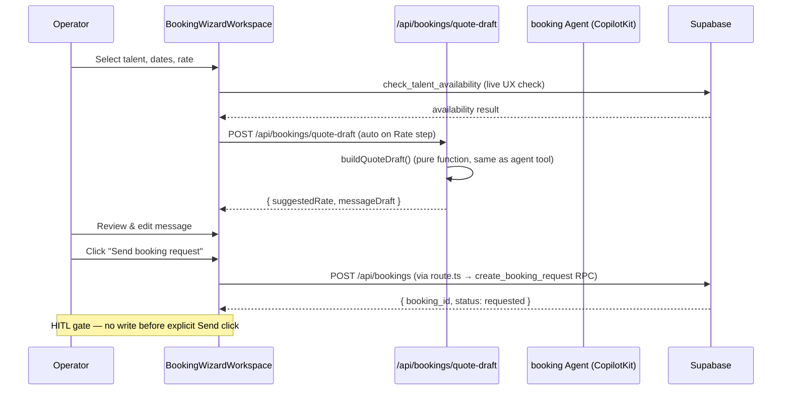
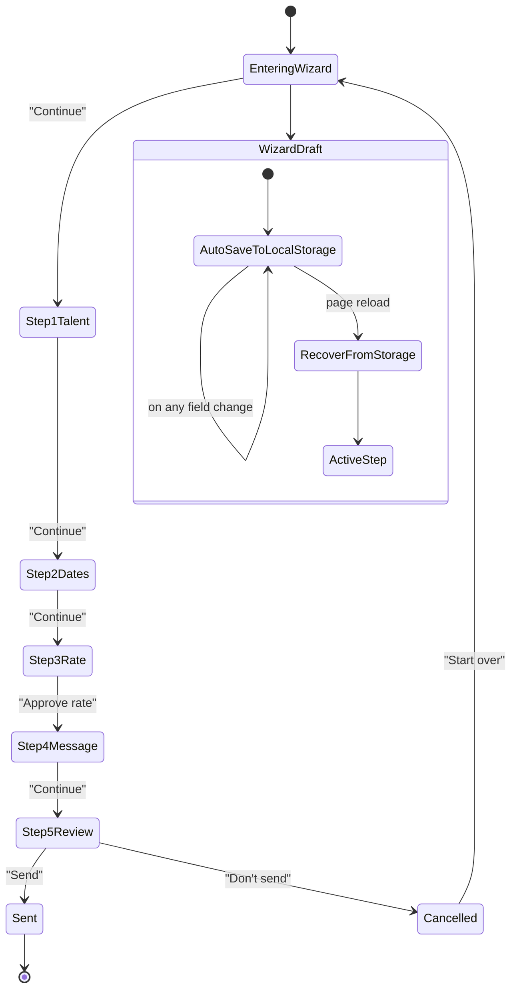

Now I have the complete picture. Here is the comprehensive review:

---

## Booking Wizard Review — Findings Report

### Current State Summary

| Component | Status | Location |
|-----------|--------|----------|
| **IPI-410 Booking Wizard** | ✅ **Done** (PR #281 merged, PR #285 post-merge fix) | `origin/main` at `c72f09af` |
| **IPI-397 Booking Agent** | ✅ **Done** (PR #263 merged) | `origin/main` |
| **IPI-409 Talent Profile** | 🔴 **Backlog** — 0% UI | `/app/matching/talent/[id]` greenfield |
| **IPI-411 Booking Detail** | 🟡 **In Progress** — 0% UI | `/app/bookings/[id]` greenfield |

### Files on Disk (`origin/main`)

The Booking Wizard ships **8 new files**:
- `app/src/app/(operator)/app/matching/talent/[id]/book/page.tsx` — RSC page (61 lines)
- `app/src/components/booking/booking-wizard-workspace.tsx` — Client workspace (462 lines)
- `app/src/components/booking/booking-wizard-context.tsx` — CopilotKit context (62 lines)
- `app/src/components/booking/booking-wizard-workspace.module.css` — Styles (334 lines)
- `app/src/components/booking/booking-wizard-workspace.test.tsx` — 22 Vitest tests
- `app/src/app/api/bookings/quote-draft/route.ts` — Draft API (63 lines)
- `app/src/app/api/bookings/quote-draft/route.test.ts` — 100 lines of tests
- `app/src/lib/booking/booking-status-tokens.ts` — Status token maps (18 lines)

### Per-Proposed-Issue Analysis

#### ✅ IPI-410A — QA Seed Data & Booking Test Reliability

| Finding | Status |
|---------|--------|
| IPI-451 (DB seed data) | ✅ **Already Done** — seed.sql exists with orgs, brands, CRM |
| Talent profile seed data in seed.sql | ❌ **Missing** — seed.sql has 0 talent profiles, 0 availability, 0 bookings |
| QA org UUID for testing | ❌ **Deterministic UUIDs exist** (`00000000-0000-0000-0000-000000000001`) but no talent data links to them |
| Booking E2E tests | ❌ **No Playwright tests exist** for any booking flow |
| Booking component tests | ✅ **22 Vitest tests** exist for BookingWizardWorkspace |

**Verdict:** ⚠️ **Valid issue** — talent seed data is the gap (IPI-451 didn't cover talent tables). E2E tests don't exist. 

**Recommendation:** Create a follow-up to extend IPI-451 seed data with talent profiles and a booking E2E Playwright test. **Do not** create a new standalone issue — this can be a sub-issue of IPI-410 or a new IPI.

---

#### 🔄 IPI-410B — Availability Error & Retry UX

| Finding | Status |
|---------|--------|
| Wizard calls `check_talent_availability` client-side | ✅ **Implemented** via `supabase.rpc()` in useEffect |
| Error state when RPC fails | ❌ **Silent failure** — `setAvailability(null)` on error, no user-facing error message |
| Timeout handling | ❌ **None** — no timeout on the RPC call |
| Retry behavior | ❌ **None** — no retry button |
| Offline/network failure | ❌ **Not handled** |
| IPI-256 (DESIGN-073 Error & Recovery UX) | 🔄 **Duplicate** — covers retry, offline, permissions, streaming errors (Backlog) |
| IPI-453 (Error Boundaries) | 🔄 **Overlaps** — covers `error.tsx` for operator routes (In Review) |

**Verdict:** ⚠️ **Valid issue but DUPLICATE of IPI-256**. The availability-specific UX gap (silent failure, no retry) is a subset of IPI-256's broader error UX scope. **Do not create IPI-410B** — file under IPI-256 instead.

---

#### ⚠️ IPI-410C — Enable "Request Booking" CTA

| Finding | Status |
|---------|--------|
| Wizard route exists | ✅ **Live** — `/app/matching/talent/[id]/book` |
| Entry point from Talent Profile | ❌ **Blocked** — IPI-409 (Talent Profile) is Backlog, 0% UI |
| Permissions/navigation flow | ❌ **Not wired** — no "Request Booking" button exists anywhere |
| Mobile behavior | ❌ **Not addressed** |

**Verdict:** ⚠️ **Valid issue but DEPENDENT on IPI-409**. The CTA is inherently part of the Talent Profile screen (IPI-409). Creating a separate issue would split a single-screen concern. **Recommend folding into IPI-409** when that task is started — add "Request Booking CTA" as a step in IPI-409's AC rather than creating IPI-410C.

---

#### ⚠️ IPI-410D — Booking Draft Persistence

| Finding | Status |
|---------|--------|
| Current wizard state storage | ❌ **React state only** — all state lost on navigation/refresh |
| localStorage/sessionStorage fallback | ❌ **Not implemented** |
| Supabase draft storage | ❌ **No draft table usage** — agent's `createBookingDraft` is write-only after HITL |
| Draft recovery | ❌ **Not implemented** |
| Multi-tab handling | ❌ **Not implemented** |
| Expiration strategy | ❌ **Not implemented** |

**Verdict:** ⚠️ **Valid issue**. However, the IPI-410 spec explicitly scoped this "out of scope" for the initial build. This is a legitimate enhancement. **Recommend creating IPI-410D** as a new follow-up issue with the architecture, wireframes, and AC as outlined.

---

### Architecture Diagrams

**Booking Wizard Agent Interaction Flow:**


**Navigation Flow:**
```mermaid
flowchart TD
    A[Operator Shell] --> B[Talent Matching /app/matching]
    B --> C[Talent Profile /app/matching/talent/[id]]
    C -->|"Request Booking (CTA)"| D[Booking Wizard /app/matching/talent/[id]/book]
    D -->|Step 1| E[Talent & shoot]
    E -->|Step 2| F[Dates + availability check]
    F -->|Step 3| G[Rate (AI-drafted, HITL approve)]
    G -->|Step 4| H[Message (AI-drafted, editable)]
    H -->|Step 5| I[Review & send]
    I -->|Send| J[Booking requested ✅]
    I -->|Cancel| K[Not sent]
    J --> L[Booking Detail /app/bookings/[id]]

    C -.->|IPI-409 Backlog - Not built| C
    L -.->|IPI-411 In Progress - Not built| L
```

**Data Flow:**
```mermaid
flowchart LR
    subgraph "Client (Browser)"
        BWW[BookingWizardWorkspace]
        Ctx[BookingWizardContext]
    end
    subgraph "Next.js API"
        QD[/api/bookings/quote-draft]
        CR[/api/bookings]
    end
    subgraph "Mastra"
        BA[booking Agent]
        CTA[checkTalentAvailability]
        DBQ[draftBookingQuote]
        CBD[createBookingDraft]
    end
    subgraph "Supabase"
        RPC1[check_talent_availability]
        RPC2[create_booking_request]
        RPC3[search_talent]
    end

    BWW -->|"auto-fetch on Rate step"| QD
    BWW -->|"Send click"| CR
    BWW -->|"live availability check"| RPC1
    QD -->|buildQuoteDraft| BWW
    CR -->|createBookingRequest| RPC2
    Ctx -->|useAgentContext| BA
    BA --> CTA --> RPC1
    BA --> DBQ
    BA --> CBD -->|operatorConfirmed:true| RPC2
```

**Draft Persistence Flow (IPI-410D if implemented):**


---

### Final Recommendations

| Item | Decision | Action |
|------|----------|--------|
| **IPI-410A** (Seed data + E2E) | ⚠️ **Valid** — create issue | Extend IPI-451 seed.sql to include talent profiles + add Playwright E2E test |
| **IPI-410B** (Availability error UX) | 🔄 **Duplicate** of IPI-256 | File under IPI-256, don't create new issue |
| **IPI-410C** (Request Booking CTA) | ⚠️ **Valid** — fold into IPI-409 | Add "Request Booking CTA" as an AC step in IPI-409 |
| **IPI-410D** (Draft persistence) | ⚠️ **Valid** — create issue | Create new IPI-410D with architecture + wireframes + AC |

**Merging recommendation:** IPI-410B → IPI-256. IPI-410C → IPI-409. Only **IPI-410A** and **IPI-410D** warrant new issues. Total: **2 new issues** instead of 4.

Would you like me to:
1. Create the **IPI-410A** issue (talent seed data → booking E2E)
2. Create the **IPI-410D** issue (booking draft persistence)
3. Update **IPI-409** to include the Request Booking CTA step
4. Update **IPI-256** to include the availability error UX scope