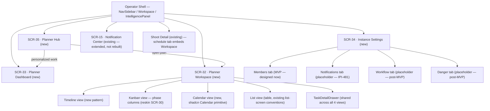
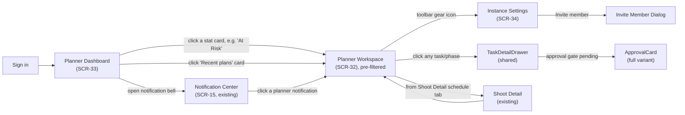
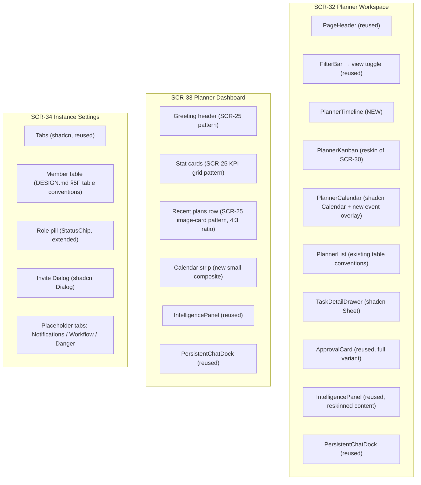
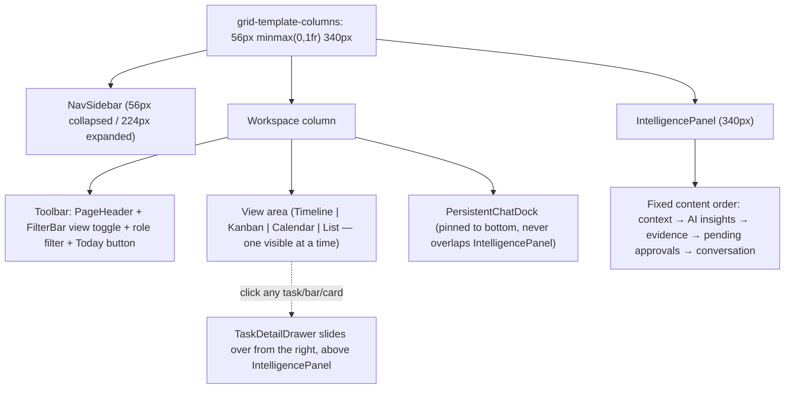
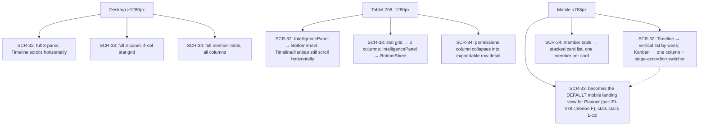
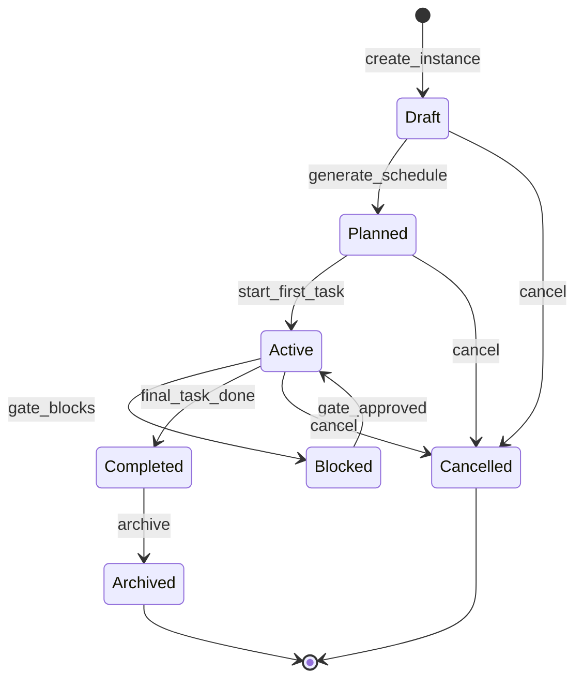

# Planner Design Prompts — Diagrams

Companion to `00-review-and-conventions.md`, `SCR-32`–`SCR-35`, and `supabase-reference.md`. Validate any edits at https://mermaid.live before committing.

---

## 1. Screen hierarchy

Where the Planner screens sit relative to existing, reused screens.

---

## 2. User navigation flow

How a producer moves between the 3 new screens plus the reused screens they connect to.

---

## 3. Component hierarchy

What each new screen is actually built from — the reuse accounting from `00-review-and-conventions.md`, as a tree.

---

## 4. Planner Workspace layout (SCR-32 specifically)

The 3-panel shell with the toolbar and view area called out — this is what Claude Design should treat as the literal frame.

---

## 5. Responsive layout

How the 3 screens reflow at each breakpoint — summarizing the "Responsive layouts" table in each screen prompt.

---

## 6. Planner instance state transitions

Reproduced from `plan/planner/mermaid-diagrams.md` §3 (verified accurate against the specs in the audit) — included here so each screen prompt can reference which UI state corresponds to which lifecycle state, without re-deriving it.

**UI mapping** (statuses = `planner.instance_status` only — **no `at_risk` state**):
- `Draft` → SCR-32 `EmptyState` ("Select a workflow template") when no schedule yet.
- `Planned` / `Active` → populated Timeline / Kanban (**phase columns**) / Calendar / optional List.
- `Blocked` → gate badge on gated **phase**; `ApprovalCard` in drawer.
- **At risk (derived)** → amber `--warning` border on bars/cards while status remains `active`/`blocked`/etc.; SCR-33 “At Risk” count + IntelligencePanel.
- `Completed` / `Archived` → read-only (no drag handles), same as viewer chrome.
