# iPix / FashionOS — Planner System — Design Plan & Progress Tracker

> **Design planning only.** No React, no SQL. Consolidates the four Planner design prompts (`uploads/SCR-32…35-*.md`, `00-review-and-conventions.md`, `diagrams.md`) into one plan: progress tracker, architecture diagrams, wireframes, and implementation-ready tasks.
>
> **Prime directive (from `00-review-and-conventions.md`):** the Planner is **one more surface in the existing operator app, not a new product.** Reuse before inventing. Match `DESIGN.md` v3 "Zeely Editorial" exactly — pure white/grey/black, Inter, Geist Mono for all numbers, black primary actions, hairline borders (no shadows), amber = pending/at-risk (border+dot only, never a filled block). Colour communicates **status only** — no per-phase rainbow.
>
> **Authority chain:** backing specs = `linear/issues/IPI-476…483-PLN-*`. Screen IDs = `docs/handoff/SCREEN-REGISTRY.md` (SCR-32…35 reserved by this plan). Visual system = `DESIGN.md` + `design-patched/tokens.css`. Components = `components/COMPONENTS.md`. On conflict, the IPI acceptance criteria win.

---

## 0. Progress Tracker

Legend: 🟢 complete · 🟡 in progress · 🔴 failed / blocked · ⚪ not started

### 0.1 Design artifacts

| Artifact | Status | Proof / location |
|---|:--:|---|
| Review & conventions (tokens, reuse map) | 🟢 | `uploads/00-review-and-conventions.md` — pulled from real `.dc.html` library |
| SCR-32 Workspace design prompt | 🟢 | `uploads/SCR-32-planner-workspace.md` |
| SCR-33 Dashboard design prompt | 🟢 | `uploads/SCR-33-planner-dashboard.md` |
| SCR-34 Instance Settings design prompt | 🟢 | `uploads/SCR-34-planner-instance-settings.md` |
| SCR-35 Planner Hub design prompt | 🟢 | `uploads/SCR-35-planner-hub.md` |
| Architecture diagrams (6) | 🟢 | `uploads/diagrams.md` — validated |
| This consolidated plan + tracker | 🟢 | `planner/planner.md` |
| `--planner-*` design tokens defined | 🟢 | conventions §5 (13 tokens, extend existing scale) |
| Registry IDs SCR-32…35 | 🟢 | added to `SCREEN-REGISTRY.md` this pass |
| Extra diagrams (task lifecycle · HITL · AI tools · notif) | 🟢 | §4 of this doc |
| Text wireframes (4 screens, desktop + mobile) | 🟢 | §5 of this doc |
| Implementation task breakdown | 🟢 | §6 of this doc |
| Data model reconciled to Supabase design reference | 🟢 | §3.1–3.4 — ERD, enums, tables, fields; 3 corrections applied (see below) |

### 0.2 Prototypes (`.dc.html` builds) — none built yet

| Screen | SCR | Route | Design | Prototype | Backend |
|---|:--:|---|:--:|:--:|:--:|
| Planner Workspace (Timeline/Kanban/Calendar/List) | 32 | `/app/planner/[instanceId]` | 🟢 spec | ⚪ | ⚪ IPI-476/477/478 |
| Planner Dashboard (role-based) | 33 | `/app/planner/dashboard` | 🟢 spec | ⚪ | ⚪ IPI-479 |
| Instance Settings (Members MVP) | 34 | `/app/planner/[instanceId]/settings` | 🟢 spec | ⚪ | ⚪ IPI-479 |
| Planner Hub (index of plans) | 35 | `/app/planner` | 🟢 spec | ⚪ | 🔴 **no Linear issue** |

### 0.3 New components (build during React conversion — reskin/extend where noted)

| Component | Kind | Source pattern | Status |
|---|---|---|:--:|
| `PlannerTimeline` (Gantt bars) | 🆕 genuinely new | none — obeys token system | ⚪ |
| `PlannerKanban` | reskin | `Pages/SCR-30-CRM-Pipeline.dc.html` | ⚪ |
| `PlannerCalendar` | primitive + overlay | shadcn `Calendar` + new event bars | ⚪ |
| `PlannerList` | reuse | existing list-table conventions §5F | ⚪ |
| `TaskDetailDrawer` | composite | shadcn `Sheet` (one shared drawer) | ⚪ |
| `PlannerRoleDashboard` | reskin | `Pages/SCR-25-Role-Dashboards.dc.html` | ⚪ |
| `InviteMemberDialog` | composite | shadcn `Dialog` | ⚪ |
| `DependencyLine` (SVG) | 🆕 tiny | none — 1.5px grey connector | ⚪ *(IPI-483, deferred)* |
| `PresenceBar` | 🆕 small | NavSidebar avatar-with-dot | ⚪ *(IPI-480, deferred)* |
| `StatusChip` planner enum | extend | `components/StatusChip.dc.html` | ⚪ add `todo/in_progress/blocked/done/cancelled` + instance enum |

### 0.4 Needs attention

- 🟢 **Data model reconciled** to the Planner Supabase design reference (§3.1–3.4). Three corrections applied: (1) removed the invented **`at_risk` instance status** — it's a derived signal, official enum is draft·planned·active·blocked·completed·archived·cancelled; (2) split **Members roles into two axes** (Access vs Production) per the reference's hard rule; (3) fixed **entity badges** to exact `shoot`/`campaign`/`crm_deal`.
- 🟢 **Schema-verified against PR #283 (supersedes the earlier design-reference pass).** Two earlier corrections were themselves **reverted** to match the merged migration + generated types: (1) **Kanban columns = workflow PHASES** (IPI-478 AC-B drags update `phase_id`+`status`), not task-status columns; (2) **SCR-34 Members = Access role ONLY** — `assignments.production_role` verified **absent**, so production titles are Dashboard **display personas**, never a Members column/invite field. Also: **ApprovalCard contract = `Approve·Edit·Discard`** (removed invented Reject/Request-changes, §3.4/§4.9); `dependency_type` enum + `assignee_role`/`description`/`parent_task_id` confirmed **schema-proven** (§3.2/§3.4). This doc is now schema-accurate for Claude Design; the engineering gate is regenerating types + opening the Hub issue (§7). Design prompt is ready, but per its own header a real issue (fold into IPI-479 or new `PLN-009`) must be opened **before implementation**. Do not build against an untracked spec.
- 🟡 **Reuse discipline is the whole risk surface.** Three of four screens are reskins of shipped screens (SCR-30, SCR-25, list-tables). The only genuinely new visual is the Gantt **Timeline** — that's where design review effort concentrates.
- 🟡 **Deferred scope is large and already litigated** (conventions §6) — 8 proposed screens + a 6-mode AI taxonomy, none backed by IPI acceptance criteria. Do not design them.

---

## 1. Executive summary

The **Planner** manages a production plan's schedule — a "5-Week Product Shoot" lifecycle (Brief → Casting → Soft hold → Item delivery → Outfit confirmation → Payment & scheduling → Awaiting shoot → Production → Retouching → Final approval → Product return). It adds **four operator surfaces** on top of the existing shell, and embeds into `Shoot Detail`'s schedule tab.

**Current state:** all four screens have complete, discipline-checked design prompts; none are built as prototypes yet. The design system already contains ~90% of what they need — the plan's job is to reuse it, not reinvent it. One genuinely new visual pattern (the Gantt Timeline) and two deferred-until-later primitives (dependency lines, presence bar) are the only net-new UI.

**What this plan is for:** it turns the four prompts into (a) a single progress tracker, (b) the full diagram set, (c) low-fi wireframes, and (d) implementation-ready tasks mapped to the real `IPI-476…483` issues — so a build session or Claude Code can pick up any screen without re-deriving scope.

---

## 2. Scope & discipline

### 2.1 In scope (design now)

| # | Screen | Why it's in |
|---|---|---|
| SCR-32 | Planner Workspace | IPI-478 — the core hybrid view; the reason the Planner exists |
| SCR-33 | Planner Dashboard | IPI-479 — personalized "what's mine" landing; **default mobile view** |
| SCR-34 | Instance Settings — **Members tab only** | IPI-479 criteria C+F — invite flow + gate ownership |
| SCR-35 | Planner Hub | closes a real inventory gap — **but open a Linear issue first** |

### 2.2 Deferred (labeled slots only, do not fully design)

- SCR-34 **Notifications / Workflow / Danger** tabs → shown as `aria-disabled` "Coming soon" tab labels so the shell isn't rebuilt later. Panels: not designed.
- `DependencyLine` (IPI-483) and `PresenceBar` (IPI-480) → out of scope for the first Timeline ship; specced so they slot in cleanly.

### 2.3 Out of scope (no backing issue — do NOT design; conventions §6)

Workflow Template Builder/Library · Approval History screen · Activity Timeline visualization · Comments/Discussion panel · Dependency Inspector · Notification Rules screen · Planner Analytics · a 6-mode AI taxonomy (Suggest/Explain/Optimize/…). Each was checked against IPI-476…483 and found unbacked. Reopen only with a real issue.

---

## 3. Screen inventory

| SCR | Screen | Route | Backing IPI | Reuse basis | Status |
|:--:|---|---|---|---|:--:|
| 32 | Planner Workspace | `/app/planner/[instanceId]` (+ embeds `shoots/[id]/schedule`) | IPI-478 (+483/480 later) | new Timeline; Kanban=SCR-30; Calendar=shadcn; List=§5F | ⚪ build |
| 33 | Planner Dashboard | `/app/planner/dashboard` | IPI-479 | SCR-25 shell reskin | ⚪ build |
| 34 | Instance Settings (Members) | `/app/planner/[instanceId]/settings` | IPI-479 (C+F) | §5F table + shadcn Tabs/Dialog | ⚪ build |
| 35 | Planner Hub | `/app/planner` | **none — open one** | SCR-04 Shoots List reskin | 🔴 gated on issue |

**Agent:** all four are surfaced by the existing **`production-planner`** agent through the reused `PersistentChatDock` (IPI-482). No new agent.

### 3.1 Data model (verified against PR #283 migration)

> Terminology + relationships for the mockups. Data facts below are **verified against the merged PR #283 planner migration + generated `Database["planner"]` types** (enums, 10 tables, CHECKs, seed). Still **design-only** — do not author SQL/RLS/APIs here. Reuse existing platform tables; never duplicate them.

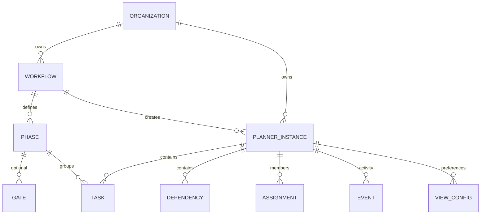

Hierarchy: **Organization → Workflow template → Planner Instance → Phases → Tasks → Dependencies → Assignments → Activity Events.**

### 3.2 Vocabulary & enums (use these exact values)

**Instance status** (`planner.instances.status`) — DB → UI label: `draft`→Draft · `planned`→Planned · `active`→Active · `blocked`→Blocked · `completed`→Completed · `archived`→Archived · `cancelled`→Cancelled.

**Task status** (`planner.tasks.status`): `todo`→To Do · `in_progress`→In Progress · `blocked`→Blocked · `done`→Done · `cancelled`→Cancelled.
> ⚠ **Never interchange:** a **task** ends at `done`; an **instance** ends at `completed`. "At risk" is **not** a status in either enum — it is a derived amber signal (§4.6).

**Entity type** (card badge, exact values): `shoot` · `campaign` · `crm_deal`. Render icon **+ text**, never colour-only.

**Dependency type** (`planner.dependencies.dependency_type`, **schema-proven** enum): `finish_to_start` · `start_to_start` · `finish_to_finish` · `start_to_finish`. Dependencies ARE stored; only the *line rendering / editor* is staged (§3.4).

**Planner views** (`planner.view_configs.default_view`, **schema-proven**): `timeline` · `kanban` · `calendar`. **List is a transient UI mode in v1 — a presentation of the same task data, NOT persisted** in `view_configs`.

**Roles (verified against PR #283 migration):**
- **Access Role** — the ONLY stored member role. `planner.assignments.role` four-tier CHECK: `owner` · `manager` · `contributor` · `viewer`. Drives all permissions; the **only** role column in SCR-34 Members.
- **Production personas** (Producer · Photographer · Retoucher · Stylist · Model · Client Approver · Coordinator) — ❌ **NOT a stored column.** `assignments.production_role` was verified **absent**. Use only as **display personas on the Dashboard (SCR-33)** and in copy — never a Members column or invite field. *(Task-level `planner.tasks.assignee_role` is a **free-text** field, distinct from the 4-tier access role — don't render it as a permission.)*
- Never show an Access Role as a job title, or a persona as a permission level.

### 3.3 Tables (10/10 schema-proven, PR #283)

**Planner tables:** `planner.workflows` · `planner.phases` · `planner.gate_conditions` · `planner.instances` · `planner.tasks` · `planner.dependencies` · `planner.assignments` · `planner.events` · `planner.view_configs` · `planner.notification_rules`. (Seed ships the **11-phase 5-Week Product Shoot** template — matches migration §8.)

**Existing platform tables (reuse — never duplicate):** `organizations` · `org_members` · `shoots` · `campaigns` · `crm_deals` · `profiles` · `public.notifications` (the Notification Center — SCR-15, reused; do **not** design a second inbox/activity/notification screen).

### 3.4 Field inventories

**Task fields (schema-proven, PR #283):** Title · Status · Start Date · End Date · Duration · Assignee · Phase · Priority — plus `assignee_role` (free text), `description`, `parent_task_id` (subtasks). Column names live in the generated `Database["planner"]["tasks"]` types; Claude Code regenerates types to confirm exact spellings. No extra fields unless a screen spec calls for them.

**Planner card fields:** Name · Status · Entity Badge · Date Range · **Progress (derived** — completed tasks / total tasks, not a stored column**)** · **Primary Assignee (derived** from `assignments`; **optional** — may be absent). **Cover** = the linked entity's asset or a muted placeholder (❌ no cover column on `instances`). Design empty/absent states for all derived fields. "At risk" (SCR-33 count, SCR-32 amber) is likewise **derived**, never a stored status.

**Gates** (`planner.gate_conditions`, schema-proven `gate_type` + `required_role` CHECKs) use the existing **ApprovalCard** pattern (no separate approval app). Gate types: **Approval · Review · Sign-off**. **ApprovalCard action contract = `Approve · Edit · Discard`** (the real component contract — do **not** invent Reject / Request-changes buttons). Gate *display* states on the board: `locked` (not yet reachable) · `ready for approval` · `approved` (a Discard outcome returns the phase to blocked).

**Timeline** supports: grouped phases · dependency lines (subtle neutral, **not** colour-coded) · drag handles (editable roles only) · milestone indicators · current-date marker.
> **Dependency-line scope (3 stages — the *data* is proven via `dependency_type`, only rendering is staged):** (1) **SCR-32 v1 prototype** — *static example* connectors only, no editing; (2) **IPI-483** — interactive connectors + dependency editing (`DependencyLine`, D-PLN-14); (3) **first engineering release** — may hide connectors entirely until IPI-483 lands. The *Dependency Editor* is out of MVP regardless.

**Realtime (design assumptions only):** changes appear automatically; presence avatars may come later; avoid full-screen loaders (use lightweight sync indicators); **no offline mode.**

### 3.5 Global design rules (specs don't state these — decide once, apply everywhere)

- **Dates & timezone:** Planner scheduling uses **date-only** values in the **organization's timezone**. Do **not** design timezone selectors or time-of-day pickers in v1; Timeline/Calendar render whole-day granularity.
- **Long content / overflow:** long task names → **truncate + tooltip**; wide Timeline → **horizontal scroll with a sticky phase (left) column**; long task lists → **virtualized**; many assignees/chips → show first 2–3 then **“+N”**; narrow columns keep a minimum bar-label width before truncating.
- **Instance naming:** an instance's display name comes from its **linked entity** (shoot/campaign/deal title) when present, else the **user-entered title** at creation, else the **workflow-template name** as fallback — in that precedence, so Hub cards read consistently.
- **Verification legend for this doc:** *schema-proven* = confirmed in PR #283 migration + generated types; *derived* = computed in the UI, never a stored column; *persona/future* = display metadata or later-phase, not stored. As of the PR #283 verify, §3 vocabulary is schema-accurate; the remaining engineering gate is regenerating types + registry/Hub process (§7).

---

## 4. Architecture & diagrams

> Diagrams 4.1–4.6 consolidate the validated set from `uploads/diagrams.md`; 4.7–4.10 are added here for the lifecycle/AI/HITL/notification flows the prompts reference but don't draw. Validate edits at mermaid.live.

### 4.1 Screen hierarchy

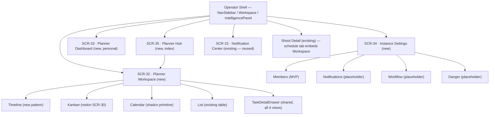

### 4.2 User navigation flow

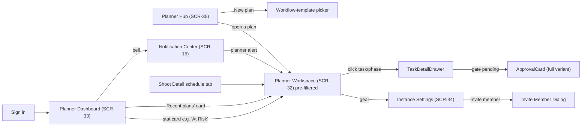

### 4.3 Component composition (reuse accounting)

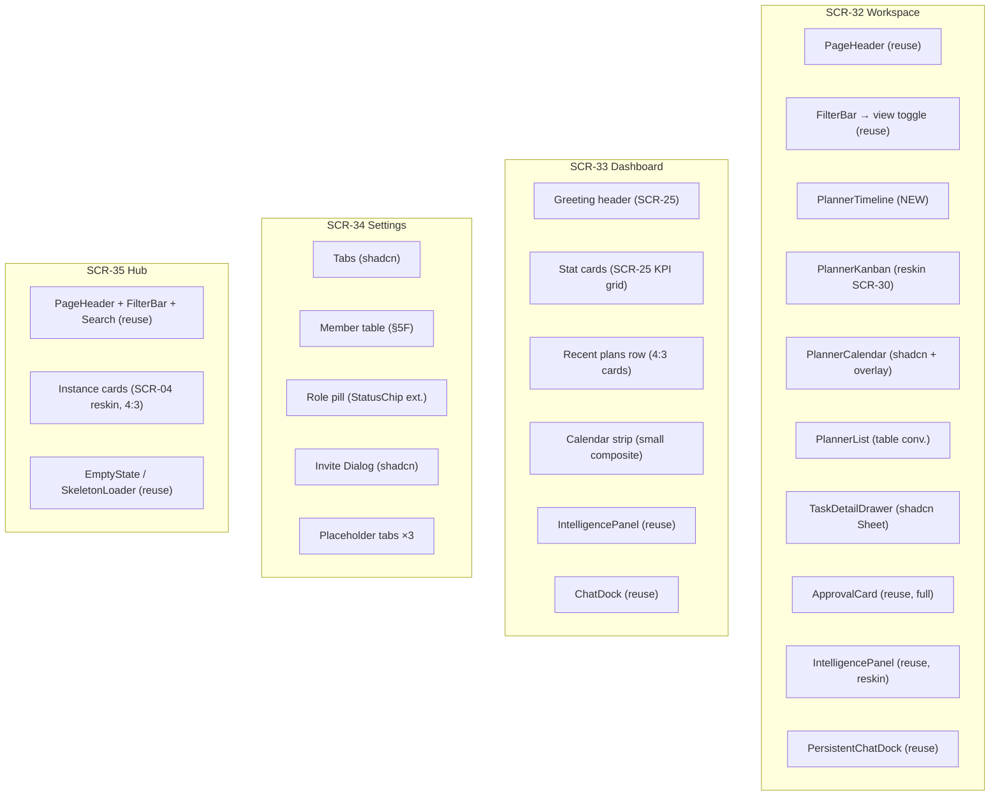

### 4.4 Workspace layout frame (SCR-32)

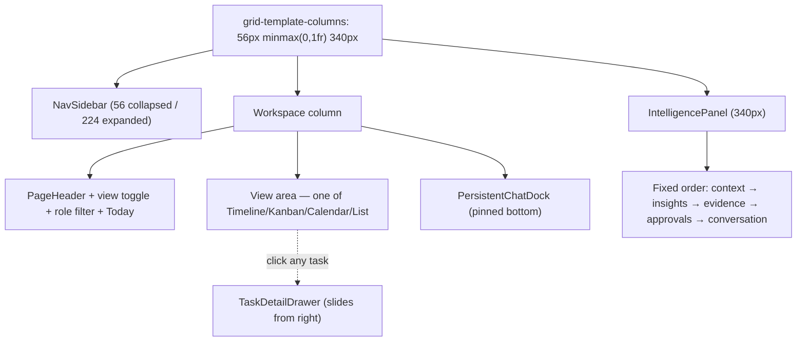

### 4.5 Responsive reflow

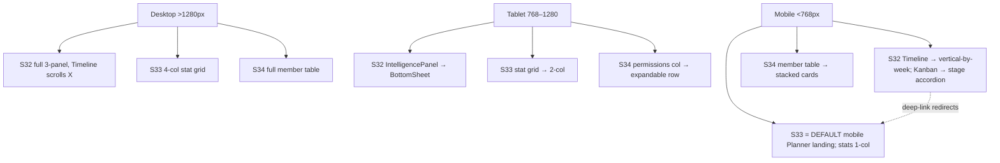

### 4.6 Instance state machine (UI mapping)

> **Corrected to the official enum** (`planner.instances.status`): `draft · planned · active · blocked · completed · archived · cancelled`. There is **no `at_risk` status** — "at risk" is a **derived UI signal** (computed from task slippage / risk events), rendered as an amber treatment on top of whatever the real status is; never a state-machine value. Note the enum split: a **task** finishes at `done`, an **instance** finishes at `completed` — never interchange them.

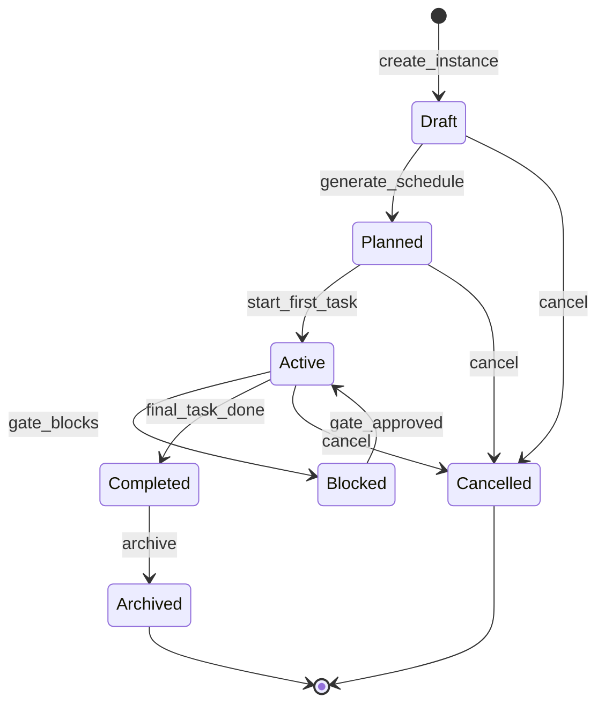

- `Draft` → SCR-32 `EmptyState` ("Select a workflow template").
- `Planned`/`Active` → populated Timeline/Kanban/Calendar/List.
- `Blocked` → gate badge on bar; `ApprovalCard` full variant in drawer.
- **At-risk (derived, not a status)** → amber `--warning` border layered over an `active`/`blocked` instance; surfaced in SCR-33 "At Risk" count + SCR-32 IntelligencePanel. Computed from slippage/risk events, so it can coexist with any live status.
- `Completed`/`Archived` → read-only render (no drag handles, no edit controls).

### 4.7 Task lifecycle (per-task, within an active instance)

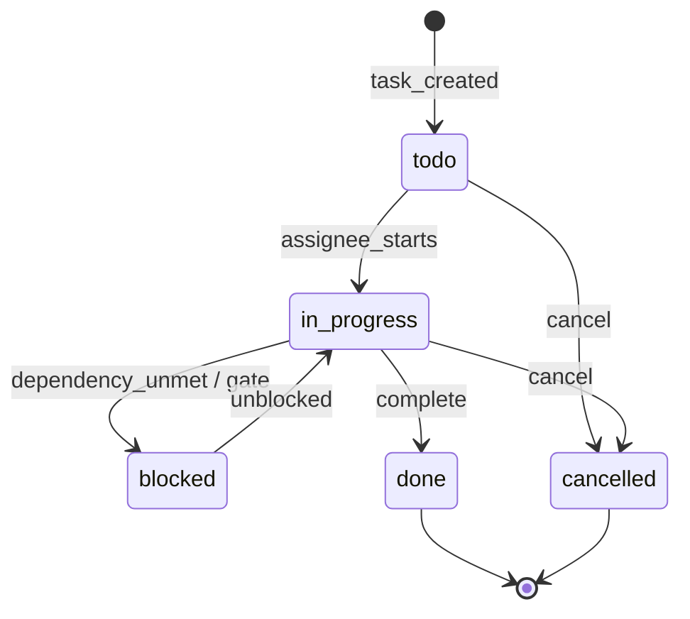

Status enum drives `StatusChip` (extend, don't fork): `todo` grey · `in_progress` black/solid · `blocked` red · `done` green+check · `cancelled` muted strikethrough.

### 4.8 AI tool flow — `production-planner` agent (IPI-482)

> ⚠ **Future / conceptual architecture (IPI-482) — design mockups only.** These tool names are *planned*, not implemented. Do not imply any of these actions is currently available in the first Planner prototype; the AI **suggests**, the operator **approves**.

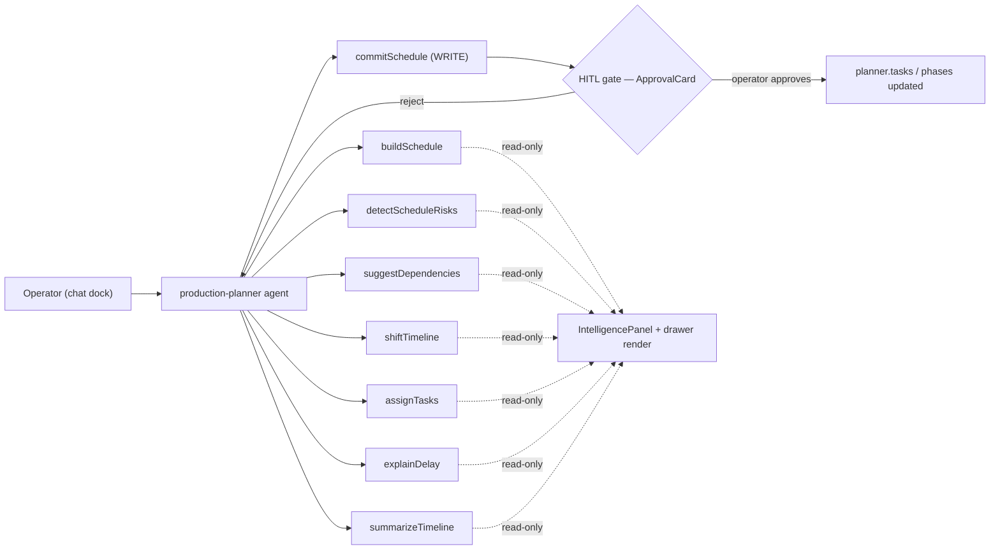

**Rule:** every read tool proposes; only `commitSchedule` writes, and it must pass the `ApprovalCard` HITL gate. The AI never mutates the schedule silently.

### 4.9 HITL approval (gate) flow

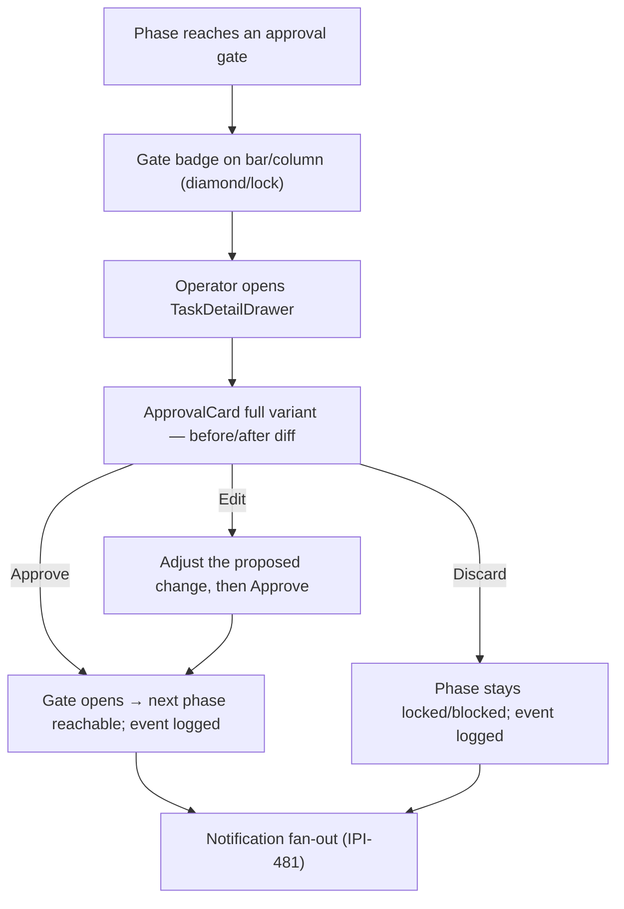

> ApprovalCard's real action contract is **`Approve · Edit · Discard`** (§3.4) — there is no separate Reject/Request-changes button. "Discard" leaves the gate unmet; "Edit" lets the operator amend the proposal before approving.

### 4.10 Notification fan-out (IPI-481, reuses SCR-15)

> ⚠ **Future architecture (IPI-481) — not available in the first Planner prototype.** Shown so the design reuses the existing Notification Center (SCR-15) rather than inventing a second inbox; the queue/fan-out itself is later engineering.

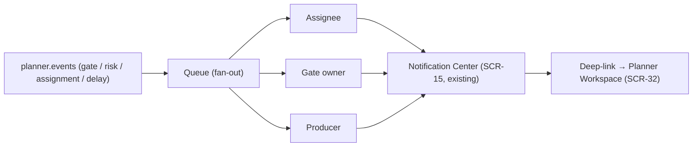

---

## 5. Wireframes (low-fi, Zeely Editorial)

> Text wireframes — structure and hierarchy only. Real builds lift exact tokens/spacing from `DESIGN.md` + the reused screens named per block. Numbers shown in `mono`.

### 5.1 SCR-32 · Planner Workspace — Timeline view (desktop)

```
┌────┬──────────────────────────────────────────────────────────┬───────────────┐
│ ▪  │  Summer Lookbook — Production Plan       [● Active]        │ INTELLIGENCE  │
│ ▫  │  ┌ Timeline │ Kanban │ Calendar │ List ┐   [Role ▾][Today]│ ───────────── │
│ ▫  │  ────────────────────────────────────────────────────────│ Context       │
│ ▫  │   WEEK      W1    W2    W3    W4    W5      (Geist Mono)   │ Summer Look…  │
│ ▫  │  ┌──────────┬─────┬─────┬─────┬─────┬─────┐  │today       │ AI insights   │
│ ▫  │  │ Casting  │▐███▌│     │     │     │     │  │ (thin black│ • Item deliv. │
│ ▫  │  │ Soft hold│     │▐██▌ │     │     │     │  │  vertical) │   at risk     │
│ ▫  │  │ Item del.│     │  ▐░░░░▌◇gate│     │     │             │ Evidence      │
│ ▫  │  │ Production│    │     │     │▐███▌│     │             │ ▸ 2 days slip │
│ ▫  │  │ Retouch  │     │     │     │  ▐██▌│     │             │ Approvals (2) │
│ ▫  │  │ Final appr│    │     │     │     │▐░░▌ │             │ [ApprovalCard]│
│ ▫  │  └──────────┴─────┴─────┴─────┴─────┴─────┘             │ Conversation  │
│    │  bars: grey=todo ▐░ black=in-prog ▐█ green✓ amber⚠ red  │               │
│ ▫  │ ─────────────────────────────────────────────────────── │               │
│ ▫  │  💬 "You're viewing Summer Lookbook. 2 tasks need approval"│               │
└────┴──────────────────────────────────────────────────────────┴───────────────┘
      click any bar → TaskDetailDrawer slides over from right
```

Kanban view = SCR-30 column pattern with **columns = workflow phases** (IPI-478 AC-B: dragging a card updates its `phase_id` **and** `status`) — **not** task-status columns. Each card shows its **task status** (StatusChip) + assignee; offer an optional **status filter** on the toolbar (filter, not columns). A **phase gate** locks its column (gate badge + ApprovalCard to enter); a task in `blocked` status shows the blocked chip on its card — phase-gate ≠ task-blocked (§4.9). Calendar view = shadcn month grid + multi-day status bars. List view = §5F table (**task · phase · assignee · start/end dates · duration · priority · StatusChip** — §3.4; List is a transient v1 mode, not persisted).

**Mobile (<768px):** deep-link redirects to Dashboard (SCR-33). If forced here: Timeline → vertical list grouped by week; Kanban → one column + stage-accordion switcher (same reflow as `SCR-MOBILE-CRM-Gallery`).

### 5.2 SCR-33 · Planner Dashboard (desktop)

```
┌────┬──────────────────────────────────────────────────────────┬───────────────┐
│ ▪  │  Good morning, Maya — 2 gates need approval, Item delivery │ INTELLIGENCE  │
│ ▫  │  is at risk.                                               │ Board health  │
│ ▫  │  ┌──────────┬──────────┬──────────┬──────────┐            │ 🟢 3 on track │
│ ▫  │  │ My Tasks │ Needs    │ At Risk  │ Due Today│  (SCR-25    │ Recommendation│
│ ▫  │  │   12     │ Approval │    3     │    4     │   KPI cards)│ ▸ Approve …   │
│ ▫  │  │  mono    │   2      │  mono⚠   │  mono    │            │ Recent activ. │
│ ▫  │  └──────────┴──────────┴──────────┴──────────┘            │ • gate opened │
│ ▫  │  Recent plans                                             │   2h ago      │
│ ▫  │  ┌────────┐ ┌────────┐ ┌────────┐   (4:3 cover, status    │               │
│ ▫  │  │ [img]● │ │ [img]● │ │ [img]● │    chip corner)         │               │
│ ▫  │  │ Summer │ │ SS26   │ │ Nike   │                         │               │
│ ▫  │  └────────┘ └────────┘ └────────┘                         │               │
│ ▫  │  Upcoming this week   Mon Tue Wed Thu Fri Sat Sun         │               │
│ ▫  │  ─────────────────────  ▪   ▪▪   ▪    ▪   (task chips)     │               │
│ ▫  │  💬 "You have 3 plans active. Item delivery needs attention"│              │
└────┴──────────────────────────────────────────────────────────┴───────────────┘
```

Stat cards are **links** (deep-link into SCR-32 pre-filtered). Show 3–4 role-relevant stats, not all 8. Role-conditional slots: Producer → budget gates; Client approver → only their approval gates.

**Mobile:** default Planner landing. Stats 1-col, recent plans horizontal scroll, calendar strip → vertical day list.

### 5.3 SCR-34 · Instance Settings — Members tab (desktop)

```
┌────┬──────────────────────────────────────────────────────────┬───────────────┐
│ ▪  │  Summer Lookbook · Settings                               │ (panel        │
│ ▫  │  ┌ Members │ Notifications⋯ │ Workflow⋯ │ Danger⋯ ┐       │  optional /   │
│ ▫  │  (active)   (aria-disabled "Coming soon")                 │  hidden on     │
│ ▫  │  ─────────────────────────────────────────  [+ Invite]   │  admin surface)│
│ ▫  │  ACCESS ROLE     NAME                              ⋯      │               │
│ ▫  │  ─────────────────────────────────────────────────────  │               │
│ ▫  │  [Owner]         Maya Chen                        ⋯      │               │
│ ▫  │  [Contributor]   Jon Alvi                         ⋯      │               │
│ ▫  │  [Contributor]   Priya R.                         ⋯      │               │
│ ▫  │  [Viewer]        dana@…            [Invited]        ⋯      │               │
│    │  (≥48px rows, soft dividers, uppercase muted header)     │               │
└────┴──────────────────────────────────────────────────────────┴───────────────┘
   ACCESS ROLE ONLY — the one stored member role (`assignments.role`):
     owner · manager · contributor · viewer   (chip)
   ❌ NO production-role column — `assignments.production_role` verified ABSENT (PR #283).
     Production personas (Producer/Photographer/…) are Dashboard display only (SCR-33),
     never a Members column or invite field.
   [+ Invite] → shadcn Dialog: email + access-role ▾   (no production-role field)
   Row ⋯ → change access role / remove (remove = confirm step)
```

**Mobile:** table → stacked cards (name · access-role chip · ⋯). Tablet: status/permissions detail → expandable row.

### 5.4 SCR-35 · Planner Hub (desktop) — reskin of SCR-04 Shoots List

```
┌────┬──────────────────────────────────────────────────────────┬───────────────┐
│ ▪  │  Planner                       12 plans · 3 need attention │ Cross-plan    │
│ ▫  │  ┌ Type: All │ Shoot │ Campaign │ CRM Deal ┐  [status ▾] 🔍│ summary       │
│ ▫  │  ─────────────────────────────────────────────  [+ New plan]│ • 4 active   │
│ ▫  │  ┌────────┐ ┌────────┐ ┌────────┐ ┌────────┐              │ • 3 at risk   │
│ ▫  │  │ [4:3]● │ │ [4:3]● │ │ [4:3]● │ │ [4:3]● │  (Shoot-card  │               │
│ ▫  │  │ Summer │ │ SS26   │ │ Q3 push│ │ Elite  │   anatomy)    │               │
│ ▫  │  │🎬 shoot │ │📣campgn│ │🎬 shoot │ │💼crm_deal│            │               │
│ ▫  │  │ ●Active│ │●Planned│ │⚠At risk│ │●Draft  │              │               │
│ ▫  │  └────────┘ └────────┘ └────────┘ └────────┘              │               │
│ ▫  │  💬 "You have 4 active plans. Summarize what needs attention?"│             │
└────┴──────────────────────────────────────────────────────────┴───────────────┘
   card → SCR-32 (default_view).  [+ New plan] → workflow-template picker (not a new wizard)
   entity-type badge = icon + text, exact values shoot·campaign·crm_deal (never colour-only)
   card fields (reference): Name · Status · Entity Badge · Date Range · Progress · Primary Assignee
```

**Mobile:** single-column card stack (same as Shoots List mobile). Deep-link default still redirects to Dashboard.

---

## 6. Implementation tasks

> Priority: P0 critical path · P1 core · P2 later. Complexity: S/M/L. Design-lane tasks (`D-PLN-*`) produce the `.dc.html` prototype; engineering issues (`IPI-*`) are the backend/React they depend on. **Prototypes build on fixtures — no backend needed to design.**

| ID | Feature | Description | Depends on | Priority | Cx | Risks | Linear epic |
|---|---|---|---|:--:|:--:|---|---|
| **D-PLN-1** | SCR-32 Workspace shell + **Timeline** | 3-panel shell reuse; build the new Gantt Timeline (pill bars, status-border-only, mono week headers, black today line); wire view toggle | conventions §5 tokens | **P0** | **L** | Timeline is the only net-new visual — over-design risk; must obey status-colour-only rule | IPI-478 |
| **D-PLN-2** | SCR-32 **Kanban** view | Reskin `SCR-30-CRM-Pipeline` — **columns = workflow phases** (IPI-478 AC-B: drag updates `phase_id` + `status`), **not** task statuses; each card shows its **task-status StatusChip** + assignee; optional **status filter** on toolbar; phase **gate** locks its column (ApprovalCard to enter) | D-PLN-1 | P0 | M | ✅ **phase columns** per IPI-478 AC-B (reverted an earlier status-column error) | IPI-478 |
| **D-PLN-3** | SCR-32 **Calendar** + **List** views | shadcn Calendar (month scope v1; week/day later) + multi-day status bars; List = §5F table, **transient v1 mode, not persisted in `view_configs`** | D-PLN-1 | P1 | M | event-bar overlay is the only new bit | IPI-478 |
| **D-PLN-4** | `TaskDetailDrawer` (shared) | One shadcn `Sheet` from all 4 views; view-only variant for read-only roles; "Edit dates" form = non-drag alternative; fields per §3.4 (schema-proven, confirm exact names via generated types); **ApprovalCard contract = `Approve · Edit · Discard`** (no invented Reject/Request-changes) | D-PLN-1 | P0 | M | must be ONE drawer, not four | IPI-478 |
| **D-PLN-5** | SCR-32 states | empty (template picker) · loading (bar skeletons) · not-found (amber) · error (red) · read-only · **permission-denied** · **sync-failed** · approval-gate (diamond + ApprovalCard) | D-PLN-1..4 | P0 | M | gate state must reuse ApprovalCard, not a new modal | IPI-478 |
| **D-PLN-6** | SCR-33 Dashboard | Reskin `SCR-25` shell — greeting, 3–4 role KPI cards (links), recent-plans 4:3 row, week strip; **mark At Risk + Progress as derived** | SCR-25 | **P0** | M | don't cram 8 stats; role-conditional slots | IPI-479 |
| **D-PLN-7** | SCR-33 role variants + states | Producer + Client-approver **display personas** (not stored roles); empty (unassigned) / loading / error | D-PLN-6 | P1 | S | personas are Dashboard display only — access role (`assignments.role`) drives permissions | IPI-479 |
| **D-PLN-8** | SCR-34 Members tab | §5F member table with **one role column = Access Role** (`owner/manager/contributor/viewer`); Invite Dialog (shadcn, access-role only); disabled placeholder tabs ×3 | shadcn Tabs/Dialog | P1 | M | ✅ **access-role only** — `assignments.production_role` verified ABSENT (PR #283); reverted a two-column error | IPI-479 |
| **D-PLN-9** | SCR-34 states + destructive guard | owner-only / loading / **invite states: pending · expired (+resend) · accepted · failed** (inline); remove-member confirm step | D-PLN-8 | P1 | S | destructive action needs confirm | IPI-479 |
| **D-PLN-10** | SCR-35 Planner Hub | Reskin `SCR-04` — PageHeader + FilterBar (type/status) + search + 4:3 instance cards + New-plan → template picker | SCR-04 | P2 | M | **design-approved; engineering blocked until Linear issue exists** | *(new PLN-009)* |
| **D-PLN-11** | `StatusChip` planner enums | Add task enum (`todo/in_progress/blocked/done/cancelled`) + instance enum (`draft…cancelled`) MAP entries | — | P0 | S | extend, never fork the component | IPI-476 |
| **D-PLN-12** | Mobile reflows (all 4) | Timeline→week-list; Kanban→status-column accordion; Dashboard=mobile default landing; Members→cards; Hub→1-col. **Preserve deep-link intent** — a link to a specific instance opens that instance's mobile Workspace, don't silently bounce to Dashboard | D-PLN-1,6,8,10 | P1 | M | reuse existing mobile patterns, not new | IPI-478 F |
| **D-PLN-13** | `--planner-*` token block | 13 tokens (row/bar height, radii, grid gap, today marker, drop target…) into tokens.css referencing existing primitives | — | P0 | S | must reference `--color-*`/`--radius-*`, no raw hex | IPI-476 |
| D-PLN-14 | *(deferred)* `DependencyLine` | 1.5px grey SVG connectors on Timeline | D-PLN-1 | P2 | S | out of scope until issue active | IPI-483 |
| D-PLN-15 | *(deferred)* `PresenceBar` | active-viewer avatars (NavSidebar dot treatment) | D-PLN-1 | P2 | S | out of scope until issue active | IPI-480 |

### 6.1 Acceptance criteria (per screen, design DoD)

- **SCR-32:** desktop/tablet/mobile layouts · full keyboard nav (every bar/card/chip focusable, documented drag equivalents) · empty/loading/error/not-found/**permission-denied**/**sync-failed** states · read-only variant · gate states (locked/ready/approved) + **ApprovalCard `Approve·Edit·Discard`** · colour-independent status · **Kanban columns = phases** (cards show task-status StatusChip) · overflow rules (§3.5: truncate+tooltip, sticky phase column, horizontal scroll, virtualized lists, +N chips) · date-only rendering · `prefers-reduced-motion` respected.
- **SCR-33:** desktop 4-col / tablet 2-col / mobile 1-col (default landing) · stat cards are real focusable links with names beyond the number · empty/loading/error · Producer + Client-approver variants · At Risk + Progress shown as **derived** · calendar-strip cells have text equivalents.
- **SCR-34:** desktop table (**Access role column only**) / tablet expandable-row / mobile cards · table semantics + focus-trapped Invite dialog · owner-only/loading/**invite states (pending/expired+resend/accepted/failed)** · disabled tabs have `aria-disabled` + reason · remove-member confirm · **no production-role column** (verified absent).
- **SCR-35:** desktop/tablet/mobile · every card + filter focusable · empty/loading/error · entity-type badges (`shoot`/`campaign`/`crm_deal`) never colour-only · instance naming precedence (§3.5) · **a real Linear issue exists before implementation.**

### 6.2 Build order / critical path

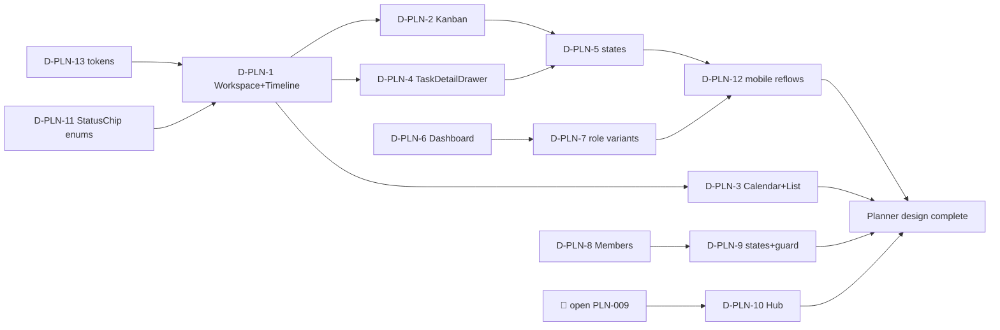

**Recommended sequence:** tokens + StatusChip enums → Workspace/Timeline (highest-risk new pattern, do it first) → Kanban + TaskDetailDrawer + states → Dashboard (fast SCR-25 reskin) → Members → mobile reflows → *(unblock)* Hub. Deferred `DependencyLine`/`PresenceBar` last, only when their issues activate.

---

## 7. Readiness

| Dimension | Score | Note |
|---|:--:|---|
| Design spec completeness | 🟢 96 | 4 prompts + conventions + diagrams, all discipline-checked |
| Reuse discipline | 🟢 98 | 3 of 4 screens reskin shipped screens; only Timeline is new |
| Diagram coverage | 🟢 95 | 10 diagrams incl. lifecycle/AI/HITL/notif |
| Prototype build | ⚪ 0 | none built yet — this plan is the build brief |
| Backend readiness | 🟡 — | IPI-476…483; out of design scope, gates prototypes going live |
| Scope hygiene | 🟢 97 | deferred/out-of-scope explicitly fenced (conventions §6) |

**🔴 Blockers:** SCR-35 Hub has no Linear issue — open one before building it (design is otherwise ready).
**🟡 Watch:** keep the Timeline inside the status-colour-only rule; keep SCR-34's three extra tabs disabled; don't let any of the 8 deferred screens re-enter scope.
**🟢 Strength:** the Planner is a near-pure reuse of the existing system — low visual risk, one genuinely new pattern, everything mapped to real IPI issues.

---

## 8. Files

- **This plan:** `planner/planner.md`
- **Source prompts:** `uploads/00-review-and-conventions.md` · `uploads/SCR-32…35-*.md` · `uploads/diagrams.md` · **Planner Supabase design reference** (data model in §3, this doc)
- **Registry:** SCR-32…35 added to `docs/handoff/SCREEN-REGISTRY.md`
- **Reuse basis (existing prototypes):** `Pages/SCR-30-CRM-Pipeline.dc.html` (Kanban) · `Pages/SCR-25-Role-Dashboards.dc.html` (Dashboard) · `Pages/Shoots List.v2.image-first.dc.html` (Hub) · `components/*.dc.html` (shell primitives)
