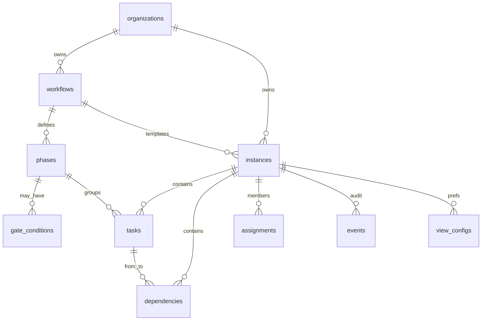

# Planner — Supabase reference for Claude Design

**Audience:** Claude Design sessions for `SCR-32`–`SCR-35`  
**Not for:** migration authoring, RLS debugging, or full backend architecture  
**Schema SSOT (verified 2026-07-10):**

| Source | Path / ref |
|--------|------------|
| Migration (PR **#283**, merged) | `supabase/migrations/20260709000000_planner_schema_rls.sql` |
| Generated types | `app/src/types/supabase.ts` → `Database["planner"]` |
| Design plan (UI SSOT) | `00-design-plan.md` in this folder |
| Screen prompts | `SCR-32`…`SCR-35` — must match this file’s vocabulary |

**Legend**

| Tag | Meaning |
|-----|---------|
| **schema-proven** | Column / enum / check exists in migration + types |
| **derived** | Computed in UI — never a stored status/column |
| **persona / display** | Product language only — **not** a DB column |
| **future** | IPI-480 / 481 / 482 / 483 — mock as empty/disabled, do not imply live |

Upload with `00-review-and-conventions.md` + the screen prompt. Visual system = `DESIGN.md` v3 (Zeely Editorial) — not this file.

---

## 1. One-sentence model

An org owns **workflow templates** (phases + optional gates). Creating a plan materializes a **planner instance** bound to a shoot / campaign / CRM deal, with **tasks**, **dependencies**, **access-role assignments**, and optional per-user **view prefs**. Live updates broadcast on Realtime channel `planner:<instanceId>`. In-app alerts reuse **`public.notifications`** — do not design a second notification inbox.

---

## 2. Enums & constrained values (schema-proven)

Use these **exact** strings in chips, filters, and copy. Colour = **status only** (amber / green / red / grey) — **no rainbow phase colors**.

### 2.1 Postgres enums (`planner.*`)

| Type | Values |
|------|--------|
| `instance_status` | `draft` · `planned` · `active` · `blocked` · `completed` · `archived` · `cancelled` |
| `task_status` | `todo` · `in_progress` · `blocked` · `done` · `cancelled` |
| `dependency_type` | `finish_to_start` · `start_to_start` · `finish_to_finish` · `start_to_finish` |

> **Never interchange:** task finished = **`done`**; instance finished = **`completed`**.  
> **There is no `at_risk` status** on either enum. “At risk” is **derived** (amber treatment).

### 2.2 Text CHECKs / conventions (not Postgres enums)

| Field | Allowed values | Notes |
|-------|----------------|-------|
| `instances.entity_type` | `shoot` · `campaign` · `crm_deal` | Badge = icon + text, never colour-only |
| `assignments.role` | `owner` · `manager` · `contributor` · `viewer` | **Access role only** (permissions) |
| `tasks.priority` | `low` · `medium` · `high` · `critical` | Default `medium` |
| `view_configs.default_view` | `timeline` · `kanban` · `calendar` | **List is UI-only** — not stored |
| `phases.gate_type` | `null` · `approval` · `review` · `signoff` | Free `text`, convention from seed/comments |
| `phases.required_role` | typically an access role string | Free `text` (seed uses `manager` / `owner`) |
| `gate_conditions.condition_type` | `all_tasks_done` · `role_approval` · `dependency_met` · `date_reached` | CHECK |
| `notification_rules.channel` | `in_app` · `email` · `push` · `sms` | Settings tab = placeholder in SCR-34 |

### 2.3 Access role → chrome (schema-proven)

| `assignments.role` | Design intent |
|--------------------|---------------|
| `owner` | Full control; invite/remove; archive |
| `manager` | Edit schedule; manage contributors/viewers |
| `contributor` | Update assigned tasks; limited schedule edits |
| `viewer` | Read-only (no drag handles) |

### 2.4 Production personas — **not schema-proven**

Producer · Photographer · Retoucher · Stylist · Model · Client Approver · Coordinator  

These are **persona / display** labels for SCR-33 role-conditional *slots* and optional copy.  
**There is no `assignments.production_role` (or equivalent) column.**  
SCR-34 Members MVP shows **access role only**. Do not invent a second role column unless a future migration adds it.

### 2.5 Gate UI states — **derived** (not DB enums)

Map to existing **ApprovalCard** actions (`Approve` · `Edit` · `Discard` per `DESIGN.md`) — do **not** invent Reject / Request-changes buttons.

Suggested derived chrome: `locked` · `ready` · `approved` · `rejected`/`discarded` · (optional) changes via **Edit**. Exact persistence of gate outcomes is IPI-483 / events — design the card, don’t invent a gate-status table.

---

## 3. Tables (10 — all schema-proven)

Schema name is **`planner`** (not `public.planner_*`).

| Table | UI use | Screens |
|-------|--------|---------|
| `workflows` | Template name, category | Hub “New plan”, SCR-32 empty |
| `phases` | **Kanban columns**, Timeline groups | SCR-32 |
| `gate_conditions` | Why a gate is locked | ApprovalCard / gated column |
| `instances` | Plan card / header | Hub, Dashboard, Workspace |
| `tasks` | Bars, cards, list rows, drawer | SCR-32 (+ Dashboard filters) |
| `dependencies` | Connector lines | Timeline — **future** IPI-483 (static fixture OK in v1) |
| `assignments` | Members + access filtering | SCR-34, Dashboard “mine” |
| `events` | Activity / evidence snippets | Drawer / IntelligencePanel — **not** a dedicated Activity screen |
| `view_configs` | Persisted default view + filters | SCR-32 toolbar |
| `notification_rules` | Rule config | SCR-34 Notifications — **placeholder only** |

### Reuse outside `planner` (do not duplicate)

| Existing | Use for |
|----------|---------|
| `organizations` / `org_members` | Org isolation |
| `shoots` / campaigns / CRM deals | Entity link (`entity_type` + `entity_id`) |
| `public.notifications` (+ SCR-15) | Bell inbox — fan-out **future** (IPI-481) |
| `auth.users` + profiles | Avatars, assignee names |

### Does **not** exist — do not design

| Imagined | Reality |
|----------|---------|
| `production_role` column | Persona/display only |
| `at_risk` status | Derived amber signal |
| `planner_comments` / labels / custom fields | Deferred — no AC |
| `planner_history` table | Use `events` |
| Workflow Template Builder UI | Seeded SQL only in v1 |
| Separate Approval History page | `events` + ApprovalCard |
| Cover image on `instances` | Join entity assets or muted placeholder |
| Stored “progress %” | **Derived** = done tasks / total tasks |

---

## 4. Field inventories (schema-proven columns only)

### 4.1 `planner.instances`

| Column | Type notes | UI |
|--------|------------|-----|
| `name` | text | Title (also naming fallback — see §4.6) |
| `status` | `instance_status` | StatusChip |
| `entity_type` / `entity_id` | check + uuid | Badge + deep link |
| `planned_start` / `planned_end` | **date** | Date range (date-only, org timezone) |
| `owner_user_id` | uuid? | Optional owner meta |
| `workflow_id` | uuid | Template link |
| `org_id` | uuid | Tenancy (not shown) |

**Derived / external:** Progress; At risk; Cover image; “Primary assignee” (from `assignments` — optional).

### 4.2 `planner.tasks`

| Column | UI |
|--------|-----|
| `title` | Card / bar / list / drawer |
| `description` | Drawer body (optional) |
| `status` | StatusChip / bar border |
| `start_date` / `end_date` | Dates (date-only) |
| `duration_days` | Duration |
| `assignee_user_id` | Assignee avatar/name |
| `assignee_role` | Optional denormalized role **string** at assign time (not production persona enum) |
| `phase_id` | Phase label / Kanban column |
| `priority` | List / drawer |
| `sort_order` | Ordering |
| `parent_task_id` | Optional nesting — **do not** design a full subtask product in v1 |

### 4.3 `planner.phases`

| Column | UI |
|--------|-----|
| `slug` / `name` | Column / group labels |
| `order_index` | Column order |
| `default_duration_days` | Template / empty-state hints |
| `gate_type` / `required_role` | Gated column lock + who can approve |

### 4.4 `planner.assignments`

| Column | UI |
|--------|-----|
| `user_id` | Member name/avatar |
| `role` | Access-role StatusChip |
| `permissions` | Optional JSONB override — show as readable summary only if present; **do not** invent checkbox matrices beyond invite presets |

### 4.5 `planner.view_configs`

| Column | UI |
|--------|-----|
| `default_view` | Toolbar persistence (`timeline` \| `kanban` \| `calendar`) |
| `filters` / `sort_config` | JSON — opaque to design; filters feel instant |

### 4.6 Instance naming precedence (design rule)

1. Linked entity title (shoot/campaign/deal) when available  
2. Else `instances.name`  
3. Else workflow template `workflows.name`  

### 4.7 Kanban model (authority: IPI-478 AC-B)

**Columns = phases** (`phases` ordered by `order_index`).  
Cards = tasks; drag updates `phase_id` (+ may update `status`).  
Task `status` appears on the **card** (StatusChip), not as column headers.  
Gated phases (`gate_type` set) → locked column + “Enter via approval only” (SCR-30 pattern).

---

## 5. Seed template — “5-Week Product Shoot” (schema-proven seed)

From migration §8 (idempotent per org): `category: production`, `is_default: true`.

| # | Slug | Name | Days | `gate_type` | `required_role` |
|---|------|------|-----:|-------------|-----------------|
| 1 | `brief` | Brief confirmation | 2 | — | — |
| 2 | `casting` | Casting | 3 | `approval` | `manager` |
| 3 | `soft-hold` | Soft hold on shoot date | 1 | — | — |
| 4 | `item-delivery` | Item delivery | 5 | — | — |
| 5 | `outfit-confirm` | Outfit confirmation | 2 | `approval` | `manager` |
| 6 | `payment-sched` | Payment & scheduling | 2 | — | — |
| 7 | `awaiting-shoot` | Awaiting shoot | 1 | — | — |
| 8 | `production` | Production | 3 | — | — |
| 9 | `retouching` | Retouching | 5 | — | — |
| 10 | `final-approval` | Final approval | 2 | `signoff` | `owner` |
| 11 | `product-return` | Product return | 3 | — | — |

Gated columns: `casting`, `outfit-confirm`, `final-approval`.

---

## 6. Relationship diagram (design-level)



```text
Org → Workflow (11 phases)
    → Instance (shoot | campaign | crm_deal)
        → Tasks (in phases) + Dependencies
        → Assignments (access roles)
        → Events · View configs
```

---

## 7. Permission matrix (chrome show/hide)

| Capability | owner | manager | contributor | viewer |
|------------|:-----:|:-------:|:-----------:|:------:|
| See plan | ✓ | ✓ | ✓ | ✓ |
| Drag / resize Timeline | ✓ | ✓ | ✓* | — |
| Edit task in drawer | ✓ | ✓ | ✓* | — |
| Invite / change roles | ✓ | ✓** | — | — |
| Approve gate | if `required_role` met | if met | — | — |
| Read-only chrome | — | — | — | ✓ |

\* Assigned work for contributors. \*\* Manager cannot transfer ownership.

SCR-32 must include a **viewer** variant. SCR-34 is the only Members surface.

---

## 8. Realtime & presence

| Concern | Fact | Design |
|---------|------|--------|
| Live updates | Broadcast `planner:<instanceId>` | Subtle sync; no spinner wall |
| Presence | **future** IPI-480 | Hide / empty slot |
| Conflicts | Last-write-wins (`updated_at`) | No conflict modal in v1 |
| Offline | Unsupported | No offline badge |

---

## 9. AI surface (**future** IPI-482)

Chat dock = existing **`production-planner`** agent. Tool names below are **planned**, not live — dock copy must not imply they exist yet:

`buildSchedule` · `shiftTimeline` · `detectScheduleRisks` · `suggestDependencies` · `assignTasks` · `commitSchedule` · `explainDelay` · `summarizeTimeline`

HITL = **ApprovalCard** (`Approve` / `Edit` / `Discard`) — AI suggests, operator confirms. No silent writes.

---

## 10. Screen → data checklist

| Screen | Bind to | Must not invent |
|--------|---------|-----------------|
| **SCR-35 Hub** | `instances` (+ entity badge), filters `entity_type` / `status` | Workflow builder, analytics; **needs Linear issue before build** |
| **SCR-33 Dashboard** | `assignments` + `tasks` (“mine”), instance cards | Cross-plan analytics product; production_role column |
| **SCR-32 Workspace** | `tasks`, `phases` (**Kanban columns**), `instances`, `view_configs`; deps optional fixture | Status-column Kanban; comments; dependency inspector page |
| **SCR-34 Settings** | `assignments.role` (access); other tabs disabled | Production-role column; full notification-rules admin |

---

## 11. Engineering caveats (do not block design)

| Item | Status after PR #283 |
|------|----------------------|
| Migration on `main` | ✅ merged |
| `config.toml` schemas includes `planner` | ✅ |
| Generated `Database["planner"]` types | ✅ (regenerate if local types lag) |
| Table GRANTs / follow-up probes | See IPI-476 follow-ups (e.g. PR #295) — design unaffected |

---

## 12. Quick do / don’t

**Do**

- Exact enum / check strings above in StatusChip maps.  
- Mock the 11-phase seed template; **Kanban columns = phases**.  
- Gates = lock + ApprovalCard.  
- Reuse SCR-15 bell; SCR-04 card anatomy for Hub.

**Don’t**

- Invent `production_role`, `at_risk` status, comments, labels, Workflow Builder.  
- Use `completed` as a task status.  
- Colour-code phases.  
- Design a second notification center or Activity Timeline page.  
- Persist List as `default_view`.
