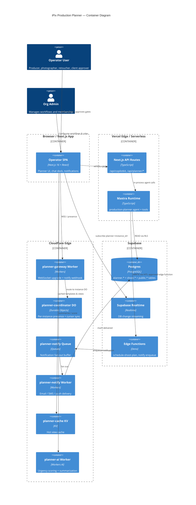
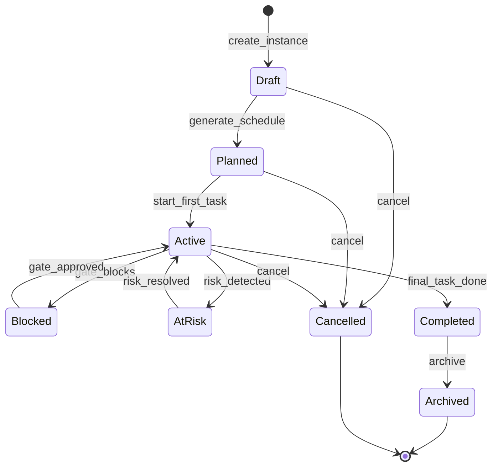
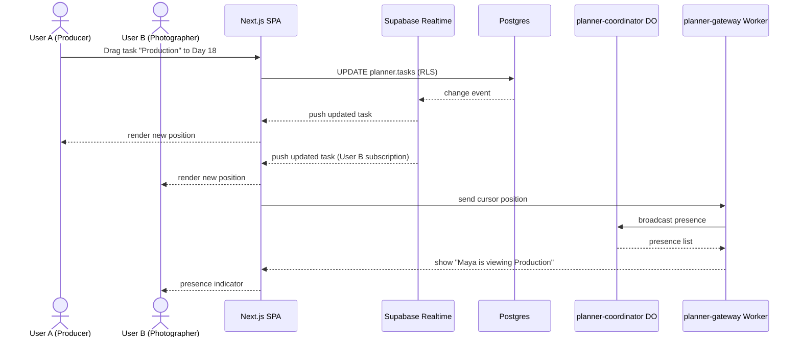
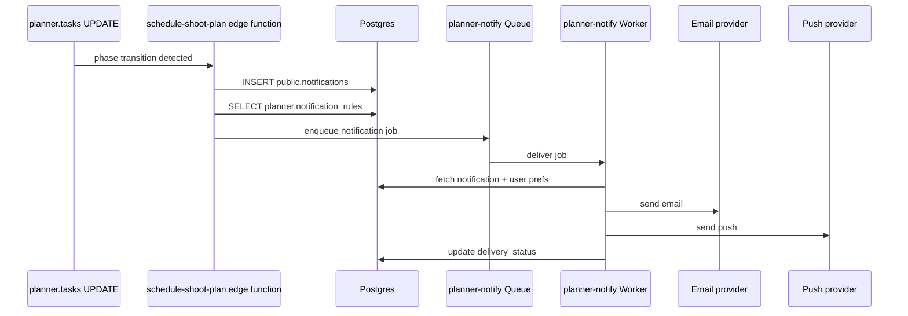
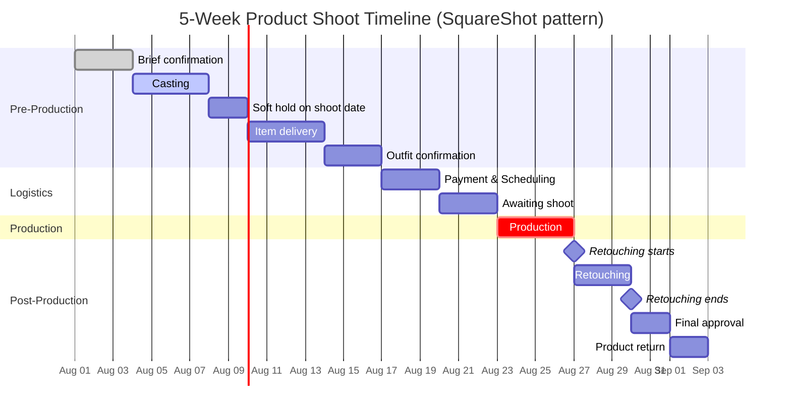
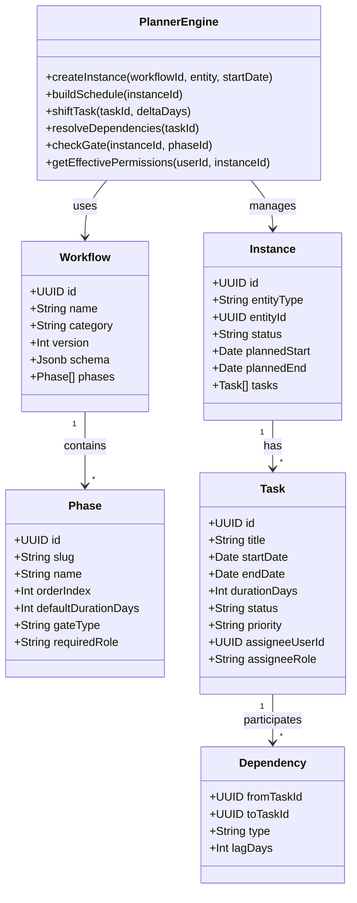
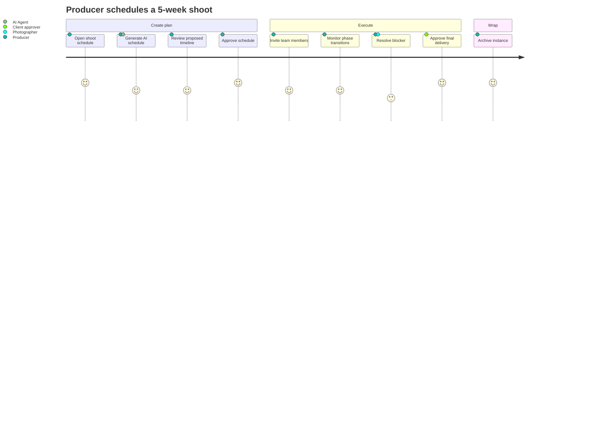
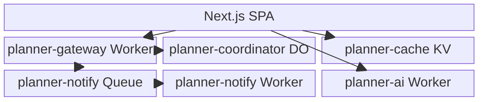

# iPix Production Planner — Mermaid Diagrams

**Output folder:** `Universal-design-prompt-new/plan/planner/`  
**Companion docs:** `architecture-plan.md`, `wireframes.md`

Each diagram is rendered as a fenced Mermaid block. Validate syntax at https://mermaid.live before committing.

---

## 1. C4 Container — Planner System Architecture



---

## 2. Entity Relationship — Planner Domain

```mermaid
erDiagram
    ORG ||--o{ PLANNER_WORKFLOW : owns
    ORG ||--o{ PLANNER_INSTANCE : runs
    PLANNER_WORKFLOW ||--|{ PLANNER_PHASE : contains
    PLANNER_PHASE ||--o{ PLANNER_GATE_CONDITION : guards
    PLANNER_INSTANCE ||--|| PLANNER_WORKFLOW : uses
    PLANNER_INSTANCE ||--o{ PLANNER_TASK : has
    PLANNER_INSTANCE ||--o{ PLANNER_DEPENDENCY : has
    PLANNER_INSTANCE ||--o{ PLANNER_ASSIGNMENT : members
    PLANNER_INSTANCE ||--o{ PLANNER_EVENT : records
    PLANNER_INSTANCE ||--o{ PLANNER_VIEW_CONFIG : prefs
    PLANNER_PHASE ||--o{ PLANNER_TASK : groups
    PLANNER_TASK ||--o{ PLANNER_DEPENDENCY : from
    PLANNER_TASK ||--o{ PLANNER_DEPENDENCY : to
    USER ||--o{ PLANNER_ASSIGNMENT : assigned
    USER ||--o{ PLANNER_TASK : owns
    USER ||--o{ PLANNER_VIEW_CONFIG : configures
    PLANNER_WORKFLOW ||--o{ PLANNER_NOTIFICATION_RULE : rules

    ORG {
        uuid id PK
        string name
    }

    PLANNER_WORKFLOW {
        uuid id PK
        uuid org_id FK
        string name
        string category
        int version
        jsonb schema
        boolean is_default
    }

    PLANNER_PHASE {
        uuid id PK
        uuid workflow_id FK
        string slug
        string name
        int order_index
        int default_duration_days
        string gate_type
        string required_role
    }

    PLANNER_GATE_CONDITION {
        uuid id PK
        uuid phase_id FK
        string condition_type
        jsonb condition
    }

    PLANNER_INSTANCE {
        uuid id PK
        uuid org_id FK
        uuid workflow_id FK
        string entity_type
        uuid entity_id
        string name
        string status
        date planned_start
        date planned_end
        uuid owner_user_id FK
    }

    PLANNER_TASK {
        uuid id PK
        uuid instance_id FK
        uuid phase_id FK
        uuid parent_task_id FK
        string title
        text description
        date start_date
        date end_date
        int duration_days
        string status
        string priority
        uuid assignee_user_id FK
        string assignee_role
    }

    PLANNER_DEPENDENCY {
        uuid id PK
        uuid instance_id FK
        uuid from_task_id FK
        uuid to_task_id FK
        string type
        int lag_days
    }

    PLANNER_ASSIGNMENT {
        uuid id PK
        uuid instance_id FK
        uuid user_id FK
        string role
        jsonb permissions
    }

    PLANNER_EVENT {
        uuid id PK
        uuid instance_id FK
        uuid task_id FK
        uuid actor_user_id FK
        string event_type
        jsonb payload
        timestamp created_at
    }

    PLANNER_VIEW_CONFIG {
        uuid id PK
        uuid user_id FK
        uuid instance_id FK
        string default_view
        jsonb filters
        jsonb columns
    }

    PLANNER_NOTIFICATION_RULE {
        uuid id PK
        uuid org_id FK
        uuid workflow_id FK
        string event_type
        string role
        string channel
        string template_ref
        int delay_minutes
        boolean is_active
    }

    USER {
        uuid id PK
        string email
    }
```

---

## 3. State Diagram — Planner Instance Lifecycle



---

## 4. Sequence Diagram — Real-Time Update Flow



---

## 5. Flowchart — AI Schedule Generation with HITL

```mermaid
flowchart TD
    A[User asks agent: "Build a 5-week schedule for Summer Lookbook"] --> B[Mastra production-planner agent]
    B --> C[Tool: buildSchedule]
    C --> D[Read workflow template + deliverables]
    D --> E[Generate proposed tasks + dependencies]
    E --> F[Return draft to chat]
    F --> G{User approves?}
    G -->|Yes| H[Tool: commitSchedule]
    H --> I[Edge function: schedule-shoot-plan]
    I --> J[INSERT planner.tasks + dependencies]
    J --> K[Notify subscribers]
    G -->|No| L[User edits / cancels]
    L --> M[Agent revises draft]
    M --> F
```

---

## 6. Sequence Diagram — Notification Fan-Out



---

## 7. Gantt Chart — 5-Week Product Shoot Timeline



---

## 8. Flowchart — Dependency Auto-Shift

```mermaid
flowchart TD
    A[Task "Item delivery" end_date moved +2 days] --> B[Engine queries planner.dependencies]
    B --> C{Successor exists?}
    C -->|Yes| D[Calculate forward shift + lag]
    D --> E[Update successor start/end dates]
    E --> F{Successor has successors?}
    F -->|Yes| D
    F -->|No| G[Mark plan as AtRisk if deadline missed]
    C -->|No| H[No propagation]
    G --> I[Notify affected assignees]
    H --> J[Done]
```

---

## 9. Class Diagram — Planner Engine Types



---

## 10. User Journey — Producer Schedules a Shoot



---

## 11. Block Diagram — Cloudflare Edge Components



---

## 12. Requirement Diagram — Planner Compliance

```mermaid
requirementDiagram
    requirement ReusableEngine {
        id: 1
        text: One planner engine powers shoots, campaigns, and CRM deals.
        risk: medium
        verifymethod: test
    }

    requirement HybridViews {
        id: 2
        text: Timeline, kanban, and calendar views share one data model.
        risk: low
        verifymethod: test
    }

    requirement RoleBased {
        id: 3
        text: Views and permissions are filtered by user role.
        risk: medium
        verifymethod: inspection
    }

    requirement Realtime {
        id: 4
        text: Multiple users see updates in under one second.
        risk: high
        verifymethod: test
    }

    requirement HITL {
        id: 5
        text: AI schedule commits require explicit human approval.
        risk: high
        verifymethod: demonstration
    }

    ReusableEngine <- satisfies - HybridViews
    HybridViews <- satisfies - RoleBased
    RoleBased <- satisfies - Realtime
    Realtime <- satisfies - HITL
```
