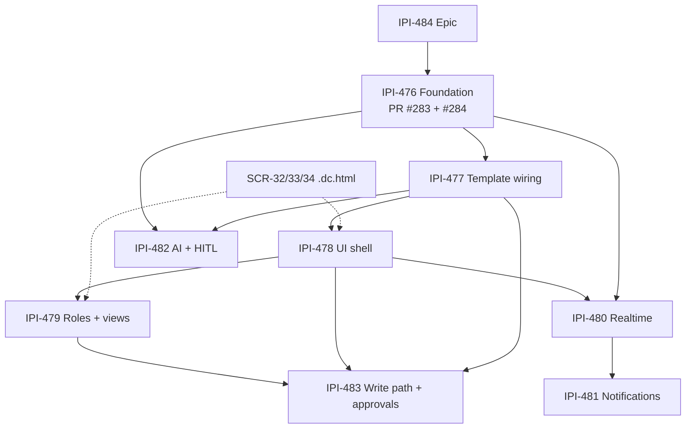

# Production Planner — Audit Plan & Merge Roadmap

> **Not the design SSOT.** Claude Design / screen briefs live in `design-prompts/00-design-plan.md` + `supabase-reference.md` + `SCR-32`…`35`. This file is the **engineering** epic/PR audit.

**Date:** 2026-07-10  
**Scope:** [review-prs.md](tasks/review-prs.md) · [prompt-design.md](tasks/prompt-design.md) · PR [#283](https://github.com/amo-tech-ai/lumina-studio/pull/283) · PR [#284](https://github.com/amo-tech-ai/lumina-studio/pull/284) · [IPI-484 · Production Planner — Epic Tracker](https://linear.app/amo100/issue/IPI-484/production-planner-epic-tracker)  
**Evidence base:** `origin/main`, `origin/ipi/476-planner-schema`, `origin/ipi/476-planner-engine`, `linear/issues/IPI-476..483-PLN-*.md`, CI status, on-disk code (not assumed from docs)

---

## Executive summary

The Production Planner epic is **architecturally sound and correctly sequenced**, but **foundation work is not on `main` yet**. PR #283 (schema) and PR #284 (engine) are open, CI-green, and substantially complete — yet three **merge blockers** remain on the schema PR before either can land safely:

1. **`planner` schema not exposed in PostgREST** (`supabase/config.toml` still `schemas = ["public", "graphql_public"]`) — client/verify probes cannot reach tables.
2. **RLS verify probe targets wrong table** (`planner_workflows` vs `planner.workflows`) — probe skips or passes vacuously.
3. **AC gap: `createInstance` missing** from `PlannerEngine` (listed in IPI-476 AC-E and spec flow).

Additional non-blocking fixes: wrong `planner_events_instance_idx` (indexes `instances`, not `events`), duplicate seed file alongside inlined migration seed, and **scope overlap** between IPI-476 and IPI-483 (engine already implements shift/gate/cycle logic v1 ships in 476).

**Do not start IPI-477+ until #283 and #284 merge.** Design briefs for SCR-32/33/34 exist; `.dc.html` files do not — block IPI-478 implementation on Claude Design output.

| Area | Score | Status |
|---|---|---|
| Epic / dependency chain (IPI-484) | 96/100 | 🟢 |
| Spec quality (`linear/issues/IPI-476..483`) | 90/100 | 🟢 |
| PR #283 schema + RLS | 78/100 | 🟡 merge after fixes |
| PR #284 engine + tests | 88/100 | 🟡 merge after #283 |
| IPI-476 completion vs AC | 82/100 | 🟡 |
| IPI-477–483 (not started) | — | ⚪ |
| Design pipeline (SCR-32/33/34) | 35/100 | 🔴 briefs only |
| Cloudflare integration (480/481) | 0/100 | ⚪ spec only |
| AI / HITL (482) | 15/100 | ⚪ agent exists, no planner tools |
| **Production readiness (epic)** | **22/100** | 🔴 foundation unmerged |

---

## Ground truth vs `origin/main`

| Object | On `origin/main` | On PR branches only |
|---|---|---|
| `supabase/migrations/20260709000000_planner_schema_rls.sql` | ❌ | ✅ #283 (627 LOC) |
| `app/src/lib/planner/{engine,types}.ts` | ❌ | ✅ #284 (440+166 LOC) |
| `app/src/lib/planner/engine.test.ts` | ❌ | ✅ #284 (27 tests, CI green) |
| `production-planner` Mastra agent | ✅ (shoot tools only) | — |
| Planner UI routes (`/app/planner/*`, `/app/shoots/*/schedule`) | ❌ | — |
| Cloudflare `planner-*` workers/DO/Queue | ❌ | — |
| Planner edge functions | ❌ | — |

**Local working tree warning:** a shorter migration copy (~493 LOC) may exist on non-PR branches — always treat **`origin/ipi/476-planner-schema`** as PR truth, not an unmerged local file.

---

## PR review

### PR #283 — Planner schema, RLS, Realtime, seed

**Branch:** `ipi/476-planner-schema` → `main`  
**CI:** ✅ `app-build`, `supabase-web015`, `booking-gate` (2026-07-09)  
**Safe to merge:** 🟡 **after blockers below**

#### What is correct ✅

- Dedicated `planner` schema: **3 enums, 10 tables** (`workflows`, `phases`, `gate_conditions`, `instances`, `tasks`, `dependencies`, `assignments`, `events`, `view_configs`, `notification_rules`).
- Polymorphic `entity_type IN ('shoot','campaign','crm_deal')` + `UNIQUE (org_id, entity_type, entity_id, workflow_id)`.
- Four-tier RLS helpers: `planner.is_assigned`, `planner.is_at_least`.
- Bootstrap trigger `planner.bootstrap_owner_assignment` on instance INSERT.
- Integrity triggers: `prevent_task_instance_change`, `validate_dependency_instance`.
- Realtime: `planner.broadcast_instance_change` on instances/tasks/events/assignments + `planner_channel_subscribe` on `realtime.messages`.
- Workflows/phases mutation restricted to `is_org_owner` (post-review fix).
- Idempotent seed inlined in migration (all orgs loop).

#### Blockers 🔴

| # | Issue | Evidence | Fix |
|---|---|---|---|
| B1 | **PostgREST cannot see `planner.*`** | `supabase/config.toml` L15: `schemas = ["public", "graphql_public"]` on PR branch | Add `"planner"` to `schemas` (separate config-only PR or amend #283 before merge) |
| B2 | **RLS probe is a no-op** | `scripts/verify-rls.mjs` queries `.from("planner_workflows")` — table does not exist | Use `.schema("planner").from("workflows")` + real tier probes (viewer denied write, etc.) |
| B3 | **Duplicate seed** | Migration §8 seeds + `supabase/seed-planner-workflows.sql` still in PR (Copilot flagged) | Remove standalone seed file OR remove migration seed — pick one SSOT |

#### Should fix before merge 🟡

| # | Issue | Evidence |
|---|---|---|
| F1 | Wrong index name/target | `planner_events_instance_idx` on `planner.instances (id, created_at)` — should be `planner.events (instance_id, created_at desc)` |
| F2 | `instances_select_org` is org-wide | Any org member reads all instances — differs from architecture-plan “assignment-scoped SELECT” and IPI-479 privacy story |
| F3 | `assignments_select` manager-only | Contributors/viewers cannot list team — may block invite/settings UX in IPI-479 (confirm intent) |
| F4 | `notification_rules` INSERT/UPDATE still `is_org_member` | Epic says owner-managed rules; align with `is_org_owner` or document deviation |
| F5 | No `supabase_realtime` publication DDL | Relies on `realtime.broadcast_changes` only — document as intentional private-channel pattern |

#### PR #283 score: **78/100** 🟡

---

### PR #284 — Planner engine (pure TS)

**Branch:** `ipi/476-planner-engine` → `main`  
**Depends on:** #283 merged first (schema types alignment)  
**CI:** ✅ all checks green  
**Safe to merge:** 🟡 **immediately after #283**

#### What is correct ✅

- `PlannerEngine`: `buildSchedule`, `shiftTask` (BFS + lag + dep types), `detectCycles`, `checkGate`, `resolveDependencies`, `getEffectivePermissions` (instance-scoped).
- Pure TS — no DB writes (matches IPI-476 v1 scope).
- 27 unit tests across all methods (Bugbot rounds addressed fan-in, cross-instance pollution, empty-phase gate).
- `checkGate` uses DB enum `done` (not `completed`) — verified against migration enum.

#### Gaps vs IPI-476 AC 🟡

| AC | Status | Note |
|---|---|---|
| A–D schema | ✅ in #283 | — |
| E `createInstance` | ❌ missing | Spec flow + Linear AC list it; engine only has `buildSchedule` inputs via `CreateInstanceParams` |
| F seed | ✅ in #283 | — |
| G Realtime | ✅ in #283 | — |
| Cycle detection | ✅ `detectCycles` + shift guard | — |
| ≥90% coverage | 🟡 unverified locally | CI `app-build` passes; `vitest` not runnable without `npm ci` in `app/` |

#### PR #284 score: **88/100** 🟡

---

## Linear task review

### IPI-484 · Production Planner — Epic Tracker

| Field | Assessment |
|---|---|
| Dependency table | 🟢 Matches `linear/issues` specs |
| Gantt / sequencing | 🟢 Critical path ~60 working days |
| Parent linkage | 🟡 IPI-482 parent is **IPI-486** (Mastra epic), not IPI-484 — cosmetic |
| SLA | 🔴 Epic + IPI-476 breached 2026-07-10 while PRs unmerged |
| **Score** | **96/100** 🟢 |

---

### IPI-476 · Planner schema & reusable engine core

| AC | Met? | Evidence |
|---|---|---|
| A 10 tables + enums | ✅ | PR #283 migration |
| B polymorphic + unique | ✅ | `instances` CHECK + UNIQUE |
| C four-tier RLS | 🟡 | Helpers + policies exist; instance SELECT wider than spec matrix |
| D status enums | ✅ | `instance_status`, `task_status`, `dependency_type` |
| E engine methods | 🟡 | Missing `createInstance`; rest implemented |
| F idempotent seed | 🟡 | In migration; duplicate file remains |
| G Realtime | ✅ | Broadcast triggers + subscribe policy |

**PRs:** [#283](https://github.com/amo-tech-ai/lumina-studio/pull/283), [#284](https://github.com/amo-tech-ai/lumina-studio/pull/284)  
**Score:** **82/100** 🟡 — merge-ready after B1–B3

---

### IPI-477 · Shoot production timeline template

| | |
|---|---|
| Status | ⚪ Backlog, correctly blocked on 476 |
| Overlap with 476 | 🟡 5-Week template **already seeded in #283** — 477 should wire **instance creation + task generation**, not re-seed |
| Wiring plan stale | References `seed-planner-workflows.sql` — remove after 476 merge |
| Route | `/app/shoots/[id]/schedule` — **no page exists** on `main` |
| **Score** | **70/100** 🟡 spec good, deps correct |

---

### IPI-478 · Hybrid timeline / kanban / calendar UI shell

| | |
|---|---|
| Status | ⚪ Backlog |
| Design | 🟡 `design-prompts/SCR-32-planner-workspace.md` exists; **no `.dc.html`** |
| Blockers | 476 + 477 + design file |
| **Score** | **65/100** 🟡 process risk |

---

### IPI-479 · Role-based views + assignments

| | |
|---|---|
| Status | ⚪ Backlog |
| Overlap with 476 | 🟡 `getEffectivePermissions` in engine — 479 owns **UI + invite + permissions.ts wrapper**, not engine math |
| Spec vs Linear | Spec says **Unblocks IPI-480**; Linear relations omit that edge |
| Members tab only for MVP | Wireframes show 4 tabs — only Members in AC |
| **Score** | **72/100** 🟡 |

---

### IPI-480 · Real-time sync (Supabase + Cloudflare DO)

| | |
|---|---|
| Status | ⚪ Backlog |
| Supabase half | 🟡 Triggers in #283; no client hook yet |
| Cloudflare half | 🔴 **Zero implementation** — no `cloudflare/planner-gateway`, `planner-coordinator` (`docs/architecture/diagrams/archive/31-planner-system-architecture.md` confirms) |
| **Score** | **60/100** 🟡 spec only |

---

### IPI-481 · Notification rules + Cloudflare Queue

| | |
|---|---|
| Status | ⚪ Backlog |
| Schema | ✅ `planner.notification_rules` in #283 |
| Runtime | 🔴 No `planner-notify-enqueue` edge fn, no Queue consumer |
| Reuse | 🟢 Should extend `public.notifications` (exists, CRM-extended) |
| **Score** | **58/100** 🟡 |

---

### IPI-482 · Mastra planner AI tools + CopilotKit HITL

| | |
|---|---|
| Status | ⚪ Backlog |
| Agent | ✅ `production-planner` registered with shoot tools (`recommendShootType`, `planDeliverables`, etc.) |
| Planner tools | 🔴 None of `buildSchedule`, `commitSchedule`, `shiftTimeline`, etc. |
| HITL | 🔴 No CopilotKit draft cards for planner |
| Spec vs Linear | Spec says **Unblocks IPI-483**; Linear shows no blocked issues |
| **Score** | **55/100** 🟡 |

---

### IPI-483 · Workflow engine v2: dependencies & approvals

| | |
|---|---|
| Status | ⚪ Backlog |
| Overlap with 476 | 🔴 **Major** — see boundary analysis below |
| Unique scope | Approval workflow UI, `gates.ts`, edge fn `planner-update-task`, `explainDelay`, backward propagation to DB |
| **Score** | **50/100** 🟡 needs rescoping |

---

## Task boundary analysis (critical)

### IPI-476 vs IPI-483 — 🔴 scope creep risk

| Capability | IPI-476 (PR #284) | IPI-483 spec |
|---|---|---|
| `shiftTask` + lag + dep types | ✅ shipped | Claims as v2 |
| `detectCycles` | ✅ shipped | Claims as v2 |
| `checkGate` (role + all tasks done) | ✅ shipped | Claims + approval denial flow |
| `resolveDependencies` | ✅ shipped | Claims as v2 |
| `getEffectivePermissions` | ✅ shipped | Claims permission matrix enforcement |
| DB write on shift | ❌ out of scope | `planner-update-task` edge fn |
| Approval UI + denial | ❌ | GateApprovalCard |
| `explainDelay` Mastra tool | ❌ | ✅ |
| AtRisk instance status | ❌ enum lacks `at_risk` | State diagram includes it |

**Correction:** Rename IPI-483 to **“Planner write path + approval UX”** — v2 is persistence + HITL gates, not re-implementing the pure engine.

### IPI-476 vs IPI-477 — 🟡 duplicate seed risk

- #283 already seeds **5-Week Product Shoot** for all orgs.
- IPI-477 AC-A/B are **done by migration**; 477 = **instance bootstrap** (`seed-shoot-plan` edge fn, schedule page, idempotent task INSERT).

### IPI-478 vs IPI-483 — 🟡 UI split

- IPI-478: view shell, drag-shift UI (optimistic).
- IPI-483: `DependencyLine.tsx`, server-authoritative shift via edge fn.
- **Rule:** 478 may render dependency lines read-only; interactive lines + propagation = 483.

### IPI-479 vs IPI-476 — 🟢 clean split

- 476: schema + engine primitives.
- 479: invite flow, role dashboard, task visibility filters, settings UI.
- **Gap:** RLS `instances_select_org` may be too permissive for 479’s “retoucher sees only retouching” — may need assignment-scoped SELECT policy in 479.

---

## Corrected dependency graph

**Parallel lanes after 477:**

- **UI track:** 478 → 479 → 483  
- **Infra track:** 480 → 481  
- **AI track:** 482 (parallel to 478, needs 477 data)

---

## Corrected merge order

| Order | Artifact | Concern | Notes |
|---|---|---|---|
| 1 | **PR #283** (+ fixes B1–B3, F1) | migration-only | Push `planner` schema to remote after merge |
| 2 | `npm run supabase:types` | types-only PR | Regenerate client types |
| 3 | **PR #284** | code-only | Rebase onto main after #283 |
| 4 | Close **IPI-476** | Linear | Attach both PR links |
| 5 | Design SCR-32/33/34 | design-only | Claude Design session |
| 6 | **IPI-477** | code | One PR: edge fn + schedule page |
| 7 | **IPI-478** + **IPI-482** | parallel | Separate PRs |
| 8 | **IPI-479** | code | After 478 |
| 9 | **IPI-480** → **IPI-481** | Cloudflare | After 478 shell exists |
| 10 | **IPI-483** | code | Rescoped write/approval layer |

**Never:** merge #283 + #284 in one PR (repo one-concern rule).  
**Never:** mix docs (`architecture-plan.md` sync) with migration PRs.

---

## Required Linear edits

| Issue | Edit |
|---|---|
| **IPI-476** | Mark Done when #283+#284 merged; note `createInstance` deferred to 477 or add follow-up sub-task |
| **IPI-477** | Remove duplicate seed AC; clarify “wire instance + tasks, seed exists in migration” |
| **IPI-483** | Retitle/describe as **write path + approval UX**; remove engine methods already in 476; add dependency on 482 for `explainDelay` |
| **IPI-479** | Align “Unblocks IPI-480” with epic table OR remove from spec |
| **IPI-482** | Remove “Unblocks IPI-483” unless 483 truly needs AI tools first |
| **IPI-484** | Update Gantt: 476 “active” → “review”; add design gate before 478 |
| **IPI-484 / 476** | Resolve or extend SLA — PRs green since 2026-07-09 |

---

## Production readiness assessment

| Layer | Ready? | Blocker |
|---|---|---|
| Database schema | 🟡 | Unmerged; PostgREST exposure missing |
| RLS | 🟡 | Policies strong; probes weak; SELECT scope TBD |
| Engine (read/calc) | 🟡 | Unmerged; `createInstance` gap |
| API / edge fns | 🔴 | None built |
| UI | 🔴 | No routes; no design files |
| Realtime client | 🔴 | Server triggers only |
| Cloudflare | 🔴 | Spec only |
| AI / HITL | 🔴 | Shoot tools only |
| Notifications | 🔴 | Table only |
| CI / tests | 🟢 | PR branches green |

**Epic production readiness: 22/100** — foundation PRs are the gating item; everything else is correctly deferred.

---

## Stale documentation flags

| Doc | Problem | Action |
|---|---|---|
| `architecture-plan.md` | References IPI-300–307, 9-table schema, binary RLS | Banner → point to `linear/issues/IPI-476-PLN-001-...` |
| `wireframes.md` | Implies new Notification Center | Annotate “reuse SCR-15” |
| `01-audit.md` | Good but predates SLA breach | Fold into this file as SSOT |
| IPI-477 wiring | `seed-planner-workflows.sql` | Update after 476 merge |
| Local migration copy | Shorter than PR branch | Delete or rebase to PR branch |

---

## Ranked next actions

1. 🔴 **Fix PR #283 blockers** (B1 PostgREST schema, B2 verify-rls probe, B3 dedupe seed) + F1 index typo.
2. 🔴 **Merge #283 → types PR → #284**; close IPI-476.
3. 🔴 **Run Claude Design** for SCR-32/33/34 before IPI-478.
4. 🟡 **Rescope IPI-483** in Linear to avoid re-building engine.
5. 🟡 **Sync `architecture-plan.md`** (docs-only PR).
6. ⚪ Start IPI-477 only after step 2.

---

## Scorecard (all tasks)

| Task | Score | Grade |
|---|---|---|
| IPI-484 Epic | 96/100 | 🟢 |
| IPI-476 Foundation | 82/100 | 🟡 |
| IPI-477 Template wiring | 70/100 | 🟡 |
| IPI-478 UI shell | 65/100 | 🟡 |
| IPI-479 Roles/views | 72/100 | 🟡 |
| IPI-480 Realtime | 60/100 | 🟡 |
| IPI-481 Notifications | 58/100 | 🟡 |
| IPI-482 AI/HITL | 55/100 | 🟡 |
| IPI-483 Write/approvals | 50/100 | 🟡 |
| PR #283 | 78/100 | 🟡 |
| PR #284 | 88/100 | 🟡 |

---

## Appendix — existing assets to reuse

| Asset | Path | Reuse for |
|---|---|---|
| Shoot schema | `supabase/migrations/20260622120000_shoot_core_schema.sql` | IPI-477 `entity_type=shoot` |
| Campaigns | `20260707100000_ipi268_campaigns_schema.sql` | Polymorphic instances |
| CRM deals | `20260704090000_crm_core_schema.sql` | Polymorphic instances |
| Notifications | `public.notifications` | IPI-481 in-app channel |
| `production-planner` agent | `app/src/mastra/agents/index.ts` | IPI-482 extension point |
| CRM Kanban pattern | SCR-30 design | IPI-478 kanban view |
| Design briefs | `plan/planner/design-prompts/SCR-3*.md` | Claude Design input |

---

*Canonical planner plan. Supersedes empty `planner.md` and complements `01-audit.md`. Re-audit after #283/#284 merge.*
