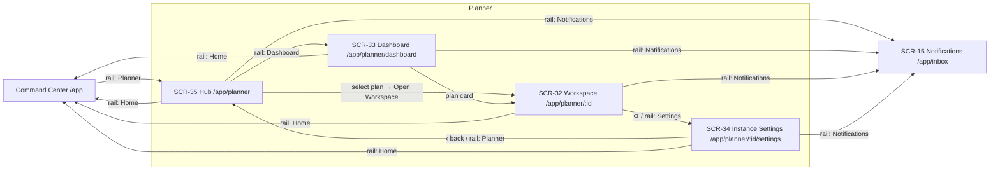

# Planner — Navigation Audit, Wireframes & Flow

> Companion to `planner.md`. Documents the now-functional left rail across SCR-32–35, the Operator navigation model it reuses, and the gaps to close next. **No new destinations invented — every target is an existing `Pages/` screen / registry route.**

---

## 1. Navigation audit — Planner left rail (5 icons, identical on all 4 screens)

| Icon | Destination | Route | Purpose | Active on | Target file |
|---|---|---|---|---|---|
| `home` | Command Center | `/app` | Exit Planner → Operator home | — | `Command Center.v2.image-first.dc.html` |
| `calendar-range` | Planner Hub | `/app/planner` | Index of all plans | **SCR-35, SCR-32** | `SCR-35-Planner-Hub.dc.html` |
| `layout-dashboard` | Planner Dashboard | `/app/planner/dashboard` | Personal role dashboard | **SCR-33** | `SCR-33-Planner-Dashboard.dc.html` |
| `inbox` | Notifications | `/app/inbox` | Notification Center | — | `SCR-15-Notification-Center.dc.html` |
| `settings` | Instance Settings | `/app/planner/[id]/settings` | Members / access | **SCR-34** | `SCR-34-Planner-Instance-Settings.dc.html` |

**States (all icons):**
- **Default** — `--text-3` glyph, transparent background.
- **Hover** — `--muted-bg` background, `--text-2` glyph (`style-hover`).
- **Active / selected** — white glyph on `--action` (black) tile; carries `aria-current="page"`.
- **Keyboard** — each icon is a native `<a href>` (tabbable, Enter-activates); `aria-label` = full destination name; `title` = tooltip.

**Note on Workspace (SCR-32):** it has no dedicated rail icon — it's a *detail* of a plan, reached via **Hub → select plan → Open Workspace** or **Dashboard → plan card**. On Workspace the rail marks **Planner** active (its parent section). This is intentional: the rail reflects top-level sections, not leaf detail screens.

---

## 2. The Operator navigation model (verified, not invented)

Two rail patterns exist in the shipped app:

**A. Global Operator rail** (image-first screens, e.g. `SCR-20`): 7 icons —
`Command Center /app` · `Brands /app/brand` · `Shoots /app/shoots` · `Campaigns /app/campaigns` · `Assets /app/assets` · `Matching /app/matching` · `Preview /app/preview`.

**B. Scoped sub-rails** (newer sections): CRM screens (`Home · Organizations · People · Pipeline · Inbox`) and **Planner** (`Home · Planner · Planner Dashboard · Notifications · Settings`). Each keeps `Home` as the exit back to Command Center.

**The Planner correctly follows pattern B (a scoped sub-rail like CRM).** It is a multi-screen sub-app, so a section-scoped rail is the consistent choice — not a duplicate of the global 7-icon rail.

---

## 3. Wireframes — rail + states

```
RAIL (56px, all Planner screens)          STATES
┌────┐                                    default   ▫  --text-3 / transparent
│ i  │  logo                              hover     ▪  --muted-bg / --text-2
├────┤                                    active    ■  #fff on --action + aria-current
│ ⌂  │  Home        → /app
│ 📅 │  Planner     → /app/planner   ■(Hub, Workspace)
│ ▤  │  Dashboard   → /app/planner/dashboard  ■(SCR-33)
│ ✉  │  Notifications → /app/inbox
│ ⚙  │  Settings    → /app/planner/[id]/settings  ■(SCR-34)
└────┘
```

Per-screen active state:
```
SCR-32 Workspace   → 📅 Planner active
SCR-33 Dashboard   → ▤ Dashboard active
SCR-34 Settings    → ⚙ Settings active
SCR-35 Hub         → 📅 Planner active
```

---

## 4. Navigation flow



Requested map — `Hub → Dashboard → Workspace → Instance Settings → back` — is satisfied: rail moves between Hub/Dashboard/Settings; Workspace is entered by selecting a plan and left via ⚙/back; Home returns to the rest of the Operator app.

---

## 5. UX review

| Check | Finding | Action |
|---|---|---|
| **Dead links** | *Before:* all 5 rail icons were non-interactive `<div>`s. | ✅ Fixed — all are `<a href>` to real screens. |
| **Missing destinations** | Workspace has no rail icon (by design — it's a leaf); Home now present as the Operator exit. | ✅ Documented; Home added value. |
| **Duplicate navigation** | None within the rail. Hub ↔ Dashboard are distinct (all-plans index vs personal role view). | ✅ |
| **Confusing icons** | `calendar-range` (Planner) vs `layout-dashboard` (Dashboard) could read similar. | ⚠ Acceptable with tooltips + aria-labels; revisit if user testing flags it. |
| **Inconsistent active states** | *Before:* active existed but no `aria-current`; now consistent + accessible. | ✅ `aria-current="page"` on the active icon, every screen. |
| **Unnecessary clicks** | Reaching a plan still requires Hub → select → Open Workspace (2 taps). | Acceptable — matches the adaptive-panel model (select → preview → open). |

---

## 6. Gaps — missing Operator screens / routes (design next)

1. **Planner is not in the *global* Operator rail.** Pattern-A screens (SCR-20 etc.) show no Planner icon, so an operator on Command Center/Brands can't reach Planner from the rail. **Recommend: add a `calendar-range` "Planner" item (`/app/planner`) to the global Operator rail** and backfill it into the image-first screens. This is the single highest-value navigation fix.
2. **Rail inconsistency across the app** — pattern A (7-icon global) vs pattern B (5-icon scoped) coexist. Recommend a documented rule: global rail everywhere, with section context in a secondary strip — or standardize scoped sub-rails. Needs a product decision.
3. **No standalone global Settings/Account screen** — "Settings" in Planner is *instance*-scoped; there is no Operator-level account/org settings screen (⚪). Likely needed platform-wide.
4. **Unbuilt Operator screens already in the sitemap (⚪):** SCR-12 Product Catalog `/app/catalog`, SCR-13 Collections/Seasons `/app/collections`, SCR-14 Asset→PDP crops `/app/assets/pdp`, SCR-19 Event Management `/app/events` (paused).

---

## 6A. Global Operator rail — Planner integration (RESOLVED)

> Gap #1 above is now **closed**. Planner is a first-class item in the **global Operator rail**, discoverable from every image-first Operator screen.

**Decision (audited, not invented):**
- **Icon:** `calendar` (matches the Planner scoped-rail `calendar-range` family; the global rail's `ico()` tuple set uses the plain `calendar` glyph).
- **Label:** `Planner` · **Route:** `/app/planner` · **Target:** `SCR-35-Planner-Hub.dc.html`.
- **Order:** immediately **after Shoots** — Planner and Shoots are both the `production-planner` agent, so they sit together in the production cluster (`Home · Brands · Shoots · Planner · Assets · Campaigns · …`).
- **Active state:** only Planner screens (SCR-32–35) mark it active; on the image-first screens it renders default/inactive.
- **States:** default (`--color-text-secondary`), hover (`--nav-item-hover`/token), focus (native `:focus-visible` outline on the `<a>`), active (`--nav-item-active` bg + `--nav-item-active-text`). Real `<a href>` with `aria-label="Planner"`.

**Two rail dialects were reconciled (no new pattern introduced):**
- **K-dialect** (`navDef=[{k,l}]` + `NAVHREF` + `this.ico(k)`) — 9 files: Analytics, Assets, Brand List, Campaign Performance, Campaigns, Channel Preview, Matching, Shoot Detail, Shoots List. Planner inserted into `navDef`, `NAVHREF`, and a `calendar` glyph added to each `ico` map that lacked it (Campaigns + Shoot Detail already had it).
- **key-dialect** (`navDef=[{key,label,href}]`): Command Center.v2 (desktop rail **+ mobile "More" sheet**) and Brand Detail.v2 (`navDef` + `NAVHREF` + `ico`).

**Scope notes:**
- **Onboarding.v2 / Shoot Wizard.v2** intentionally have **no global rail** (focused single-task flows) — correctly left untouched.
- The **scoped Planner sub-rail inside SCR-32–35 is preserved** unchanged; the global-rail item is additive, not a replacement.

**Global-rail position (wireframe):**
```
┌────┐
│ i  │
├────┤
│ ⌂  │ Home       /app
│ ▦  │ Brands     /app/brand
│ 📷 │ Shoots     /app/shoots
│ 📅 │ Planner    /app/planner   ← NEW (after Shoots; active only on SCR-32–35)
│ ▤  │ Assets     /app/assets
│ 📣 │ Campaigns  /app/campaigns
│ …  │ (screen-specific: Matching / Analytics / Preview / Activity)
└────┘
```

---

## 7. Recommended next design work (post-Planner)

**Highest priority — global rail integration (#1 above).** Cheap, unblocks discoverability of the entire Planner section, and enforces cross-app consistency. Do this before more Planner polish.

**Then, in order:**
1. **33/34/35 state matrices** — bring the other three Planner screens to SCR-32's loading/empty/error/read-only parity (design-lane, no blockers).
2. **Global Settings/Account screen** — the one clearly-missing platform surface (gap #3).
3. **Collections/Seasons (SCR-13)** — the most-referenced unbuilt Operator screen; production-planner-adjacent, so it composes with Planner.
4. **Open Linear PLN-009** for the Hub (SCR-35 has no backing issue) before any React work.

**Parked (backend-gated / do-not-design):** Phase-2 Photographer/Crew/Location 360° (schema-blocked); Campaigns/Products/Events/Contracts entity screens (explicitly out of scope until schema exists).
