# Planner Implementation Roadmap — SCR-32–35 → Production

**Date:** 2026-07-12 (v3 — revised per second external review)
**Status:** SUPERSEDED BY EXECUTION. This document is the pre-ladder proposal (§3/§4 below planned ~54 new tickets across Foundation/Screens/Security/Analytics/Testing/Documentation/Reliability epics). What actually shipped after review: **33 Linear issues created, then ladder-reviewed down to 10 active implementation tickets + 23 cancelled** (5 oversized parent trackers + 18 absorbed leaves — see `tasks/notes/july-12-session.md` for the consolidation pass). **Current live ticket state lives in [`../progress-tracker.md`](../progress-tracker.md) and [`../todo.md`](../todo.md), not in §3–§5 below.** No further Planner tickets should be created for v1 unless a real blocker appears — the AI/Cloudflare/Analytics/Reliability/extra-Documentation epics this doc originally planned stay unticketed by design.
**Scope:** Turn the frozen `.dc.html` prototypes (SCR-32 Workspace, SCR-33 Dashboard, SCR-34 Instance Settings, SCR-35 Hub, mobile gallery) into a real Next.js Operator feature, on top of the already-shipped Supabase schema/engine.
**Legend:** 🟢 verified and ready · 🟡 needs correction · ⚪ not started or deferred · 🔴 blocked or unsafe

## Revision note (v1 → v2 → v3)

**v1 → v2:** scored 93/100 — added shared components, API/Server Actions layer, hooks layer, and an up-front state-management decision, plus expanded AI/CopilotKit/Cloudflare, persona journeys, analytics, security, performance, documentation.

**v2 → v3:** scored 97/100 — this pass adds: a **Core Infrastructure** ticket (constants/query-keys/route-helpers) sequenced between the ADR and Shared Components; a dedicated **PlannerEngine Integration Layer** ticket (isolating DB↔engine type conversion, which was previously scattered across several tickets); explicit clarification that `IPI-NEW-3` **is** the repository layer (Supabase → Repository → Hooks → Components) rather than creating a duplicate ticket for the same concept; an **Offline Strategy** ticket (reconnect/retry-queue/stale-indicator/offline-banner); a promoted, standalone **Planner Context Builder** ticket (previously a bullet inside the AI section); Cloudflare tickets regrouped into Infrastructure/Deployment/Observability; an **Analytics pipeline ADR** (elevated from a "verify existing convention" note, since this pass confirmed no analytics tool is installed at all — a real choice, not a reuse decision); explicit team-composition assumptions on the critical path; CI bundle-size/perf-regression/a11y-regression checks added to Testing; and the `events` table's audit-log role restated explicitly in the Security ticket, not just the audit table.

**Two things this pass declined to add, with evidence:** a dedicated Storybook/component-playground task — **grep confirms no Storybook config or `.stories.*` file exists anywhere in this repo**; adding it now would be introducing new tooling with no current usage to build on, which is exactly the kind of speculative infrastructure this whole roadmap has otherwise avoided (see the Clone/Template/Version-History rejection below). A bespoke `PlannerErrorBoundary` component — Next.js's native per-route `error.tsx` convention already provides this natively; using it is one file, zero new dependencies, and (grep-confirmed) would be the **first** use of `error.tsx` anywhere in this app, so it's flagged as establishing a new convention, not "reusing an existing one." If a cross-cutting reason for a bespoke component surfaces later (e.g. needing the same error UI inside a client-only boundary that doesn't get route-level `error.tsx` coverage), revisit then.

**One place v2 pushed back and v3 still does:** the review's "Backend workflows" list included Clone Plan, Template Workflow, Version History, Undo, and Recovery workflows. **None of these appear anywhere in the frozen SCR-32–35 designs, the Linear epic's acceptance criteria, or the schema** (no version/history table exists; `instances` has no clone/duplicate concept in any doc read this session). Ticketing these now would be inventing product scope no design or stakeholder artifact supports — see §5 "Explicitly not ticketed" for the reasoning, and §10 for the recommended next step (a product/design decision, not an engineering guess).

---

## 1. Current-state audit

*(unchanged from v1 — still accurate; two additions below that matter for the new backend-workflow discussion in §5)*

### 1.1 What's actually shipped

| Layer | State | Evidence |
|---|:--:|---|
| **Supabase schema** (`planner.*`, 10 tables) | 🟢 Done, live | `supabase/migrations/20260709000000_planner_schema_rls.sql`. Confirmed live in project `nvdlhrodvevgwdsneplk`: all 10 tables exist, RLS enabled on all 10. 1179 orgs seeded with a default workflow (12,958 phase rows); **`instances`/`tasks`/`dependencies`/`assignments`/`events`/`view_configs` all have 0 rows live**. |
| **RLS policies** | 🟢 Solid, 🟡 one cleanup | 4-tier role hierarchy enforced via `planner.is_at_least()`/`is_assigned()`. 8 `SECURITY DEFINER` functions still `EXECUTE`-able by `anon` (cleanup ticket exists, §5 Supabase). |
| **Mutation API** | ⚪ Does not exist | No `create_instance`/`get_planner_*`/`check_gate` RPC exists anywhere. All mutations are direct table inserts, authorized by RLS. |
| **`instances.status` enum** | 🟢 Includes `archived`/`cancelled` | `planner.instance_status` (7 values) already includes `archived` and `cancelled` as real, schema-supported states — this is the "Archive workflow" the review asked about; it's a status transition, not new infrastructure (see §5). |
| **`events` table** | 🟢 Exists, read-only from client | Append-only, no user INSERT policy (`service_role` writes only). **This is already the audit-log primitive** the review asked about — no new "audit logs" infrastructure is needed, just a UI that reads and displays it (Activity tab, already speced on SCR-33/34/35). |
| **Realtime** | 🟢 Built, un-consumed | Private broadcast-channel pattern (`planner:<instance_id>`) on `instances`/`tasks`/`events`/`assignments`. |
| **Generated TS types** | 🟢 Done | `app/src/types/supabase.ts:40-544`. |
| **`PlannerEngine`** | 🟢 Done, tested, 🔴 unused | Pure class: `buildSchedule`, `shiftTask`, `detectCycles`, `checkGate`, `resolveDependencies`, `getEffectivePermissions`. 24 tests. Zero consumers. |
| **Mastra `production-planner` agent** | 🟡 Exists, wrong shape for Planner | Real agent, also the whole-app default fallback. 16 registered tools, zero Planner-specific ones. |
| **CopilotKit HITL** | ⚪ Zero prior art | No interrupt/render-and-wait pattern anywhere in the repo. |
| **Operator routes for Planner** | ⚪ None | No `app/src/app/(operator)/app/planner*`, no `app/src/components/planner/`. |
| **Cloudflare DO/Queue infra** | ⚪ Greenfield | No DO/Queue bindings configured yet; explicit project guidance says don't provision until the task starts. |
| **DC prototypes** | 🟢 Frozen, 🟡 3 small fixes | Per `design-audit.md`/`high-impact-verification.md`. |
| **No version/clone/template-management schema exists** | ⚪ Confirmed absent | No table resembling `plan_versions`, `plan_templates` (beyond the single seeded workflow template), or a clone/duplicate RPC exists anywhere in the migrations read this session. |
| **No `error.tsx` convention used anywhere in `app/`** | ⚪ Confirmed absent (v3) | `find app/src/app -iname "error.tsx"` → zero results. Next.js's native per-route error boundary has never been adopted in this codebase — recommending it for Planner establishes a new convention, not a reuse. |
| **No Storybook / component-playground tooling** | ⚪ Confirmed absent (v3) | No `storybook` in `app/package.json`, no `*.stories.*` files anywhere. |
| **No feature-flag system** | ⚪ Confirmed absent (v3) | No LaunchDarkly/Unleash/PostHog-flags or custom flag utility found in `app/src` or `package.json`. |
| **No analytics pipeline** | ⚪ Confirmed absent (v3) | No PostHog/Segment/Amplitude in `app/package.json`. Analytics for Planner is a genuine greenfield choice, not a "verify and reuse" situation (see §5 Analytics ADR). |

*(§1.2–1.6 — open PRs, duplicated responsibility, stale references, dependency corrections, IPI-526 status — unchanged from v1, omitted here for brevity; see git history of this file if needed.)*

---

## 2. Corrected dependency graph

```mermaid
flowchart TD
    subgraph Done["🟢 Done"]
        I476[IPI-476 Schema + Engine]
        I477[IPI-477 Timeline template]
    end

    subgraph SharedLayer["🟢 Shared layer, build ONCE before any screen"]
        ADR[State-mgmt ADR — first ticket, ~1 day]
        CORE["NEW (v3): Core Infrastructure — constants, query keys, route helpers"]
        ENGINE["NEW (v3): PlannerEngine Integration Layer"]
        REPO["Repository layer = IPI-NEW-3, clarified not duplicated"]
        SC[Shared Components]
        HOOKS[Hooks layer]
        API[API / Server Actions layer]
    end

    subgraph UIWork["🟢 Unblocked — UI track, consumes Shared layer"]
        F1[Foundation: routes/shell]
        I478[IPI-478 Workspace shell + views]
        I526[IPI-526 Hub]
        I479a[Dashboard]
        I479b[Settings/Invite]
        MOBILE[Tablet/mobile]
    end

    subgraph CrossCutting["🟢 NEW — cross-cutting, parallel with UI work"]
        SEC[Security hardening]
        ANALYTICS[Analytics]
        DOCS[Documentation]
    end

    subgraph SupaWork["🟢 Unblocked — Supabase track"]
        D1[RLS/security cleanup]
        D2[view_configs wiring]
        D3[Optimistic updates]
        D4[Realtime subscription hook]
    end

    subgraph CFWork["⚪ Defer until 480/481 actually begin"]
        I480[IPI-480 Realtime — DO presence half]
        I481[IPI-481 Notifications — Queue half]
    end

    subgraph AIGate["🔴 Gated by a DIFFERENT epic (IPI-486)"]
        M485[IPI-485 Mastra gateway cutover]
        I482[IPI-482 Planner AI tools]
    end

    subgraph Rejected["⚪ NOT ticketed — no design/schema basis"]
        CLONE[Clone / Template / Version-history / Undo / Recovery]
    end

    I476 --> I477 --> ADR
    ADR --> CORE
    CORE --> ENGINE & SC
    ENGINE --> REPO --> HOOKS
    SC --> HOOKS
    HOOKS --> API
    API --> F1
    F1 --> I478 --> MOBILE
    F1 --> I526
    F1 --> I479a
    F1 --> I479b
    HOOKS --> D4
    I476 --> D1
    I478 --> D2 & D3
    D4 --> I480 --> I481
    I478 --> SEC & ANALYTICS & DOCS
    M485 --> I482

    style AIGate fill:#3a1414,stroke:#c00
    style CFWork fill:#3a3414,stroke:#c90
    style Rejected fill:#1a1a1a,stroke:#555,stroke-dasharray: 5 5
```



**What changed from v1:** a new "Shared layer" sits between Done-schema and all UI work — this is the review's core correction, and it's right: building `PlannerCard`/`PlannerHeader`/hooks/API once, before 4 screens each invent their own, is cheaper than the alternative even though it adds ~1 week to the front of the timeline (see §8).

**What changed in v3:** Core Infrastructure and the PlannerEngine Integration Layer are now explicit nodes rather than implicit sub-steps buried inside other tickets — both can run in parallel with the start of Shared Components (they don't need to fully finish first), so this doesn't meaningfully lengthen the critical path beyond what v2 already accounted for (see §8's updated estimate).

---

## 3. Recommended epics and sub-issues (expanded)

| Epic | Scope | Status |
|---|---|:--:|
| IPI-484 | Planner parent epic | 🟢 existing |
| IPI-476/477 | Schema + engine, timeline template | 🟢 Done |
| **NEW (v3): Core Infrastructure** | Route/query-key constants, Planner-specific utilities not already in `PlannerEngine` | 🔴 create |
| **NEW (v3): PlannerEngine Integration Layer** | Isolates DB-row ↔ engine-type conversion; the single place that imports `PlannerEngine` | 🔴 create |
| **Repository layer = `IPI-NEW-3`** | Not a new epic — v2's "service layer" ticket already *is* the Supabase→Repository layer the review asked for; clarified in prose, not duplicated | 🟢 clarify only |
| **NEW: Planner Shared Components** | PlannerCard, PlannerHeader/Toolbar, PlannerFilters, PlannerStatusChip, PlannerProgress, Planner Empty/Loading/Error states | 🔴 create |
| **NEW: Planner Hooks** | `usePlannerInstance`, `usePlannerTasks`, `usePlannerPermissions`, `usePlannerRealtime`, `usePlannerFilters`, `usePlannerViewConfig` | 🔴 create |
| **NEW: Planner API Layer** | Server Actions + Route Handlers for mutations that must run server-side | 🔴 create |
| IPI-478 | Workspace shell + views (screens) | 🟡 split (unchanged from v1) |
| IPI-479 | Permissions data layer + Dashboard/Settings screens | 🟡 split (unchanged from v1) |
| IPI-480/481 | Realtime, Notifications — Cloudflare children now grouped Infrastructure/Deployment/Observability (v3) | 🟢 edit |
| IPI-482 | AI tools — phase 2, gated by IPI-485. Context Builder promoted to its own ticket (v3) | 🟡 edit + expand |
| IPI-483 | Workflow v2 — now explicitly covers Approval/Scheduling/Conflict-resolution "workflows" the review named | 🟢 edit (clarify, don't duplicate) |
| **NEW: Planner Security** | Permission-matrix tests, tenant isolation, rate limiting, secrets review, explicit audit-log statement (v3) | 🔴 create |
| **NEW: Planner Analytics** | Now an ADR first (v3 — no analytics tool exists in this repo, confirmed by grep), then event pipeline + core metrics | 🔴 create |
| **NEW: Planner Testing** | Elevates v1's Quality section to its own epic; persona journeys, perf, a11y, + CI bundle-size/perf-regression/a11y-regression checks (v3) | 🟢 create |
| **NEW: Planner Documentation** | One consolidated developer-docs ticket | 🔴 create |
| **NEW: Planner Performance** | Explicit numeric targets, folded into Testing epic rather than a separate epic (avoids over-fragmentation) | 🟢 create as ticket, not epic |
| **NEW (v3): Planner Reliability** | Feature flags (pending a decision — see §5), Offline strategy, `error.tsx` boundaries | 🔴 create |

---

## 4. Tasks to KEEP / EDIT / SPLIT / MERGE / CANCEL / CREATE

Same v1 decisions for IPI-476–483/526–528 (unchanged — see prior version). **Planned CREATE count at this draft stage: ~54.** **That is not what was built.** After drafting, 33 issues were actually created, then a ladder pass folded/cancelled the oversized ones — final state is **10 active implementation tickets, 23 cancelled for traceability** (see status banner above). The ~54-ticket epic breakdown below (separate Security/Analytics/Testing/Documentation/Reliability epics, a 3-way Cloudflare split) was replaced by a flat 10-ticket structure directly under IPI-478/479 — most of what's tabled in §3 as "NEW: create" either got folded into one of the 10 or stayed correctly unticketed (AI/Cloudflare/Analytics/Reliability — still gated on real blockers, per the status banner). **Clarified, not duplicated:** the "Repository layer" the second review asked for is `IPI-NEW-3`/IPI-538, already drafted in v1/v2 — renamed in prose, not re-created. **Explicitly NOT created:** Clone Plan, Template management (beyond the existing seed), Version History, Undo, Recovery (see §5's closing note); Storybook/component-playground and a bespoke error-boundary component (see the v3 revision note — native/existing alternatives cover both).

---

## 5. Exact Linear issue drafts (new/changed since v1)

*(v1's Foundation §5.0–5, Screens, and most Supabase drafts are unchanged and not repeated here — see the KEEP list. This section covers what's new in v2.)*

### NEW — sequenced first, before everything else

#### PLN-ADR1 · State management architecture decision

**Goal:** One documented, binding decision before any hook or screen is written.
**User story:** As any engineer touching Planner, I use the same data-fetching/caching library and selection-state pattern as everyone else, decided once, not re-litigated per screen.
**Scope:** Verify the existing app-wide convention (grep for `useSWR`/`useQuery`/`useState`-only patterns across `app/src`) — do not introduce a new library if one is already standard. Write a short ADR: chosen library, URL-driven selection-state pattern, `view_configs` persistence approach. Output is a markdown decision doc + a minimal hook skeleton, not a working feature.
**Out of scope:** Implementing the hooks themselves (next ticket).
**Dependencies:** None.
**Files likely affected:** `Universal-design-prompt-4/planner/adr-state-management.md` (new), `app/src/lib/planner/hooks/README.md` (new, one paragraph pointing at the ADR).
**Implementation steps:** 1) Grep existing convention. 2) Write ADR with the decision + one paragraph of reasoning. 3) Get it reviewed/signed off before Shared Components/Hooks tickets start.
**Acceptance criteria:** ADR merged; every subsequent hook ticket cites it instead of re-deciding.
**Testing/verification:** N/A — documentation artifact.
**Risks:** Low — the risk this ticket exists to prevent (4 screens, 4 different patterns) is exactly what it closes.
**Rollback:** N/A.
**Priority:** Urgent (blocks everything) · **Complexity:** XS · **Estimated effort:** 1 day
**Parent epic:** IPI-484
**Blocks:** every Shared Component/Hook/Screen ticket. **Blocked by:** nothing.

---

#### PLN-CORE1 · Core Infrastructure (constants, query keys, route helpers)

**Goal:** The small, boring, easy-to-forget building blocks every other Planner ticket assumes exist — named and built once instead of five engineers each defining their own `PLANNER_ROUTES` constant slightly differently.
**User story:** As an engineer building any hook, component, or screen, I import one canonical set of route paths, React Query key factories, and Planner-specific utility functions instead of re-deriving them.
**Scope:** Route path constants (`/app/planner`, `/app/planner/[id]`, etc. — as functions, not just strings, so `id` interpolation isn't repeated ad hoc); a query-key factory for whichever library `PLN-ADR1` selects (e.g. `plannerKeys.instance(id)`, `plannerKeys.tasks(id)`); any Planner-specific utility not already covered by `PlannerEngine`'s own helpers (`engine.ts` already has `addBusinessDays`/`toDateString` internally — do not duplicate those, only add what's genuinely missing, e.g. a permission-label formatter for UI display).
**Out of scope:** Anything `PlannerEngine` (`app/src/lib/planner/engine.ts`) already provides — this ticket wraps/references it, never reimplements its logic (see `PLN-ENGINE1` below for the boundary).
**Dependencies:** `PLN-ADR1` (needs the chosen query library to shape the key factory).
**Files likely affected:** `app/src/lib/planner/constants.ts` (new), `app/src/lib/planner/query-keys.ts` (new).
**Implementation steps:** 1) Audit what v1/v2's other tickets already assumed exists (route strings, key shapes) and consolidate. 2) Write typed constants + factory functions. 3) No component work — this is pure utility code.
**Acceptance criteria:** Every Planner route/query-key reference in every other ticket goes through this module; zero inline route-string literals in screen components.
**Testing/verification:** Unit tests for the query-key factory's shape (stable, serializable keys).
**Risks:** Very low.
**Rollback:** N/A — additive.
**Priority:** Urgent · **Complexity:** XS · **Estimated effort:** 1 day (can run in parallel with the start of Shared Components, not strictly serial)
**Parent epic:** Core Infrastructure
**Blocks:** Hooks, Shared Components (soft dependency — components can start against provisional constants and swap in). **Blocked by:** `PLN-ADR1`.

#### PLN-ENGINE1 · PlannerEngine Integration Layer

**Goal:** One place, and only one place, that imports `PlannerEngine` and knows how to convert Supabase row shapes into its input types and its outputs back into what the UI/repository layer needs — so engine-specific type-wrangling doesn't leak into every hook and component that touches scheduling.
**User story:** As an engineer building the Repository layer or a screen, I call `plannerEngineAdapter.buildSchedule(instance, phases)` and get back UI-ready data — I never construct a `PlannerPhase[]`/`CreateInstanceParams` by hand from a raw Supabase row.
**Scope:** A thin adapter module wrapping the 6 `PlannerEngine` methods (`buildSchedule`, `shiftTask`, `detectCycles`, `checkGate`, `resolveDependencies`, `getEffectivePermissions`), each taking real Supabase row shapes (from the generated `Database["planner"]` types) and returning engine types, or vice versa.
**Out of scope:** Persisting the engine's output (that's the Repository layer's job — see `IPI-NEW-3`); any new scheduling logic (the engine is frozen, tested, and pure — this ticket adapts to it, never modifies it).
**Dependencies:** `PLN-CORE1`.
**Files likely affected:** `app/src/lib/planner/engine-adapter.ts` (new), `.test.ts`.
**Implementation steps:** 1) For each of the 6 engine methods, write a thin wrapper converting `Database["planner"]["Tables"][...]["Row"]` shapes to/from the engine's own types (`app/src/lib/planner/types.ts`). 2) No business logic here — if you find yourself adding a conditional that changes scheduling behavior, that belongs in the engine itself (flag it, don't smuggle it into the adapter).
**Acceptance criteria:** `IPI-NEW-3` (Repository layer) and every screen that needs scheduling logic call this adapter, never `PlannerEngine` directly, and never hand-construct engine input types inline.
**Testing/verification:** Unit tests mirroring `engine.test.ts`'s scenarios, but asserting the adapter's row-shape conversion is correct — not re-testing the engine's own logic (that's already 24 tests deep).
**Risks:** Low — this is a translation layer, not new logic; the main risk is someone quietly adding real business logic here instead of in the engine, which the review process should catch.
**Rollback:** N/A — additive.
**Priority:** Urgent · **Complexity:** S · **Estimated effort:** 1-2 days (parallel with `PLN-CORE1`)
**Parent epic:** Core Infrastructure
**Blocks:** `IPI-NEW-3` (Repository layer). **Blocked by:** `PLN-CORE1`.

---

### Repository layer — clarified, not duplicated

`IPI-NEW-3` (drafted in v1/v2 as "Planner service/repository layer") **is** the Repository layer the second review asked for: `Supabase → IPI-NEW-3 (Repository) → PLN-H1 (Hooks) → Components`. Its scope already matches — typed wrapper functions per table, calling `PLN-ENGINE1`'s adapter rather than `PlannerEngine` directly (this one-word addition is the only change: `IPI-NEW-3`'s "Implementation steps" should read "wraps `PLN-ENGINE1`'s adapter" instead of "calls `new PlannerEngine()`" directly). No new ticket — renaming/re-scoping this existing one avoids the duplicate the review's language could otherwise produce.

---

### NEW — Shared Components (build before screens, per the review's core point)

#### PLN-SC1 · PlannerCard (generic card primitive)

**Goal:** One card component powering Hub's plan grid, Dashboard's recent-plans list, and (as a row variant) Kanban's task cards — instead of each screen hand-rolling its own.
**User story:** As an engineer building any of the 3 screens that show plan/task cards, I use one component with a variant prop, matching how `AssetCard`/`CampaignCard`/`ShootCard` already work in the main component library.
**Scope:** `PlannerCard` with `variant: "plan" | "task"` prop; real `<a>`/`<button>` root (not `<div onClick>` — the confirmed prototype bug, not to be repeated); status chip slot; risk/at-risk indicator slot.
**Out of scope:** Timeline bars, Calendar events (different enough shape to stay screen-local).
**Dependencies:** PLN-ADR1.
**Files likely affected:** `app/src/components/planner/planner-card.tsx`, `.module.css`, `.test.tsx`.
**Implementation steps:** Standard component build; reuse `StatusChip` (shared library) inside it, not a re-implementation.
**Acceptance criteria:** Used by Hub and Dashboard without modification beyond props; keyboard-operable from the start.
**Testing/verification:** Unit tests for both variants; visual snapshot.
**Risks:** Low.
**Rollback:** N/A — additive.
**Priority:** Urgent · **Complexity:** M · **Estimated effort:** 2 days
**Parent epic:** Planner Shared Components
**Blocks:** IPI-526, Dashboard ticket, Kanban ticket. **Blocked by:** PLN-ADR1.

#### PLN-SC2 · PlannerHeader + PlannerToolbar

**Goal:** One page-header + filter/action-toolbar pair shared by all 4 screens.
**Scope:** Reuses the shared `PageHeader` component underneath; `PlannerToolbar` wraps view-switcher (Workspace), filter chips (Hub), and per-screen primary action.
**Dependencies:** PLN-ADR1.
**Files likely affected:** `app/src/components/planner/planner-header.tsx`, `planner-toolbar.tsx`.
**Acceptance criteria:** Every screen's header/toolbar renders through this pair; no screen hand-rolls its own header markup.
**Priority:** High · **Complexity:** S · **Estimated effort:** 1-2 days
**Parent epic:** Planner Shared Components
**Blocks:** all 4 screen tickets. **Blocked by:** PLN-ADR1.

#### PLN-SC3 · PlannerFilters

**Goal:** Shared type/status filter-chip row (Hub's type filter, Dashboard's implicit "mine" filter).
**Dependencies:** PLN-ADR1; reuses shared `FilterBar` component underneath.
**Files likely affected:** `app/src/components/planner/planner-filters.tsx`.
**Acceptance criteria:** Real `<button>`s, `aria-pressed` on active chip (closes a gap the shared `FilterBar` itself has today — fix it there if touched, not just in the wrapper).
**Priority:** Medium · **Complexity:** S · **Estimated effort:** 1 day
**Parent epic:** Planner Shared Components

#### PLN-SC4 · PlannerStatusChip

**Goal:** Wraps the shared `StatusChip` with Planner's specific status vocabulary (`task_status`/`instance_status` enums) so every screen renders status identically.
**Dependencies:** PLN-ADR1.
**Acceptance criteria:** Single source of truth for status→color/label mapping — directly prevents the kind of conflicting-color-map bug found in the main component library audit (`ShootCard` vs `StatusChip` disagreeing on colors) from happening again in Planner.
**Priority:** Medium · **Complexity:** XS · **Estimated effort:** 4 hours
**Parent epic:** Planner Shared Components

#### PLN-SC5 · PlannerProgress

**Goal:** Segmented gate/phase progress indicator (Workspace's phase progress, Settings' step indicators if any).
**Dependencies:** PLN-ADR1; reuses shared `WizardStep`'s progress-bar pattern if applicable.
**Priority:** Low · **Complexity:** XS · **Estimated effort:** 4 hours
**Parent epic:** Planner Shared Components

#### PLN-SC6 · Planner Empty/Loading/Error states

**Goal:** Planner-specific copy wrapping the shared `EmptyState`/`SkeletonLoader` components — not new components, just Planner's own text/CTA content per screen.
**Dependencies:** PLN-ADR1.
**Acceptance criteria:** Every screen's empty/loading/error state is a thin wrapper over the shared components, matching the "reuse first" rule already established project-wide.
**Priority:** Medium · **Complexity:** S · **Estimated effort:** 1 day
**Parent epic:** Planner Shared Components

*(Note: the adaptive context panel and the gate-approval card were already drafted in v1 as `IPI-NEW-9` and `IPI-NEW-20` — they belong conceptually in this Shared Components epic too; re-parent them here rather than duplicating.)*

---

### NEW — Hooks layer (elevated to its own ticket group)

#### PLN-H1 · Planner data hooks

**Goal:** Name and build the specific hooks the review asked for, as one cohesive ticket (splitting into 6 separate tickets for what's fundamentally one cohesive module would over-fragment reviewable PRs the other direction).
**Scope:** `usePlannerInstance(id)`, `usePlannerTasks(instanceId)`, `usePlannerPermissions(instanceId)` (wraps `PlannerEngine.getEffectivePermissions`), `usePlannerRealtime(instanceId)` (= v1's `IPI-NEW-16`, cross-referenced not duplicated), `usePlannerFilters()`, `usePlannerViewConfig(instanceId)` (= v1's `IPI-NEW-14`, cross-referenced).
**Dependencies:** PLN-ADR1, IPI-NEW-3 (service layer).
**Files likely affected:** `app/src/lib/planner/hooks/*.ts` + tests.
**Acceptance criteria:** One hook per concern, each independently testable, each used by ≥2 screens (if a "hook" is only ever used by one screen, it's screen-local state, not a shared hook — don't manufacture false reuse).
**Testing/verification:** Unit test per hook.
**Risks:** Low.
**Rollback:** N/A.
**Priority:** Urgent · **Complexity:** M · **Estimated effort:** 3-4 days
**Parent epic:** Planner Hooks
**Blocks:** every screen ticket. **Blocked by:** PLN-ADR1, IPI-NEW-3.

---

### NEW — API / Server Actions layer

#### PLN-API1 · Planner Server Actions

**Goal:** Server-side mutation entry points for anything that shouldn't run as a pure client → Supabase call (email-sending invite, multi-table instance creation with partial-failure handling).
**User story:** As the Settings screen, inviting a member triggers a server action that sends an email and writes the assignment row atomically from the server's perspective, not two racy client calls.
**Scope:** `app/src/app/(operator)/app/planner/[instanceId]/actions.ts` (invite member, create instance, commit schedule change — reusing `IPI-NEW-3`'s service layer functions, not reimplementing them).
**Out of scope:** Any AI-related server action (phase 2, separate ticket).
**Dependencies:** IPI-NEW-3 (service layer), PLN-ADR1.
**Files likely affected:** `actions.ts` per route as needed.
**Implementation steps:** Standard Next.js Server Action pattern, matching `app/src/app/(operator)/app/brand/[id]/actions.ts`'s existing shape.
**Acceptance criteria:** No planner mutation that needs server-only capability (email, service-role writes to `events`) happens client-side.
**Testing/verification:** Unit tests per action.
**Risks:** Low — established pattern to copy.
**Rollback:** N/A.
**Priority:** High · **Complexity:** M · **Estimated effort:** 2-3 days
**Parent epic:** Planner API Layer
**Blocks:** Settings ticket (invite flow), Workspace shell (commit). **Blocked by:** IPI-NEW-3.

*(Route Handlers — a second sub-item the review asked about — are not needed today: no external webhook/cross-origin consumer of Planner data exists yet. Noted as ⚪ deferred, not created, until a real external consumer is identified — creating an unused API route would be speculative infrastructure.)*

---

### Backend "workflows" — clarified, not duplicated (per the review's request, cross-referencing what already covers each one)

| Review's workflow name | Where it actually lives | Status |
|---|---|:--:|
| Plan Creation Workflow | `IPI-NEW-3`'s `createInstance` (calls `PlannerEngine.buildSchedule()` then persists) | 🟢 already covered, just not labeled "workflow" |
| Approval Workflow | `IPI-483` (Workflow v2) + `IPI-NEW-19` (HITL gate card) together | 🟢 already covered |
| Scheduling Workflow | `PlannerEngine.buildSchedule()`, wrapped by `IPI-NEW-3`/`IPI-NEW-6` | 🟢 already covered |
| Dependency Resolution Workflow | `PlannerEngine.resolveDependencies()`/`detectCycles()`, wrapped by the same tickets | 🟢 already covered |
| Conflict Resolution Workflow | `PlannerEngine.shiftTask()`'s `conflicts` return, surfaced by `IPI-NEW-15` (optimistic updates) | 🟢 already covered |
| Notification Workflow | `IPI-NEW-24` (Queue-based fan-out) | 🟢 already covered (phase 2/3) |
| **Archive Workflow** | **Not yet ticketed — real gap.** `instance_status` enum already supports `archived`; needs a small UI action (Hub/Dashboard "Archive" button → status transition) + RLS check (who can archive — likely ≥manager). | 🔴 create, see below |
| Clone Plan Workflow | No schema, no design spec, no Linear AC anywhere | ⚪ **not ticketed** — see closing note |
| Template Workflow (beyond the seeded default) | No multi-template UI in any design file; only one workflow template (`5-Week Product Shoot`) is seeded | ⚪ **not ticketed** — see closing note |
| Version History Workflow | No version/history table exists; `events` gives an activity log, not versioned rollback | ⚪ **not ticketed** — see closing note |
| Undo Workflow | No undo concept in any design file or schema | ⚪ **not ticketed** — see closing note |
| Recovery Workflow | Overlaps with offline-reconnect conflict handling (already flagged as an open design question in `high-impact-verification.md`) — not a distinct backend workflow | ⚪ **not ticketed** — see closing note |

#### PLN-WF1 · Archive plan (instance) action

**Goal:** Let an owner/manager archive a completed or abandoned plan.
**Scope:** Status transition to `archived` via the existing enum; hide archived plans from the default Hub view (with a filter to show them).
**Dependencies:** PLN-API1, PLN-SC1.
**Acceptance criteria:** Archive/unarchive both work; RLS confirms only ≥manager can archive.
**Priority:** Low (small, real, but not launch-blocking) · **Complexity:** XS · **Estimated effort:** 1 day
**Parent epic:** IPI-483

---

### Persona-based Playwright journeys (replaces v1's single generic journey ticket)

**CI additions (v3, folded into `IPI-NEW-31` performance ticket rather than a new one):** bundle-size check (fail if any Planner route's client bundle grows past a set threshold without an explicit justification in the PR), a11y-regression check (axe-core in CI on every Planner screen, not just a manual pass), and performance-regression check (Lighthouse or equivalent budget on the Timeline view specifically, since it's the one screen genuinely at risk of the 500+ task stress-test scenario already flagged as an open question).

#### PLN-Q3a · Owner/Admin journey suite

**Scope:** Create plan (⚠️ still has no documented step-by-step design walkthrough anywhere — write the test only after that gap is closed, don't test against an undocumented flow) → invite users → assign tasks → approve gates → complete plan.
**Priority:** High · **Complexity:** M · **Estimated effort:** 2-3 days (pending the design-walkthrough gap being closed first)
**Parent epic:** Planner Testing

#### PLN-Q3b · Photographer/Crew journey suite

**Scope:** Open plan → view assignments → complete task → (upload asset — out of scope if Planner doesn't own asset upload; confirm against `IPI-248` Assets scope before including) → request approval.
**Priority:** Medium · **Complexity:** M · **Estimated effort:** 2 days
**Parent epic:** Planner Testing

#### PLN-Q3c · Client Approver journey suite

**Scope:** Review → approve → discard (not "reject" — the platform's established contract is Approve/Edit/Discard, never invent a Reject action) → comment (⚠️ no commenting feature exists in any SCR-32–35 design — confirm this is in scope before writing the test, or drop it).
**Priority:** Medium · **Complexity:** S-M · **Estimated effort:** 1-2 days (pending the commenting-feature scope question)
**Parent epic:** Planner Testing

#### PLN-Q3d · Producer/Manager journey suite

**Scope:** Delay task (Timeline shift) → resolve conflict → close milestone (⚠️ "milestone" isn't a schema concept — likely maps to completing all tasks in a phase; confirm mapping before writing the test).
**Priority:** Medium · **Complexity:** M · **Estimated effort:** 2 days
**Parent epic:** Planner Testing

*(Each of these has an explicit ⚠️ where the review's persona journey names a capability not confirmed in scope — flagging rather than silently assuming it exists, same discipline as the rest of this document.)*

---

### Analytics (new — now an ADR first, per the second review)

#### PLN-AN0 · Analytics pipeline decision (ADR)

**Goal:** Decide the analytics tool/approach before instrumenting anything — v2 said "verify the existing convention"; this pass confirmed by grep that **no analytics tool exists in this repo at all** (no PostHog/Segment/Amplitude in `app/package.json`), so this is a real greenfield choice, not a reuse decision, and deserves the same ADR treatment as state management.
**User story:** As any engineer instrumenting a Planner event, I emit to one decided destination, not a guess.
**Scope:** Evaluate: (a) a lightweight custom events table in Supabase (simplest, no new vendor, queryable with SQL the team already knows), (b) adding a real analytics vendor (PostHog is the most common self-hostable choice for a product at this stage, but this is a product/cost decision, not just engineering), (c) piggybacking on the `planner.events` table with an additional `analytics`-flavored event type. Recommend (a) or (c) as the lazy/correct default given zero existing vendor investment — but this is a real decision point, flag it for a quick sign-off rather than silently picking one.
**Out of scope:** Building the instrumentation itself (next ticket).
**Dependencies:** None — can run in parallel with `PLN-ADR1`.
**Files likely affected:** `Universal-design-prompt-4/planner/adr-analytics.md` (new).
**Acceptance criteria:** ADR merged with a named destination before `PLN-AN1` starts.
**Priority:** Medium · **Complexity:** XS · **Estimated effort:** half a day
**Parent epic:** Planner Analytics
**Blocks:** PLN-AN1. **Blocked by:** nothing.

#### PLN-AN1 · Planner analytics events + dashboard

**Goal:** Instrument the core metrics the review named: time-to-approval, task completion rate, blocked-task count, overdue %, cycle time, throughput. AI-usage/approval-rate metrics deferred to phase 2 alongside the AI features themselves.
**Scope:** Emit events at key transitions (task complete, gate approved, phase transition) into whichever destination `PLN-AN0` decides.
**Out of scope:** Deciding the pipeline (that's `PLN-AN0`, now resolved before this ticket starts, not left as a "verify" note during implementation).
**Dependencies:** `PLN-AN0`, `IPI-NEW-3`, screens landed (events fire from real user actions).
**Acceptance criteria:** Core 4-6 metrics visible somewhere (even a simple internal dashboard query, not necessarily new UI) before calling Planner analytics "done."
**Priority:** Medium · **Complexity:** M · **Estimated effort:** 3 days
**Parent epic:** Planner Analytics
**Blocks:** nothing. **Blocked by:** `PLN-AN0`, screens landing.

---

### Security (new, cross-referencing what already exists)

#### PLN-SEC1 · Planner security hardening pass

**Goal:** Close the gaps the review named that aren't already covered.
**Scope:** Permission-matrix tests (= `IPI-NEW-28`, cross-ref, not duplicated), tenant isolation (already enforced by `org_id` + RLS — add one explicit cross-org-leak test), rate limiting on the notification API/queue endpoints (new), a secrets review (likely N/A — Planner doesn't call any new external API beyond Supabase/Mastra, which already have secret handling; confirm and close, don't leave open speculatively). **Audit logging — explicit statement (v3):** `planner.events` (append-only, service-role-only writes) **is the audit log**. This ticket's job is to confirm the Activity tab (already speced on SCR-33/34/35) surfaces it correctly, not to design or build any new audit infrastructure — if a reviewer asks "where's the audit log," the answer is "already shipped in the schema, see `IPI-476`," not a new deliverable.
**Dependencies:** IPI-NEW-13 (RLS cleanup), IPI-NEW-28.
**Acceptance criteria:** One document listing each security concern the review raised, with either a passing test, a cross-reference to existing coverage, or an explicit "not applicable, here's why."
**Priority:** High · **Complexity:** M · **Estimated effort:** 2-3 days
**Parent epic:** Planner Security

---

### Documentation (new, consolidated — not 10 separate tickets)

#### PLN-DOC1 · Planner developer documentation

**Goal:** One consolidated handoff doc covering architecture, schema, API/hooks, components, and troubleshooting — sized as one ticket with a checklist of sub-sections, not ten standalone tickets (matching this project's own preference for fewer, cohesive docs over tracker sprawl, per `design-audit.md`'s own finding about doc fragmentation elsewhere in this project).
**Scope:** Architecture overview (cross-ref this roadmap + `planner-react-onboarding.md`), schema reference (cross-ref this audit's §1), component/hook API reference, deployment/rollout notes (cross-ref `IPI-NEW-32`).
**Priority:** Medium · **Complexity:** S · **Estimated effort:** 2 days
**Parent epic:** Planner Documentation

---

### AI / CopilotKit / Cloudflare — expanded sub-items (all still phase 2, gated by IPI-485; lighter detail since none of this is on the v1 critical path)

#### PLN-AI1 · Planner Context Builder (promoted to its own ticket, v3)

**Goal:** Assemble instance/task/permission state into the shape the Planner Mastra agent needs — kept separate from the agent/tools ticket because it's reusable across Mastra, CopilotKit, and eval, not agent-specific plumbing.
**Scope:** A function/module producing a structured context object from the current instance's tasks/phases/assignments (via `PLN-ENGINE1`'s adapter, not raw Supabase rows).
**Out of scope:** The agent/tools that consume it (`IPI-NEW-17`), any UI.
**Dependencies:** `PLN-ENGINE1`; gated overall by external `IPI-485` like the rest of this section.
**Priority:** Low (phase 2) · **Complexity:** M · **Estimated effort:** 2-3 days
**Parent epic:** IPI-482

**Rest of AI (children of IPI-482):** in addition to `PLN-AI1` and v1's `IPI-NEW-17` (Mastra tools) — Conversation history/memory (verify against the platform's existing Mastra memory feature, `IPI-132-135`, before building Planner-specific memory — likely reuse, not new), Suggestion engine (proactive "next best action" per CLAUDE.md's golden rule), Prompt templates, Context compression (only relevant at the 500+ task scale already flagged as an open stress-test question), AI safety/reasoning eval (folds into the existing `IPI-462` eval suite rather than a Planner-specific eval system), Agent telemetry (verify existing Mastra observability before building new).

**CopilotKit (children of IPI-482):** in addition to v1's `IPI-NEW-18` (frontend tools) — a shared Copilot provider is likely **already the app-wide `CopilotChatConfigurationProvider`** (confirmed in `operator-panel.tsx`) — verify before building a second one. Context injection/actions = the `useFrontendTool` pattern already drafted. Slash commands, conversation persistence/resume/pinning are **platform-wide CopilotKit features, not Planner-specific** — if wanted, they belong to a CopilotKit-platform epic, not the Planner epic; flagging so they don't get built twice (once "for Planner," once for real platform-wide later).

**Cloudflare (children of IPI-480/481) — regrouped into 3 phases (v3):**

| Phase | Tickets | Notes |
|---|---|---|
| **Infrastructure** | `IPI-NEW-22` (DO presence), `IPI-NEW-24` (Queue fan-out) | Provisioning the actual DO/Queue bindings — do this first, per project guidance not to provision speculatively |
| **Deployment** | `IPI-NEW-23` (WebSocket gateway), `IPI-NEW-25` (retry/DLQ) | Wiring the deployed infra into the app |
| **Observability** | `IPI-NEW-26` (monitoring) | AI Gateway observability and circuit breakers are **already owned by `IPI-463`** (separate MASTRA-EPIC) — do not duplicate; this ticket covers only the DO/Queue resources' own metrics |

KV caching, R2 attachments, cron jobs are **not currently justified by any Planner requirement found this session** (no file-attachment feature, no scheduled-job need identified in the design) — flagged as ⚪ speculative, not created, unless a real requirement surfaces. Rate limiting → folded into `PLN-SEC1` above rather than a separate Cloudflare ticket.

---

### Reliability (new, v3)

#### PLN-REL1 · Offline strategy

**Goal:** Close the gap between "optimistic updates" (already ticketed, `IPI-NEW-15`) and a full offline story: reconnect handling, a retry queue for actions attempted while offline, a stale-data indicator, and an offline banner.
**User story:** As a user who loses connectivity mid-edit, I see an honest "offline, changes queued" state, and my actions apply once reconnected rather than silently failing or duplicating.
**Scope:** Reconnect detection (browser online/offline events + a lightweight ping), a retry queue for failed mutations, a stale-data banner distinct from the sync-failed banner already in the state matrix (§6 of `planner-react-onboarding.md`).
**Out of scope:** Full offline-first architecture (service worker, local persistence) — not requested by any design doc; this is "handle brief disconnects gracefully," not "work fully offline."
**Dependencies:** `IPI-NEW-15` (optimistic updates), `IPI-NEW-16` (Realtime hook).
**Files likely affected:** `app/src/lib/planner/hooks/use-planner-connectivity.ts` (new).
**Acceptance criteria:** A simulated network drop during a task-shift shows the offline banner, queues the action, and applies it on reconnect without duplicating or silently dropping it. This directly closes the open design question flagged in `high-impact-verification.md` about offline-reconnect conflict handling.
**Testing/verification:** Simulated offline/online toggle in a Playwright test.
**Risks:** Medium — reconnect/retry-queue logic is a known source of subtle bugs (double-application, lost actions); test the negative paths explicitly, not just the happy path.
**Rollback:** Feature-flaggable if a flag mechanism exists (see `PLN-REL2` below) — otherwise ship behind a simple env check.
**Priority:** Medium · **Complexity:** M · **Estimated effort:** 3 days
**Parent epic:** Planner Reliability
**Blocks:** nothing. **Blocked by:** `IPI-NEW-15`, `IPI-NEW-16`.

#### PLN-REL2 · Feature flags — decision needed before ticketing further

**Goal:** Determine whether Planner needs incremental per-sub-feature rollout (Hub/Dashboard/Workspace/AI/Realtime independently toggleable) before building a flagging mechanism.
**Status:** ⚪ **Not confirmed as needed.** Grep confirms **no feature-flag system exists anywhere in this repo** today — no LaunchDarkly/Unleash/PostHog-flags, no custom flag utility. Building one is a real infrastructure investment, not a small addition, and nothing in the Linear epic or design docs states Planner needs staged rollout rather than a single cutover per screen (each screen already ships as its own PR/route, which is itself a form of incremental rollout).
**Recommendation:** Do not build a feature-flag system speculatively. If staged rollout is genuinely wanted (e.g. rolling Workspace out to 10% of orgs before 100%), that's a real requirement worth a short ADR of its own — first confirm the need, then decide build-vs-buy, rather than defaulting to "add flags" because it's generically good practice. Route-level shipping (each screen is its own PR behind its own route) already provides a coarse-grained version of this for free.
**Priority:** N/A until the need is confirmed · **Parent epic:** Planner Reliability

#### PLN-REL3 · Route-level error boundaries

**Goal:** Every Planner route fails gracefully instead of white-screening.
**Scope:** Standard Next.js `error.tsx` at `app/src/app/(operator)/app/planner/error.tsx` (and nested `[instanceId]/error.tsx` if instance-specific errors need different copy) — the framework-native mechanism, not a bespoke `PlannerErrorBoundary` component. **Note:** grep confirms zero `error.tsx` files exist anywhere in this app today — this establishes the pattern for Planner first; if it proves useful, it's a natural candidate to retrofit onto other routes later (out of scope for this ticket).
**Out of scope:** Retrofitting `error.tsx` onto non-Planner routes.
**Dependencies:** `IPI-NEW-1` (routes exist).
**Acceptance criteria:** A thrown error in any Planner route renders the standard error state (icon + message + retry) instead of Next.js's default error screen.
**Testing/verification:** Unit test forcing a render error, asserting the boundary catches it.
**Risks:** Very low — native framework feature, zero new dependencies.
**Priority:** Medium · **Complexity:** XS · **Estimated effort:** half a day per route segment
**Parent epic:** Planner Reliability
**Blocked by:** `IPI-NEW-1`.

---

### Explicitly not ticketed (the one place this revision disagrees with the review)

**Clone Plan, Template management beyond the seeded default, Version History, Undo, Recovery workflows.** These would be genuinely useful *product* features, but nothing in `SCR-32–35`, `planner.md`, the Linear epic's acceptance criteria, or the schema supports them today. Creating engineering tickets for them now would mean either inventing a design (risky — no stakeholder sign-off) or building infrastructure for a feature that might be designed differently once someone actually specs it. **Recommended path:** if these are genuinely wanted, raise them with product/design as new SCR-level design work first — the same discipline this whole project already applies everywhere else (`design-audit.md`, `high-impact-verification.md` both explicitly avoid recommending unrequested features). Once a design exists, this roadmap's own structure (Foundation → Shared Components → Screens) applies to them exactly the same way.

---

## 6. Recommended implementation order (revised)

```text
Day 1        PLN-ADR1 (state-mgmt decision) ∥ PLN-AN0 (analytics ADR) ∥ IPI-NEW-1 (routes/shell scaffolding, doesn't need either ADR)
Day 2-3      PLN-CORE1 (Core Infrastructure) ∥ PLN-ENGINE1 (PlannerEngine Integration Layer) — parallel with each other, both need only PLN-ADR1
Week 1        PLN-SC1-6 (Shared Components) — can start once Core Infra lands
             ∥ IPI-NEW-3 (Repository layer — now explicitly wraps PLN-ENGINE1, not PlannerEngine directly)
Week 2        PLN-H1 (Hooks) → PLN-API1 (Server Actions)
             ∥ IPI-NEW-5 (data contract) ∥ IPI-NEW-13 (RLS cleanup, trivial, anytime)
Week 3-5      Screens, in parallel lanes (unchanged from v1): IPI-478+views, IPI-526, Dashboard, Settings
             — now consuming PLN-SC1-6/PLN-H1/PLN-API1 instead of each inventing its own
             ∥ PLN-REL3 (error.tsx per route, trivial, can land alongside IPI-NEW-1)
Week 5        IPI-NEW-14/15/20 (view prefs, optimistic updates, commit service) ∥ PLN-WF1 (archive)
Week 6        IPI-NEW-12 (mobile/tablet) ∥ IPI-NEW-16 (Realtime hook) ∥ PLN-REL1 (offline strategy, needs 15+16 first)
Week 6-7      PLN-SEC1 (security) ∥ PLN-AN1 (analytics, needs PLN-AN0) ∥ persona journeys (PLN-Q3a-d)
Week 7        PLN-DOC1 (documentation) → IPI-NEW-32 (rollout plan) → SHIP v1

--- phase 2, gated by external IPI-485 ---
Phase 2       IPI-485 lands → IPI-482 + PLN-AI1 (Context Builder) + all AI/CopilotKit sub-items → Cloudflare Infrastructure → Deployment → Observability (IPI-NEW-22-26, now in 3 explicit phases)
Phase 3       IPI-483's remaining scope (auto-shift, approval v2) — after v1 proven in production
Deferred      Clone/Template/Version/Undo/Recovery — only after a product/design decision (see §5 closing note)
Not built     Storybook, feature-flag system — no current usage/need found; revisit only if a real requirement surfaces (see v3 revision note)
```

**Honest cost of this revision:** pulling Shared Components/Hooks/API forward (v2) plus Core Infrastructure/PlannerEngine Integration (v3) still adds roughly **1 week** to the front of the timeline compared to v1's plan — the v3 additions run in parallel with existing early-week work rather than serially extending it, so the total cost doesn't compound. That week buys eliminating 4x duplicated card/header/state-wrapper code across the screens, plus a single well-tested translation boundary around `PlannerEngine` instead of five ad hoc ones — the review's trade-off is the right one to take.

**Team composition assumption (v3 — made explicit per review):** the ~4-week estimate assumes roughly **2 frontend engineers + 1 backend/full-stack engineer + 1 reviewer**, working the parallel lanes in §7 concurrently. A single engineer working this roadmap alone should expect the full ~26-28 working days sequential, not 4 weeks.

---

## 7. Parallel work lanes (revised)

| Lane | Tickets | Can start |
|---|---|---|
| **Lane A — Foundation + ADRs** | PLN-ADR1, PLN-AN0, IPI-NEW-1 | Immediately |
| **Lane A1 — Core/Engine (NEW, v3)** | PLN-CORE1, PLN-ENGINE1 | After `PLN-ADR1` |
| **Lane A2 — Shared layer** | PLN-SC1-6, PLN-H1, PLN-API1, IPI-NEW-3/4/5 | After Lane A1 (components/hooks); Repository layer (`IPI-NEW-3`) needs `PLN-ENGINE1` specifically |
| **Lane B — Workspace views** | IPI-478, IPI-NEW-6/7/8/9 | After Lane A2 |
| **Lane C — Dashboard/Hub/Settings** | IPI-526, IPI-NEW-10/11, PLN-WF1 | After Lane A2, parallel with Lane B |
| **Lane D — Data/Realtime/Reliability (v3 expanded)** | IPI-NEW-13/14/15/16, PLN-REL1/REL3 | Parallel with B/C; `PLN-REL3` (error.tsx) can start as early as `IPI-NEW-1` |
| **Lane E — Cross-cutting** | PLN-SEC1, PLN-AN1, PLN-DOC1 | Parallel with B/C, converging by week 6-7 |
| **Lane F — Testing** | PLN-Q3a-d, IPI-NEW-27/28/30/31 | Continuous, converging week 6-7 |
| **Lane G — AI (phase 2)** | IPI-482, PLN-AI1, all AI/CopilotKit sub-items | Only after external IPI-485 |
| **Lane H — Cloudflare (phase 2/3, now 3 sub-phases)** | Infrastructure → Deployment → Observability (`IPI-NEW-22-26`) | After Lane D proves the data model |
| **On hold pending a decision** | `PLN-REL2` (feature flags) | Not staffed until the need is confirmed — see §5 |

---

## 8. Critical path (recomputed)

```
PLN-ADR1 (1d) → PLN-CORE1/PLN-ENGINE1 (parallel, ~2d) → PLN-SC1 (2d, longest shared component) → PLN-H1 (3-4d) → PLN-API1 (2-3d, can overlap with H1)
   → IPI-478 shell (3d) → IPI-NEW-6 Timeline (6d, longest view)
   → PLN-SEC1/PLN-Q3a-d (converge, ~3d) → PLN-DOC1 (2d) → IPI-NEW-32 rollout (2d) → SHIP
```

**≈ 27-29 working days sequential** (up ~1 day from v2's ~26-28, since Core Infrastructure/PlannerEngine Integration run in parallel with each other but add a small serial step before Shared Components can fully start), compressible to **~4 weeks calendar time** with the lanes in §7 properly staffed and the team composition assumed above (2 frontend + 1 backend + 1 reviewer).

**Still excludes all AI/Cloudflare-phase-2 work**, per the same reasoning as v1/v2. `PLN-REL1`/`PLN-REL3` (offline strategy, error boundaries) and `PLN-AN0`/`PLN-AN1` (analytics) are on the v1-ship critical path's cross-cutting lane, not the AI-gated phase-2 lane.

---

## 9. Production-readiness checklist (expanded)

```markdown
## Before Planner v1 ships
[... all v1/v2 items unchanged, plus (v3):]
- [ ] PLN-ADR1 state-management decision merged and followed by every hook/screen
- [ ] PLN-AN0 analytics-pipeline decision merged before any event instrumentation lands
- [ ] PLN-CORE1 (Core Infrastructure) merged — zero inline route-string literals in screen components
- [ ] PLN-ENGINE1 (PlannerEngine Integration Layer) merged — `IPI-NEW-3` and screens call the adapter, never `PlannerEngine` directly
- [ ] PLN-SC1-6 (Shared Components) merged and actually reused by all 4 screens (spot-check: no screen has its own duplicate card/header component)
- [ ] PLN-H1 (Hooks) merged
- [ ] PLN-API1 (Server Actions) merged
- [ ] PLN-WF1 (Archive) merged, or explicitly deferred with a stated reason
- [ ] PLN-REL1 (offline strategy) merged, or explicitly deferred with a stated reason
- [ ] PLN-REL3 (error.tsx per Planner route) merged
- [ ] PLN-SEC1 security pass complete (each named concern has a test, a cross-reference, or a documented N/A) — including the explicit "events = audit log, already shipped" statement
- [ ] PLN-AN1 core analytics events firing
- [ ] PLN-Q3a-d persona journeys passing (or the design gaps they surfaced — Create Plan walkthrough, commenting scope, "milestone" mapping — explicitly resolved first)
- [ ] PLN-DOC1 documentation merged
- [ ] Explicit, written decision on Clone/Template/Version/Undo/Recovery: either "out of scope for v1, revisit post-launch" or a real design brief exists — not silently ignored
- [ ] Explicit, written decision on PLN-REL2 (feature flags): either "not needed, route-level shipping suffices" or a confirmed real requirement with its own ADR
```

---

## 10. Missing tasks or architecture decisions (updated)

Carried forward from v1, plus new ones surfaced by this revision:

1. *(v1's items — persona→stat mapping, Calendar semantics, Create/Complete-Plan journeys, CopilotKit-interrupt-vs-Server-Action choice, Realtime-in-v1 decision, `production-planner` agent identity — all still open, unchanged.)*
2. **Whether Planner needs commenting at all** — `PLN-Q3c`'s persona journey named "comment" as a Client Approver action, but no SCR-32–35 screen shows a comment feature. Confirm before building.
3. **Whether "milestone" is a real Planner concept** — `PLN-Q3d` named "close a milestone," but the schema has phases/tasks, not milestones. Likely means "complete all tasks in a phase" — confirm the mapping rather than assume.
4. ~~Which analytics pipeline already exists app-wide~~ — **Resolved by v3's audit:** confirmed none exists; `PLN-AN0` now owns this as a real ADR decision rather than a "verify" note.
5. **The Clone/Template/Version/Undo/Recovery question** (§5's closing note) — needs an explicit product decision, not an engineering assumption either way.
6. **Whether Planner genuinely needs staged/feature-flagged rollout** (`PLN-REL2`) — confirmed no flagging system exists; needs a real requirement before any build decision, not a default "add flags" assumption.
7. **Whether the native `error.tsx` pattern established by `PLN-REL3` should be retrofitted onto other operator routes** — out of scope for this roadmap, but worth a note to whoever owns the broader app's error-handling consistency, since Planner will be the first screen family to use it.

---

## Final verdict (v3)

**Stage 1 (SCR-32–35 as production screens, now including Shared Components, Core Infrastructure, the PlannerEngine Integration Layer, and Reliability work):** 🟢 **Will succeed.** Critical path is ~4 weeks calendar time with a 4-person team (2 frontend + 1 backend + 1 reviewer) — the v3 additions (Core Infra, Engine adapter, Offline strategy, error boundaries) run largely in parallel with existing work and don't meaningfully extend v2's estimate.
**Stage 2 (AI/CopilotKit/Cloudflare, now with Context Builder promoted and Cloudflare split into 3 phases):** 🟡 **Will succeed, still gated by the external IPI-485/MASTRA-EPIC timeline** — none of the v3 restructuring changes that gating fact.
**Explicitly deferred, not failed:** Clone/Template/Version-History/Undo/Recovery (needs a product decision), feature flags (needs a confirmed requirement), Storybook (no current usage to justify it). None of these are blockers — they're honestly-labeled non-scope, which is the correct state for them to be in before someone asks for them.
